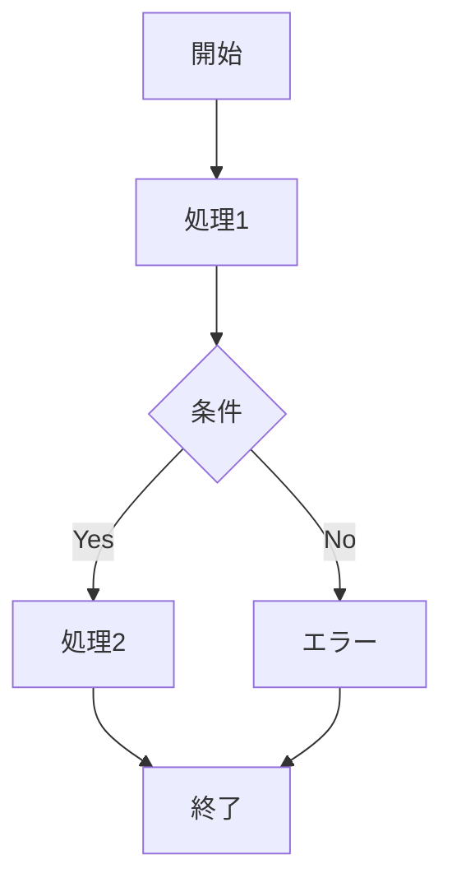
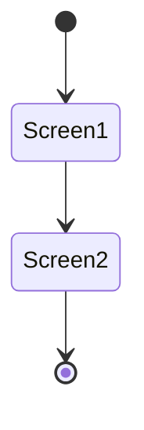
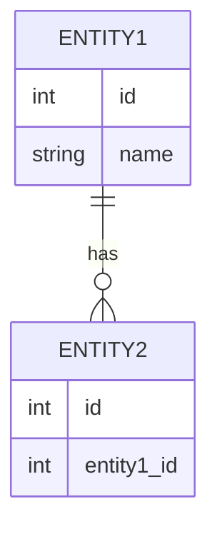

# 要件定義書.md テンプレート

このファイルは `requirements-spec-creator` エージェントの Phase 4 で使用されるテンプレートです。
`{placeholder}` をユーザーとの対話で収集した情報で埋めてください。

---

```markdown
---
title: "{機能名}"
created_date: {YYYY-MM-DD}
status: draft
---

# {機能名} - 要件定義書

## 1. 概要

### 1.1 背景
{このタスクが必要になった背景・経緯}

### 1.2 目的
{このタスクで達成したいこと}

### 1.3 スコープ
{このタスクの対象範囲}

## 2. ビジネス要件

### 2.1 ビジネス目標
{ビジネス上の目標}

### 2.2 対象ユーザー
| ユーザータイプ | 説明 |
|----------------|------|
| {タイプ} | {説明} |

### 2.3 期待される効果
- {効果1}
- {効果2}

## 3. ユースケース

### 3.1 ユースケース一覧
| ID | ユースケース名 | アクター | 優先度 |
|----|----------------|----------|--------|
| UC01 | {名前} | {アクター} | 高/中/低 |

### 3.2 ユースケース詳細

#### UC01: {ユースケース名}

**アクター**: {誰が}

**事前条件**:
- {条件1}

**基本フロー**:
1. {ステップ1}
2. {ステップ2}
3. {ステップ3}

**代替フロー**:
- {例外ケース1}

**事後条件**:
- {完了後の状態}

**ユースケース図** (optional):


## 4. 機能要件

### 4.1 機能一覧
| ID | 機能名 | 説明 | 優先度 |
|----|--------|------|--------|
| F01 | {機能名} | {説明} | 高/中/低 |

### 4.2 機能詳細

#### F01: {機能名}

**説明**: {詳細説明}

**入力**:
- {項目名}: {型} - {説明}

**出力**:
- {項目名}: {型} - {説明}

**処理フロー**:


**ビジネスルール**:
- {ルール1}
- {ルール2}

**バリデーション**:
| 項目 | ルール | エラーメッセージ |
|------|--------|------------------|
| {項目} | {ルール} | {メッセージ} |

**エラーケース**:
| エラー | 条件 | 対応 |
|--------|------|------|
| {エラー} | {条件} | {対応} |

## 5. 非機能要件

### 5.1 パフォーマンス要件
- レスポンスタイム: {目標値}
- スループット: {目標値}
- 同時接続数: {目標値}

### 5.2 セキュリティ要件
- 認証: {要件}
- 認可: {要件}
- データ保護: {要件}
- 入力検証: {要件}

### 5.3 可用性要件
- 稼働率: {目標値}
- 障害復旧時間: {目標値}

### 5.4 保守性要件
- ログ出力: {要件}
- 監視: {要件}
- ドキュメント: {要件}

### 5.5 互換性要件
- ブラウザサポート: {要件}
- APIバージョン: {要件}

## 6. UI/UX要件

### 6.1 画面設計要件
{画面に関する要件}

### 6.2 画面遷移


### 6.3 レスポンシブ対応
{レスポンシブに関する要件}

## 7. データ要件

### 7.1 データモデル概要


### 7.2 データ項目
| エンティティ | 項目名 | 型 | 必須 | 説明 |
|--------------|--------|-----|------|------|
| {エンティティ} | {項目} | {型} | ○/× | {説明} |

### 7.3 データ保持期間
| データ種別 | 保持期間 |
|------------|----------|
| {種別} | {期間} |

## 8. 外部連携

### 8.1 連携システム
| システム名 | 連携方法 | データ |
|------------|----------|--------|
| {システム} | {方法} | {データ} |

### 8.2 API仕様要件
{API連携の要件}

## 9. 制約条件

### 9.1 技術的制約
- {制約1}
- {制約2}

### 9.2 ビジネス上の制約
- {制約1}
- {制約2}

### 9.3 スケジュール制約
- {制約}

## 10. 想定される課題とリスク

### 10.1 技術的課題
| 課題 | 影響度 | 対応策 |
|------|--------|--------|
| {課題} | 高/中/低 | {対応策} |

### 10.2 ビジネスリスク
| リスク | 発生確率 | 影響度 | 対応策 |
|--------|----------|--------|--------|
| {リスク} | 高/中/低 | 高/中/低 | {対応策} |

## 11. 成功基準

### 11.1 受け入れ基準
- [ ] {基準1}
- [ ] {基準2}

### 11.2 KPI
| 指標 | 目標値 | 測定方法 |
|------|--------|----------|
| {指標} | {目標} | {方法} |

## 12. テストシナリオ

### 12.1 テスト観点
- [ ] 正常系: {シナリオ}
- [ ] 異常系: {シナリオ}
- [ ] 境界値: {シナリオ}
- [ ] セキュリティ: {シナリオ}
- [ ] パフォーマンス: {シナリオ}

## 13. 用語定義

| 用語 | 定義 |
|------|------|
| {用語} | {定義} |

## 14. 確認事項

### 14.1 確認済み事項
{ユーザーとの対話で確認した内容を記録}

- [x] {確認した事項1}: {回答内容}
- [x] {確認した事項2}: {回答内容}

### 14.2 未確認・保留事項
- [ ] {未確認の事項}

## 15. 参考資料

- {資料名}: {URL or 説明}

```
