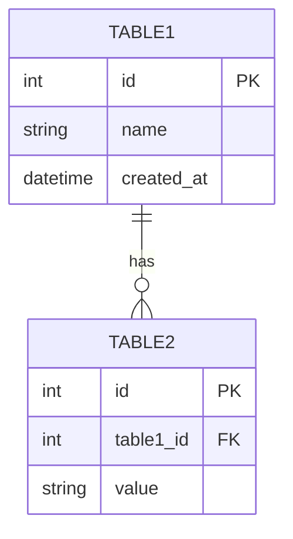

# SPEC.md テンプレート

このファイルは `requirements-spec-creator` エージェントの Phase 5 で使用されるテンプレートです。
`{placeholder}` をユーザーとの対話で収集した情報で埋めてください。

---

```markdown
# Feature: {Feature Name}

## Overview

{Brief description of the feature - 2-3 sentences}

## Objectives

- {Objective 1}
- {Objective 2}
- {Objective 3}

## User Stories

### US1: {User Story Title}
As a {user type}, I want to {action}, so that {benefit}.

**Acceptance Criteria:**
- [ ] {Criterion 1}
- [ ] {Criterion 2}

### US2: {User Story Title}
As a {user type}, I want to {action}, so that {benefit}.

**Acceptance Criteria:**
- [ ] {Criterion 1}
- [ ] {Criterion 2}

## Technical Requirements

### Functional Requirements
- **FR1:** {Requirement description}
- **FR2:** {Requirement description}

### Non-Functional Requirements
- **NFR1 - Performance:** {Requirement}
- **NFR2 - Security:** {Requirement}
- **NFR3 - Usability:** {Requirement}

## Implementation Approach

### Architecture

**System Architecture:**
```
┌─────────────────────────────────────┐
│         User Interface              │
├─────────────────────────────────────┤
│      Application Layer              │
├─────────────────────────────────────┤
│       Business Logic                │
├─────────────────────────────────────┤
│      Data Access Layer              │
├─────────────────────────────────────┤
│         Database                    │
└─────────────────────────────────────┘
```

**Component Diagram:**
```
{Describe main components and their relationships}
```

### Data Flow

```
User → Component A → Component B → Database
     ← Response   ← Process    ← Query Result
```

### API Design

#### Endpoint 1: {Endpoint Name}

**Request:**
```
Method: GET/POST/PUT/DELETE
Path: /api/v1/{resource}
Headers:
  - Authorization: Bearer {token}
  - Content-Type: application/json
Body (if applicable):
{
  "field1": "value1",
  "field2": "value2"
}
```

**Response:**
```json
{
  "status": "success",
  "data": {
    "id": 1,
    "field": "value"
  }
}
```

**Error Response:**
```json
{
  "status": "error",
  "code": "ERROR_CODE",
  "message": "Error message"
}
```

### Database Schema

#### Table 1: {table_name}

| Column | Type | Null | Default | Description |
|--------|------|------|---------|-------------|
| id | int | NO | AUTO_INCREMENT | Primary key |
| name | varchar(255) | NO | - | Name field |
| created_at | datetime | NO | CURRENT_TIMESTAMP | Creation timestamp |

**Indexes:**
- PRIMARY KEY: id
- INDEX: name

#### Entity Relationship Diagram



### Dependencies

**Internal Dependencies:**
- {Feature/Module 1}: {Description of dependency}
- {Feature/Module 2}: {Description of dependency}

**External Dependencies:**
- {Library/Service 1}: {Version and purpose}
- {Library/Service 2}: {Version and purpose}

### File Structure

```
internal/
├── {feature}/
│   ├── handler.go           # HTTP handlers
│   ├── handler_test.go
│   ├── service.go           # Business logic
│   ├── service_test.go
│   ├── repository.go        # Data access
│   ├── repository_test.go
│   ├── model.go             # Data models
│   └── errors.go            # Error definitions
```

## Test Scenarios

### Unit Tests
- [ ] Test 1: {Description} - {Expected behavior}
- [ ] Test 2: {Description} - {Expected behavior}

### Integration Tests
- [ ] Test 1: {Description} - {Expected behavior}
- [ ] Test 2: {Description} - {Expected behavior}

### E2E Tests
**Existing E2E tests**: {Phase 0.3 detection result or "None"}
**Run command**: {Detected command or "Not detected"}
- [ ] Existing E2E tests pass without regression
- [ ] Scenario 1: {User flow description}
- [ ] Scenario 2: {User flow description}

### Edge Cases
- [ ] Edge case 1: {Description and expected handling}
- [ ] Edge case 2: {Description and expected handling}

### Performance Tests
- [ ] Load test: {Scenario and acceptance criteria}
- [ ] Stress test: {Scenario and acceptance criteria}

## Security Considerations

- **Authentication:** {How authentication is handled}
- **Authorization:** {How authorization is enforced}
- **Input Validation:** {Validation rules and implementation}
- **Data Protection:** {How sensitive data is protected}
- **XSS Prevention:** {Measures taken}
- **SQL Injection Prevention:** {Measures taken}
- **CSRF Protection:** {Measures taken}

## Error Handling

### Error Codes

| Code | Description | HTTP Status | User Message |
|------|-------------|-------------|--------------|
| ERR_001 | {Description} | 400 | {User-friendly message} |
| ERR_002 | {Description} | 404 | {User-friendly message} |
| ERR_003 | {Description} | 500 | {User-friendly message} |

### Error Flow

```
Error Occurs → Log Error → Determine Error Type → Return Appropriate Response
```

## Performance Optimization

### Performance Goals
- Response time: < {X}ms for {Y}% of requests
- Throughput: > {X} requests/second
- Database query time: < {X}ms

### Optimization Strategies
- {Strategy 1}: {Description}
- {Strategy 2}: {Description}

### Caching Strategy
- {What to cache}: {Cache mechanism} - TTL: {duration}

## Success Criteria

- [ ] All functional requirements are implemented and tested
- [ ] All test scenarios pass
- [ ] Performance meets specified goals
- [ ] Security requirements are satisfied
- [ ] Documentation is complete
- [ ] Code review is completed
- [ ] {Additional criterion}

## Open Questions

> **Note**: 未解決の要件は sdd.yaml で `status: tbd` として管理されています。
> `/em-sdd:sdd.2-create-plan` の実行前に解決してください。

- [ ] {FR/NFR ID}: {title} - {tbd_reason}

## Implementation Phases (if applicable)

### Phase 1: {Phase Name}
**Goals:** {Phase goals}
**Deliverables:**
- {Deliverable 1}
- {Deliverable 2}

### Phase 2: {Phase Name}
**Goals:** {Phase goals}
**Deliverables:**
- {Deliverable 1}
- {Deliverable 2}

## References

- {Document name}: {Path or URL}
- {Related specification}: {Path}
```
