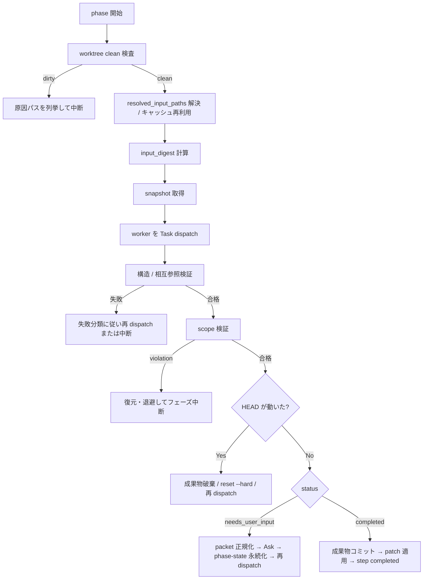
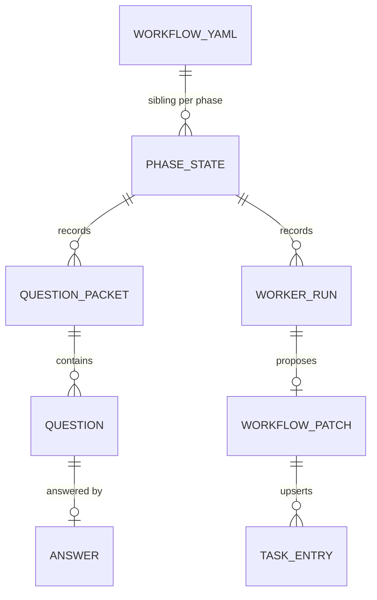

# em-workflow エージェント責務分離 - 要件定義書

## 1. 概要

### 1.1 背景

em-workflow プラグイン（現行 0.1.27）には、次の 3 つの構造的な問題がある。

1. `agents/` に置かれた 3 つの定義（`requirements-spec-creator` / `designer` / `implementation-planner`）が Task dispatch されず、`skills/develop/SKILL.md` の Step B から「定義ファイルを Read してインラインで従う」形で実行されている。designer は frontmatter に `AskUserQuestion` を持たず、本文で自律動作を三重に宣言し、「オーケストレーターが return 後に commit-docs.sh を実行する」というサブエージェント前提の契約を持つにもかかわらずインライン実行されている。`model` / `effort` の frontmatter も Task dispatch 時にしか効かない。
2. `references/workflow-schema.md` の Write ownership は「オーケストレーターのみが workflow.yaml を書く。ただし dispatch された upstream agent は例外」と書かれているが、当該 agent は dispatch されないため、この例外条項は発動しない条件で書かれている。
3. rework タスク合成の手順が `references/batch-mode.md` にしか存在せず、interactive 側の `references/review-phase.md` には手順が無い。`references/implement-phase.md` は「journal に未記録かつ `status != merged`」のタスクだけを起動対象にするため、既存タスクが全て merged のまま implement を pending に戻すと起動できるタスクが存在せず、implement フェーズが空回りする。これは設計論以前の実バグである。

### 1.2 目的

em-workflow の責務分離を次の形に統一する。

- オーケストレーター（`/em-workflow:develop`）は、状態遷移・ユーザー対話・workflow.yaml 更新・コミット・承認ゲートだけを持つ
- 調査・分析・文書執筆・計画立案はすべてサブエージェント（worker）が Task dispatch で実行する
- worker はユーザーに質問せず、質問が必要なときは構造化された question packet を返す
- workflow.yaml の変更を伴う worker は、直接書き込みではなく patch を提案する

### 1.3 スコープ

詳細仕様は `feature-docs/agent-separation/design-input.md`（設計書 rev13、2085 行）が SSOT。

**対象**

- `create-spec` / `design` / `create-plan` フェーズの Task dispatch 化
- question packet / answer / worker result / workflow patch / phase-state のスキーマ新設
- phase-state による対話状態の永続化と再開
- worker 出力検証スクリプトの同梱
- rework タスク合成の共通 SSOT 化（interactive / batch × review / verify の 4 経路）
- batch モードの gate ID ベース意思決定への移行（question packet で表現されるゲートに限る）

**非対象**

- `implement` フェーズのワークキュー方式（rework 再入場の事前条件のみ追加）
- `review` フェーズの perspective 選択・fan-out・auto-fix ループ（rework 分岐の参照先変更のみ）
- 既存 hook 6 種の判定ロジック
- `merge-task.sh` / `commit-docs.sh` の実装（呼び出し規約の追加のみ）
- `completed_at_commit` の意味論
- 既存 worker（implementer / reviewer / codex-reviewer / review-editor / gitignore-guard / git-setup-guard）の入出力形式

## 2. ビジネス要件

### 2.1 ビジネス目標

em-workflow を、責務境界が実行形態と一致した状態にする。定義と実行の乖離を解消し、対話状態を永続化して中断・再開に耐えるようにする。

### 2.2 対象ユーザー

| ユーザータイプ | 説明 |
|----------------|------|
| em-workflow 利用者（人間） | `/em-workflow:develop` を interactive で実行し、質問に回答して開発を進める |
| 無人実行の起動元 | `--batch` で外部サービス（Notion Webhook 等）から headless 起動する |
| プラグイン保守者 | 契約ドキュメントと検証スクリプトを SSOT として em-workflow を改修する |

### 2.3 期待される効果

- rework 経路の実バグ（implement 空回り）が 4 経路すべてで解消される
- worker 出力が機械検証され、目視によるスキーマ確認が不要になる
- create-spec / create-plan が中断後に phase-state から再開でき、回答済みの質問が再提示されない
- workflow.yaml の書き手がオーケストレーターに一元化され、所有境界が実装と一致する

## 3. ユースケース

### 3.1 ユースケース一覧

| ID | ユースケース名 | アクター | 優先度 |
|----|----------------|----------|--------|
| UC01 | interactive で create-spec を実行し、質問に回答して仕様を確定する | 利用者 | 高 |
| UC02 | create-spec の質問応答中に中断し、後から再開する | 利用者 | 高 |
| UC03 | create-plan で planner が返した workflow patch を検証して適用する | オーケストレーター | 高 |
| UC04 | review findings から rework タスクを合成し implement へ差し戻す | 利用者 / batch | 高 |
| UC05 | verify 失敗項目から rework タスクを合成する | 利用者 / batch | 高 |
| UC06 | rework が SPEC 変更を要すると判定され create-spec へ戻る | 利用者 | 中 |
| UC07 | `--batch` で全ゲートを gate ID ベースで機械的に解決して完走する | 無人実行の起動元 | 高 |
| UC08 | phase-state を持たない既存 feature を新フローで続行する | 利用者 | 中 |
| UC09 | worker dispatch 中に並行 merge が integration branch を進める | オーケストレーター | 中 |

### 3.2 ユースケース詳細

#### UC01: interactive で create-spec を実行し、質問に回答して仕様を確定する

**アクター**: 利用者

**事前条件**:
- integration worktree が clean である
- feature 名が確定している、または feature-identity ゲートで確定できる

**基本フロー**:
1. オーケストレーターが feature 名を確定し、integration branch / worktree と `phase-state/create-spec.yaml` を作る
2. `input_digest` を計算して requirements-analyst を Task dispatch する
3. analyst が `status: needs_user_input` と question packet を返す
4. オーケストレーターが packet を正規化・重複排除・優先順位付けし、AskUserQuestion で最大 3 問ずつ提示する
5. 回答を answer オブジェクトへ変換し、phase-state へ永続化する
6. analyst を再 dispatch し、`status: completed` になるまで 2〜5 を繰り返す
7. analyst の `resolved_requirements` を固定入力として spec-writer を dispatch し、REQUIREMENTS.md / SPEC.md を得る
8. 成果物を検証し、workflow.yaml を構築し、design system とコマンド承認のゲートを実行する
9. 成果物をコミットし、create-spec を `completed` にする

**代替フロー**:
- analyst が同じ質問を回答後も再生成した、または 2 回連続で `progress_fingerprint` が変化しない場合、`gate_id: create-spec.stalled` で「継続 / TBD 記録 / 中断」の 3 択を提示する
- 未解決事項を自動で assumption 化しない

**事後条件**:
- REQUIREMENTS.md / SPEC.md / workflow.yaml / phase-state が integration branch にコミットされている

#### UC02: create-spec の質問応答中に中断し、後から再開する

**アクター**: 利用者

**事前条件**: `phase-state/create-spec.yaml` が integration branch にコミットされている

**基本フロー**:
1. 再開時、記憶ではなく integration branch → workflow.yaml → phase-state → `input_digest` 再計算 → artifact 実体 → patch 適用状況の順に読む
2. phase-state の `status` に応じて再開点を決める（`awaiting_answers` なら未回答の question だけ再提示）

**事後条件**: 回答済みの質問が再提示されない

#### UC04: review findings から rework タスクを合成し implement へ差し戻す

**アクター**: 利用者 / batch

**基本フロー**:
1. review フェーズが `review.needs_rework = true` と `review.status = pending` を workflow.yaml へ直接書く
2. rework-planner を dispatch する
3. patch（tasks_patch + step_patches + preserve）を検証して適用する
4. implement を pending へ戻すのは 3 の patch 内で行う

**事後条件**:
- implement を pending へ戻す前に、pending の rework task が 1 件以上 workflow.yaml へ登録されている
- `workflow[implement].base_commit` が変更されていない

#### UC09: worker dispatch 中に並行 merge が integration branch を進める

**アクター**: オーケストレーター

**基本フロー**:
1. worker の変更集合を index + working tree の 2 層だけから算出する（HEAD 層を含めない）
2. 許可範囲を判定し、違反があれば復元・退避する
3. HEAD が動いていれば worker 成果物を破棄し、`reset --hard` で最新 tip へ同期して新しい `request_id` で再 dispatch する

**事後条件**: 並行 merge が scope violation として誤検出されない

## 4. 機能要件

### 4.1 機能一覧

| ID | 機能名 | 説明 | 優先度 |
|----|--------|------|--------|
| F01 | rework タスク合成の共通 SSOT | 4 経路が参照する rework 契約文書と、実装の空回り解消 | 高 |
| F02 | worker 共通エンベロープ | 新設・改修 5 worker の入出力形式 | 高 |
| F03 | question packet / answer | worker からの質問要求と、その回答の構造化形式 | 高 |
| F04 | question 解決 | interactive / batch 共通の重複排除・優先順位・batch フォールバック | 高 |
| F05 | phase-state | 対話と worker 実行状態の永続化・再開・exit 4 リカバリ | 高 |
| F06 | workflow patch | 限定操作の patch 形式と atomic apply | 高 |
| F07 | リビジョン識別 | `input_digest` による stale 判定と `completed_at_commit` の規範的定義 | 高 |
| F08 | design system の確定 | `project.design_system` の新設・確定・直積検査・backfill | 高 |
| F09 | 新規 worker 3 件 | requirements-analyst / spec-writer / rework-planner | 高 |
| F10 | 既存 worker 改修 2 件 | implementation-planner / designer の Task 化と構造化入出力 | 高 |
| F11 | フェーズプロトコル 2 件 | create-spec / create-plan のオーケストレーター手順 | 高 |
| F12 | 出力検証スクリプト | `scripts/validate-worker-output.py` と fixture | 高 |
| F13 | scope 検証 | dispatch 前後の snapshot 比較による許可範囲判定 | 高 |
| F14 | batch policies | gate ID ベースの batch 意思決定 SSOT | 高 |
| F15 | 既存 feature の互換性 | phase-state を持たない workflow.yaml の扱い | 中 |
| F16 | 参照更新と旧定義削除 | 旧 agent 名参照の一掃、`requirements-spec-creator.md` 削除 | 高 |
| F17 | 自動検証 | 契約と実装の一致を機械的に確認する検査群 | 高 |

### 4.2 機能詳細

各機能の詳細な入出力・スキーマ・不変条件は `design-input.md` の対応セクションに記載されている。

| 機能 | design-input.md の該当セクション |
|------|----------------------------------|
| F01 | 5.10、3.3、8.1 |
| F02 | 5.3、2.3 |
| F03 | 5.1、5.2 |
| F04 | 5.9 |
| F05 | 5.6（5.6.1〜5.6.4） |
| F06 | 5.5（5.5.1〜5.5.6） |
| F07 | 5.0（規則 R1 / R2） |
| F08 | 5.0 R1「design system の解決規則」、5.4.5、5.7 手順 11a、5.12 |
| F09 | 5.4.1、5.4.2、5.4.4 |
| F10 | 5.4.3、5.4.5 |
| F11 | 5.7、5.8 |
| F12 | 5.11.1、5.11.5 |
| F13 | 5.11.3 |
| F14 | 5.9「batch policies の対象範囲」 |
| F15 | 5.12 |
| F16 | 6.2、6.3、6.4 |
| F17 | 9.1 |

**処理フロー（worker dispatch の共通形）**:

**ビジネスルール**:

- worker は workflow.yaml を読み取り専用として扱い、git commit せず、AskUserQuestion を持たず、最終出力は単一の構造化オブジェクトとする
- AskUserQuestion の唯一の呼び出し元はオーケストレーターとする
- worker 出力をオーケストレーターが黙って修正してはならない（機械的な順序整形と digest 再計算を除く）
- 未解決事項を自動で assumption 化してはならない。ユーザーが明示的に選んだ場合だけ許可する

**エラーケース**:

| エラー | 条件 | 対応 |
|--------|------|------|
| transient | Task 失敗、応答途切れ | 同一入力で 1 回再 dispatch |
| stale | `input_digest` 不一致、HEAD 移動、`replace_authorized` の digest 不一致 | scope 検証手順を実行し、新 request ID で再 dispatch |
| correctable-schema | 必須フィールド欠落、未知 field | 検証エラー出力を添えて 1 回再 dispatch |
| scope violation | 許可外ファイル変更 | 復元・退避してフェーズ中断 |
| semantic invariant | task plan と files 不一致 | 具体的差分を添えて 1 回再 dispatch |
| repeated failure | 同じ失敗が 2 回 | step を failed または needs_update にし中断 |
| user-decision required | SPEC 変更、license 変更等 | question packet へ変換して Ask |
| irrecoverable | YAML 破損、必須入力消失 | 中断 |

## 5. 非機能要件

### 5.1 パフォーマンス要件

- design system 候補の `**/` glob は 1 回の phase run 内で解決結果を再利用する（`resolved_input_cache`）
- 候補解決の安全上限は 500 ファイルまたは合計 5 MB。超過時は interactive で手動指定を求め、batch は中断する

### 5.2 セキュリティ要件

- パスは project root からの相対へ正規化し、絶対パスは realpath 解決が project root 配下に containment される場合のみ受理する。`..` セグメントが生じるパスは拒否する
- containment はパスセグメント列で判定し、文字列 prefix 比較を使わない
- root 自体および配下の各セグメントが symlink である path は violation とする
- 比較は case-sensitive で行い、case-insensitive filesystem 上での正規化後衝突は violation とする
- batch の unlisted gate で option ID へ写像できない場合、仕様変更・セキュリティ・ライセンス・不可逆操作は中断する（fail-closed）
- Codex の出力は untrusted input として扱い、コマンド実行やファイル内容の verbatim 採用をしない

### 5.3 可用性要件

- 中断後に phase-state から再開できる（create-spec / create-plan の両方）
- `commit-docs.sh` の exit 4 に対し、phase-state 更新は 1 回再試行、worker 成果物コミットは連続 1 回まで再 dispatch する

### 5.4 保守性要件

- 各規則の SSOT を 1 箇所に固定し、他文書には要約と参照のみを置く
- 契約ドキュメントと Python 実装の一致は `references/fixtures/` で担保する
- 検証は目視ではなく `scripts/validate-worker-output.py` の終了コードで判定する

### 5.5 互換性要件

- phase-state を持たない既存 workflow.yaml を、上流 step の状態に応じて扱い分ける
- `project.design_system` を持たない既存 workflow.yaml を design / create-plan の直前に backfill する
- `schema_version` が未知の値（> 1）の phase-state はプラグインのバージョン不整合として中断する

## 6. UI/UX要件

CLI（Claude Code のスラッシュコマンドと AskUserQuestion）のみ。画面設計は対象外。

- 1 回の AskUserQuestion 呼び出しには最大 3 問、各問最大 4 option とする（packet 自体は 32 問まで許容し、UI 提示を小分けにする）
- `depends_on` がある質問は依存先の回答後まで提示しない

## 7. データ要件

### 7.1 データモデル概要

### 7.2 データ項目

| エンティティ | 項目名 | 型 | 必須 | 説明 |
|--------------|--------|-----|------|------|
| workflow.yaml | `project.design_system` | map | ○ | `kind`（project_native / em_workflow / none）と `paths` |
| phase-state | `status` | enum | ○ | initialized / dispatching / awaiting_answers / applying_patch / completed / failed |
| phase-state | `generation` | int | ○ | phase run の世代 |
| phase-state | `active_request_id` | string | ○ | 現在の worker run（null 可） |
| phase-state | `stale_redispatch_count` | int | ○ | 成果物コミット exit 4 による連続再 dispatch 回数（上限 1） |
| phase-state | `resolved_input_cache` | map | ○ | 動的入力の解決結果キャッシュ（初期値は空 map） |
| question packet | `packet_id` | string | ○ | `^[a-z][a-z0-9-]*-q[0-9]{4}$` |
| question | `gate_id` | string | ○ | batch policy との結合キー |
| answer | `source` | enum | ○ | user / batch-decision-table / batch-codex-consultation / batch-safe-default |
| workflow patch | `operation` | enum | ○ | replace_planning / append_rework |

### 7.3 データ保持期間

| データ種別 | 保持期間 |
|------------|----------|
| phase-state | integration branch の生存期間（feature 完了まで） |
| worker 出力の全文 | 保持しない（`worker_runs` は digest のみ） |

## 8. 外部連携

### 8.1 連携システム

| システム名 | 連携方法 | データ |
|------------|----------|--------|
| Codex CLI | `scripts/run_codex_exec.sh readonly` | batch の unlisted gate フォールバック相談 |

### 8.2 API仕様要件

なし（プラグイン内部のプロトコルのみ）。

## 9. 制約条件

### 9.1 技術的制約

- Python 3 + PyYAML が `scripts/validate-worker-output.py` の実行に必要。不在時は終了コード 2 で報告してフェーズを中断する
- `gio` は任意。不在時、scope violation で生じた untracked ファイルを削除も移動もせずフェーズを中断する
- JSON Schema evaluator は実装しない。検証規則を Python で直接記述する
- 新 worker の prompt に `# Task assignment` という見出しを使わない（`queue_agent_index.py` / `queue_launch_guard.py` の fallback と衝突するため）
- テストは Python 標準ライブラリ `unittest`、`tests/test_*.py` 規約に従う

### 9.2 ビジネス上の制約

- 段階移行ではなく一括実施のため、実装完了までの間 em-workflow は動作しない前提で進める。実装中にこのプラグイン自身を使って別の作業を回すことはできない

### 9.3 スケジュール制約

なし。

## 10. 想定される課題とリスク

### 10.1 技術的課題

| 課題 | 影響度 | 対応策 |
|------|--------|--------|
| worker 入力の陳腐化 | 高 | 規則 R1 の `input_digest` を dispatch 前後で比較 |
| worker dispatch 中の branch tip 移動 | 高 | scope 比較を先に行い、違反を除去してから refresh。scope 集合は index / working tree の 2 層のみから算出 |
| linked worktree が branch ref に追従しない | 中 | stale 処理で `reset --hard` を明示 |
| 成果物コミット時の exit 4 による成果物消失 | 中 | reset して再 dispatch に固定。成果物の再適用は試みない |
| 並行 merge の高頻度による再 dispatch ループ | 中 | 連続 1 回の上限と `stale_redispatch_count` の永続化 |
| 外部プロセスが integration worktree を直接変更 | 中 | 排他前提を規範として明記。許可範囲内で worker が `written_artifacts` に含めた変更は識別できない（snapshot 方式の原理的限界） |
| 契約ドキュメントと Python 実装の二重管理 | 中 | fixture で一致を担保し、SSOT を 1 箇所に固定 |
| phase-state の肥大化 | 低 | `worker_runs` は digest のみ保持 |

### 10.2 ビジネスリスク

| リスク | 発生確率 | 影響度 | 対応策 |
|--------|----------|--------|--------|
| 一括実施による不整合期間 | 高 | 高 | 実装完了まで em-workflow は動作しない前提で進める。旧参照の残存検査を完了条件に含める |
| 既存 feature の互換性 | 中 | 中 | runtime での互換規則として実装する（リポジトリ内のブランチ確認では他 clone や配布済みプラグインの feature を保証できないため） |

## 11. 成功基準

### 11.1 受け入れ基準

`design-input.md` 8.1〜8.9 が受け入れ条件の SSOT。要約すると次のとおり。

- [ ] 8.1 rework の空回りが 4 経路すべてで解消される
- [ ] 8.2 `agents/` 配下の全定義が Task dispatch され、旧 agent 名参照が残っていない
- [ ] 8.3 workflow.yaml を変更したコミットがすべてオーケストレーター起点である
- [ ] 8.4 create-spec に固定ラウンド上限が無く、自動 assumption 化がどのパスにも存在しない
- [ ] 8.5 batch のゲート集合が batch-policies.yaml と batch-mode.md の和集合で覆われ、AskUserQuestion が 1 回も呼ばれない
- [ ] 8.6 create-spec / create-plan の両方で中断後に再開でき、回答済みの質問が再提示されない
- [ ] 8.7 検証スクリプトと fixture が 5.11.5 の分岐を網羅し、valid は 0 / invalid は 1 を返す
- [ ] 8.8 stale 判定が `input_digest` の一致で行われ、`completed_at_commit` の意味論が変わっていない
- [ ] 8.9 scope 検証が index / working tree の 2 層だけから算出され、design system の全組み合わせが表で決まる

### 11.2 KPI

| 指標 | 目標値 | 測定方法 |
|------|--------|----------|
| `agents/*.md` と `subagent_type` 参照の集合一致 | 完全一致 | ファイル名集合と grep 結果の比較 |
| 旧 agent 名の残存 | 0 件 | `grep -rn "requirements-spec-creator\|Read してインラインで従う"` |
| fixture の判定 | valid=0 / invalid=1 全件 | `validate-worker-output.py` の終了コード |

## 12. テストシナリオ

### 12.1 テスト観点

- [ ] 正常系: 小さな feature を interactive で完走し、全フェーズが遷移する
- [ ] 正常系: 同じ feature を `--batch` で完走し、AskUserQuestion が 0 回
- [ ] 正常系: interactive / batch × review / verify の 4 経路で rework task が追加され implement が起動する
- [ ] 異常系: rework で SPEC 変更を選択し create-spec へ戻る
- [ ] 異常系: spec-writer に digest 不一致の既存 SPEC.md を渡して `blocked` になる
- [ ] 異常系: batch で digest 不一致の既存成果物に遭遇し `preserve_and_reuse` で分岐する
- [ ] 異常系: worker dispatch 中に別プロセスで integration branch を進め、scope 比較 → 復元 → refresh の順で処理される
- [ ] 境界値: fixture の valid / invalid、answer mode ごとの整合、`replace_all` の許可条件、必須 preserve 欠落
- [ ] 境界値: design system 候補が 500 ファイル / 5 MB を超えた場合の interactive / batch 分岐
- [ ] 再開: create-spec の質問応答中に中断して再開する
- [ ] 再開: create-plan の worker dispatch 中に中断して再開する
- [ ] セキュリティ: symlink 経由の root 外書き込みが violation として検出される

## 13. 用語定義

| 用語 | 定義 |
|------|------|
| worker | Task dispatch されるサブエージェント。本設計では新設・改修する 5 件を指す |
| 共通エンベロープ | 5 worker に適用する入出力の共通構造 |
| question packet | worker からオーケストレーターへ返す質問要求専用のオブジェクト |
| gate_id | question と batch policy を結合するキー |
| phase-state | 対話と worker 実行状態を永続化する feature-docs 配下の YAML |
| workflow patch | worker が提案する、workflow.yaml への限定操作の集合 |
| `input_digest` | worker 入力の陳腐化を判定する正規化 JSON の sha256 |
| scope 検証 | worker の変更集合が許可範囲に収まっているかの検査 |
| rework | review findings または verify failed items から追加タスクを合成し implement へ差し戻す経路 |
| backfill | `project.design_system` を持たない既存 workflow.yaml への値の補完 |

## 14. 確認事項

### 14.1 確認済み事項

- [x] feature 名: `agent-separation`
- [x] PyYAML 依存の扱い: 設計書 2.4 / 10.4 のとおり PyYAML を採用する。README の前提条件に追記し、`test/README.md` の「no external dependencies」記述は実行依存とテスト依存を区別する形へ更新する
- [x] `scripts/validate-worker-output.py` の自動テスト: `tests/test_validate_worker_output.py` を既存リポジトリ規約どおり追加し、その中から `references/fixtures/` の valid / invalid を実行して終了コードを検証する
- [x] 完了時の取り込み方針: integration ブランチを残す。`main` へのマージ・push・PR 作成は行わず、手動で動作確認してから取り込む（設計書 10.1 の一括実施リスクに対応）
- [x] design step: UI 要素が無いため `skipped`
- [x] `project.license`: LICENSE ファイルが存在しないため `none`
- [x] テストコマンド: `python3 -m unittest discover -s tests`（`test/README.md` の規約）
- [x] 詳細仕様の SSOT: `feature-docs/agent-separation/design-input.md`（`tmp/` は gitignore 対象のため feature-docs 配下へ取り込む）

### 14.2 未確認・保留事項

なし。

## 15. 参考資料

- 設計書（rev13、本 feature の詳細仕様 SSOT）: `feature-docs/agent-separation/design-input.md`
- 現行プラグイン構成: `em-workflow/` 配下の `skills/develop/SKILL.md` / `references/` / `agents/`
- テスト規約: `test/README.md`
