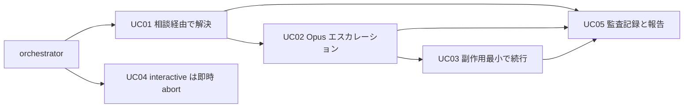
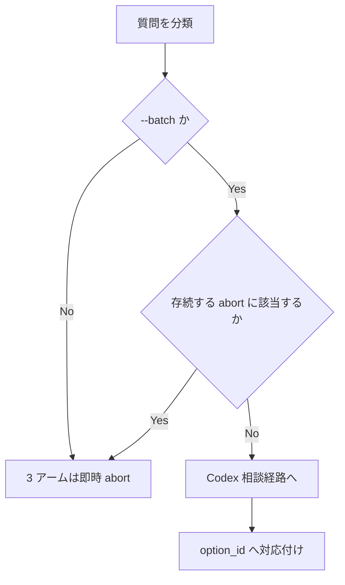
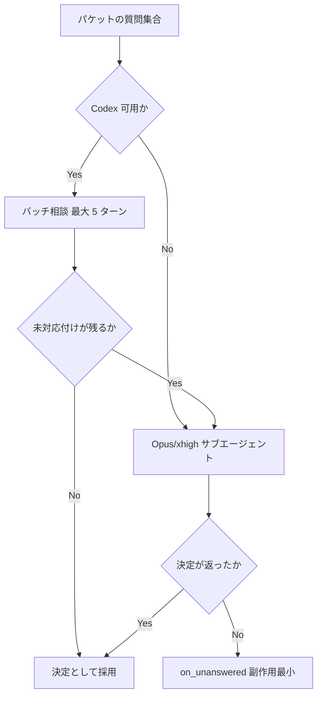

# batch-codex-autonomous-decisions - 要件定義書

## 1. 概要

### 1.1 背景

2026-09-04 18:39 JST、emterm のフィーチャー `ring-push-blank-clears-ridx-test` の
create-spec で、requirements-analyst が仮定 A3 に `reversible: false` を付けたため
fail-closed ゲートが即時中断した。

- `references/question-resolution.md` は、worker が不可逆と申告した質問について
  Codex 相談もポリシー参照も使えないと定めている。文書自身が「今は worker の申告以外に
  根拠が無い」と限界を認めている。
- チケットの申し送りに「不明瞭な点はセカンドオピニオンエージェントと議論して決定して良い」
  とあったが、orchestrator がそれを読む仕組みは無い。
- 結果として、人が Codex と議論して同じ決定を記録し、再実行しただけになり、無人実行の
  意味が薄れた。

`--batch` は無人で回す前提であるため、迷いを人に返さず、Codex と相談して比較的良いと
考えられる案を採用して進める。

### 1.2 目的

`--batch` 指定時、判断の迷いを Codex と相談のうえ自律的に決めて続行する。
`references/question-resolution.md` の即時 abort（`reversible: false`・
`category: security`・`category: license`）を batch では廃止し、Codex 相談で決定を
確定して先へ進む。決定と議論の要点は記録に残す。

### 1.3 スコープ

**対象**:

- `references/question-resolution.md` の Fail-closed classification、Precedence
  reservation、Unlisted-gate fallback の `block` 分岐、Batch resolution sequence
  step 2、Classification gate の記述変更
- `references/batch-mode.md`、`references/batch-policies.yaml`、
  `references/phase-state.md`、`references/batch-terminal-line.md`、
  `references/question-packet-schema.md` の該当箇所の更新
- `em-workflow/scripts/run_codex_exec.sh` へのプロバイダフォールバック連鎖の実装
- `scripts/validate-worker-output.py` のエラーメッセージ文言の変更
- `em-workflow/references/fixtures/` へのフィクスチャ追加と単体テストの更新
- プラグイン版番号の更新

**対象外**:

- ディスパッチャのプロンプト補強（loop-develop に別タスクで起票）
- interactive モードでの委任判定
- Notion その他の外部サービスに対する操作（`report_only` の回答により確定）

## 2. ビジネス要件

### 2.1 ビジネス目標

- 無人の `--batch` 実行が、worker による不可逆申告や security/license 分類を理由に
  停止しない。orchestrator が Codex（または Opus サブエージェント）に相談し、自らの
  判断で続行する。
- interactive 実行は現行の fail-closed 即時 abort をそのまま維持し、batch の緩和が
  有人経路を弱めない。
- 自律的に下した決定、採らなかった案、その理由が監査可能な記録として残り、run 報告が
  外部のタスク管理サービスへ運び出せる状態になる。

### 2.2 対象ユーザー

| ユーザータイプ | 説明 |
|----------------|------|
| `--batch` で em-workflow を無人実行する利用者 | 人が張り付かない状態で走行し、停止しないこと、および事後に決定内容を追跡できることを必要とする |
| interactive で em-workflow を実行する利用者 | 従来どおり fail-closed の即時 abort によって判断を差し戻される |
| em-workflow の保守者 | プロトコル文書の SSOT 構成とテストの整合を維持する |

### 2.3 期待される効果

- 不可逆申告・security・license を理由とする無人実行の停止が無くなる。
- 停止のたびに人が Codex と議論して同じ決定を記録し直す手戻りが無くなる。
- 自律決定の根拠が `batch-audit.yaml` と run 報告に残り、事後に検証できる。

## 3. ユースケース

### 3.1 ユースケース一覧

| ID | ユースケース名 | アクター | 優先度 |
|----|----------------|----------|--------|
| UC01 | batch で緩和対象の質問を相談経由で解決する | orchestrator | 高 |
| UC02 | 相談で決まらない質問を 1 回の Opus エスカレーションで決める | orchestrator | 高 |
| UC03 | 何も対応付かない場合に副作用最小の選択肢で続行する | orchestrator | 高 |
| UC04 | interactive で従来どおり即時 abort する | orchestrator | 高 |
| UC05 | 自律決定を監査記録に残し run 報告に含める | orchestrator | 高 |

### 3.2 ユースケース詳細

#### UC01: batch で緩和対象の質問を相談経由で解決する

**アクター**: orchestrator（`--batch` 指定時）

**事前条件**:

- `--batch` フラグが指定されている（workflow.yaml の `batch` ブロックではない）
- 質問が `category: security`、`category: license`、または `assumptions[]` の
  `reversible: false` エントリに名指しされている

**基本フロー**:

1. Fail-closed classification が当該の 3 アームで abort せず、質問を Codex 相談経路
   （Unlisted-gate fallback の相談手続き）に入れる。
2. 質問はパケット単位の 1 回のバッチ相談に合流する。turn-3 の軌道判断とパケット当たり
   5 ターンの上限は変更しない。
3. 相談結果を orchestrator が `option_id` へ対応付ける。
4. 対応付いた決定で続行し、監査記録を追記する。

**代替フロー**:

- Codex CLI が `unavailable` と判定された場合は、相談の代わりに Opus/xhigh の
  サブエージェント経路を実行する。
- ラッパーが使用上限応答や Vertex エラーを検出した場合は、ラッパー内部でプロバイダを
  切り替えて回答する。

**事後条件**:

- 質問が `option_id` に対応付き、run が継続している。
- `batch-audit.yaml` の `records[]` に 1 要素が追記されている。

#### UC02: 相談で決まらない質問を 1 回の Opus エスカレーションで決める

**アクター**: orchestrator（`--batch` 指定時）

**事前条件**: パケットの相談が終了し、`option_id` に対応付かない質問が 1 件以上ある

**基本フロー**:

1. 対応付かない質問を全件まとめ、1 回の Opus サブエージェントディスパッチに渡す。
2. ディスパッチは質問ごとに、選んだ `option_id` または明示的な「決定なし」を、その
   理由とともに返す。
3. 返された理由を記録する。

**代替フロー**:

- 「決定なし」が返った質問は UC03 へ進む。

**事後条件**: 各質問が決定または明示的な決定なしの状態になっている。

#### UC03: 何も対応付かない場合に副作用最小の選択肢で続行する

**アクター**: orchestrator（`--batch` 指定時）

**事前条件**: 相談でも Opus エスカレーションでも対応付けが得られなかった

**基本フロー**:

1. abort せず `on_unanswered` に落ちる。
2. `block` は成功経路上で副作用が最小の選択肢を採る（既存の unlisted-gate fallback の
   規則）。
3. 監査記録の `source` を `batch-safe-default` として追記する。

**事後条件**: run が継続し、採用した選択肢と採らなかった案が記録されている。

#### UC04: interactive で従来どおり即時 abort する

**アクター**: orchestrator（`--batch` 指定なし）

**事前条件**: `--batch` フラグが無い

**基本フロー**:

1. 3 つのアームはいずれもフェーズを即時に中断する。ポリシー参照の前、相談の前、
   `on_unanswered` を読む前、選択肢を選ぶ前に中断する。

**事後条件**: 挙動は変更前と同一で、新たな interactive の質問も増えていない。

#### UC05: 自律決定を監査記録に残し run 報告に含める

**アクター**: orchestrator（`--batch` 指定時）

**事前条件**: 緩和経路を通った解決が 1 件以上ある

**基本フロー**:

1. 解決 1 件ごとに `feature-docs/{feature}/phase-state/batch-audit.yaml` の
   `records[]` へ 1 要素を追記する（形式は `references/phase-state.md` が定義）。
2. `references/batch-mode.md` の `## Reporting` の必須内容として run 報告に含める。
3. 外部サービスへの中継はそのサービス側の役割とし、em-workflow は操作しない。

**事後条件**: 決定・不採用案・議論の要点が永続化され、報告に含まれている。

**ユースケース図**:

## 4. 機能要件

### 4.1 機能一覧

| ID | 機能名 | 説明 | 優先度 |
|----|--------|------|--------|
| FR1 | 3 つの fail-closed アームの batch 緩和 | `category: security`、`category: license`、`reversible: false` を batch では abort させず Codex 相談経路に入れる | 高 |
| FR2 | interactive の abort をそのまま維持 | `--batch` 以外では 3 アームとも従来どおり即時中断する。緩和条件は `--batch` フラグのみ | 高 |
| FR3 | batch でも存続する abort | 明示的 fail-closed ゲート枠、`rework.spec-change` 以外の `spec-change`、`gate_id`/`category` 不整合の両方向、Classification gate step-3 の origin 検証は両モードで abort | 高 |
| FR4 | Precedence reservation の書き換え | 「abort アームを先に評価し、abort は最終で上書き不可」を、緩和対象 3 アームについて interactive に限定する | 高 |
| FR5 | Classification gate direction 2 の同条件緩和 | direction-2 の category/不可逆チェックを FR1 と同条件で緩和し、abort ではなく相談へ回す | 高 |
| FR6 | direction 1 は fail-closed のまま | direction-1 の origin 所属チェックと不整合 abort は両モードで維持し、その分割を文書に明記する | 高 |
| FR7 | 相談のバッチングと上限は不変 | 緩和対象の質問はパケット単位の 1 回の相談に合流。turn-3 判断と 5 ターン上限は不変 | 高 |
| FR8 | 未対応付け分の 1 回の Opus エスカレーション | 相談終了時点で未対応付けの質問を全件まとめ、1 回の Opus ディスパッチで決定と理由を得る | 高 |
| FR9 | Codex 不在時の経路 | 可用性判定が `unavailable` の場合、`on_unanswered` へ直行せず同じ Opus/xhigh 経路を採る | 高 |
| FR10 | 対応付かない場合も abort しない | 相談でもエスカレーションでも決まらないときは `on_unanswered` に落ち、`block` は副作用最小の選択肢を採る | 高 |
| FR11 | `block` 分岐の記述書き換え | 「security/licensing/不可逆の質問はここに到達しない」を撤回し、2 モードの分岐を記す。spec-change の除外は別機構として維持 | 高 |
| FR12 | Batch resolution sequence step 2 の更新 | 「abort した質問は step 3 に到達しない」をモード条件付きに書き換える。Classification gate の Outcome step は再掲しない | 中 |
| FR13 | ラッパー内のプロバイダフォールバック連鎖 | `run_codex_exec.sh` が GPT → GLM5.2 (Vertex AI) → Muse Spark を実装し、上限応答と Vertex エラーを検出して透過的に切り替える | 高 |
| FR14 | 自律解決ごとの監査記録 | 解決 1 件ごとに `batch-audit.yaml` の `records[]` に 1 要素を追記し、決定・不採用案・議論の要点・相談の有無・フォールバックの有無・エスカレーションの理由を残す | 高 |
| FR15 | phase-state.md に本経路を writer として追加 | batch audit record の writer 一覧に本経路と `question_id` 規則、コミット到達点を追加する | 中 |
| FR16 | 報告内容の拡張、Notion は対象外 | `batch-mode.md` の `## Reporting` 必須内容と audit-item source map に本項目を追加する。外部サービス操作は行わない | 高 |
| FR17 | batch-policies.yaml ヘッダの書き換え | 「unchanged strength」の主張をやめ、batch の緩和と interactive の維持を記す。`rework.spec-change` の意図的非掲載は維持 | 中 |
| FR18 | `on_unanswered` 制約は維持、理由のみ書き換え | `question-packet-schema.md` の制約文は逐語で維持し、根拠の 1 文のみ書き換える | 中 |
| FR19 | バリデータの検査は維持、メッセージの根拠のみ書き換え | `BLOCKING_REQUIRED_CATEGORIES` と拒否条件は不変。エラーメッセージの括弧内の根拠のみ書き換える | 中 |
| FR20 | フィクスチャとバリデータ受理の確認 | `reversible: false` を含む question-packet フィクスチャを追加し、直接実行と一括走査の双方で exit 0 になる | 高 |
| FR21 | 文書ピンのアサーション | 書き換え後の文書が batch 経路を述べ、かつ interactive の abort を保持していることを検査する。削除される文のピンは同等の粒度で置き換える | 高 |
| FR22 | 終端行の理由コード維持、カバレッジのみ縮小 | `gate_fail_closed` を 11 コードの閉集合と停止点行に残し、カバレッジ記述のみ存続する abort に絞る | 中 |
| FR23 | プラグイン版番号の更新 | `em-workflow/.claude-plugin/plugin.json` とルートの `.claude-plugin/marketplace.json` を同じ新しい値に更新する | 中 |

### 4.2 機能詳細

機能要件は 5 つの群に分けて詳細化する。各群の見出しに、その群が含む機能要件 ID を示す。

#### G1: batch 緩和とルーティング（FR1・FR5・FR12）

**説明**: `--batch` 指定時、Fail-closed classification の 3 アームと Classification
gate の direction-2 の category/不可逆チェックが abort せず、Codex 相談経路
（Unlisted-gate fallback の相談手続き）へ質問を回す。Batch resolution sequence の
step 2 は、abort がモード条件付きであることを述べる形に更新する。

**入力**:

- `--batch` フラグ: boolean - 緩和の唯一の条件。workflow.yaml の `batch` ブロックは
  条件に用いない
- question packet: object - `category` と `assumptions[]`（`reversible` を含む）

**出力**:

- 質問の遷移先: `consultation`（緩和対象）または `abort`（存続する abort、interactive）

**処理フロー**:

**ビジネスルール**:

- 緩和は `--batch` フラグのみを条件とする（FR2）。
- 緩和対象は 3 アームと Classification gate の direction 2 に限る（FR1・FR5）。
- Classification gate の Outcome step を他文書で再掲しない（FR12・NFR1）。

**バリデーション**:

| 項目 | ルール | エラーメッセージ |
|------|--------|------------------|
| `category` | `spec-change` / `security` / `license` は `on_unanswered: block` を持つ（維持） | `validate-worker-output.py` の既存メッセージ（根拠部分のみ書き換え、FR19） |

**エラーケース**:

| エラー | 条件 | 対応 |
|--------|------|------|
| 対応付け不能 | 相談・エスカレーションのいずれでも `option_id` が決まらない | abort せず `on_unanswered` へ（FR10） |

#### G2: interactive の維持と存続する abort（FR2・FR3・FR4・FR6）

**説明**: `--batch` が無い実行では 3 アームとも従来どおり即時中断する。両モードで
存続する abort を明示し、Precedence reservation を書き換える。

**入力**: `--batch` フラグの有無、`gate_id`、`category`、`origin_id`

**出力**: 即時 abort、または分類の継続

**ビジネスルール**:

- interactive では、ポリシー参照前・相談前・`on_unanswered` 読み取り前・選択肢選択前に
  中断する（FR2）。
- 明示的 fail-closed ゲート枠、`rework.spec-change` 以外の `spec-change`、
  `gate_id`/`category` 不整合の両方向、Classification gate step-3 の origin 検証
  （不在・解決不能・非メンバー）は両モードで abort する（FR3）。
- Classification gate の direction 1 と不整合 abort は、orchestrator 保持データに対する
  整合性検査であり判断ではない。この分割を文書に明記する（FR6）。
- 経路化されたアームは、存続する abort を分類へ転換しない。これは両モードで成立する
  （FR4）。

**エラーケース**:

| エラー | 条件 | 対応 |
|--------|------|------|
| origin 検証失敗 | `origin_id` が不在・解決不能・非メンバー | 両モードで fail-closed abort（FR3・FR6） |
| `gate_id`/`category` 不整合 | 両方向のいずれか | 両モードで fail-closed abort（FR3） |

#### G3: 相談・エスカレーション・プロバイダ連鎖（FR7・FR8・FR9・FR10・FR13）

**説明**: 緩和された質問はパケット単位の 1 回の相談に合流し、決まらない分は 1 回の
Opus ディスパッチにまとめて委ねる。Codex CLI 不在時も同じ Opus 経路を採る。
プロバイダの切り替えはラッパー内部で完結させる。

**入力**:

- パケット内の質問集合: array
- Codex 可用性判定: `available` / `unavailable`
- ラッパー呼び出し: `readonly -C <root> <prompt>` 形式

**出力**:

- 質問ごとの `option_id`、または明示的な「決定なし」と理由
- 応答したプロバイダの識別（ラッパーの報告）

**処理フロー**:

**ビジネスルール**:

- turn-3 の軌道判断とパケット当たり 5 ターンの上限は不変。32 問のパケットでもラッパー
  起動は最大 5 回（FR7）。
- 未対応付けの質問は 1 回の Opus ディスパッチにまとめる。ディスパッチは決定または明示的な
  決定なしと、その理由を返す（FR8）。
- Codex 可用性が `unavailable` のときも `on_unanswered` へ直行しない（FR9）。
- ラッパーは GPT → GLM5.2 (Vertex AI) → Muse Spark を実装し、使用上限応答と Vertex
  エラーを検出して透過的に切り替える。プロトコル文書はプロバイダ名も機構も述べない
  （FR13・NFR4）。

**エラーケース**:

| エラー | 条件 | 対応 |
|--------|------|------|
| 使用上限応答 | 1 番目のプロバイダが上限に達した | ラッパーが 2 番目へフォールバック（FR13） |
| Vertex エラー | 2 番目のプロバイダがエラーを返した | ラッパーが 3 番目へフォールバック（FR13） |
| フォールバック対象外のエラー | 上記以外の失敗 | そのまま表面化させる（FR13） |
| 決定が得られない | 相談・エスカレーションとも不成立 | abort せず副作用最小の選択肢（FR10） |

#### G4: 記録と報告（FR14・FR15・FR16）

**説明**: 緩和経路を通った解決を `batch-audit.yaml` に追記し、run 報告の必須内容に
含める。外部サービスへの中継は行わない。

**入力**: 決定内容、不採用案、議論の要点、相談の有無、フォールバックの有無、
エスカレーションの有無と理由

**出力**: `feature-docs/{feature}/phase-state/batch-audit.yaml` の `records[]` への
追記 1 要素、および run 報告への記載

**ビジネスルール**:

- 記録形式は `references/phase-state.md` の batch audit record に従う。本書では形式を
  再掲しない（FR14・NFR1）。
- `source` は閉じた語彙から採る。相談結果が対応付いたときは `batch-codex-consultation`、
  副作用最小の分岐を採ったときは `batch-safe-default`（FR14）。
- `question_id` は、worker のパケットがあるときは質問自身の `question_id`、ゲートが
  orchestrator 起点のときは `gate_id` を用いる（FR15）。
- `batch-mode.md` の `## Reporting` 必須内容と `## Batch quiet output` の audit-item
  source map に対応する項目/行を追加する（FR16）。
- Notion その他の外部サービスに対する操作は行わない（FR16・A6）。

#### G5: 文書・バリデータ・検証・版番号（FR11・FR17・FR18・FR19・FR20・FR21・FR22・FR23）

**説明**: 変更が及ぶ各文書の該当箇所を書き換え、バリデータの挙動を変えずに根拠文言のみ
更新し、フィクスチャと文書ピンで検証し、版番号を上げる。

**入力**: 対象文書・スクリプト・フィクスチャ・テストのファイル群

**出力**: 書き換え後の文書、追加フィクスチャ、更新後のテスト、更新後の版番号

**ビジネスルール**:

- `block` 分岐は 2 モードの分岐を述べる。interactive では上流で abort 済み、batch では
  緩和経路からここに到達する。spec-change の除外は別機構として維持する（FR11）。
- `batch-policies.yaml` のヘッダは「unchanged strength」の主張をやめ、
  `references/question-resolution.md` をパスで参照し、ゲート内部を再掲しない。
  `rework.spec-change` の意図的非掲載は維持する（FR17）。
- `question-packet-schema.md` の制約文は逐語で維持し、根拠文のみ書き換える（FR18）。
- `validate-worker-output.py` は `BLOCKING_REQUIRED_CATEGORIES` と拒否条件を維持し、
  エラーメッセージの括弧内の根拠のみ書き換える。受理/拒否の挙動は変えず、凍結された
  gate registry 導出にも触れない（FR19）。
- フィクスチャは `em-workflow/references/fixtures/` の既存の kind/group/`valid-` 接頭辞の
  規約に従って追加する（FR20）。
- 削除される文に対する既存ピンは、新しい文言への肯定ピンと、旧文言が消えたことの否定証明に
  同等の粒度で置き換える（リポジトリの C5 規約、FR21）。
- `batch-terminal-line.md` は `gate_fail_closed` を 11 コードの閉集合と
  `fail-closed-abort` 停止点行に残し、カバレッジ記述のみ縮小する（FR22）。
- `plugin.json` と `marketplace.json` を同じ新しい値に更新する（FR23）。

**バリデーション**:

| 項目 | ルール | エラーメッセージ |
|------|--------|------------------|
| `on_unanswered` | `category` が `spec-change` / `security` / `license` の質問は `block` を持つ | 既存メッセージ（括弧内の根拠のみ書き換え） |

**エラーケース**:

| エラー | 条件 | 対応 |
|--------|------|------|
| フィクスチャ不受理 | 追加したフィクスチャが exit 0 にならない | 実装の誤りとして扱う（FR20） |
| ピンの失効 | 書き換えで既存ピンが対象文を失う | 削除せず同等粒度で置き換える（FR21・NFR9） |

## 5. 非機能要件

### 5.1 パフォーマンス要件

- レスポンスタイム: N/A — 応答時間の目標値を持つ実行時経路ではない。
- スループット: N/A — 同上。
- 同時接続数: N/A — 同上。
- 相談コストの上界（NFR6）: パケット当たりラッパー起動は最大 5 回、加えて Opus
  エスカレーションのディスパッチは最大 1 回。パケットの質問数に依存しない。

### 5.2 セキュリティ要件

- 認証: N/A — 認証境界を持たない。
- 認可: N/A — 認可境界を持たない。
- データ保護: N/A — 秘匿データを扱わない。
- 入力検証（NFR7）: Codex 出力および Opus サブエージェント出力は読むだけで、指示として
  実行せず、回答としてそのまま採用しない。質問ごとの対応付け判断は orchestrator が持つ。

### 5.3 可用性要件

- 稼働率: N/A — 常駐サービスではない。
- 障害復旧時間: N/A — 同上。
- 継続性（FR9・FR10・FR13）: Codex CLI 不在時は Opus/xhigh 経路、プロバイダ側の使用上限
  および Vertex エラー時はラッパー内フォールバック、いずれも決まらない場合は副作用最小の
  選択肢で継続する。

### 5.4 保守性要件

- ログ出力（NFR3・NFR5）: 存続する abort は理由と検討した根拠を記録し、緩和して継続した
  ものは決定根拠を記録する。誰も答えられない確認を batch 経路で発生させない。これらは
  永続化と報告で扱い、実行中に逐次出力しない。`EM_WORKFLOW_PROGRESS:` マーカー行および
  終端行の接頭辞・文法・値集合は変更しない。
- 監視: N/A — 監視対象の常駐プロセスを持たない。
- ドキュメント（NFR1・NFR2）: 緩和規則は
  `references/question-resolution.md` に一度だけ記す。`batch-mode.md`・
  `batch-policies.yaml`・`phase-state.md`・`batch-terminal-line.md`・
  `question-packet-schema.md` は再掲せず参照する。書き換えた文が `task00NN` 形式の識別子に
  規則を帰属させない。

### 5.5 互換性要件

- ブラウザサポート: N/A — ブラウザで動作する成果物を持たない。
- API バージョン: N/A — 公開 API を持たない。
- 語彙・レジストリの互換（NFR8）: 新しい `gate_id` を作らず、`batch-policies.yaml` の
  エントリも追加しない。`validate-worker-output.py` が契約文書の `## Gate identifiers`
  から導出する gate registry と、`gate-option-vocabulary.md` のゼロ行免除レジストリは
  そのまま有効であり続ける。
- 終端行の互換（FR22）: `gate_fail_closed` は 11 コードの閉集合に残り、既存の消費者が
  壊れない。

## 6. UI/UX要件

### 6.1 画面設計要件

N/A — 画面を持たない。プロトコル文書、1 本のシェルラッパー、バリデータのメッセージ文言、
フィクスチャ、単体テストのみを変更する。

### 6.2 画面遷移

N/A — 画面を持たないため画面遷移も存在しない。

### 6.3 レスポンシブ対応

N/A — 画面を持たない。

## 7. データ要件

### 7.1 データモデル概要

N/A — データベースを持たない。永続化先は
`feature-docs/{feature}/phase-state/batch-audit.yaml` のみで、その形式は
`references/phase-state.md` の batch audit record が定義しており、本書では再掲しない
（NFR1）。

### 7.2 データ項目

| エンティティ | 項目名 | 型 | 必須 | 説明 |
|--------------|--------|-----|------|------|
| batch audit record | `question_id` | string | ○ | worker のパケットがあれば質問の `question_id`、ゲートが orchestrator 起点なら `gate_id`（FR15） |
| batch audit record | `source` | string | ○ | 閉じた語彙。相談結果が対応付いたら `batch-codex-consultation`、副作用最小の分岐なら `batch-safe-default`（FR14） |
| batch audit record | `resolution_note` | string | ○ | ゲート、採用した選択肢、採らなかった案、議論の要点、Codex 相談の有無、フォールバックプロバイダの応答有無、Opus エスカレーションの実行有無とその理由（FR14） |

上記以外のフィールドは `references/phase-state.md` の定義に従う（NFR1）。

### 7.3 データ保持期間

| データ種別 | 保持期間 |
|------------|----------|
| batch audit record | N/A — フィーチャーの `feature-docs/{feature}/` 配下に残り続け、期限による削除は定めない |

## 8. 外部連携

### 8.1 連携システム

| システム名 | 連携方法 | データ |
|------------|----------|--------|
| Codex CLI | `em-workflow/scripts/run_codex_exec.sh` の `readonly -C <root> <prompt>` 呼び出し | 相談プロンプトと相談結果（FR13・A3） |
| GPT / GLM5.2 (Vertex AI) / Muse Spark | ラッパー内部のフォールバック連鎖。プロトコル文書はプロバイダ名も機構も述べない | 相談プロンプトと相談結果（FR13・NFR4） |
| Opus サブエージェント | Task ディスパッチ（Opus/xhigh） | 未対応付けの質問集合と、返却される決定および理由（FR8・FR9・A4） |
| Notion 等の外部タスク管理サービス | N/A — em-workflow は操作しない。run 報告の中継はそのサービス側の役割（FR16・A6） | — |

### 8.2 API仕様要件

N/A — HTTP API を提供も消費もしない。外部との接点はラッパースクリプトの起動と Task
ディスパッチに限られる。

## 9. 制約条件

### 9.1 技術的制約

- Codex CLI 不在時は Claude Code のサブエージェントを Opus/xhigh で実行する。
- Codex CLI があり GPT が上限に達している場合は GLM5.2 (Vertex AI)、Vertex AI が
  エラーの場合は Muse Spark と、2 段階のフォールバックを持たせる。
- 記録は `references/phase-state.md` の batch audit record の形式に従う。
- 緩和規則の単一情報源は `references/question-resolution.md` とする（NFR1）。
- 新しい `gate_id` を作らず、`batch-policies.yaml` にエントリを追加しない（NFR8）。
- `python3 -m unittest discover -s tests` が通ること。書き換えの影響を受ける文書ピンは
  削除せず同じ変更内で更新する（NFR9）。

### 9.2 ビジネス上の制約

- interactive モードの挙動を変えない。fail-closed の即時 abort は interactive にのみ
  残る。
- em-workflow の義務は run 報告までとし、外部サービスへの中継は行わない。

### 9.3 スケジュール制約

N/A — 期日の制約は与えられていない。

### 9.4 宣言された変更集合

このフィーチャー固有のパスは手動で列挙せず、create-plan で `workflow.yaml` の各タスクの
`files` から導出する（`references/phases/create-plan-phase.md`）。

**デフォルトメンバー**（SPEC作成者が明示的に除外しない限り、常に宣言に含まれる）:

- `feature-docs/{feature}/**`
- `test-docs/{feature}/**`

`feature-docs/{feature}/**` に含まれるもの: `REQUIREMENTS.md`、`SPEC.md`、
`IMPLEMENTATION.md`、`workflow.yaml`、`phase-state/`、`tasks/`、`reviews/roundN.yaml`、
`VERIFICATION.md`、`retrospect.yaml`、およびデザインステップが生成するデザイン成果物。
生成主体は各フェーズドキュメントおよび `references/phase-state.md` を参照（引用のみ、
ルールは再掲しない）。

`test-docs/{feature}/**` に含まれるもの: `{T}.tests.yaml`（パス形式:
`test-docs/{feature}/{T}.tests.yaml`）。生成主体は `implement-phase.md` を参照
（引用のみ、ルールは再掲しない）。

**意味論**:

- デフォルトのメンバーは、SPEC作成者が明示的に除外しない限り宣言に含まれる。除外は意図的な
  絞り込みであり、記載漏れによる省略ではない。
- この宣言はスーパーセット（superset）の主張であり、実際の変更集合は宣言に含まれる
  （CONTAINED IN）必要がある。実際には生成されないパスが宣言されていても違反にはならない。
  implementタスクを1つも生成しないフィーチャーは `test-docs/{feature}/` ディレクトリを
  生成しないが、宣言された `test-docs/{feature}/**` は依然として正しい。

### 9.5 前提（requirements-analyst が確定した assumption）

| ID | 前提 | 理由 | 影響度 | 可逆 |
|----|------|------|--------|------|
| A1 | Fail-closed classification の明示的 fail-closed ゲート枠は、両モードで無条件 abort を維持する | タスクが取り除く対象として挙げているのは 3 アームのみで、この一覧は現在ゼロ件のため、緩和しても今日の挙動は変わらず、予約された防御だけが失われる | 低 | 可 |
| A2 | `rework.spec-change` 以外の `category: spec-change` と、`gate_id`/`category` 不整合の両方向は、両モードで abort を維持する | 対応の整合性に対する検査であり判断ではない。タスクもこれらを挙げていない | 中 | 可 |
| A3 | フォールバック連鎖を追加するラッパーは `em-workflow/scripts/run_codex_exec.sh` であり、`question-resolution.md` が呼び出す `readonly -C <root> <prompt>` 形式を既に受け付ける | `question-resolution.md` の Codex 相談手続きがそのパスと呼び出し形式を名指ししている。スクリプト自体は今回の調査対象に含まれていなかった | 中 | 可 |
| A4 | Opus エスカレーションは Opus/xhigh の Task ディスパッチであり、`em-workflow/agents/` に専用のエージェント定義が必要かは計画に委ねる | タスクの制約はモデルと推論レベルを指定しているが実現手段は指定しておらず、既存のエージェント定義ファイルは今回の対象外だった | 低 | 可 |
| A5 | 新しい `gate_id` を作らず、`batch-policies.yaml` にもエントリを追加しない。緩和対象の質問は既に持っている `gate_id` をそのまま使う | 緩和が変えるのは分類ステップであってゲート語彙ではない。ゲート追加は凍結されたレジストリ導出と `gate-option-vocabulary.md` に波及する | 中 | 可 |
| A6 | Notion 連携は実装スコープ外であり、em-workflow の義務は run 報告で終わる | 回答 `requirement.notion-reporting-scope` = `report_only` により確定 | 低 | 可 |
| A7 | 版番号の更新は patch レベルとする | `core-plugin-version-bump.md` が挙動の修正は patch レベルであり大半がそれに当たると述べており、この変更は新しいプラグイン面を追加しない | 低 | 可 |
| A8 | 5 ターンの上限はラッパー起動数を数えるものであり、Opus エスカレーションのディスパッチはその上限の外で別に数える | `question-resolution.md` の上限はラッパー起動数で述べられており、回答 `requirement.escalation-subagent` はエスカレーションを相談終了後に置いている | 低 | 可 |

## 10. 想定される課題とリスク

### 10.1 技術的課題

| 課題 | 影響度 | 対応策 |
|------|--------|--------|
| ラッパーが `readonly -C <root> <prompt>` 形式を既に受け付けるかが未確認（A3） | 中 | 実装時にスクリプトを確認し、受け付けない場合は形式を合わせる |
| Opus エスカレーションに専用のエージェント定義が要るか未定（A4） | 低 | 実現手段の決定を計画フェーズに委ねる |
| ゲート語彙に触れると凍結レジストリ導出と `gate-option-vocabulary.md` に波及する（A5） | 中 | 新しい `gate_id` を作らず、`batch-policies.yaml` にもエントリを追加しない（NFR8） |
| 書き換えで既存の文書ピンが対象文を失う | 中 | 削除せず、新文言への肯定ピンと旧文言の否定証明に同等粒度で置き換える（FR21・NFR9） |

### 10.2 ビジネスリスク

| リスク | 発生確率 | 影響度 | 対応策 |
|--------|----------|--------|--------|
| 明示的 fail-closed ゲート枠まで緩めると、予約された防御が失われる（A1） | 低 | 低 | この枠は両モードで無条件 abort を維持する（FR3） |
| 整合性検査まで緩めると、判断ではない不整合が素通りする（A2） | 低 | 中 | `spec-change` の対応外れと不整合の両方向は両モードで abort を維持する（FR3・FR6） |
| batch の緩和が interactive の有人経路まで弱める | 低 | 高 | 緩和条件を `--batch` フラグのみとし、interactive の即時 abort を逐語で維持する（FR2） |
| 自律決定の根拠が残らず事後に追跡できない | 低 | 高 | 解決ごとに `batch-audit.yaml` へ記録し、run 報告の必須内容に含める（FR14・FR16・NFR3） |

## 11. 成功基準

### 11.1 受け入れ基準

- [ ] AC-1: `--batch` で、`category: security` の質問、`category: license` の質問、
      `reversible: false` の `assumptions[]` エントリに名指しされた質問が、いずれも
      即時 abort せず `question-resolution.md` の Codex 相談経路に入る。
- [ ] AC-2: 相談が決定に至らなかった場合も abort せず、既存の unlisted-gate fallback と
      同じ規則で、成功経路上の副作用最小の選択肢を採る。
- [ ] AC-3: 相談はパケット当たり 5 ターンの上限を保つ。終了時点で未対応付けの質問は、
      同じパケットの他の未対応付けの質問とともに 1 回の Opus サブエージェント
      ディスパッチにまとめられ、決定と理由の双方が返る。
- [ ] AC-4: Codex CLI が不在のとき、相談の代わりに同じ Opus/xhigh サブエージェント経路が
      走る。
- [ ] AC-5: GPT → GLM5.2 (Vertex AI) → Muse Spark の連鎖が
      `em-workflow/scripts/run_codex_exec.sh` に実装され、プロトコル文書はプロバイダを
      名指ししない。
- [ ] AC-6: 採用した決定、採らなかった案、議論の要点が
      `feature-docs/{feature}/phase-state/batch-audit.yaml` に `phase-state.md` の
      batch audit record の形で記録され、`batch-mode.md` の `## Reporting` 必須内容と
      audit-item source map に現れる。
- [ ] AC-7: interactive モード（`--batch` なし）は変わらない。3 アームとも即時 abort し、
      新しい interactive の質問も増えない。
- [ ] AC-8: Classification gate の direction-2 の category/不可逆チェックが batch で
      同条件に緩和され、direction-1 の origin 所属チェックと不整合 abort の両方向は
      両モードで fail-closed のまま残る。
- [ ] AC-9: `references/question-resolution.md`・`references/batch-mode.md`・
      `references/batch-policies.yaml` が更新され、abort が上書き不可であると述べている
      箇所（Precedence reservation と `block` 分岐の段落を含む）がすべて 2 モードの分岐を
      述べる形に書き換わっている。
- [ ] AC-10: `question-packet-schema.md` の `on_unanswered: block` 制約と
      `validate-worker-output.py` の `BLOCKING_REQUIRED_CATEGORIES` 検査は挙動が同一で、
      根拠の文章のみが変わっている。
- [ ] AC-11: `gate_fail_closed` が `batch-terminal-line.md` の 11 コードの閉集合に残り、
      `fail-closed-abort` 停止点行も残る。カバレッジ記述は存続する abort のみを挙げる。
- [ ] AC-12: `reversible: false` を含む question-packet フィクスチャが
      `em-workflow/references/fixtures/` 配下に存在し、`validate-worker-output.py` が
      受理する。文書ピンが batch 経路の記述と interactive の abort 保持を検査する。
- [ ] AC-13: `python3 -m unittest discover -s tests` が通り、`reference_impact` に
      挙がったピンはすべて削除ではなく更新されている。
- [ ] AC-14: `em-workflow/.claude-plugin/plugin.json` とルートの
      `.claude-plugin/marketplace.json` が同じ新しい版番号を持つ。

### 11.2 KPI

| 指標 | 目標値 | 測定方法 |
|------|--------|----------|
| N/A | N/A | N/A — 継続的に測定する数値指標は定義されていない。達成の判定は 11.1 の受け入れ基準と 12 章のテストシナリオによる |

## 12. テストシナリオ

### 12.1 テスト観点

- [ ] 正常系: 書き換え後の文書が batch 経路と interactive の abort をともに述べている
      こと（TS-1・TS-2・TS-3・TS-4）、各参照文書の該当箇所が更新されていること
      （TS-5・TS-6・TS-7・TS-8）、追加フィクスチャが受理されること（TS-10）、
      禁止されている識別子とプロバイダ名が文書に現れないこと（TS-12）。
- [ ] 異常系: `security` / `license` / `spec-change` の質問に `on_unanswered:
      record_tbd` を与えたときバリデータが exit 1 で拒否すること（TS-9）。ラッパーが
      使用上限応答で 2 番目、Vertex エラーで 3 番目のプロバイダへ落ち、フォールバック
      対象外のエラーは表面化すること（TS-11）。
- [ ] 境界値: パケット当たり 5 回のラッパー起動上限と 1 回のエスカレーション
      （FR7・NFR6）は文書上の規約であり、TS-1〜TS-12 に対応する実行テストは定義されて
      いない。
- [ ] セキュリティ: プロトコル文書がプロバイダを名指ししないことを検査する（TS-12・
      NFR4）。外部出力を指示として実行しない規律（NFR7）は文書上の規約であり、対応する
      実行テストは定義されていない。
- [ ] パフォーマンス: N/A — 負荷試験の対象となる実行時経路を持たない。

## 13. 用語定義

| 用語 | 定義 |
|------|------|
| batch / `--batch` | 無人実行を指定するフラグ。本フィーチャーの緩和は、このフラグのみを条件とする |
| interactive | `--batch` を指定しない実行。人が判断を返せる前提の経路 |
| Fail-closed classification | `references/question-resolution.md` の分類ステップ。特定の質問について phase を即時中断させる |
| Classification gate | `references/question-resolution.md` のゲート。direction 1 は origin 所属、direction 2 は category と不可逆性を検査する |
| Precedence reservation | `references/question-resolution.md` の段落。abort アームを先に評価し、abort を最終かつ上書き不可と定めていた |
| Unlisted-gate fallback | `references/question-resolution.md` の経路。Codex 相談手続きと、決まらないときの `on_unanswered` 分岐を持つ |
| batch audit record | `references/phase-state.md` が定義する記録形式。`feature-docs/{feature}/phase-state/batch-audit.yaml` の `records[]` の要素 |
| 文書ピン | 特定の文書に特定の文言が在る/無いことを検査する単体テスト |
| `on_unanswered` | 質問が未回答のときの扱いを示すフィールド。値の 1 つが `block` |
| `gate_id` | ゲートの識別子。`batch-policies.yaml` の参照キーでもある |

## 14. 確認事項

### 14.1 確認済み事項

- [x] design-step.recommendation: requirements-analyst の推奨（デザインステップの
      スキップ）をユーザーに確認せず採用する。
- [x] requirement.backend-fallback-chain: GPT → GLM5.2 (Vertex AI) → Muse Spark の
      連鎖はラッパースクリプトの内部に置き、上限応答と Vertex エラーを検出して透過的に
      プロバイダを切り替える。`question-resolution.md` は「ラッパーがフォールバック
      プロバイダから回答することがある」とだけ述べる。
- [x] requirement.classification-gate-scope: Classification gate の direction-2 の
      category/不可逆チェックを、Fail-closed classification と同条件で batch のみ
      緩和する。direction-1 の origin 所属と不整合 abort は触らない。
- [x] requirement.escalation-subagent: 既存のパケット当たり 5 ターンの上限を維持し、
      相談終了時に未対応付けの質問が残っていたら、それらをまとめて 1 回の Opus
      サブエージェントディスパッチにエスカレーションする。
- [x] requirement.gate-fail-closed-terminal-reason: `gate_fail_closed` の理由コードと
      停止点行を維持し、カバレッジの記述だけを batch で存続する abort（Classification
      gate の origin 所属と不整合 abort、および interactive 自身の abort）に絞る。
- [x] requirement.notion-reporting-scope: em-workflow の義務は `batch-mode.md` の
      Reporting セクションまでとする。自律解決を報告の必須内容に加え、Notion への中継は
      外部のタスク管理サービス側の役割とする。
- [x] requirement.on-unanswered-block-coupling: `question-packet-schema.md` の
      `on_unanswered: block` 制約と `validate-worker-output.py` の
      `BLOCKING_REQUIRED_CATEGORIES` 検査は変更せず、根拠の文章のみ書き換える。
- [x] requirement.verification-fixture-shape: `reversible: false` を含む question-packet
      フィクスチャを `references/fixtures/` 配下に追加して `validate-worker-output.py` が
      受理することを検査し、あわせて書き換え後の文書が batch 経路を述べ interactive の
      abort を保持していることを文書ピンで検査する。

### 14.2 未確認・保留事項

- なし — すべての機能要件・非機能要件が `status: resolved` であり、保留中の項目は無い。

## 15. 参考資料

- `em-workflow/references/question-resolution.md`: 緩和規則の単一情報源。Fail-closed
  classification、Precedence reservation、Classification gate、Unlisted-gate fallback、
  Batch resolution sequence
- `em-workflow/references/batch-mode.md`: `## Reporting` の必須内容と
  `## Batch quiet output` の audit-item source map
- `em-workflow/references/batch-policies.yaml`: ヘッダコメントと gate の決定表
- `em-workflow/references/phase-state.md`: batch audit record の形式と writer 一覧
- `em-workflow/references/batch-terminal-line.md`: 理由コードの閉集合と停止点表
- `em-workflow/references/question-packet-schema.md`: `on_unanswered` の制約
- `em-workflow/references/gate-option-vocabulary.md`: ゼロ行免除レジストリ
- `em-workflow/scripts/run_codex_exec.sh`: Codex 相談のラッパースクリプト
- `em-workflow/scripts/validate-worker-output.py`: worker 出力とフィクスチャの検証
- `em-workflow/references/fixtures/`: フィクスチャコーパス
- `.claude/rules/core-plugin-version-bump.md`: 版番号更新の規則
