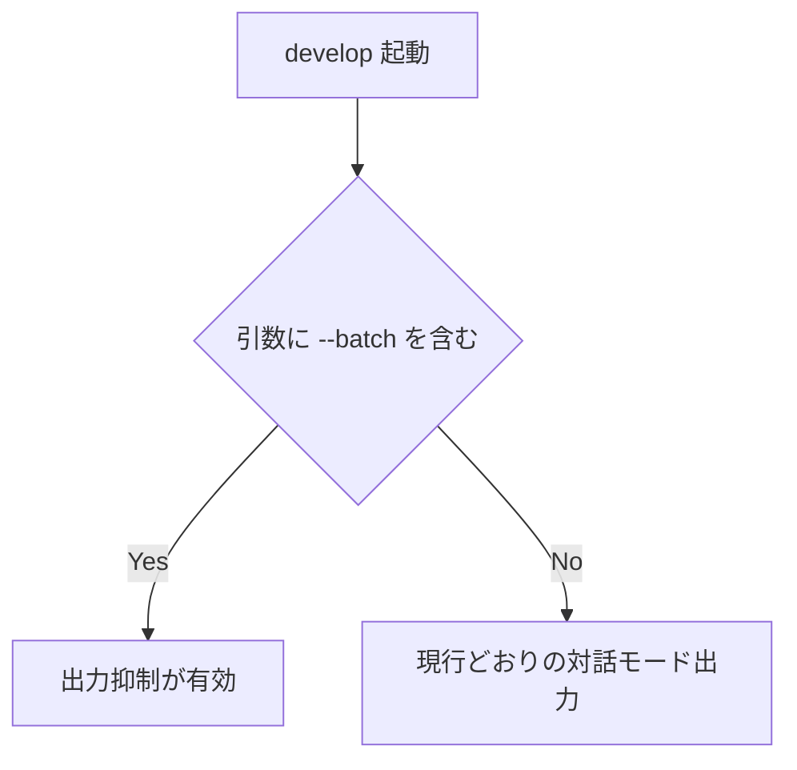

# batch-quiet-output - 要件定義書

## 1. 概要

### 1.1 背景

`/em-workflow:develop` コマンドで `--batch` を指定した際、メインコンテキストの出力は
ほぼ行わなくて良い。`--batch` は `claude -p` や `claude-batch` を経由して実行される
ことを念頭に置く。

### 1.2 目的

- `/em-workflow:develop --batch` のメインコンテキスト出力を、ヘッドレス起動
  （`claude -p` / `claude-batch`）の呼び出し元が実際に読む面だけに絞る。
- ラン中の実況・中間サマリを止めても、正常完了・停止・待機の区別が出力だけで
  機械的に付く状態を保つ。
- 監査性は抑制後もコミット済み成果物と Step C 終了報告で担保する。

### 1.3 スコープ

**対象**

- `--batch` を伴う起動のメインコンテキスト出力（assistant テキスト）の量と範囲。
- 上記の規律を定義する em-workflow プラグインの protocol ドキュメントと、
  オーケストレーターの出力規律。

**対象外**

- `--batch` を伴わない起動（対話モード）の出力（FR1 / NFR1）。
- ファイル成果物への書き込みとコミット（FR9）。
- ゲート解決・自動 rework の上限・停止条件の判定・workflow.yaml の status 遷移規律
  （FR10）。
- 終端行の書式・値集合・出力条件（FR7）。

## 2. ビジネス要件

### 2.1 ビジネス目標

| ID | 目標 |
|----|------|
| BO1 | `/em-workflow:develop --batch` のメインコンテキスト出力を、ヘッドレス起動（`claude -p` / `claude-batch`）の呼び出し元が実際に読む面だけに絞る |
| BO2 | ラン中の実況・中間サマリを止めても、正常完了・停止・待機の区別が出力だけで機械的に付く状態を保つ |
| BO3 | 監査性は抑制後もコミット済み成果物と Step C 終了報告で担保する |

### 2.2 対象ユーザー

| ユーザータイプ | 説明 |
|----------------|------|
| ヘッドレス起動の呼び出し元 | `claude -p` / `claude-batch` 経由で develop を起動し、ターンの出力からランの状態を判定するプロセス |
| 成果を評価する人間 | Step C 終了報告と停止報告を読み、ランの結果と監査項目を確認する人 |
| 対話モードの利用者 | `--batch` を伴わずに develop を使う利用者。本機能では出力が一切変わらない |

### 2.3 期待される効果

- 呼び出し元が読まない中間出力がメインコンテキストから消える。
- 正常完了・停止・待機の区別が、終端行の有無と 1 行マーカーだけで機械的に付く。
- 監査項目がコミット済み成果物と永続状態から辿れる形に固定される。

## 3. ユースケース

### 3.1 ユースケース一覧

| ID | ユースケース名 | アクター | 関連要件 |
|----|----------------|----------|----------|
| UC01 | batch 実行が正常完了する | ヘッドレス起動の呼び出し元 | FR4, FR5, FR11 |
| UC02 | batch 実行が非終端ターンで終わる | ヘッドレス起動の呼び出し元 | FR2, FR3, FR4 |
| UC03 | batch 実行が停止・中断で終わる | ヘッドレス起動の呼び出し元 | FR6, FR7 |
| UC04 | `--batch --once` でフェーズ境界に達する | ヘッドレス起動の呼び出し元 | FR8 |
| UC05 | 対話モードで develop を実行する | 対話モードの利用者 | FR1, NFR1 |

### 3.2 ユースケース詳細

#### UC01: batch 実行が正常完了する

**アクター**: ヘッドレス起動の呼び出し元

**事前条件**:
- 起動の引数に `--batch` が含まれる。

**基本フロー**:
1. 各フェーズが進行する。フェーズ進行に伴う実況・中間サマリはメインコンテキストへ
   出さない（FR4）。
2. Step C（完了処理）に到達する。
3. Step C の batch 終了報告を全文出力する（FR5）。監査項目はコミット済み成果物と
   永続状態から組み立てる（FR11）。
4. そのあとに終端行を 1 行追記する。

**事後条件**:
- 出力に batch-mode.md「Reporting」の全監査項目と、末尾 1 行の終端行
  （`state=completed step=retrospect reason=none`）が含まれる。

#### UC02: batch 実行が非終端ターンで終わる

**アクター**: ヘッドレス起動の呼び出し元

**事前条件**:
- 起動の引数に `--batch` が含まれる。
- そのターンが `references/batch-terminal-line.md` の定める終端状態に達しない。

**基本フロー**:
1. 停止条件 5 の待機、implement フェーズの launch ターン、または wake ターンに
   到達する。
2. そのターンの最後の assistant メッセージを、固定書式の 1 行マーカーだけで
   構成する（FR2）。
3. マーカーの prefix は `EM_WORKFLOW_TERMINAL:` と異なるものを使う（FR3）。

**事後条件**:
- 終端行パーサがこのマーカーを終端行として読まない。
- 「行が無いこと＝異常終了」という終端行契約の signal が壊れていない。

#### UC03: batch 実行が停止・中断で終わる

**アクター**: ヘッドレス起動の呼び出し元

**事前条件**:
- 起動の引数に `--batch` が含まれる。
- 停止条件 2 / 3 / 4 / 6、フェーズ内ゲートの中断、Step C 内の中断、Step A の
  feature 解決失敗、commit-docs.sh 2 回目 exit 4 によるフェーズ中断、implement /
  verify フェーズの終端停止のいずれかが成立する。

**基本フロー**:
1. 停止・中断が発生する。
2. 原因・該当パス・復旧の手掛かりを現行どおり出力する（FR6）。
3. 終端行を出力する（FR7）。

**事後条件**:
- 停止ターンの出力だけで、原因・該当パス・次に人間が取る手が判別できる（NFR3）。

#### UC04: `--batch --once` でフェーズ境界に達する

**アクター**: ヘッドレス起動の呼び出し元

**事前条件**:
- 起動の引数に `--batch` と `--once` が含まれる。

**基本フロー**:
1. フェーズ境界に達してターンを終える。
2. フェーズ実況・中間サマリは FR4 に従って出さない。
3. 終端行（`state=phase_done reason=none`）を出力する（FR8）。

**事後条件**:
- 出力がフェーズ実況を含まず、終端行を含む。

#### UC05: 対話モードで develop を実行する

**アクター**: 対話モードの利用者

**事前条件**:
- 起動の引数に `--batch` が含まれない。

**基本フロー**:
1. develop が現行どおり実行される。出力抑制の分岐に入らない（FR1）。

**事後条件**:
- 出力・停止条件・報告文面が変更前と完全に同一である（NFR1）。

## 4. 機能要件

### 4.1 機能一覧

| ID | 機能名 | 説明 | 状態 |
|----|--------|------|------|
| FR1 | 抑制の適用条件 | 出力抑制を有効にする条件を `--batch` の有無に限定する | ok |
| FR2 | 非終端ターンは 1 行マーカーのみ | 終端状態に達しないターンの最終メッセージを 1 行に絞る | ok |
| FR3 | 1 行マーカーの書式と終端行との識別 | マーカーの書式と、終端行と混同されないための条件 | ok |
| FR4 | 抑制される中間出力の範囲 | メインコンテキストへ出さない中間出力の列挙 | ok |
| FR5 | Step C 終了報告は全文維持 | 完了処理の終了報告を全文出力する | ok |
| FR6 | 停止・中断ターンは抑制の例外 | 停止・中断ターンの出力を現行どおり保つ | ok |
| FR7 | 終端行の契約は不変 | 終端行の SSOT と書式・出力条件を変更しない | ok |
| FR8 | `--once` フェーズ境界ターンの出力 | `state=phase_done` のターンの出力の扱い | ok |
| FR9 | ファイル成果物への書き込みは不変 | 抑制対象を assistant テキストに限定する | ok |
| FR10 | ゲート解決・状態遷移の挙動は不変 | 出力以外の挙動を変更しない | ok |
| FR11 | Step C 監査項目の出所を成果物に固定 | 監査項目を成果物・永続状態から組み立てる | ok |
| FR12 | 規律の定義箇所 | 出力抑制規律の SSOT を 1 つに固定する | ok |
| FR13 | プラグイン version の更新 | plugin.json と marketplace.json の version を上げる | ok |

### 4.2 機能詳細

#### FR1: 抑制の適用条件

**説明**: 出力抑制は、その起動の引数に `--batch` が含まれるときだけ有効になる。
workflow.yaml の `batch` ブロックの有無では有効化しない。`--batch` の無い起動
（対話モード）の出力は本機能で一切変更しない。

**判定フロー**:

**ビジネスルール**:
- 有効化の判定材料は起動引数のみ。
- workflow.yaml の `batch` ブロックは判定に使わない。

#### FR2: 非終端ターンは 1 行マーカーのみ

**説明**: batch 実行のターンが `references/batch-terminal-line.md` の定める終端状態に
達しないまま終わる場合、そのターンの最後の assistant メッセージは固定書式の 1 行
マーカーだけで構成される。該当するターンは少なくとも、停止条件 5 の待機ターン、
implement フェーズの launch ターンと wake ターン。

**対象ターン**:

| 非終端ターン | 出典 |
|--------------|------|
| 停止条件 5 の待機ターン | `skills/develop/SKILL.md` |
| implement フェーズの launch ターン | `references/implement-phase.md` |
| implement フェーズの wake ターン | `references/implement-phase.md` |

#### FR3: 1 行マーカーの書式と終端行との識別

**説明**: 1 行マーカーは固定 prefix + 固定フィールドの 1 物理行とし、
`batch-terminal-line.md` の終端行 prefix（`EM_WORKFLOW_TERMINAL:`）とは異なる prefix を
使う。終端行のパーサがこのマーカーを終端行として読まないこと、および「行が無いこと＝
異常終了」という終端行契約の signal が壊れないことを満たす。マーカーの値はパス以外の
機密情報を含まない。

**バリデーション**:

| 項目 | ルール |
|------|--------|
| prefix | `EM_WORKFLOW_TERMINAL:` と一致しない。終端行パーサに終端行として拾われない |
| 行数 | 1 物理行。折り返さない |
| 構造 | 固定 prefix + 固定フィールド |
| 値 | パス以外の機密情報を含まない |

#### FR4: 抑制される中間出力の範囲

**説明**: batch 実行中、フェーズ進行に伴う次の出力をメインコンテキストへ出さない。

- フェーズ開始・完了の実況
- サブエージェント（implementer / reviewer / 各 worker）報告のメインコンテキストへの転送
- step ごとの中間サマリ
- review フェーズ Phase R6 の日本語レポート本文
- implement の wake ターンが列挙する reconcile 結果
- verify の結果サマリ本文
- design ステップの進捗
- Step A.5 のコマンド承認結果の逐次提示

#### FR5: Step C 終了報告は全文維持

**説明**: Step C（完了処理）の batch 終了報告は現行どおり全文を出力する。
`references/batch-mode.md`「Reporting」が要求する監査項目と、`project.license` が `none`
のときの `/em-workflow:gen-license` 案内行を含む。そのあとに終端行を 1 行追記する。

**含める監査項目**:

| 項目 |
|------|
| 自動承認したコマンド文字列 |
| 記録した仮定 |
| review・verify の自動 rework 消費数 |
| deferred findings と stable_id |
| 未収載ゲート fallback の解決内容 |
| 残した integration ブランチ名と取り込み案内 |

#### FR6: 停止・中断ターンは抑制の例外

**説明**: 停止・中断で終わるターンは抑制の対象外とし、原因・該当パス・復旧の手掛かりを
現行どおり出力する。「batch はフェーズの確認を省くが失敗は隠さない」という
batch-mode.md の原則を変更しない。

**対象**:

| 停止・中断 |
|------------|
| 停止条件 2（スタック） |
| 停止条件 3（failed・needs_update） |
| 停止条件 4（YAML parse エラー） |
| 停止条件 6（git-setup 中断） |
| フェーズ内ゲートの中断 |
| Step C 内の中断 |
| Step A の feature 解決失敗 |
| commit-docs.sh 2 回目 exit 4 によるフェーズ中断 |
| implement フェーズの終端停止 |
| verify フェーズの終端停止 |

#### FR7: 終端行の契約は不変

**説明**: 終端行の prefix・フィールド文法・`state` / `step` / `reason` / `detail` の
値集合・停止点との対応は `references/batch-terminal-line.md` が引き続き唯一の SSOT で
あり、本機能で変更しない。終端行を出す条件（いつ出すか）も現行どおり。

#### FR8: `--once` フェーズ境界ターンの出力

**説明**: `--batch --once` でフェーズ境界に達したターン（`state=phase_done`）は、
終端行を出力し、それ以外のフェーズ実況・中間サマリは FR4 に従って出さない。
Step C 完了処理でも停止でもないため FR5 / FR6 の全文例外には当たらない。

#### FR9: ファイル成果物への書き込みは不変

**説明**: 出力抑制はメインコンテキストの assistant テキストのみを対象とし、
workflow.yaml / `phase-state/*.yaml` / `feature-docs/{feature}/` 配下の全ドキュメント /
`reviews/roundN.yaml` / `retrospect.yaml` / `journal.jsonl` / `test-docs/` への書き込みと
コミットの内容・頻度・タイミングを一切変更しない。

#### FR10: ゲート解決・状態遷移の挙動は不変

**説明**: 本機能は出力だけを変える。batch のゲート解決
（`references/question-resolution.md` / `references/batch-policies.yaml` /
batch-mode.md の Non-packet gates 表）、自動 rework の上限、停止条件の判定、
workflow.yaml の status 遷移規律はいずれも変更しない。

#### FR11: Step C 監査項目の出所を成果物に固定

**説明**: FR5 が要求する監査項目は、それ以前のターンのメインコンテキスト出力ではなく、
コミット済みの成果物と永続状態から組み立てる。永続化された出所を持たない監査項目が
あれば、その出所を新たに定義する。

**出所**:

| 出所 |
|------|
| workflow.yaml |
| `phase-state/*.yaml` の answers と resolution_note |
| `reviews/roundN.yaml` の resolution / stable_id |
| `batch` ブロックのカウンタ |

#### FR12: 規律の定義箇所

**説明**: batch の出力抑制規律（適用条件・抑制範囲・例外・1 行マーカーの書式）は
`references/batch-mode.md` を唯一の定義元とし、`skills/develop/SKILL.md`・
`references/review-phase.md`・`references/implement-phase.md`・`references/phases/*.md`
からは参照のみ行って書式や範囲を再記述しない。

#### FR13: プラグイン version の更新

**説明**: `em-workflow/` 配下を変更するため、同じ変更内で
`em-workflow/.claude-plugin/plugin.json` とルート `.claude-plugin/marketplace.json` の
em-workflow エントリの `version` を同じ値へ上げる（挙動の修正として patch）。

## 5. 非機能要件

### 5.1 NFR1: 対話モードへの非回帰

`--batch` を伴わない起動の出力・停止条件・報告文面は現行と完全に同一であること。

### 5.2 NFR2: 既存 consumer の互換性

終端行を読む既存の外部 consumer が、本変更後の出力でも「終端行あり＝終端状態 /
終端行なし＝在飛行または異常」の判定を従来どおり行えること。1 行マーカーがこの判定を
曖昧にしないこと。

### 5.3 NFR3: 停止時の診断可能性

停止ターンの出力だけで、原因・該当パス・次に人間が取る手が判別できること。
中間出力の抑制が停止時の情報量を削らないこと。

### 5.4 NFR4: SSOT の単一性

出力抑制規律の記述が複数ドキュメントに重複しないこと。
`scripts/check-plugin-invariants.py` の観点で矛盾を生まないこと。

### 5.5 NFR5: 文体

人間向けに残る出力（Step C 終了報告・停止報告）の文体は現行どおり日本語・タメ語・
一人称「私」・体言止めなしを保つ。1 行マーカーと終端行は機械可読の固定書式であり、
この文体規則の対象外。

### 5.6 該当しない観点

パフォーマンス要件・セキュリティ要件・可用性要件については、本機能の要件として
定義されたものが無い。

## 6. UI/UX要件

該当なし。本機能は画面・視覚要素・デザイントークンを一切持たない。

## 7. データ要件

該当なし。FR9 のとおり、ファイル成果物への書き込み内容は変更しない。

## 8. 外部連携

該当なし。本機能で新規の外部連携は追加しない。

## 9. 制約条件

### 9.1 技術的制約

- 終端行の契約（prefix・フィールド文法・値集合・出力条件）を変更できない（FR7）。
- 出力抑制規律の定義元は `references/batch-mode.md` 1 箇所に限る（FR12 / NFR4）。
- ゲート解決・自動 rework 上限・停止条件・status 遷移規律を変更できない（FR10）。
- ファイル成果物への書き込みとコミットを変更できない（FR9）。

### 9.2 ビジネス上の制約

- 監査性は Step C 終了報告とコミット済み成果物だけで担保する必要がある（BO3 / FR11）。

### 9.3 スケジュール制約

なし。

### 9.4 宣言された変更集合

このフィーチャー固有のパスは手動で列挙せず、create-plan で `workflow.yaml` の各タスクの
`files` から導出する（`references/phases/create-plan-phase.md`）。

**デフォルトメンバー**（SPEC作成者が明示的に除外しない限り、常に宣言に含まれる）:
- `feature-docs/batch-quiet-output/**`
- `test-docs/batch-quiet-output/**`

`feature-docs/batch-quiet-output/**` に含まれるもの: `REQUIREMENTS.md`、`SPEC.md`、
`IMPLEMENTATION.md`、`workflow.yaml`、`phase-state/`、`tasks/`、`reviews/roundN.yaml`、
`VERIFICATION.md`、`retrospect.yaml`、およびデザインステップが生成するデザイン成果物。
生成主体は各フェーズドキュメントおよび `references/phase-state.md` を参照（引用のみ、
ルールは再掲しない）。

`test-docs/batch-quiet-output/**` に含まれるもの: `{T}.tests.yaml`（パス形式:
`test-docs/batch-quiet-output/{T}.tests.yaml`）。生成主体は `implement-phase.md` を参照
（引用のみ、ルールは再掲しない）。

**意味論**:
- デフォルトのメンバーは、SPEC作成者が明示的に除外しない限り宣言に含まれる。除外は
  意図的な絞り込みであり、記載漏れによる省略ではない。
- この宣言はスーパーセット（superset）の主張であり、実際の変更集合は宣言に含まれる
  （CONTAINED IN）必要がある。実際には生成されないパスが宣言されていても違反にはならない。
  implementタスクを1つも生成しないフィーチャーは `test-docs/batch-quiet-output/`
  ディレクトリを生成しないが、宣言された `test-docs/batch-quiet-output/**` は依然として
  正しい。

## 10. 想定される課題とリスク

### 10.1 技術的課題

| 課題 | 影響度 | 対応策 |
|------|--------|--------|
| 1 行マーカーが終端行として誤読される | 高 | 終端行と異なる prefix を用い、終端行パーサに拾われないことを条件とする（FR3 / NFR2） |
| 完全に無音のターンが異常終了と区別できない | 高 | 非終端ターンに 1 行マーカーを残す（FR2 / A-003） |
| 中間出力の抑制でメインコンテキストから監査項目を拾えなくなる | 高 | Step C 報告の出所をコミット済み成果物・永続状態に固定する（FR11 / A-004） |
| 中間出力の抑制が停止時の情報量を削る | 高 | 停止・中断ターンを抑制の例外とする（FR6 / NFR3） |
| 出力抑制規律が複数ドキュメントに重複する | 中 | 定義元を `references/batch-mode.md` に限定し、他は参照のみとする（FR12 / NFR4） |

### 10.2 ビジネスリスク

| リスク | 影響度 | 対応策 |
|--------|--------|--------|
| 対話モードの出力が意図せず変わる | 高 | 抑制の適用条件を `--batch` の有無に限定する（FR1 / NFR1） |

## 11. 成功基準

### 11.1 受け入れ基準

- [ ] `--batch` 無しの起動で、出力・報告・停止挙動が変更前と同一である。
- [ ] `--batch` 実行の非終端ターン（停止条件 5 の待機、implement の launch / wake）の
      最後の assistant メッセージが、固定書式の 1 行マーカー 1 行だけである。
- [ ] その 1 行マーカーの prefix が `EM_WORKFLOW_TERMINAL:` と一致せず、終端行パーサに
      終端行として拾われない。
- [ ] `--batch` 実行が正常完了したターンの出力に、batch-mode.md「Reporting」の全監査
      項目と、末尾 1 行の終端行（`state=completed step=retrospect reason=none`）が
      含まれる。
- [ ] `--batch` 実行が停止条件 2/3/4/6・ゲート中断・Step C 中断・Step A 解決失敗・
      commit-docs.sh 2 回目 exit 4・implement 2 回目失敗・verify rework 上限のいずれかで
      止まったターンの出力に、原因・該当パス・復旧の手掛かりと終端行が含まれる。
- [ ] `--batch --once` でフェーズ境界に達したターンの出力が、フェーズ実況を含まず
      終端行（`state=phase_done reason=none`）を含む。
- [ ] review フェーズ Phase R6 のレポート本文が batch 実行のメインコンテキストに出力
      されず、同ラウンドの `reviews/roundN.yaml` の内容は変更前と同等である。
- [ ] batch 実行の全ターンで、workflow.yaml / phase-state / feature-docs 配下 /
      reviews / retrospect.yaml のコミット内容が変更前と同等である。
- [ ] 出力抑制の規律が `references/batch-mode.md` にのみ定義され、他ドキュメントは
      参照のみである。
- [ ] `em-workflow/.claude-plugin/plugin.json` と `.claude-plugin/marketplace.json` の
      version が同値で更新されている。

### 11.2 KPI

該当なし。

## 12. テストシナリオ

| ID | シナリオ名 | 対象要件 | 内容 |
|----|------------|----------|------|
| TS-1 | 対話モード非回帰 | FR1, NFR1 | `--batch` を含まない引数列での develop 起動が、出力抑制の分岐に入らないことを SKILL.md / batch-mode.md の記述整合で確認する |
| TS-2 | 非終端ターンのマーカー | FR2, FR4 | 停止条件 5・implement launch / wake の各非終端点について、1 行マーカーのみを出す規定が batch-mode.md に存在し、SKILL.md の該当箇所がそこを参照していることを確認する |
| TS-3 | マーカーと終端行の非衝突 | FR3, FR7, NFR2 | 1 行マーカーの prefix と `EM_WORKFLOW_TERMINAL:` が前方一致しないことを、両 SSOT の記述から確認する |
| TS-4 | 終端ターンの全文維持 | FR5, FR6, FR8, NFR3 | batch-terminal-line.md の停止点表 11 行すべてについて、対応するターンが抑制の例外であることを batch-mode.md の例外規定が覆っていることを確認する |
| TS-5 | 監査項目の出所 | FR11, FR9 | batch-mode.md「Reporting」の各監査項目が、コミット済み成果物または phase-state のどのフィールド由来かを 1 対 1 で辿れることを確認する |
| TS-6 | 既存テストスイート非回帰 | FR10, FR13 | `python3 -m unittest discover -s tests` と `python3 em-workflow/hooks/tests/run-destructive-guard.py` が通る |
| TS-7 | プラグイン不変条件と SSOT 単一性 | FR12, NFR4, NFR5 | `em-workflow/scripts/check-plugin-invariants.py` の観点で、追加した記述が既存 SSOT と矛盾しない |

## 13. 用語定義

| 用語 | 定義 |
|------|------|
| メインコンテキスト | develop オーケストレーター自身のターンが出力する assistant テキストの面 |
| 終端行 | batch ターンが終端状態に達したときに最終 assistant メッセージの最後の行として出す機械可読の 1 行。SSOT は `references/batch-terminal-line.md` |
| 1 行マーカー | 終端状態に達しない batch ターンの最終 assistant メッセージを構成する、固定書式の 1 行（FR2 / FR3） |
| 非終端ターン | `references/batch-terminal-line.md` の定める終端状態に達しないまま終わる batch 実行のターン |
| Step C | develop の完了処理ステップ。batch 終了報告を出す |

## 14. 確認事項

### 14.1 確認済み事項

- [x] 抑制の適用条件: 起動引数に `--batch` が含まれるときだけ有効。workflow.yaml の
      `batch` ブロックでは有効化しない。
- [x] 非終端ターンの出力: 完全な無音にはせず、固定書式の 1 行を残す
      （output.batch-nonterminal-turn-output）。
- [x] Step C 終了報告の範囲: 現行どおり全文を維持する
      （output.batch-final-report-scope）。
- [x] 停止報告の詳細度: 停止・中断ターンは現行どおり原因・該当パス・復旧の手掛かりを
      出力する（output.batch-stop-report-detail）。
- [x] `project.license` は `none`（リポジトリルートに LICENSE が存在しない）。

### 14.2 未確認・保留事項

なし。`status: tbd` の要件は無い。

### 14.3 記録した前提

| ID | 前提 |
|----|------|
| A-001 | 抑制対象は「フェーズ進行中の中間出力」であり、Step C 終了報告と停止・中断報告は例外として全文を維持する（回答 output.batch-final-report-scope / output.batch-stop-report-detail、いずれも batch-codex-consultation 由来で record_as_assumption: true） |
| A-002 | `--once` のフェーズ境界ターン（`state=phase_done`）は 4 つの回答が直接扱っていないため、「Step C 完了処理でも停止でもない終端ターン」として抑制側に置き、終端行のみを出す扱いとした（FR8） |
| A-003 | 完全に無音のターンは異常終了と区別できないため 1 行を残す、という output.batch-nonterminal-turn-output の根拠から、マーカー prefix は終端行と別であることが必要と導出した（FR3） |
| A-004 | 中間出力を抑制するとメインコンテキストのテキストからは監査項目を拾えなくなるため、Step C 報告の出所をコミット済み成果物・永続状態に固定した（FR11） |
| A-005 | 本 feature の変更対象は em-workflow プラグインの protocol ドキュメントとオーケストレーターの出力規律であり、実行コードの新規追加は想定していない |
| A-006 | リポジトリルートに LICENSE が存在しないため `project.license` は `none` |

### 14.4 デザインステップ

- 状態: skipped
- 理由: 変更対象が em-workflow プラグインの protocol ドキュメントとオーケストレーターの
  出力規律のみで、画面・視覚要素・デザイントークンを一切持たない。design system 候補も
  0 件。

## 15. 参考資料

- 実装仕様書: `feature-docs/batch-quiet-output/SPEC.md`
- batch モードのプロトコル: `em-workflow/references/batch-mode.md`
- 終端行の契約: `em-workflow/references/batch-terminal-line.md`
- develop スキル: `em-workflow/skills/develop/SKILL.md`
- implement フェーズ: `em-workflow/references/implement-phase.md`
- review フェーズ: `em-workflow/references/review-phase.md`
- ゲート解決: `em-workflow/references/question-resolution.md`
- batch ポリシー: `em-workflow/references/batch-policies.yaml`
- 永続状態: `em-workflow/references/phase-state.md`
