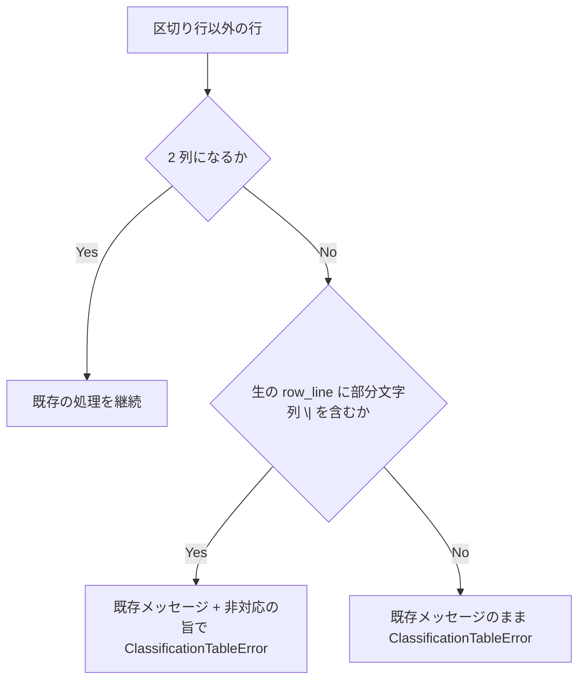

# classification-table-escaped-pipe - 要件定義書

## 1. 概要

### 1.1 背景
`tests/test_hook_classification_pin.py` の `parse_classification_table()` は `\|` エスケープを解釈しない。HEAD の `parse_classification_table()` は列数不一致の行で既に `ClassificationTableError` を送出するが、そのメッセージに `\|` エスケープ非対応の旨は含まれない。

### 1.2 目的
- `parse_classification_table()` に `\|` を含む行を渡したとき、その行が黙って落ちず、パーサの限界（`\|` エスケープ非対応）が原因だとエラーメッセージから即座に分かる状態にする。
- `\|` を含むセルを持つ表に対するパーサの挙動（`ClassificationTableError` の送出）をテストで固定する。

### 1.3 スコープ
- 対象: `tests/test_hook_classification_pin.py` の `parse_classification_table()` のエラーメッセージ、docstring、`TestParseClassificationTableFailureModes` へのテスト追加。
- 対象外:
    - `\|` エスケープの解釈の実装。
    - `em-workflow/references/implement-phase.md` の分類テーブル、`tests/_gate_vocabulary.py`（`parse_exemption_table_rows()` を含む）、`tests/test_recycled_task_id_consistency.py` の変更。
    - 1 セル内に `\|` が 1 つだけあり分割結果がちょうど 2 列になる行のメッセージ変更。

## 2. ビジネス要件

### 2.1 ビジネス目標
- `parse_classification_table()` に `\|` を含む行を渡したとき、その行が黙って落ちず、パーサの限界（`\|` エスケープ非対応）が原因だとエラーメッセージから即座に分かる状態にする。
- `\|` を含むセルを持つ表に対するパーサの挙動（`ClassificationTableError` の送出）をテストで固定する。

### 2.2 対象ユーザー
該当なし

### 2.3 期待される効果
- `\|` を含み 2 列にならない行に対する `ClassificationTableError` のメッセージから、`\|` エスケープ非対応が原因だと分かる。
- `\|` を含む行に対する `ClassificationTableError` の送出がテストで固定される。

## 3. ユースケース

### 3.1 ユースケース一覧
該当なし

### 3.2 ユースケース詳細
該当なし

## 4. 機能要件

### 4.1 機能一覧
- FR1: `\|` を含む列数不一致行のエラーメッセージに非対応の旨を含める
- FR2: 行の分割方式は変えない
- FR3: `\|` を含む行の挙動を固定するテスト
- FR4: docstring に `\|` 非対応を明記する

### 4.2 機能詳細

#### FR1: `\|` を含む列数不一致行のエラーメッセージに非対応の旨を含める

**説明**: `parse_classification_table()` が区切り行以外で 2 列にならない行に出会ったとき、既存どおり `ClassificationTableError` を送出する。その行（生の `row_line`）に部分文字列 `\|` が含まれる場合、エラーメッセージに、既存の内容（2 列を期待する旨と該当行の repr）に加えて、`\|` エスケープはこのパーサでは非対応である旨を含める。メッセージにはリテラル `\|` と語句 "not supported" を含める。行に `\|` が含まれない場合のメッセージは既存の内容から変えない。

**入力**:
- `row_line`: str - 表の 1 行（区切り行以外）

**出力**:
- `ClassificationTableError` の送出（2 列にならない行の場合）

**処理フロー**:

**ビジネスルール**:
- 非対応の旨の判定は、生の `row_line` に部分文字列 `\|` が含まれるかどうかで行う。`\\|` のようなバックスラッシュ自体のエスケープの解析はしない。
- エラーメッセージは既存メッセージと同じく英語で書く。テストが固定するのはリテラル `\|` と語句 "not supported" の有無で、それ以外の文言は実装に委ねる。

**バリデーション**:
- 2 列にならず、`\|` を含む行: メッセージは 2 列を期待する旨、該当行の repr、リテラル `\|`、語句 "not supported" を含む。
- 2 列にならず、`\|` を含まない行: メッセージは既存の内容のまま。

**エラーケース**:
- `\|` を含み 2 列にならない行: `ClassificationTableError` を送出し、メッセージに非対応の旨を含める。
- `\|` を含まず 2 列にならない行（例: `| only-one-column |`）: `ClassificationTableError` を既存のメッセージで送出する。
- 1 セル内に `\|` が 1 つだけあり、分割結果がちょうど 2 列になる行: FR1 の非対応の旨は付かない。既存の分類語彙の検証（unrecognized classification value）か、分類が正規値に一致した場合は reads_per_task_status のパス解決検証で `ClassificationTableError` になる。この経路のメッセージ変更は今回の範囲外とする。

#### FR2: 行の分割方式は変えない

**説明**: `\|` エスケープの解釈は実装しない。行の分割処理（`row_line.strip("|").split("|")`）、列数判定、分類語彙の検証は既存のまま変更しない。

#### FR3: `\|` を含む行の挙動を固定するテスト

**説明**: `tests/test_hook_classification_pin.py` の `TestParseClassificationTableFailureModes` に、次の 2 ケースで `ClassificationTableError` が送出され、そのメッセージが FR1 の非対応の旨（リテラル `\|` と "not supported"）を含むことを検証するテストを追加する。

1. hook セルに `\|` を含み、分類セルは正規値（READS_STATUS）の行。
2. hook セルは正規のパス、分類セルは再現手順の値 ``reads `tasks.{T}.status` \| `journal` `` の行。

#### FR4: docstring に `\|` 非対応を明記する

**説明**: `parse_classification_table()` の docstring の Raises 記述（malformed row）に、`\|` エスケープは解釈せず、`\|` を含む行は列数不一致として非対応の旨のメッセージ付きで `ClassificationTableError` になることを記す。

## 5. 非機能要件

### 5.1 パフォーマンス要件
該当なし

### 5.2 セキュリティ要件
該当なし

### 5.3 可用性要件
該当なし

### 5.4 保守性要件
- NFR1 標準ライブラリのみ: テストコードは Python 標準ライブラリ（unittest）のみを使う。既存モジュールの AC-7（標準ライブラリのみ、`em-workflow/hooks/` 配下へ書き込まない）を維持する。
- NFR2 変更範囲: 変更対象は `tests/test_hook_classification_pin.py` のみ。`em-workflow/references/implement-phase.md` の分類テーブル、`tests/_gate_vocabulary.py`、`tests/test_recycled_task_id_consistency.py` は変更しない。
- NFR3 既存テストの維持: `python3 -m unittest discover -s tests` で新たな失敗を出さない。既存の `test_malformed_row_wrong_column_count_raises` を含む既存テストは変更・削除しない。

### 5.5 互換性要件
該当なし

## 6. UI/UX要件

### 6.1 画面設計要件
該当なし

### 6.2 画面遷移
該当なし

### 6.3 レスポンシブ対応
該当なし

## 7. データ要件

### 7.1 データモデル概要
該当なし

### 7.2 データ項目
該当なし

### 7.3 データ保持期間
該当なし

## 8. 外部連携

### 8.1 連携システム
該当なし

### 8.2 API仕様要件
該当なし

## 9. 制約条件

### 9.1 技術的制約
- テストコードは Python 標準ライブラリ（unittest）のみを使う（NFR1）。
- 変更対象は `tests/test_hook_classification_pin.py` のみ（NFR2）。
- 変更は `em-workflow/` 配下ではなくリポジトリルートの `tests/` のみなので、`.claude/rules/core-plugin-version-bump.md` の対象外で、プラグインの version は上げない。

### 9.2 ビジネス上の制約
該当なし

### 9.3 スケジュール制約
該当なし

### 9.4 宣言された変更集合

このフィーチャー固有のパスは手動で列挙せず、create-plan で `workflow.yaml` の各タスクの `files` から導出する（`references/phases/create-plan-phase.md`）。

**デフォルトメンバー**（SPEC作成者が明示的に除外しない限り、常に宣言に含まれる）:
- `feature-docs/classification-table-escaped-pipe/**`
- `test-docs/classification-table-escaped-pipe/**`

`feature-docs/classification-table-escaped-pipe/**` に含まれるもの: `REQUIREMENTS.md`、`SPEC.md`、`IMPLEMENTATION.md`、`workflow.yaml`、`phase-state/`、`tasks/`、`reviews/roundN.yaml`、`VERIFICATION.md`、`retrospect.yaml`、およびデザインステップが生成するデザイン成果物。生成主体は各フェーズドキュメントおよび `references/phase-state.md` を参照（引用のみ、ルールは再掲しない）。

`test-docs/classification-table-escaped-pipe/**` に含まれるもの: `{T}.tests.yaml`（パス形式: `test-docs/classification-table-escaped-pipe/{T}.tests.yaml`）。生成主体は `implement-phase.md` を参照（引用のみ、ルールは再掲しない）。

**意味論**:
- デフォルトのメンバーは、SPEC作成者が明示的に除外しない限り宣言に含まれる。除外は意図的な絞り込みであり、記載漏れによる省略ではない。
- この宣言はスーパーセット（superset）の主張であり、実際の変更集合は宣言に含まれる（CONTAINED IN）必要がある。実際には生成されないパスが宣言されていても違反にはならない。implementタスクを1つも生成しないフィーチャーは `test-docs/classification-table-escaped-pipe/` ディレクトリを生成しないが、宣言された `test-docs/classification-table-escaped-pipe/**` は依然として正しい。

## 10. 想定される課題とリスク

### 10.1 技術的課題
該当なし

### 10.2 ビジネスリスク
該当なし

## 11. 成功基準

### 11.1 受け入れ基準
- [ ] AC1（FR1, FR2, FR3）: 再現手順の値（``reads `tasks.{T}.status` \| `journal` ``）を分類セルに持つ行を含む表を `parse_classification_table()` に渡すと、行が黙って捨てられず `ClassificationTableError` が送出される。
- [ ] AC2（FR1）: `\|` を含み 2 列にならない行に対する `ClassificationTableError` のメッセージは、2 列を期待する旨、該当行の repr、リテラル `\|`、語句 "not supported" を含む。
- [ ] AC3（FR1）: `\|` を含まず 2 列にならない行（例: `| only-one-column |`）に対する `ClassificationTableError` のメッセージは既存の内容のままで、語句 "not supported" を含まない。
- [ ] AC4（FR3）: FR3 の (1)(2) の 2 ケースを検証するテストが `tests/test_hook_classification_pin.py` に存在し、通る。
- [ ] AC5（FR2, FR4, NFR1, NFR2, NFR3）: 実ドキュメントの分類テーブルは従来どおり 4 行にパースされ、`python3 -m unittest discover -s tests` が新たな失敗なく通る。行の分割処理は変わっておらず、`parse_classification_table()` の docstring に `\|` 非対応が記されている。

### 11.2 KPI
該当なし

## 12. テストシナリオ

### 12.1 テスト観点
- [ ] 異常系 TS1（AC2, AC4）: hook セルが `` `em-workflow/hooks/queue\|stop_guard.py` `` のように `\|` を含み、分類セルが READS_STATUS の 1 行表を渡す。`ClassificationTableError` が送出され、メッセージにリテラル `\|` と "not supported" が含まれる。
- [ ] 異常系 TS2（AC1, AC2, AC4）: hook セルが `` `em-workflow/hooks/queue_stop_guard.py` ``、分類セルが ``reads `tasks.{T}.status` \| `journal` `` の 1 行表を渡す。`ClassificationTableError` が送出され、メッセージにリテラル `\|` と "not supported" が含まれる。
- [ ] 異常系 TS3（AC3）: `| only-one-column |` の 1 列行を渡す。`ClassificationTableError` が送出され、メッセージに "not supported" が含まれない。
- [ ] 正常系 TS4（AC5）: `python3 -m unittest discover -s tests` を実行し、実ドキュメントの表が 4 行にパースされる既存テストを含め、新たな失敗が無い。

## 13. 用語定義

- 非対応の旨: FR1 でエラーメッセージに加える、`\|` エスケープはこのパーサでは非対応である旨の記述。リテラル `\|` と語句 "not supported" を含む。

## 14. 確認事項

### 14.1 確認済み事項

- [x] 期待する挙動（create-spec.expected-behavior-option）: (b) 明示的失敗（explicit_failure）を採用する。HEAD の `parse_classification_table()` は列数不一致で既に `ClassificationTableError` を送出しており、TS1/TS2 の「送出される」部分は HEAD でも通る。メッセージの非対応の旨（FR1）は HEAD には無く、TS1/TS2 のメッセージ検証は FR1 の実装で通るようになる。
- [x] 兄弟パーサの扱い（create-spec.sibling-parser-scope）: `tests/_gate_vocabulary.py` の `parse_exemption_table_rows()` は対象外とし変更しない（out_of_scope）。
- [x] 行末の `\|`（create-spec.trailing-escaped-pipe）: 行末の `\|` を外枠パイプとして扱うかの要件は設けない（not_applicable）。
- [x] 非対応の旨の判定方法: 生の `row_line` に部分文字列 `\|` が含まれるかどうかで行う。`\\|` のようなバックスラッシュ自体のエスケープの解析はしない。
- [x] 分割結果がちょうど 2 列になる `\|` 入りの行: 1 セル内に `\|` が 1 つだけあり、分割結果がちょうど 2 列になる行には FR1 の非対応の旨は付かない。この行は既存の分類語彙の検証（unrecognized classification value）か、分類が正規値に一致した場合は reads_per_task_status のパス解決検証で `ClassificationTableError` になり、黙って落ちることはない。この経路のメッセージ変更は今回の範囲外とする。
- [x] エラーメッセージの言語と固定範囲: 既存メッセージと同じく英語で書く。テストが固定するのはリテラル `\|` と語句 "not supported" の有無で、それ以外の文言は実装に委ねる。
- [x] プラグインの version: 変更は `em-workflow/` 配下ではなくリポジトリルートの `tests/` のみなので、`.claude/rules/core-plugin-version-bump.md` の対象外で、プラグインの version は上げない。

### 14.2 未確認・保留事項
なし

## 15. 参考資料

なし
