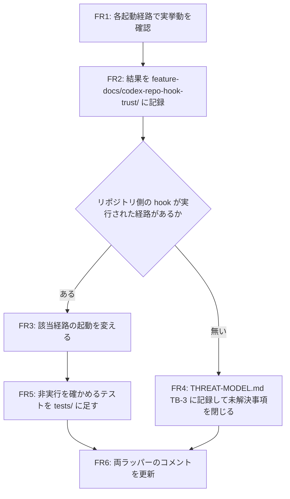

# Feature: codex-repo-hook-trust

## Overview

em-workflow / em-review の Codex 起動で、作業ディレクトリ側の Codex 設定（.codex/ 等）にある hook 定義が実行されるかを Codex 0.160.0 で確かめ、記録する。実行される起動経路があればラッパーの起動を作業ディレクトリ側の設定層を読まない形に変え、無ければ THREAT-MODEL.md TB-3 にその結果を記録する。要件の詳細は [REQUIREMENTS.md](./REQUIREMENTS.md) を参照する。

## Objectives

- レビュー対象のリポジトリが作業ディレクトリ側の Codex 設定（.codex/ 等）に持ち込んだ hook が、em-workflow / em-review の Codex 起動で信頼確認なしに実行されない状態にする。
- THREAT-MODEL.md TB-3 の未解決事項を、Codex 0.160.0 で実挙動を確かめた記録と一緒に閉じる。

## User Stories

該当なし

## Technical Requirements

### Functional Requirements
- **FR1:** Codex 0.160.0 での実挙動の確認。Codex 0.160.0 で次の起動ごとに、作業ディレクトリ（-C で渡すディレクトリ）側の Codex 設定にある hook 定義が実行されるかを確かめる: (a) em-workflow/scripts/run_codex_exec.sh の既定経路（--ignore-user-config あり）、(b) 同じラッパーの --litellm MODEL 経路（--ignore-user-config なし、-p litellm）、(c) em-review/scripts/run_codex_exec.sh（既定経路のみ）。--litellm 経路では、ユーザー設定でそのプロジェクトが信頼済みの場合と未信頼の場合の両方を確かめる。確認はラッパーが組み立てる argv と同じフラグ構成（--dangerously-bypass-hook-trust、--ignore-rules、ラッパー自身の -c hooks.PreToolUse を含む）で行う。
- **FR2:** 確認結果の記録。FR1 の結果を、起動経路ごと・hook 定義の置き場所ごとに、実行された／されなかったと、使った Codex のバージョン、固定した設定・コマンドとあわせて記録する。記録は feature-docs/codex-repo-hook-trust/ 配下に置く。
- **FR3:** 実行される経路の起動を変える。FR1 でリポジトリ側の hook が実行された起動経路について、ラッパーの起動を作業ディレクトリ側の設定層を読まない形に変える。変更は em-workflow と em-review の両方の run_codex_exec.sh に、該当する経路で入れる。ラッパー自身の interactive-guard hook（-c hooks.PreToolUse）の登録、--ignore-rules、既定経路の --ignore-user-config、--litellm 経路の -p litellm -m MODEL は維持する。
- **FR4:** 実行されない場合の TB-3 への記録。FR1 でどの起動経路でもリポジトリ側の hook が実行されなかった場合は、feature-docs/codex-interactive-guard-hook/THREAT-MODEL.md の TB-3 にその確認結果を記録し、Rationale にある「Configuration layers the wrapper does not author」の未解決事項を閉じる。
- **FR5:** リポジトリ側 hook の非実行を確かめるテスト。FR3 を適用した場合は、リポジトリ側の hook が実行されないことを確かめるテストを tests/ に足す。対象は FR3 で変えたすべての起動経路で、readonly と readwrite の両モードとする。
- **FR6:** ラッパーのコメントの更新。両ラッパーの Interactive-guard hook 節のコメント（em-workflow 151–156 行、em-review 124–129 行付近）を、FR1 の結果と FR3 の変更（適用した場合）に合わせる。

### Non-Functional Requirements
- **NFR1 - 利用者の ~/.codex を読み書きしない:** FR1 の確認と FR5 のテストでは、利用者の実際の ~/.codex（CODEX_HOME）を読み書きしない。信頼済みの記録、認証情報、litellm プロファイルは一時ディレクトリ内に置く。
- **NFR2 - テストは Python 標準ライブラリのみ:** テストコードは Python 標準ライブラリだけを使う（test/README.md）。
- **NFR3 - 既存のラッパー契約の維持:** 既存のラッパー契約を維持する: 1 回の実行で codex exec を 1 回だけ起動する、usage 文言と受け付けるフラグは変えない、プロンプトは argv の最後、em-workflow ラッパーに 2>&1 を足さない、em-review ラッパーの 2>&1 は 1 箇所のまま、em-review ラッパーは --litellm を受け付けない。
- **NFR4 - 両ラッパーを同じ変更で更新:** 両ラッパーへの変更は同じ変更の中で入れる。
- **NFR5 - 認証情報を出力に含めない:** 記録とテストの出力に LITELLM_API_KEY や認証情報の値を含めない。
- **NFR6 - version 変更を書かない:** SPEC・計画・受け入れ条件にプラグインの version の変更を書かない（.claude/rules/core-plugin-version-bump.md）。

## Implementation Approach

### Architecture

**Component Diagram:**
```
em-workflow/scripts/run_codex_exec.sh
  ├── 既定経路      : --ignore-user-config --ignore-rules --dangerously-bypass-hook-trust -c hooks.PreToolUse
  └── --litellm 経路: --ignore-rules --dangerously-bypass-hook-trust -c hooks.PreToolUse -p litellm -m MODEL
em-review/scripts/run_codex_exec.sh
  └── 既定経路      : --ignore-user-config --ignore-rules --dangerously-bypass-hook-trust -c hooks.PreToolUse
        │
        ▼  codex exec -C <作業ディレクトリ>
Codex 0.160.0 ── 作業ディレクトリ側の Codex 設定（.codex/ 等）の hook 定義
```

### Data Flow



### API Design

該当なし

### Database Schema

該当なし

### Dependencies

**Internal Dependencies:**
- em-workflow/scripts/run_codex_exec.sh: FR1 の確認対象、FR3・FR6 の変更対象
- em-review/scripts/run_codex_exec.sh: FR1 の確認対象、FR3・FR6 の変更対象
- feature-docs/codex-interactive-guard-hook/THREAT-MODEL.md: FR4 の記録先（TB-3）

**External Dependencies:**
- Codex 0.160.0: FR1 の確認、TS2 の実行
- Python 標準ライブラリ: テストコード（NFR2）

### File Structure

```
em-workflow/scripts/run_codex_exec.sh                    # FR3（適用時）、FR6
em-review/scripts/run_codex_exec.sh                      # FR3（適用時）、FR6
tests/                                                   # FR5（FR3 適用時）、TS3 の既存テストの更新
feature-docs/codex-repo-hook-trust/                      # FR2 の記録
feature-docs/codex-interactive-guard-hook/THREAT-MODEL.md  # FR4（適用時）、A1 の記録
```

## Declared Change Set

This section states the create-plan derivation instead of a hand-authored
list: the feature-specific paths above are derived at create-plan from
every task's `files` entries in `workflow.yaml`
(`references/phases/create-plan-phase.md`).

Every SPEC declares, by default, the following two workflow-generated
entries in addition to the feature-specific paths above:

- `feature-docs/codex-repo-hook-trust/**`
- `test-docs/codex-repo-hook-trust/**`

`feature-docs/codex-repo-hook-trust/**` covers `REQUIREMENTS.md`, `SPEC.md`,
`IMPLEMENTATION.md`, `workflow.yaml`, `phase-state/`, `tasks/`,
`reviews/roundN.yaml`, `VERIFICATION.md`, `retrospect.yaml`, and the design
artifacts the design step produces. These are generated and owned by the
phase documents and by `references/phase-state.md`; this section cites them
and restates none of their rules.

`test-docs/codex-repo-hook-trust/**` covers `test-docs/codex-repo-hook-trust/{T}.tests.yaml`, the
per-task test record. It is generated and owned by `implement-phase.md`;
this section cites it and restates none of its rules.

These two default entries are part of the declaration unless the SPEC
author explicitly removes them; their absence is never assumed by
silence — removal is a deliberate, explicit narrowing.

This declaration is a SUPERSET assertion: the actual change set observed
at verification time must be CONTAINED IN the declared set, not equal to
it. A feature that produces no implement tasks generates no
`test-docs/codex-repo-hook-trust/` directory at all; the declared
`test-docs/codex-repo-hook-trust/**` entry is still correct in that case — a declared
path that never materializes is not a violation.

## Test Scenarios

FR5 のテストは TS1 と TS2 で構成する（A3）。

### Unit Tests
- [ ] TS1（FR3 適用時、stub）: stub の codex を PATH の先頭に置き HOME と CODEX_HOME を一時ディレクトリにした状態で、FR3 で変えた各経路・両モードの argv（と環境）に、作業ディレクトリ側の設定層を読まないための指定が入っていることを確かめる。指定を外した偽の argv で失敗することも確かめる（非空虚性）。

### Integration Tests
- [ ] TS2（FR3 適用時、実 Codex）: 一時リポジトリの作業ディレクトリ側設定に、実行されると目印ファイルを書く hook を置き、ラッパー経由で Codex を起動して目印ファイルが作られないことを確かめる。codex が無い、またはバージョンが 0.160.0 でない環境ではスキップする。
- [ ] TS3（回帰）: tests/test_codex_hook_wrapper_args.py、tests/test_consultation_harness_chain.py、tests/test_codex_wrapper_single_invocation.py、tests/test_codex_reviewer_temp_file_isolation.py が通る。FR3 で固定値が変わる箇所は、変更後の起動に合わせて更新する。

### E2E Tests
該当なし

### Edge Cases
- [ ] --litellm 経路で、ユーザー設定でそのプロジェクトが信頼済みの場合と未信頼の場合の両方を確かめる（FR1）。
- [ ] 確認対象の hook 定義は、Codex 0.160.0 が作業ディレクトリ側から読む hook の置き場所すべてと、PreToolUse 以外を含むすべての hook イベントとする。ラッパーの -c hooks.PreToolUse が同じキーのリポジトリ側定義を上書きするかどうかも記録する（A2）。
- [ ] リポジトリ側の hook が実行されないこととラッパー自身の interactive-guard hook が動くことの両方を満たせない経路では、リポジトリ側の hook が実行されないことを優先し、その経路で guard が動かなくなることを THREAT-MODEL.md TB-3 に記録する（A1）。
- [ ] codex が無い、またはバージョンが 0.160.0 でない環境では TS2 をスキップする。

### Performance Tests
該当なし

## Security Considerations

- **Authentication:** 該当なし
- **Authorization:** 該当なし
- **Input Validation:** 該当なし
- **Data Protection:** FR1 の確認と FR5 のテストでは、利用者の実際の ~/.codex（CODEX_HOME）を読み書きせず、信頼済みの記録、認証情報、litellm プロファイルは一時ディレクトリ内に置く（NFR1）。記録とテストの出力に LITELLM_API_KEY や認証情報の値を含めない（NFR5）。
- **XSS Prevention:** 該当なし
- **SQL Injection Prevention:** 該当なし
- **CSRF Protection:** 該当なし

## Error Handling

該当なし

## Performance Optimization

該当なし

## Success Criteria

- [ ] AC1: FR2 の記録があり、em-workflow 既定経路、em-workflow --litellm 経路（信頼済み・未信頼）、em-review の各起動について、作業ディレクトリ側の hook 定義が Codex 0.160.0 で実行されたかどうかが書かれている。
- [ ] AC2: FR1 で実行された経路がある場合、その経路のラッパー起動ではリポジトリ側の hook が実行されず、FR5 のテストが通る。ラッパー自身の interactive-guard hook の登録は残っている。
- [ ] AC3: FR1 で実行された経路が無い場合、feature-docs/codex-interactive-guard-hook/THREAT-MODEL.md の TB-3 にその確認結果が記録され、未解決事項として残っていない。
- [ ] AC4: `python3 -m unittest discover -s tests` が通る。
- [ ] AC5: 両ラッパーのコメントが FR1 の結果と実際の起動の形に一致している。

## Assumptions

- **A1（影響度: 高）:** FR3 の起動変更の手段（Codex のフラグ、-c による上書き、起動専用の設定ディレクトリなど）は FR1 の確認結果を見て実装時に決める。どの手段でも、リポジトリ側の hook が実行されないこととラッパー自身の interactive-guard hook が動くことの両方を満たす。両方を満たせない経路では、リポジトリ側の hook が実行されないことを優先し、その経路で guard が動かなくなることを THREAT-MODEL.md TB-3 に記録する。
- **A2（影響度: 中）:** FR1 で確かめる「作業ディレクトリ側の hook 定義」は、Codex 0.160.0 が作業ディレクトリ側から読む hook の置き場所すべて（例: .codex/config.toml の hooks 表、別ファイルの hook 定義があればそれも）と、PreToolUse 以外を含むすべての hook イベントを対象にする。ラッパーの -c hooks.PreToolUse が同じキーのリポジトリ側定義を上書きするかどうかも記録する。
- **A3（影響度: 中）:** FR5 のテストは TS1（stub による argv の固定。常に実行）と TS2（実 Codex。0.160.0 が無ければスキップ）の 2 つで構成する。
- **A4（影響度: 低）:** Codex 側に修正版は無い。リポジトリ内では FR3 / FR4 を対応とし、Notion タスクの暫定緩和策欄の更新はこの機能の成果物に含めない。
- **A5（影響度: 低）:** FR4 の記録先は feature-docs/codex-interactive-guard-hook/THREAT-MODEL.md とする。feature-docs/codex-interactive-guard-hook/SPEC.md は過去の機能の記録として変えない。
- **A6（影響度: 低）:** em-workflow の --litellm 経路は question-resolution.md の相談手順と review 系の呼び出しの両方から使われるラッパー経路で、FR3 の変更対象はラッパー側だけとする。vertex-review プラグイン（vertex-reviewer）は別プラグインなので対象外とする。
- **A7（影響度: 低）:** プラグインの version は main への push 時に Actions が patch を上げる。この変更で minor / major は上げない。

## Open Questions

> **Note**: 未解決の要件は workflow.yaml で `status: tbd` として管理されています。
> plan フェーズの実行前に解決してください。

なし

## Implementation Phases (if applicable)

### Phase 1: 実挙動の確認と記録
**Goals:** FR1、FR2
**Deliverables:**
- feature-docs/codex-repo-hook-trust/ 配下の確認結果の記録

### Phase 2: 確認結果に応じた対応
**Goals:** リポジトリ側の hook が実行された経路がある場合は FR3・FR5、無い場合は FR4。どちらの場合も FR6。
**Deliverables:**
- 両ラッパーの起動変更とテスト（FR3・FR5 適用時）、または THREAT-MODEL.md TB-3 の記録（FR4 適用時）
- 両ラッパーのコメントの更新

## References

- 要件定義書: [REQUIREMENTS.md](./REQUIREMENTS.md)
- 脅威モデル: feature-docs/codex-interactive-guard-hook/THREAT-MODEL.md（TB-3）
