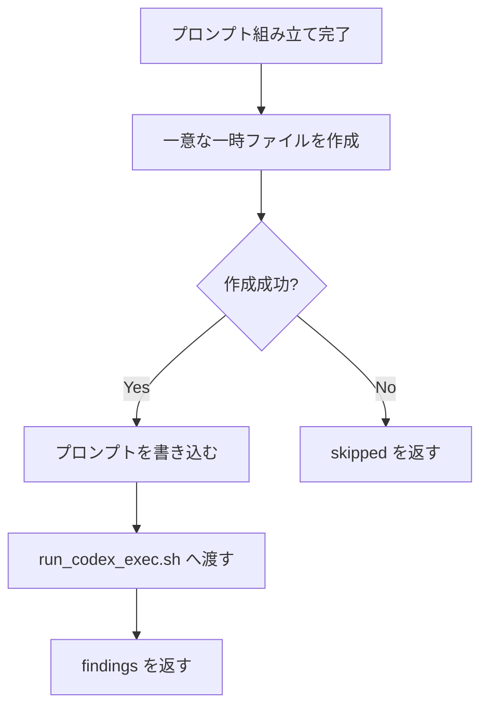

# codex-reviewer 一時ファイルの衝突防止 - 要件定義書

## 1. 概要

### 1.1 背景

review フェーズは複数の `codex-reviewer` を同一メッセージで並行起動する
（`references/review-phase.md` Phase R2「All Task calls go in a SINGLE message」）。
これらは同じセッションの scratchpad ディレクトリを共有する。

各レビュアーは Codex CLI へ渡すプロンプトを一時ファイルに書いてから
`run_codex_exec.sh` に食わせるが、ファイル名が `prompt.txt` のような固定名だと、
書き込みと読み出しの間に別のレビュアーが同じ名前で上書きする。結果として、
あるレビュアーが別観点のプロンプトを Codex に送り、その出力を自分の観点の
findings として返してしまう。

loop-develop の base-branch-refresh feature、review round 1 で実際に発生した。
performance 観点のレビュアーは最初の 2 回、security 観点のレビュアーは最初の 3 回の
Codex 呼び出しが他観点のプロンプトを実行していたと自己申告している。どちらも
自力で内容検証して気づいたため PID/RANDOM 修飾のファイル名に切り替えて復旧したが、
気づかなければ「security 観点のレビュー結果」として spec のレビューが記録に残る。

round 2 以降はオーケストレーター側のプロンプトで毎回「scratchpad の一時ファイル名は
PID/RANDOM で修飾すること」と明示して再発を防いだが、これはオーケストレーターが
毎回書き忘れないことに依存しており、エージェント定義側の保証にはなっていない。

### 1.2 目的

`codex-reviewer` エージェントが scratchpad に書く一時ファイルの名前を
エージェント定義の側で一意化し、並行実行された別観点のレビュアー同士が
上書きし合わないようにする。

### 1.3 スコープ

**対象**:

- `em-workflow/agents/codex-reviewer.md`
- `em-review/agents/codex-reviewer.md`

**スコープ外**:

- Codex CLI（`run_codex_exec.sh`）側のインターフェース変更。呼び出し側の
  ファイル名規約で解決できる範囲に留める。

## 2. ビジネス要件

### 2.1 ビジネス目標

並行レビューの結果が観点どおりであることを、エージェント定義レベルで保証する。

### 2.2 対象ユーザー

| ユーザータイプ | 説明 |
|----------------|------|
| em-workflow / em-review のオーケストレーター | 並行起動した codex-reviewer の findings を集約する |
| 開発者（人間） | レビュー記録を読んで修正判断をする |

### 2.3 期待される効果

- 並行レビューで観点の取り違えが起きない
- 再発防止がオーケストレーターのプロンプト記述に依存しなくなる

## 3. ユースケース

### 3.1 ユースケース一覧

| ID | ユースケース名 | アクター | 優先度 |
|----|----------------|----------|--------|
| UC01 | 複数観点の codex-reviewer を並行起動する | オーケストレーター | 高 |
| UC02 | 同一観点の codex-reviewer を再実行する | codex-reviewer | 高 |

### 3.2 ユースケース詳細

#### UC01: 複数観点の codex-reviewer を並行起動する

**アクター**: review フェーズのオーケストレーター

**事前条件**:

- codex CLI が利用可能
- 2 つ以上の観点で `codex_cross_validation` が発火している

**基本フロー**:

1. オーケストレーターが同一メッセージで複数の `codex-reviewer` を起動する
2. 各レビュアーが観点ブリーフから Codex プロンプトを組み立てる
3. 各レビュアーがプロンプトを **自分だけが使う一時ファイル** に書く
4. 各レビュアーがそのファイルを読み出して `run_codex_exec.sh` に渡す
5. 各レビュアーが自分の観点の findings を返す

**代替フロー**:

- 一時ファイルの作成に失敗した場合は、fail-closed でスキップ報告を返す

**事後条件**:

- 各レビュアーの findings が、そのレビュアーの観点のものである

#### UC02: 同一観点の codex-reviewer を再実行する

**アクター**: codex-reviewer 自身（リトライ時）またはオーケストレーター（次ラウンド）

**事前条件**: 同一観点のレビュアーが既に一時ファイルを作成済み

**基本フロー**:

1. 再実行されたレビュアーが一時ファイルを作成する
2. 既存ファイルとは異なるパスが割り当てられる

**事後条件**: 先行実行のファイルを上書きしていない

## 4. 機能要件

### 4.1 機能一覧

| ID | 機能名 | 説明 | 優先度 |
|----|--------|------|--------|
| F01 | 一時ファイル名の一意化規約 | エージェント定義に、一時ファイルを一意名で作る手順を明記する | 高 |
| F02 | 両プラグインへの適用 | em-workflow / em-review 双方の codex-reviewer に同じ規約を入れる | 高 |

### 4.2 機能詳細

#### F01: 一時ファイル名の一意化規約

**説明**: `codex-reviewer` が Codex プロンプト等を一時ファイル経由で扱う場合、
そのファイルは衝突しないパスに作る、という手順をエージェント定義（Step 5 の前後）に
明記する。名前は観点名だけで決めてはならず、プロセス単位で一意な要素を含める。

**処理フロー**:

**ビジネスルール**:

- 一時ファイル名は観点名だけで決定しない（同一観点の再実行でも衝突しない）
- 固定名（`prompt.txt` 等）は禁止

**エラーケース**:

| エラー | 条件 | 対応 |
|--------|------|------|
| 一時ファイル作成失敗 | scratchpad 書き込み不可等 | fail-closed でスキップ報告 |

#### F02: 両プラグインへの適用

**説明**: 同じ構造の問題が `em-review` プラグイン側の `codex-reviewer` にも存在する
ため、両方に同じ規約を入れる。

## 5. 非機能要件

### 5.1 パフォーマンス要件

該当なし（一時ファイル作成のコストは無視できる）。

### 5.2 セキュリティ要件

- 一時ファイルは予測可能な固定パスに作らない（scratchpad はセッション専用だが、
  推測可能な固定名は他プロセスからの上書きも許す）

### 5.3 可用性要件

該当なし。

### 5.4 保守性要件

- 規約はエージェント定義に書き、オーケストレーターのプロンプトに依存させない

### 5.5 互換性要件

- `run_codex_exec.sh` のインターフェースは変更しない

## 6. UI/UX要件

該当なし（UI を持たない）。

## 7. データ要件

該当なし。

## 8. 外部連携

| システム名 | 連携方法 | データ |
|------------|----------|--------|
| Codex CLI | `run_codex_exec.sh` の argv | プロンプト文字列 |

## 9. 制約条件

### 9.1 技術的制約

- `run_codex_exec.sh` はプロンプトを argv で受け取る。ファイル渡しのインターフェースは
  追加しない（スコープ外）
- エージェントが使えるツールは Bash / Read / Skill のみ

### 9.2 ビジネス上の制約

なし。

### 9.3 スケジュール制約

なし。

## 10. 想定される課題とリスク

### 10.1 技術的課題

| 課題 | 影響度 | 対応策 |
|------|--------|--------|
| エージェントが定義を読んでも一時ファイルを使わない実装を選ぶ | 低 | 「一時ファイルを使う場合は」という条件付き規約にし、使わない経路も許容する |
| 既存のオーケストレーター側プロンプトとの二重化 | 低 | エージェント定義を SSOT とする |

### 10.2 ビジネスリスク

| リスク | 発生確率 | 影響度 | 対応策 |
|--------|----------|--------|--------|
| 別観点の findings が記録に残り続ける | 中 | 高 | 本要件の実装で防ぐ |

## 11. 成功基準

### 11.1 受け入れ基準

- [ ] `codex-reviewer` が scratchpad に書く一時ファイル名が、エージェント定義の側で
      一意化されている（オーケストレーターのプロンプト頼みでない）
- [ ] 同一セッションで複数の codex-reviewer を並行起動しても、互いのプロンプト・
      出力ファイルが衝突しない
- [ ] 観点名だけでなく、同一観点が再実行された場合も衝突しない
- [ ] em-workflow / em-review の両プラグインに適用されている

## 12. テストシナリオ

### 12.1 テスト観点

- [ ] 正常系: 両プラグインの `codex-reviewer.md` に一意化手順が記載されている
- [ ] 異常系: 一時ファイル作成に失敗したときの挙動が定義されている
- [ ] 境界値: 同一観点の再実行でも衝突しない旨が明記されている
- [ ] セキュリティ: 固定名・予測可能名の禁止が明記されている

## 13. 用語定義

| 用語 | 定義 |
|------|------|
| scratchpad | Claude Code セッション専用の一時ファイル置き場 |
| 観点 | review perspective（security / performance / spec 等） |
| codex-reviewer | Codex CLI へレビューを委譲するサブエージェント |

## 14. 確認事項

### 14.1 確認済み事項

Notion タスクの記述から確定した事項（batch モード実行のため、ユーザーとの
対話は行っていない）:

- [x] 修正対象: 両プラグインの `codex-reviewer` エージェント定義
- [x] スコープ外: `run_codex_exec.sh` のインターフェース変更
- [x] 一意化の粒度: 観点名だけでは不十分（同一観点の再実行も衝突対象）

### 14.2 未確認・保留事項

- [ ] なし

## 15. 参考資料

- Notion タスク: [https://www.notion.so/3ab3509ec8ee812db0a9c11a44449b72](https://www.notion.so/3ab3509ec8ee812db0a9c11a44449b72)
- `em-workflow/references/review-phase.md` Phase R2 / R3
- `em-workflow/agents/codex-reviewer.md`
- `em-review/agents/codex-reviewer.md`
