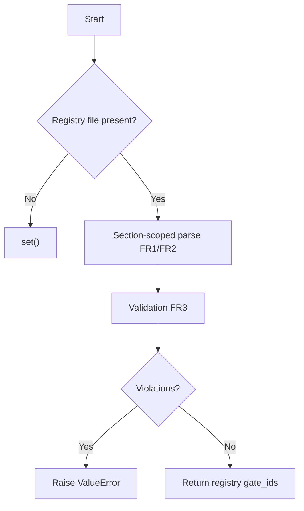

# exemption-registry-section-scope - Requirements

## 1. Overview

### 1.1 Background
The consumer-side exemption loader (`load_exempt_gate_ids` in `tests/test_gate_option_vocabulary.py`) and the doc-side registry parser (`_registry_section` / `parse_exemption_table_rows` / `validate_exemption_rows` in `tests/test_gate_option_vocabulary_doc.py`) are two separate implementations. The current code locates the registry with unanchored `text.find` / `text.index`, and the two implementations extract `gate_id` from the first cell with different rules.

### 1.2 Purpose
Only the table rows inside the `## Exemption registry` section of `em-workflow/references/gate-option-vocabulary.md` can exempt a gate from the gate-option correspondence sweep. A table anywhere else in that document must never exempt a gate without a signal.

### 1.3 Scope
- A shared, non-test helper module under `tests/` that holds the section extractor, row parser, row validator and exemption loader.
- `tests/test_gate_option_vocabulary_doc.py` and `tests/test_gate_option_vocabulary.py`, which import from that helper.
- Hermetic regression tests for the section-scoped loader, and updates to the existing `TestExemptionRegistryDegrade` fixtures.
- Out of scope: any file under `em-workflow/`, including `em-workflow/references/gate-option-vocabulary.md`.

## 2. Business Requirements

### 2.1 Business Goal
Only rows in the `## Exemption registry` section exempt a gate from the correspondence sweep.

### 2.2 Target Users
| User type | Description |
|-----------|-------------|
| em-workflow maintainer | Runs `python3 -m unittest discover -s tests` |

### 2.3 Expected Effects
- A table outside the `## Exemption registry` section never exempts a gate.
- An invalid registry row raises an exception.
- The doc side and the consumer side use the same extractor, parser and validator.

## 3. Use Cases

### 3.1 Use Case List
| ID | Use case | Actor | Priority |
|----|----------|-------|----------|
| UC01 | Run the correspondence sweep with section-scoped exemptions | em-workflow maintainer | High |

### 3.2 Use Case Details

#### UC01: Run the correspondence sweep with section-scoped exemptions

**Actor**: em-workflow maintainer

**Preconditions**:
- `em-workflow/references/gate-option-vocabulary.md` may be present or absent.

**Basic flow**:
1. The maintainer runs `python3 -m unittest discover -s tests`.
2. The correspondence sweep calls the exemption loader with the `action: select` gate-id set derived from `batch-policies.yaml`.
3. The loader reads only the `## Exemption registry` section, parses and validates its rows, and returns the set of exempted gate_ids.
4. The sweep checks every `action: select` gate not in that set.

**Alternative flows**:
- The registry file is absent: the loader returns `set()`.
- A registry row is invalid: the loader raises `ValueError` naming the violations.

**Postconditions**:
- With the real repository document (present, zero registry rows), the sweep covers all eleven select gates.

## 4. Functional Requirements

### 4.1 Function List
| ID | Name | Description | Priority |
|----|------|-------------|----------|
| FR1 | Section-scoped extraction | Collect pipe-table lines only between `## Exemption registry` and the next `## ` heading or EOF | High |
| FR2 | Row parsing | Skip header and separator rows; require exactly 3 cells per data row | High |
| FR3 | Row validation | Apply the `validate_exemption_rows` checks; the loader raises `ValueError` on violations | High |
| FR4 | Single shared helper | One non-test helper module under `tests/` used by both test modules | High |
| FR5 | `load_exempt_gate_ids` behavior | Absent file gives `set()`; present file is parsed, validated and returns registry gate_ids | High |
| FR6 | Hermetic regression tests | Synthetic-document tests for the section-scoped loader | High |
| FR7 | Existing hermetic tests updated | Rewrite the two `TestExemptionRegistryDegrade` fixtures | High |
| FR8 | Real repository unchanged in outcome | The real document still gives `set()`; the sweep still covers all eleven select gates | High |

### 4.2 Function Details

#### FR1: Section-scoped extraction

**Description**: A shared helper extracts the registry section. It starts at a line-anchored `## Exemption registry` heading and runs up to, but not including, the next line-start `## ` heading, or to EOF. A `### ` subheading does not end the section. Only pipe-table lines inside this section are collected.

**Input**:
- Document text: str - content of the registry document

**Output**:
- Pipe-table lines inside the `## Exemption registry` section

**Business rules**:
- The section start is a line-anchored `## Exemption registry` heading.
- The section end is the next line-start `## ` heading, or EOF.
- A `### ` subheading does not end the section.

#### FR2: Row parsing

**Description**: Inside the section, the header row and the separator row are skipped. Every data row must have exactly 3 cells, otherwise `ValueError` is raised. A section that is present but holds no table raises `ValueError`, which is the current behavior of the doc-side `parse_exemption_table_rows`.

**Validation**:
| Item | Rule | Error |
|------|------|-------|
| Data row | Exactly 3 cells | `ValueError` |
| Section | Present section holds a table | `ValueError` |

#### FR3: Row validation

**Description**: Parsed rows get the same checks as `validate_exemption_rows`: gate_id is an `action: select` entry of `batch-policies.yaml`, reason is non-empty, and compensating guarantee is non-empty. `validate_exemption_rows` keeps returning a list of violation strings that contain the existing substrings `missing a reason`, `missing a compensating guarantee` and ``not an `action: select` entry``. The consumer-side loader raises `ValueError` naming the violations when that list is non-empty.

**Validation**:
| Item | Rule | Violation substring |
|------|------|---------------------|
| gate_id | Is an `action: select` entry of `batch-policies.yaml` | ``not an `action: select` entry`` |
| reason | Non-empty | `missing a reason` |
| compensating guarantee | Non-empty | `missing a compensating guarantee` |

**Error cases**:
| Error | Condition | Handling |
|-------|-----------|----------|
| `ValueError` | The violation list is non-empty (consumer-side loader) | Raise naming the violations |

#### FR4: Single shared helper

**Description**: The section extractor, row parser, row validator and exemption loader live in exactly one non-test module under `tests/`, for example `tests/_gate_vocabulary.py`. Its name does not match `test*.py`, so `unittest discover` does not collect it. `tests/test_gate_option_vocabulary_doc.py` and `tests/test_gate_option_vocabulary.py` both import from it, and their local duplicates are removed. The doc-side `_registry_section` uses the shared extractor, so both sides use the same anchor.

#### FR5: `load_exempt_gate_ids` behavior

**Description**: If the registry file is absent, the result is `set()`; this keeps the existing D3 degrade. If the file is present, the loader does the section-scoped parse (FR1/FR2), then validation (FR3), then returns the set of gate_ids from the registry rows. The loader takes the `action: select` gate-id set as input, and the real call site passes the set derived from `batch-policies.yaml`.

**Input**:
- `action: select` gate-id set - derived from `batch-policies.yaml` at the real call site

**Output**:
- set of gate_ids from the registry rows

**Processing flow**:

#### FR6: Hermetic regression tests

**Description**: Synthetic-document tests are added.
- (a) An unrelated table whose first cell names a real select gate, such as a `## Gate option vocabulary` example row for `create-spec.feature-identity`, plus a zero-row `## Exemption registry` gives `set()`.
- (b) An unrelated table after the registry section is not counted.
- (c) A registry row that is missing its reason, missing its guarantee, names a non-select gate, or has the wrong cell count raises `ValueError`.
- (d) A valid row that names a select gate gives that gate_id.
- (e) An absent file gives `set()`.

#### FR7: Existing hermetic tests updated

**Description**: The two existing `TestExemptionRegistryDegrade` fixtures use a level-1 `# Exemption registry` heading and the non-select gate `some.gate`, so they are rewritten to the `## Exemption registry` level-2 heading and a real select gate id. `test_present_file_parses_listed_gate_ids` would otherwise return `set()` or raise under FR1/FR3.

#### FR8: Real repository unchanged in outcome

**Description**: The real `gate-option-vocabulary.md` (present, zero registry rows) still gives `set()`. The correspondence sweep still covers all eleven select gates. `em-workflow/references/gate-option-vocabulary.md` is not edited.

## 5. Non-Functional Requirements

### 5.1 Performance
Not applicable.

### 5.2 Security
Not applicable.

### 5.3 Availability
Not applicable.

### 5.4 Maintainability
- NFR1: Test code imports only the Python standard library (`test/README.md`).
- NFR3: The `ISSUING_SITE_MAP` stays in `tests/test_gate_option_vocabulary.py`. `gate-option-vocabulary.md` cites the map as living in the ``correspondence-check module under `tests/` ``, and `test_gate_option_vocabulary_doc.py:485` pins that wording.
- NFR5: No test module imports another test module. Importing the non-test helper keeps the existing convention stated in the `test_gate_option_vocabulary.py` docstring.

### 5.5 Compatibility
- NFR2: No file under `em-workflow/` changes, so neither `em-workflow/.claude-plugin/plugin.json` nor `.claude-plugin/marketplace.json` is bumped. Both stay at 0.2.1.
- NFR4: `TestFrozenMachineReadSurface` digest pins are unaffected (`workflow-patch.md`, `validate-worker-output.py`, `test_validate_worker_output.py`, the design-step fixture). None of those files is touched.

## 6. UI/UX Requirements

Not applicable. The design step is skipped: the change is confined to Python test code and a test helper under `tests/`, with no UI, visual, or interaction surface.

## 7. Data Requirements

### 7.1 Data Model Overview
Not applicable.

### 7.2 Data Items
| Entity | Item | Type | Required | Description |
|--------|------|------|----------|-------------|
| Exemption registry row | gate_id | str | Yes | An `action: select` entry of `batch-policies.yaml` |
| Exemption registry row | reason | str | Yes | Non-empty |
| Exemption registry row | compensating guarantee | str | Yes | Non-empty |

### 7.3 Data Retention
Not applicable.

## 8. External Integration

Not applicable.

## 9. Constraints

### 9.1 Technical Constraints
- Test code imports only the Python standard library (NFR1).
- No file under `em-workflow/` changes (NFR2).
- No test module imports another test module (NFR5).

### 9.2 Business Constraints
None.

### 9.3 Schedule Constraints
None.

### 9.4 Declared Change Set

Feature-specific paths are not listed by hand; they are derived at create-plan from every task's `files` in `workflow.yaml` (`references/phases/create-plan-phase.md`).

**Default members** (always part of the declaration unless the SPEC author explicitly removes them):
- `feature-docs/exemption-registry-section-scope/**`
- `test-docs/exemption-registry-section-scope/**`

`feature-docs/exemption-registry-section-scope/**` covers `REQUIREMENTS.md`, `SPEC.md`, `IMPLEMENTATION.md`, `workflow.yaml`, `phase-state/`, `tasks/`, `reviews/roundN.yaml`, `VERIFICATION.md`, `retrospect.yaml`, and the design artifacts the design step produces. Their producers are the phase documents and `references/phase-state.md` (cited only; rules not restated).

`test-docs/exemption-registry-section-scope/**` covers `{T}.tests.yaml` (path form: `test-docs/exemption-registry-section-scope/{T}.tests.yaml`). Its producer is `implement-phase.md` (cited only; rules not restated).

**Semantics**:
- Default members are part of the declaration unless the SPEC author explicitly removes them. Removal is a deliberate narrowing, never an omission.
- The declaration is a superset assertion: the actual change set must be CONTAINED IN the declaration. A declared path that is never produced is not a violation. A feature that produces no implement tasks creates no `test-docs/exemption-registry-section-scope/` directory, and the declared `test-docs/exemption-registry-section-scope/**` is still correct.

## 10. Anticipated Issues and Risks

### 10.1 Technical Issues
| Issue | Impact | Mitigation |
|-------|--------|------------|
| None identified | - | - |

### 10.2 Business Risks
| Risk | Probability | Impact | Mitigation |
|------|-------------|--------|------------|
| None identified | - | - | - |

## 11. Success Criteria

### 11.1 Acceptance Criteria
- [ ] AC-1: `load_exempt_gate_ids()` collects table rows only from the `## Exemption registry` heading up to the next `## ` heading, using the same shared extractor as the doc-side registry section.
- [ ] AC-2: Parsed exemption rows are checked the same way as `validate_exemption_rows` (3 cells, non-empty reason, non-empty compensating guarantee, gate_id in the `action: select` set). An invalid row raises an exception.
- [ ] AC-3: The shared parser/validator exists in one non-test helper module under `tests/`, and both `tests/test_gate_option_vocabulary_doc.py` and `tests/test_gate_option_vocabulary.py` use it.
- [ ] AC-4: A hermetic test shows that a synthetic document with an unrelated table plus a zero-row `## Exemption registry` gives `set()`.
- [ ] AC-5: `python3 -m unittest discover -s tests` passes.

### 11.2 KPI
Not applicable.

## 12. Test Scenarios

### 12.1 Test Perspectives
- [ ] TS-1 (AC-1, AC-4): An unrelated `## Gate option vocabulary`-style table naming `create-spec.feature-identity` placed before a zero-row `## Exemption registry` gives `set()`. This is the ticket's reproduction.
- [ ] TS-2 (AC-1): A table placed in a section after `## Exemption registry` (e.g. `## Scope`) is not read as an exemption.
- [ ] TS-3 (AC-1): A `### ` subheading inside the registry section does not end it.
- [ ] TS-4 (AC-2): Registry rows that are missing a reason, missing a guarantee, name a non-select gate, or have the wrong cell count each make the loader raise `ValueError`.
- [ ] TS-5 (AC-2): A valid registry row naming a select gate gives `{that gate_id}`.
- [ ] TS-6 (AC-3): Both test modules resolve the extractor/parser/validator from the shared helper, and no local duplicate remains. Checked by the updated modules importing from the helper.
- [ ] TS-7 (AC-5): Absent file gives `set()`. The real repository registry gives `set()`. The existing doc-side AC-3/AC-4 tests and the correspondence sweep stay green in a full `discover` run.

## 13. Glossary

| Term | Definition |
|------|------------|
| Exemption registry | The `## Exemption registry` section of `em-workflow/references/gate-option-vocabulary.md` |
| Select gate | A gate that is an `action: select` entry of `batch-policies.yaml` |
| Correspondence sweep | The gate-option correspondence check in `tests/test_gate_option_vocabulary.py` |
| D3 degrade | The existing behavior where an absent registry file gives `set()` |

## 14. Confirmation Items

### 14.1 Confirmed Items
None. This run is in batch mode and received no user answers.

### 14.2 Unconfirmed / Pending Items (assumptions)
- [ ] A-1: The section end is the next line-start `## ` heading or EOF, not the fixed `## Scope` marker that the doc-side `_registry_section` uses today. The two are equal for the current document, because `## Scope` is the next level-2 heading. The ticket's DoD states both "next `## ` heading" and "same anchor as `_registry_section`", and switching the doc side to the shared extractor satisfies both.
- [ ] A-2: The heading match is line-anchored (`^## Exemption registry\s*$`), not a substring find. A substring find would also match `### Exemption registry` or prose. The first occurrence is used.
- [ ] A-3: A present registry file with no `## Exemption registry` section gives `set()`, which is fail-safe because every gate stays checked. An unreadable present file (`OSError`) also gives `set()`, as it does today. A present section that holds no table raises `ValueError`, as the doc side does today.
- [ ] A-4: gate_id extraction from the first cell follows the doc-side rule (strip backticks), so the existing doc-side tests keep their behavior. The loader receives the select gate-id set as a parameter rather than reading `batch-policies.yaml` itself.
- [ ] A-5: The stale wording in `tests/test_gate_option_vocabulary.py` is updated to say the registry is present with zero rows, and the `== set()` assertion is kept. This covers the module docstring lines 40-43 ("degrading to zero exemptions when the file is absent -- which it is"), the `load_exempt_gate_ids` docstring, and the name and comment of `test_real_repository_registry_is_absent_in_this_worktree`.
- [ ] A-6: `import _gate_vocabulary` resolves under `python3 -m unittest discover -s tests` (`tests/` is inserted into `sys.path` as the top-level dir) and under direct `python3 tests/<module>.py` execution. The implementer must confirm that the helper import also works for any other invocation the project uses.
- [ ] A-7: Fenced code blocks inside `gate-option-vocabulary.md` are not specially handled. A line starting `## ` inside a fence would still end a section.

## 15. References

- `em-workflow/references/gate-option-vocabulary.md`: the registry document
- `tests/test_gate_option_vocabulary.py`: consumer-side loader and correspondence sweep
- `tests/test_gate_option_vocabulary_doc.py`: doc-side registry parser and validator
- `test/README.md`: standard-library-only rule for test code
