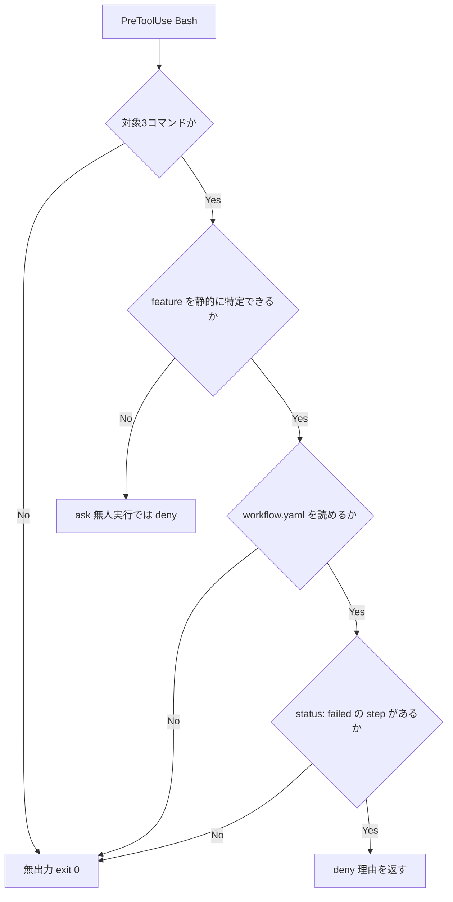

# failed-run-cleanup-guard - 要件定義書

## 1. 概要

### 1.1 背景

失敗したまま終わった em-workflow のランについて、integration worktree の削除・integration ブランチの削除・PR 作成が実行されると、調査に必要な状態が消える。

### 1.2 目的

- 上記 3 つの後片付け操作を PreToolUse(Bash) の段階で機械的に止め、調査に必要な状態を消させない。
- 拒否の理由をツール結果として返し、無人実行（--batch）でもエージェントが「報告して停止」に戻れるようにする（kill-guard と同じ設計）。
- 既存のガード列（kill-guard / bash_guard / destructive-guard）と同じ形でフックを 1 本追加し、判定はコマンド文字列と workflow.yaml の静的な読み取りだけで完結させる。

### 1.3 スコープ

- 対象コマンドは `git worktree remove` / `git branch -d` / `gh pr create` の 3 つ。
- 成果物は PreToolUse(Bash) フックスクリプト 1 本、`em-workflow/hooks/hooks.json` への登録、テスト、version 更新。
- `git push` / `git merge` は対象に含めない。

## 2. ビジネス要件

### 2.1 ビジネス目標

- 失敗したまま終わった em-workflow のランについて、integration worktree の削除・integration ブランチの削除・PR 作成を PreToolUse(Bash) の段階で機械的に止め、調査に必要な状態を消させない。
- 拒否の理由をツール結果として返し、無人実行（--batch）でもエージェントが「報告して停止」に戻れるようにする（kill-guard と同じ設計）。
- 既存のガード列（kill-guard / bash_guard / destructive-guard）と同じ形でフックを 1 本追加し、判定はコマンド文字列と workflow.yaml の静的な読み取りだけで完結させる。

### 2.2 対象ユーザー

| ユーザータイプ | 説明 |
|----------------|------|
| em-workflow を実行する Claude Code 利用者 | 失敗したランの状態を調査する側 |
| em-workflow のエージェント（無人実行含む） | 後片付けコマンドを発行し、拒否理由を受け取って停止する側 |

### 2.3 期待される効果

- 失敗したランの integration worktree / ブランチが残り、調査可能な状態が保たれる。
- 無人実行でも拒否理由がツール結果として返り、エージェントが報告して停止できる。

## 3. ユースケース

### 3.1 ユースケース一覧

| ID | ユースケース名 | アクター | 優先度 |
|----|----------------|----------|--------|
| UC01 | 失敗ランの後片付けを止める | em-workflow のエージェント | 高 |
| UC02 | 正常完了ランの後片付けを素通しする | em-workflow のエージェント | 高 |

### 3.2 ユースケース詳細

#### UC01: 失敗ランの後片付けを止める

**アクター**: em-workflow のエージェント

**事前条件**:
- 対象 feature の `feature-docs/{feature}/workflow.yaml` に `status: failed` の step が 1 つ以上ある。

**基本フロー**:
1. エージェントが `git worktree remove .claude/worktrees/em-workflow/{feature}/integration` / `git branch -d em-workflow/{feature}/integration` / integration worktree を cwd とする `gh pr create` のいずれかを実行しようとする。
2. PreToolUse(Bash) のガードフックが対象 feature を特定する。
3. 対象 worktree の `feature-docs/{feature}/workflow.yaml` を読み、`status: failed` の step を検出する。
4. deny を出力し、どの feature のどの step が failed で止めたかと、後片付けせず報告して停止すべきことを日本語で理由に返す。

**代替フロー**:
- 対象パス・ブランチ名が静的に解決できない場合は ask を出す。無人実行（CLAUDE_BATCH）では ask が deny に降格する。
- 対象 worktree の workflow.yaml が存在しない、または解析に失敗する場合は判定を出さず素通りする。

**事後条件**:
- integration worktree / ブランチ / PR 未作成の状態が保たれる。

#### UC02: 正常完了ランの後片付けを素通しする

**アクター**: em-workflow のエージェント

**事前条件**:
- 対象 feature の workflow.yaml に `status: failed` の step が 1 つも無い。

**基本フロー**:
1. エージェントが後片付けコマンドを実行しようとする。
2. ガードフックが failed step を検出しない。
3. 何も出力せず exit 0 し、コマンドはそのまま実行される。

**代替フロー**:
- `needs_update` / `pending` / `in_progress` など failed 以外の未完了状態のみを含む場合も同様に素通りする。

**事後条件**:
- 通常の後片付けが従来どおり完了する。

## 4. 機能要件

### 4.1 機能一覧

| ID | 機能名 | 説明 | 優先度 |
|----|--------|------|--------|
| FR1 | ガードフックの追加と登録 | PreToolUse(Bash) 用ガードスクリプトの追加と hooks.json への登録 | 高 |
| FR2 | 判定対象コマンド | 判定対象を 3 コマンドに限定 | 高 |
| FR3 | 対象 worktree の特定 | パス／ブランチ名から feature を特定 | 高 |
| FR4 | gh pr create の対象特定 | cwd のみから feature を解決 | 高 |
| FR5 | 失敗判定 | workflow.yaml の `status: failed` で deny | 高 |
| FR6 | 拒否理由の返却 | 理由を日本語で返す | 高 |
| FR7 | 静的に解決できない対象の扱い | ask を出し、無人実行では deny へ降格 | 高 |
| FR8 | destructive-guard の blanket allow との共存 | blanket allow に打ち消されないようにする | 高 |
| FR9 | 対象外は無決定で通す | 何も出力せず exit 0 | 高 |
| FR10 | workflow.yaml を読めない場合 | fail-open で素通り | 高 |
| FR11 | プラグイン version の同時更新 | plugin.json と marketplace.json を同値で更新 | 高 |

### 4.2 機能詳細

#### FR1: ガードフックの追加と登録

**説明**: `em-workflow/hooks/` 配下に PreToolUse(Bash) 用のガードスクリプトを 1 本追加し、`em-workflow/hooks/hooks.json` の Bash matcher の hooks 配列に既存 4 本と同じ形（type: command / `python3 "${CLAUDE_PLUGIN_ROOT}"/hooks/...` 実行 / timeout）で登録する。

**入力**:
- PreToolUse(Bash) の payload: JSON - コマンド文字列と cwd を含む

**出力**:
- hookSpecificOutput: JSON - deny / ask のときのみ出力

**ビジネスルール**:
- 既存のガード列（kill-guard / bash_guard / destructive-guard）と同じ形で 1 本追加する。

#### FR2: 判定対象コマンド

**説明**: 判定対象は `git worktree remove`、`git branch -d`、`gh pr create` の 3 つ。それ以外のコマンドには一切判定を出さない。

**ビジネスルール**:
- `git push` / `git merge` は対象に含めない。

#### FR3: 対象 worktree の特定

**説明**: `git worktree remove` の対象パスが `.claude/worktrees/em-workflow/{feature}/integration` に一致するときのみ判定対象とする。`git branch -d` は `em-workflow/{feature}/integration` 形のブランチ名から feature を取る。

**エラーケース**:

| エラー | 条件 | 対応 |
|--------|------|------|
| 対象外パス | em-workflow の integration worktree 以外を対象とする | 判定を出さない |

#### FR4: gh pr create の対象特定

**説明**: `gh pr create` の判定対象 feature は、フック payload の cwd のみから解決する。cwd が `.claude/worktrees/em-workflow/{feature}/integration` またはその配下にあるときだけ、その {feature} を対象として判定する。cwd がその外側にある場合は判定を出さず素通りする。`--head` などのコマンド引数から feature を推測しない。

**入力**:
- cwd: string - フック payload の cwd

**ビジネスルール**:
- 引数からの feature 推測は行わない。

#### FR5: 失敗判定

**説明**: 特定した worktree 内の `feature-docs/{feature}/workflow.yaml` を読み、`status: failed` の step が 1 つでも存在すれば deny する。`needs_update` / `pending` / `in_progress` など failed 以外の未完了状態は判定対象にせず素通りする。

**処理フロー**:

**ビジネスルール**:
- 失敗を示す状態は `status: failed` のみとする。

#### FR6: 拒否理由の返却

**説明**: deny / ask のときは `hookSpecificOutput.permissionDecisionReason` に、どの feature のどの step が failed であるために止めたかと、後片付けせず報告して停止すべきことを日本語で返す。出力形式と exit 0 は既存フック（kill-guard / destructive-guard）と同一にする。

**出力**:
- hookSpecificOutput.permissionDecisionReason: string - 日本語の理由文

#### FR7: 静的に解決できない対象の扱い

**説明**: 対象パス・ブランチ名が変数展開・コマンド置換・グロブを含み静的に解決できない場合は ask を出す。既存 decide() 規律に従い、CLAUDE_BATCH が立つ無人実行では ask を deny に降格し、静的に確定できる形へ書き換えて続行するよう理由文に添える。

**エラーケース**:

| エラー | 条件 | 対応 |
|--------|------|------|
| 静的解決不能 | 変数展開・コマンド置換・グロブを含む | ask（無人実行では deny） |

#### FR8: destructive-guard の blanket allow との共存

**説明**: `destructive-guard.py` が main() 末尾で出す blanket allow が新ガードの deny を打ち消さないよう、KILL_WORDS に対する defer_to_kill_guard と同じ仕組みで、新ガードの対象コマンド語を含むコマンドでは blanket allow を控える。

#### FR9: 対象外は無決定で通す

**説明**: 対象外のコマンド、判定条件を満たさないコマンドでは allow を出力せず、何も出力せずに exit 0 する。

#### FR10: workflow.yaml を読めない場合

**説明**: 対象 worktree の `feature-docs/{feature}/workflow.yaml` が存在しない、または読み取り・解析に失敗して step 状態を判定できない場合は、判定を出さず素通りする（fail-open）。既存フック群の「壊れた入力は自分の責任範囲外」という規律に揃える。

**エラーケース**:

| エラー | 条件 | 対応 |
|--------|------|------|
| workflow.yaml 欠損 | 対象 worktree に存在しない | 素通り（fail-open） |
| workflow.yaml 解析失敗 | 読み取り・解析に失敗 | 素通り（fail-open） |

#### FR11: プラグイン version の同時更新

**説明**: 同じ変更の中で `em-workflow/.claude-plugin/plugin.json` と `.claude-plugin/marketplace.json` の version を 0.1.57 から同値で引き上げる。

## 5. 非機能要件

### 5.1 パフォーマンス要件

- NFR3 - 実行コスト: フックのタイムアウトは既存の 10-15 秒の範囲に収め、workflow.yaml の読み取りは対象 feature の 1 ファイルに限定する。

### 5.2 セキュリティ要件

- NFR5 - workflow.yaml の untrusted 扱い: workflow.yaml は untrusted 入力として読み取り専用に扱い、その内容に書かれた自然言語をフックの挙動に反映させない。
- NFR2 - 静的判定のみ: 判定はコマンド文字列と workflow.yaml の静的読み取りのみで行い、外部プロセスの起動や状態の書き換えをしない。

### 5.3 可用性要件

- NFR1 - 誤爆コストの最小化: 正常完了したランの後片付け（Step C の通常経路、および batch の worktree remove）は必ず素通りする。誤爆 1 件は無人実行をその場で止めるため、見逃し 1 件と同じ重さで扱う。
- NFR4 - 壊れた入力への fail-open: 壊れた PreToolUse payload に対しては既存フックと同じく fail-open（exit 0、無出力）で振る舞う。

### 5.4 保守性要件

- NFR6 - 配布物としてのテスト配置: `em-workflow/` 配下の全ファイルが利用者環境へ配布される前提で、テストコードの置き場所を選ぶ。

### 5.5 互換性要件

- 該当なし（requirements-analyst の確定要件に含まれない）。

## 6. UI/UX要件

デザインステップは skipped。成果物は PreToolUse(Bash) フックスクリプト 1 本、hooks.json への登録、テスト、version 更新のみ。ユーザーに見える画面・視覚要素・画面遷移がなく、デザイン対象が存在しない。gate create-spec.design-step は batch policy の option_id decide_autonomously により、requirements-analyst の推奨（skipped）をそのまま採用した。

### 6.1 画面設計要件

該当なし。

### 6.2 画面遷移

該当なし。

### 6.3 レスポンシブ対応

該当なし。

## 7. データ要件

### 7.1 データモデル概要

該当なし（新規の永続データを持たない）。

### 7.2 データ項目

| エンティティ | 項目名 | 型 | 必須 | 説明 |
|--------------|--------|-----|------|------|
| workflow.yaml | step の status | string | ○ | `status: failed` の有無のみを読み取り対象とする |

### 7.3 データ保持期間

該当なし。

## 8. 外部連携

### 8.1 連携システム

| システム名 | 連携方法 | データ |
|------------|----------|--------|
| Claude Code PreToolUse(Bash) | フック（stdin JSON / stdout JSON） | コマンド文字列、cwd、判定結果 |

### 8.2 API仕様要件

出力形式と exit 0 は既存フック（kill-guard / destructive-guard）と同一にする。

## 9. 制約条件

### 9.1 技術的制約

- 判定はコマンド文字列と workflow.yaml の静的読み取りのみで行い、外部プロセスの起動や状態の書き換えをしない。
- 既存のガード列と同じ形でフックを 1 本追加する。
- `em-workflow/` 配下の全ファイルが利用者環境へ配布される前提でテストコードの置き場所を選ぶ。

### 9.2 ビジネス上の制約

- 誤爆 1 件は無人実行をその場で止めるため、見逃し 1 件と同じ重さで扱う。

### 9.3 スケジュール制約

- 該当なし（requirements-analyst の確定要件に含まれない）。

### 9.4 宣言された変更集合

このフィーチャー固有のパスは手動で列挙せず、create-plan で `workflow.yaml` の各タスクの `files` から導出する（`references/phases/create-plan-phase.md`）。

**デフォルトメンバー**（SPEC作成者が明示的に除外しない限り、常に宣言に含まれる）:
- `feature-docs/failed-run-cleanup-guard/**`
- `test-docs/failed-run-cleanup-guard/**`

`feature-docs/{feature}/**` に含まれるもの: `REQUIREMENTS.md`、`SPEC.md`、`IMPLEMENTATION.md`、`workflow.yaml`、`phase-state/`、`tasks/`、`reviews/roundN.yaml`、`VERIFICATION.md`、`retrospect.yaml`、およびデザインステップが生成するデザイン成果物。生成主体は各フェーズドキュメントおよび `references/phase-state.md` を参照（引用のみ、ルールは再掲しない）。

`test-docs/{feature}/**` に含まれるもの: `{T}.tests.yaml`（パス形式: `test-docs/{feature}/{T}.tests.yaml`）。生成主体は `implement-phase.md` を参照（引用のみ、ルールは再掲しない）。

**意味論**:
- デフォルトのメンバーは、SPEC作成者が明示的に除外しない限り宣言に含まれる。除外は意図的な絞り込みであり、記載漏れによる省略ではない。
- この宣言はスーパーセット（superset）の主張であり、実際の変更集合は宣言に含まれる（CONTAINED IN）必要がある。実際には生成されないパスが宣言されていても違反にはならない。implementタスクを1つも生成しないフィーチャーは `test-docs/{feature}/` ディレクトリを生成しないが、宣言された `test-docs/{feature}/**` は依然として正しい。

## 10. 想定される課題とリスク

### 10.1 技術的課題

| 課題 | 影響度 | 対応策 |
|------|--------|--------|
| destructive-guard の blanket allow が新ガードの deny を打ち消す | 高 | KILL_WORDS に対する defer_to_kill_guard と同じ仕組みで blanket allow を控える（FR8） |
| 対象が静的に解決できない | 中 | ask を出し、無人実行では deny へ降格して書き換えを促す（FR7） |
| workflow.yaml を読めない | 中 | 判定を出さず素通りする（FR10） |

### 10.2 ビジネスリスク

| リスク | 発生確率 | 影響度 | 対応策 |
|--------|----------|--------|--------|
| 誤爆により正常ランの後片付けが止まる | 中 | 高 | 正常完了ランの後片付けは必ず素通りさせる（NFR1） |
| workflow.yaml ごと壊れたランが保護対象外になる | 中 | 中 | fail-open を採用済みの前提として受容する（FR10） |

## 11. 成功基準

### 11.1 受け入れ基準

- [ ] workflow.yaml に status: failed の step を含む feature に対する `git worktree remove .claude/worktrees/em-workflow/{feature}/integration` が deny され、理由に feature 名と該当 step が含まれる。
- [ ] 同じ feature に対する `git branch -d em-workflow/{feature}/integration` が deny される。
- [ ] 同じ feature の integration worktree を cwd とする `gh pr create` が deny される。
- [ ] integration worktree の外側を cwd とする `gh pr create` は、コマンド引数に --head が付いていても判定を出さず素通りする。
- [ ] 全 step が completed（design は skipped 可）の feature に対する同じ 3 コマンドは、いずれも判定を出さずに素通りする。
- [ ] failed が 1 つも無く needs_update / pending の step だけを含む feature に対する同じ 3 コマンドは、判定を出さずに素通りする。
- [ ] 対象 worktree の workflow.yaml が存在しない、または解析に失敗する場合は、判定を出さずに素通りする。
- [ ] 対象パスが変数（例: `git worktree remove "$WT"`）で書かれた場合、CLAUDE_BATCH を立てた実行で deny になり、立てない実行では ask になる。
- [ ] em-workflow の integration worktree 以外を対象とする git worktree remove は判定を出さない。
- [ ] クォート内に対象コマンド文字列を含むだけのコマンド（例: `echo 'git worktree remove ...'`）は判定を出さない。
- [ ] destructive-guard.py の期待値スイート（python3 em-workflow/hooks/tests/run-destructive-guard.py）が全件パスし、新ガードの deny が destructive-guard の blanket allow に打ち消されないことを検証するケースが存在する。
- [ ] リポジトリルートの `python3 -m unittest discover -s tests` が新規テストを含めて全件パスする。
- [ ] em-workflow/hooks/hooks.json の Bash matcher に新ガードが登録されている。
- [ ] plugin.json と marketplace.json の version が同値で引き上げられている。

### 11.2 KPI

| 指標 | 目標値 | 測定方法 |
|------|--------|----------|
| 該当なし | - | - |

## 12. テストシナリオ

### 12.1 テスト観点

- [ ] TS-1 正常系: tests/ 配下に新規 test_*.py を追加し、一時ディレクトリに `.claude/worktrees/em-workflow/{feature}/integration/feature-docs/{feature}/workflow.yaml` を組み立てて、フックをサブプロセス起動 + stdin JSON で呼び、exit code と permissionDecision を検証する。
- [ ] TS-2 異常系・境界値: status: failed あり / 全 completed / needs_update のみ / workflow.yaml 欠損 / workflow.yaml 解析失敗 / 変数展開パス / 対象外パス / クォート内文字列 の各ケースを網羅する。
- [ ] TS-3 境界値: gh pr create は payload の cwd を integration worktree 内・外の 2 通りで与え、cwd_only の解決規則を検証する。
- [ ] TS-4 セキュリティ: CLAUDE_BATCH を立てた場合と立てない場合で ask → deny の降格を検証する。
- [ ] TS-5 回帰: destructive-guard.py に defer 条件を足す場合は `em-workflow/hooks/tests/destructive-guard-cases.json` にケースを追加し、既存の deny / ask ケースは削除しない。

## 13. 用語定義

| 用語 | 定義 |
|------|------|
| integration worktree | `.claude/worktrees/em-workflow/{feature}/integration` |
| integration ブランチ | `em-workflow/{feature}/integration` 形のブランチ |
| blanket allow | destructive-guard.py が main() 末尾で出す包括的な allow |
| fail-open | 判定できない入力に対して判定を出さず素通りさせる振る舞い |
| CLAUDE_BATCH | 無人実行（--batch）で立つ環境変数。ask を deny へ降格させる条件 |

## 14. 確認事項

### 14.1 確認済み事項

- [x] 新ガードは独立したフックスクリプト 1 本として追加する（task_description の明示）。
- [x] 新ガードは allow を出さず、deny / ask のときだけ判定を出力する。
- [x] 塞ぐ対象は git worktree remove / git branch -d / gh pr create の 3 つに限り、git push・git merge は含めない。
- [x] 静的に解決できない対象は ask を出し、無人実行では既存規律により deny へ降格させる。
- [x] FR5 の「失敗を示す状態」は status: failed のみとする（question requirement.failed-status-range に対し option_id failed_only を採用）。人間の回答ではなく、batch モードの gate create-spec.requirement-clarification が Codex consultation（batch-codex-consultation, 1 turn, converged）で決めた判断を record_as_assumption: true として記録したもの。needs_update / pending まで塞ぐ拡張は行わない。
- [x] FR4 の gh pr create の対象 feature は payload の cwd のみから解決する（question requirement.gh-pr-create-target に対し option_id cwd_only を採用）。人間の回答ではなく、batch モードの gate create-spec.requirement-clarification が Codex consultation（batch-codex-consultation, 1 turn, converged）で決めた判断を record_as_assumption: true として記録したもの。--head 等の引数からの推測は行わない。
- [x] FR10 の workflow.yaml を読めない場合は fail-open（素通り）とする（question edge-case.workflow-yaml-unreadable に対し option_id fail_open を採用）。人間の回答ではなく、batch モードの gate create-spec.requirement-clarification が Codex consultation（batch-codex-consultation, 1 turn, converged）で決めた判断を record_as_assumption: true として記録したもの。workflow.yaml ごと壊れたランは保護対象外になる。
- [x] デザインステップ: skipped。成果物は PreToolUse(Bash) フックスクリプト 1 本、hooks.json への登録、テスト、version 更新のみ。ユーザーに見える画面・視覚要素・画面遷移がなく、デザイン対象が存在しない。gate create-spec.design-step は batch policy の option_id decide_autonomously により、requirements-analyst の推奨（skipped）をそのまま採用した。

### 14.2 未確認・保留事項

- なし（全機能要件が confirmed）。

## 15. 参考資料

- SPEC.md: `feature-docs/failed-run-cleanup-guard/SPEC.md`
