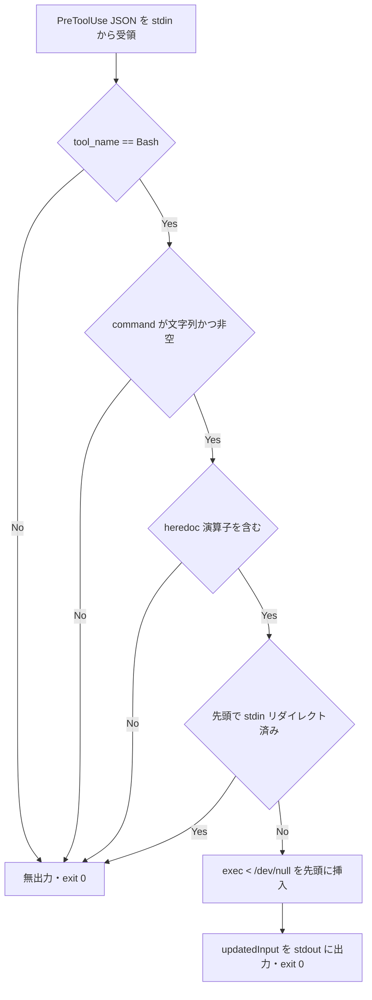

# heredoc-stdin-guard - 要件定義書

## 1. 概要

### 1.1 背景

heredoc を含む Bash ツール呼び出しでは、Claude Code が子プロセスの stdin に
`/dev/null` を与えない。その結果、同一コマンド内で stdin を読む CLI
（`codex exec` 等）が、Claude Code 本体との Unix ソケットに繋がったまま
EOF を待ち続け、永久にブロックする。`/em-workflow:develop --batch` の無人実行が
この経路で 2 時間 12 分停止し、codex プロセスの CPU 時間は `00:00:00` のまま
だった。

### 1.2 目的

PreToolUse フックで対象コマンドを検出し、`updatedInput` によってコマンド先頭に
`exec < /dev/null` を挿入することで、この停止経路を塞ぐ。

### 1.3 スコープ

対象:

- `em-workflow/hooks/heredoc-stdin-guard.py` の新規追加
- `em-workflow/hooks/hooks.json` への登録（PreToolUse / matcher `Bash` の 7 本目）
- `tests/test_heredoc_stdin_guard.py` の新規追加
- `em-workflow/.claude-plugin/plugin.json` と `.claude-plugin/marketplace.json` の
  version 更新（0.1.72 → 0.1.73）

対象外:

- `~/.claude/hooks/` のグローバルフック（変更しない）
- 環境変数 `CLAUDE_CODE_THRIFTY_SONIC` に依存する対処
- 既存 6 本のフックの順序・内容の変更

## 2. ビジネス要件

### 2.1 ビジネス目標

| ID | 目標 |
|----|------|
| BO1 | heredoc を含む 1 回の Bash 呼び出しで、後続コマンドの stdin が Claude Code 本体との Unix ソケットに繋がったまま残らないようにし、stdin を読む CLI（codex exec 等）が EOF 待ちで永久ブロックする経路を塞ぐ。 |
| BO2 | `/em-workflow:develop --batch` の無人実行が、この経路で無限停止しない状態にする。 |
| BO3 | 対処を em-workflow プラグイン配下のフックとして閉じ、未文書のフィーチャーフラグ（CLAUDE_CODE_THRIFTY_SONIC）への依存を持たない。 |

### 2.2 対象ユーザー

| ユーザータイプ | 説明 |
|----------------|------|
| em-workflow の無人実行利用者 | `/em-workflow:develop --batch` を人が張り付かずに走らせる利用者 |
| em-workflow の対話利用者 | Bash ツールで heredoc と stdin を読むコマンドを同一呼び出しに書く利用者 |

### 2.3 期待される効果

- heredoc 経由の stdin ブロックによる無人実行の停止が起きなくなる。
- 対処が em-workflow プラグイン配下に閉じ、グローバル設定や未文書フラグに依存しない。

## 3. ユースケース

### 3.1 ユースケース一覧

| ID | ユースケース名 | アクター | 優先度 |
|----|----------------|----------|--------|
| UC01 | heredoc を含む Bash 呼び出しの stdin 遮断 | Claude Code の PreToolUse フック機構 | 高 |
| UC02 | 対象外コマンドの素通し | Claude Code の PreToolUse フック機構 | 高 |

### 3.2 ユースケース詳細

#### UC01: heredoc を含む Bash 呼び出しの stdin 遮断

**アクター**: Claude Code の PreToolUse フック機構

**事前条件**:

- `em-workflow/hooks/hooks.json` の PreToolUse / matcher `Bash` にフックが登録されている
- `tool_name` が `Bash` である

**基本フロー**:

1. フックが PreToolUse の JSON を stdin から受け取る
2. `tool_input.command` に heredoc 演算子（`<<` / `<<-`）が含まれることを検出する
3. コマンド先頭で stdin がリダイレクトされていないことを確認する
4. コマンド先頭に `exec < /dev/null` を挿入した command を組み立てる
5. `hookSpecificOutput.updatedInput` として stdout に出力し、exit 0 で終了する

**代替フロー**:

- 既にコマンド先頭で stdin がリダイレクト済みの場合は、何も出力せず exit 0（冪等性）
- 解析不能・内部例外の場合は、何も出力せず exit 0（fail open）

**事後条件**:

- 実行されるコマンドの先頭で stdin が `/dev/null` に繋がっている
- heredoc 本文は 1 バイトも欠けずに書き出される

#### UC02: 対象外コマンドの素通し

**アクター**: Claude Code の PreToolUse フック機構

**事前条件**:

- フックが PreToolUse の JSON を stdin から受け取っている

**基本フロー**:

1. `tool_name` が `Bash` でない、または command に heredoc が含まれない、または
   既に stdin がリダイレクト済みであることを検出する
2. 何も出力せず exit 0 で終了する

**代替フロー**:

- 不正 JSON、command キー欠落、空文字 command の場合も同じく無出力・exit 0

**事後条件**:

- ツール呼び出しは元の `tool_input` のまま実行される

## 4. 機能要件

### 4.1 機能一覧

| ID | 機能名 | 説明 | 優先度 |
|----|--------|------|--------|
| FR1 | heredoc-stdin-guard フックの新規追加 | PreToolUse フックスクリプトの追加 | 高 |
| FR2 | 書き換え対象の検出条件 | heredoc 演算子と先頭 stdin リダイレクトの有無で判定 | 高 |
| FR3 | updatedInput によるコマンド先頭への stdin 遮断挿入 | `exec < /dev/null` の挿入 | 高 |
| FR4 | 冪等性 | 二重挿入をしない | 高 |
| FR5 | tool_input の他フィールド保全 | command 以外を元の値のまま返す | 高 |
| FR6 | fail open | 解析不能・例外時は無出力・exit 0 | 高 |
| FR7 | hooks.json への登録位置 | PreToolUse / matcher `Bash` の 7 本目 | 高 |
| FR8 | テストの配置と形式 | `tests/test_heredoc_stdin_guard.py` に unittest で配置 | 高 |
| FR9 | プラグイン version の更新 | 0.1.72 → 0.1.73 を 2 箇所へ | 高 |

### 4.2 機能詳細

#### FR1: heredoc-stdin-guard フックの新規追加

**説明**: `em-workflow/hooks/heredoc-stdin-guard.py` を新規に追加する。PreToolUse
イベントの JSON を stdin から受け取り、判定結果を stdout に出力して exit 0 で
終了する、既存フックと同一の契約で動作する Python スクリプトとする。

**入力**:

- stdin: PreToolUse イベントの JSON（`tool_name`、`tool_input` を含む）

**出力**:

- stdout: 判定結果の JSON、または空
- exit code: 0

#### FR2: 書き換え対象の検出条件

**説明**: `tool_name` が `Bash` であり、`tool_input.command` が heredoc 演算子
（`<<` / `<<-`、here-string `<<<` を除く）を含み、かつコマンド先頭で stdin が
既にリダイレクトされていない場合を、書き換え対象とする。

**処理フロー**:



**ビジネスルール**:

- here-string `<<<` は heredoc として扱わない。
- 判定は静的解析のみで行う。

#### FR3: updatedInput によるコマンド先頭への stdin 遮断挿入

**説明**: 書き換え対象と判定した場合、`hookSpecificOutput.updatedInput` で
コマンド先頭に `exec < /dev/null` を挿入した command を返す。
`hookSpecificOutput` オブジェクトは `updatedInput` と併せて
`"hookEventName": "PreToolUse"` を必ず持つ。Claude Code は `hookEventName` を
欠いた `hookSpecificOutput` を拒否し、拒否された出力では `updatedInput` が
適用されないため、フックが無言の no-op になるからである。`permissionDecision`
メンバーは出力しない。`permissionDecision: "deny"` は決して返さない。

**出力**:

- `hookSpecificOutput.hookEventName`: `"PreToolUse"`
- `hookSpecificOutput.updatedInput.command`: `exec < /dev/null` で始まる command 文字列

書き換え対象のときの stdout の正規形は次のとおり:

```json
{
  "hookSpecificOutput": {
    "hookEventName": "PreToolUse",
    "updatedInput": {
      "command": "exec < /dev/null\ncat > /tmp/f.txt <<'EOF'\n...\nEOF\n",
      "description": "...",
      "timeout": 120000
    }
  }
}
```

SPEC.md でこの stdout 形を描いている箇所——API Design の出力ブロック
（"Output (stdout) when the command is a rewrite target"）、Component Diagram の
`em-workflow/hooks/heredoc-stdin-guard.py` の `stdout :` 行、Data Flow の
`yes -> updatedInput on stdout, exit 0` 行——は、いずれも `hookEventName` を
示す。

#### FR4: 冪等性

**説明**: 既にコマンド先頭で stdin が `/dev/null` 等にリダイレクトされている場合
（前回の書き換え結果を含む）は、書き換えを行わず何も出力しない。同一コマンドに
対して `exec < /dev/null` が二重に挿入されない。

#### FR5: tool_input の他フィールド保全

**説明**: `updatedInput` を返すとき、`command` 以外の `tool_input` のフィールド
（description、timeout、run_in_background 等）は元の値をそのまま保持する。

#### FR6: fail open

**説明**: stdin の JSON が解析できない、`tool_name` が Bash でない、command が
文字列でない・空である、コマンド文字列を静的に解析しきれない、その他の内部例外
——いずれの場合も何も出力せず exit 0 で終了する（判定なし）。フックがツール
呼び出しを止めることは無い。

**エラーケース**:

| エラー | 条件 | 対応 |
|--------|------|------|
| JSON 解析失敗 | stdin が不正 JSON | 無出力・exit 0 |
| command キー欠落 | `tool_input.command` が無い | 無出力・exit 0 |
| command が空文字 | `tool_input.command` が `""` | 無出力・exit 0 |
| command が文字列でない | 型不一致 | 無出力・exit 0 |
| 静的解析不能 | コマンド文字列を解析しきれない | 無出力・exit 0 |
| 内部例外 | 上記以外の例外 | 無出力・exit 0 |

#### FR7: hooks.json への登録位置

**説明**: `em-workflow/hooks/hooks.json` の PreToolUse / matcher `Bash` の hooks
配列の末尾（既存 6 本の後ろ、7 本目）に、
`python3 "${CLAUDE_PLUGIN_ROOT}"/hooks/heredoc-stdin-guard.py` として登録する。
既存 6 本の順序・内容は変更しない。

#### FR8: テストの配置と形式

**説明**: テストはリポジトリルートの `tests/test_heredoc_stdin_guard.py` に
Python 標準ライブラリ `unittest` で置く。フックを subprocess で起動し stdin に
PreToolUse JSON を渡して、stdout の `updatedInput` と exit code を検証する契約
テスト形式とする。検出条件のテストと、「書き換え後も heredoc 本文が壊れない」
実行テストの両方を同一ファイルに置く。`em-workflow/hooks/tests/` のケーステーブル
式ハーネスは使わない。

#### FR9: プラグイン version の更新

**説明**: `em-workflow/.claude-plugin/plugin.json` と リポジトリルート
`.claude-plugin/marketplace.json` の em-workflow エントリの version を、同一の値へ
patch 単位で更新する（0.1.72 → 0.1.73）。

## 5. 非機能要件

### 5.1 パフォーマンス要件

- NFR3: 判定は hooks.json に登録する timeout（既存フックに揃えて 10 秒）に対して
  十分な余裕をもって完了する。

### 5.2 セキュリティ要件

- NFR2: 静的解析のみで判定する。外部プロセスを起動せず、ネットワークに到達せず、
  ファイルを書き込まない。

### 5.3 可用性要件

- NFR5: 誤検出しても deny せず、コマンド先頭の stdin 遮断が増えるだけである
  （無人 batch を止めない）。

### 5.4 保守性要件

- NFR1: 外部依存を持たない。Python 3 標準ライブラリのみを import する
  （test/README.md の「テストは第三者パッケージを import しない」規約に加え、
  このフック自体も PyYAML 等を必要としない）。
- NFR6: 対処は em-workflow プラグイン配下に閉じる。`~/.claude/hooks/` の
  グローバルフックは変更しない。環境変数 `CLAUDE_CODE_THRIFTY_SONIC` には
  依存しない。

### 5.5 互換性要件

- NFR4: 既存 6 本のフックの判定結果を変えない。7 本目（末尾）に置くことで、
  他のガードは書き換え前の元コマンドを見る。

## 6. UI/UX要件

該当なし。UI も視覚的成果物も伴わない。

## 7. データ要件

永続データを持たない。フックは PreToolUse の JSON を受け取り、判定結果を stdout に
返すのみで、ファイルを書き込まない（NFR2）。

## 8. 外部連携

外部システムとの連携は無い。Python 3 標準ライブラリのみを使用する（NFR1）。

## 9. 制約条件

### 9.1 技術的制約

- Python 3 標準ライブラリのみを import する（NFR1）。
- 外部プロセス起動・ネットワーク到達・ファイル書き込みを行わない（NFR2）。
- 既存 6 本のフックの順序・内容を変更しない（FR7 / NFR4）。
- `em-workflow/hooks/tests/` のケーステーブル式ハーネスは使わない（FR8）。

### 9.2 ビジネス上の制約

- 対処は em-workflow プラグイン配下に閉じ、グローバルフックを変更しない（NFR6）。
- 未文書のフィーチャーフラグ `CLAUDE_CODE_THRIFTY_SONIC` に依存しない（BO3 / NFR6）。

### 9.3 スケジュール制約

該当なし。

### 9.4 宣言された変更集合

このフィーチャー固有のパスは手動で列挙せず、create-plan で `workflow.yaml` の各タスクの `files` から導出する（`references/phases/create-plan-phase.md`）。

**デフォルトメンバー**（SPEC作成者が明示的に除外しない限り、常に宣言に含まれる）:
- `feature-docs/heredoc-stdin-guard/**`
- `test-docs/heredoc-stdin-guard/**`

`feature-docs/{feature}/**` に含まれるもの: `REQUIREMENTS.md`、`SPEC.md`、`IMPLEMENTATION.md`、`workflow.yaml`、`phase-state/`、`tasks/`、`reviews/roundN.yaml`、`VERIFICATION.md`、`retrospect.yaml`、およびデザインステップが生成するデザイン成果物。生成主体は各フェーズドキュメントおよび `references/phase-state.md` を参照（引用のみ、ルールは再掲しない）。

`test-docs/{feature}/**` に含まれるもの: `{T}.tests.yaml`（パス形式: `test-docs/{feature}/{T}.tests.yaml`）。生成主体は `implement-phase.md` を参照（引用のみ、ルールは再掲しない）。

**意味論**:
- デフォルトのメンバーは、SPEC作成者が明示的に除外しない限り宣言に含まれる。除外は意図的な絞り込みであり、記載漏れによる省略ではない。
- この宣言はスーパーセット（superset）の主張であり、実際の変更集合は宣言に含まれる（CONTAINED IN）必要がある。実際には生成されないパスが宣言されていても違反にはならない。implementタスクを1つも生成しないフィーチャーは `test-docs/{feature}/` ディレクトリを生成しないが、宣言された `test-docs/{feature}/**` は依然として正しい。

## 10. 想定される課題とリスク

### 10.1 技術的課題

| 課題 | 影響度 | 対応策 |
|------|--------|--------|
| `updatedInput` が実際に適用されるかの前例がリポジトリ内に無い（A1 / A4） | 高 | AC1 / AC2 の実環境確認で担保し、満たされない場合は出力形（permissionDecision の併記有無）や matcher 配列内の位置を実装フェーズで調整する |
| コマンド先頭への挿入が heredoc 本文を壊さないか（A2） | 中 | TS7 / AC4 で再確認する |
| hooks.json の既存フック本数がタスク記述と不一致（A3） | 低 | 実体の 6 本を前提とし、新規は 7 本目とする |

### 10.2 ビジネスリスク

| リスク | 発生確率 | 影響度 | 対応策 |
|--------|----------|--------|--------|
| 誤検出により意図しないコマンドが stdin 遮断される | 中 | 低 | deny せず stdin 遮断が増えるだけに留める（NFR5） |
| 既存ガードの判定を変えてしまう | 低 | 高 | 末尾（7 本目）に置き、他ガードには書き換え前の元コマンドを見せる（NFR4） |

## 11. 成功基準

### 11.1 受け入れ基準

- [ ] AC1: task_description の再現手順（heredoc で /tmp のプロンプトファイルを作り、続けて `codex exec --sandbox read-only "$(cat ...)"` を同一 Bash 呼び出しで実行する）を、既存フックが有効なまま実環境の Bash 呼び出しとして走らせると、codex exec が stdin 待ちにならず完了する。
- [ ] AC2: AC1 の実行で、codex プロセスの CPU 時間が `00:00:00` のまま停止する事象が起きない（`updatedInput` が実際に適用されていることが実環境で確認できる）。フックの出力形は前提ではなく、Claude Code の実際の PreToolUse フック出力スキーマに対して検証済みである。Claude Code 2.1.269 での実環境 A/B 確認において、同一の `updatedInput` を (A) `hookEventName` 無し、(B) `"hookEventName": "PreToolUse"` 付きかつ `permissionDecision` 無し の 2 つの形で返し、実際に実行されたコマンドから (B) だけが書き換えを適用し、(A) は元のコマンドを実行したと判定した。インストール済みランタイムの出力バリデータは `hookEventName` を欠く `hookSpecificOutput` を拒否し、そのサニタイザは `hookEventName !== "PreToolUse"` のとき `hookSpecificOutput` 全体を破棄する。したがって `hookSpecificOutput` は `"hookEventName": "PreToolUse"` を持ち（FR3）、これは以前に前提として置いていた選択肢（`permissionDecision` を併記するか否か、matcher 配列内のフックの位置）ではなく、検証済みの事実である。
- [ ] AC3: heredoc を含み stdin リダイレクトの無いコマンドを渡すと、フックは `hookSpecificOutput.updatedInput.command` が `exec < /dev/null` で始まる JSON を stdout に出力し、exit code 0 で終了する。
- [ ] AC4: 書き換え後のコマンドを実際にシェルで実行しても、heredoc 本文が 1 バイトも欠けずに書き出される（heredoc の内容・改行・終端が壊れない）。
- [ ] AC5: heredoc を含まないコマンド、既に先頭で stdin をリダイレクト済みのコマンド、`tool_name` が Bash でないペイロード——いずれも stdout が空で exit code 0。
- [ ] AC6: 不正な JSON、command キー欠落、空文字の command を stdin に与えても、フックは非ゼロ終了せず、stdout に何も出力しない。
- [ ] AC7: `updatedInput` に含まれる command 以外の tool_input フィールドが、入力と同一の値で返る。
- [ ] AC8: `python3 -m unittest discover -s tests` が全件成功し、その中に `tests/test_heredoc_stdin_guard.py` が含まれる。
- [ ] AC9: `em-workflow/hooks/hooks.json` の PreToolUse / matcher `Bash` の hooks 配列が 7 要素になり、7 番目が heredoc-stdin-guard.py で、先頭 6 要素が変更前と一致する。
- [ ] AC10: `em-workflow/.claude-plugin/plugin.json` と `.claude-plugin/marketplace.json` の em-workflow version が同一値で 0.1.73 になっている。

### 11.2 KPI

| 指標 | 目標値 | 測定方法 |
|------|--------|----------|
| 再現手順での codex exec の完走 | 完走する（stdin 待ちにならない） | AC1 / AC2 の実環境実行 |

## 12. テストシナリオ

### 12.1 テスト観点

- [ ] 正常系（TS1）: `cat > /tmp/f.txt <<'EOF'` … `EOF` を含むコマンドを PreToolUse JSON で渡し、updatedInput.command が `exec < /dev/null` 挿入済みであること、および出力された `hookSpecificOutput` が `"hookEventName": "PreToolUse"` を持つことを検証する。
- [ ] 正常系（TS2）: heredoc と、stdin を読む後続コマンド（`codex exec …` を模した `cat` などのプレースホルダ）が同居するコマンドで、同じく書き換えが起きる。
- [ ] 正常系（TS3）: heredoc 無しのコマンド（`ls -l`、`git status` 等）で stdout が空。
- [ ] 境界値（TS4）: here-string `<<<` のみを含むコマンドを heredoc と誤認しない。
- [ ] 境界値（TS5）: 既に `exec < /dev/null` で始まるコマンド、および `cmd < /dev/null` の形で先頭から stdin が塞がれているコマンドで stdout が空（冪等性）。
- [ ] 異常系（TS6）: 不正 JSON / command 欠落 / 空 command / tool_name が Bash でない、の 4 パターンで exit 0・stdout 空（fail open）。
- [ ] 結合（TS7）: 書き換え後のコマンドを `subprocess` で実際に実行し、heredoc で書き出したファイルの中身が元の本文と完全一致することを検証する（一時ディレクトリを使い、実プロジェクトの状態には触れない）。
- [ ] E2E（TS8）: 既存フックが有効な実環境で再現手順の Bash 呼び出しを 1 回実行し、codex exec が stdin 待ちにならず完了することを確認する（AC1 / AC2）。
- [ ] 回帰（TS9）: `python3 -m unittest discover -s tests` の全件、および `python3 em-workflow/hooks/tests/run-destructive-guard.py` が、hooks.json 変更後も成功する。

## 13. 用語定義

| 用語 | 定義 |
|------|------|
| heredoc | シェルの here-document。`<<` / `<<-` 演算子で導入される。here-string `<<<` は含まない |
| here-string | シェルの `<<<` 演算子。本フィーチャーでは heredoc として扱わない |
| PreToolUse | ツール呼び出し前に起動する Claude Code のフックイベント |
| updatedInput | PreToolUse フックが `hookSpecificOutput` 内で返す、書き換え後の tool_input |
| fail open | 判定できないときに何も出力せず、ツール呼び出しを止めないこと |

## 14. 確認事項

### 14.1 確認済み事項

- [x] design ステップの実施可否: skip する。UI も視覚的成果物も無く、追加するのは Python フック 1 本・hooks.json のエントリ 1 つ・テスト 1 ファイル・version 更新 2 箇所のみのため。
- [x] テストハーネスの配置: リポジトリルート `tests/test_heredoc_stdin_guard.py` に unittest として置き、フックを subprocess で起動して stdin に PreToolUse JSON を渡す契約テスト形式とする。検出条件のテストと heredoc 非破壊の実行テストを同一ファイルに置く。
- [x] `updatedInput` の実効性確認: 既存フックが有効なまま実環境の Bash 呼び出しで再現手順を走らせ、codex exec が stdin 待ちにならず完了することを受入基準に含める。適用されない場合は、フックの出力形（permissionDecision の併記有無）や matcher 配列内の位置を実装フェーズで調整する。

### 14.2 未確認・保留事項

以下は前提（assumption）として置いたもので、いずれも反転可能。

- [ ] A1: Claude Code 2.1.263 の PreToolUse フック出力スキーマに `updatedInput` が存在し、`hookSpecificOutput` 内で返せる。実際に適用されるかは AC1 / AC2 の実環境確認で担保する。
- [ ] A2: `-c` で渡された文字列内の heredoc はスクリプトソースから読まれるため、先頭に `exec < /dev/null` を挿入しても heredoc 本文は壊れない。TS7 / AC4 で再確認する。
- [ ] A3: hooks.json の PreToolUse / matcher `Bash` は現時点で 6 本である（タスク記述の「5 本」は実体と不一致）。新規は 7 本目になる。
- [ ] A4: 同じ matcher 配列の destructive-guard.py が非破壊コマンドへ `allow` を返す状況下でも、末尾のフックが返す `updatedInput` が適用される——この前提はリポジトリ内に前例が無いため、AC2 が満たされない場合は出力形や配列内の位置を実装フェーズで調整する。
- [ ] A5: version は挙動の修正として patch 単位で上げる（0.1.72 → 0.1.73）。
- [ ] A6: プロジェクトルートに LICENSE が無いため、workflow.yaml に記録する SPDX identifier は未検出のままとする。
- [ ] A7: AC1 / AC2 の実環境確認は codex CLI が利用可能な環境で実行する。

## 15. 参考資料

- SPEC.md: `feature-docs/heredoc-stdin-guard/SPEC.md`
- hooks.json: `em-workflow/hooks/hooks.json`
- フックのテスト規約: `.claude/rules/hook-tests.md`
- プラグインの version 更新規約: `.claude/rules/core-plugin-version-bump.md`
- プラグインの配置と構造: `.claude/rules/core-plugin-structure.md`
