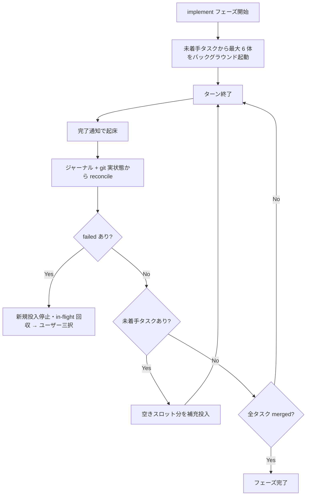

# implement フェーズのキュー化 - 要件定義書

## 1. 概要

### 1.1 背景

em-workflow の implement フェーズは現在「チャンクバリア方式」で並列実装を行っている。未マージの全タスクを task-id 昇順で `max_parallel_implementers`（デフォルト 6）個ずつの静的チャンクに分割し、チャンク内全タスクの完了を待ってから次のチャンクを開始する（`references/implement-phase.md` Step I.2）。

チャンクバリアでは、チャンク内の最遅タスクが次チャンク全体の開始をブロックする。タスクサイズが不揃いなほど並列度の損失が大きい。

現行設計が性能ではなく信頼性でバリアを選んでいた理由は、オーケストレーターがプロトコル文書を実行する LLM であり、イベント駆動の補充ループは規律違反（補充忘れ・処理漏れ・二重起動・in-flight 状態の消失）が起きやすいため。この規律問題は「機械書きジャーナル + hook による決定論的検知」の組み合わせで塞げる見通しが立った。

### 1.2 目的

implement フェーズの並列実行モデルを「ワークキュー方式」に変更し、常に最大 6 タスクを in-flight に保つことで、並列度の損失をなくす。

### 1.3 スコープ

- `references/implement-phase.md` Step I.2 のバックグラウンド起動 + 通知駆動の補充ループへの書き換え
- `scripts/merge-task.sh` へのジャーナル追記の追加
- hook スクリプト群（新規・Python）と hook 設定の追加
- README / スキーマドキュメントへの役割分担（ジャーナル = イベントの生ログ、workflow.yaml = LLM 管理の要約）の明記
- テスト基盤（stdlib unittest）の新設と、新規 hook + merge-task.sh ジャーナル追記のテスト

**スコープ外**:

- ハングした implementer（完了通知が来ない）のタイムアウト系 watchdog
- `max_parallel_implementers` の workflow.yaml 上書きフィールド追加（デフォルト 6 固定のまま）
- タスク分割への依存関係導入（worktree independence / 契約は IMPLEMENTATION.md に固定 / コンフリクトは親側採用、は変更しない）

## 2. ビジネス要件

### 2.1 目標

implement フェーズの実時間短縮。タスクサイズが不揃いなケースで、遊休スロットに次タスクを流し込めるようにする。

### 2.2 対象ユーザー

| ユーザータイプ | 説明 |
|----------------|------|
| em-workflow 利用者 | /em-workflow:develop で並列実装を実行する開発者 |

### 2.3 期待される効果

- チャンク内最遅タスクによる後続タスクのブロックがなくなる
- 補充忘れ・二重起動・失敗の取りこぼしが hook により決定論的に検知される

## 3. ユースケース

### 3.1 ユースケース一覧

| ID | ユースケース名 | アクター | 優先度 |
|----|----------------|----------|--------|
| UC01 | キュー方式でのタスク並列実装 | オーケストレーター（メインセッション） | 高 |
| UC02 | タスク完了時のスロット補充 | オーケストレーター + hook | 高 |
| UC03 | 補充忘れの検知とブロック | Stop hook | 高 |
| UC04 | タスク失敗時のユーザー判断 | オーケストレーター + ユーザー | 高 |
| UC05 | 中断後の再開（reconcile） | オーケストレーター | 中 |

### 3.2 ユースケース詳細

#### UC01: キュー方式でのタスク並列実装

**アクター**: オーケストレーター

**事前条件**:
- create-plan 完了、tasks が非空
- integration ブランチ・worktree 作成済み（Step I.1、変更なし）

**基本フロー**:
1. 未着手タスクから最大 6 体の implementer をバックグラウンド起動してターンを終える
2. implementer が完走すると merge-task.sh がジャーナルに merged イベントを記録する
3. 完了通知でメインが起こされ、ジャーナル + git 実状態から in-flight を再導出（reconcile）する
4. 空きスロット分の未着手タスクを補充投入して再びターンを終える
5. 全タスク merged でフェーズ完了

**代替フロー**:
- failed が出たら新規投入を停止し、in-flight のみ回収してユーザー判断へ（UC04）

**事後条件**:
- 全タスクが integration ブランチにマージ済み、implement step が completed

#### UC03: 補充忘れの検知とブロック

**アクター**: Stop hook

**基本フロー**:
1. オーケストレーターがターンを終えようとする
2. implement フェーズが in_progress で、未投入タスクが残りスロットに空きがあれば exit 2 でブロックし、投入すべきタスクを返す
3. failed が存在する場合（ユーザー判断待ち）はブロックしない

**代替フロー**:
- 同一状態での連続ブロックが上限（3 回）を超えたら、hook はブロックせず警告のみ出して通す

#### UC04: タスク失敗時のユーザー判断

**基本フロー**:
1. failed 検知で新規投入を停止し、in-flight タスクのみ回収する
2. AskUserQuestion で三択を提示: retry / route back to planning / abort（現行 I.2.c と同じ。skip なし）

## 4. 機能要件

### 4.1 機能一覧

| ID | 機能名 | 説明 | 優先度 |
|----|--------|------|--------|
| F01 | キュー実行ループ | Step I.2 をバックグラウンド起動 + 通知駆動の補充ループに書き換え | 高 |
| F02 | ジャーナル (journal.jsonl) | 機械書き append-only のイベントログ | 高 |
| F03 | merge-task.sh のジャーナル追記 | マージ成功時に merged イベントを 1 行追記 | 高 |
| F04 | Stop hook（ループガード） | 補充忘れを exit 2 で決定論的にブロック | 高 |
| F05 | PreToolUse hook（二重起動ガード） | in-flight タスクの implementer 再起動を deny | 高 |
| F06 | SubagentStop hook（失敗検知の網） | merged 未記録で終了した implementer を failed として記録 | 高 |
| F07 | 失敗時フロー維持 | 現行 I.2.c と同じ三択（retry / route back / abort） | 高 |
| F08 | ドキュメント更新 | README / スキーマドキュメントに役割分担を明記 | 中 |

### 4.2 機能詳細

#### F01: キュー実行ループ

**説明**: メインセッションが未着手タスクから最大 6 体の implementer をバックグラウンド起動してターンを終える。同期 `Task()` fan-out はバリアに戻るため不可。完了通知で起こされたら reconcile → 補充投入 → ターン終了、を全タスク merged まで繰り返す。

**処理フロー**:

#### F02: ジャーナル (journal.jsonl)

**説明**: `{project_root}/.claude/worktrees/em-workflow/{feature}/journal.jsonl`。機械書き・append-only の JSONL。flock（既存の `$GIT_COMMON_DIR/em-workflow-merge.lock`、またはジャーナル自身）配下で 1 行追記する。read-modify-write をしないため並行安全。

**ビジネスルール**:
- 置き場所の根拠: 既存の gitignore-guard（`.claude/worktrees/` をルート .gitignore で担保）にただ乗りできる / 全 implementer から絶対パスで書ける / feature 単位でスコープが切れる
- 各タスク worktree の git からは視界の外。メインツリーの git からのみ「未追跡かつ ignore 済み」に見える
- **削除しない**（書きっぱなしで許容）。フェーズ完走後も残る。失敗・中断時の post-mortem 一次資料として有用
- workflow.yaml は従来通り LLM 管理の要約（SSOT）。スクリプトには直接書かせない（Python stdlib に YAML パーサがない / 並行 read-modify-write が競合点になる / bash_guard.py が承認ストアを yaml の外に持つ既存判断と整合）

#### F04: Stop hook（ループガード、本命）

**説明**: オーケストレーターがターンを終えようとした時、implement フェーズが in_progress で未投入タスクが残りスロットに空きがあれば exit 2 でブロックし、「どのタスクを投入すべきか」を返す。補充忘れを沈黙の失敗から決定論的に捕まる失敗に変える。

**ビジネスルール**:
- failed が存在する場合（ユーザー判断待ち）はブロックしない
- 同一状態での連続ブロック上限は 3 回。超えたらブロックせず警告のみ出して通す（無限ループ防止。以降はユーザーに委ねる）

#### F05: PreToolUse hook（二重起動ガード）

**説明**: implementer の `Task()` 起動時、プロンプト内の task_id が既に in-flight なら deny する。

#### F06: SubagentStop hook（失敗検知の網）

**説明**: implementer エージェントが終了したのにジャーナルに merged が記録されていない場合に failed を記録する。全サブエージェント終了で発火するため implementer のフィルタリングが必要。

**エラーケース**:
| エラー | 条件 | 対応 |
|--------|------|------|
| 失敗の取りこぼし | implementer 終了 & merged 未記録 | failed イベントをジャーナルに追記 |

## 5. 非機能要件

### 5.1 パフォーマンス要件

- 常に最大 6 タスクを in-flight に保つ（1 タスク完了ごとに空きスロットへ補充）

### 5.2 セキュリティ要件

- 入力検証: 既存の fail-closed identifier validation gate（feature / task id の正規表現検証）を維持する

### 5.3 可用性要件

- セッション死亡時は hook では救えない。resume guard（workflow.yaml + worktree の存在からの復元、現行 I.2.a）を維持し、ジャーナル + git 実状態から reconcile 可能とする

### 5.4 保守性要件

- 新しいランタイム依存を増やさない（hook は Python stdlib のみ。merge-task.sh は shell のまま）
- テスト: リポジトリルート `tests/` に stdlib unittest ベースのテストを新設（`python3 -m unittest discover -s tests`）

## 6. UI/UX要件

なし（UI を持たない）。

## 7. データ要件

### 7.1 ジャーナルイベント

| イベント | 書き手 | 内容 |
|----------|--------|------|
| merged | merge-task.sh | `{"event":"merged","task":"task0007","commit":"...","at":"..."}` |
| failed | SubagentStop hook | 終了したのに merged 未記録の implementer |

（in-flight の導出は「ジャーナル + git 実状態」から行う。イベント種別の最終形は実装計画で確定する）

## 8. 外部連携

なし。

## 9. 制約条件

### 9.1 技術的制約

- hook は `Task()` を起動できないため、起動役はあくまで LLM。hook は「回すのをやめたら確実に検知して止める」門番
- hook スクリプトは Python（stdin の JSON 入力をパースするため。bash_guard.py と同じランタイム前提）
- workflow.yaml へのスクリプト書き込み禁止
- 同期 `Task()` fan-out は不可（バリアに戻るため）

## 10. 想定される課題とリスク

| 課題 | 影響度 | 対応策 |
|------|--------|--------|
| ハングした implementer は hook で検知できない | 中 | スコープ外（watchdog は別途検討）。resume guard で運用カバー |
| Stop hook ブロック後もオーケストレーターが補充しない | 中 | 同一状態での連続ブロック上限 3 回で警告に切り替え、ユーザーに委ねる |
| セッション自体の死亡 | 中 | resume guard（現行 I.2.a）を維持 |

## 11. 成功基準

### 11.1 受け入れ基準

- [ ] implement フェーズが常に最大 6 タスクを in-flight に保つ（チャンクバリアの廃止）
- [ ] merge-task.sh がマージ成功時にジャーナルへ merged イベントを追記する
- [ ] Stop hook が補充忘れを exit 2 でブロックし、投入すべきタスクを返す（連続 3 回で警告に切替）
- [ ] PreToolUse hook が in-flight タスクの二重起動を deny する
- [ ] SubagentStop hook が merged 未記録の implementer 終了を failed として記録する
- [ ] failed 発生時は新規投入を停止し、現行と同じ三択（retry / route back to planning / abort）を提示する
- [ ] `python3 -m unittest discover -s tests` が全テスト成功する

## 12. テストシナリオ

### 12.1 テスト観点

- [ ] 正常系: merged イベント追記 / Stop hook が正しくブロック・非ブロック判定 / 二重起動 deny
- [ ] 異常系: merged 未記録での implementer 終了 → failed 記録 / failed 存在時に Stop hook が通す
- [ ] 境界値: in-flight ちょうど 6 / 未着手 0 / 連続ブロック 3 回目で警告に切替
- [ ] 並行性: ジャーナルへの並行追記が壊れない（flock）

## 13. 用語定義

| 用語 | 定義 |
|------|------|
| チャンクバリア方式 | 静的チャンク内の全タスク完了を待ってから次チャンクを開始する現行方式 |
| ワークキュー方式 | 1 タスク完了ごとに空きスロットへ未着手タスクを補充する変更後方式 |
| in-flight | 起動済みで merged / failed が確定していないタスク |
| reconcile | ジャーナル + git 実状態から in-flight を再導出する処理 |
| ジャーナル | journal.jsonl。機械書き append-only のイベント生ログ |

## 14. 確認事項

### 14.1 確認済み事項

- [x] watchdog（ハング検知）のスコープ: スコープ外。resume guard で運用カバー
- [x] max_parallel_implementers の workflow.yaml 上書きフィールド: 追加しない（デフォルト 6 固定のまま）
- [x] テスト戦略: stdlib unittest（環境に pytest / uv / pipx がないため。依存を増やさない方針とも整合）
- [x] Stop hook の無限ループ防止: 同一状態での連続ブロック上限 3 回。超えたら警告のみ出して通す

### 14.2 未確認・保留事項

なし。

## 15. 参考資料

- 設計メモ: `tmp/implement-phase-queue-design-20260715.md`
- 現行プロトコル: `em-workflow/references/implement-phase.md`
- コマンド承認の既存パターン: `em-workflow/hooks/bash_guard.py` / `em-workflow/references/command-execution-protocol.md`
