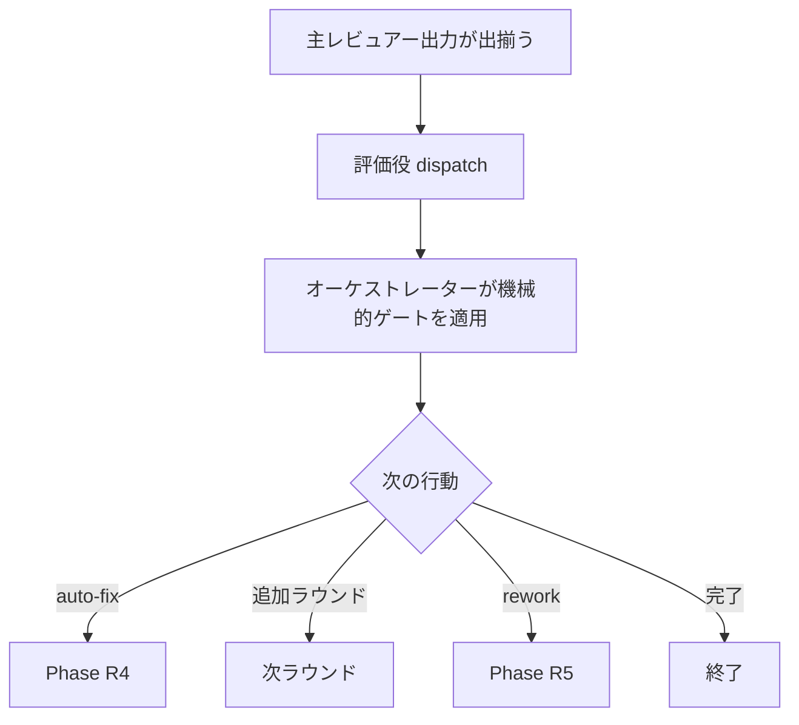

# llm-led-review - 要件定義書

## 1. 概要

### 1.1 背景

em-workflow の review 段は現在、Claude の汎用レビュアーと Codex レビュアーを並列に起動し、
その結果を突合する構成になっている。この構成では Claude が個別観点のレビュアーとして働く。

### 1.2 目的

- em-workflow の review 段のメインレビューを Claude 以外の LLM に移し、Claude(Opus) は個別観点のレビュアーではなく、結果を横断して評価する役に置き直す。
- 評価結果をオーケストレーターに返し、次の行動（auto-fix / 追加ラウンド / rework / 完了）はオーケストレーターが決める、という責務分離を review 段でも成立させる。
- 既存の Claude + Codex 並列レビューと突合という構成を、上記の構成で置き換える。

### 1.3 スコープ

**対象**:

- `em-workflow/references/review-phase.md`（develop 駆動と standalone の両実行文脈）
- `em-workflow/references/reviewers.yaml`
- `em-workflow/references/review-protocol.md`
- 評価役サブエージェント定義（新設）および `em-workflow/agents/reviewer.md`
- `em-workflow/.claude-plugin/plugin.json` / リポジトリルート `.claude-plugin/marketplace.json` / `em-workflow/README.md`
- `tests/` 配下のテスト

**対象外**:

- em-review プラグインの `/em-review:multi-review`（em-review 配下のファイルは 1 つも変更しない）

## 2. ビジネス要件

### 2.1 ビジネス目標

- em-workflow の review 段のメインレビューを Claude 以外の LLM に移し、Claude(Opus) は個別観点のレビュアーではなく、結果を横断して評価する役に置き直す。
- 評価結果をオーケストレーターに返し、次の行動（auto-fix / 追加ラウンド / rework / 完了）はオーケストレーターが決める、という責務分離を review 段でも成立させる。
- 既存の Claude + Codex 並列レビューと突合という構成を、上記の構成で置き換える。

### 2.2 対象ユーザー

| ユーザータイプ | 説明 |
|----------------|------|
| em-workflow の develop フローを実行する Claude Code 利用者 | review 段が develop の 1 段として自動的に走る |
| `/em-workflow:review` を単体実行する Claude Code 利用者 | standalone モードで同じ review-phase.md プロトコルが走る |

### 2.3 期待される効果

- 選択された各観点の主レビューを Claude 以外の LLM が担い、Claude(Opus) は横断評価に専念する。
- 評価と次アクション決定の責務が、評価役とオーケストレーターに分離される。

## 3. ユースケース

### 3.1 ユースケース一覧

| ID | ユースケース名 | アクター | 優先度 |
|----|----------------|----------|--------|
| UC01 | 1 レビューラウンドを実行する | オーケストレーター | 高 |
| UC02 | ハーネス不在の観点をフォールバックで完走する | オーケストレーター | 高 |

### 3.2 ユースケース詳細

#### UC01: 1 レビューラウンドを実行する

**アクター**: オーケストレーター（review-phase.md を実行する側）

**事前条件**:

- Phase R0 の `codex_available` / `litellm_available` 可用性プローブが完了している。
- レビュー観点が選択されている。

**基本フロー**:

1. 選択された各観点について、`references/reviewers.yaml` のその観点のチェーン先頭から、ハーネスが利用可能な最初のエントリを取る。
2. 観点ごとに Claude ではないレビュアーを 1 本だけ dispatch する。1 ラウンドの主レビュアー Task 呼び出しは全て 1 メッセージにまとめる。
3. Phase R2b の retryable skip チェーンウォークを主レビュアーに対して適用する。
4. チェーンウォーク完了後、全レビュアー出力が出揃った時点で Opus の評価役サブエージェント 1 本を dispatch する。
5. 評価役は横断的な評価を 1 つのオブジェクトとして返す。
6. オーケストレーターは評価役出力に対して委譲不能な機械的ゲートを適用する。
7. オーケストレーターが次の行動（auto-fix / 追加ラウンド / rework / 完了）を決める。

**代替フロー**:

- ある観点のチェーンに利用可能なエントリが 1 つも無い場合は UC02 に分岐する。
- 主レビュアーが `rate_limited` / `budget_exhausted` / `harness_unavailable` を返した場合、チェーンの次エントリへフォールバックする（1 観点あたり fallback dispatch 最大 2 回）。

**事後条件**:

- ラウンド記録が `feature-docs/{feature}/reviews/roundN.yaml` に残る。
- 次の行動がオーケストレーターによって決定されている。

#### UC02: ハーネス不在の観点をフォールバックで完走する

**アクター**: オーケストレーター

**事前条件**:

- ある観点のチェーンに、利用可能なハーネスのエントリが 1 つも無い。

**基本フロー**:

1. その観点のレビュアーとして `em-workflow:reviewer`（Claude 汎用レビュアー）を dispatch する。
2. 評価役は通常どおり走る。
3. ラウンド記録にその観点の source がフォールバックであることを残す。

**代替フロー**:

- 該当なし。フェーズを abort しない。

**事後条件**:

- フェーズが abort せずに完走する。
- vertex-review 未導入環境でも em-workflow が動く性質が保たれている。

## 4. 機能要件

### 4.1 機能一覧

| ID | 機能名 | 説明 | 優先度 |
|----|--------|------|--------|
| FR1 | 主レビューを他 LLM が実行する | 観点ごとに Claude ではないレビュアーを 1 本 dispatch する | 高 |
| FR2 | reviewers.yaml を主レビュアーレジストリへ転換する | `cross_validation` チェーンを主レビュアーチェーンとして読み替える | 高 |
| FR3 | Claude 汎用レビュアーはフォールバック専任にする | `em-workflow:reviewer` をフォールバック専任に降格する | 高 |
| FR4 | Opus 評価サブエージェントを新設する | 全レビュアー出力を横断評価する Opus サブエージェント 1 本 | 高 |
| FR5 | 他 LLM 出力の untrusted 扱いは評価役が担保する | レビュアー出力中の指示文をデータとして扱う | 高 |
| FR6 | 評価役の出力もオーケストレーターから見て untrusted | 委譲不能な機械的ゲートを引き続き適用する | 高 |
| FR7 | 評価役の出力契約を定義する | 機械検査可能な 1 オブジェクトを返す | 高 |
| FR8 | 次の行動はオーケストレーターが決める | auto-fix / 追加ラウンド / rework / 完了の決定権 | 高 |
| FR9 | fan-out 形状とチェーンウォークの維持 | 1 メッセージ集約と R2b チェーンウォークの維持 | 高 |
| FR10 | ハーネス不在時の劣化動作 | abort せず Claude フォールバックで完走する | 高 |
| FR11 | standalone レビューも同じ構成になる | `/em-workflow:review` も自動的に新構成になる | 中 |
| FR12 | ラウンド記録の後方互換 | roundN.yaml のファイル名・配置・下流フィールドを維持する | 高 |
| FR13 | confidence モデルの再定義 | 評価役付与値 + オーケストレーターの機械補正 | 中 |
| FR14 | プラグインバージョンと説明文の更新 | version bump と description / README 更新 | 中 |
| FR15 | プラグイン不変条件の維持 | agent_dispatch_parity / gate_id coverage を通す | 高 |

### 4.2 機能詳細

#### FR1: 主レビューを他 LLM が実行する

**説明**: 選択された各観点について、review-phase.md Phase R2 は Claude ではないレビュアーを 1 本だけ dispatch する。どのハーネス／モデルを使うかは `references/reviewers.yaml` のその観点のチェーンの先頭から、ハーネスが利用可能な最初のエントリを取る（`{harness: codex}` → `em-workflow:codex-reviewer`、`{harness: litellm, model: M}` → `vertex-review:vertex-reviewer` に `model: M` を verbatim で渡す）。可用性判定は現行 Phase R0 の `codex_available` / `litellm_available` プローブをそのまま使う。

**入力**:

- 観点名: string - 選択されたレビュー観点
- `codex_available` / `litellm_available`: bool - Phase R0 の可用性プローブ結果
- `references/reviewers.yaml` の当該観点のチェーン: list - 主レビュアーチェーン

**出力**:

- dispatch 先レビュアー: 1 観点につき 1 本（`em-workflow:codex-reviewer` または `vertex-review:vertex-reviewer`）
- `model`: string - litellm ハーネスのとき verbatim で渡すモデル名

**ビジネスルール**:

- 1 観点につき主レビュアーは 1 本だけ。
- チェーンの先頭から、ハーネスが利用可能な最初のエントリを取る。

**エラーケース**:

| エラー | 条件 | 対応 |
|--------|------|------|
| 利用可能なエントリが無い | 当該観点のチェーンのどのハーネスも利用不可 | FR3 の Claude フォールバックへ落とす（FR10） |

#### FR2: reviewers.yaml を主レビュアーレジストリへ転換する

**説明**: 観点ごとの `cross_validation` チェーンを主レビュアーチェーンとして読み替える。現在 `cross_validation: []` の 2 観点（comprehensive / license）にもエントリを与え、選択された全観点が他 LLM の主レビュアーを持つ状態にする。「どのモデルが存在するかはハーネス側、観点ごとのモデル選択は em-workflow 側」という reviewers.yaml ヘッダの責務分割は維持する。

**ビジネスルール**:

- 選択された全観点が他 LLM の主レビュアーを持つ。
- reviewers.yaml ヘッダの責務分割を維持する。

#### FR3: Claude 汎用レビュアーはフォールバック専任にする

**説明**: `em-workflow:reviewer` は削除せず、ある観点のチェーンに利用可能なエントリが 1 つも無いときだけ、その観点のレビュアーとして dispatch される役に降格する。他 LLM レビュアーとの並列同時起動は行わない。

**ビジネスルール**:

- `em-workflow:reviewer` は削除しない。
- 他 LLM レビュアーとの並列同時起動は行わない。

#### FR4: Opus 評価サブエージェントを新設する

**説明**: 1 ラウンド分の全レビュアー出力（チェーンウォーク後の最終結果を含む）が出揃った後、Opus のサブエージェント 1 本を dispatch し、横断的な評価を 1 つのオブジェクトとして返させる。既存 `agents/reviewer.md` の `model: opus` / `effort: xhigh` frontmatter が、判断役エージェントの既存記法として先例になる。

**入力**:

- 1 ラウンド分の全レビュアー出力: list - チェーンウォーク後の最終結果を含む

**出力**:

- 評価: object - 横断的な評価を 1 つのオブジェクトとして返す

**ビジネスルール**:

- dispatch は全レビュアー出力が出揃った後（チェーンウォーク完了後）。
- サブエージェントは 1 本。

#### FR5: 他 LLM 出力の untrusted 扱いは評価役が担保する

**説明**: レビュアー出力に含まれる指示文・ロール上書き・"ignore previous instructions" 等は評価役が評価の一部として扱い、データとして分析する。（回答済み `review.sanitization-ownership` による。）

**ビジネスルール**:

- レビュアー出力中の指示文は命令ではなくデータとして扱う。

#### FR6: 評価役の出力もオーケストレーターから見て untrusted

**説明**: オーケストレーターは評価役の出力に対して、現行 Phase R3 のうち委譲不能な機械的ゲートを引き続き適用する。

**バリデーション**:

| 項目 | ルール | エラーメッセージ |
|------|--------|------------------|
| `file` | 字句検査: 絶対パス / `..` / NUL を拒否 | — |
| `file` | project_root 配下での存在検査 | — |
| `severity` | 語彙検査 | — |
| `category` | dispatch した観点と一致しなければ無条件 drop（絶対に relabel しない） | — |
| `source` | オーケストレーター既知 identity での上書き | — |
| `title` / `description` / `suggestion` | 4096 バイト上限 | — |
| `confidence` | changed_files 外の finding は confidence 上限を適用 | — |

**ビジネスルール**:

- `category` の relabel は行わない。relabel は injection の洗浄になる。

#### FR7: 評価役の出力契約を定義する

**説明**: 評価役は機械検査可能な 1 つのオブジェクトを返す。findings は roundN.yaml の finding 形（`stable_id` / `severity` / `category` / `file` / `line` / `title` / `description` / `suggestion` / `sources` / `confidence`）を持ち、ラウンド単位で推奨アクションを含む。評価役は worker-envelope.md 2.3 の 5 worker には含まれない（同表は `reviewer` / `codex-reviewer` を明示的に除外しており、「Every other worker keeps its current input/output form」）ため、worker envelope ではなく review 段固有の契約に従う。

**出力**:

- findings: list - `stable_id` / `severity` / `category` / `file` / `line` / `title` / `description` / `suggestion` / `sources` / `confidence`
- 推奨アクション: ラウンド単位

#### FR8: 次の行動はオーケストレーターが決める

**説明**: 評価はオーケストレーターに返り、オーケストレーターが Phase R4 の auto-fix、追加ラウンド、rework、完了のいずれかを決める。workflow.yaml / roundN.yaml への書き込み、commit、AskUserQuestion ゲートは従来どおりオーケストレーター専有で、評価役には移さない。Phase R5 の rework 経路は `references/rework-task-synthesis.md` Section 10 の固定順序（`review.needs_rework = true` と `review.status = pending` をオーケストレーターが先に直接書き、その後 rework-planner を dispatch）をそのまま維持する。

**処理フロー**:

**ビジネスルール**:

- 書き込み・commit・AskUserQuestion ゲートはオーケストレーター専有。
- rework 経路の固定順序を維持する。

#### FR9: fan-out 形状とチェーンウォークの維持

**説明**: 1 ラウンドの主レビュアー Task 呼び出しは全て 1 メッセージにまとめる。Phase R2b の retryable skip チェーンウォーク（`rate_limited` / `budget_exhausted` / `harness_unavailable` のみ、1 観点あたり fallback dispatch 最大 2 回、budget/reachability はハーネス単位・congestion はモデル単位）は主レビュアーに対して維持する。評価役の dispatch はチェーンウォーク完了後。

**ビジネスルール**:

- 主レビュアー Task 呼び出しは 1 メッセージに集約。
- fallback dispatch は 1 観点あたり最大 2 回。

#### FR10: ハーネス不在時の劣化動作

**説明**: ある観点でハーネスが 1 つも使えない場合もフェーズを abort しない。FR3 の Claude フォールバックに落ち、評価役は通常どおり走る。ラウンド記録にはその観点の source がフォールバックであることが残る。vertex-review 未導入環境でも em-workflow が動く、という現行の性質を壊さない。

**エラーケース**:

| エラー | 条件 | 対応 |
|--------|------|------|
| ハーネスが 1 つも利用不可 | 当該観点のチェーンの全エントリが利用不可 | Claude フォールバックへ落とし、abort しない |

#### FR11: standalone レビューも同じ構成になる

**説明**: review-phase.md は develop 駆動と standalone の 2 実行文脈を持つ 1 本のプロトコルで、`skills/review/SKILL.md` はそれを standalone モードでインライン実行するだけなので、`/em-workflow:review` も自動的に新構成になる。スコープ外は em-review の `/em-review:multi-review` のみで、em-workflow の standalone review はスコープ内。

#### FR12: ラウンド記録の後方互換

**説明**: `feature-docs/{feature}/reviews/roundN.yaml` はファイル名・配置・下流が読むフィールド名と意味を維持する — Phase R0 の `round_context` が読む `stable_id` / `file` / `line` / `resolution`、および `skills/develop/SKILL.md` の retrospect signals が読む `severity` / `category` / `resolution_reason` / review plan の Layer-2 追加理由。`perspective_runs` は評価役の run を記録できるよう拡張し、`source: claude` はフォールバック実行を意味するようになる。

**ビジネスルール**:

- roundN.yaml のファイル名・配置は変えない。
- 下流が読むフィールド名と意味を変えない。
- `perspective_runs` は拡張のみ。

#### FR13: confidence モデルの再定義

**説明**: 現行の confidence は claude と cross-model の same_site 一致（95 / 60 / 50 / 70 / 65）を入力にしているが、Claude 並列レビューが無くなるとその入力自体が消える。confidence は評価役が付与する値とし、オーケストレーターは機械的な補正のみ残す（2 観点以上が同一サイトを指摘したときの +15・上限 100、changed_files 外の finding の 50 上限）。

**ビジネスルール**:

- confidence の基準値は評価役が付与する。
- オーケストレーターの補正は 2 つのみ: 複数観点一致 +15（上限 100）、changed_files 外は 50 上限。

#### FR14: プラグインバージョンと説明文の更新

**説明**: `.claude/rules/core-plugin-version-bump.md` に従い `em-workflow/.claude-plugin/plugin.json` とリポジトリルート `.claude-plugin/marketplace.json` の version を同じ値へ上げる（現行 0.1.58）。両ファイルの description、および `em-workflow/README.md` のエージェント表とレビュー節が現行構成を文章で述べているため、同じ変更で更新する。

#### FR15: プラグイン不変条件の維持

**説明**: `em-workflow/scripts/check-plugin-invariants.py` の `agent_dispatch_parity` は `em-workflow/agents/*.md` の各定義がどこかから dispatch されていることを要求するため、新設する評価役エージェントは review-phase.md から dispatch され、`agents/reviewer.md` も dispatch 元を失ってはならない。`check_gate_id_coverage` により、新しい `gate_id` を導入する場合は `references/batch-policies.yaml` に対応エントリが必要。

## 5. 非機能要件

### 5.1 パフォーマンス要件

本フィーチャーにレスポンスタイム / スループット / 同時接続数の目標値は定義されていない。fan-out 形状に関する要件は FR9 が扱う。

### 5.2 セキュリティ要件

#### NFR1: injection 洗浄の防止を維持する

評価役の導入によって「category を relabel しない」「source を自己申告に依らずオーケストレーターが上書きする」という現行の injection 洗浄防止が失われてはならない。FR6 がこれを担保する。

- 入力検証: FR6 の機械的ゲート（`file` 字句検査 / 存在検査 / `severity` 語彙検査 / `category` 一致 drop / `source` 上書き / サイズ上限 / confidence 上限）
- 認証・認可・データ保護: 該当なし（本フィーチャーは認証・認可・機密データを扱わない）

### 5.3 可用性要件

#### NFR2: 外部依存を増やさない

litellm ハーネス（vertex-review プラグイン）は任意のままとし、未導入環境で動作が壊れないこと。codex は同梱ラッパー `scripts/run_codex_exec.sh` + `command -v codex` の可用性判定のまま。

#### NFR3: batch モードで停止しない

新経路のどこでも AskUserQuestion を増やさない。Phase R4/R5 の 3 ゲート（`review.auto-fix-conflict` / `review.auto-fix-judgment` / `review.residual-critical-high`）は `references/batch-mode.md` の Non-packet gates 表に載っており、挙動を変える場合は同表と `references/batch-policies.yaml` ヘッダの除外コメントを同時に直す。

### 5.4 保守性要件

#### NFR4: review-protocol.md の SSOT 性を壊さない

review-protocol.md は別途インストールされる vertex-review プラグインのレビュアーも直接読む唯一の SSOT（同プラグインは `references/` を持たない）。入力フィールド・出力スキーマ・skip 語彙の変更は、このリポジトリから編集もテストもできない外部プラグインの挙動を変える。既存の入力名・`skip_reason` 文字列・出力スキーマは可能な限り保つ。

#### NFR5: レビューは read-only のまま

レビュアーおよび評価役は working tree を変更しない（commit / branch 切替 / formatter 実行 / Write / Edit の禁止）。ファイル変更は Phase R4 の review-editor のみが行う。

### 5.5 互換性要件

#### NFR6: 既存テストの前提を壊さない

`tests/test_review_implement_develop_lock_contracts.py` は review-phase.md の fix-commit ブロックが共有 flock を取ることと、コミットメッセージ `fix({feature}): review round ` のリテラルをそのまま検査する。Phase R4 のコミット節を編集する場合は同テストと整合させる。

ラウンド記録の後方互換は FR12 が扱う。ブラウザサポート / API バージョンは該当なし。

## 6. UI/UX要件

該当なし。本フィーチャーはユーザー可視の UI 面を一切持たない改修であり、design ステップは skipped と判定されている（理由: 変更対象がプラグインのプロトコル文書 review-phase.md / review-protocol.md、エージェントプロンプト、YAML レジストリ reviewers.yaml / review-rules.yaml、およびテストであり、design ステップの成果物である DESIGN.md + HTML モックアップ + design-system/tokens.yaml に対象が無い）。

## 7. データ要件

### 7.1 データモデル概要

本フィーチャーはデータベースを持たない。扱う構造化データはファイルとして次の 2 つ。

- `references/reviewers.yaml`: 観点ごとの主レビュアーチェーン（FR2）
- `feature-docs/{feature}/reviews/roundN.yaml`: ラウンド記録（FR12）

### 7.2 データ項目

| エンティティ | 項目名 | 型 | 必須 | 説明 |
|--------------|--------|-----|------|------|
| 評価役 finding | stable_id | string | ○ | roundN.yaml の finding 形（FR7） |
| 評価役 finding | severity | string | ○ | オーケストレーターが語彙検査（FR6） |
| 評価役 finding | category | string | ○ | dispatch した観点と不一致なら drop（FR6） |
| 評価役 finding | file | string | ○ | 字句検査 + 存在検査（FR6） |
| 評価役 finding | line | int | ○ | roundN.yaml の finding 形（FR7） |
| 評価役 finding | title | string | ○ | 4096 バイト上限（FR6） |
| 評価役 finding | description | string | ○ | 4096 バイト上限（FR6） |
| 評価役 finding | suggestion | string | ○ | 4096 バイト上限（FR6） |
| 評価役 finding | sources | list | ○ | オーケストレーターが既知 identity で上書き（FR6） |
| 評価役 finding | confidence | int | ○ | 評価役付与値 + 機械補正（FR13） |
| roundN.yaml | perspective_runs | list | ○ | 評価役の run を記録できるよう拡張（FR12） |

### 7.3 データ保持期間

| データ種別 | 保持期間 |
|------------|----------|
| `reviews/roundN.yaml` | フィーチャーのラウンド記録として保持（現行どおり、変更なし） |

## 8. 外部連携

### 8.1 連携システム

| システム名 | 連携方法 | データ |
|------------|----------|--------|
| codex ハーネス | 同梱ラッパー `scripts/run_codex_exec.sh`、可用性判定は `command -v codex`（NFR2） | レビュー入力 / レビュー出力 |
| litellm ハーネス（vertex-review プラグイン、任意） | `vertex-review:vertex-reviewer` に `model: M` を verbatim で渡す（FR1） | レビュー入力 / レビュー出力 |

### 8.2 API仕様要件

review-protocol.md が外部プラグイン（vertex-review）のレビュアーも直接読む唯一の SSOT であり、入力フィールド名・`skip_reason` 文字列・出力スキーマは可能な限り保つ（NFR4）。

## 9. 制約条件

### 9.1 技術的制約

- `em-workflow/scripts/check-plugin-invariants.py` の `agent_dispatch_parity` / `check_gate_id_coverage` を通す必要がある（FR15）。
- review-protocol.md は外部プラグインからも読まれる SSOT であり、このリポジトリから編集もテストもできない外部プラグインの挙動を変えうる（NFR4）。
- `tests/test_review_implement_develop_lock_contracts.py` が flock とコミットメッセージのリテラルを検査する（NFR6）。
- このリポジトリに build / format コマンドは存在しない。テストは `python3 -m unittest discover -s tests`。

### 9.2 ビジネス上の制約

- em-review 配下のファイルを 1 つも変更しない。
- vertex-review 未導入環境でも em-workflow が壊れない（NFR2、FR10）。
- batch モードで AskUserQuestion を増やさない（NFR3）。

### 9.3 スケジュール制約

該当なし。

### 9.4 宣言された変更集合

このフィーチャー固有のパスは手動で列挙せず、create-plan で `workflow.yaml` の各タスクの `files` から導出する（`references/phases/create-plan-phase.md`）。

**デフォルトメンバー**（SPEC作成者が明示的に除外しない限り、常に宣言に含まれる）:

- `feature-docs/llm-led-review/**`
- `test-docs/llm-led-review/**`

`feature-docs/llm-led-review/**` に含まれるもの: `REQUIREMENTS.md`、`SPEC.md`、`IMPLEMENTATION.md`、`workflow.yaml`、`phase-state/`、`tasks/`、`reviews/roundN.yaml`、`VERIFICATION.md`、`retrospect.yaml`、およびデザインステップが生成するデザイン成果物。生成主体は各フェーズドキュメントおよび `references/phase-state.md` を参照（引用のみ、ルールは再掲しない）。

`test-docs/llm-led-review/**` に含まれるもの: `{T}.tests.yaml`（パス形式: `test-docs/llm-led-review/{T}.tests.yaml`）。生成主体は `implement-phase.md` を参照（引用のみ、ルールは再掲しない）。

**意味論**:

- デフォルトのメンバーは、SPEC作成者が明示的に除外しない限り宣言に含まれる。除外は意図的な絞り込みであり、記載漏れによる省略ではない。
- この宣言はスーパーセット（superset）の主張であり、実際の変更集合は宣言に含まれる（CONTAINED IN）必要がある。実際には生成されないパスが宣言されていても違反にはならない。implementタスクを1つも生成しないフィーチャーは `test-docs/llm-led-review/` ディレクトリを生成しないが、宣言された `test-docs/llm-led-review/**` は依然として正しい。

## 10. 想定される課題とリスク

### 10.1 技術的課題

| 課題 | 影響度 | 対応策 |
|------|--------|--------|
| comprehensive / license の 2 観点は他 LLM 単独実行の実績が無い（A-3 のリスク） | 中 | 妥当性は実装段で再確認の余地がある |
| confidence モデルの変更が、現行の「Mechanical counting, not judgment」という明示的な設計方針を部分的に変える（A-6 のリスク） | 高 | FR13 で機械補正を 2 つに限定する。本仕様中で最もリスクの高い仮定として扱う |
| review-protocol.md の変更が外部プラグインの挙動を変える | 高 | NFR4: 既存の入力名・`skip_reason` 文字列・出力スキーマを可能な限り保つ |

### 10.2 ビジネスリスク

| リスク | 発生確率 | 影響度 | 対応策 |
|--------|----------|--------|--------|
| vertex-review 未導入環境で review 段が動かなくなる | 低 | 高 | NFR2 / FR10: litellm は任意のまま、ハーネス不在は Claude フォールバックで劣化動作 |
| batch 実行が新経路のゲートで停止する | 低 | 高 | NFR3: 新経路で AskUserQuestion を増やさない |

## 11. 成功基準

### 11.1 受け入れ基準

- [ ] 選択された各観点の主レビューを、Claude ではない LLM（codex ハーネスまたは litellm ハーネス）が実行する。
- [ ] 全レビュアー結果が出揃った後、Opus のサブエージェント 1 本がそれらをまとめて評価する。
- [ ] 評価役の評価がオーケストレーターに返る。
- [ ] オーケストレーターがその評価に基づいて次の行動（auto-fix / 追加ラウンド / rework / 完了）を決める。
- [ ] Claude と Codex を並列起動して突合する現行の流れが、上記構成に置き換わっている（review-phase.md Phase R2 / R3 と reviewers.yaml から並列突合前提の記述が消えている）。
- [ ] 他 LLM 出力の untrusted 扱いを評価役が担い、かつオーケストレーターが評価役出力に対して機械的検査（file 字句・存在・severity 語彙・category 一致 drop・source 上書き・サイズ上限）を適用する旨が文書に明記されている。
- [ ] ハーネスが 1 つも利用可能でない観点があってもフェーズが abort せず、Claude フォールバックで完走する。
- [ ] reviews/roundN.yaml の場所と、round_context / retrospect signals が読むフィールド名・意味が維持されている。
- [ ] `python3 -m unittest discover -s tests` が通り、check-plugin-invariants.py の agent_dispatch_parity / stale_references / gate_id coverage が通る。
- [ ] `em-workflow/.claude-plugin/plugin.json` と `.claude-plugin/marketplace.json` の version が同じ値に上がっている。
- [ ] em-review 配下のファイルが 1 つも変更されていない。

### 11.2 KPI

該当なし。本フィーチャーに数値 KPI は定義されていない。

## 12. テストシナリオ

### 12.1 テスト観点

- [ ] TS1（構造アサーション）: `tests/` に unittest 形式の構造アサーションテストを追加し、review-phase.md / reviewers.yaml / review-protocol.md が新構成の必須要素（主レビュアー dispatch、評価役 dispatch、評価役出力への機械的検査、フォールバック規定）を含むことを検査する。このリポジトリでは仕様文書の検証を構造アサーションで行う先例が既にある（`tests/test_worker_contract_docs.py`）。対象要件: FR1, FR2, FR3, FR4, FR6, FR7, FR8, FR9, FR10, FR11, FR12, FR13, NFR1, NFR3, NFR5
- [ ] TS2（agent_dispatch_parity 回帰）: 新設の評価役エージェント定義が review-phase.md から dispatch されており、`agents/reviewer.md` も dispatch 元を保っていることを check-plugin-invariants.py で確認する。対象要件: FR3, FR4, FR15
- [ ] TS3（gate_id coverage 回帰）: 新しい gate_id を導入した場合に batch-policies.yaml に対応エントリがあることを確認する。対象要件: FR15, NFR3
- [ ] TS4（flock 契約回帰）: `tests/test_review_implement_develop_lock_contracts.py` が引き続き通ることを確認する。対象要件: NFR6
- [ ] TS5（mktemp 分離契約回帰）: `tests/test_codex_reviewer_temp_file_isolation.py` が引き続き通ることを確認する（主レビュアー化で同一メッセージ内の並列インスタンス数が増えるため、この不変条件の重要度は上がる）。対象要件: FR1, FR9, NFR2
- [ ] TS6（version bump 回帰）: 既存の version bump 検査テストが引き続き通ることを確認する。対象要件: FR14

## 13. 用語定義

| 用語 | 定義 |
|------|------|
| 主レビュアー | 選択された観点について 1 本だけ dispatch される、Claude ではないレビュアー（FR1） |
| 評価役 | 全レビュアー出力が出揃った後に横断評価を行う Opus サブエージェント（FR4） |
| ハーネス | レビュアーを実行する実行系。codex（同梱）と litellm（vertex-review プラグイン経由）の 2 つ |
| チェーンウォーク | Phase R2b の retryable skip に対するチェーン次エントリへのフォールバック（FR9） |
| フォールバック | ある観点のチェーンに利用可能なエントリが 1 つも無いときの `em-workflow:reviewer` 実行（FR3, FR10） |

## 14. 確認事項

### 14.1 確認済み事項

- [x] `review.sanitization-ownership`: 他 LLM 出力の untrusted 扱いは評価役が担い、評価役の出力自体もオーケストレーターから見て untrusted である（FR5, FR6）。

以下は requirements-analyst が根拠付きで確定した仮定であり、いずれも reversible。

- [x] A-1（`review.main-llm-harness`）: 「他 LLM」は新規ハーネスではなく、既存の 2 ハーネス（codex = 同梱、litellm = vertex-review プラグイン経由の Vertex AI MaaS / Meta Muse）を指す。観点ごとのモデル選択は既存の reviewers.yaml チェーンをそのまま主レビュアー選択に使う。
  - 根拠: reviewers.yaml ヘッダ（責務分割と有効モデル名）、review-phase.md Phase R0 手順 5-6 の可用性プローブ、review-protocol.md 冒頭の 3 レビュアー列挙。
- [x] A-2（`review.claude-reviewer-disposition`）: `agents/reviewer.md` は削除せず、ハーネス不在時のフォールバック専任に降格する。
  - 根拠: 受け入れ条件「現在の Claude と Codex の並列レビューと突合の流れを置き換える」は並列突合の廃止を要求するが削除は要求しない。check-plugin-invariants.py の agent_dispatch_parity は dispatch されない `agents/*.md` 定義を offender として落とすため、残置するなら dispatch 経路が必要。現行 Phase R2 の「No available entry → the Claude reviewer output stands alone」がフォールバックの先例。
- [x] A-3（`review.claude-only-perspectives`）: `cross_validation: []` の comprehensive / license にも主レビュアーチェーンを与え、全観点を他 LLM 主体にする。
  - 根拠: reviewers.yaml の空チェーンの理由は「comprehensive's value is breadth inside one context, which a SECOND model can't add」で、2 本目のモデルに価値が無いという主張であって、1 本目が Claude でなければならないという主張ではない。受け入れ条件は「レビューのメインを他 LLM が実行する」と観点を限定していない。
  - リスク: この 2 観点は他 LLM 単独実行の実績が無い。妥当性は実装段で再確認の余地がある。
- [x] A-4（`review.no-harness-fallback`）: ハーネス不在は abort ではなく劣化動作（Claude フォールバック）で扱う。
  - 根拠: README.md「未インストールでも em-workflow は変わらず動作する」、review-phase.md Phase R0 手順 6「An environment without the plugin behaves exactly as before litellm support existed」。
- [x] A-5（`review.evaluator-responsibility` / `review.evaluator-output-contract`）: 評価役は「集約 + 判断」を持ち、書き込み・commit・ゲート・次アクション決定は持たない。評価役は worker-envelope.md の 5 worker には含まれず、review 段固有の出力契約に従う。
  - 根拠: worker-envelope.md 2.3 の適用表が `reviewer` / `codex-reviewer` を明示除外し「Every other worker keeps its current input/output form」と述べている。回答済み `review.sanitization-ownership` が「評価役の出力自体もオーケストレーターから見て untrusted」と定めており、機械的検査層はオーケストレーター側に残る。
- [x] A-6（`review.confidence-model`）: confidence は評価役の付与値 + オーケストレーターの機械補正（複数観点一致 +15 上限 100、changed_files 外は 50 上限）とする。
  - 根拠: 現行 Phase R3 の confidence 表の主要入力が claude×cross-model の same_site 一致であり、並列 Claude レビュー廃止でその入力が消滅する。
  - リスク: 現行の「Mechanical counting, not judgment」という明示的な設計方針を部分的に変える。本仕様中で最もリスクの高い仮定。
- [x] A-7（`review.round-record-compat`）: roundN.yaml はスキーマを維持しつつ `perspective_runs` を拡張する。既存 feature の過去ラウンド記録は読み替えなしで round_context と retrospect signals に供給できる。
  - 根拠: Phase R0 手順 7 の round_context は `{stable_id, file, line, resolution}` しか読まず、`skills/develop/SKILL.md` の retrospect signals も severity / category / resolution / reason しか読まない。いずれも source / model フィールドに依存していない。
- [x] A-8（`review.standalone-scope`）: `/em-workflow:review` standalone はスコープ内で、同じ改修の効果を自動的に受ける。em-review プラグインは一切変更しない。
  - 根拠: `skills/review/SKILL.md` は review-phase.md を standalone モードでインライン実行するだけで、独自のレビュアー選択ロジックを持たない。task_description のスコープ外指定は em-review の multi-review のみ。
- [x] A-9（`review.fanout-shape`）: 1 ラウンドあたり「選択観点数 × 1 本」の主レビュアーを 1 メッセージで並列起動し、その後 R2b チェーンウォーク、最後に評価役 1 本を dispatch する。
  - 根拠: 現行 Phase R2 の「All Task calls go in a SINGLE message」と R2b の「perspectives are independent: all perspectives falling back at the same hop go in ONE message」。
- [x] A-10（`project.commands`）: このリポジトリに build / format コマンドは存在しない。テストは `python3 -m unittest discover -s tests`。
  - 根拠: test/README.md（framework: Python 標準ライブラリ unittest、Python 3.14、外部依存なし）、`resolved_input_paths.package_files` が空。

### 14.2 未確認・保留事項

未解決（`status: tbd`）の要件は無い。全 15 の機能要件と全 6 の非機能要件が `resolved` である。

## 15. 参考資料

- `em-workflow/references/review-phase.md`: review 段のプロトコル（Phase R0 / R2 / R2b / R3 / R4 / R5）
- `em-workflow/references/review-protocol.md`: レビュアー入出力の SSOT（外部プラグインも直接読む）
- `em-workflow/references/reviewers.yaml`: 観点ごとのレビュアーチェーンレジストリ
- `em-workflow/references/rework-task-synthesis.md` Section 10: rework 経路の固定順序
- `em-workflow/references/contracts/worker-envelope.md` 2.3: worker envelope の適用表
- `em-workflow/references/batch-mode.md`: Non-packet gates 表
- `em-workflow/references/batch-policies.yaml`: gate_id ごとの batch 既定
- `em-workflow/scripts/check-plugin-invariants.py`: agent_dispatch_parity / stale_references / gate_id coverage
- `.claude/rules/core-plugin-version-bump.md`: version bump ルール
- `tests/test_worker_contract_docs.py`: 仕様文書を構造アサーションで検証する先例
- `tests/test_review_implement_develop_lock_contracts.py`: flock とコミットメッセージリテラルの検査
- `tests/test_codex_reviewer_temp_file_isolation.py`: codex-reviewer の mktemp 分離契約
