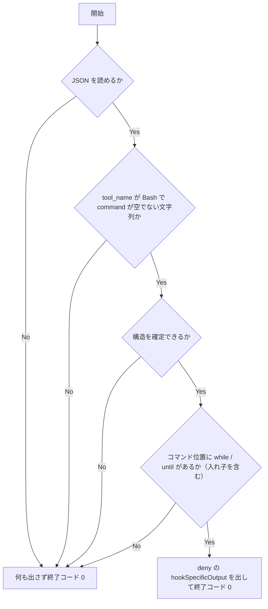

# loop-command-guard - 要件定義書

## 1. 概要

### 1.1 背景
Bash ツールに渡るコマンドに while / until ループが含まれると、終わらないループによってハングすることがある。

### 1.2 目的
Bash ツールに渡るコマンドに含まれる while / until ループを PreToolUse hook で拒否し、終わらないループによるハングを防ぐ。

### 1.3 スコープ
対象:
- PreToolUse(Bash) の新規 hook スクリプト `em-workflow/hooks/loop-command-guard.py` の追加（FR1）
- Bash ツールに渡るコマンド文字列と、そこに埋め込まれた文字列（FR2・FR3）
- `em-workflow/hooks/hooks.json` への登録（FR9）
- 既存の登録テストの更新と新規 hook のテストの追加（FR10・FR11）
- `em-workflow/README.md` と `.claude/rules/hook-tests.md` の更新（FR12・FR13）
- em-workflow の version の patch を上げる（FR14）

対象外:
- ファイルとして実行するスクリプト（`bash script.sh`、`./x.sh`、`source` など）の中身のループ（A3）
- for / select ループ（A4）
- `find -exec sh -c` や `xargs sh -c` のように別コマンドの引数として渡したシェル、ssh のリモートコマンド、パイプでシェルに流し込む文字列（`echo '...' | bash`、`cat <<EOF | bash`）（A6）
- em-review プラグインへの登録（A9）
- `em-workflow/references/implement-phase.md` の更新（A13）

## 2. ビジネス要件

### 2.1 ビジネス目標
Bash ツールに渡るコマンドに含まれる while / until ループを PreToolUse hook で拒否し、終わらないループによるハングを防ぐ。

### 2.2 対象ユーザー
| ユーザータイプ | 説明 |
|----------------|------|
| Bash ツールの呼び出し元 | PreToolUse(Bash) hook の判定を受けて Bash ツールを実行する側 |

### 2.3 期待される効果
- 終わらない while / until ループによるハングが起きなくなる

## 3. ユースケース

### 3.1 ユースケース一覧
| ID | ユースケース名 | アクター | 優先度 |
|----|----------------|----------|--------|
| UC01 | while / until ループを含むコマンドを拒否する | Bash ツールの呼び出し元 | 未指定 |
| UC02 | ループを含まないコマンドを素通しする | Bash ツールの呼び出し元 | 未指定 |
| UC03 | 構造を確定できない入力を判定しない | Bash ツールの呼び出し元 | 未指定 |

### 3.2 ユースケース詳細

#### UC01: while / until ループを含むコマンドを拒否する

**アクター**: Bash ツールの呼び出し元

**事前条件**:
- `loop-command-guard.py` が `hooks.json` の PreToolUse(Bash) グループに登録されている（FR9）

**基本フロー**:
1. Bash ツールにコマンドが渡る
2. hook がコマンド位置の while / until を検出する（入れ子を含む）（FR2・FR3）
3. hook が permissionDecision: deny の hookSpecificOutput を stdout に出し、終了コード 0 で終える（FR6）

**代替フロー**:
- 制限時間付きのループや、前置きコマンドを付けて呼んだシェルの中のループも拒否する（FR5）

**事後条件**:
- コマンドは実行されない

#### UC02: ループを含まないコマンドを素通しする

**アクター**: Bash ツールの呼び出し元

**事前条件**:
- `loop-command-guard.py` が登録されている

**基本フロー**:
1. Bash ツールにコマンドが渡る
2. hook がコマンド位置の while / until を検出しない（FR4）
3. hook が stdout に何も出さず、終了コード 0 で終える（FR7）

**代替フロー**:
- なし

**事後条件**:
- 後に続く hook（destructive-guard.py を含む）の判定がこれまでどおり行われる

#### UC03: 構造を確定できない入力を判定しない

**アクター**: Bash ツールの呼び出し元

**事前条件**:
- `loop-command-guard.py` が登録されている

**基本フロー**:
1. 壊れた JSON、Bash 以外の tool_name、command の欠落・空・非文字列、閉じていない引用符やヒアドキュメントなどが hook に渡る
2. hook が何も出さずに終了コード 0 で終える（FR8）

**代替フロー**:
- なし

**事後条件**:
- 後に続く hook の判定がこれまでどおり行われる

## 4. 機能要件

### 4.1 機能一覧
| ID | 機能名 | 説明 | 優先度 |
|----|--------|------|--------|
| FR1 | 新規ガード hook | PreToolUse(Bash) の新規 hook スクリプトを追加する | 未指定 |
| FR2 | コマンド位置の while / until の検出 | コマンド位置にある予約語 while / until を検出する | 未指定 |
| FR3 | 入れ子の検出 | シェルに実行させる文字列の中も同じ規則で検出する | 未指定 |
| FR4 | 検出しないもの | 引用符で囲まれたデータ・非シェルのヒアドキュメント本文・コメント・引数の単語では検出しない | 未指定 |
| FR5 | 例外なし | 制限時間付きのループや前置きコマンド付きのシェルの中のループも拒否する | 未指定 |
| FR6 | 拒否時の出力 | deny の hookSpecificOutput を出して終了コード 0 で終える | 未指定 |
| FR7 | 非該当時の出力 | 何も出さずに終了コード 0 で終える | 未指定 |
| FR8 | fail-open | 構造を確定できない場合は何も出さずに終了コード 0 で終える | 未指定 |
| FR9 | hooks.json への登録 | interpreter-mismatch-guard.py の後、destructive-guard.py の直前に登録する | 未指定 |
| FR10 | 既存の登録テストの更新 | 8 本前提の登録テストを 9 本の形に更新する | 未指定 |
| FR11 | 新規 hook のテスト | tests/test_loop_command_guard.py を追加する | 未指定 |
| FR12 | README の更新 | ガードレール hook の表と実行順の文を更新する | 未指定 |
| FR13 | テスト手順ルールの追記 | .claude/rules/hook-tests.md に loop-command-guard の節を足す | 未指定 |
| FR14 | version の更新 | em-workflow の version の patch を上げる | 未指定 |

### 4.2 機能詳細

#### FR1: 新規ガード hook

**説明**: PreToolUse(Bash) の新規 hook スクリプト `em-workflow/hooks/loop-command-guard.py` を追加する。既存の hook スクリプトには判定ロジックを足さない。

**入力**:
- 標準入力: JSON - PreToolUse の入力（tool_name、command を含む）

**出力**:
- 標準出力: JSON または空 - 検出時は hookSpecificOutput（FR6）、非該当時と fail-open 時は空（FR7・FR8）
- 終了コード: 整数 - 常に 0

**処理フロー**:

**ビジネスルール**:
- 判定は CLAUDE_BATCH の有無にかかわらず常に deny にする（FR6）
- allow や ask は出さない（FR7）

**バリデーション**:
| 項目 | ルール | エラーメッセージ |
|------|--------|------------------|
| 標準入力 | JSON として読めること | なし（何も出さず終了コード 0） |
| tool_name | Bash であること | なし（何も出さず終了コード 0） |
| command | 存在し、空でない文字列であること | なし（何も出さず終了コード 0） |
| コマンドの構造 | 引用符やヒアドキュメントが閉じていること | なし（何も出さず終了コード 0） |

**エラーケース**:
| エラー | 条件 | 対応 |
|--------|------|------|
| 壊れた JSON | 標準入力を JSON として読めない | 何も出さず終了コード 0（FR8） |
| 対象外のツール | tool_name が Bash でない | 何も出さず終了コード 0（FR8） |
| command 不正 | command が無い・空・文字列でない | 何も出さず終了コード 0（FR8） |
| 構造を確定できない | 閉じていない引用符やヒアドキュメントなど | 何も出さず終了コード 0（FR8） |

#### FR2: コマンド位置の while / until の検出

**説明**: コマンド位置にある予約語 while / until を検出する。条件の中身（定数・外部状態など）は問わず、前景・バックグラウンド（`&` 付き）も問わない。コマンド位置には、次を含む。

- 文字列の先頭
- 文の区切り（改行 `;` `&` `&&` `||` `|`）の直後
- サブシェル `(` やブレースグループ `{` の直後
- `!` の直後
- 予約語 if / then / elif / else / do の直後

#### FR3: 入れ子の検出

**説明**: シェルに実行させる文字列の中も同じ規則で検出する。対象は次のとおり。入れ子が重なる場合も再帰的に検出する。

- bash / sh / zsh の `-c` に渡した文字列（`-lc` や `-euo pipefail -c` のようにオプションが先にある形を含む）
- eval の引数
- `$( )` とバッククォートの中身（二重引用符の中にあるものを含む）
- bash / sh / zsh に渡したヒアドキュメントの本文とヒアストリング

#### FR4: 検出しないもの

**説明**: 次では検出しない。

- 引用符で囲まれたデータ（単一引用符の中身、二重引用符のうちコマンド置換以外の部分）
- シェル以外のコマンドに渡したヒアドキュメントの本文
- コメント
- 引数の単語（`echo while`、`grep "until"` など）

#### FR5: 例外なし

**説明**: 制限時間付きのループにも例外を設けない。timeout・nohup・env などの前置きコマンドを付けて呼んだシェルの中のループも拒否する。

#### FR6: 拒否時の出力

**説明**: 検出したら hookSpecificOutput（hookEventName: PreToolUse、permissionDecision: deny、permissionDecisionReason）を stdout に出し、終了コード 0 で終える。理由の文は `[loop-command-guard]` で始め、while / until ループが禁止されていることを述べる。判定は CLAUDE_BATCH の有無にかかわらず常に deny にする。

#### FR7: 非該当時の出力

**説明**: 検出しなければ stdout に何も出さず、終了コード 0 で終える。allow や ask は出さない。後に続く hook（destructive-guard.py を含む）の判定はこれまでどおり行われる。

#### FR8: fail-open

**説明**: 壊れた JSON、tool_name が Bash でない、command が無い・空・文字列でない、閉じていない引用符やヒアドキュメントなど構造を確定できない場合は、何も出さずに終了コード 0 で終える。

#### FR9: hooks.json への登録

**説明**: `em-workflow/hooks/hooks.json` の PreToolUse(Bash) グループで、interpreter-mismatch-guard.py の後、destructive-guard.py の直前に登録する。コマンド形式は `python3 "${CLAUDE_PLUGIN_ROOT}"/hooks/loop-command-guard.py`、timeout は 15、statusMessage は日本語にする。既存エントリの内容と相対順は変えない。

#### FR10: 既存の登録テストの更新

**説明**: `tests/test_guardrail_hooks_migration.py` の `EXPECTED_BASH_GUARD_ORDER` を 9 本の順序に更新し、`tests/test_hooks_registration.py` の 8 本を前提にした PreToolUse(Bash) 配列の固定検査（本数・heredoc-stdin-guard.py より前のエントリの逐語一致・末尾の位置・並べ替え検出）を 9 本の形に更新する。

#### FR11: 新規 hook のテスト

**説明**: `tests/test_loop_command_guard.py` を追加し、hook をサブプロセスとして起動して標準入力に JSON を渡し、stdout と終了コードを検査する。ケースは `(期待する判定, ラベル, コマンド)` で並べ、期待する判定は `deny` か `silent` にする。

#### FR12: README の更新

**説明**: `em-workflow/README.md` のガードレール hook の表に loop-command-guard.py の行を足し、PreToolUse(Bash) の実行順を述べる文を登録順に合わせる。

#### FR13: テスト手順ルールの追記

**説明**: `.claude/rules/hook-tests.md` に loop-command-guard の節を足し、変更時に同じ変更の中で `python3 -m unittest tests.test_loop_command_guard` を走らせることと、ケースの並べ方を書く。

#### FR14: version の更新

**説明**: em-workflow の version の patch を上げる。`em-workflow/.claude-plugin/plugin.json` と `.claude-plugin/marketplace.json` の em-workflow エントリを同じ値にし、em-review の version は変えない。

## 5. 非機能要件

### 5.1 パフォーマンス要件
- レスポンスタイム: 登録 timeout（15 秒）の範囲内で終わる（NFR2）
- スループット: 該当なし
- 同時接続数: 該当なし

### 5.2 セキュリティ要件
- 認証: 該当なし
- 認可: 該当なし
- データ保護: ファイルを書かず、プロセスを起動せず、ネットワークに接続しない（NFR1）
- 入力検証: 構造を確定できない入力は判定せず、何も出さずに終了コード 0 で終える（FR8）

### 5.3 可用性要件
- 稼働率: 該当なし
- 障害復旧時間: 該当なし

### 5.4 保守性要件
- ログ出力: stderr に何も書かない（NFR1）
- 監視: 該当なし
- ドキュメント: README とテスト手順ルールを更新する（FR12・FR13）

### 5.5 互換性要件
- ブラウザサポート: 該当なし
- APIバージョン: 該当なし

非機能要件の一覧:

| ID | 名称 | 内容 |
|----|------|------|
| NFR1 | 標準ライブラリのみ | hook は Python 標準ライブラリだけを import する。ファイルを書かず、プロセスを起動せず、ネットワークに接続せず、stderr に何も書かない。 |
| NFR2 | 静的解析のみ | 判定はコマンド文字列の静的な読み取りだけで行い、登録 timeout（15 秒）の範囲内で終わる。同じ入力には常に同じ判定を返す。 |
| NFR3 | 判定を閉じない | hook が出すのは deny か無出力のどちらかだけにする。destructive-guard.py を permission decision を返せる Bash ガードの最後に置くという既存の不変条件を保つ。 |
| NFR4 | 既存テストの通過 | `python3 -m unittest discover -s tests` が全件通る。 |

## 6. UI/UX要件

### 6.1 画面設計要件
該当なし（UI の変更が無い）

### 6.2 画面遷移
該当なし

### 6.3 レスポンシブ対応
該当なし

## 7. データ要件

### 7.1 データモデル概要
該当なし

### 7.2 データ項目
該当なし

### 7.3 データ保持期間
該当なし

## 8. 外部連携

### 8.1 連携システム
| システム名 | 連携方法 | データ |
|------------|----------|--------|
| Claude Code の PreToolUse(Bash) hook | 標準入力と標準出力 | PreToolUse の入力 JSON / hookSpecificOutput |

### 8.2 API仕様要件
hookSpecificOutput は hookEventName: PreToolUse、permissionDecision: deny、permissionDecisionReason を持つ（FR6）。

## 9. 制約条件

### 9.1 技術的制約
- hook は Python 標準ライブラリだけを import する（NFR1）
- 判定はコマンド文字列の静的な読み取りだけで行う（NFR2）
- destructive-guard.py は包括的な allow を返すので、permission decision を返せる Bash ガードの中で最後に置く。`tests/test_guardrail_hooks_migration.py` と `tests/test_muse_guard_registration.py` がこれを固定している（A12）

### 9.2 ビジネス上の制約
- ユーザーのグローバル hook `~/.claude/hooks/plugin-version-guard.py` が、em-workflow/ 配下を変更しながら em-workflow の plugin.json の version を HEAD から変えていない git commit を拒否する（A11）

### 9.3 スケジュール制約
- なし

### 9.4 宣言された変更集合

このフィーチャー固有のパスは手動で列挙せず、create-plan で `workflow.yaml` の各タスクの `files` から導出する（`references/phases/create-plan-phase.md`）。

**デフォルトメンバー**（SPEC作成者が明示的に除外しない限り、常に宣言に含まれる）:
- `feature-docs/loop-command-guard/**`
- `test-docs/loop-command-guard/**`

`feature-docs/loop-command-guard/**` に含まれるもの: `REQUIREMENTS.md`、`SPEC.md`、`IMPLEMENTATION.md`、`workflow.yaml`、`phase-state/`、`tasks/`、`reviews/roundN.yaml`、`VERIFICATION.md`、`retrospect.yaml`、およびデザインステップが生成するデザイン成果物。生成主体は各フェーズドキュメントおよび `references/phase-state.md` を参照（引用のみ、ルールは再掲しない）。

`test-docs/loop-command-guard/**` に含まれるもの: `{T}.tests.yaml`（パス形式: `test-docs/loop-command-guard/{T}.tests.yaml`）。生成主体は `implement-phase.md` を参照（引用のみ、ルールは再掲しない）。

**意味論**:
- デフォルトのメンバーは、SPEC作成者が明示的に除外しない限り宣言に含まれる。除外は意図的な絞り込みであり、記載漏れによる省略ではない。
- この宣言はスーパーセット（superset）の主張であり、実際の変更集合は宣言に含まれる（CONTAINED IN）必要がある。実際には生成されないパスが宣言されていても違反にはならない。implementタスクを1つも生成しないフィーチャーは `test-docs/loop-command-guard/` ディレクトリを生成しないが、宣言された `test-docs/loop-command-guard/**` は依然として正しい。

## 10. 想定される課題とリスク

### 10.1 技術的課題
| 課題 | 影響度 | 対応策 |
|------|--------|--------|
| なし | - | - |

### 10.2 ビジネスリスク
| リスク | 発生確率 | 影響度 | 対応策 |
|--------|----------|--------|--------|
| なし | - | - | - |

## 11. 成功基準

### 11.1 受け入れ基準
- [ ] AC1（FR2・FR6）: `while true; do sleep 1; done`、`until false; do :; done`、`while ...; done &` をそれぞれ渡すと、permissionDecision が deny で理由が `[loop-command-guard]` で始まる出力が返り、終了コードは 0。
- [ ] AC2（FR2）: `cmd && while ...`、`(while ...)`、`{ while ...; }`、`if x; then while ...; fi`、`for i in 1; do until ...; done`、`! while ...` の各位置のループを deny する。
- [ ] AC3（FR3）: `bash -c` / `sh -c` / `zsh -c` / `bash -lc` / `bash -euo pipefail -c` の文字列内のループ、eval の引数内のループ、`$( )` とバッククォート（二重引用符内を含む）内のループ、bash / sh / zsh に渡したヒアドキュメントとヒアストリング内のループ、二重に入れ子になったループを deny する。
- [ ] AC4（FR5）: `timeout 60 bash -c 'while true; do :; done'` と nohup / env を前置きした同形を deny する。
- [ ] AC5（FR4・FR7）: `echo while`、`grep -r "until" .`、`git commit -m 'while loop'`、`'while true'` を含む単一引用符データ、`cat <<EOF` の本文にあるループ、`# while true` のコメント、`python3 -c 'while True: pass'` では stdout が空で終了コード 0。
- [ ] AC6（FR8）: 壊れた JSON、Bash 以外の tool_name、command 欠落・空・非文字列、閉じていない引用符、閉じていないヒアドキュメントでは stdout が空で終了コード 0。
- [ ] AC7（FR6）: CLAUDE_BATCH を設定した場合も設定しない場合も、検出時の判定は deny。
- [ ] AC8（FR9・FR10・NFR3）: hooks.json の PreToolUse(Bash) は 9 本で、loop-command-guard.py が destructive-guard.py の直前にあり、他の 8 本の内容と相対順は変わらない。更新した登録テストがこの形を固定し、destructive-guard.py が判定を返せるガードの最後であることを検査する。
- [ ] AC9（NFR1）: loop-command-guard.py の import は標準ライブラリだけで、全ケースで stderr が空。
- [ ] AC10（FR12・FR13）: README の表に loop-command-guard.py の行があり、実行順の文に含まれる。`.claude/rules/hook-tests.md` にテスト実行コマンドが書かれている。
- [ ] AC11（FR14・NFR4）: plugin.json と marketplace.json の em-workflow の version が同じ値で、HEAD から patch が上がっている。em-review の version は変わらない。`python3 -m unittest discover -s tests` が全件通る。

### 11.2 KPI
| 指標 | 目標 | 方法 |
|------|------|------|
| なし | - | - |

## 12. テストシナリオ

### 12.1 テスト観点
- [ ] 正常系: TS1（AC1・AC2）トップレベルの各位置に while / until を置いたコマンドを JSON で渡し、deny を確認する。
- [ ] 正常系: TS2（AC3・AC4）入れ子の各形式（`-c`、eval、`$( )`、バッククォート、シェルへのヒアドキュメントとヒアストリング、多重入れ子、前置きコマンド付き）で deny を確認する。
- [ ] 正常系: TS3（AC5）引数・引用データ・非シェルのヒアドキュメント本文・コメント・シェル以外のインタプリタで無出力を確認する。
- [ ] 異常系: TS4（AC6）不正な入力と構造を確定できないコマンドで無出力・終了コード 0 を確認する。
- [ ] 境界値: TS5（AC7）環境変数 CLAUDE_BATCH の有無を変えて同じ検出ケースを走らせ、どちらも deny を確認する。
- [ ] 正常系: TS6（AC8）hooks.json を読み、PreToolUse(Bash) の順序・本数・逐語内容を検査する。
- [ ] セキュリティ: TS7（AC9）hook のソースを ast で読み、import が標準ライブラリだけであることを検査する。
- [ ] 正常系: TS8（AC11）`python3 -m unittest discover -s tests` を全件実行する。
- [ ] パフォーマンス: 該当なし

## 13. 用語定義

| 用語 | 定義 |
|------|------|
| コマンド位置 | 文字列の先頭、文の区切り（改行 `;` `&` `&&` `\|\|` `\|`）の直後、サブシェル `(` やブレースグループ `{` の直後、`!` の直後、予約語 if / then / elif / else / do の直後（FR2） |
| 前置きコマンド | シェルの前に置くコマンド。timeout、nohup、env、nice、setsid、stdbuf、command、exec、time（A6） |
| fail-open | 構造を確定できない入力を判定せず、何も出さずに終了コード 0 で終えること（FR8・A5） |
| silent | テストケースの期待する判定のうち、stdout が空で終了コード 0 のもの（FR11） |

## 14. 確認事項

### 14.1 確認済み事項

- [x] A1: hook ファイル名は `loop-command-guard.py`、テストは `tests/test_loop_command_guard.py` にする。
- [x] A2: 登録 timeout は標準の 15 秒にし、NONSTANDARD_HOOK_TIMEOUTS には足さない。statusMessage は日本語の文にする。
- [x] A3: ファイルとして実行するスクリプト（`bash script.sh`、`./x.sh`、`source` など）の中身のループは検査しない。対象は Bash ツールに渡るコマンド文字列とそこに埋め込まれた文字列だけ。
- [x] A4: for / select ループは対象外。
- [x] A5: 構造を確定できないコマンドは判定せず無出力にする（fail-open）。
- [x] A6: 入れ子の検出対象は、コマンド位置にある bash / sh / zsh / eval と、その前に置いた前置きコマンド（timeout、nohup、env、nice、setsid、stdbuf、command、exec、time）。`find -exec sh -c` や `xargs sh -c` のように別コマンドの引数として渡したシェル、ssh のリモートコマンド、パイプでシェルに流し込む文字列（`echo '...' | bash`、`cat <<EOF | bash`）は対象外。
- [x] A7: 引用符やバックスラッシュを付けた `"while"` / `\while` は予約語として扱わず、検出しない。
- [x] A8: version は patch を上げる。
- [x] A9: em-review プラグインには登録しない。
- [x] A10: 判定は ask ではなく deny にする。
- [x] A11: 制約: ユーザーのグローバル hook `~/.claude/hooks/plugin-version-guard.py` が、em-workflow/ 配下を変更しながら em-workflow の plugin.json の version を HEAD から変えていない git commit を拒否する。
- [x] A12: 不変条件: destructive-guard.py は包括的な allow を返すので、permission decision を返せる Bash ガードの中で最後に置く。`tests/test_guardrail_hooks_migration.py` と `tests/test_muse_guard_registration.py` がこれを固定している。
- [x] A13: `em-workflow/references/implement-phase.md` は更新しない。
- [x] デザインステップ: スキップ（UI の変更が無い）

### 14.2 未確認・保留事項
- なし

## 15. 参考資料

- なし
