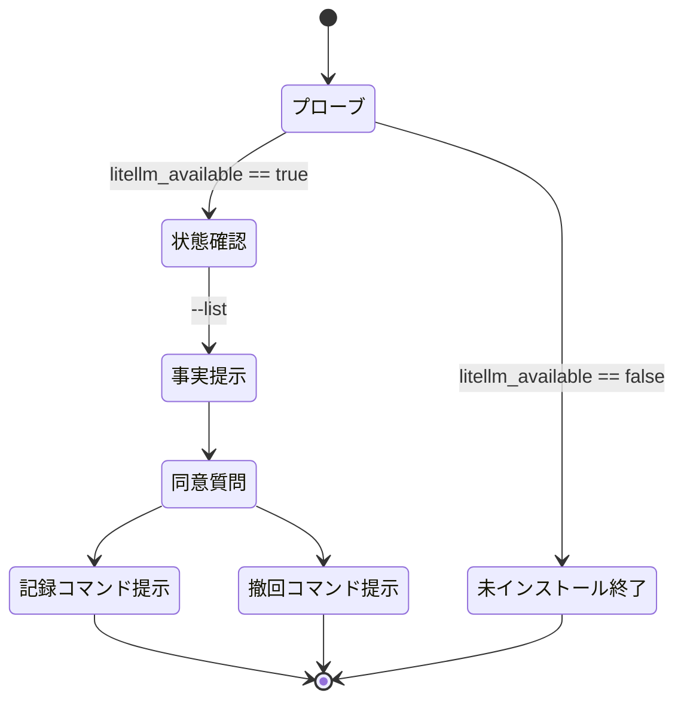
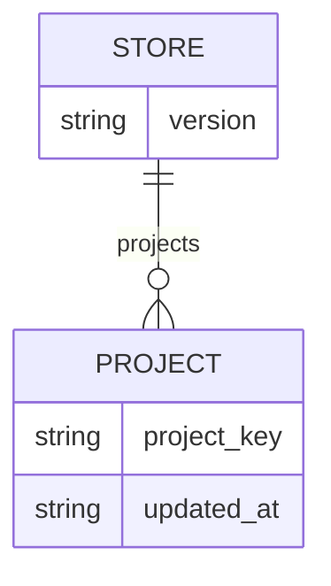

# muse-spark-contributor-consent - 要件定義書

## 1. 概要

### 1.1 背景

`muse-spark` の contributor ティア（`muse-spark-contributor`）は、レビュー段の
`codex exec -p litellm -m <model>` 呼び出しでモデルとして指定できる。指定できてしまう
以上、無人の develop / review 実行がプロジェクトの diff を contributor ティアへ偶発的に
送る経路が存在する。この経路を、ユーザーが明示的に同意したリポジトリだけに限定する。

### 1.2 目的

- ユーザーが明示的に同意したリポジトリでのみ contributor ティアを使用可能にし、
  無人の develop / review 実行が偶発的にプロジェクトの diff を contributor ティアへ
  送ることを無くす。
- contributor ティアの起動判定を指示文ではなくコードで強制する。PreToolUse(Bash)
  フックが、同意の無いプロジェクトでの contributor ティア起動を deny する。この強制が
  確立する境界は「同意の記録がないプロジェクトでは contributor ティアを起動できない」
  という点までであり、同意の記録側に機械的な強制は無い（a12）。
- 同意していないプロジェクトの develop / review 実行は現状とまったく同じ挙動を保つ。
  contributor ティアが単に利用不能になるだけで、新たな問い合わせも停止も発生しない。
- 機械化できない判断 — ある同意のスコープ外に contributor ティアが出る場合 — は、
  両プラグインのレビューレジストリ／プロトコル文書に dispatch 前の判定基準として記述する。

### 1.3 スコープ

対象:

- `em-workflow/hooks/` と `em-review/hooks/` 双方への `muse_guard.py`（PreToolUse(Bash)
  フック兼同意記録 CLI）の追加。
- 両プラグインが共有する同意ストア `~/.claude/em-workflow/muse-consent.json`。
- 両プラグインへのフック登録（`em-review/hooks/hooks.json` は新規作成）。
- 両プラグインの `references/reviewers.yaml` および `references/review-phase.md` への
  dispatch 前判定基準の記述。
- 両プラグインへの `skills/contributor-consent/SKILL.md` の追加。
- リポジトリルート `tests/test_muse_guard.py` の追加と、両プラグインのバージョン更新。

対象外:

- 共有モジュール（`shared/`）の抽出（a6）。
- `primary_chain` の変更、および chain への `muse-spark-contributor` エントリ追加（FR11）。
- `hooks/tests/muse-guard-cases.json` / `hooks/tests/run-muse-guard.py` の作成（FR10）。

## 2. ビジネス要件

### 2.1 ビジネス目標

| ID | 目標 |
|----|------|
| BO1 | `muse-spark` contributor ティアを、ユーザーが明示的に同意したリポジトリでのみ使用可能にし、無人の develop / review 実行がプロジェクトの diff を contributor ティアへ偶発的に送ることを無くす。 |
| BO2 | contributor ティアの起動判定を指示文ではなくコードで強制する。PreToolUse(Bash) フックが、同意の無いプロジェクトでの contributor ティア起動を deny する。この強制が確立する境界は「同意の記録がないプロジェクトでは contributor ティアを起動できない」という点までであり、同意の記録側に機械的な強制は無い（a12）。 |
| BO3 | 同意していないプロジェクトの develop / review 実行の挙動を現状のまま保つ（contributor ティアが利用不能になるだけ、問い合わせも停止も無い）。 |
| BO4 | 機械化できない判断（同意のスコープ外となる場合）を、両プラグインのレビューレジストリ／プロトコル文書に dispatch 前判定基準として記述する。 |

### 2.2 対象ユーザー

| ユーザータイプ | 説明 |
|----------------|------|
| プラグイン利用者（リポジトリ所有者） | `contributor-consent` スキルを対話セッションで手動実行し、当該リポジトリの同意を記録・撤回する。 |
| 無人実行される develop / review ワークフロー | 同意の有無を意識せずに走る。同意が無ければ contributor ティアが利用不能になるだけで、他は現状どおり。 |
| レビュー dispatch を行う LLM | dispatch 前に、記録済み同意（機械的チェック）と当該 dispatch での使用可否（LLM 判断）の 2 つを確認する。 |

### 2.3 期待される効果

- 同意が無いリポジトリでは、contributor ティアの起動が機械的に拒否される。
- 同意していないプロジェクトの実行が現状と変わらない（新たな対話ゲートが増えない）。
- 片方のプラグインだけを導入した利用者にも、同じ機械的強制が効く。
- 同意はプラグイン横断で共有され、どちらのプラグイン経由で記録しても両方に効く。

## 3. ユースケース

### 3.1 ユースケース一覧

| ID | ユースケース名 | アクター | 優先度 |
|----|----------------|----------|--------|
| UC01 | 同意していないプロジェクトでの contributor ティア起動を拒否する | フック（`muse_guard.py`） | 高 |
| UC02 | contributor ティア以外の Bash コマンドを素通しする | フック（`muse_guard.py`） | 高 |
| UC03 | `contributor-consent` スキルの提示に従って同意を記録する | プラグイン利用者 | 高 |
| UC04 | `contributor-consent` スキルの提示に従って同意を撤回する | プラグイン利用者 | 中 |
| UC05 | dispatch 前に contributor ティアを使ってよいか判定する | レビュー dispatch を行う LLM | 高 |

### 3.2 ユースケース詳細

#### UC01: 同意していないプロジェクトでの contributor ティア起動を拒否する

**アクター**: フック（`muse_guard.py`）

**事前条件**:

- `muse_guard.py` が PreToolUse / matcher `Bash` に登録されている。
- 当該プロジェクトキーが同意ストアに存在しない（ストア自体が無い場合を含む）。

**基本フロー**:

1. PreToolUse JSON を stdin から受け取る。
2. コマンド文字列が contributor ティアの起動かを判定する。
3. 起動である場合、呼び出し元 cwd からプロジェクトキーを導出する。
4. 同意ストアを読み、キーの有無を確認する。
5. キーが無いので `permissionDecision: deny` を stdout に出力し、exit 0 で終了する。

**代替フロー**:

- ストアが読めない／JSON が不正／構造が想定外の場合も「どのプロジェクトにも同意なし」として扱い、同じく deny する（FR6）。

**事後条件**:

- contributor ティアの起動が拒否され、reason が同意の欠如を示し、`additionalContext` が
  非 contributor エントリの使用を促している。
- 同意ストアは作成も変更もされていない。

#### UC02: contributor ティア以外の Bash コマンドを素通しする

**アクター**: フック（`muse_guard.py`）

**事前条件**: 同意ストアの状態は問わない。

**基本フロー**:

1. PreToolUse JSON を stdin から受け取る。
2. コマンド文字列が contributor ティアの起動でないと判定する。
3. 何も出力せず exit 0 で終了する（判定なし）。

**代替フロー**:

- 素の `muse-spark` 起動、引用符内・grep/rg のパターン引数・ヒアドキュメント本文中の
  単なる言及、`tool_name` が `Bash` でないペイロード、空コマンド、解析不能な stdin —
  いずれも判定なし。

**事後条件**: 通常のパーミッションフローがそのまま適用される。

#### UC03: `contributor-consent` スキルの提示に従って同意を記録する

**アクター**: プラグイン利用者

**事前条件**: 対話セッションであること（develop からは呼ばれない）。

**基本フロー**:

1. 利用者がスキルを手動で実行する。
2. スキルが vertex-review LiteLLM ハーネスの有無を `litellm_available` プローブで確認する。
3. スキルが `muse_guard.py --list --project-dir DIR` で現在の同意状態を確認する。
4. リモートの可視性、ライセンス、単独コントリビューターかどうかの 3 つの事実を機械的に収集し提示する。
5. 単一の `AskUserQuestion` ラウンドで同意を取る。
6. スキルが `muse_guard.py --record --project-dir DIR` を実行し、終了コードを確認して
   結果を 1 行で伝える。

**代替フロー**:

- プローブが false の場合、「未インストール」の平文メッセージを出して終了する。
- 利用者が質問を却下した、または何も答えなかった場合は非破壊側に倒し、CLI を呼ばずに終了する。

**事後条件**: 同意ストアに当該プロジェクトキーと `updated_at` が記録されている。

#### UC04: `contributor-consent` スキルで同意を撤回する

**アクター**: プラグイン利用者

**事前条件**: 当該プロジェクトの同意が記録されている。

**基本フロー**:

1. 利用者が同じスキルを実行する。
2. スキルが `muse_guard.py --remove --project-dir DIR` を実行する。

**事後条件**: 同意ストアからキーが完全に削除されている（空オブジェクトを残さない）。

#### UC05: dispatch 前に contributor ティアを使ってよいか判定する

**アクター**: レビュー dispatch を行う LLM

**事前条件**: `muse-spark` が選択された chain エントリである。

**基本フロー**:

1. read-mapping ルールに従い、当該プロジェクトの同意が記録されているかを確認する（機械的）。
2. この dispatch で使用してよいかを判断する（dispatch ごとの LLM 判断）。
3. 双方を満たす場合のみ contributor ティアへ読み替える。

**代替フロー**:

- dispatch ごとの「使わない」項目に該当する場合、または「同意のスコープ外」3 条件の
  いずれかに該当する場合は、読み替えを行わない。

**事後条件**: 判断は dispatch の前に完了している。

## 4. 機能要件

### 4.1 機能一覧

| ID | 機能名 | 説明 | 優先度 |
|----|--------|------|--------|
| FR1 | 両プラグインへの `muse_guard.py` PreToolUse(Bash) フック | contributor ティア起動を判定するコードのみのフックを両プラグインに追加する | 高 |
| FR2 | presence-only 同意ストア | リポジトリ外のユーザー所有 JSON ストアに、キーの存在＝同意として記録する | 高 |
| FR3 | `bash_guard` と同一のプロジェクトキー | `bash_guard.project_key` と完全に同じ導出規則を使う | 高 |
| FR4 | 未同意 contributor ティア起動の deny | 同意が無ければ `permissionDecision: deny` を返す | 高 |
| FR5 | contributor ティア起動以外での誤爆なし | 起動でないものには一切判定を出さない | 高 |
| FR6 | ストア不在・破損時の扱い | 読めない／不正なストアは「同意なし」として扱い、修復も書き込みもしない | 高 |
| FR7 | 同意記録 CLI | `--record` / `--remove` / `--list` を提供する。ストアを変更する唯一の経路 | 高 |
| FR8 | 両プラグインでのフック登録 | em-workflow の既存グループへ追加し、em-review には新規 hooks.json を作る | 高 |
| FR9 | 同意スコープの dispatch 前判定基準の明文化 | 両プラグインの reviewers.yaml / review-phase.md に記述する | 高 |
| FR10 | リポジトリルート `tests/` 配下のガードテスト | `tests/test_muse_guard.py` を標準エントリポイントで走らせる | 高 |
| FR11 | reviewers.yaml の chain 不変 | `primary_chain` を一切変更しない | 高 |
| FR12 | 両プラグインのバージョン更新 | plugin.json と marketplace.json を同値で更新する | 高 |
| FR13 | 両プラグインへの `contributor-consent` スキル | 同意の付与・撤回のコマンド提示を手動実行のスキルとして提供する | 高 |

### 4.2 機能詳細

#### FR1: 両プラグインへの `muse_guard.py` PreToolUse(Bash) フック

**説明**: `em-workflow/hooks/` と `em-review/hooks/` の**両方**に `muse_guard.py` を追加する。
`muse-spark-contributor` ティアを起動する Bash コマンドについて、当該プロジェクトの同意が
記録されていなければ deny、それ以外は判定なしとする PreToolUse(Bash) フック。
`bash_guard.py` の構造（stdin から PreToolUse JSON、stdout に `hookSpecificOutput`、常に
exit 0）に従い、コードのみで動作する — LLM も、ネットワークも、プロンプトも使わない。
2 つのコピーは、自プラグイン名を書かざるを得ない箇所を除いてバイト単位で同一とし、
共有モジュールは抽出しない。

**入力**:
- stdin: PreToolUse JSON（`tool_name`、`tool_input.command`、呼び出し元 cwd）

**出力**:
- stdout: `hookSpecificOutput` を含む JSON（deny 時のみ）、または空
- 終了コード: 常に 0

**ビジネスルール**:
- 2 つのコピーはバイト単位で同一（自プラグイン名の記述を除く）。
- 共有モジュールは抽出しない。

#### FR2: presence-only 同意ストア

**説明**: 同意はリポジトリ外のユーザー所有 JSON ストア
（`~/.claude/em-workflow/muse-consent.json`）に、`{version, projects: {<project key>: {updated_at}}}`
の形で記録する。両プラグインのコピーはこの**同一パス**を読み書きするため、どちらの
プラグイン経由で同意を得ても両方に効く。プロジェクトキーの存在そのものが同意であり、
可視性・ライセンス・コントリビューター数などの事実は一切保存しない。ストアパスは
`$EM_WORKFLOW_MUSE_CONSENT` で上書きできる（テスト専用）。`$EM_WORKFLOW_APPROVALS` に倣う。

**データ項目**:
| 項目 | 型 | 説明 |
|------|-----|------|
| `version` | - | ストアのスキーマバージョン |
| `projects` | オブジェクト | プロジェクトキー → 値のマップ |
| `projects.<key>.updated_at` | - | 記録時刻 |

#### FR3: `bash_guard` と同一のプロジェクトキー

**説明**: プロジェクトキーは `bash_guard.project_key` とまったく同じ規則で導出する。
呼び出し元 cwd に対する `git rev-parse --path-format=absolute --git-common-dir` を使い、
git が使えない場合や当該ディレクトリがリポジトリでない場合は `os.path.realpath(directory)`
にフォールバックする。

**ビジネスルール**:
- 同一リポジトリのすべての worktree（`.claude/worktrees/...` の integration / task worktree を
  含む）が 1 つの同意エントリに解決される。
- git 管理下でないディレクトリでも安定したキーが得られる。

#### FR4: 未同意 contributor ティア起動の deny

**説明**: コマンドが contributor ティアの起動であり、かつプロジェクトキーが同意ストアに
無い場合、フックは `permissionDecision: deny` を出力する。理由（日本語）は同意が無いことを
示し、`additionalContext` は回避策を探すのではなく非 contributor の `muse-spark` エントリ
（または別の chain エントリ）を使うようエージェントに指示する。

**ビジネスルール**:
- フックは `ask` を出さない。
- フックは `allow` を出さない。

#### FR5: contributor ティア起動以外での誤爆なし

**説明**: 次のいずれについても、フックは判定を出さない（exit 0、stdout 空）。

- contributor ティアを起動しない任意のコマンド
- 素の `muse-spark` の起動
- `muse-spark-contributor` を**言及するだけ**のコマンド — シングル／ダブルクォート内、
  `grep` / `rg` のパターン引数、ヒアドキュメント本文中

**ビジネスルール**:
- マッチングは両方向で境界を意識する。`muse-spark` を contributor ティアと読んではならず、
  `muse-spark-contributor` を素のティアと読んでもならない（superstring 境界）。
- 起動である引数の綴りは、ハーネスが使うすべての形で認識する:
  裸の `-m muse-spark-contributor`、`--model=muse-spark-contributor`、およびそれらの
  引用符付き等価形。

**解析上の義務**: この「誤爆しない／取りこぼさない」要求は、次の 4 つを含む。

- (a) コマンド文字列の分割は引用を認識したうえで行う。シングル／ダブルクォートの内側に
  現れる `;` `|` `&` `&&` `||` および改行は区切りではなく文字列の一部であり、引用を
  無視した分割を分割の前段に置いてはならない（引用内に `;` や改行を含むプロンプト引数を
  持つ実起動を取りこぼさず、引用内の単なる言及を独立した呼び出しとして切り出さない）。
- (b) ラッパー語の前置を認識する。値を別トークンで取るオプションを伴うラッパー
  （`xargs -n 1 codex ...`、`nice -n 1 codex ...` 等）では、そのオプションの値までを
  読み飛ばして被ラッパーのコマンド語に到達する。
- (c) シェルのネストを認識する。`-c` が他の短オプションと 1 トークンに結合された形
  （`bash -lc '...'`）でも、続く引数を入れ子のコマンド文字列として分類する。
- (d) それでもなお確信を持って分類できないものは、従来どおり判定なしとする（NFR2）。

#### FR6: ストア不在・破損時の扱い

**説明**: ストアファイルの不在、読み取り不能、不正な JSON、構造が想定外（dict でない、
`projects` が dict でない）のいずれも「どのプロジェクトにも同意なし」として扱う。
contributor ティアの起動は deny され、それ以外は依然として判定なしとなる。

**ビジネスルール**:
- フックはストアを作成・修復・書き込みしない。フック経路では読み取り専用。

#### FR7: 同意記録 CLI

**説明**: `muse_guard.py` は、ユーザーが同意の付与・撤回のために実行する out-of-band CLI を
提供する。`--record --project-dir DIR` / `--remove --project-dir DIR` /
`--list --project-dir DIR`。`--record` は導出したプロジェクトキーに `{updated_at}` を書き、
`--remove` はキーを完全に削除する。書き込みはアトミック（一時ファイル + `os.replace`）で、
必要に応じて親ディレクトリを作成する。`bash_guard` の CLI に倣う。

**書き込みの provenance**: 3 つのコマンドはいずれも標準入力の種別によらず動作する。
書き込みの provenance は、ユーザーが起動する `contributor-consent` スキルと、その中の
`AskUserQuestion` の回答が担う（FR13）。

**ビジネスルール**:
- ストアを Write / Edit で直接編集することは禁止。すべての変更はこの CLI を通す。
- この CLI はフック経路からもワークフロー自身からも呼ばれない。
- 同意の記録側に機械的な強制は無い（a12）。

#### FR8: 両プラグインでのフック登録

**説明**: `em-workflow/hooks/hooks.json` の既存の `PreToolUse` / matcher `Bash` グループに、
コマンド形をそのまま `python3 "${CLAUDE_PLUGIN_ROOT}"/hooks/muse_guard.py`、`timeout: 15`
として登録する。配置は `destructive-guard.py` より前とし、後者の一律 allow が先に判定を
終わらせないようにする。あわせて `tests/test_guardrail_hooks_migration.py` の
`EXPECTED_BASH_GUARD_ORDER` を更新する。`em-review/hooks/hooks.json` を新規作成し
（em-review にとって初の hooks ファイル）、同じ verbatim 形・同じ timeout で同じスクリプトを
登録する。

**ビジネスルール**:
- 1 回の Bash 呼び出しで両フックが発火しても冪等。両者は同じストアを読み同じ判定を返す。

#### FR9: 同意スコープの dispatch 前判定基準の明文化

**説明**: `em-workflow/references/reviewers.yaml` + `em-workflow/references/review-phase.md`、
および em-review の対応ファイルに、次を記述する。

- (a) read-mapping ルール — `muse-spark` が選択された chain エントリであるとき、
  contributor ティアへの読み替えは 2 つのチェックを経た後にのみ許される。すなわち、
  このプロジェクトの同意が記録されているか（機械的）と、この dispatch で使ってよいか
  （dispatch ごとの LLM 判断）。
- (b) review-phase.md の `never substitute a model of your own choosing` 条項に対する明示的な
  例外。その read-mapping ルールを指し、判断は dispatch の**前**に行われることを述べる。
- (c) dispatch ごとの「使わない」項目をちょうど 1 つ — その中核が未公開のアイデアである変更、
  すなわち設計やアプローチがプロジェクトの差別化要因である新機能。
- (d) 「同意のスコープ外」条件 3 つ — (c) とは文面上明確に区別して記述する。
  diff 中の秘密情報（API キー、資格情報、内部エンドポイント、顧客データ）、
  第三者の著作物（vendored コード、外部から提供されたパッチ、コントリビューターの PR）、
  リポジトリが private である／ライセンスが変更されたこと。

**ビジネスルール**:
- dispatch ごとの既定は「使う」。fail-closed ではない。
- セキュリティ観点のレビューは除外しない。
- `security.out-of-scope-enforcement` の回答に対するオーケストレーターの制約に従い、
  3 つ目のスコープ外条件は dispatch 時点の**現在の状態**のチェックとして書く
  — 「リポジトリが現在 private である、あるいはそのライセンスがもはや同意が妥当であった
  ものではない場合、contributor ティアを使わない」。同意時に記録した値との比較としては
  決して書かない。

#### FR10: リポジトリルート `tests/` 配下のガードテスト

**説明**: ガードテストは `tests/test_muse_guard.py` に置き、既存のエントリポイント
`python3 -m unittest discover -s tests` で実行する。deny 側と誤爆なし側の両方、および
FR7 の 3 コマンドが標準入力の種別によらず動作することを網羅し、
両プラグインのスクリプトのコピーを検証する。

**ビジネスルール**:
- `hooks/tests/muse-guard-cases.json` および `hooks/tests/run-muse-guard.py` は作成しない。
  destructive-guard のケースランナー方式はこのフックには複製しない。

#### FR11: reviewers.yaml の chain 不変

**説明**: どちらのプラグインの `references/reviewers.yaml` でも `primary_chain` を変更しない。
6 つの観点は既存のエントリを保ち（`{harness: litellm, model: muse-spark}` は現在の位置に
そのまま残る）、`muse-spark-contributor` エントリを chain に追加することはない。

**ビジネスルール**:
- 新たな散文は、ファイルの制限付きパーサのテストが許容する場所（ヘッダーコメントブロック、
  または `perspectives:` ブロックの外）に置く。
- リテラル文字列 `cross_validation` を導入してはならない。
- contributor ティアは FR9 の基準の下で dispatch 時に opt-in されるものであり、レジストリ
  レベルの既定ではない。したがって観点ごとの hop 予算は影響を受けない。

#### FR12: 両プラグインのバージョン更新

**説明**: `em-workflow/` と `em-review/` の双方でファイルが変わるため、同一の変更内で両
プラグインのバージョンを上げる。各プラグインの `<plugin>/.claude-plugin/plugin.json` の
`version` を、リポジトリルート `.claude-plugin/marketplace.json` の該当エントリと同値に保つ
（em-workflow は 0.1.69 から、em-review は 0.5.7 から）。`.claude/rules/core-plugin-version-bump.md`
に従う。

#### FR13: 両プラグインへの `contributor-consent` スキル

**説明**: `skills/contributor-consent/SKILL.md` を**両方**のプラグインに追加する。対話
セッションでユーザーが手動実行するものであり、develop から呼ばれることはない。まず各
プラグインの review-phase.md に既に定義されている `litellm_available` プローブで
vertex-review LiteLLM ハーネスの有無を確認し、false のときは平文の「未インストール」
メッセージを出して終了する。そうでなければ、現在の同意状態を `--list` で確認し、リモートの可視性
（`gh repo view --json visibility` または同等の手段）、ライセンス、ユーザーが唯一の
コントリビューターかどうか、のちょうど 3 つの事実を機械的に収集して提示し、単一の
`AskUserQuestion` ラウンドで同意を取る。

スキル自身が回答に応じて `--record` / `--remove` を実行し、終了コードを確認して結果を
1 行で伝える。ストアに触れる経路はこの 2 コマンドだけで、Write / Edit による直接編集は
行わない。

**ビジネスルール**:
- 未 push のコミットの有無は提示しない。
- 撤回も同じスキルが扱う（`--remove` のコマンド提示）。
- 判断材料を会話的に収集することはしない。
- `.claude/rules/slash-commands-as-skills.md` に従い、スキルとして置く。`commands/` ファイルには
  しない。

## 5. 非機能要件

### 5.1 パフォーマンス要件

- NFR4（登録 timeout 内のレイテンシ）: フックは登録された `timeout: 15` に対して十分内側で
  完了する。最大で `git` サブプロセス 1 回（5 秒タイムアウト、FR3 のキー導出）と小さな JSON
  読み取り 1 回。コマンドが contributor ティアの起動でない場合は、その両方の前に短絡する。

### 5.2 セキュリティ要件

- NFR1（決定的・オフラインな判定）: フックの判定はコマンド文字列とディスク上の同意ストアの
  純関数。ネットワークアクセス、LLM 呼び出し、リポジトリメタデータの取得を一切行わず、
  すべての Bash 呼び出しで発火する PreToolUse(Bash) フックにおける既存の no-network ガード
  の前例を保つ。
- NFR7（同意ストアは presence 以外を記録しない）: ストアのプロジェクトごとの値は
  `updated_at` のみを持つ。リポジトリの可視性、ライセンス識別子、コントリビューター一覧、
  diff の内容、パスのいずれもストアに書かれない。
- 強制の境界（BO2、FR4、FR7、a12）: 機械的な強制はフックの deny の 1 つで、これが確立するのは
  「同意の記録がないプロジェクトでは contributor ティアを起動できない」という境界までである。
  同意の記録側に機械的な強制は無く、`contributor-consent` スキルを経ることは指示レベルの
  規約である。学習提供は取り消せないため、この残余は仕様に明記したうえで受け入れる。

### 5.3 可用性要件

- NFR2（通常のパーミッションフローへ fail open、`ask` は出さない）: 確信を持って分類できない
  ものはすべて判定なし（exit 0、出力なし）とし、通常のパーミッションフローが適用される。
  `ask` は `claude-batch` 下で `deny` に降格され、答える者のいない無人実行をその場で止めて
  しまうため、フックは `ask` を出さない。
- NFR3（無人実行の安全性）: どちらのプラグインの develop フェーズ文書・review フェーズ文書にも
  新たな `AskUserQuestion` の箇所を導入しない。同意していないプロジェクトでの develop 実行は
  contributor ティアが無いことを除いて現状どおり進む。同意は FR13 のスキルと FR7 の CLI に
  よる out-of-band でのみ与えられる。`--batch` に特別扱いは設けない。
- NFR9（重複フックの冪等性）: 両プラグインが導入されている場合、`muse_guard.py` は同一の
  Bash 呼び出しに対して 2 回発火する。両コピーは同じストアを読み同じ判定に至るため、重複は
  no-op となる。deny が 2 回でも 1 回と等価であり、判定なしが 2 回でもパーミッションフローは
  そのまま。

### 5.4 保守性要件

- NFR5（実ユーザー状態からのテスト隔離）: テストは実際の `~/.claude` の状態を読み書きしない。
  `$EM_WORKFLOW_MUSE_CONSENT` を `tempfile.TemporaryDirectory()` 配下のパスに設定し、
  `test/README.md` に従って stdin に JSON を与えるサブプロセスとしてフックを起動する。
- NFR6（サードパーティのテスト依存なし）: テストコードは Python 標準ライブラリのみを使う
  （`unittest`、`json`、`subprocess`、`tempfile`）。`test/README.md` のテストにおける
  外部依存禁止ルールに従う。

### 5.5 互換性要件

- NFR8（既存ガードファミリとの構造的整合）: 各登録は既存の well-formedness 不変条件を
  変更せずに満たす。プラグインルート相対の verbatim コマンド形、スクリプトごとの timeout 表、
  同一イベント下での同一スクリプトの重複登録なし、実行ビット／参照スクリプト存在チェック。
  これらを em-workflow だけでなく em-review の新しい hooks.json にも適用する。

## 6. UI/UX要件

### 6.1 画面設計要件

GUI は無い。ユーザーに接する面は次の 3 つ。

- `contributor-consent` スキルの対話（3 つの事実の提示、単一の `AskUserQuestion` ラウンド、
  実行結果の 1 行報告）。
- deny 時の `permissionDecisionReason`（日本語、同意の欠如を示す）と `additionalContext`
  （非 contributor エントリの使用を指示）。
- `--record` / `--remove` の結果行（日本語、記録または削除したキーを述べる）。

### 6.2 画面遷移

### 6.3 レスポンシブ対応

該当なし（GUI が無い）。

## 7. データ要件

### 7.1 データモデル概要

### 7.2 データ項目

| エンティティ | 項目名 | 型 | 必須 | 説明 |
|--------------|--------|-----|------|------|
| 同意ストア | `version` | - | ○ | ストアのスキーマバージョン |
| 同意ストア | `projects` | オブジェクト | ○ | プロジェクトキーから値へのマップ |
| プロジェクトエントリ | プロジェクトキー | 文字列 | ○ | FR3 の規則で導出。キーの存在が同意そのもの |
| プロジェクトエントリ | `updated_at` | - | ○ | 記録時刻。これ以外のフィールドは持たない（NFR7） |

### 7.3 データ保持期間

| データ種別 | 保持期間 |
|------------|----------|
| 同意エントリ | `--remove` で削除されるまで（キーごと完全に削除する） |

## 8. 外部連携

### 8.1 連携システム

| システム名 | 連携方法 | データ |
|------------|----------|--------|
| vertex-review LiteLLM ハーネス | `contributor-consent` スキルの `litellm_available` プローブ（各プラグインの review-phase.md に定義済み） | 有無の真偽値のみ |
| `gh`（または同等の手段） | `contributor-consent` スキルが `gh repo view --json visibility` でリモート可視性を取得 | 可視性 |
| `git` | FR3 のプロジェクトキー導出（`git rev-parse --path-format=absolute --git-common-dir`） | git common dir のパス |

### 8.2 API仕様要件

フック自身は一切のネットワークアクセスを行わない（NFR1）。

## 9. 制約条件

### 9.1 技術的制約

- フックは stdin から PreToolUse JSON を受け、stdout に `hookSpecificOutput` を出し、常に
  exit 0 で終える（`bash_guard.py` の構造）。
- フックはコードのみ。LLM もネットワークもプロンプトも使わない。
- 同意ストアの直接編集（Write / Edit）は禁止。変更はすべて FR7 の CLI を経由する。
- ストアを変更できるのは `--record` / `--remove` だけで、これを呼ぶのは FR13 のスキルに限る。
- フックのコマンド形は `python3 "${CLAUDE_PLUGIN_ROOT}"/hooks/muse_guard.py`、`timeout: 15`。
- `muse_guard.py` は `destructive-guard.py` より前に置く。
- 新たな散文は reviewers.yaml の制限付きパーサのテストが許容する場所に置き、
  リテラル `cross_validation` を導入しない。
- 共有モジュールは抽出せず、2 つのコピーを持つ。

### 9.2 ビジネス上の制約

- 同意していないプロジェクトの develop / review 実行の挙動を変えない。
- 新たな `AskUserQuestion` の箇所を develop / review 経路に導入しない。
- `primary_chain` を変更しない。

### 9.3 スケジュール制約

記載なし。

### 9.4 宣言された変更集合

このフィーチャー固有のパスは手動で列挙せず、create-plan で `workflow.yaml` の各タスクの
`files` から導出する（`references/phases/create-plan-phase.md`）。

**デフォルトメンバー**（SPEC作成者が明示的に除外しない限り、常に宣言に含まれる）:

- `feature-docs/muse-spark-contributor-consent/**`
- `test-docs/muse-spark-contributor-consent/**`

`feature-docs/{feature}/**` に含まれるもの: `REQUIREMENTS.md`、`SPEC.md`、`IMPLEMENTATION.md`、
`workflow.yaml`、`phase-state/`、`tasks/`、`reviews/roundN.yaml`、`VERIFICATION.md`、
`retrospect.yaml`、およびデザインステップが生成するデザイン成果物。生成主体は各フェーズ
ドキュメントおよび `references/phase-state.md` を参照。

`test-docs/{feature}/**` に含まれるもの: `{T}.tests.yaml`（パス形式:
`test-docs/{feature}/{T}.tests.yaml`）。生成主体は `implement-phase.md` を参照。

**意味論**:

- デフォルトのメンバーは、SPEC作成者が明示的に除外しない限り宣言に含まれる。
- この宣言はスーパーセットの主張であり、実際の変更集合は宣言に含まれる必要がある。

## 10. 想定される課題とリスク

### 10.1 技術的課題

| 課題 | 影響度 | 対応策 |
|------|--------|--------|
| コマンド文字列の静的解析による誤爆（引用符内・grep パターン・ヒアドキュメント本文の言及を起動と誤認） | 高 | 引用を認識した分割を含む解析上の義務（FR5 (a)–(d)）と、誤爆なし側を網羅するテスト（FR10、TS-3/TS-6/TS-7/TS-26） |
| `muse-spark` と `muse-spark-contributor` の superstring 境界の取り違え | 高 | 両方向の境界チェックと TS-3 / TS-4 による検証 |
| ラッパー語やネストしたシェル越しの起動の取りこぼし | 高 | FR5 (b)(c) のラッパー・ネスト認識と TS-27 による検証 |
| `destructive-guard.py` の一律 allow が先に判定を終わらせる | 高 | `muse_guard.py` を `destructive-guard.py` より前に登録し、`EXPECTED_BASH_GUARD_ORDER` で順序を固定（FR8、TS-12） |
| 両プラグイン導入時にフックが 2 回発火する | 低 | 同一ストア・同一判定により冪等（NFR9） |
| 同意時に記録した可視性／ライセンスと現在の状態のずれ | 中 | 3 つ目のスコープ外条件を dispatch 時点の現在状態のチェックとして書く（FR9、a10） |
| 同意の記録側に機械的な強制が無く、CLI をどのプロセスからも呼べる | 中 | 保証する境界（フックの deny まで）を仕様に明記し、残余を受け入れる（a12、BO2） |

### 10.2 ビジネスリスク

| リスク | 発生確率 | 影響度 | 対応策 |
|--------|----------|--------|--------|
| 無人実行が偶発的に diff を contributor ティアへ送る | 高 | 高 | コードによる PreToolUse(Bash) での決定的な deny（FR1、FR4） |
| em-review だけを導入した利用者に機械的強制が効かない | 中 | 高 | 両プラグインにフックを同梱し、em-review に hooks.json を新設（FR8、a6） |
| `ask` の発行により無人実行が停止する | 中 | 高 | フックは `ask` を出さない（NFR2、a3） |
| 同意が worktree ごとに分断され、実質的に無効化される | 中 | 中 | `bash_guard.project_key` と同一のキー導出で 1 リポジトリ 1 エントリ（FR3、a2） |
| エージェントがユーザーの意図なく同意を記録する | 中 | 高 | 記録経路を FR13 のスキルに限る指示レベルの規約。機械的な強制は無く、残余は受け入れる（a12） |

## 11. 成功基準

### 11.1 受け入れ基準

- [ ] AC-1: 同意ストアが空または不在のとき、`muse-spark-contributor` ティアを起動する Bash
      コマンドは `muse_guard.py` から `permissionDecision: deny` を受け取る。そのプロジェクトの
      キーがストアに存在すれば同じコマンドは判定を受け取らない。両プラグインのコピーで成立する。
- [ ] AC-2: 同意ストアが空または不在のとき、素の `muse-spark` 起動は `muse_guard.py` から
      判定を受け取らない（exit 0、stdout 空）。
- [ ] AC-3: `muse-spark-contributor` を引用符内・grep/rg パターン・ヒアドキュメント本文中で
      単に言及するだけのコマンドは判定を受け取らない。引用符の内側に `;` や改行を含む場合も同様。
- [ ] AC-4: 不在のストア、不正 JSON のストア、構造が想定外のストアはいずれも「同意なし」として
      振る舞う。contributor ティア起動は deny、それ以外は判定なし。ストアファイルはフック経路で
      作成も変更もされない。
- [ ] AC-5: 同一リポジトリの 2 つの worktree が同じ同意エントリに解決される（片方で記録した
      同意がもう片方でも有効）。git 管理下でないディレクトリは realpath キーにフォールバックし、
      それでも deny / 同意の対象になる。
- [ ] AC-6: `em-workflow/hooks/hooks.json` が PreToolUse(Bash) グループに `muse_guard.py` を
      verbatim 形 `python3 "${CLAUDE_PLUGIN_ROOT}"/hooks/muse_guard.py`、`timeout: 15` で、
      `destructive-guard.py` より前に登録している。`EXPECTED_BASH_GUARD_ORDER` がまさにその位置に
      含む。`em-review/hooks/hooks.json` が存在し、同じ verbatim 形・同じ timeout で同じスクリプトを
      登録している。既存のフック登録不変条件が両ファイルで通る。
- [ ] AC-7: 両プラグインの `references/reviewers.yaml` と `references/review-phase.md` が、
      read-mapping ルール、dispatch 前タイミングを伴う substitute 禁止の例外、dispatch ごとの
      「使わない」項目 1 つ、スコープ外条件 3 つ（1 つと 3 つは文面上明確に区別）を述べており、
      可視性／ライセンス条件が dispatch 時点の現在状態のチェックとして表現されている。
- [ ] AC-8: 両プラグインの `references/reviewers.yaml` のすべての `primary_chain` エントリが
      本フィーチャー前とバイト単位で同一。いかなる chain にも `muse-spark-contributor` が
      含まれない。em-workflow の reviewers.yaml にリテラル `cross_validation` が依然として無い。
- [ ] AC-9: 両プラグインの develop フェーズ文書・review フェーズ文書が、ベースリビジョンに対して
      新たな `AskUserQuestion` の箇所を増やしていない（develop を実行するのではなく機械的に検証）。
- [ ] AC-10: `em-workflow` と `em-review` がそれぞれ `<plugin>/.claude-plugin/plugin.json` と
      `.claude-plugin/marketplace.json` の該当エントリで同じバージョン文字列を持ち、いずれも
      ベースリビジョンの値より大きい。
- [ ] AC-11: `tests/test_muse_guard.py` が存在する状態で
      `python3 -m unittest discover -s tests` が通る。本フィーチャーのために
      どちらのプラグインの `hooks/tests/` にもファイルが作られていない。
- [ ] AC-12: `skills/contributor-consent/SKILL.md` が両プラグインに存在し、vertex-review/LiteLLM の
      存在プローブとその「未インストール」終了、`--list` による現在の同意状態の確認、提示する
      3 つの事実（リモート可視性、ライセンス、単独コントリビューターか）、単一の
      `AskUserQuestion` ラウンド、および回答に応じた `--record` / `--remove` の実行を
      記述している。ストアに触れる経路が CLI だけであることを述べている。未 push コミットの
      状態は提示せず、どの develop フェーズ文書からも参照されていない。
- [ ] AC-13: `muse_guard.py` の `--record` / `--remove` / `--list` は、標準入力が対話端末で
      あるかによらず動作する。`--record` はキーを記録し、`--remove` は削除し、`--list` は
      ストアを変更しない。両プラグインのスクリプトのコピーで成立する。

### 11.2 KPI

記載なし。

## 12. テストシナリオ

### 12.1 テスト観点

- [ ] 正常系: 同意記録後の contributor ティア起動が判定なしで通る（TS-2）。同意 CLI の
      往復（`--list` / `--record` / `--remove`）が期待どおり振る舞う（TS-11）。
- [ ] 異常系: 同意ストアが不在・不正 JSON・構造想定外・ディレクトリのとき、contributor ティア
      起動は deny され、素の起動は判定なしで、ストアは書き換えられない（TS-1、TS-8）。
      非対話 stdin でも `--record` / `--remove` は成立する（TS-29）。
- [ ] 境界値: `muse-spark` と `muse-spark-contributor` の superstring 境界（TS-3、TS-4）、
      引数の綴りの全バリエーション（TS-5、TS-26）、単なる言及と実起動の区別（TS-6）、
      ラッパー語とネストしたシェル（TS-27）、無関係なコマンド・非 Bash ツール・空コマンド・
      解析不能な stdin（TS-7）。
- [ ] セキュリティ: 未同意プロジェクトからの起動が確実に deny される（TS-1、TS-4）。
      3 コマンドが標準入力の種別によらず動作する（TS-29、TS-30）。
      dispatch 前判定基準が両プラグインの文書に記述されている（TS-14）。chain が不変で
      `muse-spark-contributor` がどこにも入らない（TS-13）。新たな `AskUserQuestion` の箇所が
      増えていない（TS-15）。同意ストアが presence 以外を持たない（TS-11）。
- [ ] パフォーマンス: 該当する専用シナリオなし。NFR4 は起動でないコマンドでの短絡と、
      `git` 1 回 + 小さな JSON 読み取り 1 回という上限で担保する。
- [ ] 構成・配置: フック登録不変条件（TS-12）、キー導出の worktree 同一性と非 git
      フォールバック（TS-9、TS-10）、バージョン整合（TS-16）、テスト配置規約（TS-17）、
      スキルの形（TS-18）。

## 13. 用語定義

| 用語 | 定義 |
|------|------|
| contributor ティア | `muse-spark-contributor`。`muse-spark` の contributor 向けモデル指定 |
| 素のティア | `muse-spark`。contributor でない `muse-spark` のエントリ |
| 同意ストア | `~/.claude/em-workflow/muse-consent.json`。プロジェクトキーの存在が同意を表す JSON ファイル |
| プロジェクトキー | `bash_guard.project_key` と同一規則で導出される、リポジトリ単位のキー |
| read-mapping ルール | `muse-spark` が選択された chain エントリのとき、2 つのチェックを経てのみ contributor ティアへ読み替えてよいとする規則 |
| dispatch 前判定基準 | dispatch の前に LLM が適用する、contributor ティア使用可否の記述された基準 |
| 書き込みの provenance | ストアの変更を `contributor-consent` スキル経由に限る指示レベルの規約。機械的な強制は伴わない（a12） |

## 14. 確認事項

### 14.1 確認済み事項

- [x] em-review へのフック同梱（`create-spec.em-review-hook-parity`）:
      `both_plugins_ship_the_hook`。`muse_guard.py` を両プラグインの `hooks/` に verbatim で
      複製し、em-review は初の `hooks/hooks.json` を得る。共有モジュールは抽出しない。（a6）
- [x] ガードテストの配置（`testing.muse-guard-test-location`）: `repo_root_unittest`。
      `tests/test_muse_guard.py` に置き `python3 -m unittest discover -s tests` で走らせる。
      `hooks/tests/muse-guard-cases.json` と `run-muse-guard.py` は作らない。（a8）
- [x] 受け入れ検証の方法（`acceptance.develop-smoke-verification`）: `static_equivalent_tests`。
      「同意していないプロジェクトで develop を実行する」基準は、実際の develop 実行ではなく
      自動の静的等価テストで満たす。（a9）
- [x] スコープ外条件の強制方法（`security.out-of-scope-enforcement`）: `documented_only`
      （オーケストレーターの current-state 制約付き）。3 条件は記述された dispatch 前基準として
      reviewers.yaml と review-phase.md に留め、`muse_guard.py` は同意の presence のみを見る。
      ストアは presence-only の形を保ち、可視性／ライセンス／コントリビューターの事実は記録せず、
      ガードはネットワークアクセスを行わない。ドリフト条件は dispatch 時点の現在状態の
      チェックとして書く。（a10）
- [x] design ステップの実行（`design-step.recommendation`）: `decide_autonomously`。
      本フィーチャーでは design ステップを実行する（`status: completed`）。ストアの形、コマンド
      マッチングのアルゴリズム、PreToolUse の順序、reviewers.yaml の配置制約をまとめて確定する
      変更であるため。（a11）
- [x] 同意書き込みの provenance: 同意の記録側に機械的な強制は置かない。`--record` /
      `--remove` はどのプロセスからも呼べるため、この境界は `contributor-consent` スキルを
      経るという指示レベルの規約に依存する。機械的に保証されるのはフックの deny までとし、
      残余は仕様に明記して受け入れる。（a12）

その他、アナリストが置いた前提:

- [x] 同意ストアの配置（a1）: すべてのリポジトリの外、`~/.claude/em-workflow/muse-consent.json`。
      `bash_guard.py` の approvals.json の配置に倣い、両プラグインのコピーが同一パスを使う。
- [x] プロジェクトキーの導出（a2）: `bash_guard.project_key` と完全に同一（git-common-dir、
      realpath フォールバック）。同意はリポジトリ単位で、そのすべての worktree が共有する。
- [x] 判定の種類（a3）: `deny` か判定なしのみ。`ask` も `allow` も出さない。
- [x] ストアパスの上書き（a4）: `$EM_WORKFLOW_MUSE_CONSENT` で上書き可能。テストはこれを専用に使う。
- [x] フック登録（a5）: em-workflow の既存 PreToolUse(Bash) グループに `timeout: 15` で
      `destructive-guard.py` より前に登録し、em-review には同じ形・同じ timeout で新規 hooks.json を作る。
- [x] chain の不変（a7）: どの `primary_chain` にも `muse-spark-contributor` を追加しない。
      contributor ティアは記述された基準の下で dispatch 時に選択されるものであり、レジストリが
      選ぶものではない。

### 14.2 未確認・保留事項

無し（すべての要件が `status: resolved`）。

## 15. 参考資料

- `.claude/rules/core-plugin-version-bump.md`: プラグインのバージョン更新ルール（FR12）
- `.claude/rules/slash-commands-as-skills.md`: スラッシュコマンドをスキルとして作るルール（FR13）
- `test/README.md`: テストの規約（テスト隔離・外部依存禁止）（NFR5、NFR6、a8）
- `em-workflow/references/reviewers.yaml` / `em-workflow/references/review-phase.md`:
  dispatch 前判定基準の記述先（FR9）
- `em-review/references/reviewers.yaml` / `em-review/references/review-phase.md`:
  同上（em-review 側）（FR9）
- `em-workflow/hooks/bash_guard.py`: フック構造・プロジェクトキー導出・CLI の前例（FR1、FR3、FR7）
- `em-workflow/hooks/hooks.json` / `tests/test_guardrail_hooks_migration.py`: フック登録と
  `EXPECTED_BASH_GUARD_ORDER`（FR8）
- `references/phases/create-plan-phase.md`: 宣言された変更集合の導出（9.4）
