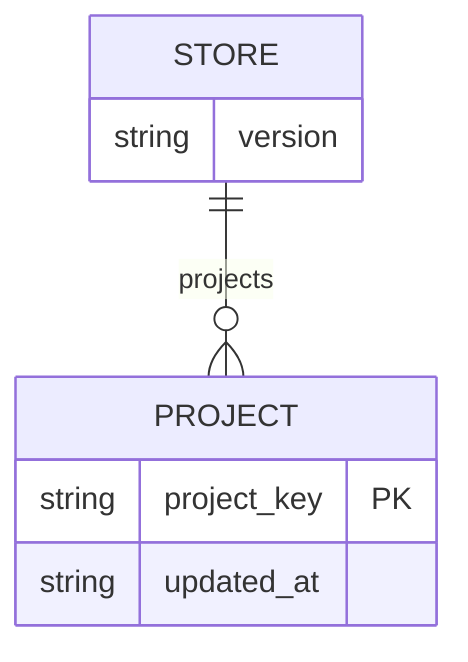

# Feature: muse-spark-contributor-consent

## Overview

`muse-spark` の contributor ティア（`muse-spark-contributor`）を、ユーザーが明示的に同意した
リポジトリでのみ使用可能にする。contributor ティアの起動判定は指示文ではなくコードで強制し、
両プラグインに同梱する PreToolUse(Bash) フック `muse_guard.py` が deny する。同意の記録は
`contributor-consent` スキル経由で行う。機械化できない判断（ある同意のスコープ外に contributor ティアが出る
場合）は、両プラグインのレビューレジストリ／プロトコル文書に dispatch 前の判定基準として
記述する。

要件の一次情報は `feature-docs/muse-spark-contributor-consent/REQUIREMENTS.md`。本書はその
実装向けの記述であり、要件を新たに起こしていない。

## Objectives

- contributor ティアを、ユーザーが明示的に同意したリポジトリでのみ使用可能にし、無人の
  develop / review 実行がプロジェクトの diff を contributor ティアへ偶発的に送ることを無くす。
- contributor ティアの起動判定を指示文ではなくコードで強制する。PreToolUse(Bash) フックが、
  同意の無いプロジェクトでの contributor ティア起動を deny する。この強制が確立する境界は
  「同意の記録がないプロジェクトでは contributor ティアを起動できない」という点までであり、
  同意の記録側に機械的な強制は無い（a12）。
- 同意していないプロジェクトの develop / review 実行を現状とまったく同じ挙動に保つ
  — contributor ティアが利用不能になるだけで、新たな問い合わせも停止も発生しない。
- 機械化できない判断（contributor ティアがある同意のスコープ外となる場合）を、両プラグインの
  レビューレジストリ／プロトコル文書に dispatch 前の判定基準として記述する。

## User Stories

### US1: 同意したリポジトリでだけ contributor ティアが使える

プラグイン利用者として、明示的に同意したリポジトリでのみ contributor ティアが使われる
状態にしたい。無人実行がプロジェクトの diff を偶発的に contributor ティアへ送らないため。

**Acceptance Criteria:**

- [ ] AC-1: 同意ストアが空または不在のとき、`muse-spark-contributor` ティアを起動する Bash
      コマンドは `muse_guard.py` から `permissionDecision: deny` を受け取る。そのプロジェクトの
      キーがストアに存在すれば同じコマンドは判定を受け取らない。これは両プラグインの
      スクリプトのコピーで成立する。
- [ ] AC-5: 同一リポジトリの 2 つの worktree が同じ同意エントリに解決される（片方で記録した
      同意がもう片方でも有効）。git 管理下でないディレクトリは realpath キーにフォールバックし、
      それでも deny / 同意の対象になる。

### US2: ゲートがコードで決定的に効く

プラグイン利用者として、ゲートが指示文ではなくコードで強制されている状態にしたい。
エージェントの通常の Bash 呼び出し経路から、contributor ティアの起動も同意の記録も
できないようにするため。

**Acceptance Criteria:**

- [ ] AC-4: 不在のストア、不正 JSON のストア、構造が想定外のストアはいずれも「同意なし」として
      振る舞う。contributor ティア起動は deny、それ以外は判定なし。ストアファイルはフック経路で
      作成も変更もされない。
- [ ] AC-6: `em-workflow/hooks/hooks.json` が PreToolUse(Bash) グループに `muse_guard.py` を
      verbatim 形 `python3 "${CLAUDE_PLUGIN_ROOT}"/hooks/muse_guard.py`、`timeout: 15` で
      `destructive-guard.py` より前に登録している。`EXPECTED_BASH_GUARD_ORDER` がまさにその位置に
      含む。`em-review/hooks/hooks.json` が存在し、同じ verbatim 形・同じ timeout で同じ
      スクリプトを登録している。既存のフック登録不変条件が両ファイルで通る。
- [ ] AC-13: `muse_guard.py` の `--record` / `--remove` / `--list` は、標準入力が対話端末で
      あるかによらず動作する。`--record` はキーを記録し、`--remove` は削除し、`--list` は
      ストアを変更しない。両プラグインのスクリプトのコピーで成立する。
- [ ] AC-11: `tests/test_muse_guard.py` が存在する状態で `python3 -m unittest discover -s tests`
      が通る。本フィーチャーのためにどちらのプラグインの `hooks/tests/` にもファイルが作られていない。

### US3: 同意していないプロジェクトの実行が今までどおり動く

プラグイン利用者として、同意していないプロジェクトでの develop / review 実行が現状と
変わらないままでいてほしい。contributor ティアが使えないこと以外に影響を受けないため。

**Acceptance Criteria:**

- [ ] AC-2: 同意ストアが空または不在のとき、素の `muse-spark` 起動は `muse_guard.py` から
      判定を受け取らない（exit 0、stdout 空）。
- [ ] AC-3: `muse-spark-contributor` を引用符内・grep/rg のパターン引数・ヒアドキュメント本文中で
      単に言及するだけのコマンドは判定を受け取らない。引用符の内側に `;` や改行を含む場合も同様。
- [ ] AC-9: 両プラグインの develop フェーズ文書・review フェーズ文書が、ベースリビジョンに対して
      新たな `AskUserQuestion` の箇所を増やしていない（develop を実行するのではなく機械的に検証）。

### US4: 機械化できない判断が文書に書かれている

レビュー dispatch を行う LLM として、contributor ティアを使ってよいかの判定基準が dispatch
前に適用できる形で書かれていてほしい。機械的チェックだけでは決められない場合の判断を
その場で下せるため。

**Acceptance Criteria:**

- [ ] AC-7: 両プラグインの `references/reviewers.yaml` と `references/review-phase.md` が、
      read-mapping ルール、dispatch 前タイミングを伴う substitute 禁止の例外、dispatch ごとの
      「使わない」項目 1 つ、スコープ外条件 3 つ（1 つと 3 つは文面上明確に区別）を述べており、
      可視性／ライセンス条件が dispatch 時点の現在状態のチェックとして表現されている。
- [ ] AC-8: 両プラグインの `references/reviewers.yaml` のすべての `primary_chain` エントリが
      本フィーチャー前とバイト単位で同一。いかなる chain にも `muse-spark-contributor` が
      含まれない。em-workflow の reviewers.yaml にリテラル `cross_validation` が依然として無い。

### US5: 同意の付与と撤回をスキルの提示するコマンドで行える

プラグイン利用者として、対話セッションで手動実行するスキルから同意の付与・撤回に必要な
コマンドを受け取り、自分の端末で実行したい。同意が out-of-band にのみ与えられ、無人実行の
経路に対話ゲートが増えないため。

**Acceptance Criteria:**

- [ ] AC-12: `skills/contributor-consent/SKILL.md` が両プラグインに存在し、vertex-review/LiteLLM
      の存在プローブとその「未インストール」終了、`--list` による現在の同意状態の確認、提示する
      3 つの事実（リモート可視性、ライセンス、単独コントリビューターか）、単一の
      `AskUserQuestion` ラウンド、および回答に応じてユーザーが自分の端末で実行するコマンド
      （`--record` / `--remove`）の提示を記述している。スキル自身が `--record` / `--remove` を
      実行する手順を持たない。未 push コミットの状態は提示せず、どの develop フェーズ文書からも
      参照されていない。
- [ ] AC-10: `em-workflow` と `em-review` がそれぞれ `<plugin>/.claude-plugin/plugin.json` と
      `.claude-plugin/marketplace.json` の該当エントリで同じバージョン文字列を持ち、いずれも
      ベースリビジョンの値より大きい。

## Technical Requirements

### Functional Requirements

- **FR1 - muse_guard.py PreToolUse(Bash) hook in both plugins:** `em-workflow/hooks/` と
  `em-review/hooks/` の**両方**に `muse_guard.py` を追加する。`muse-spark-contributor` ティアを
  起動する Bash コマンドについて、当該プロジェクトの同意が記録されていなければ deny、
  それ以外は判定なしとする PreToolUse(Bash) フック。`bash_guard.py` の構造（stdin から
  PreToolUse JSON、stdout に `hookSpecificOutput`、常に exit 0）に従い、コードのみで動作する
  — LLM も、ネットワークも、プロンプトも使わない。2 つのコピーは自プラグイン名を書かざるを
  得ない箇所を除いてバイト単位で同一とし、共有モジュールは抽出しない。
- **FR2 - Presence-only consent store:** 同意はリポジトリ外のユーザー所有 JSON ストア
  （`~/.claude/em-workflow/muse-consent.json`）に `{version, projects: {<project key>: {updated_at}}}`
  の形で記録する。両プラグインのコピーはこの**同一パス**を読み書きするため、どちらの
  プラグイン経由で与えた同意も両方に効く。プロジェクトキーの存在そのものが同意であり、
  可視性・ライセンス・コントリビューター数その他の事実は一切保存しない。ストアパスは
  `$EM_WORKFLOW_MUSE_CONSENT` で上書きできる（テスト専用）。`$EM_WORKFLOW_APPROVALS` に倣う。
- **FR3 - Project key identical to bash_guard's:** プロジェクトキーは `bash_guard.project_key`
  とまったく同じ規則で導出する。呼び出し元 cwd に対する
  `git rev-parse --path-format=absolute --git-common-dir`、git が使えない場合や当該ディレクトリが
  リポジトリでない場合は `os.path.realpath(directory)` へのフォールバック。帰結として、
  同一リポジトリのすべての worktree（`.claude/worktrees/...` の integration / task worktree を
  含む）が 1 つの同意エントリに解決され、非 git ディレクトリでも安定したキーが得られる。
- **FR4 - Deny on unconsented contributor-tier invocation:** コマンドが contributor ティアの
  起動であり、かつプロジェクトキーが同意ストアに無い場合、フックは `permissionDecision: deny` を
  出力する。理由は日本語で同意が無いことを示し、`additionalContext` は回避策を探すのではなく
  非 contributor の `muse-spark` エントリ（または別の chain エントリ）を使うようエージェントに
  指示する。フックは `ask` を出さず、`allow` も出さない。
- **FR5 - No misfire outside contributor-tier invocations:** 次のいずれについてもフックは判定を
  出さない（exit 0、stdout 空）。contributor ティアを起動しない任意のコマンド、素の
  `muse-spark` 起動、`muse-spark-contributor` を**言及するだけ**のコマンド（シングル／ダブル
  クォート内、`grep` / `rg` のパターン引数、ヒアドキュメント本文中）。マッチングは両方向で
  境界を意識する — `muse-spark` を contributor ティアと読んではならず、
  `muse-spark-contributor` を素のティアと読んでもならない（superstring 境界）。起動である
  引数の綴りは、ハーネスが使うすべての形で認識する: 裸の `-m muse-spark-contributor`、
  `--model=muse-spark-contributor`、およびそれらの引用符付き等価形。

  この「誤爆しない／取りこぼさない」要求は、次の解析上の義務を含む。
  (a) コマンド文字列の分割は引用を認識したうえで行う。シングル／ダブルクォートの内側に現れる
  `;` `|` `&` `&&` `||` および改行は区切りではなく文字列の一部であり、引用を無視した分割を
  分割の前段に置いてはならない（引用内に `;` や改行を含むプロンプト引数を持つ実起動を
  取りこぼさず、引用内の単なる言及を独立した呼び出しとして切り出さない）。
  (b) ラッパー語の前置を認識する。値を別トークンで取るオプションを伴うラッパー
  （`xargs -n 1 codex ...`、`nice -n 1 codex ...` 等）では、そのオプションの値までを読み飛ばして
  被ラッパーのコマンド語に到達する。
  (c) シェルのネストを認識する。`-c` が他の短オプションと 1 トークンに結合された形
  （`bash -lc '...'`）でも、続く引数を入れ子のコマンド文字列として分類する。
  (d) それでもなお確信を持って分類できないものは、従来どおり判定なしとする（NFR2）。
- **FR6 - Store-absence and malformed-store handling:** ストアファイルの不在、読み取り不能、
  不正な JSON、構造が想定外（dict でない、`projects` が dict でない）のいずれも「どの
  プロジェクトにも同意なし」として扱う。contributor ティア起動は deny され、それ以外は依然として
  判定なし。フックはストアを作成・修復・書き込みしない。フック経路では読み取り専用。
- **FR7 - Consent-recording CLI:** `muse_guard.py` は、ユーザーが同意の付与・撤回のために
  実行する out-of-band CLI を提供する: `--record --project-dir DIR`、
  `--remove --project-dir DIR`、`--list --project-dir DIR`。`--record` は導出したプロジェクト
  キーに `{updated_at}` を書き、`--remove` はキーを完全に削除する。書き込みはアトミック
  （一時ファイル + `os.replace`）で、必要に応じて親ディレクトリを作成する。`bash_guard` の CLI に
  倣う。

  書き込み経路に標準入力の種別による制約は課さない。`--record` / `--remove` / `--list` は
  いずれも標準入力が対話端末であるかによらず動作する。書き込みの provenance は、ユーザーが
  起動する `contributor-consent` スキルと、その中の `AskUserQuestion` の回答が担う（FR13）。

  ストアを Write / Edit で直接編集することは禁止で、すべての変更はこの CLI を通す。
  この CLI はフック経路からもワークフロー自身からも呼ばれない。
- **FR8 - Hook registration in both plugins:** `em-workflow/hooks/hooks.json` の既存の
  `PreToolUse` / matcher `Bash` グループに、コマンド形をそのまま
  `python3 "${CLAUDE_PLUGIN_ROOT}"/hooks/muse_guard.py`、`timeout: 15` で登録する。配置は
  `destructive-guard.py` より前とし、後者の一律 allow が先に判定を終わらせないようにする。
  あわせて `tests/test_guardrail_hooks_migration.py` の `EXPECTED_BASH_GUARD_ORDER` を更新する。
  `em-review/hooks/hooks.json` を新規作成し（em-review にとって初の hooks ファイル）、同じ
  verbatim 形・同じ timeout で同じスクリプトを登録する。1 回の Bash 呼び出しで両フックが
  発火しても冪等 — 両者は同じストアを読み、同じ判定を返す。
- **FR9 - Written pre-dispatch criteria for consent scope:**
  `em-workflow/references/reviewers.yaml` + `em-workflow/references/review-phase.md`、および
  em-review の対応ファイルに次を記述する。(a) read-mapping ルール — `muse-spark` が選択された
  chain エントリであるとき、contributor ティアへの読み替えは 2 つのチェックを経た後にのみ
  許される。すなわち、このプロジェクトの同意が記録されているか（機械的）と、この dispatch で
  使ってよいか（dispatch ごとの LLM 判断）。(b) review-phase.md の
  `never substitute a model of your own choosing` 条項への明示的な例外。その read-mapping ルールを
  指し、判断は dispatch の**前**に行われることを述べる。(c) dispatch ごとの「使わない」項目を
  ちょうど 1 つ — その中核が未公開のアイデアである変更、すなわち設計やアプローチが
  プロジェクトの差別化要因である新機能。(d) 「同意のスコープ外」条件 3 つ — (c) とは文面上
  明確に区別する: diff 中の秘密情報（API キー、資格情報、内部エンドポイント、顧客データ）、
  第三者の著作物（vendored コード、外部から提供されたパッチ、コントリビューターの PR）、
  リポジトリが private である／ライセンスが変更されたこと。dispatch ごとの既定は「使う」で
  あり、fail-closed ではなく、セキュリティ観点のレビューも除外しない。
  `security.out-of-scope-enforcement` の回答に対するオーケストレーターの制約に従い、3 つ目の
  スコープ外条件は dispatch 時点の**現在の状態**のチェックとして書かなければならない
  — 「リポジトリが現在 private である、あるいはそのライセンスがもはや同意が妥当であった
  ものではない場合、contributor ティアを使わない」 — 同意時に記録した値との比較としては
  決して書かない。
- **FR10 - Guard tests under the repository-root tests/ directory:** ガードテストは
  `tests/test_muse_guard.py` に置き、既存のエントリポイント
  `python3 -m unittest discover -s tests` で実行する。deny 側と誤爆なし側の両方、および FR7 の
  `--record` / `--remove` / `--list` が標準入力の種別によらず動作することを網羅し、両プラグインの
  スクリプトのコピーを検証する。`hooks/tests/muse-guard-cases.json` と
  `hooks/tests/run-muse-guard.py` は作成しない — destructive-guard のケースランナー方式は
  このフックには複製しない。
- **FR11 - reviewers.yaml chain immutability:** どちらのプラグインの
  `references/reviewers.yaml` でも `primary_chain` を変更しない。6 つの観点は既存のエントリを
  保ち（`{harness: litellm, model: muse-spark}` は現在の位置にそのまま残る）、
  `muse-spark-contributor` エントリを chain に追加することはない。新たな散文はファイルの
  制限付きパーサのテストが許容する場所（ヘッダーコメントブロック、または `perspectives:`
  ブロックの外）に置き、リテラル文字列 `cross_validation` を導入してはならない。contributor
  ティアは FR9 の基準の下で dispatch 時に opt-in されるものでレジストリレベルの既定ではない
  ため、観点ごとの hop 予算は影響を受けない。
- **FR12 - Version bump in both plugins:** `em-workflow/` と `em-review/` の双方でファイルが
  変わるため、同一の変更内で両プラグインのバージョンを上げる。各プラグインの
  `<plugin>/.claude-plugin/plugin.json` の `version` を、リポジトリルート
  `.claude-plugin/marketplace.json` の該当エントリと同値に保つ（em-workflow は 0.1.69 から、
  em-review は 0.5.7 から）。`.claude/rules/core-plugin-version-bump.md` に従う。
- **FR13 - contributor-consent skill in both plugins:** `skills/contributor-consent/SKILL.md` を
  **両方**のプラグインに追加する。対話セッションでユーザーが手動実行するものであり、develop
  から呼ばれることはない。まず各プラグインの review-phase.md に既に定義されている
  `litellm_available` プローブで vertex-review LiteLLM ハーネスの有無を確認し、false のときは
  平文の「未インストール」メッセージを出して終了する。そうでなければ、現在の同意状態を
  `--list` で確認し、リモートの
  可視性（`gh repo view --json visibility` または同等の手段）、ライセンス、ユーザーが唯一の
  コントリビューターかどうか、のちょうど 3 つの事実を機械的に収集して提示し、単一の
  `AskUserQuestion` ラウンドで同意を取る。

  スキル自身が回答に応じて `--record` / `--remove` を実行し、終了コードを確認して結果を 1 行で
  伝える。ストアに触れる経路はこの 2 コマンドだけで、Write / Edit による直接編集は行わない。
  未 push のコミットの有無は提示しない。撤回も同じスキルが扱う（`--remove` の実行）。判断材料を会話的に収集することは
  しない。`.claude/rules/slash-commands-as-skills.md` に従い、スキルとして置き、`commands/`
  ファイルにはしない。

### Non-Functional Requirements

- **NFR1 - Deterministic, offline decision:** フックの判定はコマンド文字列とディスク上の同意
  ストアの純関数。ネットワークアクセス、LLM 呼び出し、リポジトリメタデータの取得を一切
  行わず、すべての Bash 呼び出しで発火する PreToolUse(Bash) フックにおける既存の no-network
  ガードの前例を保つ。
- **NFR2 - Fail open to the normal permission flow, never `ask`:** 確信を持って分類できない
  ものはすべて判定なし（exit 0、出力なし）とし、通常のパーミッションフローが適用される。
  `ask` は `claude-batch` 下で `deny` に降格され、答える者のいない無人実行を止めてしまうため、
  フックは `ask` を出さない。
- **NFR3 - Unattended-run safety:** どちらのプラグインの develop フェーズ文書・review フェーズ
  文書にも新たな `AskUserQuestion` の箇所を導入しない。同意していないプロジェクトでの develop
  実行は contributor ティアが無いことを除いて現状どおり進む。同意は FR13 のスキルと FR7 の CLI
  による out-of-band でのみ与えられる。`--batch` に特別扱いは設けない。
- **NFR4 - Latency within the registered timeout:** フックは登録された `timeout: 15` に対して
  十分内側で完了する。最大で `git` サブプロセス 1 回（5 秒タイムアウト、FR3 のキー導出）と
  小さな JSON 読み取り 1 回であり、コマンドが contributor ティアの起動でない場合はその両方の
  前に短絡する。
- **NFR5 - Test isolation from real user state:** テストは実際の `~/.claude` の状態を読み書き
  しない。`$EM_WORKFLOW_MUSE_CONSENT` を `tempfile.TemporaryDirectory()` 配下のパスに設定し、
  `test/README.md` に従って stdin に JSON を与えるサブプロセスとしてフックを起動する。
- **NFR6 - No third-party test dependencies:** テストコードは Python 標準ライブラリのみを使う
  （`unittest`、`json`、`subprocess`、`tempfile`）。`test/README.md` のテストにおける外部依存禁止ルールに従う。
- **NFR7 - Consent store records nothing but presence:** ストアのプロジェクトごとの値は
  `updated_at` のみを持つ。リポジトリの可視性、ライセンス識別子、コントリビューター一覧、
  diff の内容、パスのいずれもストアに書かれることはない。
- **NFR8 - Structural consistency with the existing guard family:** 各登録は既存の
  well-formedness 不変条件を変更せずに満たす。プラグインルート相対の verbatim コマンド形、
  スクリプトごとの timeout 表、同一イベント下での同一スクリプトの重複登録なし、実行ビット／
  参照スクリプト存在チェック — これらを em-workflow だけでなく em-review の新しい hooks.json
  にも適用する。
- **NFR9 - Duplicate-hook idempotency:** 両プラグインが導入されている場合、`muse_guard.py` は
  同一の Bash 呼び出しに対して 2 回発火する。両コピーは同じストアを読み同じ判定に至るため、
  重複は no-op となる — deny が 2 回でも 1 回と等価であり、判定なしが 2 回でも
  パーミッションフローはそのまま。

### Acceptance Criteria to Requirement Mapping

| AC | 対象要件 |
|----|----------|
| AC-1 | FR2, FR4, FR7 |
| AC-2 | FR5 |
| AC-3 | FR5 |
| AC-4 | FR6 |
| AC-5 | FR3 |
| AC-6 | FR8, NFR8 |
| AC-7 | FR9 |
| AC-8 | FR11 |
| AC-9 | NFR3 |
| AC-10 | FR12 |
| AC-11 | FR10 |
| AC-12 | FR13 |
| AC-13 | FR7 |

## Implementation Approach

### Architecture

**System Architecture:**

```
┌─────────────────────────────────────────────────────────┐
│ 対話セッション: contributor-consent スキル (FR13)        │
│   litellm_available プローブ → --list で状態確認 →       │
│   3 つの事実 → 単一 AskUserQuestion →                    │
│   --record / --remove の実行                              │
├─────────────────────────────────────────────────────────┤
│ muse_guard.py CLI (FR7)                                  │
│   --record / --remove（アトミック書き込み）               │
│   --list（読み取りのみ）                                  │
├─────────────────────────────────────────────────────────┤
│ 同意ストア (FR2/NFR7)                                    │
│   ~/.claude/em-workflow/muse-consent.json                │
│   ($EM_WORKFLOW_MUSE_CONSENT で上書き可 / テスト専用)    │
├─────────────────────────────────────────────────────────┤
│ muse_guard.py PreToolUse(Bash) フック (FR1/FR4/FR5/FR6)  │
│   コマンド判定 → プロジェクトキー導出 → ストア読み取り   │
│   （読み取り専用・オフライン: NFR1）                     │
├─────────────────────────────────────────────────────────┤
│ フック登録 (FR8/NFR8)                                    │
│   em-workflow/hooks/hooks.json（既存グループ・順序前方）  │
│   em-review/hooks/hooks.json（新規）                     │
├─────────────────────────────────────────────────────────┤
│ dispatch 前判定基準 (FR9/FR11)                           │
│   両プラグインの reviewers.yaml / review-phase.md        │
└─────────────────────────────────────────────────────────┘
```

**Component Diagram:**

```
muse_guard.py（両プラグインに verbatim で 2 コピー、共有モジュールなし: FR1）
  ├─ hook path      : stdin PreToolUse JSON → 判定 → stdout / 常に exit 0
  │    ├─ コマンドマッチャ (FR5) : 引用認識分割、ラッパー／ネスト認識、両方向の境界判定
  │    ├─ project_key (FR3)      : bash_guard.project_key と同一
  │    └─ store reader (FR2/FR6) : 読み取り専用、破損は「同意なし」
  └─ cli path       : --record / --remove / --list (FR7)、フックからは呼ばれない
       ├─ --record / --remove : ストアの唯一の書き込み経路
       └─ --list             : 読み取りのみ

skills/contributor-consent/SKILL.md（両プラグイン: FR13）
                                   → --list / --record / --remove を実行
references/reviewers.yaml / review-phase.md（両プラグイン: FR9/FR11）
tests/test_muse_guard.py（リポジトリルート: FR10/NFR5/NFR6）
```

### Data Flow

```
[フック経路]
Bash コマンド → PreToolUse → muse_guard.py
  → contributor ティアの起動か? ─ No ─→ 判定なし (exit 0, stdout 空)   … FR5/NFR2
                               └ Yes ─→ project_key 導出 (FR3)
                                        → 同意ストア読み取り (FR2/FR6)
                                          ├ キーあり → 判定なし
                                          └ キーなし → deny + reason + additionalContext … FR4

[同意付与経路]
利用者 → contributor-consent スキル (FR13)
  → litellm_available プローブ ─ false ─→「未インストール」で終了
                              └ true ──→ --list で現在の同意状態を確認 (FR7)
                                          → 3 つの事実を提示
                                          → 単一 AskUserQuestion
                                          → --record / --remove を実行 (FR7)
                                            → 同意ストアにキー + updated_at (NFR7)

[dispatch 経路]
レビュー dispatch → muse-spark が chain エントリ
  → read-mapping ルール (FR9): 同意記録の有無（機械的） かつ この dispatch で可か（LLM 判断）
  → 双方を満たすときのみ contributor ティアへ読み替え（既定は「使う」、fail-closed ではない）
```

### API Design

ネットワーク API は存在しない（NFR1）。外部インターフェースは次の 2 つ。

#### Interface 1: PreToolUse フック

**Request（stdin）:**

```
PreToolUse JSON
  tool_name: "Bash"
  tool_input.command: <コマンド文字列>
  （呼び出し元 cwd がプロジェクトキー導出の基点）
```

**Response（deny 時の stdout）:**

```json
{
  "hookSpecificOutput": {
    "hookEventName": "PreToolUse",
    "permissionDecision": "deny",
    "permissionDecisionReason": "<同意が記録されていないことを示す日本語の理由>",
    "additionalContext": "<非 contributor の muse-spark エントリ（または別の chain エントリ）を使うよう指示>"
  }
}
```

**判定なしの応答:** stdout は空。終了コードは常に 0（FR1/NFR2）。

#### Interface 2: 同意記録 CLI（FR7）

```
python3 muse_guard.py --record --project-dir DIR
python3 muse_guard.py --remove --project-dir DIR
python3 muse_guard.py --list   --project-dir DIR
```

- `--record`: 導出したプロジェクトキーに `{updated_at}` を書く（冪等、`updated_at` を更新）。
- `--remove`: キーを完全に削除する（空オブジェクトを残さない）。
- 書き込みはアトミック（一時ファイル + `os.replace`）、親ディレクトリは必要に応じて作成。
- `--record` / `--remove` / `--list` は標準入力の種別によらず動作する。書き込みの provenance は
  FR13 のスキル経路が担う。
- `--list` はストアを変更しない。

### Database Schema

データベースは使わない。永続化は単一の JSON ファイル（FR2）。

#### Store: `~/.claude/em-workflow/muse-consent.json`

| フィールド | 型 | Null | 説明 |
|-----------|-----|------|------|
| `version` | - | NO | ストアのスキーマバージョン |
| `projects` | オブジェクト | NO | プロジェクトキー → エントリのマップ |
| `projects.<key>` | オブジェクト | NO | キーの存在そのものが同意 |
| `projects.<key>.updated_at` | - | NO | 記録時刻。これ以外のフィールドを持たない（NFR7） |

**上書き:** `$EM_WORKFLOW_MUSE_CONSENT`（テスト専用、`$EM_WORKFLOW_APPROVALS` に倣う）。

#### Entity Relationship Diagram



### Dependencies

**Internal Dependencies:**

- `em-workflow/hooks/bash_guard.py`: フックの構造、`project_key` の導出規則、CLI の形の前例
  （FR1、FR3、FR7）。
- `em-workflow/hooks/hooks.json` / `em-review/hooks/hooks.json`: フック登録先（FR8）。
- `tests/test_guardrail_hooks_migration.py` の `EXPECTED_BASH_GUARD_ORDER`: 登録順序の固定
  （FR8）。
- 両プラグインの `references/reviewers.yaml` / `references/review-phase.md`: dispatch 前判定
  基準の記述先と chain 不変の対象（FR9、FR11）。
- 各プラグインの review-phase.md に定義済みの `litellm_available` プローブ（FR13）。
- `.claude-plugin/marketplace.json` と各 `<plugin>/.claude-plugin/plugin.json`（FR12）。

**External Dependencies:**

- Python 標準ライブラリのみ（`unittest`、`json`、`subprocess`、`tempfile` ほか）— NFR6。
- `git`: プロジェクトキー導出に用いる（FR3、5 秒タイムアウト、NFR4）。
- `gh`（または同等の手段）: スキルがリモート可視性を取得する（FR13）。
- vertex-review LiteLLM ハーネス: スキルの存在プローブ対象（FR13）。

### File Structure

```
em-workflow/
├── hooks/
│   ├── muse_guard.py                    # FR1/FR4/FR5/FR6/FR7（verbatim コピー）
│   └── hooks.json                       # FR8: PreToolUse(Bash) へ追加、destructive-guard より前
├── references/
│   ├── reviewers.yaml                   # FR9/FR11: 判定基準の記述、chain は不変
│   └── review-phase.md                  # FR9: substitute 禁止条項の例外
├── skills/
│   └── contributor-consent/SKILL.md     # FR13
└── .claude-plugin/plugin.json           # FR12

em-review/
├── hooks/
│   ├── muse_guard.py                    # FR1（verbatim コピー）
│   └── hooks.json                       # FR8: 新規作成（em-review 初の hooks ファイル）
├── references/
│   ├── reviewers.yaml                   # FR9/FR11
│   └── review-phase.md                  # FR9
├── skills/
│   └── contributor-consent/SKILL.md     # FR13
└── .claude-plugin/plugin.json           # FR12

tests/
├── test_muse_guard.py                   # FR10/NFR5/NFR6
└── test_guardrail_hooks_migration.py    # FR8: EXPECTED_BASH_GUARD_ORDER 更新

.claude-plugin/marketplace.json          # FR12
```

## Declared Change Set

This section states the create-plan derivation instead of a hand-authored
list: the feature-specific paths above are derived at create-plan from
every task's `files` entries in `workflow.yaml`
(`references/phases/create-plan-phase.md`).

Every SPEC declares, by default, the following two workflow-generated
entries in addition to the feature-specific paths above:

- `feature-docs/muse-spark-contributor-consent/**`
- `test-docs/muse-spark-contributor-consent/**`

`feature-docs/{feature}/**` covers `REQUIREMENTS.md`, `SPEC.md`,
`IMPLEMENTATION.md`, `workflow.yaml`, `phase-state/`, `tasks/`,
`reviews/roundN.yaml`, `VERIFICATION.md`, `retrospect.yaml`, and the design
artifacts the design step produces. These are generated and owned by the
phase documents and by `references/phase-state.md`; this section cites them
and restates none of their rules.

`test-docs/{feature}/**` covers `test-docs/{feature}/{T}.tests.yaml`, the
per-task test record. It is generated and owned by `implement-phase.md`;
this section cites it and restates none of its rules.

These two default entries are part of the declaration unless the SPEC
author explicitly removes them; their absence is never assumed by
silence — removal is a deliberate, explicit narrowing.

This declaration is a SUPERSET assertion: the actual change set observed
at verification time must be CONTAINED IN the declared set, not equal to
it. A feature that produces no implement tasks generates no
`test-docs/{feature}/` directory at all; the declared
`test-docs/{feature}/**` entry is still correct in that case — a declared
path that never materializes is not a violation.

## Test Scenarios

### Unit Tests

- [ ] TS-3 (FR5): 素の `muse-spark` は contributor ティアと解釈されない。
      Given: 空の同意ストア。When: `codex exec -p litellm -m muse-spark`、
      `--model=muse-spark`、`-m "muse-spark"` を投入。Then: いずれも exit 0、stdout 空。
- [ ] TS-4 (FR5): contributor ティアが素のティアと解釈されない。
      Given: 無関係なプロジェクトキーだけを含む同意ストア。When: そのキーがストアに無い
      リポジトリから `-m muse-spark-contributor` を投入。Then: deny
      — 素のティアの部分文字列マッチで contributor 起動がすり抜けてはならない。
- [ ] TS-5 (FR4, FR5): 実起動の引数綴りバリエーション（引用符付きの綴り、および引用符内に
      `;` や改行を含むプロンプト引数を伴う起動を含む）がすべて deny になる。
      FR5 (a) の引用認識分割が前提。
- [ ] TS-6 (FR5): 起動ではない言及（引用符内、`grep` / `rg` のパターン、ヒアドキュメント本文、
      コミットメッセージ）がいずれも判定なし。引用符内に `;` を含む文字列リテラルを含む。
      FR5 (a) の引用認識分割が前提。
- [ ] TS-7 (FR5, NFR2): 無関係なコマンドと非 Bash ツール。Given: ストアの状態は問わない。
      When: `git status`、`python3 -m unittest discover -s tests`、`tool_name` が `Bash` でない
      ペイロード、空コマンドのペイロード、解析不能な stdin を投入。
      Then: いずれも exit 0、stdout 空。
- [ ] TS-8 (FR6): 破損した同意ストアは「同意なし」として扱われる。
      Given: `$EM_WORKFLOW_MUSE_CONSENT` が順に `not json` を含むファイル、`[]` を含むファイル、
      `{"projects": "nope"}` を含むファイル、ファイルではなくディレクトリを指す。
      When: 各状態で contributor ティア起動と素の `muse-spark` 起動を投入。
      Then: contributor 起動はすべて deny、素の起動はすべて判定なし、ストアファイルは
      書き換えも修復もされない。
- [ ] TS-11 (FR7, NFR7): 同意 CLI の往復（`--list` / `--record` / `--list` / `--record` /
      `--remove` / `--list`）。期待値は従来どおり: `--record` は冪等（キーは 1 つ、
      `updated_at` が更新される）、`--list` は同意済みならプロジェクトキーを表示し未同意なら
      何も表示しない、`--remove` は空オブジェクトを残さずキーを完全に削除する、書かれた JSON は
      `version`、`projects`、キー、`updated_at` 以外のフィールドを持たない。
- [ ] TS-26 (FR4, FR5): 引用区切り文字を含む綴りの網羅。言及が独立した呼び出しとして
      切り出されず、実起動が分割で失われない。
- [ ] TS-27 (FR4, FR5): ネスト・ラッパー認識。`bash -lc '...'`（結合短オプション）、
      `xargs -n 1 codex ...`、`nice -n 1 codex ...` のいずれも contributor ティア起動として
      deny される。FR5 (b)(c) が前提。
- [ ] TS-29 (FR7): 非対話 stdin でも書き込みが成立する。
      Given: `$EM_WORKFLOW_MUSE_CONSENT` が一時ディレクトリ内の存在しないパスを指し、
      一時 git リポジトリがある。When: `--record --project-dir <repo>` と
      `--remove --project-dir <repo>` を、パイプで与えた非端末 stdin のサブプロセスとして実行する。
      Then: いずれも exit 0。`--record` はキーを記録し、`--remove` は削除する。
      両プラグインのスクリプトのコピーで検証する。
- [ ] TS-30 (FR7, FR13): `--list` は読み取りのみで、記録の前後で出力が変わる。
      Given: 一時ストアと一時 git リポジトリ。When: (1) `--list` を実行、
      (2) `--record` を実行、(3) 再び `--list` を実行。
      Then: (1) は exit 0 で出力が空、(2) は exit 0 でキーを記録する、
      (3) は exit 0 でプロジェクトキーを出力する。

### Integration Tests

- [ ] TS-1 (FR4, FR6): 同意ストアが不在での contributor ティア起動の deny。
      Given: `$EM_WORKFLOW_MUSE_CONSENT` が TemporaryDirectory 内の存在しないパスを指す。
      When: `tool_name` が `Bash`、`tool_input.command` が contributor ティアを起動する
      （例: `codex exec -p litellm -m muse-spark-contributor ...`）PreToolUse JSON を、
      一時 git リポジトリを cwd としてサブプロセスの `muse_guard.py` に与える。
      Then: exit 0。stdout は JSON として解析でき、`hookSpecificOutput.hookEventName` が
      `PreToolUse`、`permissionDecision` が `deny`。`permissionDecisionReason` は同意の欠如を
      示し、`additionalContext` は非 contributor エントリへ誘導する。実行後もストアパスは
      存在しない。両プラグインのスクリプトのコピーに対して検証する。
- [ ] TS-2 (FR2, FR7): 同意記録後は素通しになる。Given: 同じ一時リポジトリで `muse_guard.py --record --project-dir <repo>` により
      同意を記録。When: TS-1 と同一のペイロードを再投入。Then: 判定なし（exit 0、stdout 空）。
      ストアはちょうど 1 つのプロジェクトキーを持ち、その値は `updated_at` フィールドのみを持つ。
      片方のプラグインのコピーで記録した同意が、もう片方のコピーでも有効である。
- [ ] TS-9 (FR3, FR7): 非 git の realpath フォールバック。Given: どの git リポジトリにも属さない一時ディレクトリを、
      シンボリックリンク経由で参照。When: `muse_guard.py --record --project-dir <シンボリック
      リンクのパス>` を実行し、その後 cwd を実パス（および別途シンボリックリンクのパス）にして
      contributor ティア起動を投入。Then: 記録されたキーは `os.path.realpath(dir)` と等しく、
      両方の起動が同じキーに解決される（記録後は判定なし、記録前は deny）。
- [ ] TS-10 (FR3, FR7): worktree のキー同一性。Given: 一時 git リポジトリと、`git worktree add` で作った 2 つ目の
      worktree。When: メイン worktree から同意を記録し、リンク先 worktree を cwd にして
      contributor ティア起動を投入。次に同意を削除し、両 worktree から同じ起動を再投入。
      Then: 両 worktree が 1 つの同意エントリを共有する（記録後は両方で判定なし、`--remove`
      後は両方で deny）。ストアが 1 リポジトリに対して 2 つのキーを持つことはない。

### E2E Tests

**Existing E2E tests**: None
**Run command**: Not detected

- [ ] TS-15 (NFR3): 新たな `AskUserQuestion` の箇所が無い（develop 実行の静的等価物）。
      Given: 両プラグインの develop フェーズ文書と review フェーズ文書。
      When: ファイルごとに `AskUserQuestion` の出現回数を数え、本フィーチャーが固定する
      ファイルごとの期待値と比較。Then: どのファイルの回数も増えていない。本同意フィーチャーは
      develop / review 経路のどこにも対話ゲートを導入しない。`contributor-consent` スキル自身の
      `AskUserQuestion` はこの集合の外にあり、どの develop フェーズ文書からも参照されない。

（`.claude/worktrees` を用いた実 develop 実行による確認は行わない。a9 のとおり、この基準は
自動の静的等価テストで満たす。）

### Edge Cases

- [ ] `muse-spark` / `muse-spark-contributor` の superstring 境界を両方向で誤らない（TS-3、TS-4）。
- [ ] 引用符内・`grep`/`rg` のパターン引数・ヒアドキュメント本文中の言及を起動と誤認しない
      （TS-6、TS-26）。引用符の内側の `;` や改行は区切りとして扱わない（FR5 (a)）。
- [ ] ラッパー語の前置と結合短オプションのネストしたシェル（TS-27、FR5 (b)(c)）。
- [ ] 空コマンド、`tool_name` が `Bash` でないペイロード、解析不能な stdin（TS-7）。
- [ ] ストアが不在／不正 JSON／構造想定外／ディレクトリ（TS-8）。
- [ ] 非 git ディレクトリ、およびシンボリックリンク経由の参照（TS-9）。
- [ ] 同一リポジトリの複数 worktree（TS-10）。
- [ ] `--record` / `--remove` / `--list` が stdin の種別によらず動作する（TS-29、TS-30）。
- [ ] 両プラグイン導入時の二重発火（NFR9 — 同一ストア・同一判定により no-op）。

### Structural / Configuration Tests

- [ ] TS-12 (FR8, NFR8): 両プラグインでのフック登録不変条件。
      Given: コミットされた `em-workflow/hooks/hooks.json` と `em-review/hooks/hooks.json`。
      When: 各 PreToolUse/Bash グループのスクリプトファイル名を抽出し、各エントリを既存の
      well-formedness ルールに照らす。Then: em-workflow の抽出リストが `muse_guard.py` を含む
      `EXPECTED_BASH_GUARD_ORDER` と等しく、そのインデックスは `destructive-guard.py` より小さく、
      `destructive-guard.py` は依然として最後。em-review のファイルは PreToolUse matcher Bash の下に
      `muse_guard.py` を登録している。両エントリの command はちょうど
      `python3 "${CLAUDE_PLUGIN_ROOT}"/hooks/muse_guard.py` で `timeout` は 15。参照される
      スクリプトは両方とも存在し実行可能。どちらのファイルでも同一イベント下に同じスクリプトが
      二重登録されていない。
- [ ] TS-13 (FR11): reviewers.yaml の chain 不変。
      Given: コミットされた両プラグインの `references/reviewers.yaml`。
      When: 各観点の `primary_chain` を解析して期待するリテラルの chain リストと比較し、
      各 chain エントリの `model` 値を確認。Then: 各観点の chain が期待リストと完全一致。
      いずれの `model` 値も `muse-spark-contributor` と等しくない。すべての観点が空でない
      chain を持つ。em-workflow の reviewers.yaml にリテラル `cross_validation` が依然として無い。
- [ ] TS-14 (FR9): 記述された判定基準 — read-mapping、substitute 例外、1 対 3 の区別、
      現在状態でのドリフト判定。Given: 両プラグインの `references/reviewers.yaml` と
      `references/review-phase.md`。When: 各ファイルで同意セクションを特定し、その本文を検証。
      Then: 各ペアが同意の前提条件と 2 チェックの read-mapping ルールを述べている。
      review-phase.md は `never substitute a model of your own choosing` への例外を記録し、
      判断が dispatch の前に行われることを述べている。dispatch ごとの「使わない」項目 1 つと
      スコープ外条件 3 つが、文面上明確に区別されたグループとして現れる。可視性／ライセンス
      条件は dispatch 時点の現在状態のチェックとして表現され、同意時に記録した値との比較を
      含まない。
- [ ] TS-16 (FR12): プラグインのバージョン整合。
      Given: 両方の `plugin.json` と `.claude-plugin/marketplace.json`。
      When: 各プラグインの `version` をマーケットプレイスエントリの `version` と比較。
      Then: 両ペアが等しく、各バージョンが semver として解析でき、em-workflow > 0.1.69、
      em-review > 0.5.7。
- [ ] TS-17 (FR10): テスト配置がリポジトリ規約に適合する。
      Given: リポジトリツリー。When: `python3 -m unittest discover -s tests` を実行し、ツリーを確認。
      Then: `tests/test_muse_guard.py` が収集されスイートが通る。どちらのプラグインの
      `hooks/tests/` にも muse-guard のケースファイル／ランナーが存在しない。ガードテストは
      サードパーティパッケージを import しない。
- [ ] TS-18 (FR13): `contributor-consent` スキルの形。
      Given: 両プラグインの `skills/contributor-consent/SKILL.md`。
      When: 各ファイルの frontmatter と本文を検証。Then: 両方が存在し妥当なスキル frontmatter を
      持つ。各々が存在プローブとその「未インストール」終了、`--list` による状態確認、3 つの事実
      （リモート可視性、ライセンス、単独コントリビューター）、ちょうど 1 回の `AskUserQuestion`
      ラウンド、そして `--record` / `--remove` をユーザーが自分の端末で実行するコマンドとして
      提示する手順を記述している。スキルが自ら `--record` / `--remove` を実行する記述を持たない。
      いずれも未 push のコミットを提示事実として挙げていない。いずれも develop フェーズ文書から
      参照されていない。これに対応する `commands/` ファイルは追加されていない。

### Performance Tests

専用の負荷／ストレステストは持たない。NFR4 は次の上限で担保する。

- [ ] contributor ティアの起動でないコマンドでは、`git` サブプロセスと JSON 読み取りの前に短絡する。
- [ ] 起動である場合でも、`git` サブプロセス 1 回（5 秒タイムアウト）と小さな JSON 読み取り
      1 回に収まり、登録された `timeout: 15` の十分内側で完了する。

## Security Considerations

- **Authentication:** 該当なし。フックは認証を行わない。
- **Authorization:** 同意ストア内のプロジェクトキーの存在が唯一の許可判断であり、その判定は
  `permissionDecision: deny` か判定なしとして表現される（FR4）。フックは `allow` を出さないため、
  chain 内の後続ガードの判断を奪わない。
- **Input Validation:** stdin の PreToolUse JSON は解析不能でも判定なしで終える（TS-7）。
  コマンド文字列のマッチングは引用を認識した分割と両方向の境界判定で行い、引用符・
  `grep`/`rg` パターン・ヒアドキュメント本文中の言及を起動と区別する（FR5 (a)–(d)）。
  ストアは dict でない／`projects` が dict でない構造を「同意なし」として扱い、修復しない（FR6）。
- **Data Protection:** 同意ストアはリポジトリ外のユーザー所有の場所に置き、`updated_at` 以外を
  記録しない。リポジトリの可視性、ライセンス識別子、コントリビューター一覧、diff の内容、
  パスのいずれも書かれない（FR2、NFR7）。
- **Network Exposure:** フックはネットワークアクセス、LLM 呼び出し、リポジトリメタデータ取得を
  一切行わない（NFR1）。
- **Unattended-run Safety:** フックは `ask` を出さない。`ask` は `claude-batch` 下で `deny` に
  降格され、答える者のいない無人実行を止めるため（NFR2）。develop / review 経路に新たな
  `AskUserQuestion` の箇所を導入しない（NFR3）。
- **Consent-write Provenance:** ストアを変更できるのは `--record` / `--remove` だけで
  （FR7、AC-13）、これらを呼ぶのは `contributor-consent` スキルに限る。スキルはユーザーが
  起動するスラッシュコマンドであり、`AskUserQuestion` の回答を得てから実行する（FR13）。
  これは指示レベルのゲートであって、機械的な強制ではない。
- **Prompt-injection Resistance:** contributor ティアの起動判定は指示文ではなくコードで行う。
  機械的な強制はフックの deny（FR1、FR4）の 1 つで、これが確立する境界は「同意の記録がない
  プロジェクトでは contributor ティアを起動できない」という点までである。同意の記録側に機械的な
  強制は無く、`contributor-consent` スキルを経ることは指示レベルの規約である（a12）。
  学習提供は取り消せないため、この残余は仕様に明記したうえで受け入れる。
- **Out-of-scope Conditions:** diff 中の秘密情報、第三者の著作物、リポジトリが現在 private で
  ある／ライセンスが変更されたこと — この 3 条件は記述された dispatch 前基準として適用する
  （FR9）。3 つ目は dispatch 時点の現在状態のチェックとして書き、同意時に記録した値との比較には
  しない。
- **XSS / SQL Injection / CSRF:** 該当なし（Web インターフェースもデータベースも持たない）。

## Error Handling

### Error Conditions

| 条件 | 振る舞い | 出典 |
|------|----------|------|
| 同意ストアが不在 | 「同意なし」として扱う。contributor 起動は deny、他は判定なし。ストアは作成しない | FR6 |
| ストアが読み取り不能 | 同上 | FR6 |
| ストアの JSON が不正 | 同上。修復も書き込みもしない | FR6 |
| ストアの構造が想定外（dict でない、`projects` が dict でない） | 同上 | FR6 |
| stdin が解析不能 | 判定なし（exit 0、stdout 空） | FR5, NFR2 |
| `tool_name` が `Bash` でない | 判定なし | FR5 |
| コマンドが空 | 判定なし | FR5 |
| 分類に確信が持てない | 判定なし（通常のパーミッションフローへ fail open） | NFR2 |
| `git` が使えない／リポジトリでない | `os.path.realpath(directory)` にフォールバック | FR3 |

### Error Flow

```
[フック経路]
入力受領 → 分類（contributor 起動か?）
  ├ 起動でない / 分類不能 → 判定なし（exit 0, 空 stdout）
  └ 起動である → キー導出（git 失敗時は realpath）
                 → ストア読み取り（不在・破損は「同意なし」）
                   ├ キーあり → 判定なし
                   └ キーなし → deny（理由 + additionalContext）
常に exit 0

[CLI 書き込み経路]
--record / --remove → キー導出 → ストア読み取り → アトミック書き込み
```

## Performance Optimization

### Performance Goals

- フックの実行は登録された `timeout: 15` の十分内側で完了する（NFR4）。
- 起動でないコマンドでは、`git` サブプロセスとストア読み取りの双方の前に短絡する（NFR4）。
- キー導出の `git` サブプロセスは 5 秒タイムアウト（NFR4）。

### Optimization Strategies

- コマンド分類を最初に行い、contributor ティアの起動でなければ即座に判定なしで返す（NFR4）。
- I/O はストア JSON の 1 回の読み取りのみ。ネットワークアクセスは一切行わない（NFR1、NFR4）。

### Caching Strategy

キャッシュを持たない。判定はコマンド文字列とディスク上のストアの純関数（NFR1）。

## Success Criteria

- [ ] すべての機能要件（FR1–FR13）が実装され、テストされている
- [ ] すべてのテストシナリオが通る
- [ ] すべての受け入れ基準（AC-1–AC-13）が満たされている
- [ ] 非機能要件（NFR1–NFR9）が満たされている
- [ ] `python3 -m unittest discover -s tests` が通る（AC-11）
- [ ] 両プラグインのバージョンが plugin.json と marketplace.json で一致し、ベースより大きい（AC-10）
- [ ] `primary_chain` がバイト単位で不変である（AC-8）
- [ ] SC-8: レビューが完了し、同意ストアへの書き込み経路について FR7 の provenance 境界が
      検証されている — 非対話 stdin での `--record` / `--remove` がストアを変更せず非ゼロ終了
      すること（AC-13 / TS-29）と、`--list` がこの制約に影響されないこと（TS-30）が自動テストで
      確認されている。残存する critical/high レビュー指摘の件数をゼロにすることは、この基準の
      要件としない。

## Open Questions

> **Note**: 未解決の要件は workflow.yaml で `status: tbd` として管理されています。
> plan フェーズの実行前に解決してください。

無し。FR1–FR13 および NFR1–NFR9 はすべて `status: resolved`。

## Implementation Phases (if applicable)

該当なし。フェーズ分割は create-plan で `workflow.yaml` のタスクとして決定する。

## Assumptions

以下は requirements-analyst が確定した前提であり、本仕様の記述はこれに従う。

| ID | 前提 | 出所 |
|----|------|------|
| a1 | 同意ストアはすべてのリポジトリの外、`~/.claude/em-workflow/muse-consent.json` に置く。bash_guard.py の approvals.json の配置に倣い、両プラグインのコピーが同一パスを使う | analyst |
| a2 | プロジェクトキーは `bash_guard.project_key` と完全に同一（git-common-dir、realpath フォールバック）。同意はリポジトリ単位で、そのすべての worktree が共有する | analyst |
| a3 | ガードは `deny` か判定なしのみを出す。`ask` も `allow` も出さない | analyst |
| a4 | ストアパスは `$EM_WORKFLOW_MUSE_CONSENT` で上書き可能で、テストはこれを専用に使う | analyst |
| a5 | フックは em-workflow の既存 PreToolUse(Bash) グループに `timeout: 15` で `destructive-guard.py` より前に登録し、em-review には同じ形・同じ timeout の新規 hooks.json を作る | analyst |
| a6 | `muse_guard.py` を両プラグインの `hooks/` に verbatim で複製する。em-review は初の `hooks/hooks.json` を得る。共有モジュールは抽出しない | gate:create-spec.em-review-hook-parity |
| a7 | どの `primary_chain` にも `muse-spark-contributor` を追加しない。contributor ティアは記述された基準の下で dispatch 時に選択され、レジストリが選ぶものではない | analyst |
| a8 | ガードテストはリポジトリルート `tests/` に `tests/test_muse_guard.py` として置き、`python3 -m unittest discover -s tests` で走らせる。`hooks/tests/muse-guard-cases.json` と `run-muse-guard.py` は作らない | gate:create-spec.requirement-clarification |
| a9 | 「同意していないプロジェクトで develop を実行する」基準は、実際の develop 実行ではなく自動の静的等価テストで満たす | gate:create-spec.requirement-clarification |
| a10 | 「同意のスコープ外」3 条件は `references/reviewers.yaml` と `references/review-phase.md` の記述された dispatch 前基準に留め、LLM が dispatch 前に適用する。`muse_guard.py` は同意の presence のみを見る。ストアは presence-only の形を保ち、可視性／ライセンス／コントリビューターの事実は記録せず、ガードはネットワークアクセスを行わない。記述された基準はドリフト条件を dispatch 時点の現在状態のチェックとして述べる | gate:create-spec.requirement-clarification |
| a11 | 本フィーチャーでは `design` ステップを実行する（現在 `status: completed`） | gate:create-spec.design-step |
| a12 | 同意の記録側に機械的な強制は置かない。`--record` / `--remove` はどのプロセスからも呼べるため、この境界は `contributor-consent` スキルを経るという指示レベルの規約に依存する。機械的に保証されるのはフックの deny、すなわち「同意の記録がないプロジェクトでは contributor ティアを起動できない」という点までである。学習提供は取り消せないため、この残余は仕様に明記して受け入れる | 人間との相談による最終決定 |

## References

- 要件定義書: `feature-docs/muse-spark-contributor-consent/REQUIREMENTS.md`
- `.claude/rules/core-plugin-version-bump.md`（FR12）
- `.claude/rules/slash-commands-as-skills.md`（FR13）
- `test/README.md`（NFR5、NFR6、a8）
- `em-workflow/hooks/bash_guard.py`（FR1、FR3、FR7）
- `em-workflow/hooks/hooks.json`、`tests/test_guardrail_hooks_migration.py`（FR8）
- `em-workflow/references/reviewers.yaml`、`em-workflow/references/review-phase.md`（FR9、FR11）
- `em-review/references/reviewers.yaml`、`em-review/references/review-phase.md`（FR9、FR11）
- `references/phases/create-plan-phase.md`（Declared Change Set）
