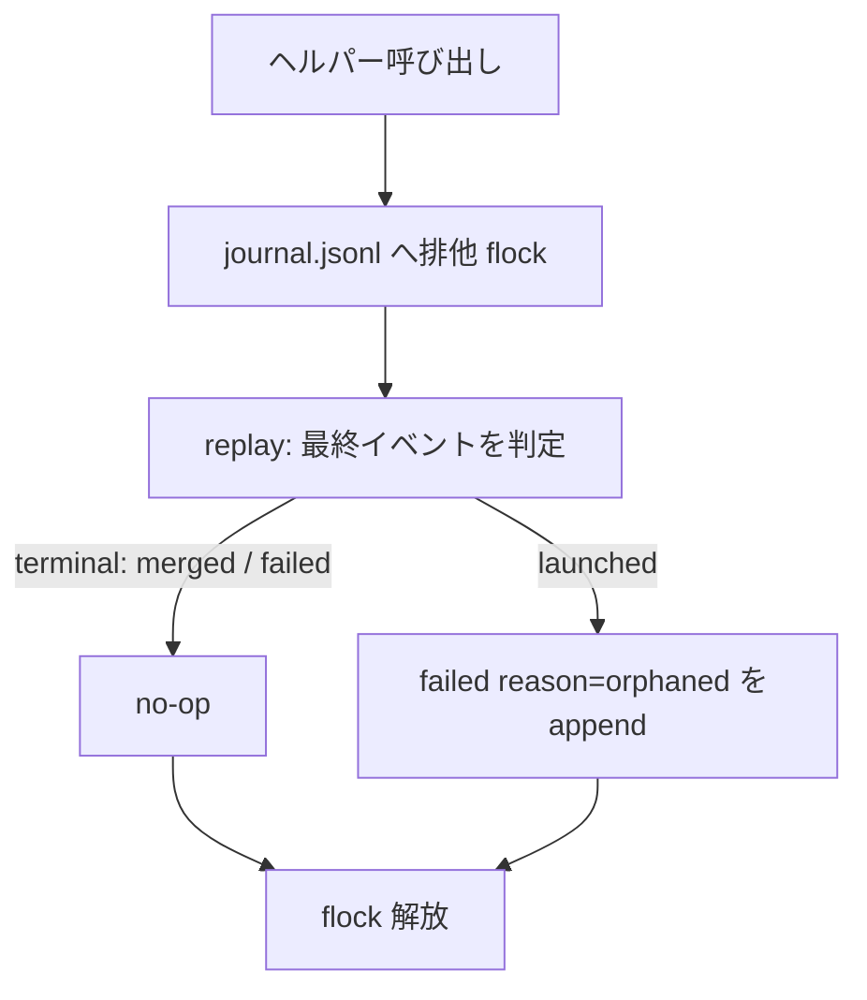

# orphaned-implementer-recovery - 要件定義書

## 1. 概要

### 1.1 背景

前セッションの消滅により、journal の最終イベントが `launched` のまま取り残された implementer（以下「孤児 launched」）が発生する。孤児 launched の task は in-flight のまま残り、route-back ゲートが block し、gate-rejected terminal で無人実行が停止する。

### 1.2 目的

孤児 launched を人手を介さずに実行可能な状態へ戻す。孤児 launched を既存の I.2.c failed 経路に合流させ、batch の `implement.failed-task` ポリシー（kept worktree + resume guard での 1 回 retry）が発動するようにする。二重起動防止の規律（`launched` を書き換えない）は維持したまま、セッション消滅が証明できる場合に限る例外として orchestrator の terminal イベント書き込みを許す。

### 1.3 スコープ

**対象**:

- `em-workflow/hooks/queue_agent_index.py` への `session_id` 記録（FR1）
- I.2.b reconcile における孤児 launched の検出と Residual への退化（FR2 / FR5 / FR6）
- `em-workflow/scripts/` に新設する journal 書き込みヘルパー（FR3）
- 下流合流（FR4）と後方互換（FR9）
- SSOT ドキュメント `em-workflow/references/implement-phase.md` / `em-workflow/references/workflow-schema.md` の更新（FR7 / FR8）
- `tests/` 配下の unittest（NFR4 / NFR5）

**デザインステップ**: 実施しない。UI 面が無く、変更対象は Markdown SSOT ドキュメント、Python hook、`em-workflow/scripts/` の新ヘルパー、`tests/` 配下の unittest のみで、視覚的成果物もデザインシステム候補も存在しない。

**スコープ外**（別タスクで起票）:

- implementer の fmt/テスト通過時点での WIP コミット運用
- failed の理由分類による develop 停止条件 3 の回避
- ディスパッチャ側の graceful shutdown

## 2. ビジネス要件

### 2.1 ビジネス目標

- 前セッションの消滅により journal 最終イベントが `launched` のまま取り残された implementer（孤児 launched）を、人手を介さずに実行可能な状態へ戻す。
- 孤児 launched を既存の I.2.c failed 経路に合流させ、batch の `implement.failed-task` ポリシー（kept worktree + resume guard での 1 回 retry）が発動するようにして、無人実行が route-back ゲート block → gate-rejected terminal で止まる経路を塞ぐ。
- 二重起動防止の規律（`launched` を書き換えない）を維持したまま、セッション消滅が証明できる場合に限る例外として orchestrator の terminal イベント書き込みを許す。

### 2.2 対象ユーザー

requirements_analysis に対象ユーザーの定義は含まれない。

### 2.3 期待される効果

- 孤児 launched による無人実行の停止（route-back ゲート block → gate-rejected terminal）が起きなくなる。
- 孤児 launched が既存の failed 経路に合流し、batch では retry 1 回、interactive では三択の提示が行われる。
- 二重起動防止の規律が維持される。

## 3. ユースケース

### 3.1 ユースケース一覧

| ID | ユースケース名 | アクター |
|----|----------------|----------|
| UC01 | 孤児 launched の自動回復 | orchestrator（I.2.b reconcile） |
| UC02 | 証明できない場合の Residual 維持 | orchestrator（I.2.b reconcile） |

### 3.2 ユースケース詳細

#### UC01: 孤児 launched の自動回復

**アクター**: orchestrator（I.2.b reconcile）

**事前条件**:

- journal の最終イベントが `launched`
- task worktree と task branch の両方が存在する
- Agent index 経由の live agent 解決が live なしを返す
- `agents.jsonl` に記録された `session_id` が現セッションの `session_id` と異なる
- そのセッションの transcript に現セッションの開始より新しい活動が無い

**基本フロー**:

1. reconcile が候補 task を検出する。
2. `agents.jsonl` の `session_id` と現セッションの `session_id` を比較する。
3. 記録 `session_id` の形式を検証し、`~/.claude/projects/{encoded-cwd}/{session_id}.jsonl` が `~/.claude/projects/` 配下に収まることを確認して transcript を読む。
4. 現セッションの開始より新しい活動が無いことを確認し、孤児 launched と判定する。
5. 新ヘルパー経由で journal に `failed`（reason `orphaned`）を追記する。
6. I.2.c が通常の failed として解釈し、batch では `implement.failed-task` の retry が 1 回発動、interactive では retry / route back to planning / abort の三択が提示される。

**代替フロー**:

- 最終イベントが既に terminal（`merged` / `failed`）の場合、ヘルパーは no-op とする。

**事後条件**:

- journal に reason `orphaned` の `failed` が 1 度だけ記録され、`queue_launch_guard.py` が同 task の再起動を許可する状態になる。

#### UC02: 証明できない場合の Residual 維持

**アクター**: orchestrator（I.2.b reconcile）

**事前条件**:

- 候補 task が検出されている

**基本フロー**:

1. `session_id` が記録されていない、記録 `session_id` が現セッションと同一、またはセッション終端を transcript から確認できない、のいずれかに該当する。
2. journal を書かない。

**事後条件**:

- 従来どおりの Residual 挙動（journal 不変、task は in-flight のまま、route-back ゲート block、gate-rejected terminal、report での task 名指し）が維持される。

## 4. 機能要件

### 4.1 機能一覧

| ID | 機能名 | 説明 |
|----|--------|------|
| FR1 | launch 時の session_id 記録 | `agents.jsonl` エントリに orchestrator の `session_id` を独立フィールドとして記録する |
| FR2 | 孤児 launched の検出条件 | I.2.b reconcile で session identity と transcript 証拠から孤児 launched を判定する |
| FR3 | journal への failed(reason: orphaned) 書き込みヘルパー | `em-workflow/scripts/` の新ヘルパーが排他下で `failed` を追記する |
| FR4 | orphaned failed の下流合流 | reason `orphaned` の `failed` を I.2.c の通常 failed として扱う |
| FR5 | 条件を満たさない場合の Residual 退化 | 証明できない場合は journal を書かず従来の Residual を維持する |
| FR6 | session_id の形式検証と transcript パスの封じ込め | 記録 `session_id` を検証し transcript パスを `~/.claude/projects/` 配下に封じ込める |
| FR7 | SSOT ドキュメントの更新 | implement-phase.md / workflow-schema.md を新しい例外を含む形へ更新する |
| FR8 | agents.jsonl の権限範囲の明記 | orphan recovery の session identity 参照を唯一の例外として SSOT に明記する |
| FR9 | 後方互換 | journal イベントと既存 `agents.jsonl` エントリの互換を保つ |

### 4.2 機能詳細

#### FR1: launch 時の session_id 記録

**説明**: `queue_agent_index.py` が `agents.jsonl` へ 1 エントリを追記する際、そのエントリに orchestrator の `session_id` を独立フィールドとして記録する。`session_id` は `agent_ids` 候補リストには入れない。現在の entry は {agent_id, agent_ids, task, worktree_path, at} のみで、hook 入力が持つ `session_id` を読んでいない。

**入力**: hook 入力 JSON の `session_id`

**出力**: `agents.jsonl` エントリの独立フィールド `session_id`

**ビジネスルール**:

- `session_id` を `agent_ids` 候補リストに入れない。

#### FR2: 孤児 launched の検出条件

**説明**: I.2.b の reconcile において、候補 task（journal 最終イベントが `launched` かつ task worktree と task branch の両方が存在し、Agent index 経由の live agent 解決が live なしを返す）について、`agents.jsonl` に記録された `session_id` が現セッションの `session_id` と異なり、かつそのセッションの transcript に現セッションの開始より新しい活動が無いことを確認できたとき、その task を孤児 launched と判定する。

**判定条件**:

| 項目 | 条件 |
|------|------|
| journal 最終イベント | `launched` |
| task worktree / task branch | 両方が存在する |
| Agent index 経由の live agent 解決 | live なしを返す |
| 記録 `session_id` | 現セッションの `session_id` と異なる |
| 記録セッションの transcript | 現セッションの開始より新しい活動が無い |

#### FR3: journal への failed(reason: orphaned) 書き込みヘルパー

**説明**: 孤児 launched と判定した task について、`em-workflow/scripts/` に新設するヘルパー経由で journal に `failed` イベントを reason `orphaned` 付きで追記する。ヘルパーは `merge-task.sh` と同じ journal.jsonl への排他 flock を取り、replay-then-append を 1 クリティカルセクション内で行い、最終イベントが terminal（`merged` / `failed`）なら no-op とする。単体テスト可能な形にする。

**処理フロー**:

**ビジネスルール**:

- flock の取得から replay と append までを 1 クリティカルセクション内で行う。
- 最終イベントが terminal なら書き込まない（冪等）。

#### FR4: orphaned failed の下流合流

**説明**: reason `orphaned` の `failed` は I.2.c の通常の failed 扱いとして解釈される。batch では `implement.failed-task` ポリシーにより kept worktree + I.2.a resume guard で 1 回だけ retry が発動し、interactive では retry / route back to planning / abort の三択が提示される。`queue_launch_guard.py` は最終イベントが `failed` の task の再起動を既に許可しているため、retry launch は launch guard を通る。

#### FR5: 条件を満たさない場合の Residual 退化

**説明**: `session_id` が記録されていない、記録 `session_id` が現セッションと同一、またはセッション終端を transcript から確認できない、のいずれかの場合は journal を書かず、従来どおりの Residual 挙動（journal 不変、task は in-flight のまま、route-back ゲート block、gate-rejected terminal、report での task 名指し）を維持する。

**エラーケース**:

| 条件 | 対応 |
|------|------|
| `session_id` が記録されていない | journal を書かず Residual |
| 記録 `session_id` が現セッションと同一 | journal を書かず Residual |
| セッション終端を transcript から確認できない | journal を書かず Residual |

#### FR6: session_id の形式検証と transcript パスの封じ込め

**説明**: `agents.jsonl` から読んだ `session_id` は比較値と transcript パスのファイル名要素にのみ使う。パスへ補間する前に形式検証を通し、組み立てた transcript パス（`~/.claude/projects/{encoded-cwd}/{session_id}.jsonl`）が `~/.claude/projects/` 配下に収まることを確認してから読む。

**バリデーション**:

| 項目 | ルール |
|------|--------|
| `session_id` | パスへ補間する前に形式検証を通す |
| transcript パス | `~/.claude/projects/` 配下に収まることを確認してから読む |

#### FR7: SSOT ドキュメントの更新

**説明**: `em-workflow/references/implement-phase.md` の I.2.b Recovery / Residual 規定と「Supporting cast: journal, hooks, resume」の journal 書き込み規則（現在「The orchestrator NEVER writes it」）、および `em-workflow/references/workflow-schema.md` の journal イベント定義と writer set（現在「No other hook, and never the orchestrator, appends to journal.jsonl」）を、新しい例外を含む形へ更新する。

#### FR8: agents.jsonl の権限範囲の明記

**説明**: `agents.jsonl` を task status のソースにしないという既存の不変条件は維持したうえで、I.2.b の orphan recovery が参照する session identity のみを例外として SSOT（implement-phase.md の Agent index writer バレットおよび workflow-schema.md の agents.jsonl 段落）に明記する。

#### FR9: 後方互換

**説明**: journal イベントの後方互換を保つ。`session_id` フィールドを持たない既存の `agents.jsonl` エントリは従来の Residual 経路をたどり、`queue_taskstop_net.py` の既存マッチング（`agent_ids` 候補リスト / `AGENT_ID_KEYS` フォールバック / `MAX_AGENT_IDS_LEN` キャップ / containment チェック）は新フィールドの追加によって挙動を変えない。

## 5. 非機能要件

### 5.1 NFR1: 二重起動防止規律の維持

`launched` を書き換えないという規律は維持する。セッション消滅が証明できたときにのみ terminal イベント追記の例外を適用し、証明できないケースは常に Residual 側へ倒す（fail-safe 方向）。

### 5.2 NFR2: journal 追記の排他規律

journal への追記は既存 writer（merge-task.sh / queue_launch_guard.py / queue_failure_net.py / queue_taskstop_net.py）と同じ規律に従う: journal ファイル自体への排他 flock、replay と append を 1 クリティカルセクションで行う compare-and-append、O_NOFOLLOW 相当のシンボリックリンク拒否、ディレクトリを新規作成しないこと。

### 5.3 NFR3: hook の fail-open 規律の維持

`queue_agent_index.py` への `session_id` 追加は fail-open 規律を崩さない。`session_id` が取得できない・不正な場合も既存の追記は成功し、hook は常に exit 0 を返す。

### 5.4 NFR4: テストの依存制約

テストコードは Python 標準ライブラリ（unittest, Python 3.14）のみを使い、サードパーティパッケージを import しない（test/README.md）。実 develop 実行は検証手段として要求しない。

### 5.5 NFR5: テスト配置と命名

新規テストはリポジトリルート `tests/` に `test_*.py` として置き、`python3 -m unittest discover -s tests` で自動収集される。hook はサブプロセス起動 + stdin JSON、シェルスクリプトは tempfile 上の使い捨て git リポジトリで検証する（test/README.md）。実 `~/.claude` 状態には触れない。

### 5.6 NFR6: プラグイン version bump

em-workflow/ 配下を変更するため、同じ変更の中で `em-workflow/.claude-plugin/plugin.json` と `.claude-plugin/marketplace.json` の該当エントリの `version` を同じ値へ上げる（.claude/rules/core-plugin-version-bump.md）。

### 5.7 NFR7: SSOT の重複禁止規律

implement-phase.md / workflow-schema.md の更新は既存の cite-not-restate 規律に従う。所有者となるセクションを 1 つ決め、他所からは引用のみとする。

### 5.8 指定の無い非機能要件

パフォーマンス要件、可用性要件、ブラウザサポート要件は requirements_analysis に指定が無い。

## 6. UI/UX要件

該当なし。UI 面が無く、視覚的成果物もデザインシステム候補も存在しないため、デザインステップは実施しない。

## 7. データ要件

### 7.1 データ項目

| 対象 | 項目名 | 説明 |
|------|--------|------|
| `agents.jsonl` エントリ | `agent_id` | 既存フィールド |
| `agents.jsonl` エントリ | `agent_ids` | 既存フィールド（候補リスト。`session_id` を入れない） |
| `agents.jsonl` エントリ | `task` | 既存フィールド |
| `agents.jsonl` エントリ | `worktree_path` | 既存フィールド |
| `agents.jsonl` エントリ | `at` | 既存フィールド |
| `agents.jsonl` エントリ | `session_id` | FR1 で追加する独立フィールド。orchestrator の session_id |
| journal イベント | `failed` の reason `orphaned` | FR3 で追加する reason |

### 7.2 データの権限範囲

`agents.jsonl` を task status のソースにしない不変条件は維持する。唯一の例外は I.2.b の orphan recovery が参照する session identity（FR8）。

## 8. 外部連携

該当なし。参照する外部ファイルは Claude Code の transcript（`~/.claude/projects/{encoded-cwd}/{session_id}.jsonl`）の読み取りのみで、これは FR2 / FR6 に含まれる。

## 9. 制約条件

### 9.1 技術的制約

- journal 追記は既存 writer と同じ排他規律に従う（NFR2）。
- `queue_agent_index.py` の fail-open 規律を崩さない（NFR3）。
- テストは Python 標準ライブラリのみを使う（NFR4）。
- テストは `tests/` に `test_*.py` として置き、実 `~/.claude` 状態には触れない（NFR5）。
- SSOT 更新は cite-not-restate 規律に従う（NFR7）。
- transcript の配置は `~/.claude/projects/{encoded-cwd}/{session_id}.jsonl` である。encoded-cwd の符号化規則の確定は create-plan / 実装段の詳細とする。

### 9.2 ビジネス上の制約

- feature 名は `orphaned-implementer-recovery` に固定。既存ブランチ `em-workflow/orphaned-implementer-recovery/integration` と worktree を再開し、新しい feature 名は作らない。
- em-workflow/ 配下の変更に伴い、同じ変更の中で version を上げる（NFR6）。

### 9.3 スケジュール制約

指定なし。

### 9.4 宣言された変更集合

このフィーチャー固有のパスは手動で列挙せず、create-plan で `workflow.yaml` の各タスクの `files` から導出する（`references/phases/create-plan-phase.md`）。

**デフォルトメンバー**（SPEC作成者が明示的に除外しない限り、常に宣言に含まれる）:

- `feature-docs/orphaned-implementer-recovery/**`
- `test-docs/orphaned-implementer-recovery/**`

`feature-docs/orphaned-implementer-recovery/**` に含まれるもの: `REQUIREMENTS.md`、`SPEC.md`、`IMPLEMENTATION.md`、`workflow.yaml`、`phase-state/`、`tasks/`、`reviews/roundN.yaml`、`VERIFICATION.md`、`retrospect.yaml`、およびデザインステップが生成するデザイン成果物。生成主体は各フェーズドキュメントおよび `references/phase-state.md` を参照（引用のみ、ルールは再掲しない）。

`test-docs/orphaned-implementer-recovery/**` に含まれるもの: `{T}.tests.yaml`（パス形式: `test-docs/orphaned-implementer-recovery/{T}.tests.yaml`）。生成主体は `implement-phase.md` を参照（引用のみ、ルールは再掲しない）。

**意味論**:

- デフォルトのメンバーは、SPEC作成者が明示的に除外しない限り宣言に含まれる。除外は意図的な絞り込みであり、記載漏れによる省略ではない。
- この宣言はスーパーセット（superset）の主張であり、実際の変更集合は宣言に含まれる（CONTAINED IN）必要がある。実際には生成されないパスが宣言されていても違反にはならない。implementタスクを1つも生成しないフィーチャーは `test-docs/orphaned-implementer-recovery/` ディレクトリを生成しないが、宣言された `test-docs/orphaned-implementer-recovery/**` は依然として正しい。

## 10. 想定される課題とリスク

### 10.1 技術的課題

| 課題 | 対応策 |
|------|--------|
| encoded-cwd の符号化規則が未確定 | create-plan / 実装段の詳細として確定する |
| 「現セッションの開始より新しい活動が無い」の判定に使う現セッション開始時刻の取得元が未確定（現セッション transcript の先頭エントリ、hook 入力、reconcile 実行時刻のいずれか） | create-plan で確定する。要件としては『現セッション開始より新しい活動が無いこと』を証明条件とする点のみが確定している |
| 新ヘルパーの実装言語が未確定 | 単体テスト可能であることと merge-task.sh と同じ flock / replay-then-append 規律に従うことのみが制約で、言語選択は create-plan の裁量とする |
| orchestrator が新ヘルパーを Bash 経由で呼ぶ場合の command-execution-protocol.md の承認ゲート（bash_guard.py）の扱い | create-plan で確認する。ワークフロー自身のスクリプト呼び出しであり workflow.yaml 由来のコマンド文字列ではない点が判断材料になる |

### 10.2 ビジネスリスク

requirements_analysis にビジネスリスクの記載は無い。

## 11. 成功基準

### 11.1 受け入れ基準

- [ ] AC-1: launch 時に `agents.jsonl` へ orchestrator の `session_id` が独立フィールドとして記録される（`agent_ids` には含まれない）。
- [ ] AC-2: I.2.b の reconcile で、候補 task（`launched` + worktree と branch あり + Agent index に live なし）の記録 `session_id` が現セッションと異なり、かつそのセッションの transcript（`~/.claude/projects/{encoded-cwd}/{session_id}.jsonl`）に現セッションの開始より新しい活動が無いと確認できたとき、journal に `failed` が reason `orphaned` 付きで記録される。
- [ ] AC-3: `orphaned` な `failed` は I.2.c の通常の failed 扱いになり、batch では `implement.failed-task` の retry 1 回（kept worktree、resume guard）が発動する。interactive では retry / route-back / abort の三択が出る。
- [ ] AC-4: `session_id` が無い、同一セッション、終端を確認できない、のいずれかの場合は従来どおり Residual（journal 不変、gate-rejected terminal）が維持される。
- [ ] AC-5: `em-workflow/references/implement-phase.md` の I.2.b Recovery / Residual と「Supporting cast」の journal 書き込み規則、`em-workflow/references/workflow-schema.md` の journal イベント定義が更新されている。
- [ ] AC-6: unittest の fixture（journal.jsonl / agents.jsonl / task worktree と branch / transcript）で `launched` のまま agent が消えた状態を再現し、`failed`（reason `orphaned`）が 1 回だけ書かれること、条件を満たさない場合に Residual へ退化すること、`failed` 後の launch が launch guard で許可されることが確認できる。実 develop 実行は要求しない。

### 11.2 KPI

requirements_analysis に KPI の指定は無い。

## 12. テストシナリオ

### 12.1 テスト観点

- [ ] TS-1（正常系）: journal 最終イベントが `launched`、task worktree と branch が存在、`agents.jsonl` の `session_id` が現セッションと異なり、その transcript に現セッション開始以降の活動が無い fixture で、journal に reason `orphaned` の `failed` がちょうど 1 行だけ追記される。
- [ ] TS-2（冪等性）: 同じ状態でヘルパーを 2 回呼んでも `failed` は 1 行のまま（最終イベントが terminal なら no-op）。
- [ ] TS-3（異常系 / Residual への退化）: (a) `agents.jsonl` エントリに `session_id` が無い、(b) 記録 `session_id` が現セッションと同一、(c) transcript が読めない/現セッション開始より新しい活動がある、の 3 ケースで journal が不変であること。
- [ ] TS-4（下流合流）: `failed`（reason `orphaned`）記録後の同 task の launch が `queue_launch_guard.py` により許可され、`launched` が追記される（deny されない）。
- [ ] TS-5（セキュリティ / パス封じ込め）: 不正な形式の `session_id`（パス区切り・`..`・空文字など）を持つ `agents.jsonl` エントリで、`~/.claude/projects/` 配下の外を読もうとせず、journal も書かずに Residual へ倒れる。
- [ ] TS-6（後方互換）: `session_id` を持たない既存 `agents.jsonl` エントリに対し、`queue_taskstop_net.py` の解決挙動（マッチ / 曖昧性拒否 / staleness / containment）が変わらない。

## 13. 用語定義

| 用語 | 定義 |
|------|------|
| 孤児 launched | 前セッションの消滅により journal 最終イベントが `launched` のまま取り残された implementer |
| Residual | journal 不変、task は in-flight のまま、route-back ゲート block、gate-rejected terminal、report での task 名指し、という従来の挙動 |
| Recovery | I.2.b step 1 における stale-`launched` の回復規定 |
| terminal イベント | journal の `merged` / `failed` |
| Agent index | `agents.jsonl`。task status のソースにはしない |

## 14. 確認事項

### 14.1 確認済み事項

- [x] Claude Code の hook 入力 JSON は `session_id` と `transcript_path` を含む。既存テスト fixture（tests/test_queue_taskstop_net.py の hook payload、`"session_id": "sess-1"` / `"transcript_path"`）がこの前提を裏づけており、`queue_agent_index.py` は現状これを読み捨てている。
- [x] transcript の配置は `~/.claude/projects/{encoded-cwd}/{session_id}.jsonl` である（task description による）。
- [x] feature 名は `orphaned-implementer-recovery` に固定。既存ブランチ `em-workflow/orphaned-implementer-recovery/integration` と worktree を再開し、新しい feature 名は作らない。
- [x] スコープ外（別タスクで起票）: implementer の fmt/テスト通過時点での WIP コミット運用、failed の理由分類による develop 停止条件 3 の回避、ディスパッチャ側の graceful shutdown。

### 14.2 未確認・保留事項

- [ ] encoded-cwd の符号化規則の確定は create-plan / 実装段の詳細とする。
- [ ] 「現セッションの開始より新しい活動が無い」の判定に使う現セッション開始時刻の取得元（現セッション transcript の先頭エントリ、hook 入力、reconcile 実行時刻のいずれか）は create-plan で確定する実装詳細とする。要件としては『現セッション開始より新しい活動が無いこと』を証明条件とする点のみが確定している。
- [ ] 新ヘルパーの実装言語は未確定。リポジトリには bash（em-workflow/scripts/merge-task.sh）と python3（em-workflow/scripts/validate-worker-output.py、ただし PyYAML 依存）の双方の前例がある。単体テスト可能であることと merge-task.sh と同じ flock / replay-then-append 規律に従うことのみが制約で、言語選択は create-plan の裁量とする。
- [ ] orchestrator が新ヘルパーを Bash 経由で呼ぶ場合、command-execution-protocol.md の承認ゲート（bash_guard.py）の扱いが必要かどうかは create-plan で確認する。ワークフロー自身のスクリプト呼び出しであり workflow.yaml 由来のコマンド文字列ではない点が判断材料になる。

## 15. 参考資料

- `em-workflow/references/implement-phase.md`: I.2.b Recovery / Residual 規定、Supporting cast の journal 書き込み規則、Agent index writer バレット（FR7 / FR8 の更新対象）
- `em-workflow/references/workflow-schema.md`: journal イベント定義と writer set、`agents.jsonl` 段落（FR7 / FR8 の更新対象）
- `em-workflow/hooks/queue_agent_index.py`: FR1 の変更対象
- `em-workflow/hooks/queue_taskstop_net.py`: FR9 の後方互換確認対象
- `em-workflow/hooks/queue_launch_guard.py`: FR4 の retry launch が通る launch guard
- `em-workflow/scripts/merge-task.sh`: FR3 のヘルパーが従う flock / replay-then-append 規律の前例
- `test/README.md`: NFR4 / NFR5 のテスト規約
- `.claude/rules/core-plugin-version-bump.md`: NFR6 の version bump 規約
- `em-workflow/references/command-execution-protocol.md`: 新ヘルパーの Bash 呼び出し時に確認する承認ゲート
