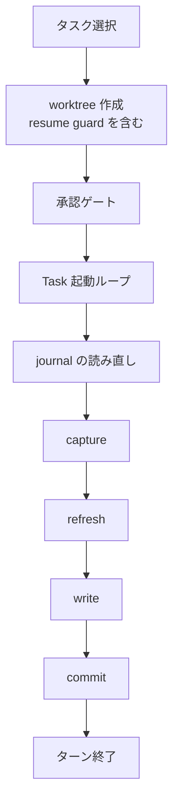
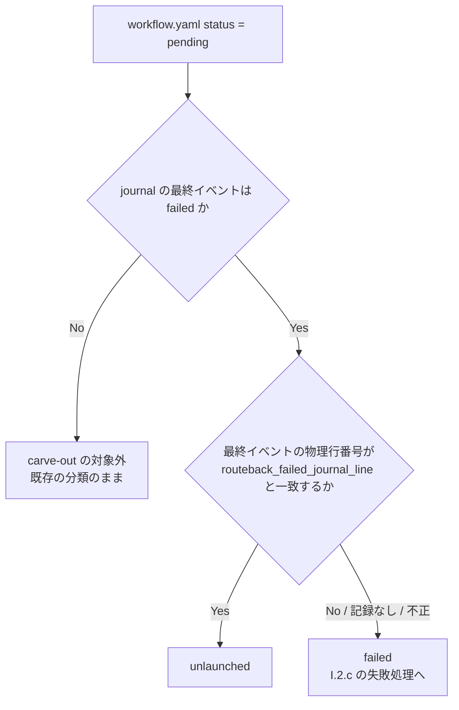

# prelaunch-inprogress-routeback - 要件定義書

## 1. 概要

### 1.1 背景

`em-workflow/references/implement-phase.md` の Step I.2.a は、この entry で選択したすべてのタスクの `in_progress` を 1 つの write set にまとめ、承認ゲートと `Task()` 起動ループより前に 1 回でコミットしていた。両者の間で中断すると、journal に launched イベントが無いまま `in_progress` がブランチにコミット済みで残り、Step I.2.c の route-back を恒久的にブロックしていた。この問題は task0001 / task0002（FR1〜FR5）で直し、マージ済みである。

その後、指摘 197991d271fd0f74 で次の問題が見つかった。workflow.yaml の `status: pending` と journal 最終イベント `failed` の組み合わせは、I.2.c の route-back のリセットのほかに、起動したタスクが launch-state commit に届かずに失敗した場合（中断、2 回目の exit 4 の後）にも生じる。現行の recycled-task-id carve-out は pending + failed をすべて unlaunched とみなすため、起動後に失敗したタスクが、I.2.c のユーザー判断（batch では `implement.failed-task` ポリシー）を経ずに自動で再起動される。

### 1.2 目的

- 起動前に中断したタスクの in_progress 残骸が、Step I.2.c の route-back を恒久的にブロックしないこと（維持）
- 起動後に失敗したタスクが、I.2.c のユーザー判断（batch では implement.failed-task ポリシー）を経ずに自動で再起動されないこと（指摘 197991d271fd0f74）
- route-back でリセットしたタスクだけが再起動の対象になり、その判定がオーケストレーターと queue_stop_guard.py で一致すること
- 再発を検出するテストがあること

### 1.3 スコープ

**対象**:
- `em-workflow/references/implement-phase.md`（Step I.2.a、I.2.b step 1、I.2.c の route-back write set、Supporting cast の Stop-hook 箇条）
- `em-workflow/hooks/queue_stop_guard.py`
- `em-workflow/references/workflow-schema.md`
- `em-workflow/references/workflow-patch.md`
- `em-workflow/scripts/validate-worker-output.py`
- `tests/` 配下のテスト
- 必要な場合は `em-workflow/references/fixtures/workflow-patch/` 配下の fixture

**対象外**:
- queue_launch_guard.py、queue_failure_net.py、queue_taskstop_net.py、merge-task.sh、journal-append-failed.py の挙動（NFR2）
- journal の形式と書き手（NFR2）
- workflow-patch.md の preserve の許可項目（NFR2、FR12）
- queue_launch_guard を fail-closed にすること（launched の記録に失敗したら起動を拒否する）。別タスクに起票する
- Step I.2.c のゲートへの除外規定（選択肢 a: routeback_gate_carve_out）。採用しなかった
- I.1 / I.2.b / I.2.c の他の呼び出し箇所の capture 方式の移行（既存の Idiom split 記述が別件として扱っているもの）
- このフィーチャーより前に残った in_progress の残骸と、記録を持たないアップグレード前の route-back 済みタスクの修復（A4）

## 2. ビジネス要件

### 2.1 ビジネス目標

- 起動前に中断したタスクの in_progress 残骸が、Step I.2.c の route-back を恒久的にブロックしないこと（維持）
- 起動後に失敗したタスクが、I.2.c のユーザー判断（batch では implement.failed-task ポリシー）を経ずに自動で再起動されないこと（指摘 197991d271fd0f74）
- route-back でリセットしたタスクだけが再起動の対象になり、その判定がオーケストレーターと queue_stop_guard.py で一致すること
- 再発を検出するテストがあること

### 2.2 対象ユーザー

該当なし

### 2.3 期待される効果

- 1.2 の目的と同じ

## 3. ユースケース

### 3.1 ユースケース一覧

| ID | ユースケース名 | アクター | 優先度 |
|----|----------------|----------|--------|
| UC01 | Step I.2.a の 1 entry を実行する | em-workflow オーケストレーター | - |
| UC02 | Step I.2.c で route-back する | em-workflow オーケストレーター | - |
| UC03 | Stop 時に未起動タスクの有無を判定する | queue_stop_guard.py | - |

### 3.2 ユースケース詳細

#### UC01: Step I.2.a の 1 entry を実行する

**アクター**: em-workflow オーケストレーター

**事前条件**:
- implement フェーズの Step I.2.a に入っている（refill の再入を含む）

**基本フロー**:
1. タスクを選択する（carve-out の 3 条件を満たす pending + failed だけを unlaunched とみなす。FR8）
2. worktree を作成する（resume guard を含む）
3. `project_commands` の承認ゲートを通す
4. `Task()` 起動ループを回す
5. journal を読み直す
6. capture する（`LAUNCH_TIP`）
7. refresh する（ブランチ名 `em-workflow/{feature}/integration`）
8. write set を書く（最終イベントが launched のタスクに `in_progress`、FR7 の条件を満たすタスクに `failed`）
9. commit する（`commit-docs.sh` の第 3 引数は `"$LAUNCH_TIP"`）
10. ターンを終える

**代替フロー**:
- 一部だけ起動できた: 起動を確認できたタスクと FR7 で failed を書くタスクで 1 つの write set・1 回のコミットにする。起動を確認できなかったタスクは pending のまま残す（FR2）
- 起動後すでに失敗した: 選択時より後に launched が追記され、読み直した journal の最終イベントが failed のタスクには、同じコミットで `failed` と `branch` を書く（FR7）
- write set が空: write とコミットを省略してターンを終える（FR3）
- exit 4: journal を読み直し、同じ規則で write set を作り直して再試行する。2 回目の exit 4 で停止する（FR4）

**事後条件**:
- workflow.yaml で `in_progress` になっているのは、journal で起動を確認できたタスクだけである
- 起動後すでに失敗したタスクは workflow.yaml で `failed` になっている
- `tasks.{T}.routeback_failed_journal_line` はこの entry で変わらない

#### UC02: Step I.2.c で route-back する

**アクター**: em-workflow オーケストレーター

**事前条件**:
- I.2.c の route-back ゲートを通過している（ゲートの文言は変えない。NFR1）

**基本フロー**:
1. ゲート判定とリセット集合の決定に使う journal を replay する
2. リセット対象の各タスクについて、その replay で求めた最終 failed イベントの物理行番号を求める
3. route-back write set に `tasks.{T}.routeback_failed_journal_line` を加える
4. 既存の route-back コミット（`"docs({feature}): implement route back to planning"`）で一緒に確定する

**代替フロー**:
- journal にそのタスクのイベントが無い: 記録を書かない（null のまま）（FR8、A2）
- 同じタスクを次の route-back で再びリセットした: 新しい行番号で上書きする（FR11）

**事後条件**:
- リセット対象のうち journal にイベントを持つタスクは、記録を持つ

#### UC03: Stop 時に未起動タスクの有無を判定する

**アクター**: queue_stop_guard.py

**事前条件**:
- Stop フックとして呼ばれている

**基本フロー**:
1. journal を読み、各タスクについて最終イベントとその 1 始まりの物理行番号を持つ
2. workflow.yaml の各タスクのブロックから status と `routeback_failed_journal_line` を読む
3. pending + failed のタスクを FR8 の 3 条件で分類する
4. 条件を満たすものは unlaunched として exit 2（BLOCK）にする

**代替フロー**:
- 記録が無い・null・不正値・行番号が一致しない pending + failed: failed とし、そのフィーチャーではブロックしない（exit 0）
- 想定外の状態: exit 0（fail-open）

**事後条件**:
- 判定がオーケストレーターの I.2.a / I.2.b step 1 の分類と一致する

## 4. 機能要件

### 4.1 機能一覧

| ID | 機能名 | 説明 | 状態 |
|----|--------|------|------|
| FR1 | I.2.a の launch-state 書き込みを承認ゲートと起動ループの後ろへ移す | 変更なし（task0001 でマージ済み） | confirmed |
| FR2 | 起動を確認できたタスクを in_progress としてコミットする | 読み直した journal の最終イベントが launched のタスクに限って in_progress を書く | confirmed |
| FR3 | write set が空ならコミットを省略し、ターンはコミット処理の後に終える | in_progress も failed も 0 件なら write とコミットを省略する | confirmed |
| FR4 | コミット時と exit 4 再試行時に journal を読み直し、終端タスクを in_progress にしない | write set を作る直前に最新の journal を読み直す | confirmed |
| FR5 | pending と launched の組み合わせについての文を事実に合わせる | task0002 の文を維持し、pending + failed への言及を加える | confirmed |
| FR6 | 再発検出テストの追加と、古い文を固定しているテストの修正 | FR7〜FR13 を検査するテストを追加し、既存テストを追従させる | confirmed |
| FR7 | launch-state commit で、起動後すでに失敗したタスクを failed として記録する | 選択後に launched が追記され最終 failed のタスクに failed を書く | confirmed |
| FR8 | recycled-task-id carve-out を、route-back の記録と一致する場合に限る | 3 条件がすべて成り立つときだけ unlaunched とみなす | confirmed |
| FR9 | queue_stop_guard.py の分類を FR8 に揃える | evaluate_feature の pending + failed 分岐を 3 条件にする | confirmed |
| FR10 | I.2.a の根拠文を事実に合わせて直す | 『pending + failed は I.2.c 自身のリセットからしか生じない』を直す | confirmed |
| FR11 | workflow-schema.md に tasks.{T}.routeback_failed_journal_line を定義する | 任意項目として意味・値・書き手・読み手を定義する | confirmed |
| FR12 | re-planning の replace_all で記録を引き継ぐ | verbatim でコピーする項目一覧に記録を加える | confirmed |
| FR13 | ワーカーの tasks_patch による記録の設定を validate-worker-output.py で拒否する | entry が記録のキーを持つ場合はエラーにする | confirmed |

### 4.2 機能詳細

#### FR1: I.2.a の launch-state 書き込みを承認ゲートと起動ループの後ろへ移す

**説明**: 変更なし（task0001 でマージ済み）。流れは、タスク選択、worktree 作成（resume guard を含む）、承認ゲート、Task() 起動ループ、journal の読み直し、capture、refresh、write、commit、ターン終了の順。

**処理フロー**:

**ビジネスルール**:
- 4 段（capture→refresh→write→commit）の相対順序は変えない
- refresh の対象がブランチ名 `em-workflow/{feature}/integration` であることは変えない
- commit-docs.sh の第 3 引数が `"$LAUNCH_TIP"` であることは変えない
- entry ごとに 1 回であることは変えない
- `$RECONCILE_TIP` を再利用しないことは変えない

#### FR2: 起動を確認できたタスクを in_progress としてコミットする

**説明**: in_progress を書くのは、この entry で選択し、読み直した journal の最終イベントが launched のタスクに限る。

**ビジネスルール**:
- 起動を確認できなかったタスク（承認ゲートで止まった、起動ガードに拒否された、Task() を発行していない）は書かず、pending のまま残す
- FR7 で failed を書くタスクも、同じ write set・同じ 1 回の launch-state commit に入れる
- コミットメッセージには write set のタスクを全部並べる

#### FR3: write set が空ならコミットを省略し、ターンはコミット処理の後に終える

**説明**: in_progress を書くタスクも FR7 で failed を書くタスクも 0 件なら、write とコミットを省略する。ターンは launch-state commit、またはその省略の後に終える。

**ビジネスルール**:
- --batch のマーカー行規則は変えない

#### FR4: コミット時と exit 4 再試行時に journal を読み直し、終端タスクを in_progress にしない

**説明**: 通常のコミットでも exit 4 の再試行でも、write set を作る直前に最新の journal を読み直す。終端（merged / failed）のタスクには in_progress を書かない。

**ビジネスルール**:
- 最終イベントが merged のタスクは書かず、I.2.b に任せる
- 最終イベントが failed のタスクは FR7 に従う
- 再試行でも同じ規則で write set を作り直す

**エラーケース**:

| エラー | 条件 | 対応 |
|--------|------|------|
| exit 4（1 回目） | commit-docs.sh が exit 4 を返す | journal を読み直し、同じ規則で write set を作り直して再試行する |
| exit 4（2 回目） | 再試行でも commit-docs.sh が exit 4 を返す | 停止する。起動記録と worktree・branch は保持する。停止レポートにはコール箇所と対象タスクを書く |

#### FR5: pending と launched の組み合わせについての文を事実に合わせる

**説明**: task0002 で書き直した文は維持する。その組み合わせは、起動から launch-state commit までの間と、コミットに届かなかった場合（中断、2 回目の exit 4）に生じ、in-flight 規則で扱われる。

**ビジネスルール**:
- 次を書き加える: コミットに届かなかったタスクが後で失敗すると pending + failed になる。その failed イベントは route-back の記録（FR11）と一致しないので、FR8 の carve-out は適用されず、failed として扱う
- launched の in-flight 文と recursion invariant 文は残す

#### FR6: 再発検出テストの追加と、古い文を固定しているテストの修正

**説明**: FR1〜FR5 のテスト（task0001 / task0002 でマージ済み）に加え、FR7〜FR13 を検査するテストを tests/ に追加する。

**ビジネスルール**:
- 追加するテストの内訳は次のとおり
  - implement-phase.md の文面検査（FR7・FR8・FR10、I.2.c の記録追加）
  - queue_stop_guard.py をサブプロセスで呼ぶ判定ケース（FR9）
  - workflow-schema.md の項目定義（FR11）
  - workflow-patch.md の引き継ぎ項目一覧と、apply_patch が記録を保持すること（FR12）
  - validate-worker-output.py がワーカーによる記録の設定を拒否すること（FR13）
- 既存テストのうち、変更した文面・分類・引き継ぎ項目一覧を固定しているものは追従させる（tests/test_queue_stop_guard.py の recycled-task-id fixture、tests/test_replanning_carry_over.py の CARRIED_RECORD_FIELDS と完全な記録の fixture など）
- 新しい文面 matcher には、変更前の文面に対する negative proof と non-vacuity guard を付ける

#### FR7: launch-state commit で、起動後すでに失敗したタスクを failed として記録する

**説明**: この entry で選択したタスクのうち、選択時に replay した journal より後に launched が追記され、かつ読み直した journal の最終イベントが failed のタスクには、同じ launch-state commit で `tasks.{T}.status = failed` と `tasks.{T}.branch` を書く。in_progress は書かない。

**ビジネスルール**:
- 選択時より後に launched が追記されていないタスクは書かない（例: 選択時点ですでに pending + failed で、今回は起動に至らなかったタスク）
- exit 4 の再試行でも同じ規則で write set を作り直す
- `tasks.{T}.routeback_failed_journal_line` はこの書き込みで変えない（FR11）

#### FR8: recycled-task-id carve-out を、route-back の記録と一致する場合に限る

**説明**: route-back のリセットで生じた pending + failed だけを unlaunched とみなし、それ以外の pending + failed は failed として I.2.c の失敗処理に回す。

**処理フロー**:

**ビジネスルール**:
- (1) 記録の書き込み
  - I.2.c の route-back write set に、リセット対象の各タスクについて `tasks.{T}.routeback_failed_journal_line` を加え、既存の route-back コミット（`"docs({feature}): implement route back to planning"`）で一緒に確定する
  - 値は、ゲート判定とリセット集合の決定に使ったのと同じ journal の replay で求めた、そのタスクの最終 failed イベントの物理行番号（FR11 の定義）
  - journal にそのタスクのイベントが無いタスクには記録を書かない（null のまま。イベントの無い pending タスクは、もともと carve-out なしで unlaunched になる）
- (2) carve-out の条件
  - 次の 3 つがすべて成り立つときだけ、unlaunched とみなす
    - workflow.yaml の status が pending
    - journal の最終イベントが failed
    - その最終イベントの物理行番号が `tasks.{T}.routeback_failed_journal_line` と一致する
  - 記録が無い・不正・一致しない pending + failed は failed として扱い、I.2.c の失敗処理（ユーザー判断。batch では implement.failed-task）に回す
  - アップグレード前に route-back 済みで記録を持たないタスクも同じく failed になる
- (3) 同じ条件を I.2.a の選択規則、I.2.b step 1 の reconcile、Supporting cast の Stop-hook 箇条に揃えて書く
- carve-out が failed にだけ適用されること、merged / launched の分類を変えないことは維持する
- リセット後に再起動したタスクがまた失敗すると、最終イベントが新しい行に移って記録と一致しなくなる。そのため、記録を消す処理は置かない

#### FR9: queue_stop_guard.py の分類を FR8 に揃える

**説明**: evaluate_feature の pending + failed 分岐を FR8 の 3 条件にする。条件を満たすものは unlaunched とする。満たさないもの（記録が無い、null、不正値、行番号が一致しない）は failed とし、そのフィーチャーではブロックしない（exit 0）。

**ビジネスルール**:
- journal の読み取りでは、各タスクについて最終イベントとその 1 始まりの物理行番号を持つ
- 空行・不正行・未知のイベント・不正な task の行は、判定の対象からは外すが、行番号には数える
- 記録は、そのタスク自身の `taskNNNN:` ブロックの中にある `routeback_failed_journal_line:` 行だけから読む。読み方は task_statuses_from_workflow と同じ範囲限定で、ステップや他タスクの行は読まない
- stdlib だけを使い、プロセスを起動せず、fail-open のままにする
- module docstring と implement-phase.md の Stop-hook 箇条にも同じ分類を書く

**バリデーション**:

| 項目 | ルール | 不正時の扱い |
|------|--------|--------------|
| `routeback_failed_journal_line` | 引用符なしの 1 以上の 10 進整数だけを受け付ける | failed として扱い、ブロックしない（exit 0） |

#### FR10: I.2.a の根拠文を事実に合わせて直す

**説明**: I.2.a の Reason 文『pending + failed は I.2.c 自身のリセットからしか生じない』を直す。

**ビジネスルール**:
- この組み合わせは、route-back のリセットのほかに、起動したタスクが launch-state commit に届かずに失敗した場合（中断、2 回目の exit 4 の後）にも生じる、と書く
- 両者は FR8 の記録との一致で区別する、と書く
- allocation rule の引用（『allocation rule』を含み、task0001 / renumber を含まない）は残す

#### FR11: workflow-schema.md に tasks.{T}.routeback_failed_journal_line を定義する

**説明**: workflow-schema.md の tasks ブロックに、任意項目 `routeback_failed_journal_line` を加える。

**ビジネスルール**:
- 意味: route-back のリセットを確認するための記録。同じ feature の journal.jsonl（`{project_root}/.claude/worktrees/em-workflow/{feature}/journal.jsonl`）の中で、リセット時点のそのタスクの最終 failed イベントを指す
- 値: 1 始まりの物理行番号（LF 区切り。空行・不正行も数える）。引用符なしの整数で書く。未設定と null は『記録なし』を表す
- 書き手: I.2.c の route-back write set を書くオーケストレーターだけ。スクリプト・フック・ワーカーの patch は書かない
- 起動時（I.2.a の launch-state commit）と通常の状態更新（I.2.b step 3、retry、terminal 書き込み）では書き換えない
- 次の route-back で同じタスクを再びリセットしたときだけ、新しい行番号で上書きする
- 読み手: I.2.a、I.2.b step 1、queue_stop_guard.py（FR8・FR9）

#### FR12: re-planning の replace_all で記録を引き継ぐ

**説明**: workflow-patch.md の『Re-planning task-id allocation』にある、carried id の記録を verbatim でコピーする項目一覧（title, plan, files, skills, domains, complexity, requirements, status, branch, notes）に `routeback_failed_journal_line` を加える。

**ビジネスルール**:
- preserve の許可項目は増やさない
- validate-worker-output.py の apply_patch は carried id の記録を deepcopy するので、記録はそのまま残る。テストでこれを固定する

#### FR13: ワーカーの tasks_patch による記録の設定を validate-worker-output.py で拒否する

**説明**: validate-worker-output.py の tasks_patch.entries の検証（validate_task_entry）で、entry が `routeback_failed_journal_line` キーを持つ場合はエラーにする。

**ビジネスルール**:
- replace_all（implementation-planner）と append（rework-planner）の両方が対象
- 値が null でも拒否する
- エラーは既存と同じ機械可読の形で返す
- 記録を含まない既存の patch の判定は変えない

## 5. 非機能要件

### 5.1 パフォーマンス要件

該当なし

### 5.2 セキュリティ要件

該当なし

### 5.3 可用性要件

該当なし

### 5.4 保守性要件

| ID | 要件名 | 内容 | 状態 |
|----|--------|------|------|
| NFR1 | I.2.c と exit-4 証明の文言 | Step I.2.c の route-back ゲート（merged 半分、in_progress 半分、第 3 条件）、リセット集合、掃除対象、残余文（『Step I.2.a's resume guard and its recycled-task-id rule already cover』）と、Branch & Worktree Model の exit-4 recovery bullet の文言は変えない。例外は 1 つだけ: route-back write set に、FR8 (1) の記録 `tasks.{T}.routeback_failed_journal_line` を書く 1 項目を追記すること。追記は、既存テストが固定している句を分断しない位置に入れる。 | confirmed |
| NFR2 | 変更範囲 | 変更するのは次のファイル: em-workflow/references/implement-phase.md、em-workflow/hooks/queue_stop_guard.py、em-workflow/references/workflow-schema.md、em-workflow/references/workflow-patch.md、em-workflow/scripts/validate-worker-output.py、tests/ 配下、それと必要な場合は em-workflow/references/fixtures/workflow-patch/ 配下の fixture。次は変えない: queue_launch_guard.py、queue_failure_net.py、queue_taskstop_net.py、merge-task.sh、journal-append-failed.py の挙動、journal の形式と書き手、preserve の許可項目。 | confirmed |
| NFR3 | テストスイート | `python3 -m unittest discover -s tests` が全件 green になる。既存テストの修正は次の 3 つに限る: 変更した文面への追従、FR9 による分類の変更に伴う fixture の追従（記録の追加）、FR12 による引き継ぎ項目一覧の追従。既存の判定ケースは消さない。 | confirmed |
| NFR4 | テストの形式 | 新しいテストは test/README.md に従う。標準ライブラリの unittest だけを使い、tests/test_*.py に置く。フックはサブプロセスとして JSON を stdin に渡して呼ぶ。 | confirmed |
| NFR5 | queue_stop_guard.py の制約を保つ | stdlib だけを使い、subprocess・rev-parse・show-toplevel を参照せず、想定外の状態では exit 0 で終わる（fail-open）。YAML ライブラリを使わず、行単位で読む方式を保つ。tests/test_queue_stop_guard.py の TestQueueStopGuardStdlibOnly が通り続ける。 | confirmed |

### 5.5 互換性要件

- アップグレード前に route-back 済みで記録を持たないタスクは、failed として I.2.c に回る（FR8、A4）

## 6. UI/UX要件

該当なし（UI 変更なし。参照文書・フック・検証スクリプト・テストだけの変更。デザインステップはスキップ）

## 7. データ要件

### 7.1 データモデル概要

該当なし

### 7.2 データ項目

| エンティティ | 項目名 | 必須 | 説明 |
|--------------|--------|------|------|
| workflow.yaml | `tasks.{T}.status` | ○ | I.2.a では、読み直した journal の最終イベントが launched のタスクに `in_progress`、FR7 の条件を満たすタスクに `failed` を書く。起動を確認できなかったタスクは pending のまま |
| workflow.yaml | `tasks.{T}.branch` | - | `status` と同じ write set で書く |
| workflow.yaml | `tasks.{T}.routeback_failed_journal_line` | × | 任意項目。リセット時点のそのタスクの最終 failed イベントの 1 始まりの物理行番号（LF 区切り。空行・不正行も数える）。引用符なしの整数。未設定と null は記録なし。書き手は I.2.c のオーケストレーターだけ（FR11） |
| journal | 最終イベント | - | launched の場合、workflow.yaml の status によらず in-flight。merged / failed は終端 |

### 7.3 データ保持期間

| データ種別 | 保持期間 |
|------------|----------|
| journal.jsonl | 追記専用で、書き換えも削除もしない（A5） |

## 8. 外部連携

該当なし

## 9. 制約条件

### 9.1 技術的制約

- 変更範囲は NFR2 のとおり
- Step I.2.c と exit-4 recovery bullet の文言は、route-back write set への記録 1 項目の追記を除いて変えない（NFR1）
- queue_stop_guard.py は stdlib だけを使い、プロセスを起動せず、fail-open で、YAML ライブラリを使わず行単位で読む（NFR5）
- 新しいテストは標準ライブラリの unittest だけを使う（NFR4）

### 9.2 ビジネス上の制約

該当なし

### 9.3 スケジュール制約

該当なし

### 9.4 宣言された変更集合

このフィーチャー固有のパスは手動で列挙せず、create-plan で `workflow.yaml` の各タスクの `files` から導出する（`references/phases/create-plan-phase.md`）。

**デフォルトメンバー**（SPEC作成者が明示的に除外しない限り、常に宣言に含まれる）:
- `feature-docs/prelaunch-inprogress-routeback/**`
- `test-docs/prelaunch-inprogress-routeback/**`

`feature-docs/prelaunch-inprogress-routeback/**` に含まれるもの: `REQUIREMENTS.md`、`SPEC.md`、`IMPLEMENTATION.md`、`workflow.yaml`、`phase-state/`、`tasks/`、`reviews/roundN.yaml`、`VERIFICATION.md`、`retrospect.yaml`、およびデザインステップが生成するデザイン成果物。生成主体は各フェーズドキュメントおよび `references/phase-state.md` を参照（引用のみ、ルールは再掲しない）。

`test-docs/prelaunch-inprogress-routeback/**` に含まれるもの: `{T}.tests.yaml`（パス形式: `test-docs/prelaunch-inprogress-routeback/{T}.tests.yaml`）。生成主体は `implement-phase.md` を参照（引用のみ、ルールは再掲しない）。

**意味論**:
- デフォルトのメンバーは、SPEC作成者が明示的に除外しない限り宣言に含まれる。除外は意図的な絞り込みであり、記載漏れによる省略ではない。
- この宣言はスーパーセット（superset）の主張であり、実際の変更集合は宣言に含まれる（CONTAINED IN）必要がある。実際には生成されないパスが宣言されていても違反にはならない。implementタスクを1つも生成しないフィーチャーは `test-docs/{feature}/` ディレクトリを生成しないが、宣言された `test-docs/{feature}/**` は依然として正しい。

### 9.5 前提

- A1: journal の行番号は LF 区切りで数える。journal の書き手（queue_launch_guard.py、queue_failure_net.py、queue_taskstop_net.py、merge-task.sh、journal-append-failed.py）は 1 イベントを JSON 1 行と改行で書くので、行の区切りは LF だけになる。フックとオーケストレーターは同じ数え方にする。（影響: 低、可逆）
- A2: I.2.c のリセット対象のうち、journal にそのタスクのイベントが無いタスクには記録を書かない（null のまま）。（影響: 低、可逆）
- A3: 記録の値として受け付けるのは、引用符なしの 1 以上の 10 進整数だけ。それ以外は不正として failed 側に倒す。（影響: 低、可逆）
- A4: このフィーチャーより前に残った in_progress の残骸と、記録を持たないアップグレード前の route-back 済みタスクは修復しない。後者は failed として I.2.c に回る。（影響: 低、可逆）
- A5: journal は追記専用で、書き換えも削除もしない。そのため、記録した行番号が指す行は後から変わらない。（影響: 低、可逆）
- A6: 前提 2（launched の in-flight 規則）を改訂する。launched の in-flight 規則は変えない。そのうえで、起動から launch-state commit に届かなかったタスクが後で失敗して pending + failed になった場合は、FR8 の記録と一致しないので failed として扱う、と書き加える。（影響: 中、可逆）

## 10. 想定される課題とリスク

### 10.1 技術的課題

| 課題 | 影響度 | 対応策 |
|------|--------|--------|
| 記録を持たないアップグレード前の route-back 済みタスク | 低 | 修復しない。failed として I.2.c に回る（A4） |
| このフィーチャーより前に残った in_progress の残骸 | 低 | 修復しない（A4） |

### 10.2 ビジネスリスク

該当なし

## 11. 成功基準

### 11.1 受け入れ基準

- [ ] AC1（FR1）: 変更なし。I.2.a の節の中で、承認ゲートと Task() 起動ループが LAUNCH_TIP の capture より前にある
- [ ] AC2（FR1）: 変更なし。capture → refresh → write → commit の順と refill の記述が残る。tests/test_exit4_tip_argument_consistency.py が修正なしで通る
- [ ] AC3（FR2）: in_progress の write set が『読み直した journal で launched を確認できたタスク』と書かれている。起動を確認できないタスクは pending のまま。部分起動でも、FR7 の failed 記録と合わせて 1 つの write set・1 回のコミットになる。tests/test_prelaunch_inprogress_launch_order.py の既存の固定句（WRITE_SET_DEFINITION_PHRASE など）が残る
- [ ] AC4（FR3）: write set が空ならコミットを省略すること、ターンの終了がコミット処理の後であることが書かれている
- [ ] AC5（FR4）: 再試行時に journal を読み直すこと、終端タスクを in_progress にしないこと、2 回目の exit 4 で起動記録と worktree・branch を保持することが書かれている。固定句『last event `merged` or `failed`』『never written `in_progress`』が残る
- [ ] AC6（FR5）: I.2.a に never arise / never arises の主張が無い（NEVER_ARISE_RE）。pending + launched の文が残る。コミットに届かなかったタスクが後で失敗した場合、記録と一致しないので carve-out が適用されないことが書かれている
- [ ] AC7（NFR1）: I.2.c の節と exit-4 recovery bullet が、route-back write set への記録 1 項目の追記を除いて変更前と一致する。tests/test_implement_routeback_gate.py と、I.2.c の文面を固定する他の既存テストは、修正なしで通るか、その追記への追従だけで通る
- [ ] AC8（FR6、NFR3、NFR4）: AC1〜AC15 を検査するテストがあり、新しい文面 matcher は変更前の文面に対して失敗する。`python3 -m unittest discover -s tests` が全件 green になる
- [ ] AC9（FR7）: I.2.a に次が書かれている: 選択時より後に launched が追記され、読み直しで最終イベントが failed のタスクには、同じ launch-state commit で `tasks.{T}.status = failed` を書き、in_progress は書かない。選択時より後に launched の無いタスクは書かない
- [ ] AC10（FR8）: I.2.a の carve-out 定義、I.2.b step 1、Stop-hook 箇条のすべてに、3 条件（pending、journal 最終 failed、その行番号が `tasks.{T}.routeback_failed_journal_line` と一致）が書かれている。記録が無い・不正・一致しないものは failed として I.2.c に回すことも書かれている。I.2.c の route-back write set が記録を書き、route-back コミットで確定することが書かれている。既存の固定句『The carve-out reclassifies only a task whose journal last event is `failed` and whose workflow.yaml `status` is `pending`』『This carve-out is deliberately scoped to `failed` only』は残るか、追従して直されている
- [ ] AC11（FR9、NFR5）: queue_stop_guard.py の判定が次のとおりになる。記録が一致する pending + failed → unlaunched として exit 2（BLOCK）。記録が無い・null・不正値・一致しない pending + failed → exit 0。最終 failed の前に空行や不正行があっても、行番号はそれらを数えて照合する。他タスクやステップの行にある記録は読まない。stdlib のみ・プロセス起動なしのテストが通る
- [ ] AC12（FR10）: I.2.a に『arises only from I.2.c's own reset』の主張が無い。根拠文に、launch-state commit に届かずに失敗した経路と、記録の一致で区別することが書かれている
- [ ] AC13（FR11）: workflow-schema.md の tasks ブロックに routeback_failed_journal_line が任意項目として定義されている。定義には、意味、1 始まりの物理行番号（空行・不正行も数える）、未設定・null は記録なし、書き手は I.2.c のオーケストレーターだけ、起動時と通常の状態更新では書き換えない、が含まれる
- [ ] AC14（FR12）: workflow-patch.md の verbatim 引き継ぎ項目一覧に routeback_failed_journal_line がある。preserve の許可項目は変わっていない。記録を持つ carried タスクが、apply_patch の後も同じ値を持つ。tests/test_replanning_carry_over.py の『文書の一覧 = apply_patch がコピーする項目』検査が通る
- [ ] AC15（FR13）: validate-worker-output.py は、tasks_patch.entries のいずれかの entry が routeback_failed_journal_line を持つ patch を、replace_all・append のどちらでも、値が null でもエラーにする。記録を含まない既存の有効な patch は、引き続き通る

### 11.2 KPI

該当なし

## 12. テストシナリオ

### 12.1 テスト観点

- [ ] TS1（AC1、AC2）: 変更なし。I.2.a の節で、承認ゲート、Task() 起動ループ、LAUNCH_TIP の capture、refresh、write、commit の位置が、この順に厳密に増えていくことを検査する
- [ ] TS2（AC3）: 変更なし。write の対象が起動を確認できたタスクに限られることを、部分起動と未起動タスクの扱いも含めて検査する
- [ ] TS3（AC4）: 変更なし。起動ゼロのときのコミット省略と、ターン終了がコミットの後であることを検査する
- [ ] TS4（AC5）: 変更なし。exit 4 の再試行での読み直し、終端タスクの除外、2 回目の exit 4 での保持を検査する
- [ ] TS5（AC6）: never arise の主張が無いこと、pending + launched の文と recursion invariant 文が残ることに加え、コミットに届かずに失敗したタスクには carve-out が適用されないことが書かれていることを検査する
- [ ] TS6（AC8）: TS1〜TS3 と TS8〜TS15 の文面 matcher が、変更前の文面サンプルに対して失敗することを確かめる（negative proof）
- [ ] TS7（AC7）: tests/test_implement_routeback_gate.py と tests/test_exit4_tip_argument_consistency.py を回帰ガードとして実行する。I.2.c の節は、記録 1 項目の追記を除いて変更前と一致することを検査する
- [ ] TS8（AC9）: I.2.a の write set の記述に、選択後に launched が追記されて最終 failed になったタスクへの failed 記録があることと、選択時点ですでに pending + failed で今回起動していないタスクは書かないことを、文面で検査する
- [ ] TS9（AC10）: I.2.a、I.2.b step 1、Stop-hook 箇条の 3 箇所に、carve-out の 3 条件と、条件を満たさないものを failed として I.2.c に回すことが書かれていることを検査する。I.2.c の route-back write set に記録の書き込みがあることも検査する。現行の『pending + failed → unlaunched』だけの文面に対しては matcher が失敗することを確かめる
- [ ] TS10（AC11）: queue_stop_guard.py をサブプロセスで呼ぶ。(a) 記録が一致する pending + failed → exit 2 で、そのタスクを起動対象に挙げる。(b) 記録なし → exit 0。(c) null → exit 0。(d) 行番号が一致しない（リセット後に再起動して新しい行で失敗した、など）→ exit 0。(e) 不正値（0、負数、非整数、引用符付き、空）→ exit 0。(f) 対象の failed 行より前に空行・不正行がある journal でも、正しい行番号なら exit 2。(g) 記録が他タスクのブロックやステップの行にあっても、そのタスクの記録とはみなさない。既存の recycled-task-id テスト 3 件は fixture に一致する記録を足し、従来どおり exit 2 になることを確かめる
- [ ] TS11（AC12）: I.2.a の根拠文に『arises only from I.2.c's own reset』が無く、launch-state commit に届かずに失敗した経路と記録の一致による区別が書かれていることを検査する。allocation rule の引用が残ることも検査する
- [ ] TS12（AC13）: workflow-schema.md の tasks ブロックに項目名、任意であること、行番号の数え方、記録なしの表し方、書き手の限定、起動時と通常更新で書き換えないことが書かれていることを検査する
- [ ] TS13（AC14）: workflow-patch.md の verbatim 項目一覧と CARRIED_RECORD_FIELDS が一致し、そこに routeback_failed_journal_line が入っていることを検査する。記録を持つ carried タスクが、apply_patch の後も同じ値を保つことを検査する。preserve の許可項目に記録が無いことも検査する
- [ ] TS14（AC15）: validate-worker-output.py の workflow-patch 検証で、entries に routeback_failed_journal_line（整数、null の両方）を含む replace_all と append の patch が拒否され、含まない patch は通ることを検査する
- [ ] TS15（AC8）: `python3 -m unittest discover -s tests` を全件実行して green であることを確かめる

## 13. 用語定義

| 用語 | 定義 |
|------|------|
| launched | journal に記録される起動イベント |
| in-flight | journal 最終イベントが launched のタスク。workflow.yaml の status によらない |
| 終端 | journal 最終イベントが merged または failed の状態 |
| `LAUNCH_TIP` | `git -C {integration_worktree} rev-parse em-workflow/{feature}/integration` で capture する値。commit-docs.sh の第 3 引数に渡す |
| launch-state commit | I.2.a で起動ループの後に write set を確定するコミット |
| recycled-task-id carve-out | workflow.yaml の status が pending で journal 最終イベントが failed のタスクを unlaunched とみなす規則。FR8 の 3 条件で適用を限る |
| 記録 | `tasks.{T}.routeback_failed_journal_line`。route-back のリセット時点のそのタスクの最終 failed イベントの物理行番号（FR11） |
| 物理行番号 | journal.jsonl の 1 始まりの行番号。LF 区切りで、空行・不正行も数える |

## 14. 確認事項

### 14.1 確認済み事項

- [x] 修正方式（task0001 / task0002 でマージ済み）: write/commit を承認ゲートと起動の後ろに移し、journal で起動を確認できたタスクだけを in_progress としてコミットする。Step I.2.c のゲートへの除外規定（routeback_gate_carve_out）は採用しない
- [x] queue_launch_guard の fail-closed 化: 本フィーチャーでは扱わず、別タスクに起票する
- [x] 記録の値: 1 始まりの物理行番号で、空行・不正行も数える
- [x] 記録の欠落・不正・不一致: failed として扱う
- [x] 記録を持たないアップグレード前の route-back 済みタスク: 修復せず、failed として I.2.c に回る
- [x] Step I.2.c と exit-4 recovery bullet の文言: route-back write set への記録 1 項目の追記を除いて変えない
- [x] デザインステップ: スキップする（UI 変更なし。参照文書・フック・検証スクリプト・テストだけの変更）

### 14.2 未確認・保留事項

なし

## 15. 参考資料

- `em-workflow/references/implement-phase.md`: Step I.2.a、Step I.2.b step 1、Step I.2.c、Supporting cast、Branch & Worktree Model
- `em-workflow/hooks/queue_stop_guard.py`
- `em-workflow/references/workflow-schema.md`: tasks ブロック、journal contract
- `em-workflow/references/workflow-patch.md`: Re-planning task-id allocation
- `em-workflow/scripts/validate-worker-output.py`
