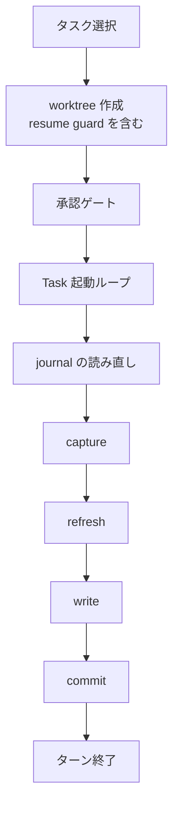

# prelaunch-inprogress-routeback - 要件定義書

## 1. 概要

### 1.1 背景

`em-workflow/references/implement-phase.md` の Step I.2.a は、この entry で選択したすべてのタスクの `in_progress` を 1 つの write set にまとめ、1 回でコミットする。このコミットの後に、承認ゲート（batch では未承認の `project_commands` が hard-fail）と `Task()` 起動ループが来る。両者の間で中断すると、journal に launched イベントが無いまま `in_progress` がブランチにコミット済みで残る。

Step I.2.c は do not refill のため、同一 entry の一部だけを起動して失敗した場合、未起動のタスクは二度と起動されない。route-back ゲートは workflow.yaml の `in_progress` ユニオンで塞がるため、一度も起動されていないタスクの `in_progress` が route-back を恒久的にブロックする。

### 1.2 目的

- 起動前に中断したタスクの in_progress 残骸が、Step I.2.c の route-back を恒久的にブロックしないこと
- 再発を検出するテストがあること

### 1.3 スコープ

**対象**:
- `em-workflow/references/implement-phase.md` の Step I.2.a
- `tests/` 配下のテスト

**対象外**:
- queue_launch_guard を fail-closed にすること（launched の記録に失敗したら起動を拒否する）。フックの挙動変更でスコープが広がるため、残るリスクとして別タスクに起票する。ガードが fail-open で launched を記録しないまま実装者が動いた場合、そのタスクは pending かつ journal にイベントが無い状態になる。このとき再選択による二重起動の余地が残る。
- Step I.2.c のゲートへの除外規定（選択肢 a: routeback_gate_carve_out）。採用しなかった。
- I.1 / I.2.b / I.2.c の他の呼び出し箇所の capture 方式の移行（既存の Idiom split 記述が別件として扱っているもの）。

## 2. ビジネス要件

### 2.1 ビジネス目標

- 起動前に中断したタスクの in_progress 残骸が、Step I.2.c の route-back を恒久的にブロックしないこと
- 再発を検出するテストがあること

### 2.2 対象ユーザー

該当なし

### 2.3 期待される効果

- 1.2 の目的と同じ

## 3. ユースケース

### 3.1 ユースケース一覧

| ID | ユースケース名 | アクター | 優先度 |
|----|----------------|----------|--------|
| UC01 | Step I.2.a の 1 entry を実行する | em-workflow オーケストレーター | - |

### 3.2 ユースケース詳細

#### UC01: Step I.2.a の 1 entry を実行する

**アクター**: em-workflow オーケストレーター

**事前条件**:
- implement フェーズの Step I.2.a に入っている（refill の再入を含む）

**基本フロー**:
1. タスクを選択する
2. worktree を作成する（resume guard を含む）
3. `project_commands` の承認ゲートを通す
4. `Task()` 起動ループを回す
5. journal を読み直す
6. capture する（`LAUNCH_TIP`）
7. refresh する（ブランチ名 `em-workflow/{feature}/integration`）
8. 起動を確認できたタスクについて write する
9. commit する（`commit-docs.sh` の第 3 引数は `"$LAUNCH_TIP"`）
10. ターンを終える

**代替フロー**:
- 一部だけ起動できた: 起動を確認できたタスクの集合で 1 つの write set・1 回のコミットにする。起動を確認できなかったタスクは pending のまま残す（FR2）
- 起動ゼロ: write とコミットを省略してターンを終える（FR3）
- exit 4: journal を読み直し、終端（merged / failed）のタスクを除いて再試行する。2 回目の exit 4 で停止する（FR4）

**事後条件**:
- workflow.yaml で `in_progress` になっているのは、journal で起動を確認できたタスクだけである

## 4. 機能要件

### 4.1 機能一覧

| ID | 機能名 | 説明 | 状態 |
|----|--------|------|------|
| FR1 | I.2.a の launch-state 書き込みを承認ゲートと起動ループの後ろへ移す | capture / refresh / write / commit の 4 段を承認ゲートと `Task()` 起動ループの後ろへ移す | confirmed |
| FR2 | 起動を確認できたタスクだけを in_progress としてコミットする | write set を journal で起動を確認できたタスクに限る | confirmed |
| FR3 | 起動ゼロのときはコミットを省略し、ターンはコミット処理の後に終える | 起動ゼロでコミット省略、ターン終了をコミット処理の後へ移す | confirmed |
| FR4 | コミット時と exit 4 再試行時に journal を読み直し、終端タスクを in_progress に戻さない | write set 作成直前に journal を読み直す | confirmed |
| FR5 | 『pending と launched の組み合わせは決して生じない』文を事実に合わせて書き直す | "can never arise." の文を書き直す | confirmed |
| FR6 | 再発検出テストの追加と、古い文を固定しているテストの修正 | FR1〜FR5 を検査するテストを追加し、既存テストを追従させる | confirmed |

### 4.2 機能詳細

#### FR1: I.2.a の launch-state 書き込みを承認ゲートと起動ループの後ろへ移す

**説明**: em-workflow/references/implement-phase.md の Step I.2.a で、capture / refresh / write / commit の 4 段シーケンスを、project_commands 承認ゲートと Task() 起動ループの後ろへ移す。I.2.a の流れは、タスク選択、worktree 作成（resume guard を含む）、承認ゲート、Task() 起動ループ、journal の読み直し、capture、refresh、write、commit、ターン終了の順になる。

**処理フロー**:

**ビジネスルール**:
- 4 段の相対順序（capture→refresh→write→commit）は変えない
- refresh の対象はブランチ名 `em-workflow/{feature}/integration` のまま変えない
- commit-docs.sh の第 3 引数は `"$LAUNCH_TIP"` のまま変えない
- entry ごとに 1 回（refill の再入を含む）であることは変えない
- `$RECONCILE_TIP` を再利用しないことは変えない

#### FR2: 起動を確認できたタスクだけを in_progress としてコミットする

**説明**: write set の対象は、この entry で選択したタスクのうち、起動ループ後に読み直した journal で起動（launched）を確認できたタスクに限る。

**ビジネスルール**:
- 対象タスクには `tasks.{T}.status = in_progress` と `tasks.{T}.branch` を書く
- 起動を確認できなかったタスク（承認ゲートで止まった、起動ガードに拒否された、Task() を発行していない）は書かず、workflow.yaml 上は pending のまま残す
- 一部だけ起動できた場合も、確認できた集合で 1 つの write set・1 回のコミットにする
- コミットメッセージには、確認できた集合のタスクを並べる

#### FR3: 起動ゼロのときはコミットを省略し、ターンはコミット処理の後に終える

**説明**: 起動を確認できたタスクが 0 件なら、write とコミットを省略する。ターンの終了は「起動直後」ではなく、このコミット処理（または省略）の後に移す。

**ビジネスルール**:
- --batch 実行でターンの最後のメッセージを batch-mode.md のマーカー行だけにする規則は変えない

#### FR4: コミット時と exit 4 再試行時に journal を読み直し、終端タスクを in_progress に戻さない

**説明**: 通常のコミットでも exit 4 の再試行でも、write set を作る直前に最新の journal を読み直す。既に終端（merged / failed）に達したタスクには in_progress を書かない。

**ビジネスルール**:
- exit 4 の回数制限（1 回再試行、2 回目で停止）は既存の Branch & Worktree Model の規則に従う

**エラーケース**:

| エラー | 条件 | 対応 |
|--------|------|------|
| exit 4（1 回目） | commit-docs.sh が exit 4 を返す | journal を読み直し、終端タスクを除いた write set で再試行する |
| exit 4（2 回目） | 再試行でも commit-docs.sh が exit 4 を返す | 停止する。journal の起動記録と、タスクの worktree・ブランチは保持し、削除も巻き戻しもしない。停止レポートにコール箇所と対象タスクを記す |

#### FR5: 『pending と launched の組み合わせは決して生じない』文を事実に合わせて書き直す

**説明**: Step I.2.a にある、workflow.yaml の `status: pending` と journal 最終イベント `launched` の組み合わせは決して生じない（"can never arise."）という文を書き直す。

**ビジネスルール**:
- 書き直した文には次を書く
  - この組み合わせは、起動からコミットまでの間と、コミットに至らなかった場合（中断、または 2 回目の exit 4）に生じうる
  - 生じた場合は、journal 最終イベントが launched のタスクを workflow.yaml の status によらず in-flight とする既存規則で扱われる
- 次の文は残す
  - recycled-task-id carve-out が failed にだけ適用されること
  - launched の in-flight 文
  - recursion invariant 文（pending のタスクが merged の journal 最終イベントを引き継ぐことはない）

#### FR6: 再発検出テストの追加と、古い文を固定しているテストの修正

**説明**: tests/ 配下に、FR1〜FR5 を implement-phase.md の文面で検査するテストを追加する。古い文を固定している既存テストは新しい文に合わせて直す。

**ビジネスルール**:
- 修正対象は次のとおり
  - tests/test_routeback_reset_scope_consistency.py の "can never arise." アンカーを使うテスト（test_i2a_unreachability_sentence_present_and_terminates_correctly、test_recursion_invariant_placed_after_unreachability_terminal）
  - 同じ文を参照していれば tests/test_recycled_task_id_consistency.py

## 5. 非機能要件

### 5.1 パフォーマンス要件

該当なし

### 5.2 セキュリティ要件

該当なし

### 5.3 可用性要件

該当なし

### 5.4 保守性要件

| ID | 要件名 | 内容 | 状態 |
|----|--------|------|------|
| NFR1 | I.2.c と exit-4 証明の文言を変えない | Step I.2.c の route-back ゲート（merged 半分、in_progress 半分、第 3 条件）、リセット集合、掃除対象、Branch & Worktree Model の exit-4 recovery bullet（呼び出し箇所の列挙と到達不能性の証明を含む）の文言を変えない。 | confirmed |
| NFR2 | 変更範囲 | 変更するのは em-workflow/references/implement-phase.md と tests/ 配下だけとする。フック（queue_launch_guard.py、queue_stop_guard.py など）とスクリプトの挙動は変えない。 | confirmed |
| NFR3 | テストスイート | `python3 -m unittest discover -s tests` が全件 green になる。既存テストの修正は、変更した文面への追従に限る。 | confirmed |
| NFR4 | テストの形式 | 新しいテストは test/README.md の規約に従う。標準ライブラリの unittest だけを使い、repository root の tests/ 配下に test_*.py として置く。 | confirmed |

### 5.5 互換性要件

該当なし

## 6. UI/UX要件

該当なし（UI 変更なし。デザインステップはスキップ）

## 7. データ要件

### 7.1 データモデル概要

該当なし

### 7.2 データ項目

| エンティティ | 項目名 | 説明 |
|--------------|--------|------|
| workflow.yaml | `tasks.{T}.status` | 起動を確認できたタスクだけ `in_progress` を書く。起動を確認できなかったタスクは pending のまま |
| workflow.yaml | `tasks.{T}.branch` | 起動を確認できたタスクについて `status` と同じ write set で書く |
| journal | 最終イベント | launched の場合、workflow.yaml の status によらず in-flight。merged / failed は終端 |

### 7.3 データ保持期間

該当なし

## 8. 外部連携

該当なし

## 9. 制約条件

### 9.1 技術的制約

- 変更するのは em-workflow/references/implement-phase.md と tests/ 配下だけとする（NFR2）
- フック（queue_launch_guard.py、queue_stop_guard.py など）とスクリプトの挙動は変えない（NFR2）
- Step I.2.c の route-back ゲート、リセット集合、掃除対象、exit-4 recovery bullet の文言を変えない（NFR1）
- 新しいテストは標準ライブラリの unittest だけを使う（NFR4）

### 9.2 ビジネス上の制約

該当なし

### 9.3 スケジュール制約

該当なし

### 9.4 宣言された変更集合

このフィーチャー固有のパスは手動で列挙せず、create-plan で `workflow.yaml` の各タスクの `files` から導出する（`references/phases/create-plan-phase.md`）。

**デフォルトメンバー**（SPEC作成者が明示的に除外しない限り、常に宣言に含まれる）:
- `feature-docs/prelaunch-inprogress-routeback/**`
- `test-docs/prelaunch-inprogress-routeback/**`

`feature-docs/prelaunch-inprogress-routeback/**` に含まれるもの: `REQUIREMENTS.md`、`SPEC.md`、`IMPLEMENTATION.md`、`workflow.yaml`、`phase-state/`、`tasks/`、`reviews/roundN.yaml`、`VERIFICATION.md`、`retrospect.yaml`、およびデザインステップが生成するデザイン成果物。生成主体は各フェーズドキュメントおよび `references/phase-state.md` を参照（引用のみ、ルールは再掲しない）。

`test-docs/prelaunch-inprogress-routeback/**` に含まれるもの: `{T}.tests.yaml`（パス形式: `test-docs/prelaunch-inprogress-routeback/{T}.tests.yaml`）。生成主体は `implement-phase.md` を参照（引用のみ、ルールは再掲しない）。

**意味論**:
- デフォルトのメンバーは、SPEC作成者が明示的に除外しない限り宣言に含まれる。除外は意図的な絞り込みであり、記載漏れによる省略ではない。
- この宣言はスーパーセット（superset）の主張であり、実際の変更集合は宣言に含まれる（CONTAINED IN）必要がある。実際には生成されないパスが宣言されていても違反にはならない。implementタスクを1つも生成しないフィーチャーは `test-docs/{feature}/` ディレクトリを生成しないが、宣言された `test-docs/{feature}/**` は依然として正しい。

### 9.5 前提

- queue_launch_guard.py（PreToolUse）は、許可した起動を Task() 呼び出しが進む時点で journal に launched として記録する唯一の書き手である。そのため、起動ループの後に journal を読み直せば、起動の成否を確認できる（implement-phase.md I.2.a 末尾の記述による）。（可逆）
- journal 最終イベントが launched のタスクは、workflow.yaml の status によらず in-flight とする既存規則（I.2.a、I.2.b step 1、queue_stop_guard.py）は変えない。起動からコミットまでの間の pending + launched の状態は、この規則で扱われる。（可逆）
- この変更より前の実行で既にブランチにコミットされた in_progress の残骸は修復しない。I.2.c のゲートを変えないことが回答で決まっているため。（可逆）
- Step I.2.c の route-back ゲート、リセット集合、掃除対象、exit-4 到達不能性の証明は変えない（回答で指定）。（可逆）

## 10. 想定される課題とリスク

### 10.1 技術的課題

| 課題 | 影響度 | 対応策 |
|------|--------|--------|
| queue_launch_guard が fail-open で launched を記録しないまま実装者が動いた場合、そのタスクは pending かつ journal にイベントが無い状態になり、再選択による二重起動の余地が残る | - | 本フィーチャーの対象外。別タスクに起票する |
| この変更より前の実行で既にブランチにコミットされた in_progress の残骸 | - | 修復しない |

### 10.2 ビジネスリスク

該当なし

## 11. 成功基準

### 11.1 受け入れ基準

- [ ] AC1（FR1）: Step I.2.a の節の中で、承認ゲートの記述と Task() 起動ループの記述が、LAUNCH_TIP の capture より前にある。
- [ ] AC2（FR1）: capture（`LAUNCH_TIP=$(git -C {integration_worktree} rev-parse em-workflow/{feature}/integration)`）、ブランチ名への refresh、`tasks.{T}.status = in_progress` / `tasks.{T}.branch` の write、第 3 引数が "$LAUNCH_TIP" の commit-docs.sh 呼び出しが、この順で残っている。refill の記述（ONCE per entry、$RECONCILE_TIP を再利用しない）も残っている。tests/test_exit4_tip_argument_consistency.py が修正なしで通る。
- [ ] AC3（FR2）: write set の対象が「選択したタスク全部」ではなく「読み直した journal で起動を確認できたタスク」と書かれている。起動を確認できなかったタスクは pending のまま書かないこと、部分起動のときは確認できた集合で 1 回コミットすることが書かれている。
- [ ] AC4（FR3）: 起動ゼロのときにコミットを省略すること、ターンの終了がコミット処理の後であることが書かれている。「起動直後にターンを終える」という記述は残っていない。
- [ ] AC5（FR4）: 通常のコミットでも exit 4 の再試行でも journal を読み直し、終端（merged / failed）のタスクを in_progress にしないことが書かれている。2 回目の exit 4 で停止するときに起動記録と worktree・ブランチを保持することが書かれている。
- [ ] AC6（FR5）: I.2.a に「`status: pending` と journal 最終イベント `launched` の組み合わせは決して生じない」という主張がもう無い。代わりに、その組み合わせが生じうる場面と、launched の in-flight 規則で扱われることが書かれている。recursion invariant 文と launched の in-flight 文は残っている。
- [ ] AC7（NFR1）: Step I.2.c の節と Branch & Worktree Model の exit-4 recovery bullet が、変更前と文言で一致する。tests/test_implement_routeback_gate.py が修正なしで通る。
- [ ] AC8（FR6、NFR3、NFR4）: AC1〜AC6 を検査する新しいテストがある。変更前の I.2.a の文面（コミットが承認ゲート・起動ループより前にある）に対しては、そのテストが失敗する。`python3 -m unittest discover -s tests` が全件 green になる。

### 11.2 KPI

該当なし

## 12. テストシナリオ

### 12.1 テスト観点

- [ ] TS1（AC1、AC2）: I.2.a の節で、承認ゲート、Task() 起動ループ、LAUNCH_TIP の capture、refresh、write、commit の位置が、この順に厳密に増えていくことを検査する。
- [ ] TS2（AC3）: write の対象が起動を確認できたタスクに限られ、選択した全タスクではないことを、文面で検査する。部分起動のときの扱いと、起動していないタスクを pending のまま残すことも検査する。
- [ ] TS3（AC4）: 起動ゼロのときのコミット省略と、ターン終了がコミットの後であることを検査する。「起動直後にターンを終える」記述が無いことも検査する。
- [ ] TS4（AC5）: exit 4 の再試行で journal を読み直すこと、終端タスクを除くこと、2 回目の exit 4 で停止するときに起動記録と worktree を保持することを検査する。
- [ ] TS5（AC6）: "can never arise." の主張が I.2.a から消え、置き換えの文があり、recursion invariant 文が残っていることを検査する（tests/test_routeback_reset_scope_consistency.py の修正を含む）。
- [ ] TS6（AC8）: 変更前の I.2.a の文面サンプルに対して、TS1〜TS3 の matcher が失敗することを確かめる（negative proof）。
- [ ] TS7（AC7）: 既存の tests/test_implement_routeback_gate.py と tests/test_exit4_tip_argument_consistency.py を回帰ガードとして実行し、修正なしで通ることを確かめる。

## 13. 用語定義

| 用語 | 定義 |
|------|------|
| launched | journal に記録される起動イベント。queue_launch_guard.py が記録する |
| in-flight | journal 最終イベントが launched のタスク。workflow.yaml の status によらない |
| 終端 | journal 最終イベントが merged または failed の状態 |
| `LAUNCH_TIP` | `git -C {integration_worktree} rev-parse em-workflow/{feature}/integration` で capture する値。commit-docs.sh の第 3 引数に渡す |

## 14. 確認事項

### 14.1 確認済み事項

- [x] 修正方式: write/commit を承認ゲートと起動の後ろに移し、journal で起動を確認できたタスクだけを in_progress としてコミットする方式を採用する。Step I.2.c のゲートへの除外規定（routeback_gate_carve_out）は採用しない
- [x] Step I.2.c の route-back ゲート、リセット集合、掃除対象、exit-4 到達不能性の証明: 変えない
- [x] queue_launch_guard の fail-closed 化: 本フィーチャーでは扱わず、別タスクに起票する
- [x] デザインステップ: スキップする（UI 変更なし）

### 14.2 未確認・保留事項

なし

## 15. 参考資料

- `em-workflow/references/implement-phase.md`: Step I.2.a、Step I.2.c、Branch & Worktree Model
