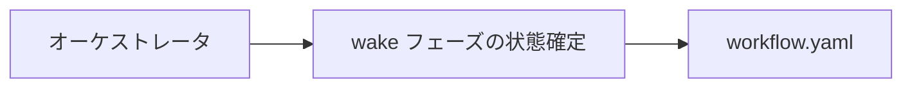
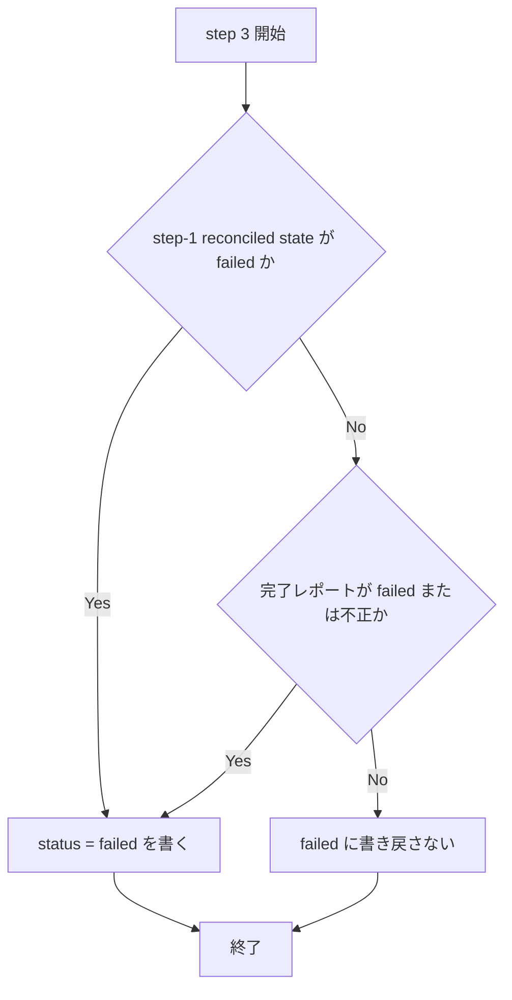

# recycled-task-id-consistency - 要件定義書

## 1. 概要

### 1.1 背景

`em-workflow/references/implement-phase.md` の recycled-task-id ルール（再利用タスク id のルール）は、それに依存する 4 箇所 — Step I.2.a、Step I.2.b step 1、Step I.2.b step 3、Step I.2.c の route-back — で同一に読めない。その結果、reconcile ステップが unlaunched と分類したタスクが、同じ wake フェーズによって `failed` に書き戻され、恒久的に launch 不能になる。

また、「workflow.yaml `status: pending` + journal last event `launched`」という組み合わせには処理の帰結が定義されていない。

対象テキストは、本機能の統合 worktree における `em-workflow/references/implement-phase.md` の状態、すなわち implement-routeback-gate の変更（PR #4）が入った後の状態である。そこには当該 PR のレビュー auto-fix loop 3 が導入した recycled-task-id 段落が含まれる（A3）。

### 1.2 目的

- recycled-task-id ルールが上記 4 箇所で同一に読めるようにする。
- 「`status: pending` + journal last event `launched`」の組み合わせを、発生源で防止する。
- ルールのスコープ（オーケストレータのみに及ぶこと）を明示する。
- 保持されるルールに、要件・受け入れ基準・テストシナリオの裏付けを与える。

### 1.3 スコープ

対象は次のファイルのみ（FR8）。

- `em-workflow/references/implement-phase.md`
- `em-workflow/.claude-plugin/plugin.json`
- `.claude-plugin/marketplace.json`
- `feature-docs/recycled-task-id-consistency/` 配下の成果物
- `test-docs/recycled-task-id-consistency/` 配下の成果物（`em-workflow/references/implement-phase.md` がタスクごとの必須生成物に定めるため、実装側では削除できない）
- `tests/` 配下の新規または拡張されるテストモジュール

明示的に対象外（FR8）。

- `em-workflow/hooks/`、`em-workflow/scripts/`、`em-workflow/agents/`、`em-workflow/skills/`（`skills/develop/SKILL.md` を含む）配下のすべて
- `em-workflow/references/workflow-patch.md`、`em-workflow/references/workflow-schema.md`、`em-workflow/references/rework-task-synthesis.md`、`em-workflow/references/contracts/*`
- `feature-docs/implement-routeback-gate/*`
- 既存テストモジュール `tests/test_implement_routeback_gate.py`、`tests/test_review_implement_develop_lock_contracts.py`、`tests/test_rework_synthesis_contract.py`、`tests/test_develop_skill_rewiring.py`、`tests/test_batch_policies.py`、`tests/test_check_plugin_invariants.py`

非ゴール（D4）: `queue_stop_guard.py` が、ある feature でいずれかのタスクが恒久的な `failed` journal イベントを持った時点でそれ以降沈黙する（`evaluate_feature` が `failed` 非空のとき常に None を返す）という検出上の欠陥。実在するが別件であり、本機能ではいかなる要件も扱わず、hook ファイルも変更しない。オーケストレータがフォローアップタスクとして起票する。

## 2. ビジネス要件

### 2.1 ビジネス目標

1. `em-workflow/references/implement-phase.md` の recycled-task-id ルールが、それに依存する 4 箇所（Step I.2.a、Step I.2.b step 1、Step I.2.b step 3、Step I.2.c route-back）で同一に読めるようにする。これにより、reconcile ステップが unlaunched と分類したタスクが、同じ wake フェーズによって `failed` に書き戻され恒久的に launch 不能になることを防ぐ。
2. 「workflow.yaml `status: pending` + journal last event `launched`」という組み合わせに定義された帰結を与える。方法は発生源での防止であり、I.2.c の route-back が、リセット対象の全タスクについて journal last event が終端であることを前提条件として持つ。非終端の last event は、未定義の経路ではなく、レポートを伴う abort という定義された終端結果になる。
3. recycled-task-id ルールのスコープを明示し、それがオーケストレータによる journal の解釈のみを支配し、journal を読む hook のタスク分類方法を一切変えないことを読者が判別できるようにする。
4. 保持されるルールに対し、現在欠けている要件・受け入れ基準・テストシナリオの裏付けを、本機能の REQUIREMENTS.md と SPEC.md の中で与える。完了済みの implement-routeback-gate のドキュメントには手を触れない。
5. 変更をプロトコルドキュメント、プラグインのバージョン bump、新規のドキュメント契約テストに封じ込める。hook・script・agent・skill の挙動は変更しない。

### 2.2 対象ユーザー

| ユーザータイプ | 説明 |
|----------------|------|
| オーケストレータ | implement フェーズを実行し、journal と workflow.yaml を突き合わせてタスク状態を解釈する主体。recycled-task-id ルールはこの解釈のみを支配する（FR6）。 |
| プロトコルドキュメントの読者 | `em-workflow/references/implement-phase.md` を読み、ルールの適用範囲を判別する必要がある読者（ビジネス目標 3）。 |

### 2.3 期待される効果

- reconcile が unlaunched と分類したタスクが、同一 wake フェーズで `failed` に書き戻されて恒久的に launch 不能になる事象がなくなる（ビジネス目標 1、FR1）。
- 「`status: pending` + journal last event `launched`」の組み合わせが発生しなくなり、未定義の経路が残らない（ビジネス目標 2、FR3・FR4・FR5）。
- ルールのスコープが読者に判別可能になる（ビジネス目標 3、FR6）。
- 保持されるルールに要件・受け入れ基準・テストシナリオの裏付けが与えられる（ビジネス目標 4、FR7）。

## 3. ユースケース

### 3.1 ユースケース一覧

| ID | ユースケース名 | アクター | 優先度 |
|----|----------------|----------|--------|
| UC01 | wake フェーズで再利用 id タスクの状態を確定する | オーケストレータ | 指定なし |
| UC02 | I.2.c で planning への route-back の可否を判定する | オーケストレータ | 指定なし |

### 3.2 ユースケース詳細

#### UC01: wake フェーズで再利用 id タスクの状態を確定する

**アクター**: オーケストレータ

**事前条件**:
- 完了通知により Step I.2.b（wake フェーズ）に入っている。
- 対象タスクは journal last event が `failed` でありながら workflow.yaml `status` が `pending` である（carve-out に該当する再利用 id タスク）。

**基本フロー**:
1. Step I.2.b step 1 が、I.2.a の recycled-task-id ルールを引用して、当該タスクを unlaunched と分類する（step-1 reconciled state）。
2. Step I.2.b step 3 が workflow.yaml へ書き戻す際、`tasks.{T}.status = failed` を書くのは step-1 reconciled state が `failed` のタスク、または完了レポートが `failed`／不正なタスクに限る（FR1）。
3. 当該タスクは step-1 reconciled state が `failed` ではないため `failed` に書き戻されず、carve-out が wake を跨いで残る。
4. Step I.2.a の「reconciled state が `failed` のタスクはここで決して選択されない」により取り残されることがなくなり、当該タスクは再び launch 対象となりうる。

**代替フロー**:
- 完了レポートが `failed` または不正である場合、当該タスクは `tasks.{T}.status = failed` に書き戻される（FR1）。

**事後条件**:
- 検証済みで merged のタスクには `tasks.{T}.status = merged` が書かれる（FR1、この半分は変更しない）。

**ユースケース図**:

#### UC02: I.2.c で planning への route-back の可否を判定する

**アクター**: オーケストレータ

**事前条件**:
- `### I.2.c: Failed handling` に入っている。
- 既存のゲート「no task has status `merged`」を満たしている。

**基本フロー**:
1. journal を replay し、route-back が `tasks.{T}.status` を `pending` にリセットする対象となる全タスクについて、journal last event が終端（`merged` または `failed`）であることを確認する（FR3）。
2. 前提条件が成立する場合、既存の順序付き workflow.yaml 書き込みセットを実行する。

**代替フロー**:
- 前提条件が成立しない場合、route-back は適用不能となる。書き込みセットのいかなる部分も実行せず（`create-plan` = `needs_update` なし、`implement` = `pending` なし、`tasks.{T}.status` のリセットなし）、worktree／branch のクリーンアップも route-back コミットも行わない。`implement` は `failed` のまま留まる。フェーズは、該当する各タスク id とその非終端の journal last event を挙げたレポートで終わり、develop の stop condition 3 を通じてユーザーに制御を返す（FR4）。

**事後条件**:
- route-back が実行されたか、または一切の部分書き込みなしにフェーズがレポートを伴って終了しているかのいずれかである（FR4）。

## 4. 機能要件

### 4.1 機能一覧

| ID | 機能名 | 説明 | 優先度 |
|----|--------|------|--------|
| FR1 | I.2.b step 3 の書き戻しを step-1 reconciled state に基づかせる | `failed` 書き戻し条件を journal のみの表現から step-1 reconciled state を参照する条件に変える | 指定なし |
| FR2 | recycled-task-id ルールの規範的記述を 1 箇所に集約し、他 3 箇所は引用する | 規範的記述は I.2.a のみ。他は引用または同一語彙での表現 | 指定なし |
| FR3 | I.2.c route-back の前提条件: リセット対象の全タスクが終端 journal last event を持つ | 順序付き書き込みセットの前に前提条件を明示 | 指定なし |
| FR4 | 非終端 last event は未定義経路ではなく定義された終端結果 | route-back 適用不能、部分書き込みなし、レポートして終了 | 指定なし |
| FR5 | `pending` + journal `launched` の組が到達不能であることを示す | I.2.a の段落で到達不能性を記述 | 指定なし |
| FR6 | ルールのスコープをオーケストレータ限定として明記 | hook 群は journal の last event のみで判断し `tasks.{T}.status` を参照しない旨を明記 | 指定なし |
| FR7 | 要件・AC・テストシナリオを本機能のドキュメントに置く | implement-routeback-gate のドキュメントは変更しない | 指定なし |
| FR8 | 変更の封じ込め | 変更対象・非対象のファイルを限定 | 指定なし |
| FR9 | プラグインバージョンを 0.1.38 に bump（両レジストリ） | plugin.json と marketplace.json | 指定なし |

（本要件群に優先度は定義されていない。）

### 4.2 機能詳細

#### FR1: I.2.b step 3 の書き戻しは step-1 reconciled state に基づく

**説明**: `em-workflow/references/implement-phase.md` の Step I.2.b step 3 において、`failed` に対する workflow.yaml 書き戻し条件を、現在ドキュメントにある journal のみの表現 — 「`= failed` for every task whose last journal event is `failed` or whose report is `failed`/malformed」 — から、step 1 の reconciled state に基づく条件へ変更する。すなわち `tasks.{T}.status = failed` は、**step-1 reconciled state が `failed`** のタスク、または完了レポートが `failed`／不正であるタスクに対して書かれる。

テキストから読み取れなければならない帰結: step 1 が carve-out（journal last event が `failed` でありながら workflow.yaml `status` が `pending`）によって unlaunched と分類した再利用 id タスクは、同じ wake フェーズで `failed` に書き戻され**ない**。したがって carve-out は wake を跨いで残り、I.2.a の「Tasks whose reconciled state is `failed` are NEVER selected here」によって取り残されることがなくなる。

同一文の `merged` 側（「set `tasks.{T}.status = merged` for every task verified merged」）は変更しない。

**入力**:
- step-1 reconciled state: タスク状態 - Step I.2.b step 1 が算出した各タスクの reconciled state
- 完了レポート: レポート - `failed` または不正（malformed）でありうる

**出力**:
- `tasks.{T}.status`: `failed` / `merged` - workflow.yaml への書き戻し値

**処理フロー**:

**ビジネスルール**:
- 検証済みで merged のタスクには `tasks.{T}.status = merged` を書く（変更なし）。
- carve-out に該当する再利用 id タスクは、同一 wake フェーズで `failed` に書き戻さない。

**バリデーション**:
| 項目 | ルール | エラーメッセージ |
|------|--------|------------------|
| 書き戻し条件の記述 | step-1 reconciled state を参照する表現であること | 該当なし（ドキュメント契約テストで検証） |
| 旧表現 | 「for every task whose last journal event is `failed`」が存在しないこと | 該当なし（ドキュメント契約テストで検証） |

**エラーケース**:
| エラー | 条件 | 対応 |
|--------|------|------|
| 完了レポートが不正 | レポートが malformed | `tasks.{T}.status = failed` を書く |

#### FR2: recycled-task-id ルールの規範的記述は 1 つ、他 3 箇所はそれを引用する

**説明**: recycled-task-id ルールの規範的記述は、Step I.2.a の recycled-task-id 段落（「Recycled task id: workflow.yaml's status wins over a stale journal event here」で始まる文）ちょうど 1 つだけとする。他の 3 箇所は、そこからずれうる条件を再記述するのではなく、それを引用する。

- Step I.2.b step 1: 既存の引用「the recycled-task-id rule in I.2.a above」を維持する。
- Step I.2.b step 3: journal から分類を再導出せず、step 1 の reconciled state を参照する（FR1）。
- Step I.2.c の route-back 前提条件（FR3）: I.2.a の記述と同じ語彙（journal last event、terminal / non-terminal）で表現する。

編集後、I.2.a の記述と異なって読めるタスク単位の分類ルールを述べる箇所が存在しないこと。

**ビジネスルール**:
- 規範的記述は I.2.a に 1 つだけ存在する。

#### FR3: I.2.c route-back の前提条件 — リセット対象の全タスクが終端 journal last event を持つ

**説明**: `### I.2.c: Failed handling` の「route back to planning」箇条書きに、順序付き workflow.yaml 書き込みセットより**前**に明示的な前提条件を追加する。route-back が許容されるのは、`tasks.{T}.status` を `pending` にリセットする対象となる**すべて**のタスクが**終端**の journal last event（`merged` または `failed`）を持つときに限る。

この前提条件は journal を replay して確認する。既存のゲート「applies only when no task has status `merged`」の**代わり**ではなく、それに**加えて**適用される。既存のゲート文とその文言は保持する。

**入力**:
- journal: イベント列 - replay して各タスクの last event を得る
- `tasks.{T}.status`: タスク状態 - route-back がリセットする対象の特定に用いる

**出力**:
- 前提条件の成否: 真偽 - route-back の許容可否

**ビジネスルール**:
- 前提条件の記述位置は、順序付き書き込みセットより前である。
- 既存ゲート「no task has status `merged`」は保持される。

#### FR4: 非終端 last event は定義された終端結果であり、未定義経路ではない

**説明**: 同じ箇条書きが、FR3 の前提条件が成立しない場合の挙動を定義する。route-back は**適用不能**となる。オーケストレータは route-back 書き込みセットのいかなる部分も実行しない（`create-plan` = `needs_update` なし、`implement` = `pending` なし、`tasks.{T}.status` のリセットなし）。worktree／branch のクリーンアップも route-back コミットも行わない。`implement` は `failed` のまま留まる。フェーズは、該当する各タスク id とその非終端の journal last event を挙げたレポートで終わり、develop の stop condition 3 を通じてユーザーに制御を返す — これは当該箇条書きの既存の「abort phase」選択肢と同じ終端である。

追加テキストは、I.2.c セクション内のどこにも「rework」という語およびトークン「`append`」を導入してはならない。また部分書き込み経路を導入してはならない。

**エラーケース**:
| エラー | 条件 | 対応 |
|--------|------|------|
| route-back 適用不能 | リセット対象タスクに非終端の journal last event が存在する | 書き込みセットを一切実行せず、`implement` を `failed` のまま留め、該当タスク id と last event を挙げたレポートで終了し、develop の stop condition 3 で制御を返す |

**ビジネスルール**:
- 部分書き込み経路を導入しない。
- I.2.c セクション内に「rework」「`append`」を導入しない。

#### FR5: `pending` + journal `launched` の組が到達不能であることを示す

**説明**: Step I.2.a の recycled-task-id 段落に、「workflow.yaml `status: pending` + journal last event `launched`」という組み合わせが発生しえない理由を 1〜2 文で述べる。タスク id の再利用は I.2.c の route-back（タスクの status を `pending` にリセットする唯一の書き手）を経て、planner の `replace_all` による `task0001` からの再採番が続く場合にのみ起こる。そして FR3 の前提条件は journal last event が終端であるタスクについてのみ route-back を許容する。よって再採番されたタスクが引き継ぎうるのは、退役した id の `merged` または `failed` イベントだけであり、`launched` イベントを引き継ぐことはない。

既存の文「A task whose journal last event is `launched` is always in-flight, regardless of workflow.yaml `status` — never reinterpret it as unlaunched, since the launch guard would deny that launch.」は**そのまま保持**する。FR5 の追記は、その文がそれまで出口を与えていなかった孤立した組み合わせを取り除くものである。

**ビジネスルール**:
- 既存文は逐語的に保持される。

#### FR6: ルールのスコープはオーケストレータ限定である

**説明**: `implement-phase.md` は、recycled-task-id ルールが**オーケストレータによる journal の解釈のみ**を支配し、journal を読む hook 群は影響を受けないことを明示する。`queue_launch_guard.py`、`queue_stop_guard.py`、`queue_failure_net.py`、`queue_taskstop_net.py` は、それぞれタスクの状態を journal の last event **のみ**から導出し、`tasks.{T}.status` を決して参照しない。

この記述は、`queue_stop_guard.py` が `implement` ステップ自身の status 行と `tasks:` のキー一覧のために workflow.yaml を読むという事実に対しても真であり続ける文言でなければならない。主張すべきは「never consults `tasks.{T}.status`」であって、より強い「never reads workflow.yaml」ではない。

この文は I.2.a の規範的記述（FR2）とともに置かれ、「Supporting cast: journal, hooks, resume」インベントリが既に所有する hook 内部の記述を繰り返さず、そのインベントリを引用する。

**バリデーション**:
| 項目 | ルール | エラーメッセージ |
|------|--------|------------------|
| スコープ文 | 4 つの hook ファイル名を挙げること | 該当なし（ドキュメント契約テストで検証） |
| スコープ文 | 「never reads workflow.yaml」に相当する主張を含まないこと | 該当なし（ドキュメント契約テストで検証） |

#### FR7: 要件・AC・テストシナリオは本機能のドキュメントに置く

**説明**: 保持される recycled-task-id ルールを裏付ける要件・受け入れ基準・テストシナリオは、`feature-docs/recycled-task-id-consistency/REQUIREMENTS.md` と `feature-docs/recycled-task-id-consistency/SPEC.md` に書く。`feature-docs/implement-routeback-gate/` 配下のファイルは作成・編集・削除しない。その REQUIREMENTS.md、SPEC.md、tasks/、reviews/round1.yaml はそのまま残し、完了済み機能の歴史的スコープとレビューの来歴を保存する。

#### FR8: 変更の封じ込め

**説明**: 変更が触れるのは次のみ。`em-workflow/references/implement-phase.md`、`em-workflow/.claude-plugin/plugin.json`、`.claude-plugin/marketplace.json`、`feature-docs/recycled-task-id-consistency/` 配下の成果物、`test-docs/recycled-task-id-consistency/` 配下の成果物、`tests/` 配下の新規または拡張されるテストモジュール。

明示的に変更しないもの: `em-workflow/hooks/`、`em-workflow/scripts/`、`em-workflow/agents/`、`em-workflow/skills/`（`skills/develop/SKILL.md` を含む）配下のすべて、`em-workflow/references/workflow-patch.md`、`em-workflow/references/workflow-schema.md`、`em-workflow/references/rework-task-synthesis.md`、`em-workflow/references/contracts/*`、`feature-docs/implement-routeback-gate/*`、既存テストモジュール `tests/test_implement_routeback_gate.py`、`tests/test_review_implement_develop_lock_contracts.py`、`tests/test_rework_synthesis_contract.py`、`tests/test_develop_skill_rewiring.py`、`tests/test_batch_policies.py`、`tests/test_check_plugin_invariants.py`。

#### FR9: プラグインバージョンを両レジストリで 0.1.38 に bump

**説明**: 同一の変更の一部として、`em-workflow/.claude-plugin/plugin.json` の `version` を `0.1.37` から `0.1.38`（patch）にする。またルートの `.claude-plugin/marketplace.json` の `plugins[]` のうち `name` が `em-workflow` のエントリが `"version": "0.1.38"` を持つようにする。当該エントリは現在 `version` キーを一切持たないため、この要件はそのキーを当該値で**追加**することで満たされる。`em-review` エントリには触れず、両ファイルの他のフィールドは変更しない。

**バリデーション**:
| 項目 | ルール | エラーメッセージ |
|------|--------|------------------|
| `plugin.json` の `version` | `0.1.38` であること | 該当なし（テストで検証） |
| `marketplace.json` の em-workflow エントリ | `"version": "0.1.38"` を持つこと | 該当なし（テストで検証） |

## 5. 非機能要件

### 5.1 パフォーマンス要件

- レスポンスタイム: 該当なし（NFR3 によりドキュメントのみの変更で、実行される挙動は変わらない）
- スループット: 該当なし（同上）
- 同時接続数: 該当なし（同上）

### 5.2 セキュリティ要件

- 認証: 該当なし（NFR3 によりドキュメントのみの変更）
- 認可: 該当なし（同上）
- データ保護: 該当なし（同上）
- 入力検証: 該当なし（同上）

### 5.3 可用性要件

- 稼働率: 該当なし（NFR3 によりドキュメントのみの変更）
- 障害復旧時間: 該当なし（同上）

### 5.4 保守性要件

- ログ出力: 該当なし（NFR3 によりドキュメントのみの変更）
- 監視: 該当なし（同上）
- ドキュメント: NFR2（SSOT 非重複）および NFR4（ローカルなスタイル整合）が適用される。

### 5.5 互換性要件

- ブラウザサポート: 該当なし（A2 により UI 表面もレンダリング出力も存在しない）
- APIバージョン: 該当なし。プラグインバージョンについては FR9（0.1.37 → 0.1.38）が適用される。

### 5.6 本機能の非機能要件

#### NFR1: 既存ドキュメント契約テストのアンカーが変わらず残ること

編集は、既存スイートが依存するいかなるアンカーも乱してはならない。

行折り返しに敏感な RAW リテラル（正規化前のテキストに対して照合されるため、散文が変わっていなくても reflow で壊れる）:

- (a) `tests/test_rework_synthesis_contract.py` は `"Select\nunlaunched tasks (no journal event yet and `status != merged`, ascending"` および `"require at least one task in `tasks` whose\n   `status == pending`"` を要求し、後者はファイル内で前者より前に位置していること。
- (b) `tests/test_review_implement_develop_lock_contracts.py` は I.2.b のコミットリテラル `"docs({feature}): implement wake\n   phase reconcile"` を、その正確な改行と 3 スペースの継続インデントごと要求する。加えてアンカー `Refresh the integration worktree FIRST` と `Update workflow.yaml, then commit` がこの順で存在すること、および `phase reconcile" "$RECONCILE_TIP"` を要求する。

バイト同一性リテラル: 見出し `### I.2.c: Failed handling`、および I.2.c セクションを締めくくる batch-mode 段落（`tests/test_implement_routeback_gate.py` の `PRE_CHANGE_BATCH_MODE_PARAGRAPH` によりバイト同一と assert される。**セクションの最後のテキストであるという位置を含む**）。

`tests/test_implement_routeback_gate.py` が強制し、追加テキストが保たねばならない I.2.c 内の空白正規化後の順序・近接制約:

- 最初に現れる `tasks.{T}.status` の、後続 60 正規化文字以内に `pending` があること。
- `create-plan` の `needs_update` 化、`implement` ステップの `pending` への差し戻し、`tasks.{T}.status` の `pending` への差し戻し、`tasks.{T}.notes` のすべてが `git worktree remove --force` より前にあること。
- `git worktree remove --force` が最初の `commit-docs.sh` より前、その `commit-docs.sh` が `End the phase with a` より前にあること。
- 語句 `no task has status `merged`` が残っていること。
- `If any task has already merged` から `- **abort phase**` までのスライスに `rework` も `append` も含まれないこと。
- 旧表現 `every existing task is still `pending`` および `create-plan exemption owns that precedence` が引き続き存在しないこと。

最後に、`implement-phase.md` のいかなる行も `git ` で始まりかつ `commit` または `add -A` を含んではならない。新しいコミット指示は `commit-docs.sh` を経由する。

#### NFR2: SSOT 非重複

`implement-phase.md` は recycled-task-id ルールの規範的記述をちょうど 1 つ保ち（FR2）、他所が所有するルールは再記述せず引用する。`replace_all` / `replace_planning` の許可条件は `references/workflow-patch.md`、develop 側の優先順位は `skills/develop/SKILL.md` Step B の stop-condition-3 優先句、hook の挙動は同ファイル自身の「Supporting cast」インベントリが所有する。新しい前提条件文とスコープ文は、他ドキュメントが所有するルールの複製を一切加えない。

#### NFR3: ドキュメントのみの変更

実行される挙動は変更しない。Python の hook も script も編集しない。hook は今日実装されているとおりの fail-open かつ journal-last-event の契約をそのまま保つ。成果物はプロトコルの markdown、本機能の feature-docs 成果物、バージョン bump、新規テストである。

#### NFR4: ローカルなスタイル整合

`implement-phase.md` で編集された散文は英語のままで、周囲と一致させる。既存の箇条書き構造、識別子およびファイル名のバッククォート規約に従い、要件が述べる以上の根拠づけを書かない。追加文は周囲の段落と一貫した折り返しにし、NFR1 が保護するリテラルを reflow させてはならない。

#### NFR5: テストは Python unittest のドキュメント契約アサーション

新しい検証は `tests/` 配下の Python `unittest` ドキュメント契約テストとして追加し、リポジトリルートから `python3 -m unittest discover -s tests` で実行可能とする（本プロジェクトは build コマンドも format コマンドも定義せず、E2E インフラを持たない）。`tests/test_implement_routeback_gate.py` のパターンに従う: モジュールレベルの `PLUGIN_ROOT` / パス定数、見出しによるセクションのスライス、散文アサーション用の `_normalize_ws` ヘルパー（生テキストはバイト同一性アサーションにのみ使用）、および新しい各マッチャが変更前の文言を検出することを示す negative-proof のテストクラスを少なくとも 1 つ含める（決して失敗しえないテストはテストではない）。

## 6. UI/UX要件

### 6.1 画面設計要件

該当なし。A2 のとおり、本機能の成果物はプロトコル markdown、本機能の feature-docs 成果物、JSON の version フィールド、Python unittest モジュールであり、UI 表面もレンダリング出力も存在しない。

### 6.2 画面遷移

該当なし（6.1 と同じ理由）。

### 6.3 レスポンシブ対応

該当なし（6.1 と同じ理由）。

## 7. データ要件

### 7.1 データモデル概要

該当なし。本機能はデータモデルを導入しない。

### 7.2 データ項目

| エンティティ | 項目名 | 型 | 必須 | 説明 |
|--------------|--------|-----|------|------|
| `em-workflow/.claude-plugin/plugin.json` | `version` | 文字列 | ○ | `0.1.37` から `0.1.38` へ（FR9） |
| `.claude-plugin/marketplace.json` の em-workflow エントリ | `version` | 文字列 | ○ | `"0.1.38"` を追加（現在キーが存在しない）（FR9） |

### 7.3 データ保持期間

| データ種別 | 保持期間 |
|------------|----------|
| 該当なし | 該当なし |

## 8. 外部連携

### 8.1 連携システム

| システム名 | 連携方法 | データ |
|------------|----------|--------|
| 該当なし | 該当なし | 該当なし |

### 8.2 API仕様要件

該当なし。本機能は API を導入しない。

## 9. 制約条件

### 9.1 技術的制約

- NFR1 が列挙するアンカー（行折り返しに敏感な RAW リテラル、バイト同一性リテラル、I.2.c 内の順序・近接制約）を乱してはならない。
- NFR3 のとおり、実行される挙動を変更しない。Python の hook も script も編集しない。
- A1 のとおり、リポジトリには LICENSE ファイル、パッケージマニフェスト、build コマンド、format コマンド、E2E インフラのいずれも存在しない。唯一のプロジェクトコマンドはリポジトリルートから実行するテストコマンド `python3 -m unittest discover -s tests` である。
- NFR5 および A4 のとおり、新しいアサーションは `tests/test_implement_routeback_gate.py` のスタイルに倣った `tests/` 配下の Python `unittest` ドキュメント契約テストとして追加する。プロジェクトには当該モジュールが 27 個あり、他のテストフレームワークは存在しない。

### 9.2 ビジネス上の制約

- FR7 / D5 のとおり、完了済みの `feature-docs/implement-routeback-gate/` のドキュメントを遡って編集しない。
- FR8 のとおり、変更対象は列挙されたファイルの部分集合に収める。

### 9.3 スケジュール制約

- 指定なし。

## 10. 想定される課題とリスク

### 10.1 技術的課題

| 課題 | 影響度 | 対応策 |
|------|--------|--------|
| I.2.a / I.2.b への追記が NFR1 の行折り返し敏感リテラルを reflow させる | 指定なし | TS-7・TS-8 が当該 RAW リテラルを再アサートし、折り返しを名指しするメッセージで失敗させる |
| I.2.c への追記がセクション内の順序・近接制約や batch-mode 段落の位置を壊す | 指定なし | TS-9・TS-10 が編集後にバイト同一性とセクション内順序を再アサートする |
| 新しいマッチャが変更前の文言も通してしまう（失敗しえないテスト） | 指定なし | NFR5 のとおり、各マッチャに negative-proof テストを付ける（AC-12） |

### 10.2 ビジネスリスク

| リスク | 発生確率 | 影響度 | 対応策 |
|--------|----------|--------|--------|
| D4 の `queue_stop_guard.py` の検出欠陥が未対応のまま残る | 指定なし | 指定なし | 本機能の非ゴールとし、オーケストレータがフォローアップタスクとして起票する |

## 11. 成功基準

### 11.1 受け入れ基準

- [ ] AC-1 (FR1): `### I.2.b: Wake phase` セクションにおいて、step 3 の `failed` 書き戻し条件が step 1 の reconciled state を名指ししており（例:「for every task whose step-1 reconciled state is `failed`」）、当該セクションに journal のみの書き戻し条件「for every task whose last journal event is `failed`」が存在しないこと。文の `merged` 側と「report is `failed`/malformed」句は引き続き存在すること。
- [ ] AC-2 (FR2): I.2.a に規範的な recycled-task-id 記述が引き続き存在し、I.2.b step 1 が引き続き「the recycled-task-id rule in I.2.a above」を引用し、I.2.a / I.2.b / I.2.c のいずれの箇所にもそれと矛盾するタスク単位の分類条件が存在しないこと。
- [ ] AC-3 (FR3): I.2.c の route-back 箇条書きが、status をリセットする対象の全タスクは終端の journal last event（`merged` または `failed`）を持たねばならないと述べ、その記述の位置が順序付き書き込みセットより前であること（正規化後のインデックスが「`create-plan` to `needs_update`」のそれより小さいこと）。既存ゲート「no task has status `merged`」が引き続き存在すること。
- [ ] AC-4 (FR4): 同じ箇条書きが、非終端の journal last event により route-back が適用不能となること、`implement` は `failed` のまま留まること、その場合に `create-plan` の `needs_update` 書き込みも worktree／branch クリーンアップも行われないこと、そしてフェーズが（影響を受けたタスク id とその last journal event を挙げて）レポートし develop の stop condition 3 ／「abort phase」と同じ終端で制御を返すことを述べていること。I.2.c セクションのどこにも「rework」も「`append`」も現れないこと。
- [ ] AC-5 (FR5): I.2.a の recycled-task-id 段落が、id の再利用は I.2.c route-back と planner の `replace_all` 再採番を通じてのみ生じること、および AC-3 の前提条件のもとで `status: pending` と journal last event `launched` の同時成立が起こりえないことを述べていること。文「A task whose journal last event is `launched` is always in-flight, regardless of workflow.yaml `status`」が引き続き存在すること。
- [ ] AC-6 (FR6): `implement-phase.md` に、recycled-task-id ルールがオーケストレータによる journal の解釈のみを支配すると述べ、`queue_launch_guard.py`、`queue_stop_guard.py`、`queue_failure_net.py`、`queue_taskstop_net.py` を名指しし、これらが journal の last event のみで判断し `tasks.{T}.status` を決して参照しないと述べる文が存在すること。これらの hook が workflow.yaml を決して読まないという主張はドキュメントに存在しないこと。
- [ ] AC-7 (FR7): `feature-docs/recycled-task-id-consistency/REQUIREMENTS.md` と `SPEC.md` が存在し、保持されるルールの要件・受け入れ基準・テストシナリオを載せていること。変更に対する `git diff --name-only` が `feature-docs/implement-routeback-gate/` 配下のパスを一切列挙しないこと。
- [ ] AC-8 (FR8): 変更に対する `git diff --name-only` が {`em-workflow/references/implement-phase.md`、`em-workflow/.claude-plugin/plugin.json`、`.claude-plugin/marketplace.json`、`feature-docs/recycled-task-id-consistency/**`、`test-docs/recycled-task-id-consistency/**`、`tests/` 配下の新規／拡張モジュール} の部分集合であり、`em-workflow/hooks/`、`em-workflow/scripts/`、`em-workflow/agents/`、`em-workflow/skills/` 配下のパスを含まないこと。
- [ ] AC-9 (FR9): `em-workflow/.claude-plugin/plugin.json` が `"version": "0.1.38"` であり、`.claude-plugin/marketplace.json` の `em-workflow` エントリが `"version": "0.1.38"` であること。`em-review` エントリは変更されていないこと。
- [ ] AC-10 (NFR1): リポジトリルートから `python3 -m unittest discover -s tests` が、`tests/test_implement_routeback_gate.py`、`tests/test_review_implement_develop_lock_contracts.py`、`tests/test_rework_synthesis_contract.py`、`tests/test_develop_skill_rewiring.py`、`tests/test_batch_policies.py`、`tests/test_check_plugin_invariants.py` を未変更のままパスすること。これが NFR1 の列挙する全アンカーの生存を示す。
- [ ] AC-11 (NFR1): `implement-phase.md` に、（markdown のバッククォートとインデントを無視して）`git ` で始まりかつ `commit` または `add -A` を含む行が 1 つも存在しないこと。
- [ ] AC-12 (NFR5): 新しいテストモジュールが AC-1 から AC-6 のすべての点をアサートし、各新規マッチャが対応する変更前文言を検出することを示すテストを少なくとも 1 つ含むこと。

### 11.2 KPI

| 指標 | 目標値 | 測定方法 |
|------|--------|----------|
| 該当なし | 該当なし | 該当なし |

## 12. テストシナリオ

### 12.1 テスト観点

- [ ] 正常系 TS-1 (unittest ドキュメント契約、AC-1): `### I.2.b: Wake phase` .. `### I.2.c: Failed handling` をスライスし、空白を正規化して、step-1 reconciled state を参照する書き戻し表現の存在をアサートし、journal のみの表現「for every task whose last journal event is `failed`」に対して assertNotIn をアサートする。Negative proof: 同じマッチャを捕捉済みの変更前文に当てると検出されること。
- [ ] 正常系 TS-2 (unittest ドキュメント契約、AC-2): I.2.a の規範的な文「Recycled task id: workflow.yaml's status wins over a stale journal event here」が存在すること、および I.2.b step 1 の括弧書きが引き続き「the recycled-task-id rule in I.2.a above」を含むことをアサートする。
- [ ] 正常系 TS-3 (unittest ドキュメント契約、AC-3): 正規化された I.2.c セクションで、前提条件のテキストが `merged` と `failed` の双方を伴う終端 journal last event に言及することをアサートし、`section.index(<前提条件アンカー>) < section.index("`create-plan` to `needs_update`")` をアサートする。あわせて「no task has status `merged`」が引き続き存在することをアサートする。
- [ ] 異常系 TS-4 (unittest ドキュメント契約、AC-4): 正規化された I.2.c セクションで、route-back 適用不能の分岐が `implement` は `failed` のまま留まると述べ stop condition 3 ／「abort phase」を引用していることをアサートし、I.2.c セクション全体に対して `assertNotIn("rework", section)` と `assertNotIn("append", section)` をアサートする。
- [ ] 境界値 TS-5 (unittest ドキュメント契約、AC-5): 正規化された I.2.a のスライスで、到達不能性の文が `replace_all`（または planner の再採番）を `launched` および `pending` とともに言及することをアサートし、保持された文「A task whose journal last event is `launched` is always in-flight, regardless of workflow.yaml `status`」が引き続き存在することをアサートする。
- [ ] 正常系 TS-6 (unittest ドキュメント契約、AC-6): スコープ文が 4 つの hook ファイル名すべてを挙げ、「never consults」構文の中に `tasks.{T}.status` を含むことをアサートし、これらの hook が「never read workflow.yaml」であるとドキュメントがどこにも述べていないことを（hook 名の近傍における当該文言への assertNotIn によって）アサートする。これにより後の編集がこの誤った主張を再導入できない。
- [ ] 回帰 TS-7 (unittest、AC-10): 生テキストが引き続き `"Select\nunlaunched tasks (no journal event yet and `status != merged`, ascending"` と `"require at least one task in `tasks` whose\n   `status == pending`"` を含み、後者が前者より前に出現することをアサートする。これにより I.2.a の編集で持ち込まれた reflow が、無関係なスイートの中だけでなく、折り返しを名指しするメッセージでここで失敗する。
- [ ] 回帰 TS-8 (unittest、AC-10): 生テキストが引き続き `"docs({feature}): implement wake\n   phase reconcile"` を厳密に含むことをアサートし、I.2.b step 3 の編集がコミットリテラルを reflow させることを防ぐ。
- [ ] 回帰 TS-9 (unittest、AC-10 + NFR1): `### I.2.c: Failed handling` がバイト同一であり、batch-mode 段落が引き続き I.2.c セクションのバイト同一な末尾であることをアサートする（`tests/test_implement_routeback_gate.py` のリテラルを再利用）。
- [ ] 境界値 TS-10 (unittest ドキュメント契約、NFR1): 編集後に I.2.c セクション内の順序を再アサートする。最初の `tasks.{T}.status` 出現の後続 60 正規化文字以内に `pending` があること、4 つの書き込みトークンが `git worktree remove --force` より前にあること、クリーンアップが最初の `commit-docs.sh` より前にあり、それが `End the phase with a` より前にあること。
- [ ] 正常系 TS-11 (unittest、AC-9 + AC-11): `em-workflow/.claude-plugin/plugin.json` と `.claude-plugin/marketplace.json` を JSON としてパースし、双方が em-workflow について version `0.1.38` を報告することをアサートする。あわせて `implement-phase.md` に `git ` で始まり `commit` または `add -A` を含む行が 0 行であることをアサートする。
- [ ] セキュリティ: 該当なし（NFR3 によりドキュメントのみの変更）。
- [ ] パフォーマンス: 該当なし（NFR3 によりドキュメントのみの変更）。

## 13. 用語定義

| 用語 | 定義 |
|------|------|
| recycled-task-id ルール | Step I.2.a の recycled-task-id 段落（「Recycled task id: workflow.yaml's status wins over a stale journal event here」で始まる文）が述べる、オーケストレータによる journal 解釈のルール（FR2、FR6）。 |
| step-1 reconciled state | Step I.2.b step 1 が各タスクについて算出した reconciled state（FR1）。 |
| carve-out | journal last event が `failed` でありながら workflow.yaml `status` が `pending` であるタスクを unlaunched と分類する扱い（FR1）。 |
| 終端 journal last event | journal の last event が `merged` または `failed` であること（FR3）。 |
| route-back | `### I.2.c: Failed handling` の「route back to planning」箇条書きが実行する、planning への差し戻し（FR3、FR4）。タスクの status を `pending` にリセットする唯一の書き手（FR5）。 |

## 14. 確認事項

### 14.1 確認済み事項

- [x] `rule.disposition` = keep-harmonize (D1): recycled-task-id ルールは削除せず**保持**する。調和は、I.2.b step 3 の書き戻しを step-1 reconciled state に基づかせること（FR1）により達成し、ルールが I.2.a、I.2.b step 1、I.2.b step 3、I.2.c route-back で同一に読めるようにする（FR2）。ルールを削除すれば id 再利用の誤分類がそのまま残り、id 再利用そのものを廃止すれば `workflow-patch.md` と planner の契約に波及する。
- [x] `pending.launched.exit` = routeback-precondition (D2): 「status `pending` + journal last event `launched`」の組は、回復するのではなく**防止**する（FR3、FR4、FR5）。却下された代替案 — そのようなタスクを終端状態に reconcile する — は、要件が反映する検証可能な理由で却下された。オーケストレータは journal を書かない（書くのは `merge-task.sh` と journal 書き込み hook のみ）ため、workflow.yaml でタスクを `failed` に再分類しても `failed` イベントは追記されず、journal の last event のみを読む `queue_launch_guard.py` は、うたわれた再試行を依然として拒否する。
- [x] `rule.scope` = orchestrator-only (D3): ルールはオーケストレータの journal 解釈のみを支配する（FR6）。hook は fail-open かつ journal-last-event の契約を保つ。launch guard が古くなりうる workflow.yaml の status を信頼すると二重 launch を許しかねない。
- [x] `stopguard.retired.failed` = out-of-scope (D4): `queue_stop_guard.py` が、ある feature でいずれかのタスクが恒久的な `failed` journal イベントを持った時点でそれ以降沈黙すること（`evaluate_feature` は `failed` が非空のとき常に None を返す）は、実在するが別個の検出欠陥である。本機能の**非ゴール**であり、上記のいかなる要件も扱わず、hook ファイルも変更しない。オーケストレータがフォローアップタスクとして起票する。
- [x] `spec.home` = this-feature (D5): 要件・AC・テストシナリオは `feature-docs/recycled-task-id-consistency/` に書く。完了済みの `implement-routeback-gate` のドキュメントは遡って編集しない（FR7）。
- [x] `design.step` = skip (D6): design ステップはスキップする。成果物はプロトコル markdown（`em-workflow/references/implement-phase.md`）、本機能の feature-docs 成果物、2 つの JSON version フィールド、Python unittest ドキュメント契約テストである。UI 表面もレンダリング出力もなく、`resolved_input_paths.design_system_candidates` は空（リポジトリに design-system 候補はゼロ）。
- [x] A1（プロジェクト事実、本ラウンドで再検証）: リポジトリには LICENSE ファイル、パッケージマニフェスト、build コマンド、format コマンド、E2E インフラのいずれも存在しない。唯一のプロジェクトコマンドは、リポジトリルートから実行するテストコマンド `python3 -m unittest discover -s tests` である。
- [x] A2（プロジェクト事実）: 本機能の成果物はプロトコル markdown、本機能の feature-docs 成果物、JSON の version フィールド、Python unittest モジュールである。UI 表面もレンダリング出力もなく、リポジトリの design-system 候補はゼロである。
- [x] A3（対象テキスト）: 対象テキストは本機能の統合 worktree における `em-workflow/references/implement-phase.md` の状態、すなわち implement-routeback-gate の変更（PR #4）が入った**後**の状態であり、当該 PR のレビュー auto-fix loop 3 が導入した recycled-task-id 段落を含む。上記のすべての要件はそのテキストに対して表現され、本ラウンドでそれに照らして確認された。
- [x] A4（テスト規約）: 新しいアサーションは `tests/test_implement_routeback_gate.py` のスタイル（見出しによるセクションのスライス、散文アサーション用 `_normalize_ws`、バイト同一性アサーション用の生テキスト、加えて negative-proof テスト）で `tests/` 配下の Python `unittest` ドキュメント契約テストとして追加する。プロジェクトには当該モジュールが 27 個あり、他のテストフレームワークは存在しない。
- [x] A5（FR3 前提条件の到達可能性メモ）: 前提条件は、記録された回答どおり逐語的に「terminal journal last event (`merged` / `failed`)」として述べる。journal イベントを 1 つも持たないタスクも同様に非終端だが、route-back がリセットする対象のタスクについてその状態は到達不能である。I.2.b step 3 は、step-1 reconciled state が `failed` であるか完了レポートが `failed`／不正であるタスクにのみ `failed` を書き、いずれも少なくとも `launched` イベントの存在を含意する。したがって「イベントなし」の別分岐は不要である。
- [x] A6-1（bump 先の繰り上げ・verify フェーズで記録）: 当初 FR9 は 0.1.36 → 0.1.37 を指定していたが、本 feature の implement 完了後に `main` が別 feature の bump で 0.1.37 に到達したため、0.1.37 のままでは「同じ変更の中で version を上げる」という運用ルール（`~/.claude/rules/plugin-version-bump.md`）を満たさなくなった。FR9 の意図（プラグイン本体を変更した同一変更で両レジストリの version を pre-feature baseline より先へ進める）を保つため、bump 先を 0.1.38 に繰り上げ、テストモジュールの `BASELINE_PATCH` を 36 → 37 に合わせた。検証は元から baseline 相対（patch > BASELINE_PATCH）なので TS-11 / SC-5 の判定方法は変わらない。
- [x] A6（バージョン bump の対象）: bump は `em-workflow/.claude-plugin/plugin.json` で 0.1.37 → 0.1.38（patch）であり、同じ値を `.claude-plugin/marketplace.json` の `em-workflow` エントリに設定する。当該エントリは現在 `version` キーを持たないため、そこではフィールドを追加する。これは `feature-docs/implement-routeback-gate/REQUIREMENTS.md` の AS-4 に記録された前回 bump の結論（marketplace.json の編集は不要）とは異なる。

### 14.2 未確認・保留事項

- なし（本機能のすべての要件は resolved である）。

## 15. 参考資料

- `em-workflow/references/implement-phase.md`: 本機能が編集する対象プロトコルドキュメント（Step I.2.a、I.2.b、I.2.c、Supporting cast インベントリ）
- `em-workflow/references/workflow-patch.md`: `replace_all` / `replace_planning` の許可条件を所有（NFR2）
- `em-workflow/skills/develop/SKILL.md`: Step B の stop-condition-3 優先句を所有（NFR2、FR4）
- `em-workflow/.claude-plugin/plugin.json`: プラグイン version（FR9）
- `.claude-plugin/marketplace.json`: マーケットプレイスの em-workflow エントリの version（FR9）
- `tests/test_implement_routeback_gate.py`: 新規テストが倣うパターンと、再利用するバイト同一性リテラル（NFR1、NFR5、TS-9）
- `tests/test_review_implement_develop_lock_contracts.py`: I.2.b のコミットリテラルと順序アンカー（NFR1）
- `tests/test_rework_synthesis_contract.py`: 行折り返しに敏感な RAW リテラル（NFR1）
- `feature-docs/implement-routeback-gate/`: 完了済み機能のドキュメント。作成・編集・削除しない（FR7）
