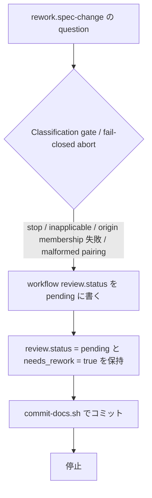
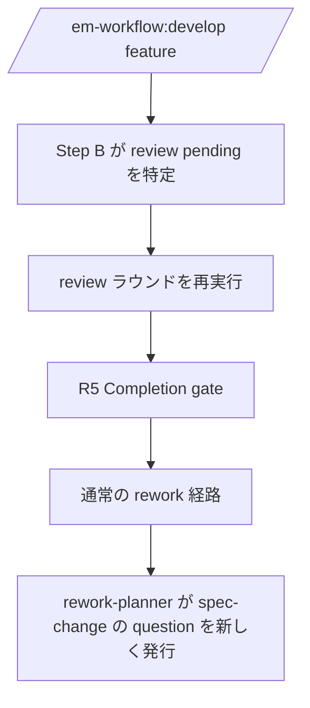

# review-gate-abort-recovery - 要件定義書

## 1. 概要

### 1.1 背景
review-sourced rework（`rework-task-synthesis.md` §10）の途中で `rework.spec-change` の question が run を停止させると、オーケストレーターが `workflow[review].status` に `failed` を書く。その feature は develop の停止条件 3 に掛かり、batch でも interactive でも再開できない。

### 1.2 目的
- `rework.spec-change` ゲートの中断で停止した review から、手編集なしに正規の手順で復帰できるようにする
- review step の `status: failed` の意味を SSOT 間で矛盾なくそろえる

### 1.3 スコープ
- 対象: review-sourced rework で `rework.spec-change` の question が run を停止させた場合（Classification gate の verdict が stop の場合（inapplicable を含む）、その question に対する fail-closed abort（origin membership 失敗、malformed pairing））
- 対象: すでに `review: failed` になっている feature の復旧手順
- 対象外: verify 由来の spec-change ゲート中断（A5）
- 変更する文書: `em-workflow/references/review-phase.md`（Phase R5）、`em-workflow/skills/develop/SKILL.md`（Step B の引用、停止時の報告）、`tests/`（ドキュメント構造テスト）

## 2. ビジネス要件

### 2.1 ビジネス目標
- `rework.spec-change` ゲートの中断で停止した review から、手編集なしに正規の手順で復帰できるようにする
- review step の `status: failed` の意味を SSOT 間で矛盾なくそろえる

### 2.2 対象ユーザー
| ユーザータイプ | 説明 |
|----------------|------|
| em-workflow の利用者 | `/em-workflow:develop <feature>` で feature を batch / interactive で進める |
| オーケストレーター | develop スキルを実行し、`workflow.yaml` の status を書き込む |

### 2.3 期待される効果
- ゲート中断後に `/em-workflow:develop <feature>` で再開すると、停止条件 3 が発火せず review ラウンドが再実行される
- 既存の `review: failed` の feature を、SSOT に書かれた手順で復旧できる

## 3. ユースケース

### 3.1 ユースケース一覧
| ID | ユースケース名 | アクター | 優先度 |
|----|----------------|----------|--------|
| UC01 | batch でのゲート中断 | オーケストレーター | 高 |
| UC02 | ゲート中断後の再開 | em-workflow の利用者、オーケストレーター | 高 |
| UC03 | 既存の review: failed の復旧 | オーケストレーター | 中 |

### 3.2 ユースケース詳細

#### UC01: batch でのゲート中断

**アクター**: オーケストレーター

**事前条件**:
- review-sourced rework の §10 step 1 が実行済みで、トップレベルの `review.status` は `pending`、`review.needs_rework` は `true`
- `workflow[review].status` は Step B により `in_progress`

**基本フロー**:
1. rework-planner が `gate_id: rework.spec-change` の question を返す
2. Classification gate の verdict が stop（inapplicable を含む）になる、または fail-closed abort（origin membership 失敗、malformed pairing）になる
3. オーケストレーターは `workflow[review].status` を `pending` に書き、`review.status = pending` と `review.needs_rework = true` を保持する
4. 停止前に `commit-docs.sh` でコミットする
5. run が停止する

**代替フロー**:
- `commit-docs.sh` が exit 4 を返した場合は、既存の exit-4 リカバリに従って書き込みをやり直す

**事後条件**:
- どちらの status にも `failed` が書かれていない
- spec-change 遷移の 5 つの step は 1 つも実行されず、create-spec / create-plan / implement の status は変わらない
- `batch.review_rework_count` は増えない
- batch の停止は `batch-terminal-line.md` の Fallback rule で `unmapped_stop` に束ねられる

#### UC02: ゲート中断後の再開

**アクター**: em-workflow の利用者、オーケストレーター

**事前条件**:
- UC01 の事後条件の状態

**基本フロー**:
1. 利用者が `/em-workflow:develop <feature>` を実行する
2. Step B が review（`pending`）を次の step として特定する。停止条件 3 は発火しない
3. review フェーズが新しいラウンドを実行する
4. R5 の Completion gate から通常の rework 経路に入る
5. interactive では、rework-planner が返す spec-change の question がユーザーに直接提示される

**代替フロー**:
- `goal` ブロックが無い feature を batch で再開した場合は、review ラウンドからゲート中断までを繰り返して停止する（A6）

**事後条件**:
- obsolete になった前回の packet は再提示されない

#### UC03: 既存の review: failed の復旧

**アクター**: オーケストレーター

**事前条件**:
- `workflow[review].status` が `failed`
- `phase-state/rework.yaml` の classification の最終エントリが `decision: stop`

**基本フロー**:
1. `workflow[review].status` と `review.status` を `pending` に戻す
2. `review.needs_rework` を `true` に戻す
3. `commit-docs.sh` でコミットする

**代替フロー**:
- 記録で確認できない場合は手順を適用せず、停止条件 3 の通常停止になる

**事後条件**:
- UC02 の経路で再開できる

## 4. 機能要件

### 4.1 機能一覧
| ID | 機能名 | 説明 | 優先度 |
|----|--------|------|--------|
| FR1 | ゲート中断時の review の status | ゲート中断時に `workflow[review].status` を `pending` に書き、`failed` を書かない | 高 |
| FR2 | 規則の定義元と引用 | 規則を review-phase.md Phase R5 の 1 箇所で定義し、SKILL.md Step B は引用だけにする | 高 |
| FR3 | 再開経路 | 再開時に停止条件 3 が発火せず、review ラウンドが再実行される経路を定義元に書く | 高 |
| FR4 | 既存の review: failed の復旧手順 | 記録で確認できる場合に限る復旧手順を定義元に書き、停止報告から参照する | 中 |
| FR5 | failed の予約宣言の適用範囲 | 予約宣言が perspective_runs の evaluator エントリを対象とすることを明記する | 中 |
| FR6 | 回帰テスト | FR1〜FR5 の文言を固定するドキュメント構造テストを negative twin 付きで追加する | 高 |

### 4.2 機能詳細

#### FR1: ゲート中断時の review の status

**説明**: review-sourced rework（`rework-task-synthesis.md` §10）の step 1 の後に、`rework.spec-change` の question が run を停止させたとき、オーケストレーターは `workflow[review].status` を `pending` に書く。トップレベルの `review.status = pending` と `review.needs_rework = true` は保持する。どちらの status にも `failed` を書かない。この書き込みは停止前に `commit-docs.sh` でコミットする。

**入力**:
- `workflow[review].status`: 文字列 - Step B により `in_progress`
- `review.status`: 文字列 - §10 step 1 により `pending`
- `review.needs_rework`: 真偽値 - `true`

**出力**:
- `workflow[review].status`: 文字列 - `pending`
- `review.status`: 文字列 - `pending`（保持）
- `review.needs_rework`: 真偽値 - `true`（保持）

**処理フロー**:

**ビジネスルール**:
- 対象: Classification gate の verdict が stop の場合（inapplicable を含む）と、その question に対する fail-closed abort（origin membership 失敗、malformed pairing）
- `goal` ブロックがある feature で verdict (a) goal_not_met による stop が起きた場合も、この規則に従う
- verify 由来の spec-change ゲート中断は対象外（A5）
- `batch.review_rework_count` は増やさない（A6）

**エラーケース**:
| エラー | 条件 | 対応 |
|--------|------|------|
| コミット失敗 | `commit-docs.sh` が exit 4 を返す | 既存の exit-4 リカバリに従って書き込みをやり直す |

#### FR2: 規則の定義元と引用

**説明**: FR1・FR3・FR4 の規則は `review-phase.md` Phase R5 の 1 箇所（Rework path / Batch mode の段落の後）で定義する。`SKILL.md` Step B の「spec-change 遷移のゲート呼び出し（バッチのみ）」段落は、この定義元を引用するだけで、内容を繰り返し書かない。

**ビジネスルール**:
- 定義元は 1 箇所。他の文書は引用だけにする（cited, not restated）

#### FR3: 再開経路

**説明**: FR1 の状態から `/em-workflow:develop <feature>` で再開すると、Step B は review（`pending`）を次の step として特定し、停止条件 3 は発火しない。review フェーズは新しいラウンドを実行し、R5 の Completion gate から通常の rework 経路に入る。interactive では、rework-planner が返す spec-change の question がユーザーに直接提示される。obsolete になった前回の packet は再提示しない。この経路を FR2 の定義元に書く。

**処理フロー**:

**ビジネスルール**:
- 新しい再開分岐や停止条件 3 の例外は追加しない
- Classification gate の stop / inapplicable で packet は obsolete になり、再開しても再提示されない

#### FR4: 既存の review: failed の復旧手順

**説明**: FR2 の定義元に復旧手順を書く。停止条件 3 が review の `failed` で発火したときの停止報告（batch では `resume_conditions`）は、この手順を参照する。

**ビジネスルール**:
- 適用条件: `workflow[review].status` が `failed` で、`phase-state/rework.yaml` の classification の最終エントリが `decision: stop`
- 手順: `workflow[review].status` と `review.status` を `pending` に、`review.needs_rework` を `true` に戻し、`commit-docs.sh` でコミットする
- 記録で確認できない場合は手順を適用しない

**エラーケース**:
| エラー | 条件 | 対応 |
|--------|------|------|
| 記録で確認できない | classification の記録が確認できない | 手順を適用せず、停止条件 3 の通常停止になる |

#### FR5: failed の予約宣言の適用範囲

**説明**: `review-phase.md` の「status: failed is reserved for the two structural degradation triggers of Phase R3b」が perspective_runs の evaluator エントリの status を対象とすることを明記する。R5 に FR1 の規則（ゲート中断で review の status に `failed` を書かない）を置く。

**ビジネスルール**:
- `workflow-schema.md` の status の許容値は変えない

#### FR6: 回帰テスト

**説明**: `tests/` にドキュメント構造テストを追加し、FR1〜FR5 の文言を固定する。各 matcher には、文言が欠けたときに検出できることを示す反例（negative twin）を付ける。

## 5. 非機能要件

### 5.1 パフォーマンス要件
- 該当なし

### 5.2 セキュリティ要件
- 入力検証: task_description は信頼できない入力として扱った。指示の差し込み（injection）は見つからなかった

### 5.3 可用性要件
- 該当なし

### 5.4 保守性要件
- NFR1: 停止条件 3 の本文、自動再エントリの例外とその網羅性宣言、batch での verify cap の例外、implement の failed_kind ブロックを変更しない
- NFR2: interactive に新しい質問を追加しない（既存の「interactive はこの改訂で変更しない」の宣言と整合させる）
- NFR3: 規則の定義元を 1 箇所にし、他の文書は引用だけにする（cited, not restated）
- NFR4: 既存テストが固定している文言と出現順序を保つ（reference_impact 参照）
- NFR5: `workflow-schema.md` の status の許容値と `batch.review_rework_count` の扱いを変えない
- NFR6: plugin の version を触らない（`.claude/rules/core-plugin-version-bump.md`）
- NFR7: `python3 -m unittest discover -s tests` が通る

### 5.5 互換性要件
- `workflow-schema.md` の status の許容値は変えない（NFR5）

## 6. UI/UX要件

### 6.1 画面設計要件
画面は持たない。停止報告について次を満たす。
- batch でゲート中断が起きたとき、停止報告と `resume_conditions` は「interactive で `/em-workflow:develop <feature>` を実行すれば、review ラウンドの再実行を経て spec-change の判断に進める」ことを示す
- 既存の `review: failed` で停止条件 3 が発火したとき、停止報告は復旧手順の位置を示す

### 6.2 画面遷移
該当なし

### 6.3 レスポンシブ対応
該当なし

## 7. データ要件

### 7.1 データモデル概要
該当なし

### 7.2 データ項目
| エンティティ | 項目名 | 型 | 必須 | 説明 |
|--------------|--------|-----|------|------|
| workflow.yaml | `workflow[review].status` | 文字列 | ○ | Step B が `in_progress` に更新する。ゲート中断時は `pending` に書く |
| workflow.yaml | `review.status` | 文字列 | ○ | §10 step 1 で `pending` になる。ゲート中断時は保持する |
| workflow.yaml | `review.needs_rework` | 真偽値 | ○ | ゲート中断時は `true` を保持する |
| workflow.yaml | `batch.review_rework_count` | 整数 | × | ゲート中断では増えない |
| phase-state/rework.yaml | classification の最終エントリ | - | × | `decision: stop` のとき FR4 の手順を適用できる |

### 7.3 データ保持期間
該当なし

## 8. 外部連携

### 8.1 連携システム
該当なし

### 8.2 API仕様要件
該当なし

## 9. 制約条件

### 9.1 技術的制約
- 停止条件 3 の本文、自動再エントリの例外とその網羅性宣言、batch での verify cap の例外、implement の failed_kind ブロックを変更しない（NFR1）
- interactive に新しい質問を追加しない（NFR2）
- 既存テストが固定している文言と出現順序を保つ（NFR4）
- `workflow-schema.md` の status の許容値と `batch.review_rework_count` の扱いを変えない（NFR5）
- plugin の version を触らない（NFR6）

### 9.2 ビジネス上の制約
- 該当なし

### 9.3 スケジュール制約
- 該当なし

### 9.4 宣言された変更集合

このフィーチャー固有のパスは手動で列挙せず、create-plan で `workflow.yaml` の各タスクの `files` から導出する（`references/phases/create-plan-phase.md`）。

**デフォルトメンバー**（SPEC作成者が明示的に除外しない限り、常に宣言に含まれる）:
- `feature-docs/review-gate-abort-recovery/**`
- `test-docs/review-gate-abort-recovery/**`

`feature-docs/review-gate-abort-recovery/**` に含まれるもの: `REQUIREMENTS.md`、`SPEC.md`、`IMPLEMENTATION.md`、`workflow.yaml`、`phase-state/`、`tasks/`、`reviews/roundN.yaml`、`VERIFICATION.md`、`retrospect.yaml`、およびデザインステップが生成するデザイン成果物。生成主体は各フェーズドキュメントおよび `references/phase-state.md` を参照（引用のみ、ルールは再掲しない）。

`test-docs/review-gate-abort-recovery/**` に含まれるもの: `{T}.tests.yaml`（パス形式: `test-docs/review-gate-abort-recovery/{T}.tests.yaml`）。生成主体は `implement-phase.md` を参照（引用のみ、ルールは再掲しない）。

**意味論**:
- デフォルトのメンバーは、SPEC作成者が明示的に除外しない限り宣言に含まれる。除外は意図的な絞り込みであり、記載漏れによる省略ではない。
- この宣言はスーパーセット（superset）の主張であり、実際の変更集合は宣言に含まれる（CONTAINED IN）必要がある。実際には生成されないパスが宣言されていても違反にはならない。implementタスクを1つも生成しないフィーチャーは `test-docs/review-gate-abort-recovery/` ディレクトリを生成しないが、宣言された `test-docs/review-gate-abort-recovery/**` は依然として正しい。

## 10. 想定される課題とリスク

### 10.1 技術的課題
| 課題 | 影響度 | 対応策 |
|------|--------|--------|
| `goal` ブロックが無い feature を batch で再開すると、review ラウンドからゲート中断までを繰り返して停止する（A6） | 低 | 停止報告と `resume_conditions` で interactive での再開を示す |
| status が 2 つの別フィールド（`workflow[review].status` とトップレベルの `review.status`）にある | 中 | FR1 で両フィールドの値を定める |

### 10.2 ビジネスリスク
| リスク | 発生確率 | 影響度 | 対応策 |
|--------|----------|--------|--------|
| 該当なし | - | - | - |

## 11. 成功基準

### 11.1 受け入れ基準
- [ ] AC1: review-phase.md R5 に FR1 の規則が 1 箇所で定義されている。対象となるゲート中断が列挙されており、どちらの status にも failed を書く手順が存在しない
- [ ] AC2: SKILL.md Step B の spec-change ゲート呼び出し段落が AC1 の定義元を引用しており、既存の固定文言を保っている
- [ ] AC3: SSOT の記述から、ゲート中断後に develop を再開すると Step B が review（pending）を選び、停止条件 3 が発火せずに review ラウンドが再実行されることが導ける。obsolete の packet は再提示されない
- [ ] AC4: review-phase.md の failed の予約宣言が perspective_runs の evaluator エントリを対象とすることが明記されている。review step の status の扱いと矛盾せず、workflow-schema.md の許容値も変わっていない
- [ ] AC5: 既存の review: failed の復旧手順（適用条件、戻す値、コミット）が SSOT に書かれている。停止条件 3 が review の failed で発火したときの停止報告と resume_conditions がこの手順を参照している
- [ ] AC6: 追加したテストが AC1〜AC5 の文言を固定しており、各 matcher に反例（negative twin）がある
- [ ] AC7: python3 -m unittest discover -s tests が通る

### 11.2 KPI
| 指標 | 目標 | 方法 |
|------|------|------|
| 該当なし | - | - |

## 12. テストシナリオ

### 12.1 テスト観点
- [ ] TS1 (AC1): review-phase.md の R5 節を切り出し、ゲート中断時に workflow[review].status を pending に書く規則、review.status = pending と review.needs_rework = true の保持、failed を書かない旨、対象（Classification gate の stop / inapplicable、origin membership 失敗、malformed pairing）がそろっていることを確認する。各文言を欠いた反例で matcher が失敗することも確認する
- [ ] TS2 (AC2): SKILL.md Step B の「spec-change 遷移のゲート呼び出し（バッチのみ）」段落が R5 の定義元を引用していること、tests/test_gate_outcome_packet_lifecycle.py が固定する既存文言がすべて残っていることを確認する
- [ ] TS3 (AC3): R5 の定義元に、再開時に Step B が review（pending）を選び、停止条件 3 が発火せず review ラウンドが再実行され、obsolete の packet を再提示しない経路が書かれていることを確認する
- [ ] TS4 (AC4): review-phase.md の「status: failed is reserved for the two structural degradation triggers of Phase R3b」の近傍に perspective_runs の evaluator エントリが対象である旨が書かれていること、workflow-schema.md の status の許容値が変わっていないことを確認する
- [ ] TS5 (AC5): 復旧手順の適用条件（workflow[review].status が failed かつ phase-state/rework.yaml の classification の最終エントリが decision: stop）、戻す値（両 status を pending、needs_rework を true）、commit-docs.sh でのコミット、記録で確認できない場合は適用しない旨が書かれていること、SKILL.md「停止時の報告（停止条件 2-4 のみ）」節と resume_conditions がこの手順を参照していることを確認する
- [ ] TS6 (AC6): 追加した各 matcher に対応する negative twin があり、文言を除いた入力で失敗することを確認する
- [ ] TS7 (AC7): python3 -m unittest discover -s tests を実行し、既存テスト（test_classification_gate.py、test_rework_synthesis_contract.py、test_gate_outcome_packet_lifecycle.py を含む）と新規テストが通ることを確認する

## 13. 用語定義

| 用語 | 定義 |
|------|------|
| ゲート中断 | review-sourced rework の §10 step 1 の後に、`rework.spec-change` の question が run を停止させること。Classification gate の verdict が stop の場合（inapplicable を含む）と、その question に対する fail-closed abort（origin membership 失敗、malformed pairing）を指す |
| negative twin | matcher が、文言が欠けたときに検出できることを示す反例 |

## 14. 確認事項

### 14.1 確認済み事項

- [x] 復旧の方式（requirement.recovery-approach）: keep_pending。ゲート中断時は review の status を failed にせず pending のまま残す
- [x] 既存の review: failed の扱い（requirement.legacy-failed-recovery）: document_procedure。復旧手順を SSOT に書き、resume_conditions から参照する
- [x] failed の予約宣言の適用範囲（requirement.failed-reservation-scope）: declare_step_semantics。予約宣言の適用範囲と、ゲート中断で failed を書かない規則を R5 に明記する
- [x] 再開経路（requirement.resume-path）: rerun_review_round。再開時は review ラウンドを再実行する
- [x] design step（design-step.decision）: decide_autonomously。design step は実行しない（skip）

### 14.2 未確認・保留事項
- なし

### 14.3 前提

- A1: ゲート中断時は review の status を failed にせず pending のまま残す（keep_pending）。停止条件 3 の例外は追加しない（requirement.recovery-approach）
- A2: 既存の review: failed は、ゲート中断による failed と記録で確認できる場合に限り、両 status を pending・needs_rework を true に戻す手順を SSOT に書き、resume_conditions から参照する。exit4-tip-argument はすでに completed のため変更しない（requirement.legacy-failed-recovery）
- A3: review-phase.md 927 行目の failed の予約は perspective_runs の evaluator エントリを対象とする。R5 に適用範囲とゲート中断で failed を書かない規則を明記し、workflow-schema.md の許容値は変えない（requirement.failed-reservation-scope）
- A4: 再開時は review ラウンドを再実行し、spec-change の question は再実行した rework で新しく発行させる。obsolete の packet は再提示しない（requirement.resume-path）
- A5: verify 由来の spec-change ゲート中断は対象外とする（requirement.recovery-approach）
- A6: ゲート中断では batch.review_rework_count を増やさない（既存の扱いを変えない）。goal ブロックが無い feature を batch で再開すると、review ラウンドからゲート中断までを繰り返して停止する（requirement.resume-path）
- A7: design step は実行しない（skip）（design-step.decision）

## 15. 参考資料

- `em-workflow/references/review-phase.md`: Phase R3b の failed 予約宣言、Phase R5（Rework path / Batch mode / Completion gate）
- `em-workflow/skills/develop/SKILL.md`: Step B、停止条件 3、停止時の報告（停止条件 2-4 のみ）
- `em-workflow/references/question-resolution.md`: Classification gate、obsolete packet の扱い
- `em-workflow/references/rework-task-synthesis.md`: §10 の SPEC-change transition
- `em-workflow/references/workflow-schema.md`: status の許容値、`batch.review_rework_count`
- `batch-terminal-line.md`: Fallback rule（`unmapped_stop`）
