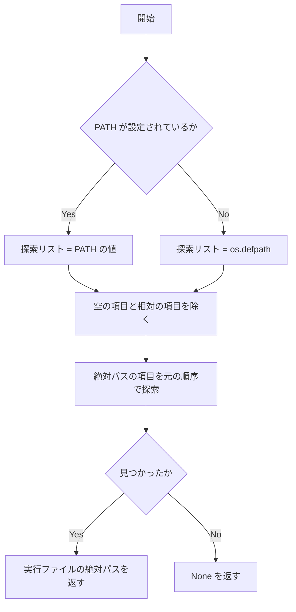
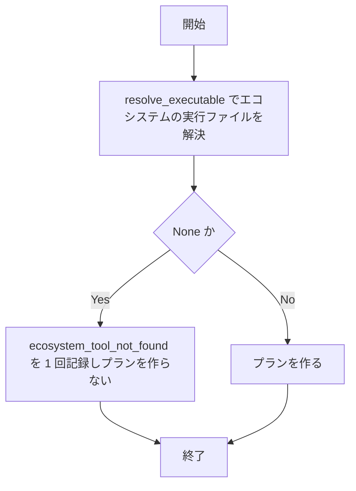
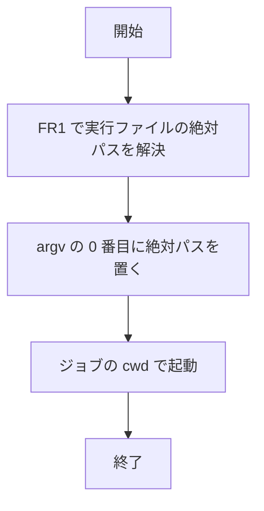
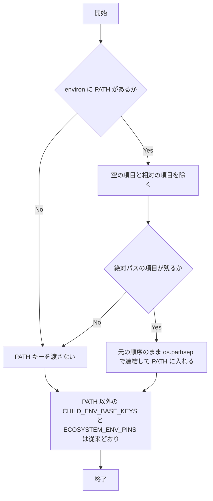

# sca-absolute-executable-path - 要件定義書

## 1. 概要

### 1.1 背景
SCA 軸のスキャンでは、スキャンジョブの実行ファイルを PATH から解決し、子プロセスに PATH を渡す。PATH に相対の項目があると、レビュー対象のリポジトリ内にある実行ファイルが起動されうる（受け入れ基準 AC3 の攻撃シナリオ）。

### 1.2 目的
- SCA 軸のスキャンで、PATH の相対の項目を経由して、レビュー対象のリポジトリ内にある実行ファイルが起動されないようにする（入れ子のプロジェクトとルートのプロジェクトの両方）。
- どのスキャンジョブでも argv[0] を実行ファイルの絶対パスにする。

### 1.3 スコープ
- 対象: `em-workflow/scripts/scan-dependencies.py` のスキャンジョブの実行ファイル解決（`resolve_executable`、`build_scan_jobs`）と子プロセスの環境（`build_child_env`）、およびそれらを説明するコメント・docstring。
- 対象外: git の呼び出し（`resolve_main_worktree_root`）とタスクシステムの entry point の呼び出し（`list_security_tasks` ほか）。
- 対象外: `ALLOWED_EXECUTABLES`、`ECOSYSTEM_ENV_PINS`、`ECOSYSTEM_LOCKFILES`、`em-workflow/references/vuln-scanners.yaml` のレジストリ値、スキップ理由の語彙、`em-workflow/references/review-phase.md` の手順。

## 2. ビジネス要件

### 2.1 ビジネス目標
- SCA 軸のスキャンで、PATH の相対の項目を経由して、レビュー対象のリポジトリ内にある実行ファイルが起動されないようにする（入れ子のプロジェクトとルートのプロジェクトの両方）。
- どのスキャンジョブでも argv[0] を実行ファイルの絶対パスにする。

### 2.2 対象ユーザー
該当なし

### 2.3 期待される効果
- PATH に相対の項目があっても、`services/api/tools/npm` や `<起動時の cwd>/tools/npm` のようなレビュー対象リポジトリ内の実行ファイルが起動されない。
- スキャンジョブの argv[0] が、ジョブの cwd によらず同じ絶対パスになる。

## 3. ユースケース

該当なし

## 4. 機能要件

### 4.1 機能一覧
| ID | 機能名 | 説明 | 優先度 |
|----|--------|------|--------|
| FR1 | 実行ファイルの解決は PATH の絶対パスの項目だけを探索する | `resolve_executable(name)` は空の項目と相対の項目を探索しない | - |
| FR2 | 絶対パスの項目で見つからないときは既存のスキップ理由を使う | `<ecosystem>_tool_not_found` をエコシステムごとに 1 回だけ記録し、プランを作らない | - |
| FR3 | スキャンジョブの argv[0] は cwd によらず絶対パス | npm / cargo / pip / go のすべてのジョブで argv[0] を FR1 の絶対パスにする | - |
| FR4 | 子プロセスの PATH から相対・空の項目を除く | `build_child_env` が子に渡す PATH を絶対パスの項目だけにする | - |
| FR5 | コード内の説明を新しい挙動に合わせる | コメント・docstring を FR1・FR4 の挙動に合わせる | - |

### 4.2 機能詳細

#### FR1: 実行ファイルの解決は PATH の絶対パスの項目だけを探索する

**説明**: `em-workflow/scripts/scan-dependencies.py` の `resolve_executable(name)` は、探索リストの項目のうち空の項目と相対の項目（`os.path.isabs` が偽のもの）を探索しない。絶対パスの項目だけを元の順序で探索し、見つかった実行ファイルの絶対パスを返す。見つからなければ `None` を返す。探索リストは PATH の値とし、PATH が未設定のときは `shutil.which` と同じく `os.defpath` とする。既存の呼び出し `resolve_executable(name)`（引数 1 つ）はそのまま使える。

**入力**:
- `name`: 文字列 - 実行ファイル名

**出力**:
- 戻り値: 文字列または `None` - 見つかった実行ファイルの絶対パス。見つからなければ `None`

**処理フロー**:

**ビジネスルール**:
- 相対かどうかは `os.path.isabs` で判定する。
- `~` や環境変数は展開しない（`~/bin` は相対として扱う）。

**バリデーション**:
| 項目 | ルール | エラーメッセージ |
|------|--------|------------------|
| 探索リストの各項目 | 空の項目、`os.path.isabs` が偽の項目は探索しない | なし |

**エラーケース**:
| エラー | 条件 | 対応 |
|--------|------|------|
| 実行ファイルが見つからない | 絶対パスの項目のどれにも実行ファイルが無い（相対・空の項目の下にしか無い場合を含む） | `None` を返す |

#### FR2: 絶対パスの項目で見つからないときは既存のスキップ理由を使う

**説明**: `resolve_executable` が `None` を返したエコシステムは、`build_scan_jobs` で既存の `<ecosystem>_tool_not_found` をエコシステムごとに 1 回だけ記録し、プランを作らない。相対の項目にしか実行ファイルが無い場合もこれに当たる。新しいスキップ理由は追加しない。

**入力**:
- `resolve_executable` の戻り値: 文字列または `None`

**出力**:
- スキップ理由: 文字列 - `<ecosystem>_tool_not_found`（エコシステムごとに 1 回）

**処理フロー**:

**ビジネスルール**:
- 新しいスキップ理由は追加しない。

**バリデーション**:
該当なし

**エラーケース**:
| エラー | 条件 | 対応 |
|--------|------|------|
| 実行ファイルが見つからない | `resolve_executable` が `None` を返した | `<ecosystem>_tool_not_found` を 1 回記録し、プランを作らない |

#### FR3: スキャンジョブの argv[0] は cwd によらず絶対パス

**説明**: npm / cargo / pip / go のすべてのスキャンジョブで、argv[0] は FR1 で解決した絶対パスとする。ジョブの cwd（ルートのプロジェクト、入れ子のプロジェクトディレクトリ、隔離ディレクトリ）によって起動される実行ファイルが変わらない。

**入力**:
- FR1 で解決した実行ファイルの絶対パス: 文字列

**出力**:
- スキャンジョブの argv[0]: 文字列 - FR1 で解決した絶対パス

**処理フロー**:

**ビジネスルール**:
- 対象は npm / cargo / pip / go のすべてのスキャンジョブ。
- 起動される実行ファイルはジョブの cwd によって変わらない。

**バリデーション**:
該当なし

**エラーケース**:
該当なし

#### FR4: 子プロセスの PATH から相対・空の項目を除く

**説明**: `build_child_env(ecosystem, environ)` が子に渡す PATH は、呼び出し元の PATH から空の項目と相対の項目を除き、絶対パスの項目だけを元の順序のまま `os.pathsep` で連結した値とする。絶対パスの項目は書き換えない（正規化・重複除去をしない）。絶対パスの項目が 1 つも残らないとき、および呼び出し元に PATH が無いときは、PATH キーを渡さない。PATH 以外の `CHILD_ENV_BASE_KEYS` の扱いと `ECOSYSTEM_ENV_PINS` の上書きは変えない。

**入力**:
- `ecosystem`: 文字列 - エコシステム
- `environ`: 環境変数の対応表 - 呼び出し元の環境

**出力**:
- 子の環境: 環境変数の対応表 - PATH は絶対パスの項目だけ。条件により PATH キーを含まない

**処理フロー**:

**ビジネスルール**:
- 絶対パスの項目は書き換えない（正規化・重複除去をしない）。
- PATH 以外の `CHILD_ENV_BASE_KEYS` の扱いと `ECOSYSTEM_ENV_PINS` の上書きは変えない。

**バリデーション**:
| 項目 | ルール | エラーメッセージ |
|------|--------|------------------|
| PATH の各項目 | 空の項目、`os.path.isabs` が偽の項目は除く | なし |

**エラーケース**:
該当なし

#### FR5: コード内の説明を新しい挙動に合わせる

**説明**: `scan-dependencies.py` のうち、`resolve_executable` による解決と子の PATH の扱いを説明するコメント・docstring を FR1・FR4 の挙動に合わせる。対象は次のとおり。
- `CHILD_ENV_BASE_KEYS` 直前のコメントの「carried through unchanged」
- Scan job construction 節のコメント
- `build_scan_jobs` の docstring
- `build_child_env` の docstring

**入力**:
該当なし

**出力**:
該当なし

**ビジネスルール**:
- 説明は FR1・FR4 の挙動に合わせる。

**バリデーション**:
該当なし

**エラーケース**:
該当なし

## 5. 非機能要件

### 5.0 非機能要件一覧
| ID | 名称 | 内容 |
|----|------|------|
| NFR1 | 標準ライブラリだけを使う | `scan-dependencies.py` は標準ライブラリだけを import する状態を保つ。`build_scan_job` / `build_child_env` はファイルを開かず、プロセスを起動しない状態を保つ。 |
| NFR2 | 変えないもの | `ALLOWED_EXECUTABLES`、`ECOSYSTEM_ENV_PINS`、`ECOSYSTEM_LOCKFILES`、`em-workflow/references/vuln-scanners.yaml` のレジストリ値、スキップ理由の語彙、`em-workflow/references/review-phase.md` の手順は変えない。 |
| NFR3 | 既存テストの維持 | 既存の `tests/test_sca_*.py` と `tests/test_scan_dependencies_*.py` は通り続ける。例外は `tests/test_sca_scan_unchanged_surfaces.py` の `test_ac2_the_child_environment_is_the_pass_through_keys_plus_the_pins` で、フィクスチャの PATH 値（相対の項目 `"runner-PATH"`）を絶対パスの値に替える。テストが確かめる内容（子の環境 = 引き継ぐキー + ピン）は変えない。 |
| NFR4 | version を触らない | `em-workflow/.claude-plugin/plugin.json` と `.claude-plugin/marketplace.json` の version は変更しない。 |

### 5.1 パフォーマンス要件
該当なし

### 5.2 セキュリティ要件
- 認証: 該当なし
- 認可: 該当なし
- データ保護: 該当なし
- 入力検証: PATH の空の項目と相対の項目は、実行ファイルの探索（FR1）と子の PATH（FR4）の両方から除く。

### 5.3 可用性要件
該当なし

### 5.4 保守性要件
- ログ出力: 該当なし
- 監視: 該当なし
- ドキュメント: コード内のコメント・docstring を新しい挙動に合わせる（FR5）。

### 5.5 互換性要件
- 既存の呼び出し `resolve_executable(name)`（引数 1 つ）はそのまま使える（FR1）。
- 既存テストは通り続ける（NFR3）。
- 変えないもの（NFR2）、version（NFR4）は 5.0 のとおり。

## 6. UI/UX要件

該当なし

## 7. データ要件

該当なし

## 8. 外部連携

該当なし

## 9. 制約条件

### 9.1 技術的制約
- `scan-dependencies.py` は標準ライブラリだけを import する（NFR1）。
- `build_scan_job` / `build_child_env` はファイルを開かず、プロセスを起動しない（NFR1）。
- NFR2 に挙げたものは変えない。
- version は変更しない（NFR4）。

### 9.2 ビジネス上の制約
該当なし

### 9.3 スケジュール制約
該当なし

### 9.4 宣言された変更集合

このフィーチャー固有のパスは手動で列挙せず、create-plan で `workflow.yaml` の各タスクの `files` から導出する（`references/phases/create-plan-phase.md`）。

**デフォルトメンバー**（SPEC作成者が明示的に除外しない限り、常に宣言に含まれる）:
- `feature-docs/sca-absolute-executable-path/**`
- `test-docs/sca-absolute-executable-path/**`

`feature-docs/sca-absolute-executable-path/**` に含まれるもの: `REQUIREMENTS.md`、`SPEC.md`、`IMPLEMENTATION.md`、`workflow.yaml`、`phase-state/`、`tasks/`、`reviews/roundN.yaml`、`VERIFICATION.md`、`retrospect.yaml`、およびデザインステップが生成するデザイン成果物。生成主体は各フェーズドキュメントおよび `references/phase-state.md` を参照（引用のみ、ルールは再掲しない）。

`test-docs/sca-absolute-executable-path/**` に含まれるもの: `{T}.tests.yaml`（パス形式: `test-docs/sca-absolute-executable-path/{T}.tests.yaml`）。生成主体は `implement-phase.md` を参照（引用のみ、ルールは再掲しない）。

**意味論**:
- デフォルトのメンバーは、SPEC作成者が明示的に除外しない限り宣言に含まれる。除外は意図的な絞り込みであり、記載漏れによる省略ではない。
- この宣言はスーパーセット（superset）の主張であり、実際の変更集合は宣言に含まれる（CONTAINED IN）必要がある。実際には生成されないパスが宣言されていても違反にはならない。implementタスクを1つも生成しないフィーチャーは `test-docs/sca-absolute-executable-path/` ディレクトリを生成しないが、宣言された `test-docs/sca-absolute-executable-path/**` は依然として正しい。

## 10. 想定される課題とリスク

該当なし

## 11. 成功基準

### 11.1 受け入れ基準
- [ ] AC1（FR1）: PATH に相対の項目（例: `tools`、`./node_modules/.bin`、`.`、空の項目）と絶対パスの項目が混在し、両方に同名の実行ファイルがあるとき、`resolve_executable` は絶対パスの項目側の実行ファイルの絶対パスを返す。
- [ ] AC2（FR1, FR2）: 実行ファイルが PATH の相対・空の項目の下にしか無いとき、`resolve_executable` は `None` を返し、`build_scan_jobs` はそのエコシステムについて `<ecosystem>_tool_not_found` を 1 回だけ返し、プランを作らない。
- [ ] AC3（FR3）: 攻撃シナリオ（PATH に相対の項目 `tools` があり、`services/api/package.json`・`package-lock.json` と実行可能な `services/api/tools/npm` がある状態）で `run_scan` を実行しても、`services/api/tools/npm` と `<起動時の cwd>/tools/npm` はどちらも起動されない。
- [ ] AC4（FR3）: cwd が入れ子のディレクトリになるジョブ（go の入れ子のプロジェクト、npm / cargo の隔離ディレクトリ）と、cwd がルートのジョブ（pip、ルートの go）のどちらでも、argv[0] は絶対パスで、`resolve_executable` が返した値と一致する。
- [ ] AC5（FR4）: `build_child_env` に PATH `"tools::/usr/bin:./node_modules/.bin:/opt/bin"`（区切りは `os.pathsep`）を渡すと、子の PATH は `"/usr/bin:/opt/bin"` になる。PATH が相対・空の項目だけのとき、および PATH が無いとき、子の環境に PATH キーは無い。
- [ ] AC6（FR4, NFR2）: PATH 以外の引き継ぎキー（`HOME`、`TMPDIR`、`TEMP`、`TMP`、`SYSTEMROOT`、`USERPROFILE`）とエコシステムごとのピンは、変更前と同じ値で子の環境に入る。
- [ ] AC7（NFR1, NFR3）: `python3 -m unittest discover -s tests` が通る。

### 11.2 KPI
該当なし

## 12. テストシナリオ

### 12.1 テスト観点
- [ ] 正常系: TS1（AC1）一時ディレクトリに相対の項目用ディレクトリと絶対パスの stub ディレクトリを作り、cwd を相対の項目が解決される場所にした状態で PATH を `"tools:<絶対パスの stub ディレクトリ>"` にし、`resolve_executable("npm")` が stub の絶対パスを返すことを確かめる。
- [ ] 正常系: TS5（AC5）`build_child_env` に混在した PATH を渡し、絶対パスの項目だけが元の順序で残ることを確かめる。
- [ ] 正常系: TS8（AC6）全引き継ぎキーとピン対象の値を持つ environ（PATH は絶対パス）で `build_child_env` を呼び、結果が「引き継ぎキー + ピン」と一致することを確かめる（既存 `test_ac2` のフィクスチャ修正で担保）。
- [ ] 異常系: TS2（AC2）PATH を相対・空の項目だけ（`"tools"`、`"./node_modules/.bin"`、`"."`、`""`、`"~/bin"`）にし、その下に実行ファイルを置いた状態で、`resolve_executable` が `None` を返し、`build_scan_jobs` が `["npm_tool_not_found"]` とプラン 0 件を返すことを確かめる。
- [ ] 境界値: TS6（AC5）`build_child_env` に相対・空の項目だけの PATH を渡したとき、および PATH を含まない environ を渡したときに、戻り値に PATH キーが無いことを確かめる。
- [ ] 境界値: TS9（AC1）PATH を未設定にし、`os.defpath` を相対・空の項目と絶対パスの stub ディレクトリの混在に差し替えた状態で、`resolve_executable` が stub の絶対パスを返すことを確かめる。
- [ ] セキュリティ: TS3（AC3, AC4）テストハーネス（stub が起動記録を書く既存の形）で、`services/api/package.json`・`package-lock.json` と、起動されたら印を残す `services/api/tools/npm` と `<cwd>/tools/npm` を置き、PATH を `"tools<pathsep><stub ディレクトリ>"` にして `run_scan` を実行する。起動記録の argv[0] が stub の絶対パスで、どちらの `tools/npm` の印も残らないことを確かめる。
- [ ] セキュリティ: TS4（AC4）go の入れ子のプロジェクト（cwd が `<root>/services/api`）と、pip・ルートの go（cwd がルート）について、`run_scan` の起動記録の argv[0] が絶対パスで、`resolve_executable` の値と一致することを確かめる。
- [ ] セキュリティ: TS7（AC5）`run_scan` の起動記録に残る子の環境の PATH に、相対・空の項目が含まれないことを確かめる。
- [ ] パフォーマンス: 該当なし

## 13. 用語定義

| 用語 | 定義 |
|------|------|
| 探索リスト | `resolve_executable` が探索する項目の並び。PATH の値。PATH が未設定のときは `os.defpath` |
| 相対の項目 | PATH（または探索リスト）の項目のうち `os.path.isabs` が偽のもの。`~` や環境変数は展開しないので `~/bin` も相対の項目 |
| 空の項目 | PATH（または探索リスト）の項目のうち空文字列のもの |
| 絶対パスの項目 | PATH（または探索リスト）の項目のうち `os.path.isabs` が真のもの |
| 引き継ぎキー | 子の環境に渡す PATH 以外の `CHILD_ENV_BASE_KEYS`（`HOME`、`TMPDIR`、`TEMP`、`TMP`、`SYSTEMROOT`、`USERPROFILE`） |
| ピン | `ECOSYSTEM_ENV_PINS` によるエコシステムごとの環境変数の上書き |

## 14. 確認事項

### 14.1 確認済み事項
- [x] デザインステップ: スキップ（画面を持たない CLI スクリプトの変更。回答 design-step.recommendation = decide_autonomously）

### 14.2 未確認・保留事項
なし

### 14.3 前提
- A1: PATH が未設定のときの探索リストは `shutil.which` と同じ `os.defpath` とし、そこからも相対・空の項目を除く（回答 skip_relative_entries を既存の探索リストに当てはめたもの）。
- A2: 相対かどうかは `os.path.isabs` で判定する。`~` や環境変数は展開しない（`~/bin` は相対として扱う）。
- A3: 対象はスキャンジョブの実行ファイル解決と子の環境だけとする。git の呼び出し（`resolve_main_worktree_root`）とタスクシステムの entry point の呼び出し（`list_security_tasks` ほか）は変えない。
- A4: 見つからない場合のスキップ理由は既存の `<ecosystem>_tool_not_found` を使い続ける（既存テストで固定されている値）。
- A5: task_description の「追加の指示」（push、PR 作成、Codex への相談、Notion への記録）は実行手順への指示として扱い、SPEC の要件には含めない。

## 15. 参考資料

- `em-workflow/scripts/scan-dependencies.py`: 変更対象のスクリプト
- `tests/test_sca_scan_unchanged_surfaces.py`: フィクスチャを修正する既存テスト
- `em-workflow/references/vuln-scanners.yaml`: 変更しないレジストリ
- `em-workflow/references/review-phase.md`: 変更しない手順
