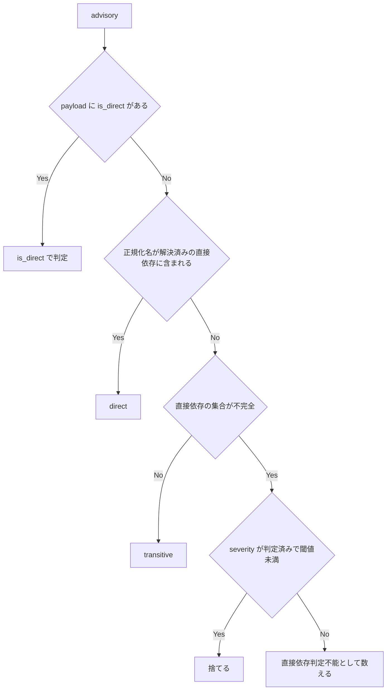

# sca-directness-resolution - 要件定義書

## 1. 概要

### 1.1 背景

em-workflow の SCA 軸（軸 2）は、閾値を「direct dependency のみ / severity high 以上」としている。`em-workflow/scripts/scan-dependencies.py` の直接依存の判定は、次の 4 経路で直接依存を取りこぼす。取りこぼされた advisory は transitive に分類されて閾値で捨てられ、findings 0 件・`skipped: false`・診断情報なしで返る。

1. 宣言側の名前とスキャナが報告する名前を、正規化せずに完全一致で比較している（pip・cargo の両経路）。
2. TOML の有効な宣言形式が読めない。
    - `[dependencies.serde]` のようなサブテーブル
    - `alias = { package = 'real-name', version = '1' }` のリネーム
    - pyproject.toml のシングルクォート文字列
3. pyproject.toml の依存配列のパースが、extras サフィックス（`'requests[socks]>=2'`）の `]` で終わってしまう。
4. requirements ファイルの `-r` include を pip-audit は辿るが、直接依存の判定は辿らない。

### 1.2 目的

- 直接依存の判定が取りこぼした direct dependency の advisory を、SCA 軸が黙って捨てないようにする。
- 直接依存を判定できなかったことを、transitive 扱いにせずスキャン結果に表す。

### 1.3 スコープ

- 対象: `em-workflow/scripts/scan-dependencies.py` の直接依存の判定（pip・cargo）と、そのテスト（`tests/` 配下）。
- 対象外: npm・go の挙動（変更しない）。
- 対象外: プラグインの version（変更しない）。

## 2. ビジネス要件

### 2.1 ビジネス目標

- SCA 軸（軸 2）が、直接依存の判定漏れによって direct dependency の advisory を黙って捨てない。
- 直接依存を判定できないとき、その事実がスキャン結果に現れる。

### 2.2 対象ユーザー

| ユーザータイプ | 説明 |
|----------------|------|
| em-workflow 利用者 | SCA 軸（軸 2）の結果を受け取る |

### 2.3 期待される効果

- 4 つの再現手順で、direct dependency の advisory が findings として報告される。
- 直接依存を判定できなかった advisory の件数が summary に現れる。

## 3. ユースケース

### 3.1 ユースケース一覧

| ID | ユースケース名 | アクター |
|----|----------------|----------|
| UC01 | SCA 軸で依存の advisory を検査する | em-workflow 利用者 |

### 3.2 ユースケース詳細

#### UC01: SCA 軸で依存の advisory を検査する

**アクター**: em-workflow 利用者

**事前条件**:
- プロジェクトに pyproject.toml・requirements ファイル・Cargo.toml のいずれかがある。

**基本フロー**:
1. SCA 軸がマニフェストから直接依存の名前を集める。
2. スキャナ（pip-audit / cargo-audit）が advisory を報告する。
3. 各 advisory を direct / transitive / 直接依存判定不能に分類する。
4. direct かつ閾値を満たす advisory が findings になる。

**代替フロー**:
- 直接依存の集合が不完全な場合、判定できなかった advisory は件数だけを summary の注記で報告する（FR5）。
- tomllib が使えず、判定が pyproject.toml / Cargo.toml に依存する場合、そのスキャン単位は固定の skip reason で skip し、スキャナを起動しない（FR6）。

**事後条件**:
- direct dependency の advisory が、判定漏れによって findings 0 件・診断情報なしで捨てられていない。

## 4. 機能要件

### 4.1 機能一覧

| ID | 機能名 | 説明 |
|----|--------|------|
| FR1 | cargo 経路での正規化名による照合 | `normalize_cargo` が宣言名と報告名の両方を `canonical_pip_name` で正規化してから照合する |
| FR2 | Cargo.toml の直接依存名を TOML パーサで得る | tomllib でパースし、サブテーブル・`package =` リネーム・`workspace = true` を解決する |
| FR3 | pyproject.toml の直接依存名を TOML パーサで得る | tomllib でパースし、クォート形式や extras に関係なく名前を得る |
| FR4 | requirements の include 解決 | `-r` 系の include をプロジェクトルート内で再帰的に辿る |
| FR5 | 直接依存判定不能の件数注記 | 直接依存の集合が不完全なとき、判定できない advisory を件数だけの summary 注記で報告する |
| FR6 | TOML パーサが無いときの明示的な skip | tomllib が無いとき、pyproject.toml / Cargo.toml に依存するスキャン単位を固定の skip reason で skip する |
| FR7 | 回帰テスト | 再現手順・不完全ケース・skip・include の封じ込めと循環をテストする |

### 4.2 機能詳細

#### FR1: cargo 経路での正規化名による照合

**説明**: `normalize_cargo` は、既存の `canonical_pip_name` を宣言側のクレート名と cargo-audit が報告するクレート名の両方に適用してから、メンバシップを判定する。cargo-audit の payload のエントリに `is_direct` があるときは、引き続きそれで directness を決める。

**ビジネスルール**:
- 正規化ヘルパは既存の `canonical_pip_name` 1 つを使い、名前は変えない。

#### FR2: Cargo.toml の直接依存名を TOML パーサで得る

**説明**: Cargo の直接依存名は、レビュー対象の Cargo.toml を tomllib でパースして得る。

**ビジネスルール**:
- 読むテーブルは `[dependencies]`・`[dev-dependencies]`・`[build-dependencies]`。トップレベルと `target.<cfg>` 配下の両方を読む。
- サブテーブル形式（`[dependencies.serde]`）も読む。
- `package = "<name>"` を持つエントリは、キーではなく `<name>` を直接依存名にする。
- `workspace = true` のエントリは、同じマニフェストの `[workspace.dependencies]` のエントリがリネームしている場合、そのパッケージ名を直接依存名にする。
- `[workspace]` が members を列挙している Cargo.toml は、直接依存の集合を不完全とする（FR5）。member のマニフェストは読まない。ルート自身の依存テーブルは直接依存として数える。

#### FR3: pyproject.toml の直接依存名を TOML パーサで得る

**説明**: pyproject.toml の直接依存名は tomllib でパースして得る。

**ビジネスルール**:
- `[project].dependencies` の各 PEP 508 文字列から、パッケージ名だけを直接依存名にする。クォート形式と extras サフィックスの有無は問わない。
- `[tool.poetry.dependencies]` と `[tool.poetry.dev-dependencies]` の各キーを直接依存名にする。`python` は除く。
- 上記以外のテーブルは直接依存の宣言として扱わない。`project.optional-dependencies`・`dependency-groups`・`tool.poetry.group.*.dependencies` も含めない。

#### FR4: requirements の include 解決

**説明**: requirements ファイルの include を再帰的に辿り、include 先で宣言された名前も直接依存とする。

**ビジネスルール**:
- 辿る include の形式は `-r X`・`-rX`・`--requirement X`・`--requirement=X`。
- `X` は include している側のファイルのディレクトリを基準に解決し、`_resolve_project_relative` を通してプロジェクトルート内に解決できなければならない。
- 各ファイルは 1 回だけ訪れる。循環があってもエラーにせず再帰を終える。
- `-c` / `--constraint` のファイルは辿らない。
- 行末のバックスラッシュは行の継続として扱う。

**エラーケース**:

| エラー | 条件 | 対応 |
|--------|------|------|
| ルート外への include | `..`・絶対パス・シンボリックリンクでプロジェクトルートの外を指す | 読まない。直接依存の集合を不完全とする |
| include 先が無い・読めない | ファイルが存在しない、または読めない | 直接依存の集合を不完全とする |
| URL の include | include 先が URL | 取得しない。直接依存の集合を不完全とする |
| 名前を解決できない行 | 素の URL やローカルパスのみの行など | 直接依存の集合を不完全とする |

#### FR5: 直接依存判定不能の件数注記

**説明**: スキャン単位の直接依存の集合が不完全なとき、次の条件をすべて満たす advisory を「直接依存判定不能」として数える。この advisory は findings にせず、transitive としても扱わない。

- パッケージが、直接依存の集合のうち解決できた部分に含まれない。
- severity が判定できていて閾値未満、という理由ですでに捨てられるものではない。

**出力**:
- `run_scan` はエコシステムごとに件数を合計し、既存の注記の後ろに件数だけの注記を付け足す。それぞれ件数が 0 でないときだけ付ける。
    - `' N pip advisory|advisories with undetermined directness (pip_directness_undetermined).'`
    - `' N cargo advisory|advisories with undetermined directness (cargo_directness_undetermined).'`
- `skipped` と `skip_reason` は変えない。

**ビジネスルール**:
- severity も直接依存も判定できない advisory は、直接依存判定不能として 1 回だけ数える。
- 直接依存の集合が不完全になるのは次の場合。
    - マニフェストを解決・読み込み・パースできない（tomllib があり TOML として不正な場合を含む）
    - include がルート外を指す、存在しない、読めない、URL である
    - requirements の行から名前を解決できない
    - `[project]` の dependencies が dynamic で、静的なリストが無い
    - pyproject.toml に `[project]` の dependencies も Poetry のテーブルも無い
    - Cargo.toml の `[workspace]` が members を列挙している

**処理フロー**:

#### FR6: TOML パーサが無いときの明示的な skip

**説明**: tomllib が使えず、スキャン単位の直接依存の判定が pyproject.toml または Cargo.toml に依存するとき、そのスキャン単位は完了せず、スキャナを起動しない。

**ビジネスルール**:
- skip reason は固定のトークン `pip_toml_parser_unavailable` または `cargo_toml_parser_unavailable`。
- requirements ファイルのスキャン単位は変えない。
- 既存の pip lockfile の挙動（`pip_direct_manifest_not_found`・`pip_lockfile_unconvertible`）は変えない。

#### FR7: 回帰テスト

**説明**: `tests/` 配下のテストで次を確かめる。

- 4 つの再現手順
- FR5 の不完全ケースそれぞれ
- FR6 の skip（tomllib を None に差し替える）
- include の封じ込めと循環

## 5. 非機能要件

### 5.1 パフォーマンス要件

該当なし

### 5.2 セキュリティ要件

- 入力検証:
    - NFR2: プロジェクトルートの外のファイルは読まない。include やシンボリックリンク経由でも読まない。URL の include は取得しない。
    - NFR3: マニフェストや include の内容によって、例外が scan の外に出ない。失敗はすべて固定トークンか件数に対応づける。
- データ保護:
    - NFR4: summary と skip_reason には固定トークンと件数だけを載せる。マニフェストのパス・パッケージ名・advisory の本文は載せない。

### 5.3 可用性要件

該当なし

### 5.4 保守性要件

- NFR1: 標準ライブラリだけを使う（tomllib は既存のガード付き import を通す）。実行時・テスト時の依存を増やさない。
- NFR6: プラグインの version は編集しない（`.claude/rules/core-plugin-version-bump.md`）。

### 5.5 互換性要件

- NFR5: npm と go の挙動は変えない。

## 6. UI/UX要件

該当なし

## 7. データ要件

該当なし

## 8. 外部連携

### 8.1 連携システム

| システム名 | 連携方法 | データ |
|------------|----------|--------|
| pip-audit | 既存の起動方法 | 報告されるパッケージ名・advisory |
| cargo-audit | 既存の起動方法 | 報告されるクレート名・advisory・`is_direct`（ある場合） |

### 8.2 API仕様要件

該当なし

## 9. 制約条件

### 9.1 技術的制約

- 標準ライブラリだけを使う（NFR1）。
- 直接依存として数えるのは、既存の宣言テーブルとタスクに書かれた形式（サブテーブル、`package =` リネーム、クォート非依存、extras）だけ。

### 9.2 ビジネス上の制約

- プラグインの version は編集しない（NFR6）。

### 9.3 スケジュール制約

該当なし

### 9.4 宣言された変更集合

このフィーチャー固有のパスは手動で列挙せず、create-plan で `workflow.yaml` の各タスクの `files` から導出する（`references/phases/create-plan-phase.md`）。

**デフォルトメンバー**（SPEC作成者が明示的に除外しない限り、常に宣言に含まれる）:
- `feature-docs/sca-directness-resolution/**`
- `test-docs/sca-directness-resolution/**`

`feature-docs/sca-directness-resolution/**` に含まれるもの: `REQUIREMENTS.md`、`SPEC.md`、`IMPLEMENTATION.md`、`workflow.yaml`、`phase-state/`、`tasks/`、`reviews/roundN.yaml`、`VERIFICATION.md`、`retrospect.yaml`、およびデザインステップが生成するデザイン成果物。生成主体は各フェーズドキュメントおよび `references/phase-state.md` を参照（引用のみ、ルールは再掲しない）。

`test-docs/sca-directness-resolution/**` に含まれるもの: `{T}.tests.yaml`（パス形式: `test-docs/sca-directness-resolution/{T}.tests.yaml`）。生成主体は `implement-phase.md` を参照（引用のみ、ルールは再掲しない）。

**意味論**:
- デフォルトのメンバーは、SPEC作成者が明示的に除外しない限り宣言に含まれる。除外は意図的な絞り込みであり、記載漏れによる省略ではない。
- この宣言はスーパーセット（superset）の主張であり、実際の変更集合は宣言に含まれる（CONTAINED IN）必要がある。実際には生成されないパスが宣言されていても違反にはならない。implementタスクを1つも生成しないフィーチャーは `test-docs/sca-directness-resolution/` ディレクトリを生成しないが、宣言された `test-docs/sca-directness-resolution/**` は依然として正しい。

## 10. 想定される課題とリスク

該当なし

## 11. 成功基準

### 11.1 受け入れ基準

- [ ] AC1: Cargo.toml が、cargo-audit の報告名と大文字小文字・区切り文字だけが異なる名前でクレートを宣言している（payload に `is_direct` が無い）とき、そのクレートの high / critical の advisory が finding になる。
- [ ] AC2: `[dependencies.serde]` を宣言した Cargo.toml で serde の finding が出る。`alias = { package = "real-name", version = "1" }` を宣言した Cargo.toml で real-name の finding が出る。
- [ ] AC3: `dependencies = ['requests[socks]>=2', 'django==3.2.0']`（シングルクォート）の pyproject.toml で、requests と django の両方が direct と判定される。
- [ ] AC4: `-r requirements/base.txt` だけを含む requirements.txt で、requirements/base.txt が宣言する名前が direct と判定される。
- [ ] AC5: FR5 の不完全ケースそれぞれで、対応する直接依存判定不能の summary 注記が正しい件数で出て、`skipped` は false のままで、診断情報なしの findings 0 件にならない。
- [ ] AC6: tomllib が使えないとき、pyproject.toml のスキャン単位は `pip_toml_parser_unavailable`、Cargo.toml のスキャン単位は `cargo_toml_parser_unavailable` を報告し、スキャナを起動しない。
- [ ] AC7: プロジェクトルートの外を指す include（`..`・絶対パス・シンボリックリンク）は読まれない。include の循環は終了する。
- [ ] AC8: `python3 -m unittest discover -s tests` が通る。

### 11.2 KPI

該当なし

## 12. テストシナリオ

### 12.1 テスト観点

- [ ] 正常系: TS1 cargo の正規化照合。Cargo.toml が `Foo_Bar` を宣言し、payload が `is_direct` なし・severity high で `foo-bar` を報告すると、finding が 1 件出る。
- [ ] 正常系: TS2 cargo のサブテーブル。`version = '1'` を持つ `[dependencies.serde]` で、serde の advisory が finding になる。
- [ ] 正常系: TS3 cargo のリネーム。`alias = { package = 'real-name', version = '1' }` で、real-name の advisory が finding になり、alias では一致しない。
- [ ] 正常系: TS4 cargo の target テーブル。`[target.'cfg(unix)'.dependencies]` の `foo = '1'` で、foo の advisory が finding になる。
- [ ] 異常系: TS5 cargo の workspace。`[workspace]` に members があり、宣言されていないクレートに advisory がある Cargo.toml で、finding は出ず、`cargo_directness_undetermined` の注記が件数 1 で出る。
- [ ] 異常系: TS6 cargo のマニフェストが不正な TOML。advisory が `cargo_directness_undetermined` として数えられる。
- [ ] 正常系: TS7 pyproject のシングルクォートと extras。requests と django の両方が direct になる。
- [ ] 異常系: TS8 pyproject の dynamic dependencies。advisory が `pip_directness_undetermined` として数えられる。
- [ ] 正常系: TS9 requirements の `-r` include（単純なものと入れ子）。include 先の名前が direct になる。`-rX`・`--requirement X`・`--requirement=X` の各形式も動く。
- [ ] セキュリティ: TS10 ルートの外を指す include、またはルートの外へのシンボリックリンク。ファイルは読まれず、advisory は判定不能として数えられる。
- [ ] 境界値: TS11 requirements の include の循環。スキャンは終了し、両ファイルの名前が direct になる。
- [ ] 境界値: TS12 requirements の `-c constraints.txt`。辿らず、判定不能としても数えない。
- [ ] 異常系: TS13 素の URL またはローカルパスだけの requirements の行。直接依存の集合が不完全になり、列挙されていないパッケージの advisory が数えられる。
- [ ] 境界値: TS14 直接依存の集合が完全で、宣言されていないパッケージがある。transitive のままで、注記は出ない。
- [ ] 異常系: TS15 tomllib を None に差し替える。pyproject.toml と Cargo.toml のスキャン単位はそれぞれの `*_toml_parser_unavailable` を報告し、スキャナを起動しない。requirements.txt のスキャン単位は完了する。
- [ ] 正常系: TS16 注記の順序と文言。直接依存判定不能の注記は、既存の pip の severity・unpinnable・go の注記の後ろに付き、パッケージ名やパスを含まない。
- [ ] パフォーマンス: 該当なし

## 13. 用語定義

| 用語 | 定義 |
|------|------|
| SCA 軸（軸 2） | `scan-dependencies.py` による依存の脆弱性検査。閾値は direct dependency のみ / severity high 以上 |
| スキャン単位 | 1 つのマニフェスト（または lockfile）と、それに対するスキャナ 1 回の実行 |
| 直接依存の集合 | スキャン単位のマニフェストから得た、直接依存として宣言された名前の集合 |
| 不完全な直接依存の集合 | FR5 に挙げた場合のいずれかに当たり、宣言をすべて解決できなかった直接依存の集合 |
| 直接依存判定不能 | 不完全な直接依存の集合のもとで、direct とも transitive とも決められない advisory |
| 正規化名 | `canonical_pip_name` を通した名前 |

## 14. 確認事項

### 14.1 確認済み事項

- [x] 直接依存として数える宣言の範囲: 既存のテーブルとタスクに書かれた形式（サブテーブル、`package =` リネーム、クォート非依存、extras）だけ。Python の依存グループ（`project.optional-dependencies`・`dependency-groups`・`tool.poetry.group.*.dependencies`）は加えない。
- [x] 直接依存判定不能の報告方法: summary の件数注記で報告し、`skipped` は false のまま、`skip_reason` の意味も変えない。
- [x] デザインステップ: skip する。UI は無く、変更は `em-workflow/scripts/scan-dependencies.py` の直接依存の判定とそのテストに閉じる。

### 14.2 未確認・保留事項

なし

## 15. 参考資料

- `em-workflow/scripts/scan-dependencies.py`
- `.claude/rules/core-plugin-version-bump.md`
