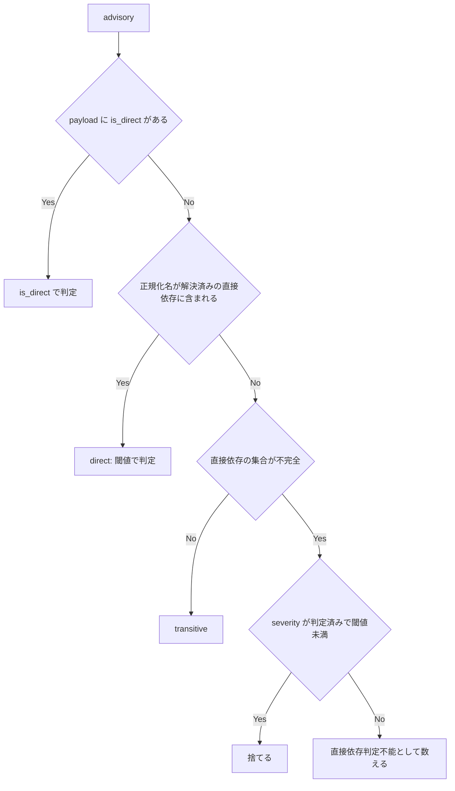

# Feature: sca-directness-resolution

## Overview

SCA 軸（軸 2）の直接依存の判定を、pip・cargo の両経路で正規化名による照合・tomllib によるマニフェストのパース・requirements の include 解決に置き換える。直接依存の集合が不完全なときは、判定できない advisory を transitive にせず、件数だけの summary 注記で報告する。要件の詳細は `feature-docs/sca-directness-resolution/REQUIREMENTS.md` を参照する。

## Objectives

- 直接依存の判定が取りこぼした direct dependency の advisory を、SCA 軸が黙って捨てないようにする。
- 直接依存を判定できなかったことを、transitive 扱いにせずスキャン結果に表す。

## User Stories

### US1: direct dependency の advisory を取りこぼさない

em-workflow 利用者として、マニフェストに有効な形式で宣言した直接依存の advisory を SCA 軸の findings として受け取りたい。

**Acceptance Criteria:**
- [ ] AC1: Cargo.toml が、cargo-audit の報告名と大文字小文字・区切り文字だけが異なる名前でクレートを宣言している（payload に `is_direct` が無い）とき、そのクレートの high / critical の advisory が finding になる。
- [ ] AC2: `[dependencies.serde]` を宣言した Cargo.toml で serde の finding が出る。`alias = { package = "real-name", version = "1" }` を宣言した Cargo.toml で real-name の finding が出る。
- [ ] AC3: `dependencies = ['requests[socks]>=2', 'django==3.2.0']`（シングルクォート）の pyproject.toml で、requests と django の両方が direct と判定される。
- [ ] AC4: `-r requirements/base.txt` だけを含む requirements.txt で、requirements/base.txt が宣言する名前が direct と判定される。
- [ ] AC7: プロジェクトルートの外を指す include（`..`・絶対パス・シンボリックリンク）は読まれない。include の循環は終了する。

### US2: 判定できなかったことが結果に現れる

em-workflow 利用者として、直接依存を判定できなかったときに、その事実をスキャン結果で知りたい。

**Acceptance Criteria:**
- [ ] AC5: FR5 の不完全ケースそれぞれで、対応する直接依存判定不能の summary 注記が正しい件数で出て、`skipped` は false のままで、診断情報なしの findings 0 件にならない。
- [ ] AC6: tomllib が使えないとき、pyproject.toml のスキャン単位は `pip_toml_parser_unavailable`、Cargo.toml のスキャン単位は `cargo_toml_parser_unavailable` を報告し、スキャナを起動しない。
- [ ] AC8: `python3 -m unittest discover -s tests` が通る。

## Technical Requirements

### Functional Requirements

- **FR1:** cargo 経路での正規化名による照合 — `normalize_cargo` は、既存の `canonical_pip_name` を宣言側のクレート名と報告されたクレート名の両方に適用してから、メンバシップを判定する。cargo-audit の payload のエントリに `is_direct` があるときは、引き続きそれで directness を決める。
- **FR2:** Cargo.toml の直接依存名を TOML パーサで得る — Cargo の直接依存名は、レビュー対象の Cargo.toml を tomllib でパースして得る。
    - 読むテーブルは `[dependencies]`・`[dev-dependencies]`・`[build-dependencies]`。トップレベルと `target.<cfg>` 配下の両方を読み、サブテーブル形式（`[dependencies.serde]`）も含める。
    - `package = "<name>"` を持つエントリは、キーではなく `<name>` を直接依存名にする。
    - `workspace = true` のエントリは、同じマニフェストの `[workspace.dependencies]` のエントリがリネームしている場合、そのパッケージ名を直接依存名にする。
- **FR3:** pyproject.toml の直接依存名を TOML パーサで得る — pyproject.toml の直接依存名は tomllib でパースして得る。
    - `[project].dependencies` の各 PEP 508 文字列から、パッケージ名だけを直接依存名にする。クォート形式と extras サフィックスの有無は問わない。
    - `[tool.poetry.dependencies]` と `[tool.poetry.dev-dependencies]` の各キーを直接依存名にする。`python` は除く。
    - 上記以外のテーブルは直接依存の宣言として扱わない。
- **FR4:** requirements の include 解決 — requirements ファイルの include を再帰的に辿る。
    - 辿る形式は `-r X`・`-rX`・`--requirement X`・`--requirement=X`。
    - `X` は include している側のファイルのディレクトリを基準に解決し、`_resolve_project_relative` を通してプロジェクトルート内に解決できなければならない。
    - 各ファイルは 1 回だけ訪れる。循環があってもエラーにせず再帰を終える。
    - include 先で宣言された名前は direct とする。
    - `-c` / `--constraint` のファイルは辿らない。
    - 行末のバックスラッシュは行の継続として扱う。
- **FR5:** 直接依存判定不能の件数注記 — スキャン単位の直接依存の集合が不完全なとき、パッケージが集合の解決済みの部分に含まれず、かつ severity が判定済みで閾値未満という理由ですでに捨てられるものでない advisory を、直接依存判定不能として数える。この advisory は finding にせず、transitive としても扱わない。
    - `run_scan` はエコシステムごとに件数を合計し、既存の注記の後ろに、件数が 0 でないものだけ次の注記を付け足す（先頭の半角スペースを含む。`advisory|advisories` は件数に応じていずれか）。
        - `' N pip advisory|advisories with undetermined directness (pip_directness_undetermined).'`
        - `' N cargo advisory|advisories with undetermined directness (cargo_directness_undetermined).'`
    - `skipped` と `skip_reason` は変えない。
    - 直接依存の集合が不完全になるのは次の場合。
        - マニフェストを解決・読み込み・パースできない
        - include がルート外を指す、存在しない、読めない、URL である
        - requirements の行から名前を解決できない
        - `[project]` の dependencies が dynamic で、静的なリストが無い
        - pyproject.toml に `[project]` の dependencies も Poetry のテーブルも無い
        - Cargo.toml の `[workspace]` が members を列挙している
- **FR6:** TOML パーサが無いときの明示的な skip — tomllib が使えず、スキャン単位の directness が pyproject.toml または Cargo.toml に依存するとき、そのスキャン単位は完了せず、スキャナを起動せず、固定の skip reason `pip_toml_parser_unavailable` または `cargo_toml_parser_unavailable` を報告する。requirements ファイルのスキャン単位と、既存の pip lockfile の挙動（`pip_direct_manifest_not_found`・`pip_lockfile_unconvertible`）は変えない。
- **FR7:** 回帰テスト — `tests/` 配下のテストで、4 つの再現手順、FR5 の不完全ケースそれぞれ、FR6 の skip（tomllib を None に差し替える）、include の封じ込めと循環を確かめる。

### Non-Functional Requirements

- **NFR1 - 依存:** 標準ライブラリだけを使う（tomllib は既存のガード付き import を通す）。実行時・テスト時の依存を増やさない。
- **NFR2 - 読み取り範囲:** プロジェクトルートの外のファイルは読まない。include やシンボリックリンク経由でも読まない。URL の include は取得しない。
- **NFR3 - 例外:** マニフェストや include の内容によって、例外が scan の外に出ない。失敗はすべて固定トークンか件数に対応づける。
- **NFR4 - 結果の文言:** summary と skip_reason には固定トークンと件数だけを載せる。マニフェストのパス・パッケージ名・advisory の本文は載せない。
- **NFR5 - 互換性:** npm と go の挙動は変えない。
- **NFR6 - version:** プラグインの version は編集しない（`.claude/rules/core-plugin-version-bump.md`）。

## Implementation Approach

### Architecture

**System Architecture:**

変更は `em-workflow/scripts/scan-dependencies.py` の pip・cargo の直接依存の判定に閉じる。

```
┌───────────────────────────────────────────────┐
│ run_scan（エコシステムごとの件数を集計・注記）│
├───────────────────────────────────────────────┤
│ normalize_pip / normalize_cargo               │
│ （canonical_pip_name による照合と分類）       │
├───────────────────────────────────────────────┤
│ 直接依存の集合の解決                          │
│ ・pyproject.toml / Cargo.toml: tomllib        │
│ ・requirements: include を再帰的に解決        │
│   （_resolve_project_relative で封じ込め）    │
└───────────────────────────────────────────────┘
```

**Component Diagram:**
```
マニフェスト ──> 直接依存の集合（解決済みの名前 + 不完全かどうか）
                        │
スキャナの報告 ──> normalize_pip / normalize_cargo ──> finding / transitive / 直接依存判定不能
                                                         │
                                                  run_scan ──> summary の注記
```

### Data Flow

advisory 1 件の分類（FR1・FR5）:



- severity も直接依存も判定できない advisory は、直接依存判定不能として 1 回だけ数える。

### API Design

該当なし

### Database Schema

該当なし

### Dependencies

**Internal Dependencies:**
- `canonical_pip_name`: pip・cargo 両経路の名前の正規化に使う（FR1）。
- `_resolve_project_relative`: requirements の include をプロジェクトルート内に封じ込める（FR4）。
- tomllib の既存のガード付き import: pyproject.toml / Cargo.toml のパースに使う（FR2・FR3・FR6）。

**External Dependencies:**
- なし（NFR1）

### File Structure

```
em-workflow/
└── scripts/
    └── scan-dependencies.py   # 直接依存の判定（pip・cargo）
tests/                         # 回帰テスト（FR7）
```

## Declared Change Set

このフィーチャー固有のパスは手動で列挙せず、create-plan で `workflow.yaml` の各タスクの `files` から導出する（`references/phases/create-plan-phase.md`）。

デフォルトで、次の 2 つのワークフロー生成エントリも宣言に含む。

- `feature-docs/sca-directness-resolution/**`
- `test-docs/sca-directness-resolution/**`

`feature-docs/sca-directness-resolution/**` に含まれるもの: `REQUIREMENTS.md`、`SPEC.md`、`IMPLEMENTATION.md`、`workflow.yaml`、`phase-state/`、`tasks/`、`reviews/roundN.yaml`、`VERIFICATION.md`、`retrospect.yaml`、およびデザインステップが生成するデザイン成果物。生成主体は各フェーズドキュメントおよび `references/phase-state.md` を参照（引用のみ、ルールは再掲しない）。

`test-docs/sca-directness-resolution/**` に含まれるもの: タスクごとのテスト記録 `test-docs/sca-directness-resolution/{T}.tests.yaml`。生成主体は `implement-phase.md` を参照（引用のみ、ルールは再掲しない）。

この 2 つのデフォルトエントリは、SPEC作成者が明示的に除外しない限り宣言に含まれる。除外は意図的な絞り込みであり、記載漏れによる省略ではない。

この宣言はスーパーセット（superset）の主張であり、検証時に観測される実際の変更集合は宣言に含まれる（CONTAINED IN）必要がある。implementタスクを1つも生成しないフィーチャーは `test-docs/sca-directness-resolution/` ディレクトリを生成しないが、宣言された `test-docs/sca-directness-resolution/**` は依然として正しい。生成されないパスが宣言されていても違反にはならない。

## Test Scenarios

### Unit Tests

- [ ] TS1: cargo の正規化照合 - Cargo.toml が `Foo_Bar` を宣言し、payload が `is_direct` なし・severity high で `foo-bar` を報告すると、finding が 1 件出る。
- [ ] TS2: cargo のサブテーブル - `version = '1'` を持つ `[dependencies.serde]` で、serde の advisory が finding になる。
- [ ] TS3: cargo のリネーム - `alias = { package = 'real-name', version = '1' }` で、real-name の advisory が finding になり、alias では一致しない。
- [ ] TS4: cargo の target テーブル - `[target.'cfg(unix)'.dependencies]` の `foo = '1'` で、foo の advisory が finding になる。
- [ ] TS5: cargo の workspace - `[workspace]` に members があり、宣言されていないクレートに advisory がある Cargo.toml で、finding は出ず、`cargo_directness_undetermined` の注記が件数 1 で出る。
- [ ] TS6: cargo のマニフェストが不正な TOML - advisory が `cargo_directness_undetermined` として数えられる。
- [ ] TS7: pyproject のシングルクォートと extras - requests と django の両方が direct になる。
- [ ] TS8: pyproject の dynamic dependencies - advisory が `pip_directness_undetermined` として数えられる。
- [ ] TS9: requirements の `-r` include（単純なものと入れ子） - include 先の名前が direct になる。`-rX`・`--requirement X`・`--requirement=X` の各形式も動く。
- [ ] TS10: ルートの外を指す include、またはルートの外へのシンボリックリンク - ファイルは読まれず、advisory は判定不能として数えられる。
- [ ] TS11: requirements の include の循環 - スキャンは終了し、両ファイルの名前が direct になる。
- [ ] TS12: requirements の `-c constraints.txt` - 辿らず、判定不能としても数えない。
- [ ] TS13: 素の URL またはローカルパスだけの requirements の行 - 直接依存の集合が不完全になり、列挙されていないパッケージの advisory が数えられる。
- [ ] TS14: 直接依存の集合が完全で、宣言されていないパッケージがある - transitive のままで、注記は出ない。
- [ ] TS15: tomllib を None に差し替える - pyproject.toml と Cargo.toml のスキャン単位はそれぞれの `*_toml_parser_unavailable` を報告し、スキャナを起動しない。requirements.txt のスキャン単位は完了する。
- [ ] TS16: 注記の順序と文言 - 直接依存判定不能の注記は、既存の pip の severity・unpinnable・go の注記の後ろに付き、パッケージ名やパスを含まない。

### Integration Tests

該当なし

### E2E Tests

**Existing E2E tests**: None
**Run command**: Not detected
- [ ] Existing E2E tests pass without regression

テストの実行コマンド: `python3 -m unittest discover -s tests`（AC8）

### Edge Cases

- [ ] include の循環: TS11
- [ ] `-c` / `--constraint`: TS12
- [ ] 名前を解決できない requirements の行: TS13
- [ ] 直接依存の集合が完全な場合の宣言されていないパッケージ: TS14

### Performance Tests

該当なし

## Security Considerations

- **Authentication:** 該当なし
- **Authorization:** 該当なし
- **Input Validation:** マニフェストや include の内容によって例外が scan の外に出ず、失敗はすべて固定トークンか件数に対応づける（NFR3）。
- **Data Protection:** プロジェクトルートの外のファイルは、include やシンボリックリンク経由でも読まない。URL の include は取得しない（NFR2）。summary と skip_reason には固定トークンと件数だけを載せる（NFR4）。
- **XSS Prevention:** 該当なし
- **SQL Injection Prevention:** 該当なし
- **CSRF Protection:** 該当なし

## Error Handling

### Error Codes

| トークン | 載る場所 | 条件 | skipped |
|----------|----------|------|---------|
| `pip_directness_undetermined` | summary の件数注記 | pip のスキャン単位で直接依存の集合が不完全で、判定できない advisory がある（FR5） | false のまま |
| `cargo_directness_undetermined` | summary の件数注記 | cargo のスキャン単位で直接依存の集合が不完全で、判定できない advisory がある（FR5） | false のまま |
| `pip_toml_parser_unavailable` | skip_reason | tomllib が使えず、directness が pyproject.toml に依存する（FR6） | スキャン単位は完了しない |
| `cargo_toml_parser_unavailable` | skip_reason | tomllib が使えず、directness が Cargo.toml に依存する（FR6） | スキャン単位は完了しない |

既存の `pip_direct_manifest_not_found`・`pip_lockfile_unconvertible` は変えない。

### Error Flow

```
マニフェスト / include の失敗 → 直接依存の集合を不完全とする → 判定できない advisory を数える → run_scan が件数注記を付ける
tomllib が無い → スキャン単位を skip（スキャナは起動しない）→ 固定の skip reason
```

## Performance Optimization

該当なし

## Success Criteria

- [ ] All functional requirements are implemented and tested
- [ ] All test scenarios pass
- [ ] Security requirements are satisfied
- [ ] Code review is completed
- [ ] AC1〜AC8 を満たす

## Open Questions

> **Note**: 未解決の要件は workflow.yaml で `status: tbd` として管理されています。
> plan フェーズの実行前に解決してください。

なし

## Implementation Phases (if applicable)

該当なし

## References

- 要件定義書: `feature-docs/sca-directness-resolution/REQUIREMENTS.md`
- 対象スクリプト: `em-workflow/scripts/scan-dependencies.py`
- version のルール: `.claude/rules/core-plugin-version-bump.md`
