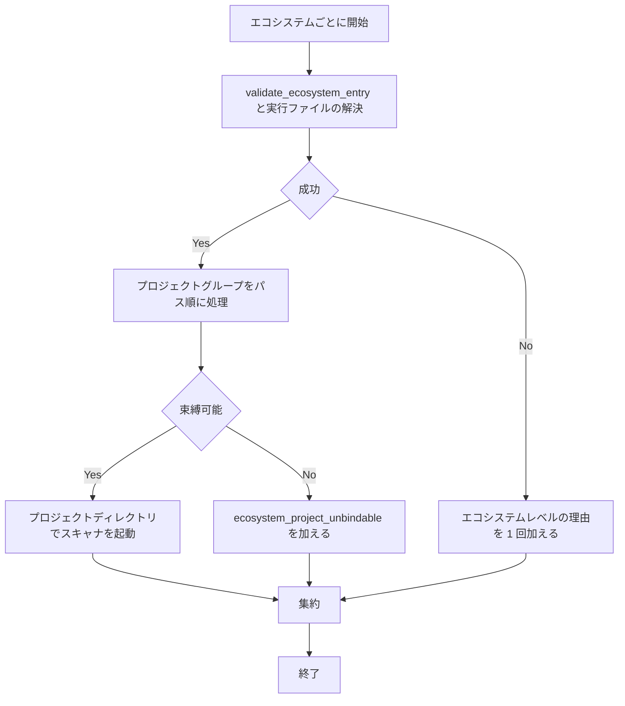

# sca-per-project-scan-binding - 要件定義書

## 1. 概要

### 1.1 背景

SCA 軸（`scan-dependencies.py scan`）で、npm / cargo / go のスキャンはリポジトリルートで実行される。`build_scan_job` がターゲットを追加するのは pip のときだけで、npm / cargo / go の argv は `[executable] + args`、cwd は `project_root` 固定になっている。`manifest_file` は finding の file ラベルを変えるだけで、走査対象には影響しない。

このため、`services/api/package.json` の変更に対して `npm audit` がリポジトリルートで走り、別の依存集合を監査した結果に `services/api/package.json` のラベルが付く。また `manifest_file_for` は最初にマッチした変更ファイルだけを返し、エコシステムごとに 1 ジョブしか作らないため、別ディレクトリにある 2 つ目の `package.json` の変更は走査されず、`skip_reason` も出ずに `skipped: false` になる。

### 1.2 目的

- SCA 軸の npm / cargo / go のスキャンを、変更されたマニフェスト / lockfile を含むプロジェクトディレクトリに束縛する
- 1 エコシステム内で別ディレクトリにある複数プロジェクトの変更を、プロジェクトごとに走査するか、機械可読で安定した `skip_reason` で報告する
- findings の file ラベルが、実際に監査した依存集合のプロジェクトを指すようにする

### 1.3 スコープ

- `em-workflow/scripts/scan-dependencies.py` の `run_scan` / `build_scan_job` / `build_scan_jobs` / `manifest_file_for` 周辺のプロジェクト単位のグループ化と束縛
- `vuln-scanners.yaml` の npm の args、go の子プロセス環境の固定値
- `em-workflow/references/review-phase.md` の axis-2 の partial coverage 段落（追記のみ）
- 既存テストフィクスチャの更新と、再発を検出するテストの追加
- em-workflow の version は手で変更しない

## 2. ビジネス要件

### 2.1 ビジネス目標

- SCA 軸（scan-dependencies.py scan）の npm / cargo / go のスキャンが、変更されたマニフェスト / lockfile を含むプロジェクトディレクトリに束縛される
- 1 エコシステム内で別ディレクトリにある複数プロジェクトの変更が、プロジェクトごとに走査されるか、機械可読で安定した skip_reason で報告される
- findings の file ラベルが、実際に監査した依存集合のプロジェクトを指す

### 2.2 対象ユーザー

| ユーザータイプ | 説明 |
|----------------|------|
| em-workflow / em-review の利用者 | モノレポやネストしたプロジェクトを持つリポジトリで、レビューの SCA 軸を使う |

### 2.3 期待される効果

- ネストしたプロジェクトの変更に対して、そのプロジェクトの依存集合が監査される
- 走査できなかったプロジェクトが `skipped: true` と `skip_reason` で報告される

## 3. ユースケース

### 3.1 ユースケース一覧

| ID | ユースケース名 | アクター |
|----|----------------|----------|
| UC01 | ネストしたプロジェクトの変更を走査する | SCA 軸（scan-dependencies.py scan） |
| UC02 | 同じエコシステムの複数プロジェクトの変更を走査する | SCA 軸（scan-dependencies.py scan） |
| UC03 | 束縛できないプロジェクトを報告する | SCA 軸（scan-dependencies.py scan） |

### 3.2 ユースケース詳細

#### UC01: ネストしたプロジェクトの変更を走査する

**アクター**: SCA 軸（scan-dependencies.py scan）

**事前条件**:
- `services/api/package.json` と `services/api/package-lock.json` がある
- `changed_files` が `["services/api/package.json"]`

**基本フロー**:
1. run_scan が変更ファイルを (エコシステム, プロジェクト相対ディレクトリ) でグループ化する
2. run_scan がプロジェクトの束縛可能条件とパスを検証する
3. npm を cwd `project_root/services/api` で起動する

**事後条件**:
- finding の file は `services/api/package.json` になる

#### UC02: 同じエコシステムの複数プロジェクトの変更を走査する

**アクター**: SCA 軸（scan-dependencies.py scan）

**事前条件**:
- `services/api` と `services/web` の両方に `package.json` と `package-lock.json` がある
- 両方の `package.json` が変更されている

**基本フロー**:
1. run_scan が 2 つのプロジェクトグループを作る
2. グループをプロジェクト相対パス順に処理し、npm をそれぞれのディレクトリを cwd として起動する

**事後条件**:
- npm は 2 回起動され、各プロジェクトの findings がそのパスのラベルで返る

#### UC03: 束縛できないプロジェクトを報告する

**アクター**: SCA 軸（scan-dependencies.py scan）

**事前条件**:
- 変更されたプロジェクトが、アンカーまたは必須マニフェストを欠く、もしくはパス検証に失敗する

**基本フロー**:
1. run_scan が束縛可能条件とパスを検証し、束縛不可と判定する
2. スキャナを起動せず、`<ecosystem>_project_unbindable` を理由に加える

**代替フロー**:
- 同じエコシステムに束縛できたプロジェクトがあれば、そのプロジェクトは走査され、findings は保持される

**事後条件**:
- 結果は `skipped: true` になり、集約した `skip_reason` が付く
- ルートレベルのスキャンや祖先ディレクトリへのフォールバックは起きない

## 4. 機能要件

### 4.1 機能一覧

| ID | 機能名 | 説明 |
|----|--------|------|
| FR1 | プロジェクト単位のグループ化 | 変更ファイルを (エコシステム, 検証済みプロジェクト相対ディレクトリ) でグループ化する |
| FR2 | グループ内のターゲット選択 | 各グループのターゲットと file ラベルを manifest_file_for の既存ルールで 1 つ選ぶ |
| FR3 | 1 プロジェクトにつき 1 スキャン単位 | npm / cargo / go の cwd をプロジェクトディレクトリにする |
| FR4 | 束縛可能条件（アンカーファイル） | アンカーと必須の同階層マニフェストを持つときだけ束縛する |
| FR5 | npm / cargo / go の厳格なパス検証 | 変更ファイル、ディレクトリ、アンカー、マニフェストを検証する |
| FR6 | 束縛できないプロジェクトの扱い | スキャナを起動せず `<ecosystem>_project_unbindable` を加える |
| FR7 | skip_reason の集約形式 | パスを含まない理由を重複除去・ソートして "+" で連結する |
| FR8 | プロジェクトをまたいだ部分カバレッジ | 未完了のプロジェクトがあれば skipped: true、完了分の findings は保持する |
| FR9 | エコシステムレベルの検査順 | エコシステム検証と実行ファイル解決を束縛より前に 1 回行う |
| FR10 | pip のグループ化 | pip もプロジェクトディレクトリごとにグループ化し、既存の挙動は保つ |
| FR11 | 祖先ワークスペースへの脱出防止 | npm に --workspaces=false、go に GOWORK=off と GOFLAGS=-mod=readonly |
| FR12 | build_scan_job / build_scan_jobs の純粋性 | ファイルの読み書きもプロセスの起動もしない |
| FR13 | review-phase.md の axis-2 段落の拡張 | 複数プロジェクトの partial coverage を追記する |
| FR14 | 既存テストフィクスチャの更新 | マニフェストとアンカーを作る形、--workspaces=false を含む argv に更新する |

### 4.2 機能詳細

#### FR1: プロジェクト単位のグループ化

**説明**: run_scan は、選択された各エコシステム（npm / cargo / go / pip）の変更ファイル（マニフェストと lockfile）を (エコシステム, 検証済みプロジェクト相対ディレクトリ) でグループ化する。ルートのディレクトリは `""` とする。同じディレクトリの別表記（重複や、同じディレクトリへ解決されるエイリアス）は 1 グループにまとめる。グループはプロジェクト相対パス順に処理する。

#### FR2: グループ内のターゲット選択

**説明**: 各グループの走査ターゲットと finding の file ラベルは、そのグループの変更ファイルに既存の manifest_file_for の入力順ルールを適用して 1 つ選ぶ（pip は lockfile 優先、npm / cargo / go はマニフェスト優先）。

#### FR3: 1 プロジェクトにつき 1 スキャン単位

**説明**: 1 つのプロジェクトグループにつき、1 つのスキャン単位を作る。npm / cargo / go のジョブの cwd はそのプロジェクトディレクトリとし、argv は `[実行ファイルの絶対パス] + registry の args` とする。pip の lockfile で同名の複数バージョンを分割実行する場合、1 スキャン単位の中で複数のサブプロセスを起動する形は維持する。

#### FR4: 束縛可能条件（アンカーファイル）

**説明**: npm / cargo / go のプロジェクトを束縛できるのは、そのディレクトリが project_root の下に収まり（realpath で判定）、エコシステムのアンカーと、必須の同階層マニフェストの両方を持つときだけとする。この条件はルートのプロジェクトにも同じく適用する。

**ビジネスルール**:

| エコシステム | アンカー | 必須マニフェスト |
|--------------|----------|------------------|
| npm | `npm-shrinkwrap.json` または `package-lock.json`（両方あれば `npm-shrinkwrap.json`） | `package.json` |
| cargo | `Cargo.lock` | `Cargo.toml` |
| go | `go.mod` | `go.mod` |

#### FR5: npm / cargo / go の厳格なパス検証

**説明**: npm / cargo / go について run_scan は、グループのすべての変更ファイル、プロジェクトディレクトリ、アンカー、必須マニフェストを検証する。祖先ディレクトリへのフォールバックはしない。

**バリデーション**:

| 項目 | ルール | 不合格時 |
|------|--------|----------|
| 変更ファイル / プロジェクトディレクトリ / アンカー / 必須マニフェスト | project_root 配下に収まる（realpath） | 束縛不可 |
| 同上 | 絶対パスでない | 束縛不可 |
| 同上 | `..` で外に出ない | 束縛不可 |
| 同上 | 解決時に例外が出ない | 束縛不可 |
| アンカー / 必須マニフェスト | 同じプロジェクトディレクトリの中に解決される通常ファイルである（別のディレクトリへ解決されるシンボリックリンクは不可） | 束縛不可 |
| 選択したターゲット | 削除されていない | 束縛不可 |
| プロジェクトディレクトリ | 存在する | 束縛不可 |

#### FR6: 束縛できないプロジェクトの扱い

**説明**: 束縛できないプロジェクトではスキャナを起動せず、ルートレベルのスキャンにも畳み込まない。理由として、パスを含まない `<ecosystem>_project_unbindable`（`npm_project_unbindable` / `cargo_project_unbindable` / `go_project_unbindable`）を加える。

#### FR7: skip_reason の集約形式

**説明**: 集約した skip_reason は、パスを含まない理由を重複除去してソートし、`"+"` で連結した文字列とする。エコシステムレベルの理由（例: `<ecosystem>_tool_not_found`）は 1 回だけ現れる。

#### FR8: プロジェクトをまたいだ部分カバレッジ

**説明**: 1 エコシステムの中で 1 つでも未完了のプロジェクトがあれば、結果は `skipped: true` とし、集約した skip_reason を付ける。完了したプロジェクトの findings は保持する。summary に出すエコシステム名は重複させない。

#### FR9: エコシステムレベルの検査順

**説明**: validate_ecosystem_entry と実行ファイルの解決はエコシステムごとに 1 回、プロジェクト単位の束縛より前に行う。エコシステムの検証に失敗した場合や実行ファイルが見つからない場合は、そのエコシステムのグループについて束縛検査もスキャナの起動もしない。

**処理フロー**:

#### FR10: pip のグループ化

**説明**: pip の変更ファイルもプロジェクトディレクトリごとにグループ化する。各グループのターゲットは既存ルール（lockfile 優先）で選ぶ。pip の argv / target の形式と cwd（project_root）は変えない。既存の lockfile 変換、固定の skip reason（`pip_lockfile_unconvertible` / `pip_direct_manifest_not_found` など）、プロジェクト内シンボリックリンクの許容、同名複数バージョンの分割実行はそのまま残す。pip の検証は既存のまま変えない。

#### FR11: 祖先ワークスペースへの脱出防止

**説明**: `vuln-scanners.yaml` の npm の args に `--workspaces=false` を加える。go の子プロセス環境の固定値に `GOWORK=off` と `GOFLAGS=-mod=readonly` を入れる（GOFLAGS を空にする既存の固定値はこれに置き換える）。cargo には何も追加しない。

#### FR12: build_scan_job / build_scan_jobs の純粋性

**説明**: build_scan_job と build_scan_jobs は、ファイルの読み書きもプロセスの起動もしない。束縛検査（アンカー、パス検証）は run_scan で行う。build_scan_jobs は、選択されたエコシステムのプロジェクトグループ 1 つにつき 1 ジョブを返す。

#### FR13: review-phase.md の axis-2 段落の拡張

**説明**: `em-workflow/references/review-phase.md` の partial coverage 段落を追記だけで拡張し、1 エコシステム内の複数プロジェクトを扱うようにする。"partial coverage" という語は残し、既存の文言は書き換えない。

#### FR14: 既存テストフィクスチャの更新

**説明**: lockfile を置かずに npm / cargo / go を起動している既存の run_scan フィクスチャは、マニフェストとアンカーを作る形に更新する。npm の argv を固定している既存テストも、`--workspaces=false` を含む形に更新する。

**エラーケース**:

| エラー | 条件 | 対応 |
|--------|------|------|
| `<ecosystem>_project_unbindable` | FR4 / FR5 の条件を満たさない | スキャナを起動しない（FR6） |
| `<ecosystem>_tool_not_found` | 実行ファイルが PATH にない | 束縛検査をせず、理由を 1 回だけ加える（FR7 / FR9） |

## 5. 非機能要件

| ID | 要件名 | 内容 |
|----|--------|------|
| NFR1 | 読み取り専用 | scan はレビュー対象のプロジェクトツリーにファイルを作らず、変更もしない。lockfile の生成もしない。 |
| NFR2 | 決定性 | 同じ入力に対しては、バイト単位で同一の結果 JSON を出す。入力全体の並べ替えに対する不変性は、集約した skip_reason 以外には求めない。 |
| NFR3 | パスを含まない理由文字列 | skip_reason にはパスを含めない。 |
| NFR4 | テストの依存 | テストモジュールが import するのは標準ライブラリだけとする。実在のスキャナは実行せず、一時 PATH に置いたスタブを使う。 |
| NFR5 | 出力スキーマ | scan の出力は review-output-schema.json に適合する。 |

### 5.1 パフォーマンス要件
該当なし

### 5.2 セキュリティ要件
- 入力検証: FR5 のパス検証

### 5.3 可用性要件
該当なし

### 5.4 保守性要件
- ドキュメント: FR13

### 5.5 互換性要件
- pip の argv / target の形式、cwd、既存の skip reason は変えない（FR10）

## 6. UI/UX要件

該当なし（UI を持たない CLI スクリプトとテストの変更）

## 7. データ要件

### 7.1 データモデル概要
該当なし

### 7.2 データ項目

| エンティティ | 項目名 | 型 | 必須 | 説明 |
|--------------|--------|-----|------|------|
| scan 結果（エコシステム単位） | skipped | bool | ○ | 未完了のプロジェクトが 1 つでもあれば true（FR8） |
| scan 結果（エコシステム単位） | skip_reason | string | × | パスを含まない理由を重複除去・ソートして "+" で連結（FR7） |
| finding | file | string | ○ | グループで選んだターゲットのプロジェクト相対パス（FR2） |

### 7.3 データ保持期間
該当なし

## 8. 外部連携

### 8.1 連携システム

| システム名 | 連携方法 | データ |
|------------|----------|--------|
| npm | サブプロセス（cwd はプロジェクトディレクトリ） | `audit --json --workspaces=false` の出力 |
| cargo-audit | サブプロセス（cwd はプロジェクトディレクトリ） | 監査結果 |
| go の registry 実行ファイル | サブプロセス（cwd はプロジェクトディレクトリ、`GOWORK=off`、`GOFLAGS=-mod=readonly`） | 監査結果 |
| pip の registry 実行ファイル | サブプロセス（cwd は project_root のまま） | 監査結果 |

### 8.2 API仕様要件
- scan の出力は review-output-schema.json に適合する（NFR5）

## 9. 制約条件

### 9.1 技術的制約
- テストモジュールが import するのは標準ライブラリだけ（NFR4）
- build_scan_job / build_scan_jobs はファイルの読み書きもプロセスの起動もしない（FR12）
- em-workflow の version は手で変更しない

### 9.2 ビジネス上の制約
なし

### 9.3 スケジュール制約
なし

### 9.4 宣言された変更集合

このフィーチャー固有のパスは手動で列挙せず、create-plan で `workflow.yaml` の各タスクの `files` から導出する（`references/phases/create-plan-phase.md`）。

**デフォルトメンバー**（SPEC作成者が明示的に除外しない限り、常に宣言に含まれる）:
- `feature-docs/sca-per-project-scan-binding/**`
- `test-docs/sca-per-project-scan-binding/**`

`feature-docs/sca-per-project-scan-binding/**` に含まれるもの: `REQUIREMENTS.md`、`SPEC.md`、`IMPLEMENTATION.md`、`workflow.yaml`、`phase-state/`、`tasks/`、`reviews/roundN.yaml`、`VERIFICATION.md`、`retrospect.yaml`、およびデザインステップが生成するデザイン成果物。生成主体は各フェーズドキュメントおよび `references/phase-state.md` を参照（引用のみ、ルールは再掲しない）。

`test-docs/sca-per-project-scan-binding/**` に含まれるもの: `{T}.tests.yaml`（パス形式: `test-docs/sca-per-project-scan-binding/{T}.tests.yaml`）。生成主体は `implement-phase.md` を参照（引用のみ、ルールは再掲しない）。

**意味論**:
- デフォルトのメンバーは、SPEC作成者が明示的に除外しない限り宣言に含まれる。除外は意図的な絞り込みであり、記載漏れによる省略ではない。
- この宣言はスーパーセット（superset）の主張であり、実際の変更集合は宣言に含まれる（CONTAINED IN）必要がある。実際には生成されないパスが宣言されていても違反にはならない。implementタスクを1つも生成しないフィーチャーは `test-docs/sca-per-project-scan-binding/` ディレクトリを生成しないが、宣言された `test-docs/sca-per-project-scan-binding/**` は依然として正しい。

## 10. 想定される課題とリスク

### 10.1 技術的課題
なし

### 10.2 ビジネスリスク
なし

## 11. 成功基準

### 11.1 受け入れ基準

- [ ] AC-1: services/api/package.json と services/api/package-lock.json があり、changed_files が ["services/api/package.json"] のとき、npm スタブの cwd は project_root/services/api になる。finding の file は services/api/package.json になる。
- [ ] AC-2: services/api と services/web の両方に package.json と package-lock.json があり、両方の package.json が変更されたとき、npm は 2 回起動される。cwd はそれぞれのディレクトリで、各プロジェクトの findings がそのパスのラベルで返る。
- [ ] AC-3: package.json があって package-lock.json と npm-shrinkwrap.json のどちらもないプロジェクトでは npm を起動しない。結果は skipped: true、skip_reason: "npm_project_unbindable" になる。ルートのプロジェクトでも同じになる。
- [ ] AC-4: 束縛できる npm プロジェクトと束縛できない npm プロジェクトが混在すると、結果は skipped: true、skip_reason: "npm_project_unbindable" になる。束縛できたプロジェクトの findings は保持され、summary に npm は 1 回だけ現れる。
- [ ] AC-5: Cargo.toml だけがあって Cargo.lock がないプロジェクトでは cargo-audit を起動しない。skip_reason は cargo_project_unbindable になり、プロジェクトツリーは変化しない。
- [ ] AC-6: go.sum だけが変更され、同じディレクトリに go.mod があれば束縛して起動する。go.mod がなければ go_project_unbindable になる。
- [ ] AC-7: アンカーまたはマニフェストが別ディレクトリへ解決されるシンボリックリンクの場合、変更ファイルが絶対パスや '..' で外に出るパスの場合、解決できないパスの場合、選択したターゲットが削除されている場合は、いずれも <ecosystem>_project_unbindable になり、スキャナは起動されない。ルートのプロジェクトや祖先ディレクトリへフォールバックしない。
- [ ] AC-8: 同じディレクトリを別表記で指す変更ファイルは 1 グループにまとまり、起動は 1 回になる。
- [ ] AC-9: 束縛できない npm プロジェクトが 2 つあるとき、skip_reason は "npm_project_unbindable"（1 回）になる。エコシステムレベルの理由も重複しない。
- [ ] AC-10: npm ジョブの argv に --workspaces=false が含まれる。go ジョブの env で GOWORK=off、GOFLAGS=-mod=readonly になっている。
- [ ] AC-11: 2 つのディレクトリの pip マニフェスト / lockfile が変更されると、pip はグループごとに既存ルールで監査される。cwd は project_root のまま変わらない。既存の pip lockfile テストは通る。
- [ ] AC-12: 実行ファイルが PATH にない場合、skip_reason は <ecosystem>_tool_not_found の 1 回だけになり、束縛検査は行われない。
- [ ] AC-13: build_scan_job と build_scan_jobs は、ファイルを開かず、プロセスも起動しない。
- [ ] AC-14: review-phase.md の axis-2 段落が複数プロジェクトの partial coverage を述べている。既存の固定文言を検査するテストは通る。
- [ ] AC-15: 再現手順（モノレポで services/api/package.json を変更して scan を実行する、さらに services/web/package.json も同時に変更する）で、現象が起きないことをテストで検出できる。
- [ ] AC-16: python3 -m unittest discover -s tests が成功する。

### 11.2 KPI
なし

## 12. テストシナリオ

### 12.1 テスト観点

| ID | 対象の受け入れ基準 | シナリオ |
|----|--------------------|----------|
| TS-1 | AC-1, AC-15 | ネストした npm プロジェクト 1 つを変更する。cwd を記録するスタブで、cwd とラベルを確認する。 |
| TS-2 | AC-2, AC-15 | services/api と services/web を同時に変更し、起動回数と各 cwd、findings のラベルを確認する。 |
| TS-3 | AC-3, AC-5, AC-6 | npm / cargo / go それぞれでアンカーを欠いたプロジェクトを作り、未起動であることと <ecosystem>_project_unbindable を確認する。ルートのプロジェクトのケースも含める。 |
| TS-4 | AC-4, AC-9 | 束縛できるプロジェクトとできないプロジェクトを混在させ、skipped / skip_reason の重複除去 / findings の保持 / summary のエコシステム名の重複がないことを確認する。 |
| TS-5 | AC-7 | 外部を指すシンボリックリンクのアンカーやマニフェスト、絶対パス、'..' で外に出るパス、NUL を含むパス、削除済みのターゲット、存在しないディレクトリで、未起動であることと unbindable を確認する。 |
| TS-6 | AC-8 | 'a/package.json' と 'a/./package-lock.json' のような別表記で、1 グループ・1 回の起動になることを確認する。 |
| TS-7 | AC-10, AC-13 | build_scan_job の argv と env を検査する（npm の --workspaces=false、go の GOWORK / GOFLAGS）。open や subprocess をモックして純粋性を確認する。 |
| TS-8 | AC-11 | 2 ディレクトリの pip 変更で、グループごとの監査と cwd が project_root のままであることを確認する。既存の pip lockfile テストを全件通す。 |
| TS-9 | AC-12 | 実行ファイルがない状態で、tool_not_found が 1 回だけになり、束縛検査が行われないことを確認する。 |
| TS-10 | AC-5 | スキャン前後で git status --porcelain が一致する（lockfile が生成されない）ことを確認する。 |
| TS-11 | AC-14 | review-phase.md の R2 セクションに、複数プロジェクトの partial coverage の記述と既存の固定文言の両方があることを確認する。 |
| TS-12 | AC-16 | 既存フィクスチャ（マニフェストとアンカーを追加したもの）を含めてテスト全体を実行する。 |

## 13. 用語定義

| 用語 | 定義 |
|------|------|
| プロジェクトグループ | (エコシステム, 検証済みプロジェクト相対ディレクトリ) で識別される変更ファイルの集まり。ルートのディレクトリは `""` |
| アンカー | プロジェクトを束縛できる条件となるエコシステムごとのファイル（npm: `npm-shrinkwrap.json` / `package-lock.json`、cargo: `Cargo.lock`、go: `go.mod`） |
| 束縛 | スキャナの cwd をプロジェクトディレクトリにして起動すること |
| スキャン単位 | 1 プロジェクトグループに対応するジョブ。pip の同名複数バージョンの分割実行では複数のサブプロセスを含む |
| partial coverage | 1 エコシステムの中で未完了のプロジェクトがあり、`skipped: true` と集約した skip_reason を返しつつ、完了したプロジェクトの findings を保持する状態 |

## 14. 確認事項

### 14.1 確認済み事項

- [x] 束縛の前提条件（A-1）: プロジェクトを束縛できるのは、ディレクトリが project_root の下に収まり（realpath）、エコシステムのアンカーを持つときだけ。npm は package-lock.json か npm-shrinkwrap.json（両方あれば shrinkwrap）、cargo は Cargo.lock、go は go.mod。アンカーがなければスキャナを起動せず、skip_reason は <ecosystem>_project_unbindable。ルートのプロジェクトにも適用する。検査は run_scan で行い、build_scan_job / build_scan_jobs は純粋に保つ。lockfile なしで npm / cargo を起動している既存の run_scan フィクスチャは、マニフェストとアンカーを作る形に更新する。
- [x] skip_reason の形（A-2）: パスを含まない新しい理由 <ecosystem>_project_unbindable を使う。集約した skip_reason は、パスを含まない理由を重複除去・ソートした集合を "+" で連結したもの。エコシステムレベルの理由（例: <ecosystem>_tool_not_found）は 1 回だけ現れる。
- [x] pip の範囲（A-3）: pip の変更ファイルもプロジェクトディレクトリごとにグループ化する。各グループは既存ルール（lockfile 優先）でターゲットを選ぶ。pip の argv / target の形式と cwd（project_root）は変えない。既存の lockfile 変換、固定の skip reason、プロジェクト内シンボリックリンクの許容、同名複数バージョンの分割実行は残す。
- [x] アンカー検証の厳格さ（A-4）: npm / cargo / go について run_scan は、グループのすべての変更ファイル、プロジェクトディレクトリ、アンカー、必須の同階層マニフェスト（npm は package.json、cargo は Cargo.toml、go は go.mod）を検証する（realpath で project_root 配下、絶対パスでない、".." で外に出ない、解決時に例外が出ない）。アンカーとマニフェストは同じプロジェクトディレクトリの中に解決される通常ファイルでなければならず、別ディレクトリへ解決されるシンボリックリンクは束縛不可。選択したターゲットの削除やディレクトリの欠如も束縛不可で、祖先ディレクトリへフォールバックしない。pip は既存の検証とプロジェクト内シンボリックリンクの許容を保つ。
- [x] ワークスペースからの脱出（A-5）: npm の registry args（vuln-scanners.yaml）に argv フラグ --workspaces=false を加え、npm の祖先ワークスペースルートの検出をプロジェクトディレクトリで止める。go の子プロセス環境の固定値に GOWORK=off と GOFLAGS=-mod=readonly を加える。cargo は追加なし（cargo-audit は ./Cargo.lock を読む）。
- [x] プロジェクトグループの意味（A-6）: グループの識別は (エコシステム, 検証済みプロジェクト相対ディレクトリ; ルートは "")。同じディレクトリの重複・エイリアス表記は 1 グループにまとめる。グループはプロジェクト相対パス順に処理する。グループ内では manifest_file_for の既存の入力順ルールでターゲット / ラベルを 1 つ選ぶ。入力全体の並べ替え不変性は集約した skip_reason 以外には求めない。「1 プロジェクトにつき 1 ジョブ」は 1 プロジェクトにつき 1 スキャン単位を指す（pip lockfile の同名分割実行は複数のサブプロセスのまま）。partial coverage は 1 エコシステム内のプロジェクトをまたいで適用し、未完了のプロジェクトがあれば skipped: true と集約した skip_reason、完了したプロジェクトは findings を保持する。summary のエコシステム名は重複させない。review-phase.md の axis-2 段落は追記だけで複数プロジェクトを扱うよう拡張し、"partial coverage" の語を残す。
- [x] デザインステップ（A-7）: analyst の推奨を受け入れ、デザインステップを省略する。
- [x] npm の args（A-8）: vuln-scanners.yaml の npm args は [audit, --json, --workspaces=false] とする（既存 2 要素の後ろに追加）。
- [x] yarn.lock / pnpm-lock.yaml（A-9）: 引き続き npm を選択するが、アンカー（package-lock.json / npm-shrinkwrap.json）にはならない。そのため、これらしか持たないプロジェクトは npm_project_unbindable になる。
- [x] パス検証に失敗した変更ファイル（A-10）: 絶対パス、'..' で外に出るパス、解決できないパスの変更ファイルは、どのグループにも属さない。そのファイルは <ecosystem>_project_unbindable を加え、ルートや他の有効なグループには合流しない。他の有効なグループの走査も妨げない。
- [x] build_scan_jobs のグループ化（A-11）: 純粋性を保つため、build_scan_jobs はファイルシステムに触れずに字句上正規化したプロジェクト相対ディレクトリでグループ化する。realpath による検証済みのグループ化は run_scan が行う。
- [x] build_scan_job の cwd（A-12）: npm / cargo / go の cwd は、project_root とターゲットのディレクトリを字句的に結合して得る。ルートのプロジェクトでは str(project_root) と一致させる（既存テストの '/proj' の固定値を保つ）。run_scan は検証済みのプロジェクト相対ターゲットを渡す。
- [x] version（A-13）: em-workflow の version は手で変更しない（GitHub Actions が patch を上げる）。

### 14.2 未確認・保留事項
なし

## 15. 参考資料

- `em-workflow/scripts/scan-dependencies.py`: `build_scan_job`（1648 行付近）、`manifest_file_for`、`run_scan`、`build_scan_jobs`
- `em-workflow/references/review-phase.md`: axis-2 の partial coverage 段落
- 出典の finding: em-workflow レビュー round 2 の `20f7f988c9400af6`（round 1 の未解決 finding `9a56747dc5389bdb` / `6e8a02d94f7b3c15` の残件）
