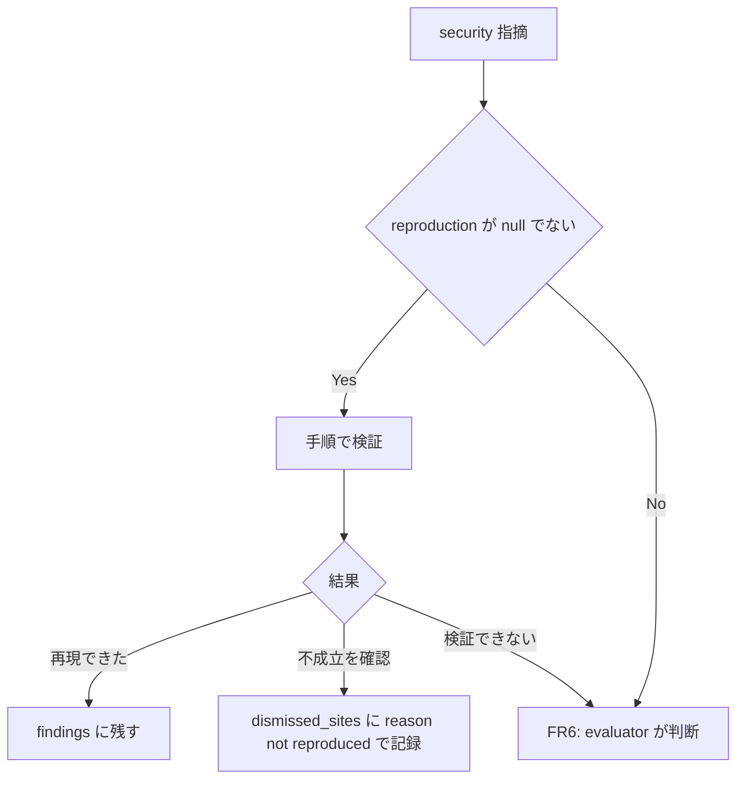
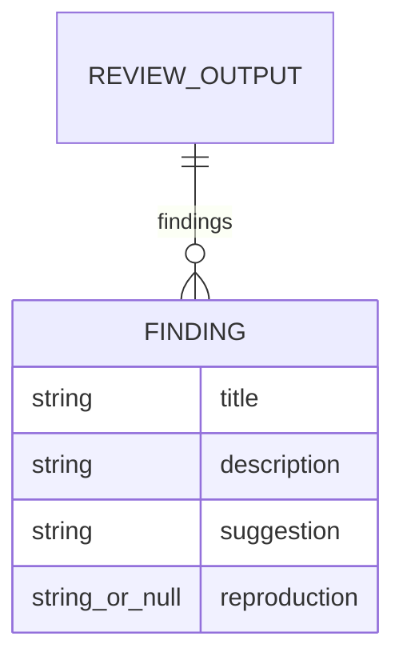

# security-review-repro-steps - 要件定義書

## 1. 概要

### 1.1 背景
`em-workflow/references/review-output-schema.json` と `review-security` スキルには、再現方法を書く項目や指示が無い。

### 1.2 目的
- セキュリティレビューを収束させる。
- セキュリティ観点の指摘に、再現手順かそれに準ずる確認方法を付けてもらう。
- Claude Code がその手順で検証し、確かなものだけ対応する。
- 再現手順が無い指摘は、対応するかを Claude Code が判断する。

### 1.3 スコープ
- em-workflow と em-review の両プラグイン。
    - レビュー出力スキーマ（`references/review-output-schema.json`）
    - `review-security` スキル
    - レビュープロトコル（`references/review-protocol.md`）
    - Codex レビュアー（`agents/codex-reviewer.md`）
    - レビューフェーズ（`references/review-phase.md`）
- em-workflow のみ: `references/contracts/review-evaluation-contract.md`、`agents/review-evaluator.md`、`scripts/scan-dependencies.py`
- em-review のみ: `README.md`
- `tests/` 配下のテスト
- 対象外: 外部プラグイン vertex-review、review-editor に渡す finding JSON、プラグインの version

## 2. ビジネス要件

### 2.1 ビジネス目標
- セキュリティレビューを収束させる。
- セキュリティ観点の指摘に、再現手順かそれに準ずる確認方法を付けてもらう。
- Claude Code がその手順で検証し、確かなものだけ対応する。
- 再現手順が無い指摘は、対応するかを Claude Code が判断する。
- em-workflow と em-review の両方に反映する。

### 2.2 対象ユーザー
| ユーザータイプ | 説明 |
|----------------|------|
| em-workflow 利用者 | em-workflow のレビューフェーズでセキュリティ観点のレビューを受ける Claude Code 利用者 |
| em-review 利用者 | em-review の multi-review でセキュリティ観点のレビューを受ける Claude Code 利用者 |

### 2.3 期待される効果
- 再現できたセキュリティ指摘だけが対応（auto-fix 候補・residual・rework）の対象になる。
- 再現手順の無いセキュリティ指摘は、Claude Code が対応するかを判断する。

## 3. ユースケース

### 3.1 ユースケース一覧
| ID | ユースケース名 | アクター | 優先度 |
|----|----------------|----------|--------|
| UC01 | セキュリティ指摘に再現方法を付けて出力する | セキュリティ観点のレビュアー（Claude / Codex） | 高 |
| UC02 | 再現手順付きのセキュリティ指摘を検証する | em-workflow: review-evaluator（evaluator を通らない経路はオーケストレーター）／em-review: オーケストレーター | 高 |
| UC03 | 再現手順の無い・検証できないセキュリティ指摘の対応を判断する | UC02 と同じ | 高 |
| UC04 | 再現できなかった判定を次ラウンドへ引き継ぐ | オーケストレーター | 中 |

### 3.2 ユースケース詳細

#### UC01: セキュリティ指摘に再現方法を付けて出力する

**アクター**: セキュリティ観点のレビュアー（Claude / Codex）

**事前条件**:
- `review-security` スキルに再現方法の指示がある。
- レビュー出力スキーマの finding に `reproduction` がある。

**基本フロー**:
1. レビュアーがセキュリティ観点で指摘を作る。
2. 各指摘の `reproduction` に、再現手順かそれに準ずる確認方法（入力・到達経路・観察できる結果を具体的に）を書く。

**代替フロー**:
- 再現手順も確認方法も示せない場合だけ、`reproduction` を null にする。
- security 以外の観点の指摘は、`reproduction` を常に null にする。

**事後条件**:
- すべての finding が `reproduction`（string または null）を持つ。

#### UC02: 再現手順付きのセキュリティ指摘を検証する

**アクター**: em-workflow では Phase R3a の review-evaluator。evaluator を通らない経路ではオーケストレーター。em-review ではオーケストレーター。

**事前条件**:
- `reproduction` が null でない security 指摘がある。

**基本フロー**:
1. 検証者が、`reproduction` の手順をコード読解と既に許された読み取り専用コマンドで辿る。
2. 再現できた指摘は対応の対象に残す。
3. 検証で不成立を確認した指摘は対応の対象から外す。
    - em-workflow（evaluator）: findings に入れず、dismissed_sites に reason `not reproduced` で記録する。
    - em-workflow（evaluator を通らない経路）・em-review: resolution `declined` とし、resolution_reason に再現できなかった旨を書く。

**代替フロー**:
- 手順を辿れず検証できない場合は UC03 に回す。

**事後条件**:
- 再現できたセキュリティ指摘だけが auto-fix 候補・residual・rework の対象になる。

#### UC03: 再現手順の無い・検証できないセキュリティ指摘の対応を判断する

**アクター**: UC02 と同じ

**事前条件**:
- `reproduction` が null の security 指摘、または手順はあるが検証できなかった security 指摘がある。

**基本フロー**:
1. 自動で棄却せず、既存の判定と同じ扱いで対応するかを判断する。

**代替フロー**:
- 手順はあるが検証できなかった指摘は、判断でも根拠を確認できない限り修正・差し戻しの対象にしない。

**事後条件**:
- 判断結果に従って対応の対象が決まる。

#### UC04: 再現できなかった判定を次ラウンドへ引き継ぐ

**アクター**: オーケストレーター

**事前条件**:
- 前ラウンドで、em-workflow では `not reproduced` と判定したサイト、em-review では再現できず declined としたサイトがある。

**基本フロー**:
1. 該当サイトを次ラウンドの round_context に含める。
2. 関連コードが変わらない限り、同じ指摘を再提起・再検証しない。

**代替フロー**:
- 関連コードが変わった場合は再検証する。

**事後条件**:
- 同じ不成立の指摘がラウンドをまたいで繰り返されない。

## 4. 機能要件

### 4.1 機能一覧
| ID | 機能名 | 説明 | 優先度 |
|----|--------|------|--------|
| FR1 | レビュー出力スキーマに reproduction を追加 | 両プラグインのスキーマの finding に `reproduction`（string または null）を追加し required に加える | 高 |
| FR2 | review-security スキルの再現方法の指示 | 両プラグインの review-security スキルに再現方法を書く指示を追加する | 高 |
| FR3 | レビュープロトコルへの記載 | 両プラグインの review-protocol.md の Output Schema 節に `reproduction` を加える | 高 |
| FR4 | Codex レビュアーへの指示の伝達 | 両プラグインの codex-reviewer.md が再現方法の指示を Codex に渡す | 高 |
| FR5 | em-workflow: 再現手順付き指摘の検証 | review-evaluator が再現手順付き security 指摘を検証する | 高 |
| FR6 | em-workflow: 再現手順の無い・検証できない指摘 | 自動で棄却せず review-evaluator が判断する | 高 |
| FR7 | em-workflow: evaluator を通らない経路の検証 | オーケストレーターが FR5 / FR6 と同じ規則で検証・判断する | 高 |
| FR8 | em-review: 再現手順付き指摘の検証 | multi-review のオーケストレーターが R3 集約後と R4 再集約後に検証する | 高 |
| FR9 | reproduction の集約・記録 | 4096 バイト上限、重複統合、round 記録、評価契約の finding | 高 |
| FR10 | 依存脆弱性スキャンの出力 | scan-dependencies.py の finding に `"reproduction": None` を加える | 高 |
| FR11 | em-review README | Auto-fix（R4）節に再現できなかった security 指摘が対象外になることを書く | 中 |
| FR12 | テストの更新と追加 | 固定値の更新と FR1〜FR11、FR13 を確かめるテストの追加 | 高 |
| FR13 | 再現できなかった判定の次ラウンドへの引き継ぎ | 不成立のサイトを round_context に含め、関連コードが変わらない限り再提起・再検証しない | 中 |

### 4.2 機能詳細

#### FR1: レビュー出力スキーマに reproduction を追加

**説明**: `em-workflow/references/review-output-schema.json` と `em-review/references/review-output-schema.json` の finding の properties に `reproduction`（string または null）を追加し、finding の `required` に加える。finding と root の `additionalProperties: false`、既存の required 項目、severity / category / source の enum は変えない。

**出力**:
- `reproduction`: string | null - 再現手順かそれに準ずる確認方法。示せない場合と security 以外の観点では null

**ビジネスルール**:
- finding の required は既存 8 項目＋`reproduction`。
- finding と root の `additionalProperties` は false のまま。
- root required、severity / category / source の enum は変えない。

#### FR2: review-security スキルの再現方法の指示

**説明**: `em-workflow/skills/review-security/SKILL.md` と `em-review/skills/review-security/SKILL.md` に、セキュリティ観点の各指摘の `reproduction` に再現手順かそれに準ずる確認方法（入力・到達経路・観察できる結果を具体的に）を書く指示を追加する。

**ビジネスルール**:
- 示せない場合だけ `reproduction` を null にする。
- 既存の見出し・箇条書き・`## category` の文は変えない。
- 新しい節は `## category` の後ろに置く。

#### FR3: レビュープロトコルへの記載

**説明**: `em-workflow/references/review-protocol.md` と `em-review/references/review-protocol.md` の Output Schema 節の例と規則に `reproduction` を加える。

**ビジネスルール**:
- security 観点では再現手順か確認方法、無ければ null。
- security 以外の観点では常に null。
- 空白だけの文字列は null と同じ（手順なし）として扱う。

#### FR4: Codex レビュアーへの指示の伝達

**説明**: `em-workflow/agents/codex-reviewer.md` と `em-review/agents/codex-reviewer.md` は、観点スキルの再現方法の指示を Codex に渡すプロンプトに含める。

**ビジネスルール**:
- Step 2 で抜き出す観点ブリーフの範囲に、再現方法の節を含める。

#### FR5: em-workflow: 再現手順付き指摘の検証

**説明**: em-workflow のレビューフェーズ Phase R3a で、review-evaluator は `reproduction` が null でない security 指摘をその手順で検証する。`review-evaluation-contract.md` と `agents/review-evaluator.md` に反映する。

**処理フロー**:

**ビジネスルール**:
- 再現できたものは findings に残す。
- 検証で不成立を確認したものは findings に入れず、dismissed_sites に reason `not reproduced` で記録する。

#### FR6: em-workflow: 再現手順の無い・検証できない指摘

**説明**: `reproduction` が null の security 指摘と、手順はあるが検証できなかった security 指摘は、自動で棄却せず review-evaluator が対応するかを判断する（既存の判定と同じ扱い）。

**ビジネスルール**:
- 検証できなかった例: 読み取り予算切れ、読み取り専用の範囲で辿れない、4096 バイト上限で手順が切り詰められた。
- 手順はあるが検証できなかった指摘は、判断でも根拠を確認できない限り修正・差し戻しの対象にしない。

#### FR7: em-workflow: evaluator を通らない経路の検証

**説明**: evaluator を通らない経路の security 指摘は、オーケストレーターが FR5 / FR6 と同じ規則で検証・判断してから auto-fix 候補と residual 件数に入れる。

**入力**:
- Phase R4 のループ内再レビューの出力
- evaluator が失敗した場合の扱いの対象となる指摘
- accountability floor により自動復元された指摘

**ビジネスルール**:
- 検証で不成立を確認したものは resolution `declined` とし、resolution_reason に再現できなかった旨を書く。

#### FR8: em-review: 再現手順付き指摘の検証

**説明**: `em-review/references/review-phase.md` で、multi-review のオーケストレーターは Phase R3 の集約後と Phase R4 の再集約後に、`reproduction` が null でない security 指摘をその手順で検証する。

**ビジネスルール**:
- 検証対象は集約後の category ではなく、指摘を出した元の担当観点（security）で選ぶ。
- 検証で不成立を確認した指摘は resolution `declined`（resolution_reason に再現できなかった旨）とし、auto-fix 候補と residual 件数から外す。
- `reproduction` が null の指摘と検証できなかった指摘は、オーケストレーターが FR6 と同じ規則で対応するかを判断する。

#### FR9: reproduction の集約・記録

**説明**: 両プラグインのレビューフェーズでの `reproduction` の集約と記録の規則。

**ビジネスルール**:
- `reproduction` に title / description / suggestion と同じ 4096 バイト上限を適用する（em-workflow R3b step 4、em-review R3 step 6）。
- 同一サイトの重複統合では null でない `reproduction` を残す。
- round 記録の findings に `reproduction` を記録する。
- em-workflow の評価契約の finding に `reproduction` を加える。
- review-editor へ渡す finding JSON は変えない。

#### FR10: 依存脆弱性スキャンの出力

**説明**: `em-workflow/scripts/scan-dependencies.py` の `_build_finding` が返す finding に `"reproduction": None` を加える。

#### FR11: em-review README

**説明**: `em-review/README.md` の Auto-fix（R4）節の対象条件に、再現できなかった security 指摘が対象外になることを書く。

#### FR12: テストの更新と追加

**説明**: 固定値のテストを更新し、新しいテストを `tests/` に追加する。

**ビジネスルール**:
- スキーマの finding required を固定しているテスト定数を更新する。
    - `tests/test_reviewer_roles_protocol.py` の `FROZEN_FINDING_REQUIRED`
    - `tests/test_sca_axis_schema_enums.py` の `EXPECTED_FINDING_REQUIRED`
- 変更したセクションの sha256 固定値（review-protocol.md の Output Schema 節、codex-reviewer.md の Step 0-6 など）を更新する。
- FR1〜FR11、FR13 を確かめるテストを `tests/` に追加する。

#### FR13: 再現できなかった判定の次ラウンドへの引き継ぎ

**説明**: em-workflow で `not reproduced` と判定したサイト（em-review では再現できず declined としたサイト）を次ラウンドの round_context に含める。

**ビジネスルール**:
- 関連コードが変わらない限り、同じ指摘を再提起・再検証しない。
- 関連コードが変わった場合は再検証する。

## 5. 非機能要件

### 5.1 パフォーマンス要件
- review-evaluator の読み取り予算（10 ファイル）は上げず、独立調査と共有する（NFR2）。

### 5.2 セキュリティ要件
- 入力検証: `reproduction` の文字列は信頼できない入力として扱う。検証者はその文字列に書かれたコマンド・対象コード・試験を実行しない（NFR1）。
- 検証はコード読解で行い、各レビュー規約で既に許された読み取り専用コマンドだけを使う。ファイルの変更、コミット、ネットワーク接続、パッケージの導入をしない（NFR2）。

### 5.3 可用性要件
- 新しい gate_id と AskUserQuestion を増やさない。batch モードの動作は検証の追加以外は変えない（NFR3）。

### 5.4 保守性要件
- プラグインの version は変更しない（NFR4）。
- テストは Python 標準ライブラリの unittest だけを使う（NFR5）。

### 5.5 互換性要件
- 既存の round 記録（reproduction を持たない）を round_context として読んでも扱いが変わらない。

## 6. UI/UX要件

### 6.1 画面設計要件
該当なし（UI を持たない変更）。

### 6.2 画面遷移
該当なし。

### 6.3 レスポンシブ対応
該当なし。

## 7. データ要件

### 7.1 データモデル概要

### 7.2 データ項目
| エンティティ | 項目名 | 型 | 必須 | 説明 |
|--------------|--------|-----|------|------|
| finding | reproduction | string \| null | ○ | security 観点では再現手順か確認方法、無ければ null。security 以外の観点では常に null。空白だけの文字列は null と同じ。上限 4096 バイト |

### 7.3 データ保持期間
該当なし。

## 8. 外部連携

### 8.1 連携システム
| システム名 | 連携方法 | データ |
|------------|----------|--------|
| Codex | codex-reviewer.md が観点ブリーフをプロンプトに含めて渡す | 再現方法の指示、`reproduction` を含む finding |

### 8.2 API仕様要件
該当なし。

## 9. 制約条件

### 9.1 技術的制約
- `reproduction` の文字列に書かれたコマンド・対象コード・試験を実行しない。
- 検証は読み取り専用。review-evaluator の読み取り予算は 10 ファイルのまま。
- テストは Python 標準ライブラリの unittest だけを使う。

### 9.2 ビジネス上の制約
- 新しい gate_id と AskUserQuestion を増やさない。
- プラグインの version は変更しない。

### 9.3 スケジュール制約
- なし

### 9.4 宣言された変更集合

このフィーチャー固有のパスは手動で列挙せず、create-plan で `workflow.yaml` の各タスクの `files` から導出する（`references/phases/create-plan-phase.md`）。

**デフォルトメンバー**（SPEC作成者が明示的に除外しない限り、常に宣言に含まれる）:
- `feature-docs/security-review-repro-steps/**`
- `test-docs/security-review-repro-steps/**`

`feature-docs/security-review-repro-steps/**` に含まれるもの: `REQUIREMENTS.md`、`SPEC.md`、`IMPLEMENTATION.md`、`workflow.yaml`、`phase-state/`、`tasks/`、`reviews/roundN.yaml`、`VERIFICATION.md`、`retrospect.yaml`、およびデザインステップが生成するデザイン成果物。生成主体は各フェーズドキュメントおよび `references/phase-state.md` を参照（引用のみ、ルールは再掲しない）。

`test-docs/security-review-repro-steps/**` に含まれるもの: `{T}.tests.yaml`（パス形式: `test-docs/security-review-repro-steps/{T}.tests.yaml`）。生成主体は `implement-phase.md` を参照（引用のみ、ルールは再掲しない）。

**意味論**:
- デフォルトのメンバーは、SPEC作成者が明示的に除外しない限り宣言に含まれる。除外は意図的な絞り込みであり、記載漏れによる省略ではない。
- この宣言はスーパーセット（superset）の主張であり、実際の変更集合は宣言に含まれる（CONTAINED IN）必要がある。実際には生成されないパスが宣言されていても違反にはならない。implementタスクを1つも生成しないフィーチャーは `test-docs/security-review-repro-steps/` ディレクトリを生成しないが、宣言された `test-docs/security-review-repro-steps/**` は依然として正しい。

## 10. 想定される課題とリスク

### 10.1 技術的課題
| 課題 | 影響度 | 対応策 |
|------|--------|--------|
| 手順はあるが検証できない指摘（読み取り予算切れ、読み取り専用の範囲で辿れない、4096 バイト上限での切り詰め、em-review の PR モードで作業ツリーに PR の状態が無い） | 中 | 自動で棄却せず判断に回す。判断でも根拠を確認できない限り修正・差し戻しの対象にしない |
| `reproduction` に命令文や破壊的なコマンドが含まれる | 中 | 信頼できない入力として扱い、実行しない |

### 10.2 ビジネスリスク
該当なし。

## 11. 成功基準

### 11.1 受け入れ基準
- [ ] AC1: セキュリティ観点の指摘に再現方法（`reproduction`）が含まれる。（FR1, FR2, FR3, FR4）
- [ ] AC2: em-workflow と em-review の両方に反映されている。（FR1, FR2, FR3, FR4, FR5, FR8, FR9, FR11）
- [ ] AC3: 再現手順付きの security 指摘は Claude Code がその手順で検証し、再現できたものだけが対応（auto-fix 候補・residual・rework）の対象になる。（FR5, FR7, FR8, FR13）
- [ ] AC4: 再現手順の無い security 指摘は、対応するかを Claude Code が判断する。（FR6, FR8）
- [ ] AC5: `python3 -m unittest discover -s tests` がすべて通る。（FR10, FR12）

### 11.2 KPI
該当なし。

## 12. テストシナリオ

### 12.1 テスト観点
- [ ] 正常系: 両スキーマが JSON として読め、finding の properties に `reproduction`（string|null）があり、finding の required が既存 8 項目＋`reproduction` で、additionalProperties が false のまま
- [ ] 正常系: 両スキーマの root required、severity / category / source の enum が変わっていない
- [ ] 正常系: 両 review-security スキルに再現手順か確認方法を `reproduction` に書く指示と、示せないときだけ null にする規則がある。既存の見出しと固定文が残っている
- [ ] 正常系: 両 review-protocol.md の Output Schema 節に `reproduction` があり、security 以外は null、空白だけは null と同じと書かれている
- [ ] 正常系: 両 codex-reviewer.md が再現方法の指示を Codex プロンプトに含める
- [ ] 正常系: review-evaluation-contract.md に、reproduction 付き security 指摘の検証、不成立を dismissed_sites に `not reproduced` で記録すること、reproduction 無し・検証不能は evaluator が判断すること、検証不能なものは確認できない限り対応しないこと、reproduction を実行しないこと、読み取り予算を上げないことが書かれている
- [ ] 正常系: em-workflow review-phase.md に reproduction の 4096 バイト上限、重複統合の規則、round 記録の reproduction、evaluator を通らない経路のオーケストレーター検証、not reproduced の round_context 引き継ぎが書かれている
- [ ] 正常系: em-review review-phase.md に R3 後と R4 再集約後の検証、元の担当観点での対象選択、再現できない指摘の declined 化と auto-fix・residual からの除外、上限、round 記録、round_context 引き継ぎが書かれている
- [ ] 正常系: scan-dependencies.py の出力 finding に `reproduction` キーがあり値が None（SCA の各テストのスキーマ必須キー検査が通る）
- [ ] 境界値: security 以外の観点の finding は reproduction が null
- [ ] 境界値: 同一サイトで claude と codex の指摘が統合されるとき、片方だけ reproduction があれば残る
- [ ] 境界値: em-review の PR モード（作業ツリーに PR の状態が無い）では手順を辿れない指摘は検証できないものとして判断に回る
- [ ] 境界値: 4096 バイト上限で切り詰められた reproduction は検証不能として扱われる
- [ ] 異常系: 既存の round 記録（reproduction を持たない）を round_context として読んでも扱いが変わらない
- [ ] セキュリティ: reproduction に命令文や破壊的なコマンドが含まれても実行されない（文書上の規則として明記されている）
- [ ] パフォーマンス: 該当なし

## 13. 用語定義

| 用語 | 定義 |
|------|------|
| `reproduction` | finding の項目。再現手順かそれに準ずる確認方法を書く。string または null |
| 不成立 | 検証で、指摘の手順が再現しないことを確認した状態 |
| 検証できない | 手順はあるが、読み取り予算切れ・読み取り専用の範囲で辿れない・4096 バイト上限で切り詰められた等で検証を終えられない状態 |
| `not reproduced` | em-workflow の dismissed_sites に追加する reason。既存の 4 種に加える |

## 14. 確認事項

### 14.1 確認済み事項

- [x] 再現方法の持ち方: description に混ぜず、finding の新しい項目 `reproduction` として持つ。`reproduction` は string|null で required に入れる。（A1）
- [x] 検証の担い手: em-workflow では Phase R3a の review-evaluator が担い、evaluator を通らない経路だけオーケストレーターが担う。em-review はオーケストレーターが担う。（A2）
- [x] 検証できなかった指摘: 自動で棄却せず判断に回す。判断でも根拠を確認できない限り修正・差し戻しの対象にしない。（A3）
- [x] 検証の方法: コード読解と既に許された読み取り専用コマンドで行い、`reproduction` の文字列は実行しない。evaluator の読み取り予算は 10 ファイルのまま。（A4）
- [x] 不成立の記録: em-workflow で検証により不成立を確認した指摘は dismissed_sites に新しい reason `not reproduced` で記録する（既存の 4 種に追加）。（A5）
- [x] security 以外の観点: vulnerability 軸を含め `reproduction` は常に null。review-editor に渡す finding JSON に reproduction は加えない。（A6）
- [x] 固定テスト: finding required の定数と sha256 固定値は変更に合わせて値を更新する。sha256 固定値は差し替えだけにし、`test_reviewer_roles_protocol.py` の 64 桁 16 進定数の数は増減させない。（A7）
- [x] vertex-review: 外部プラグイン vertex-review の vertex-reviewer は em-workflow のスキーマを `--output-schema` で渡すため、新しい必須項目は制約付き生成で自動的に出力される。vertex-review 側は変更しない。（A8）

### 14.2 未確認・保留事項
- なし

## 15. 参考資料

- `em-workflow/references/review-output-schema.json`
- `em-review/references/review-output-schema.json`
- `em-workflow/references/review-phase.md`
- `em-review/references/review-phase.md`
- `em-workflow/references/contracts/review-evaluation-contract.md`
