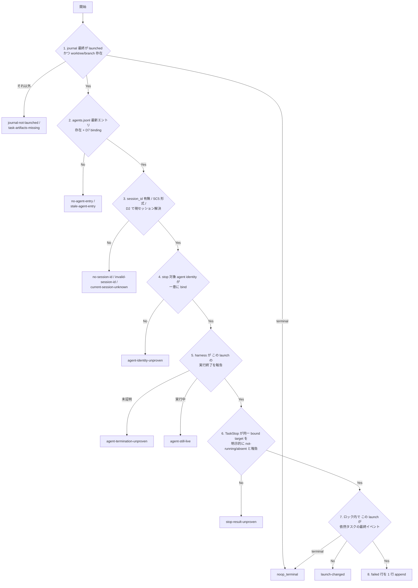

# stale-launched-retry-recovery - 要件定義書

## 1. 概要

### 1.1 背景

harness のストリーム watchdog に停止させられた implementer は、SubagentStop も
TaskStop も配送しないまま消える。この停止では journal.jsonl のそのタスクの最後の
イベントが `launched` のまま残り、`queue_launch_guard.py` はその後そのタスク ID の
リトライを恒久的に deny し続ける。implement フェーズはそのタスクを再開できない。

既存の orphan-recovery 機構（`recover-orphaned-task.py` と
`journal-append-failed.py`）は、この穴の隣までは届いている。ただしその機構は、
agents.jsonl に記録された session_id が現在のセッションと一致する場合、
「別セッションの transcript が非活動である」という証明が構造的に取れないため、
`residual` / `same-session` を返して何もしない（`recover-orphaned-task.py` step 6）。
watchdog kill は、まさにその `same-session` 残余として現れる。

### 1.2 目的

`same-session` 残余として現れるこの穴だけを塞ぐ。塞ぎ方は、既存の I.2.b
orphan-recovery 機構の **拡張** に限る（2 本目の recovery 経路を作らない、
ヘルパを複製しない、workflow-schema.md が宣言済みの journal writer 集合を増やさない）。
同時に、二重起動防止を一切弱めない。本当に in-flight なタスクの再起動は今まで通り
deny され、疑わしい状態が journal への書き込みに変換されることは決してない。

### 1.3 スコープ

**対象**:

- `em-workflow/scripts/recover-orphaned-task.py` の `same-session` 分岐の拡張
- `em-workflow/scripts/journal-append-failed.py` のロック内チェックと
  `VALID_REASONS` の拡張
- ドキュメント SSOT 3 箇所（implement-phase.md の I.2.b Orphan recovery ブロック、
  同ファイルの Stale-`launched` caveat、workflow-schema.md の journal writer 集合の段落）
- プラグインの version bump 2 箇所
- リポジトリルート `tests/` のテスト追加・更新

**対象外**:

- `queue_launch_guard.py` の変更（FR8）
- `same-session` 以外の残余理由コードの挙動変更（FR1）
- UI 面・画面遷移・視覚表現（本フィーチャーは一切持たない）

## 2. ビジネス要件

### 2.1 ビジネス目標

- harness のストリーム watchdog による停止（SubagentStop も TaskStop も配送されない
  停止）で残った `launched` により、implement フェーズが再開不能になる穴を、
  ちょうどその範囲だけ塞ぐ。
- 塞ぎ方は既存の I.2.b orphan-recovery 機構（`recover-orphaned-task.py` +
  `journal-append-failed.py`）の拡張に限り、2 本目の recovery 経路を作らない。
  journal の writer 集合は workflow-schema.md が宣言済みのもののままに保つ。
- 二重起動防止を一切減じない。本当に in-flight なタスクの再起動は今まで通り deny され、
  recovery が疑いを journal への書き込みに変換することは決してない。

### 2.2 対象ユーザー

| ユーザータイプ | 説明 |
|----------------|------|
| em-workflow の implement フェーズを回す利用者 | 無人実行中に implementer が watchdog に殺されたとき、そのタスクのリトライ経路が復活してほしい |
| em-workflow のオーケストレーター | I.2.b の reconcile で、証拠が揃ったときだけ recovery を成立させ、揃わなければ既存の Residual に落としたい |

### 2.3 期待される効果

- watchdog kill を受けたタスクが `failed` に落ち、`queue_launch_guard.py` が
  リトライを allow するようになる。
- recovery の判断根拠が固定順序の証拠チェーンと残余理由コードで説明可能になる。
- journal の writer 集合と append-only 性は変わらないまま、復旧範囲だけが広がる。

## 3. ユースケース

### 3.1 ユースケース一覧

| ID | ユースケース名 | アクター | 優先度 |
|----|----------------|----------|--------|
| UC01 | watchdog kill されたタスクの recovery | オーケストレーター | 高 |
| UC02 | recovery 後のリトライ再到達 | オーケストレーター / queue_launch_guard.py | 高 |
| UC03 | 証拠不足時の Residual 維持 | オーケストレーター | 高 |

### 3.2 ユースケース詳細

#### UC01: watchdog kill されたタスクの recovery

**アクター**: オーケストレーター（I.2.b reconcile ステップ）

**事前条件**:
- そのタスクの journal 最終イベントが `launched`
- タスク worktree とタスクブランチがいずれも存在する
- agents.jsonl の最新エントリが D7 の launch-binding 規則を満たし、現在のセッションと
  同じ識別子を記録している

**基本フロー**:
1. オーケストレーターが FR2 の証拠入力を添えて `recover-orphaned-task.py` を呼ぶ。
2. スクリプトが FR3 の固定順序で条件 (1)〜(7) を評価する。
3. すべて成立した場合、`journal-append-failed.py` をちょうど 1 回、reason
   `stale-launched` で呼ぶ。
4. ヘルパが既存の排他 flock 内で launch 同一性を再確認し、`failed` 行を 1 行 append する。
5. 結果 `recovered` が 1 行の JSON で stdout に返る。

**代替フロー**:
- 条件のいずれかが不成立: 最初に不成立になった条件の残余理由コードで `residual` を返し、
  以降は何も実行しない。
- 既存フックが先に terminal イベントを書いていた: `noop_terminal` を返す。

**事後条件**:
- journal.jsonl に `failed` 行が 1 行だけ増える（reason は `stale-launched`）。

**ユースケース図**:

#### UC02: recovery 後のリトライ再到達

**アクター**: `queue_launch_guard.py`

**事前条件**:
- UC01 により、そのタスクの journal 最終イベントが reason `stale-launched` の
  `failed` になっている

**基本フロー**:
1. オーケストレーターがそのタスクの再起動を試みる。
2. launch guard が journal 最終イベントを replay する。
3. 最終イベントが `failed` なので allow し、`launched` を 1 行 append する。

**事後条件**:
- そのタスクのリトライ経路が再び到達可能になる。

#### UC03: 証拠不足時の Residual 維持

**アクター**: オーケストレーター

**事前条件**:
- FR2 の 2 つの証拠のいずれかが揃わない、または FR3 のいずれかの条件が不成立

**基本フロー**:
1. スクリプトが最初に不成立となった条件で停止する。
2. `residual` とその理由コードを返す。

**事後条件**:
- journal.jsonl は呼び出し前とバイト単位で同一。既存の Residual がそのタスクの結末として
  そのまま残る。

## 4. 機能要件

### 4.1 機能一覧

| ID | 機能名 | 説明 | 状態 | 優先度 |
|----|--------|------|------|--------|
| FR1 | スコープは same-session 残余のみ | 既存機構を in-place で拡張し、他の残余理由コードの挙動は変えない | 確定 | 高 |
| FR2 | 2 つの証拠の連言でのみ死を証明 | harness の終了証拠 + TaskStop の明示的 not-running 結果 | 確定 | 高 |
| FR3 | 固定順序の証拠評価と 1 条件 1 理由コード | 条件 (1)〜(8) を順に評価し、最初の不成立で停止 | 確定 | 高 |
| FR4 | 残余理由コード集合の加算的拡張 | 既存 10 個に 6 個を追加、既存は改名・削除しない | 確定 | 高 |
| FR5 | 証拠を渡さない呼び出しは `same-session` のまま | 新チェーンへの進入は呼び出し側のオプトイン | 確定 | 高 |
| FR6 | ロック内チェックは launch 同一性を比較 | イベント名比較から launch 同一性比較へ | 確定 | 高 |
| FR7 | `VALID_REASONS` を 1 値だけ加算的に拡張 | `stale-launched` を追加 | 確定 | 高 |
| FR8 | `queue_launch_guard.py` は変更しない | journal 最終イベントのみを読む現状を維持 | 確定 | 高 |
| FR9 | 残余時の journal はバイト同一 | 書き込み・作成を一切しない | 確定 | 高 |
| FR10 | ドキュメント SSOT を同一変更で更新 | 3 箇所の記述を更新 | 確定 | 高 |
| FR11 | 同一変更でプラグイン version を bump | 2 箇所を同じ値に | 確定 | 中 |
| FR12 | 新 reason 値は `orphaned` と同じく `failed_kind: infra` | 既存の bullet 上で同一に扱う | 前提（assumed / A6 由来） | 中 |
| FR13 | `tests/` に契約テストを追加 | 既存スイートは拡張して green に保つ | 確定 | 高 |

### 4.2 機能詳細

#### FR1: スコープは same-session 残余のみ

**説明**: 本フィーチャーは、`recover-orphaned-task.py` が今日 `same-session` として
報告する残余だけを対象とする（`recover-orphaned-task.py` step 6: agent index が記録した
session_id が現在のセッションの識別子と等しく、step 7-9 のクロスセッション
transcript 非活動証明が構造的に利用できない状態）。既存の I.2.b orphan-recovery 機構は
in-place で拡張する — 2 本目の recovery 経路を作らず、ヘルパを複製せず、
workflow-schema.md が既に例外として認めているもの以外の journal writer を増やさない。

**ビジネスルール**:
- 他のすべての残余理由コード（`no-agent-entry`、`stale-agent-entry`、`no-session-id`、
  `invalid-session-id`、`current-session-unknown`、`transcripts-dir-missing`、
  `transcript-unreadable`、`transcript-active`、`journal-not-launched`）は現在の挙動を
  バイト単位で保つ。

#### FR2: 同一セッションでの死は harness の終了証拠と stop ツールの明示的 not-running 結果でのみ証明する

**説明**: タスクの same-session death が証明可能なのは、(a) **この launch の実行が
終了した** という harness の明示的証拠と、(b) 同一の bound agent identity に対する既存の
I.2.b Recovery TaskStop 呼び出しからの明示的な not-running / absent 結果、の連言の場合
だけである。

**ビジネスルール**:
- 経過時間のしきい値も、transcript や出力ファイルの idle 間隔も、どちらの連言肢の
  代用にもならない。
- launch 受理応答、汎用の `is_error`、出力 idle 間隔、別候補の不在は、それぞれ単独では
  不十分である。

#### FR3: 固定順序の証拠評価と 1 条件 1 理由コード

**説明**: `recover-orphaned-task.py` の same-session 分岐は以下の条件をこの厳密な順序で
評価し、最初に不成立になった条件で、指定された結末とともに停止し、それ以降は何も
実行しない。

**処理フロー**:

**ビジネスルール**:
1. タスクの journal 最終イベントが `launched` であること（terminal → 結末
   `noop_terminal`、それ以外 → `journal-not-launched`）、かつタスク worktree と
   タスクブランチがいずれも存在すること（不成立 → `task-artifacts-missing`）。
2. タスクの最新 agents.jsonl エントリが存在し（不成立 → `no-agent-entry`）、既存の D7
   launch-binding 規則を満たすこと（不成立 → `stale-agent-entry`）。
3. 記録された `session_id` が存在し（不成立 → `no-session-id`）、SC5 の形式検証を通り
   （不成立 → `invalid-session-id`）、現在のセッションの識別子と開始時刻が D2 に従って
   解決すること（不成立 → `current-session-unknown`）。
4. stop 対象の agent identity が、Agent index エントリ + worktree パス + この launch の
   応答から一意に bind されること。`session_id` は stop 対象として決して再利用しない
   （不成立 → `agent-identity-unproven`）。
5. harness が **この launch の実行**を終了したと報告すること（不成立 →
   `agent-termination-unproven`、harness がまだ実行中と報告 → `agent-still-live`）。
6. I.2.b Recovery TaskStop 呼び出しが、その同一 bound target を明示的に
   not-running / absent と報告すること（不成立 → `stop-result-unproven`。その間に既存
   フックが terminal イベントを書いていた場合は再 replay して `noop_terminal` を報告）。
7. `journal-append-failed.py` の既存の排他 flock の内側で、**この同じ launch** が依然として
   そのタスクの最終イベントであること — 最終イベントの名前が依然 `launched` である
   だけでは足りない（不成立 → `launch-changed`、既に terminal → `noop_terminal`）。
8. すべての条件が成立したときにのみ、`failed` 行をちょうど 1 行 append する。

#### FR4: 残余理由コード集合の加算的拡張

**説明**: `recover-orphaned-task.py` の SC6 閉集合（今日は `REASON_NO_AGENT_ENTRY` ..
`REASON_JOURNAL_NOT_LAUNCHED` の 10 個のモジュール定数、lines 67-76）に、ちょうど 6 個の
メンバーを追加する。

**出力**:
- `task-artifacts-missing`
- `agent-identity-unproven`
- `agent-termination-unproven`
- `agent-still-live`
- `stop-result-unproven`
- `launch-changed`（ロック内 step 7 の失敗）

**ビジネスルール**:
- 既存メンバーは改名も削除もしない。既存メンバーの発火条件も、FR5 が `same-session` に
  ついて定める範囲を除いて変更しない。

#### FR5: `same-session` は same-session 証拠を渡さない呼び出しに対して発火し続ける

**説明**: 新チェーンへの進入は、呼び出し側が FR2 の証拠入力を渡すことによるオプトインと
する。それらを一切渡さない `recover-orphaned-task.py` の呼び出しは今日と完全に同じ挙動を
とる — step 6 に到達し、記録された識別子が現在のものと等しければ `residual` /
`same-session` を返し、journal はバイト単位で同一のままになる。

**ビジネスルール**:
- 既存の呼び出し形式とその pin された挙動
  （`tests/test_recover_orphaned_task.py:783`
  `test_ac2b_identity_equal_to_current_reports_same_session`、および line 1206 の
  payload アサーション）を壊さない。

#### FR6: `journal-append-failed.py` のロック内チェックはイベント名ではなく launch を比較する

**説明**: `decide_and_append`（`scripts/journal-append-failed.py:155-178`）は今日
`last_event_for_task(content, task_id) == "launched"` で append を決めている。これは
イベント **名** の比較であり、recovery 対象の launch と、判断から append までの間に
追記された新しい `launched` 行を区別できない。ヘルパに launch 同一性の入力（判断の
根拠となった `launched` イベントの `at`）を追加し、**同一の**既存排他 flock の内側、
append の前に、タスクの最終イベントがその同一性を持つ `launched` イベントであることを
要求する。

**入力**:
- launch 同一性: 判断の根拠となった `launched` イベントの `at`

**エラーケース**:
| エラー | 条件 | 対応 |
|--------|------|------|
| launch 不一致 | 最終イベントが別の launch | append せず no-op、journal はバイト同一。上位に報告され `recover-orphaned-task.py` は `launch-changed` を返す |

**ビジネスルール**:
- 既存の単一 flock クリティカルセクション、O_NOFOLLOW / 既存必須の前提条件
  （lines 75-97）、SC4 の行形状（`event`、`task`、`at`、`reason` の順、lines 135-146）は
  変更しない。
- ヘルパは唯一の新規 journal writer のままであり、置き換えではなく拡張する。

#### FR7: `VALID_REASONS` をちょうど 1 値だけ加算的に拡張する

**説明**: `journal-append-failed.py` の D5 閉集合
`VALID_REASONS = {"orphaned"}`（`scripts/journal-append-failed.py:54`）に、この経路のための
メンバーを 1 つだけ追加する — `stale-launched`。モジュールの docstring が述べる D5 の
規律どおり、意図的でレビュー可能な定数の拡張として行う。

**ビジネスルール**:
- `orphaned` はその意味と発火経路を保つ。
- append される行のフィールド名と順序は変更しない（SC4）。新しい値は、`orphaned` が
  そうであったのと同じく、既存 `reason` フィールドの加算的な値である。
- `tests/test_journal_append_failed.py:406`
  `test_valid_reason_accepts_only_the_closed_set` は閉集合の正確なメンバーシップを
  アサートしているため、同一変更内で更新する。

#### FR8: `queue_launch_guard.py` は変更しない

**説明**: `queue_launch_guard.py` はタスクの journal 最終イベント **だけ** を読み続ける
（`hooks/queue_launch_guard.py:222-236`: `launched` → in-flight として deny、`merged` →
merged として deny、`failed` を含むそれ以外 → allow して `launched` を append）。

**ビジネスルール**:
- recovery はオーケストレーター駆動のままで、`failed` イベントは再起動より **前** に
  journal に着地する。したがって guard には新しい入力も、新しく読むファイルも、新しい
  例外規定も不要である。
- I.2.a の failed-only carve-out の論拠は手つかずのままとする。
- このファイルへの変更は本フィーチャーのスコープ外である。

#### FR9: 残余時の journal はバイト単位で同一

**説明**: すべての残余結末、およびすべての `noop_terminal` 結末は、journal.jsonl を
呼び出し前の内容とバイト単位で同一のまま残す — 行の追記なし、行の書き換えなし、
ファイル作成なし、親ディレクトリ作成なし。

**ビジネスルール**:
- どちらのスクリプトの非ゼロ終了も journal への書き込みを伴わず、呼び出し側は Residual
  として扱う。
- append-only 性と、「オーケストレーターはこの 1 つの狭いスコープの例外を除いて journal を
  直接書かない」という規則を保つ。

#### FR10: ドキュメント SSOT を同一変更で更新する

**説明**: 3 つのドキュメント地点が拡張を記載しなければならない。

**出力**:
- (a) `em-workflow/references/implement-phase.md` の I.2.b「Orphan recovery」ブロック
  （lines 542-585）。固定の証拠順序とすべての理由コードを述べる所有セクションであり、
  新しい same-session 分岐、その 6 つの新コード、その 2 連言の証明を記載する。
- (b) 同ファイルの「Stale-`launched` caveat」（lines 1047-1061）。今日は 4 つの
  gap-closing 機構を列挙し、SubagentStop も TaskStop も配送しない停止を明示的に
  カバーしていない。
- (c) `em-workflow/references/workflow-schema.md` の journal writer 集合の段落
  （lines 383-402）。writer 集合と「`orphaned` は既存 `failed` reason フィールドの加算的な
  値である」ことの SSOT であり、writer を増やさずに新しい reason 値を加算的に記載する。

#### FR11: 同一変更でプラグイン version を bump する

**説明**: `em-workflow/` 配下のファイルが変わるため、同一変更で
`em-workflow/.claude-plugin/plugin.json` の `version`（現在 0.1.77）と
`.claude-plugin/marketplace.json` の em-workflow エントリの `version`（現在 0.1.77、
line 27）を同じ新しい値に上げる。

**ビジネスルール**:
- `.claude/rules/core-plugin-version-bump.md` に従い increment は semver。これは既存
  スクリプトの挙動拡張なので patch または minor。
- `tests/test_plugin_version_parity.py` が 2 つの値の等価性を pin している。

#### FR12: 新しい reason 値は `orphaned` とまったく同じく `failed_kind: infra` に帰属させる

**状態**: 前提（assumed。A6 により導出であって回答ではない）

**説明**: implement-phase.md の abort-phase bullet（lines 885-888）は、失敗したタスクの
失敗が reason `orphaned` の journal `failed` イベントに由来する場合に
`failed_kind: infra` を設定する。workflow-schema.md の `infra` の定義（lines 297-300）は
「implementer が orphan 化した、または harness の失敗が発生した」である。watchdog kill は
harness の失敗であり、FR1 によりこれは同一機構の拡張であるから、新しい reason 値は同じ
bullet 上で `infra` に帰属させる。

**ビジネスルール**:
- lines 910-928 の batch モードの override（2 回目の失敗で `orphaned` を含めて無条件に
  `failed_kind` を `decision` にする）は変更せず、新しい値にも同一に適用される。

#### FR13: `tests/` に契約テストを追加する

**説明**: 本変更は、ドキュメント契約テストとスクリプト/フックテストを、リポジトリルートの
`tests/` ディレクトリに追加する。`test/README.md` に従って `test_*.py` と命名し、
`python3 -m unittest discover -s tests` で発見され、登録手順も第三者パッケージの import も
不要とする。

**ビジネスルール**:
- 触れるコンポーネントの既存スイート（`tests/test_recover_orphaned_task.py`、
  `tests/test_journal_append_failed.py`、`tests/test_queue_launch_guard.py`、
  `tests/test_plugin_version_parity.py`）は、置き換えではなく拡張するか green のまま保つ。

## 5. 非機能要件

### 5.1 パフォーマンス要件

本フィーチャーに数値目標は設定されていない。

### 5.2 セキュリティ要件

- 入力検証: `session_id` は SC5 の形式規則で検証され、stop 対象としては決して再利用
  されない（FR3 条件 4）。
- データ保護: journal パスは symlink でないこと・既に存在することを前提条件とし、
  O_NOFOLLOW で開く既存の規律を変更しない（FR6）。

### 5.3 可用性要件

- **NFR1 - Fail-safe の方向を保つ**: 疑いが journal への書き込みを生むことは決してない。
  解析不能・不在・曖昧・比較不能・単に未証明である証拠は、すべて残余であって通過では
  ない。これは `recover-orphaned-task.py` の `agent_entry_is_bound`（lines 368-387）と
  `journal-append-failed.py` の `decide_and_append` docstring が既に述べている規律と
  一致する。見逃した recovery のコストは既存の Residual であり、誤った recovery の
  コストは、生きている implementer のタスクが `failed` と記録され再起動されることで、
  厳密により悪い。
- **NFR2 - クリティカルセクションは 1 つのまま変えない**: 判断と append は、replay と
  append の **両方** にわたって journal.jsonl 上に保持される 1 つの排他 advisory flock
  （`fcntl.LOCK_EX`）のままである。FR6 の launch 同一性比較はその同じ既存ロックの内側で
  行う。2 つ目のロックも、ロックの拡張も、サブプロセス呼び出しをまたぐロック保持もない。

### 5.4 保守性要件

- **NFR3 - レイヤ分離を保つ**: `recover-orphaned-task.py` は Decision レイヤのままで
  自身は何も書かない。`journal-append-failed.py` は唯一の Journal-write レイヤのままで、
  ちょうど 1 回、子プロセスとして、既定では兄弟スクリプトのパスで、テスト用に
  `--journal-helper` で上書き可能なパスで呼ばれる（D6）。オーケストレーター自身は、
  この 1 つの呼び出しの外で journal.jsonl に append しない。
- **NFR4 - フックの fail-open 規約は手つかず**: 4 つの queue フックはすべて fail-open の
  ネットのままで、想定外の状態では静かに exit 0 する。どのフックも blocking 条件を
  獲得しない。implement-phase.md のフック分類テーブル（lines 959-964、
  `tests/test_hook_classification_pin.py` と `tests/test_queue_hook_status_read_pin.py` が
  pin）は変更しない — `queue_launch_guard.py`、`queue_failure_net.py`、
  `queue_taskstop_net.py` は依然 `tasks.{T}.status` を読まず、`queue_stop_guard.py` は
  依然読む。

### 5.5 互換性要件

- **NFR5 - 両 CLI の後方互換性**: 両スクリプトの既存のすべての呼び出し形式が現在の結末を
  保つ。新しいパラメータは加算的であり、省略すれば今日の挙動を正確に再現するという意味で
  CLI 表面上は任意である（FR5）。既存フラグの改名・削除・既定値の変更はしない。
- **NFR6 - 新しい実行時依存を増やさない**: 両スクリプトは Python 標準ライブラリのままで、
  `em-workflow/scripts/` と `hooks/` の他と揃える。テストは第三者パッケージを import
  しない。

## 6. UI/UX要件

### 6.1 画面設計要件

該当なし。変更対象は Python の CLI ヘルパ 2 本、参照ドキュメント 2 本、`tests/` のみで、
ユーザーに見える UI 面・画面遷移・視覚表現を一切持たない。プロジェクトにデザインシステムの
候補ファイルも存在しない。

### 6.2 画面遷移

該当なし。

### 6.3 レスポンシブ対応

該当なし。

## 7. データ要件

### 7.1 データモデル概要

変更されるデータは `journal.jsonl` に append される 1 行のみである。

### 7.2 データ項目

| エンティティ | 項目名 | 型 | 必須 | 説明 |
|--------------|--------|-----|------|------|
| journal `failed` 行 | event | string | ○ | `failed`（SC4 の順序で 1 番目） |
| journal `failed` 行 | task | string | ○ | タスク ID（2 番目） |
| journal `failed` 行 | at | string | ○ | RFC3339 のタイムスタンプ（3 番目） |
| journal `failed` 行 | reason | string | ○ | `stale-launched`（4 番目、既存フィールドの加算的な値） |

### 7.3 データ保持期間

| データ種別 | 保持期間 |
|------------|----------|
| journal.jsonl | append-only、書き換えも削除もされない |

## 8. 外部連携

### 8.1 連携システム

| システム名 | 連携方法 | データ |
|------------|----------|--------|
| harness（stop ツール / agent index） | 既存の I.2.b Recovery TaskStop 呼び出しと agents.jsonl | この launch の終了証拠、bound agent identity |

### 8.2 API仕様要件

`recover-orphaned-task.py` と `journal-append-failed.py` の CLI 表面のみ。新しい引数は
加算的で、省略時は今日の挙動を再現する（NFR5）。

## 9. 制約条件

### 9.1 技術的制約

- 既存の I.2.b orphan-recovery 機構を in-place で拡張する。2 本目の recovery 経路、ヘルパの
  複製、新しい journal writer はいずれも許されない（FR1）。
- journal への書き込みは 1 つの排他 flock 内で完結させる（NFR2）。
- 両スクリプトは Python 標準ライブラリのみを使う（NFR6）。

### 9.2 ビジネス上の制約

- 二重起動防止を減じない。本当に in-flight なタスクの再起動は今まで通り deny される。
- recovery が疑いを journal への書き込みに変換してはならない（NFR1）。

### 9.3 スケジュール制約

記載なし。

### 9.4 宣言された変更集合

このフィーチャー固有のパスは手動で列挙せず、create-plan で `workflow.yaml` の各タスクの `files` から導出する（`references/phases/create-plan-phase.md`）。

**デフォルトメンバー**（SPEC作成者が明示的に除外しない限り、常に宣言に含まれる）:
- `feature-docs/{feature}/**`
- `test-docs/{feature}/**`

`feature-docs/{feature}/**` に含まれるもの: `REQUIREMENTS.md`、`SPEC.md`、`IMPLEMENTATION.md`、`workflow.yaml`、`phase-state/`、`tasks/`、`reviews/roundN.yaml`、`VERIFICATION.md`、`retrospect.yaml`、およびデザインステップが生成するデザイン成果物。生成主体は各フェーズドキュメントおよび `references/phase-state.md` を参照（引用のみ、ルールは再掲しない）。

`test-docs/{feature}/**` に含まれるもの: `{T}.tests.yaml`（パス形式: `test-docs/{feature}/{T}.tests.yaml`）。生成主体は `implement-phase.md` を参照（引用のみ、ルールは再掲しない）。

**意味論**:
- デフォルトのメンバーは、SPEC作成者が明示的に除外しない限り宣言に含まれる。除外は意図的な絞り込みであり、記載漏れによる省略ではない。
- この宣言はスーパーセット（superset）の主張であり、実際の変更集合は宣言に含まれる（CONTAINED IN）必要がある。実際には生成されないパスが宣言されていても違反にはならない。implementタスクを1つも生成しないフィーチャーは `test-docs/{feature}/` ディレクトリを生成しないが、宣言された `test-docs/{feature}/**` は依然として正しい。

## 10. 想定される課題とリスク

### 10.1 技術的課題

| 課題 | 影響度 | 対応策 |
|------|--------|--------|
| 判断から append までの間に `launched` → `failed` → `launched` が起きると、イベント名比較では別の launch を failed にしてしまう | 高 | FR6 のロック内 launch 同一性比較。不一致は no-op で `launch-changed` |
| 時間ベースの代理指標を使うと、長時間静かに動く正常な implementer（例: 20 分のテスト実行）を殺しうる | 高 | FR2 で経過時間・idle 間隔を明示的に排除 |
| `session_id` を stop 対象に流用すると誤った対象を止めうる | 高 | FR3 条件 4 で `session_id` の stop 対象再利用を禁止し、一意に bind できなければ `agent-identity-unproven` |

### 10.2 ビジネスリスク

| リスク | 発生確率 | 影響度 | 対応策 |
|--------|----------|--------|--------|
| 誤った recovery により、生きている implementer のタスクが `failed` と記録され再起動される | 低 | 高 | NFR1 の fail-safe 方向。疑いはすべて残余 |
| 見逃した recovery により、タスクが既存の Residual のまま残る | 中 | 中 | 既存の Residual を結末として受け入れる（NFR1 で明示的に許容） |

## 11. 成功基準

### 11.1 受け入れ基準

- [ ] AC1 - journal 最終イベントが `launched` で、worktree とブランチがいずれも存在し、
      最新 agents.jsonl エントリが D7 によりその launch に bind され **現在の** セッションの
      識別子を記録しており、harness がこの launch の実行終了を報告し、TaskStop 呼び出しが
      その同一 bound target を明示的に not-running / absent と報告するタスクは、結末
      `recovered` に到達する。`failed` 行がちょうど 1 行 append され、reason
      `stale-launched` を持ち、フィールドは `event`、`task`、`at`、`reason` の順である。
- [ ] AC2 - AC1 の後、`queue_launch_guard.py` はそのタスク ID の再起動を ALLOW し、
      `launched` 行をちょうど 1 行 append する — リトライ経路が再び到達可能になる。
- [ ] AC3 - harness がこの launch をまだ実行中と報告する場合、結末は `residual` /
      `agent-still-live`。TaskStop 呼び出しが単独で何かを決めることはなく、ヘルパ呼び出しも
      発生せず、journal はバイト同一である。
- [ ] AC4 - harness が launch 受理応答のみ、あるいは汎用 `is_error` のみ、あるいは出力
      idle 間隔のみを供給する場合、結末はいずれも `residual` /
      `agent-termination-unproven`。経過時間のしきい値と transcript / 出力ファイルの idle
      間隔は各々独立に不十分であり、そのように pin される。
- [ ] AC5 - harness が終了を証明したが TaskStop 結果が汎用エラーである、または **別の**
      候補の不在を報告する場合、結末は `residual` / `stop-result-unproven`。journal は
      バイト同一である。
- [ ] AC6 - Agent index エントリ + worktree + この launch の応答から agent identity を
      一意に bind できない場合（候補エントリなし、または 2 つ以上の異なる候補）、結末は
      `residual` / `agent-identity-unproven`。記録された `session_id` はどの経路でも stop
      対象として使われない。
- [ ] AC7 - タスク worktree またはタスクブランチが存在しない場合、結末は `residual` /
      `task-artifacts-missing`。agents.jsonl の読み取り、パス組み立て、ファイル open の
      いずれよりも前に決まる。
- [ ] AC8 - 判断とロック内チェックの間に同一タスクの新しい `launched` イベントが追記された
      場合、`journal-append-failed.py` のロック内比較が失敗し、何も append されず、
      `recover-orphaned-task.py` は `residual` / `launch-changed` を報告する。イベント名だけの
      比較はこの基準を満たさない。
- [ ] AC9 - 既存フック（`queue_failure_net.py` または `queue_taskstop_net.py`）が既に
      terminal な `failed` を書いている、または `merge-task.sh` が `merged` を書いている
      場合、再 replay は結末 `noop_terminal` と空の reason を返し、何も append されない。
- [ ] AC10 - AC3-AC9 のすべての残余結末とすべての `noop_terminal` 結末は、journal.jsonl を
      呼び出し前の内容とバイト単位で同一に保ち（行数比較ではなくバイト単位の比較）、
      ファイルもその親ディレクトリも作成しない。
- [ ] AC11 - 新しい証拠入力を一切渡さない呼び出しは、記録された識別子が現在のものと等しい
      タスクに対して依然 `residual` / `same-session` を報告する — 既存の挙動のままである。
- [ ] AC12 - `journal-append-failed.py --reason <unknown>` は依然として非ゼロで拒否され
      書き込みもない。閉集合はちょうど `orphaned` と `stale-launched` を受理し、それ以外は
      受理しない。
- [ ] AC13 - `queue_launch_guard.py` のソースは本フィーチャーによって変更されず、その既存の
      挙動（`launched` で deny、`merged` で deny、それ以外は allow して append）が再び
      green で証明される。
- [ ] AC14 - implement-phase.md の I.2.b Orphan recovery ブロック、その
      Stale-`launched` caveat、workflow-schema.md の journal writer 集合の段落のすべてが
      新しい reason 値と新しいコードを記載し、journal writer 集合自体（`merge-task.sh`、
      `queue_launch_guard.py`、`queue_failure_net.py`、`queue_taskstop_net.py`、および
      `journal-append-failed.py` の 1 つの例外）は変わっていない。
- [ ] AC15 - `em-workflow/.claude-plugin/plugin.json` の `version` と
      `.claude-plugin/marketplace.json` の em-workflow の `version` が等しく、0.1.77 より
      厳密に大きい。
- [ ] AC16 - リポジトリルートから `python3 -m unittest discover -s tests` が通る。

### 11.2 KPI

設定されていない。

## 12. テストシナリオ

### 12.1 テスト観点

- [ ] 正常系（TS1）: recovered 経路をスタブヘルパに対して端から端まで。
      `tempfile.TemporaryDirectory` 内に journal と agents.jsonl のフィクスチャを置き、
      agents.jsonl エントリは D7 に従って bind され、session_id は渡した
      `--current-session-id` と等しく、harness の終了証拠と stop 結果の証拠を両方とも
      証明済みとして供給する。stdout が 1 行の JSON
      `{"outcome":"recovered","task":...,"reason":""}`、exit 0、`failed` 行がちょうど 1 行
      追記されることをアサートする。`tests/test_recover_orphaned_task.py` の既存 AC-7
      スタブ注入パターンに倣う。
- [ ] 異常系（TS2）: 理由コード表を、不成立条件 1 つにつき 1 ケース。FR3 の完全な順序付き
      条件リストでパラメータ化する — journal terminal → `noop_terminal`、journal が
      launched でない → `journal-not-launched`、worktree 欠落 → `task-artifacts-missing`、
      branch 欠落 → `task-artifacts-missing`、agents エントリなし → `no-agent-entry`、
      最後の `launched` より D7 の許容を超えて古いエントリ → `stale-agent-entry`、
      session_id が不在/空 → `no-session-id`、`SESSION_ID_RE` を通らない → 
      `invalid-session-id`、D2 が解決不能 → `current-session-unknown`、identity が曖昧 →
      `agent-identity-unproven`、終了が未証明 → `agent-termination-unproven`、実行中 →
      `agent-still-live`、stop 結果が未証明 → `stop-result-unproven`、ロック内で launch が
      変わった → `launch-changed`。各ケースで正確な reason 文字列と journal のバイト同一性を
      アサートする。
- [ ] 異常系（TS3）: 証拠不十分の pin（明示的な否定ケース）。launch 受理応答、汎用
      `is_error`、出力 idle 間隔がそれぞれ独立に `agent-termination-unproven` を返すことを
      証明する 3 ケースと、チェーンのどこにも経過時間のしきい値が存在しないことを証明する
      ケース（`at` が非常に古いことだけが特徴のフィクスチャも、`recovered` ではなく
      `agent-termination-unproven` を返す）。
- [ ] セキュリティ（TS4）: `session_id` は stop 対象にならない。記録された session_id が
      harness の agent 識別子候補と一致するフィクスチャでも、stop 対象を session_id から
      解決してはならない — 結末は `agent-identity-unproven`、そのフィールドから TaskStop の
      対象は導出されない。ソースレベルと挙動レベルの双方で pin する。
- [ ] 境界値（TS5）: ロック内 launch 同一性の競合。`journal-append-failed.py` の単体テストで、
      最終イベントが `at` A の `launched` である journal を作り、最終イベントが `at` B の
      `launched` になるようファイルを書き換えた後に launch 同一性 A でヘルパを呼ぶ。append が
      ないことと no-op の結末をアサートする。`tests/test_journal_append_failed.py:277` の
      スタイルの並行性テストも添え、同じ launch 同一性に対する N 個の並行呼び出しが
      `failed` 行を高々 1 行しか追記しないことを確かめる。
- [ ] 境界値（TS6）: 閉集合の拡張。`tests/test_journal_append_failed.py:406` を、拡張後の
      `VALID_REASONS` がちょうど `orphaned` と `stale-launched` を受理し、`manual`、空文字列、
      None を拒否することをアサートするよう更新する。新しい値が SC4 のフィールド順で
      追記されること、未知の値が書き込みなしで非ゼロ終了することの CLI テストを追加する。
- [ ] 正常系（TS7）: recovery 後のリトライ到達性。`test/README.md` のフック契約パターンで
      `queue_launch_guard.py` をサブプロセスとして stdin の JSON で駆動し、最終イベントが
      `stale-launched` の `failed` である journal に対して、deny 出力がないこと、exit 0、
      `launched` 行がちょうど 1 行追記されることをアサートする。最終イベントが `launched` の
      ときと `merged` のときには依然 deny することも確かめる — 二重起動防止は減じていない。
- [ ] 正常系（TS8）: ドキュメント契約テスト。implement-phase.md の I.2.b Orphan recovery
      ブロックが新しいコードを FR3 の順序で列挙すること、その Stale-`launched` caveat が
      SubagentStop も TaskStop も配送しない停止をカバーすること、workflow-schema.md の
      writer 集合の段落が writer を増やさずに新しい reason 値を記載すること、writer 集合の
      文字列自体が変わっていないことを、逐語的にアサートする。
- [ ] 正常系（TS9）: フック分類と status 読み取りの pin が green のまま。
      `tests/test_hook_classification_pin.py` と
      `tests/test_queue_hook_status_read_pin.py` が変更なしで通り、どの queue フックも
      `tasks.{T}.status` の読み取りを獲得しておらず、4 行の分類テーブルが無傷であることを
      証明する。
- [ ] 正常系（TS10）: version の一致。両方の version を同じ新しい値に上げた状態で
      `tests/test_plugin_version_parity.py` が green。

## 13. 用語定義

| 用語 | 定義 |
|------|------|
| stale-`launched` | journal のタスク最終イベントが `launched` のまま残り、対応する implementer が実際には in-flight でない状態 |
| same-session 残余 | agent index が記録した session_id が現在のセッションの識別子と等しいため、クロスセッションの transcript 非活動証明が構造的に取れず、`recover-orphaned-task.py` が返す `residual` / `same-session` |
| D7 launch-binding 規則 | agent index エントリ自身の `at` が、そのタスクの最後の `launched` journal イベントの `at` より許容範囲を超えて古くないことを要求する既存規則 |
| SC5 | 既存の session_id 形式検証規則 |
| SC6 | `recover-orphaned-task.py` の残余理由コードの閉集合 |
| SC4 | journal `failed` 行のフィールド名と順序（`event`、`task`、`at`、`reason`） |
| D5 | `journal-append-failed.py` の `VALID_REASONS` を閉集合に保つ規律 |
| D6 | Journal-write ヘルパを分離し、そのパスを `--journal-helper` で注入可能にする設計判断 |
| D2 | 現在のセッションの識別子と開始時刻の解決方法 |
| Residual | recovery が成立せず、タスクが in-flight のまま残る既存の結末 |

## 14. 確認事項

### 14.1 確認済み事項

- [x] 既存の orphan-recovery とのスコープ関係: same-session 残余のみをスコープとする。
      既存の I.2.b orphan-recovery 機構は拡張であって複製ではなく、他のすべての残余理由
      コードは現在の挙動を保つ。
- [x] same-session の死の証明方法: この launch に対する harness の明示的な終了証拠と、
      同一の bound agent identity に対する明示的な not-running の stop ツール結果の 2 つで
      のみ証明する。経過時間のしきい値も transcript / 出力ファイルの idle 間隔も、どちらの
      代用にもならない。不成立の条件ごとに残余理由コードを追加し、すべての残余ケースで
      journal は変わらない。
- [x] launch guard の入力: `queue_launch_guard.py` は journal 最終イベントだけを読み続ける。
      recovery はオーケストレーター駆動のままで、再起動の前に `failed` イベントを journal に
      着地させるため、guard に新しい入力は不要であり、I.2.a の failed-only carve-out の
      論拠は手つかずである。
- [x] デザインステップ: 実施しない。UI 面がなく、デザインシステムの候補ファイルも存在しない。

### 14.2 未確認・保留事項

以下は回答ではなく導出された前提であり、必要に応じて見直す。

- [ ] A1: 新しい journal `failed` reason 値の名前を `stale-launched` とする。正確な
      リテラルは回答で固定されていない命名上の選択であり、書き換えられることのない
      append-only のログに着地する（不可逆）。
- [ ] A2: 新しい same-session チェーンへの進入は、呼び出し側が FR2 の証拠入力を渡すことに
      よるオプトインであり、それらを渡さない呼び出しは依然 `same-session` を報告する。
      この読みが「他のすべての残余理由コードが現在の挙動を保つ」を `same-session` 自身に
      ついても成立させる。今日 `tests/test_recover_orphaned_task.py:783` と :1206 が pin して
      いる。
- [ ] A3: `task-artifacts-missing` を生む worktree / branch の存在チェックは、
      `recover-orphaned-task.py` の内側で行っても、オーケストレーター側の呼び出し元から
      供給してもよい。今日スクリプトはこの 2 条件を明示的に再チェックしない（モジュール
      docstring、`scripts/recover-orphaned-task.py:7-11`）。チェーンの最初の不成立条件が
      そのコードを返し、それ以降が何も実行されない限り、どちらの配置も FR3 を満たす。
- [ ] A4: `queue_agent_index.py` の変更は不要。既存のエントリ形状（`agent_ids` の候補
      リスト、`task`、worktree パス、および独立したトップレベルの `session_id`）は FR3
      条件 4 が identity を一意に bind するのに必要なものをすべて持っており、
      implement-phase.md lines 1009-1017 のオーケストレーター側の読み取り規則が既に
      解決不能・曖昧な参照を定義している。
- [ ] A5: `queue_stop_guard.py` の変更は不要。recovery が terminal な `failed` を追記すれば、
      既存の replay がそのタスクを failed に再分類し、refill ブロック条件は正しく解決する。
      連続ブロックの上限 3 が wedged スロットのケースを既に上限づけている。
- [ ] A6: FR12 の新しい reason 値への `failed_kind: infra` 帰属は、FR1 の「複製せず拡張する」
      スコープと workflow-schema.md 自身の `infra` の定義（「harness の失敗が発生した」）
      から従う。これは回答ではなく導出である。
- [ ] A7: task_description の「recovery 経路が存在しない」という前提は既に古い。
      orphaned-implementer-recovery フィーチャーが `recover-orphaned-task.py` と
      `journal-append-failed.py` を既に出荷しており、その `same-session` 残余がまさに未カバーの
      ケースである。task_description が述べる 2 つの制約（workflow-schema.md が writer 集合の
      SSOT であること、version フィールド 2 箇所を bump すること）は FR10 と FR11 として
      引き継いでいる。

## 15. 参考資料

- `em-workflow/scripts/recover-orphaned-task.py`: SC3 の判断エントリポイント（拡張対象）
- `em-workflow/scripts/journal-append-failed.py`: SC2 の唯一の新規 journal writer（拡張対象）
- `em-workflow/hooks/queue_launch_guard.py`: launch guard（変更対象外、FR8）
- `em-workflow/references/implement-phase.md`: I.2.b Orphan recovery ブロック（lines 542-585）、
  Stale-`launched` caveat（lines 1047-1061）、abort-phase bullet（lines 885-888）、
  フック分類テーブル（lines 959-964）
- `em-workflow/references/workflow-schema.md`: journal writer 集合の段落（lines 383-402）、
  `infra` の定義（lines 297-300）
- `feature-docs/orphaned-implementer-recovery/IMPLEMENTATION.md`: SC2 / SC3 / SC4 / SC5 / SC6、
  D1 / D2 / D3 / D5 / D6 / D7 の契約
- `.claude/rules/core-plugin-version-bump.md`: version bump の規則
