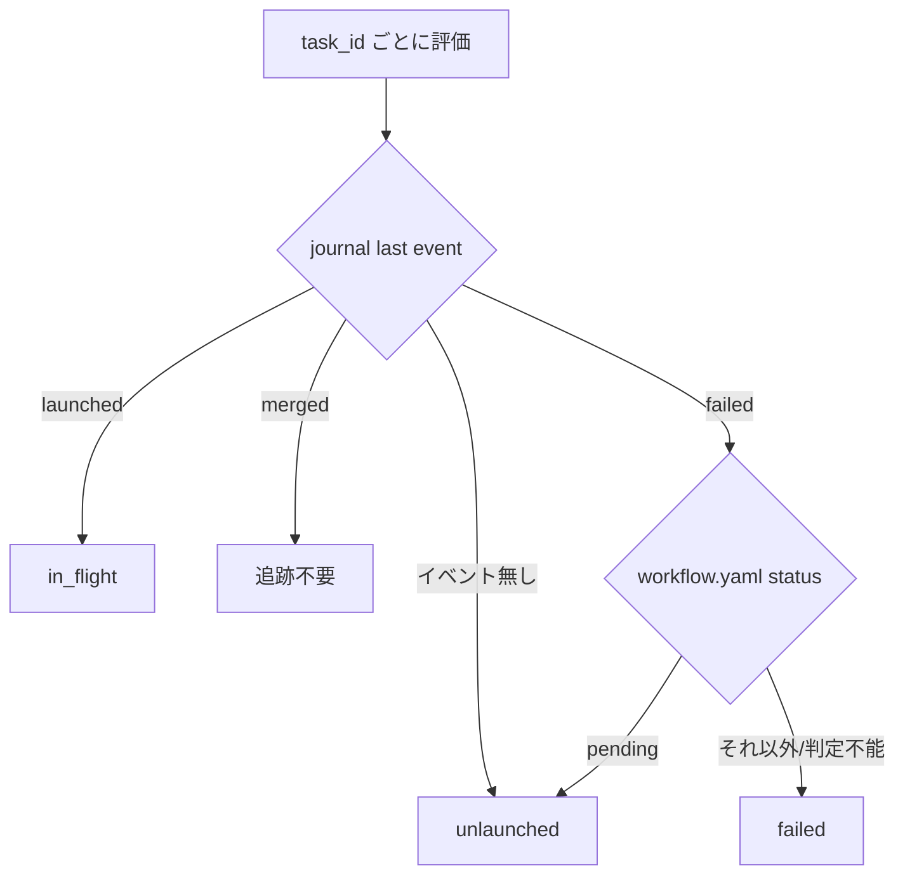
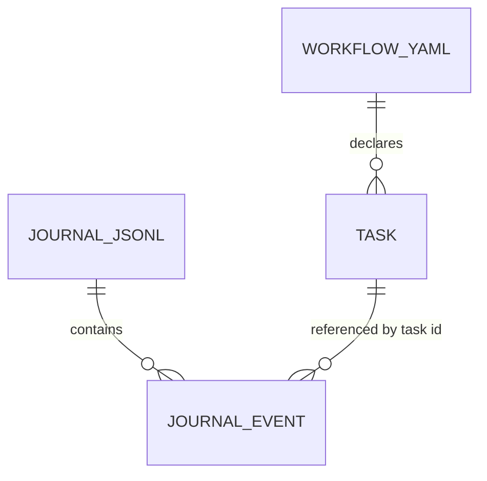

# stopguard-retired-failed - 要件定義書

## 1. 概要

### 1.1 背景

implement フェーズの work-queue ループには、リフィル忘れを捕捉する net として Stop hook `queue_stop_guard.py` が置かれている。この hook は journal の last event だけからタスク状態を導出し、`failed` の last event を持つタスクが 1 つでもあれば、そのフィーチャー全体でブロックを抑止する（exit 0）。

journal は append-only であり、re-plan / retirement を示すマーカーを持たない。一方 planner の `replace_all` は task id を `task0001` から振り直すため、route-back による再計画を経たフィーチャーでは、退役した task id の `failed` イベントを新しいタスクが継承する。その結果、退役 id に属する 1 件の恒久的な `failed` journal イベントによって、当該フィーチャーの `queue_stop_guard.py` が永久に沈黙する。

### 1.2 目的

- route-back による再計画を経たフィーチャーに対して、implement フェーズのリフィル忘れ検知 net を復旧する。
- hook を authority ではなく net のまま保つ。すなわち、この修正によって hook が誤ってセッションをブロックする経路を新たに作らない。

### 1.3 スコープ

**対象**:

- `em-workflow/hooks/queue_stop_guard.py` の `evaluate_feature` における分類ルール
- `em-workflow/references/implement-phase.md` の hook スコープ記述の訂正
- `tests/test_queue_stop_guard.py` へのユニットテスト追加
- `em-workflow/.claude-plugin/plugin.json` および `.claude-plugin/marketplace.json` の version bump

**対象外**:

- `queue_launch_guard.py`、`queue_failure_net.py`、`queue_taskstop_net.py`（変更しない）
- workflow.yaml のスキーマ変更、新規サイドカーフィールド、新規ファイル
- BLOCK / WARNING の stderr 出力フォーマット

## 2. ビジネス要件

### 2.1 ビジネス目標

- route-back による再計画を経たフィーチャーで、implement フェーズのリフィル忘れ net を復旧する。今日は退役 task id に属する 1 件の恒久的な `failed` journal イベントが、そのフィーチャーの `queue_stop_guard.py` を永久に沈黙させている。
- hook を authority ではなく net のまま保つ。この修正は、hook が誤ってセッションをブロックする経路を新たに作ってはならない。

### 2.2 対象ユーザー

| ユーザータイプ | 説明 |
|----------------|------|
| em-workflow のオーケストレーター（Claude Code セッション） | implement フェーズの work-queue ループを回す主体。Stop hook のブロックによってリフィル忘れを通知される |
| em-workflow を利用する開発者 | 再計画を経たフィーチャーで implement フェーズを進行させる人間。net が沈黙するとリフィル忘れに気付けない |

### 2.3 期待される効果

- route-back を経たフィーチャーでも、リフィル可能なスロットと未起動タスクが存在する状態で Stop hook が正しくブロックする。
- 真の失敗（ユーザー判断待ち）については、従来どおりフィーチャー全体の抑止が維持される。
- hook の fail-open 契約が保たれ、判定不能な状態でセッションをブロックしない。

## 3. ユースケース

### 3.1 ユースケース一覧

| ID | ユースケース名 | アクター | 優先度 |
|----|----------------|----------|--------|
| UC01 | 退役 id の残骸を持つフィーチャーでリフィル忘れを検知する | オーケストレーター | 高 |
| UC02 | 真の失敗が発生しているフィーチャーでブロックを抑止する | オーケストレーター | 高 |
| UC03 | ドキュメント（implement-phase.md）の hook スコープ記述を実装と一致させる | 開発者 | 中 |

### 3.2 ユースケース詳細

#### UC01: 退役 id の残骸を持つフィーチャーでリフィル忘れを検知する

**アクター**: オーケストレーター（Stop イベント経由）

**事前条件**:
- workflow.yaml の `implement` ステップが `in_progress`
- `tasks:` 配下に task0001..task0003 が存在し、いずれも `status: pending`
- journal の内容は task0001 の `failed` のみ（退役 id の残骸）

**基本フロー**:
1. Stop イベントで `queue_stop_guard.py` が起動する
2. workflow.yaml から `implement` ステップの状態と task id 一覧を読む
3. journal を読み、task ごとの last event を求める
4. task0001 は journal last event が `failed` かつ workflow.yaml `status` が `pending` のため、未起動（unlaunched）と分類される
5. task0002、task0003 は journal イベントを持たないため未起動と分類される
6. failed に分類されたタスクが 1 つも無いため、フィーチャー全体の抑止は発動しない
7. 空きスロットを計算し、昇順・上限付きの起動リストを組み立てる
8. exit 2 で BLOCK し、stderr に task0001、task0002、task0003 を起動対象として出力する

**代替フロー**:
- 同一の導出状態で 3 回連続してブロック済みの場合、既存の連続ブロック上限により WARNING を出して exit 0 する

**事後条件**:
- stop-guard-state.json サイドカーに fingerprint と counter が更新される

#### UC02: 真の失敗が発生しているフィーチャーでブロックを抑止する

**アクター**: オーケストレーター（Stop イベント経由）

**事前条件**:
- journal の last event が `failed` のタスクが存在する
- そのタスクの workflow.yaml `status` が `pending` 以外（`failed` / `in_progress` / `merged` / 未知の値 / status キー欠落 / task ブロックが解析不能）

**基本フロー**:
1. Stop イベントで `queue_stop_guard.py` が起動する
2. 当該タスクは failed と分類される
3. `evaluate_feature` が None を返し、hook は exit 0 する

**事後条件**:
- セッションはブロックされない（ユーザー判断待ちの状態が維持される）

#### UC03: ドキュメントの hook スコープ記述を実装と一致させる

**アクター**: 開発者

**事前条件**:
- implement-phase.md が「4 つの hook はいずれも journal の last event のみから状態を導出し、`tasks.{T}.status` を参照しない」と記述している

**基本フロー**:
1. `queue_stop_guard.py` を明示的な例外として記述し、recycled-task-id carve-out を適用することを示す
2. 他の 3 hook については journal-last-event-only の記述を維持する
3. 「Supporting cast: journal, hooks, resume」配下の Stop hook 項も整合させる

**事後条件**:
- SSOT 記述と実装が矛盾しない

## 4. 機能要件

### 4.1 機能一覧

| ID | 機能名 | 説明 | 優先度 |
|----|--------|------|--------|
| FR1 | 退役 id の `failed` がフィーチャーを沈黙させない | `status: pending` + journal last event `failed` を未起動として分類する | 高 |
| FR2 | 真の失敗は引き続きブロックを抑止する | `pending` 以外の status との組み合わせは従来どおり抑止する | 高 |
| FR3 | タスク単位の status 解析は行ベースのまま | stdlib のみ、task ブロックにスコープした行ベース読み取り | 高 |
| FR4 | 再分類されたタスクは既存の選択・上限機構をそのまま流れる | 空きスロット計算・起動リスト・fingerprint・連続ブロック上限に変更なし | 高 |
| FR5 | 現行プランに存在しない task id は引き続き無視される | 既存挙動の非退行 | 中 |
| FR6 | implement-phase.md の hook スコープ記述を訂正する | ドキュメントと実装の整合 | 中 |
| FR7 | 他の 3 hook は変更しない | queue_launch_guard.py / queue_failure_net.py / queue_taskstop_net.py | 高 |
| FR8 | ユニットテストの追加 | 退役 id ケースと真の失敗ケース | 高 |
| FR9 | 同一変更内でのプラグイン version bump | 0.1.41 → 0.1.42 | 中 |

### 4.2 機能詳細

#### FR1: 退役 id の `failed` がフィーチャーを沈黙させない

**説明**: `queue_stop_guard.py` の `evaluate_feature` において、journal の last event が `failed` でありながら workflow.yaml の `tasks.{T}.status` が `pending` であるタスクは、failed ではなく未起動（unlaunched）として分類する。そのようなタスクはフィーチャー全体の抑止に寄与せず、かつ起動リストから除外されない。これは implement-phase.md I.2.a に既に確立されているオーケストレーター側の recycled-task-id carve-out を鏡写しにしたものであり、hook はオーケストレーター自身が正当に起動するタスクだけを名指しする。

**入力**:
- journal.jsonl: タスクごとの last event（`launched` / `merged` / `failed` / イベント無し）
- workflow.yaml: `tasks.{T}.status` の値

**出力**:
- タスク分類: unlaunched / in_flight / failed のいずれか

**処理フロー**:

**ビジネスルール**:
- carve-out は `failed` の last event に限定される。journal last event が `launched` のタスクは workflow.yaml の status に関わらず常に in-flight として扱う。
- 判別子は workflow.yaml の `tasks.{T}.status` であり、(status: pending, journal last event failed) の厳密な組み合わせのみが未起動として再解釈される。

**エラーケース**:
| エラー | 条件 | 対応 |
|--------|------|------|
| status 判定不能 | task ブロックが解析不能、または status キーが存在しない | FR2 の保守的分類（failed 扱い＝抑止） |

#### FR2: 真の失敗は引き続きブロックを抑止する

**説明**: journal の last event が `failed` であり、かつ workflow.yaml の `tasks.{T}.status` が `pending` 以外であるすべてのタスクについて、既存のフィーチャー全体抑止（`evaluate_feature` が None を返し、hook が exit 0 する）を維持する。「`pending` 以外」には、`failed`、`in_progress`、`merged`、未知の値、status キーの欠落、および解析不能な task ブロックが含まれる。

**ビジネスルール**:
- `in_progress` + journal `failed` は「失敗は記録済みだが wake フェーズによる突き合わせが未了」のケースであり、抑止を維持しなければならない。

#### FR3: タスク単位の status 解析は行ベースのまま

**説明**: タスク単位の `status:` 値は、`implement` ステップの status および `tasks:` のキー一覧の読み取りで既に用いられているのと同じ行ベース手法で読む。YAML ライブラリは使わず、stdlib のみを使う。

**ビジネスルール**:
- 読み取りは個々の `taskNNNN:` ブロック（その配下のインデントされたキー）にスコープされる。これにより、workflow ステップの `status:` 行がタスクの status と取り違えられること、およびその逆が起こらない。
- status を確定できない task ブロックは FR2 の保守的分類となる。

#### FR4: 再分類されたタスクは既存の選択・上限機構をそのまま流れる

**説明**: FR1 によって再分類されたタスクは、次の各機構を通常どおり通過する。

- 空きスロット計算（`MAX_PARALLEL_IMPLEMENTERS - in_flight`）
- task id 昇順・上限付きの起動リスト
- BLOCK の stderr メッセージ
- 3 回連続ブロック上限に供給される fingerprint と、その stop-guard-state.json サイドカー

**ビジネスルール**:
- 新規サイドカーフィールドを追加しない。
- 新規ファイルを作らない。
- 連続ブロック上限のセマンティクスを変更しない。

#### FR5: 現行プランに存在しない task id は引き続き無視される

**説明**: workflow.yaml の `tasks:` マッピングのキーとして既に現れない退役 id は、引き続き完全に無視される（`evaluate_feature` は既に `task_ids_from_workflow` のみを反復している）。このケースについて変更は不要であり、退行してはならない。

#### FR6: implement-phase.md の hook スコープ記述を訂正する

**説明**: 「`queue_launch_guard.py`、`queue_stop_guard.py`、`queue_failure_net.py`、`queue_taskstop_net.py` はタスクの状態を journal の last event のみから導出し、`tasks.{T}.status` を参照しない」という implement-phase.md の記述を訂正する。`queue_stop_guard.py` は recycled-task-id carve-out を適用する明示的な例外とし、他の 3 hook は journal-last-event-only のままとする。「Supporting cast: journal, hooks, resume」配下の Stop hook 項も整合させる。

#### FR7: 他の 3 hook は変更しない

**説明**: `queue_launch_guard.py`、`queue_failure_net.py`、`queue_taskstop_net.py` は変更しない。特に `queue_launch_guard.py` の判定基準は journal-last-event-only のままとし、`failed` 後の起動は正当なリトライ経路であり続ける。

#### FR8: ユニットテストの追加

**説明**: `tests/test_queue_stop_guard.py` に、退役 id ケースと真の失敗ケースを網羅するテストを追加する。既存の `StopGuardFixture` / `build_workflow_yaml` によるサブプロセス契約スタイルを用いる。`build_workflow_yaml` は現在すべてのタスクに `status: pending` をハードコードしているため、既存の呼び出し箇所を壊さずにタスクごとの status を設定できる手段を追加する。

#### FR9: 同一変更内でのプラグイン version bump

**説明**: `em-workflow/.claude-plugin/plugin.json` と `.claude-plugin/marketplace.json` の em-workflow エントリの双方を、この変更の一部として 0.1.41 から 0.1.42 へ bump する（patch: 挙動の修正）。両箇所の値は同一にする。

## 5. 非機能要件

### 5.1 パフォーマンス要件

- NFR4（hook レイテンシの有界性）: 解析はファイルごとに 1 回の行ベースパスのままとする。追加のサブプロセス、ネットワーク呼び出し、ファイルシステム走査を導入しない。
- レスポンスタイム: 数値目標の指定なし。
- スループット: 数値目標の指定なし。
- 同時接続数: 該当なし（Stop hook はセッション内で単発実行される）。

### 5.2 セキュリティ要件

- 認証: 該当なし（ローカル実行の Stop hook）。
- 認可: 該当なし。
- データ保護: NFR3 のとおり、hook は journal.jsonl と workflow.yaml のみを読み、既存の stop-guard-state.json サイドカー以外には何も書かない。サイドカー書き込みは既存のアトミック手法（mkstemp + os.replace）を維持する。
- 入力検証: NFR1 のとおり、非 JSON の stdin、不正な journal 行、破損した workflow.yaml はすべて exit 0 で無言終了する。

### 5.3 可用性要件

- NFR1（fail-open 契約の保持）: 予期しない条件（workflow.yaml が読めない／不正、journal 行が不正、stdin が非 JSON、feature-docs が無い、journal ディレクトリが無い）はすべて引き続き exit 0 で無言終了し、`main()` から例外が漏れない。新しい status 読み取りによって、hook がクラッシュする経路や、判定不能な状態でブロックする経路が増えてはならない。
- 障害復旧時間: 該当なし。

### 5.4 保守性要件

- ログ出力: 既存の BLOCK / WARNING stderr 出力のみ。フォーマットは変更しない。
- 監視: 該当なし。
- ドキュメント: FR6 のとおり implement-phase.md を実装と整合させる。

### 5.5 互換性要件

- NFR2（stdlib のみの import）: `queue_stop_guard.py` は Python 標準ライブラリのモジュールのみを import し続ける（既存の `TestQueueStopGuardStdlibOnly` テストが表明している）。
- ブラウザサポート: 該当なし。
- API バージョン: 該当なし。workflow.yaml のスキーマフィールドは変更しない。

## 6. UI/UX要件

### 6.1 画面設計要件

該当なし。ユーザー向け画面を持たない Stop hook の分類ルール修正であり、UI 変更を伴わない。

### 6.2 画面遷移

該当なし。

### 6.3 レスポンシブ対応

該当なし。

## 7. データ要件

### 7.1 データモデル概要

新規のデータモデルは導入しない。hook が読む既存データは次のとおり。

### 7.2 データ項目

| エンティティ | 項目名 | 型 | 必須 | 説明 |
|--------------|--------|-----|------|------|
| workflow.yaml | `tasks.{T}.status` | string | × | タスク単位の状態。`pending` のときのみ FR1 の再解釈が適用される。欠落・解析不能時は FR2 の保守的分類 |
| journal.jsonl | `task` | string | ○ | `taskNNNN` 形式の task id |
| journal.jsonl | `event` | string | ○ | `launched` / `merged` / `failed` |
| stop-guard-state.json | `fingerprint` | string | ○ | 導出状態の指紋（既存フィールド、変更なし） |
| stop-guard-state.json | `counter` | int | ○ | 連続ブロック回数（既存フィールド、変更なし） |

### 7.3 データ保持期間

| データ種別 | 保持期間 |
|------------|----------|
| journal.jsonl | 変更なし（append-only、フィーチャーのワークツリーと同じ寿命） |
| stop-guard-state.json | 変更なし |

## 8. 外部連携

### 8.1 連携システム

| システム名 | 連携方法 | データ |
|------------|----------|--------|
| Claude Code Stop hook | stdin の JSON と終了コード（0 / 2） | `stop_hook_active` フラグ、BLOCK / WARNING の stderr メッセージ |

### 8.2 API仕様要件

外部 API 連携なし。Stop hook の呼び出し契約（stdin JSON、exit code、stderr）は変更しない。

## 9. 制約条件

### 9.1 技術的制約

- Python 標準ライブラリのみを使用する（NFR2）。YAML ライブラリは使えない。
- workflow.yaml の解析は行ベースで行う（FR3）。
- fail-open 契約を破ってはならない（NFR1）。
- BLOCK / WARNING の stderr フォーマットはバイト単位で不変とする。

### 9.2 ビジネス上の制約

- hook は net であり authority ではない。誤ってブロックする経路を新設しない。
- リポジトリの CLAUDE.md に従い、プラグインの変更と同一の変更内で version を bump する。

### 9.3 スケジュール制約

指定なし。

### 9.4 宣言された変更集合

**このフィーチャー固有のパス**:
- `em-workflow/hooks/queue_stop_guard.py`
- `em-workflow/references/implement-phase.md`
- `em-workflow/.claude-plugin/plugin.json`
- `.claude-plugin/marketplace.json`
- `tests/test_queue_stop_guard.py`

**デフォルトメンバー**（SPEC作成者が明示的に除外しない限り、常に宣言に含まれる）:
- `feature-docs/stopguard-retired-failed/**`
- `test-docs/stopguard-retired-failed/**`

`feature-docs/{feature}/**` に含まれるもの: `REQUIREMENTS.md`、`SPEC.md`、`workflow.yaml`、`phase-state/`、`tasks/`、`reviews/roundN.yaml`、`VERIFICATION.md`、`retrospect.yaml`、およびデザインステップが生成するデザイン成果物。生成主体は各フェーズドキュメントおよび `references/phase-state.md` を参照（引用のみ、ルールは再掲しない）。

`test-docs/{feature}/**` に含まれるもの: `{T}.tests.yaml`（パス形式: `test-docs/stopguard-retired-failed/{T}.tests.yaml`）。生成主体は `implement-phase.md` を参照（引用のみ、ルールは再掲しない）。

**意味論**:
- デフォルトのメンバーは、SPEC作成者が明示的に除外しない限り宣言に含まれる。除外は意図的な絞り込みであり、記載漏れによる省略ではない。
- この宣言はスーパーセット（superset）の主張であり、実際の変更集合は宣言に含まれる（CONTAINED IN）必要がある。実際には生成されないパスが宣言されていても違反にはならない。implementタスクを1つも生成しないフィーチャーは `test-docs/{feature}/` ディレクトリを生成しないが、宣言された `test-docs/{feature}/**` は依然として正しい。

## 10. 想定される課題とリスク

### 10.1 技術的課題

| 課題 | 影響度 | 対応策 |
|------|--------|--------|
| workflow ステップの `status:` 行とタスクの `status:` 行の取り違え | 中 | FR3 のとおり、読み取りを個々の `taskNNNN:` ブロックにスコープする |
| status を確定できない task ブロックの扱い | 低 | A4 のとおり、保守的に failed 扱い（抑止、exit 0）とする |
| ドキュメント（implement-phase.md）の記述と実装の矛盾 | 低 | FR6 で同一変更内に記述を訂正する |

### 10.2 ビジネスリスク

| リスク | 発生確率 | 影響度 | 対応策 |
|--------|----------|--------|--------|
| 誤ブロックによりセッションが妨げられる | 低 | 中 | carve-out を (status: pending, journal last failed) の厳密な組み合わせに限定し、判定不能時は抑止側に倒す |
| 既存テストの退行 | 低 | 中 | AC8 のとおり `python3 -m unittest discover -s tests` を全件実行する |

## 11. 成功基準

### 11.1 受け入れ基準

- [ ] AC1: workflow.yaml が `implement: in_progress`、task0001..task0003 がすべて `status: pending`、journal の内容が task0001 の `failed` のみ（退役 id の残骸）のとき、hook は exit 2 し、stderr は task0001、task0002、task0003 を起動対象として名指しする。
- [ ] AC2: 同じ形で task0001 の workflow.yaml status が `failed` のとき、hook は exit 0 する（真の失敗は引き続きフィーチャー全体を抑止する）。
- [ ] AC3: task0001 の status が `in_progress` で journal last event が `failed`（失敗は記録済み、wake フェーズ未突き合わせ）のとき、hook は exit 0 する。
- [ ] AC4: 混在（task0001 が pending + journal failed の退役、task0002 が failed + journal failed の真の失敗）のとき、hook は exit 0 する。
- [ ] AC5: fail-open が保たれている。journal ディレクトリ欠落、不正な journal 行、不正な stdin、feature-docs 欠落、およびタスク status の解析不能／欠落のいずれも、traceback なしで exit 0 する。
- [ ] AC6: implement-phase.md は `queue_stop_guard.py` が `tasks.{T}.status` を参照しないとは主張しなくなり、他の 3 hook については引き続きそう主張している。
- [ ] AC7: `em-workflow/.claude-plugin/plugin.json` と `.claude-plugin/marketplace.json` の双方が version 0.1.42 になっている。
- [ ] AC8: `python3 -m unittest discover -s tests` が通り、既存の queue_stop_guard テストに退行が無い。

### 11.2 KPI

| 指標 | 目標値 | 測定方法 |
|------|--------|----------|
| 受け入れ基準の充足 | AC1〜AC8 のすべて | `python3 -m unittest discover -s tests` と該当ファイルの確認 |

## 12. テストシナリオ

### 12.1 テスト観点

- [ ] 正常系: 退役 id — タスクが pending、journal last が task0001 の `failed` → exit 2、3 つの id すべてを名指しする。
- [ ] 異常系: 真の失敗 — task0001 の status が failed + journal failed → exit 0。
- [ ] 異常系: 未突き合わせの失敗 — task0001 の status が in_progress + journal failed → exit 0。
- [ ] 異常系: 退役と真の失敗の混在 → exit 0。
- [ ] 境界値: 退役 id と in-flight タスクの併存 — 空きスロット計算と昇順・上限付き起動リストが引き続き正しい。
- [ ] 境界値: 退役 id が再起動された場合（journal が failed のあと launched、status は pending）— 未起動ではなく in-flight として数える。
- [ ] 異常系: タスクの status キー欠落／task ブロック破損 + journal failed → exit 0、traceback 無し。
- [ ] 境界値: 退役 id が `tasks:` 配下に存在しない → 完全に無視され、他のタスクは引き続き評価される。
- [ ] 境界値: 連続ブロック上限 — 退役 id 由来のブロック状態でも 3 回で上限に達し、状態変化で再武装する。
- [ ] 回帰: `python3 -m unittest discover -s tests` の全件実行。
- [ ] セキュリティ: 該当する専用シナリオなし（hook はローカル読み取りのみ、サイドカー書き込みは既存のアトミック手法）。
- [ ] パフォーマンス: 該当する専用シナリオなし（NFR4 のとおり追加の走査・サブプロセスを導入しないことをコード上で担保）。

## 13. 用語定義

| 用語 | 定義 |
|------|------|
| 退役 task id（retired task id） | route-back による再計画で振り直された結果、現行プランでは別のタスクが引き継いでいる、あるいはプランから消えた過去の task id |
| recycled-task-id carve-out | workflow.yaml の `status: pending` と journal last event `failed` の組み合わせを未起動として扱う規則。implement-phase.md I.2.a がオーケストレーター向けに既に定義している |
| fail-open | 予期しない条件では exit 0 で無言終了し、セッションをブロックしない hook の設計方針 |
| in-flight | journal last event が `launched` のタスク。実行中として空きスロット計算に寄与する |
| fingerprint | 導出された unlaunched / in-flight の task id 集合から作る指紋。連続ブロック上限の判定に使う |
| net / authority | net は取りこぼしを拾う補助的な仕組み、authority は判断の権威。この hook は net である |

## 14. 確認事項

### 14.1 確認済み事項

- [x] A1（判別子）: 判別子は workflow.yaml の `tasks.{T}.status` であり、(status: pending, journal last event failed) の厳密な組み合わせのみが未起動として再解釈される。理由: journal は append-only で re-plan / retirement のマーカーを持たず、planner の `replace_all` は `task0001` から id を振り直すため、journal 単独の判別子は原理的に存在しない。implement-phase.md I.2.a が既にオーケストレーター向けにまったく同じ carve-out を定義している。影響度: 中、可逆: はい。
- [x] A2（ドキュメント訂正の scope）: implement-phase.md の hook スコープ記述の訂正（FR6）は本フィーチャーのスコープ内である。理由: そうしないとコード変更が同一プラグイン内の現行 SSOT 記述と矛盾する。宣言された対象外は `queue_launch_guard.py` の判定基準のみを覆っている。影響度: 低、可逆: はい。
- [x] A3（バージョン）: version bump は patch であり 0.1.41 → 0.1.42 とする。理由: 挙動の修正であり新機能ではない（リポジトリの CLAUDE.md に従う）。影響度: 低、可逆: はい。
- [x] A4（不明な status の扱い）: 未知／解析不能なタスク status は pending ではなく failed として扱う（抑止、exit 0）。理由: hook の fail-open 契約は、読めない状態でセッションをブロックするより違反の見逃しを選ぶ。影響度: 低、可逆: はい。
- [x] A5（表層の不変性）: ユーザー向けの表層、CLI 出力フォーマット、workflow.yaml のスキーマフィールドは変更しない。BLOCK / WARNING の stderr フォーマットはバイト単位で不変とする。理由: タスク記述がいずれも求めておらず、既存テストがそれらの文字列を検証している。影響度: 低、可逆: はい。
- [x] デザインステップ: スキップ。理由: 単一の Python Stop hook 内の分類ルール修正に、ドキュメント／メタデータ 2 箇所の編集を加えたバックエンドのみの変更であり、UI もユーザーに見える視覚的表層も新規の成果物スキーマも無く、本リポジトリにデザインシステム候補は存在しない。

### 14.2 未確認・保留事項

なし。すべての要件が `status: resolved` で確定している。

## 15. 参考資料

- `em-workflow/hooks/queue_stop_guard.py`: 変更対象の Stop hook
- `em-workflow/references/implement-phase.md`: recycled-task-id carve-out（I.2.a）と hook スコープ記述の SSOT
- `tests/test_queue_stop_guard.py`: 既存のユニットテスト（`StopGuardFixture` / `build_workflow_yaml`）
- `em-workflow/.claude-plugin/plugin.json` / `.claude-plugin/marketplace.json`: version 管理箇所
- テストコマンド: `python3 -m unittest discover -s tests`（build / format / e2e コマンドは存在しない）
