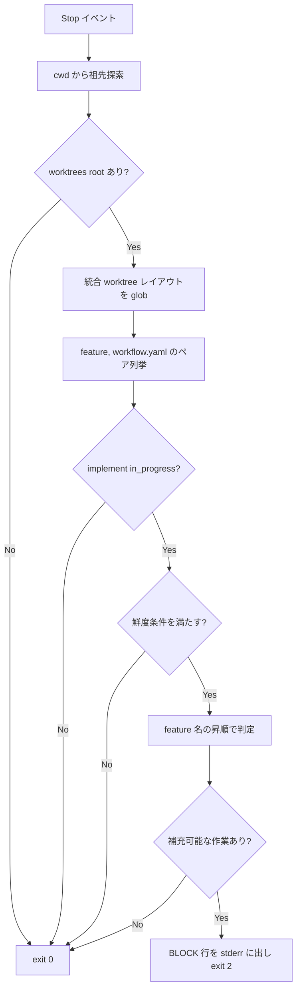

# stopguard-worktree-paths - 要件定義書

## 1. 概要

### 1.1 背景

`em-workflow/hooks/queue_stop_guard.py` は、implement フェーズで実行中の feature に
補充可能なタスクが残っている場合に Stop をブロックする「補充ネット」である。しかし
`em-workflow/references/implement-phase.md` が SSOT として固定している Branch & Worktree
Model の下では、`feature-docs/{feature}/` は統合 worktree の中にしか存在しない。
現在の hook はプロジェクトルート相対でパスを組み立てているため、`workflow.yaml` と
`journal.jsonl` を同時に解決できず、このネットは一度も発火していない。

過去に修正を試みたコミット (827d223) は revert されている (db91387)。その実装は
`feature-docs/*` のワイルドカードから feature 名を列挙し、解決側でパスを組み立て直して
いたため、列挙したファイルと読み込むファイルが食い違い得る構造になっていた。

### 1.2 目的

- hook を実運用で実際に発火させる。
- hook を「権威」ではなく「fail-open なネット」のまま保つ。
- feature 同定の導出を 1 箇所に限定する。

### 1.3 スコープ

**対象**:

- `em-workflow/hooks/queue_stop_guard.py` のパス解決、feature 列挙、active 集合フィルタ
- `tests/test_queue_stop_guard.py` の fixture 移行および実レイアウトのテスト追加
- `em-workflow/.claude-plugin/plugin.json` および `.claude-plugin/marketplace.json` の
  version bump

**対象外**:

- `queue_launch_guard.py` / `queue_failure_net.py` / `queue_taskstop_net.py`
- journal / サイドカーの配置契約
- `MAX_PARALLEL_IMPLEMENTERS` のスロット計算、3 連続ブロック上限、
  recycled task id の例外扱い

## 2. ビジネス要件

### 2.1 ビジネス目標

| ID | 目標 |
|----|------|
| OBJ1 | `em-workflow/hooks/queue_stop_guard.py` を実運用で実際に発火させる。Branch & Worktree Model の下では `feature-docs/{feature}/` は統合 worktree の中にしか存在せず、現在のルート相対のパス構築では `workflow.yaml` と `journal.jsonl` を同時に解決できないため、補充ネットは一度も発火していない。 |
| OBJ2 | hook を権威ではなく fail-open なネットのまま保つ。本変更はセッションが誤ってブロックされる経路を一切追加せず、想定外の状態はすべて無言で exit 0 する。 |
| OBJ3 | feature 同定をちょうど 1 回だけ導出する。revert された試み (827d223 → db91387) は `feature-docs/*` のワイルドカードから feature 名を列挙したうえで解決側でパスを組み立て直しており、列挙したファイルと読んだファイルが食い違い得た。列挙と解決は 1 つの導出を共有しなければならない。 |

### 2.2 対象ユーザー

| ユーザータイプ | 説明 |
|----------------|------|
| em-workflow の implement フェーズを実行する Claude Code セッション | Stop イベント時に補充可能なタスクが残っていればブロックされ、実装が継続される |

### 2.3 期待される効果

- 統合 worktree レイアウト下で `workflow.yaml` と `journal.jsonl` の双方が解決され、
  補充ネットが機能する。
- feature 同定の二重導出という、過去の revert の原因となった構造的欠陥が解消される。
- Stop 経路から git サブプロセスが消え、hook はプロセスを一切起動しなくなる。

## 3. ユースケース

### 3.1 ユースケース一覧

| ID | ユースケース名 | アクター | 優先度 |
|----|----------------|----------|--------|
| UC01 | メインツリーからの Stop で補充ブロックする | Claude Code セッション | 高 |
| UC02 | 統合 worktree 内からの Stop で同一判定を得る | Claude Code セッション | 高 |
| UC03 | 放置された統合 worktree を active 集合から除外する | Claude Code セッション | 高 |

### 3.2 ユースケース詳細

#### UC01: メインツリーからの Stop で補充ブロックする

**アクター**: Claude Code セッション（Stop イベント）

**事前条件**:

- cwd がメインツリー内のいずれかである
- ある feature の implement ステップが `in_progress` である
- その feature に補充可能なタスクが残っている

**基本フロー**:

1. cwd から自身を含む祖先を遡り、`.claude/worktrees/em-workflow` を持つ最近接の
   ディレクトリを worktrees root として得る。
2. `{worktrees_root}/*/integration/feature-docs/*/workflow.yaml` を glob して、
   (feature 同定, workflow.yaml パス) のペアを列挙する。
3. implement ステップが `in_progress` かつ鮮度条件を満たす feature を active 集合に入れる。
4. feature 名の昇順で最初の、補充可能な作業を持つ feature を選ぶ。
5. 列挙されたパスをそのまま読み、`{worktrees_root}/{feature}` から journal を導出する。
6. BLOCK 行（feature、free_slots、昇順のタスク一覧）を stderr に出し、exit 2 する。

**代替フロー**:

- worktrees root が見つからない: active な feature なしとして無言で exit 0。
- 入力が壊れている / stat に失敗する: 無言で exit 0。

**事後条件**:

- 補充可能な作業がある場合のみ exit 2。それ以外は exit 0。

#### UC02: 統合 worktree 内からの Stop で同一判定を得る

**アクター**: Claude Code セッション（Stop イベント）

**事前条件**:

- cwd が統合 worktree の中である

**基本フロー**:

1. 祖先探索が UC01 と同一の worktrees root に解決する。
2. 以降は UC01 と同一。

**事後条件**:

- UC01 と同一の exit code および stderr。

#### UC03: 放置された統合 worktree を active 集合から除外する

**アクター**: Claude Code セッション（Stop イベント）

**事前条件**:

- 列挙された feature の implement ステップが `in_progress` のままである

**基本フロー**:

1. `{worktrees_root}/{feature}/journal.jsonl` の mtime を取る。
2. `journal.jsonl` が存在しなければ、列挙された `workflow.yaml` の mtime にフォールバックする。
3. 選ばれた mtime が現在時刻より 24 時間以上古ければ、その feature を active 集合から除外する。

**代替フロー**:

- どちらの stat も実行できない: 除外する（＝ブロックしない側に倒す）。

**事後条件**:

- 除外された feature は決してブロックしない。

## 4. 機能要件

### 4.1 機能一覧

| ID | 機能名 | 説明 | 状態 |
|----|--------|------|------|
| FR1 | workflow.yaml と journal のペアベース解決 | 列挙が解決済みのペアを渡し、そのパスをそのまま読む | resolved |
| FR2 | メインツリーから進行中 feature を列挙可能にする | 統合 worktree レイアウトを glob して (feature, path) ペアを返す | resolved |
| FR3 | 鮮度条件による放置 worktree の除外 | mtime が 24 時間より古い feature を active 集合から外す | resolved |
| FR4 | 列挙対象は統合 worktree レイアウトのみ | flat レイアウトの列挙を撤去する | resolved |
| FR5 | 列挙起点は cwd の祖先探索から得る | `.claude/worktrees/em-workflow` を持つ最近接の祖先を使う | resolved |

### 4.2 機能詳細

#### FR1: workflow.yaml と journal のペアベース解決

**説明**:

`evaluate_feature` は `{root}/feature-docs/{feature}/workflow.yaml`
(`queue_stop_guard.py:258`) をもう組み立てない。列挙側が解決済みのペア — feature 同定と、
実際に見つかった `workflow.yaml` の正確なパス — を渡し、`evaluate_feature` はそのパスを
そのまま読む。journal ディレクトリは、同じ列挙パスの worktree 側セグメント
`{worktrees_root}/{feature}` から導出する。これは `journal.jsonl` と
`stop-guard-state.json` が既に置かれている場所でもある（`queue_stop_guard.py:266` の
配置は維持され、到達方法だけが変わる）。したがって列挙されたファイルと読まれたファイルは
構造上同一であり、列挙パス中の `feature-docs/*` ワイルドカードは feature 同定の
供給源として一切使われない。

**入力**:

- (feature 同定, workflow.yaml の絶対パス): ペア - 列挙側が解決済みで渡す

**出力**:

- そのペアに対する block / no-block の判定

**ビジネスルール**:

- 列挙したファイルと読むファイルは構造上同一であること。
- `feature-docs/*` ワイルドカードを feature 同定の供給源にしないこと。

#### FR2: メインツリーから進行中 feature を列挙可能にする

**説明**:

cwd がメインツリー内のいずれかである Stop イベントは、implement ステップが
`in_progress` であるすべての feature を、統合 worktree レイアウト
`{worktrees_root}/*/integration/feature-docs/*/workflow.yaml` の glob によって列挙する。
`active_features` は素の feature 名ではなく (feature 同定, workflow.yaml パス) のペアを
返し、hook はそれらの feature について実際に block / no-block の判定に到達する。
feature の順序は feature 名による安定順のままで、既存の「補充可能な作業を持つ最初の
in_progress feature が勝つ」という挙動は変わらない。

**処理フロー**:

**ビジネスルール**:

- 列挙は feature 名による安定順であること。
- 「補充可能な作業を持つ最初の in_progress feature が勝つ」挙動を変えないこと。

#### FR3: 鮮度条件による放置統合 worktree の除外

**説明**:

列挙され、かつ implement ステップが依然 `in_progress` と読める feature は、鮮度条件を
満たす場合にのみ active 集合に入る。鮮度は `{worktrees_root}/{feature}/journal.jsonl` の
mtime であり、`journal.jsonl` が存在しない場合は列挙された `workflow.yaml` の mtime に
フォールバックする。選ばれた mtime が現在時刻より 24 時間以上古い feature は active 集合から
除外され、決してブロックしない。閾値は単一の名前付き定数とする。このチェックのコストは
候補 feature あたり厳密に stat 1 回で、ディレクトリ走査を追加しない。どちらの stat も
実行できない場合、その feature は除外される — 判定不能なケースは非ブロック側に倒れ、
hook の「権威ではなくネット」という契約に一致する。

**バリデーション**:

| 項目 | ルール |
|------|--------|
| 鮮度 mtime | `{worktrees_root}/{feature}/journal.jsonl` の mtime |
| フォールバック | `journal.jsonl` が無ければ列挙された `workflow.yaml` の mtime |
| 閾値 | 現在時刻から 24 時間。単一の名前付き定数として定義する |
| コスト | 候補 feature あたり stat 1 回。ディレクトリ走査の追加なし |

**エラーケース**:

| エラー | 条件 | 対応 |
|--------|------|------|
| stat 不能 | 両方の stat が実行できない | feature を除外する（ブロックしない） |

#### FR4: 列挙対象は統合 worktree レイアウトのみ

**説明**:

flat レイアウトの列挙 `{root}/feature-docs/*/workflow.yaml`
(`queue_stop_guard.py:311`) は完全に撤去し、2 本目の列挙経路を残さない。メインツリーの
`feature-docs/` 直下に置かれた `workflow.yaml` は決して列挙されない。これは、そこに
`in_progress` な `workflow.yaml` は存在し得ないという SSOT と整合する。

**テストスイートへの帰結**:

- `tests/test_queue_stop_guard.py` の `StopGuardFixture` は現在
  `{root}/feature-docs/{feature}/workflow.yaml` に `workflow.yaml` を書いており、
  `{root}/.claude/worktrees/em-workflow/{feature}/integration/feature-docs/{feature}/workflow.yaml`
  に書くよう移行しなければならない。
- `journal.jsonl` と `stop-guard-state.json` は
  `{root}/.claude/worktrees/em-workflow/{feature}/` のままとする。
- 同ファイルの既存テストクラス（blocking、failed-task、non-blocking states、
  consecutive-block cap、fail-open、retry-after-failure、recycled task id、
  round-1 regressions）はすべて移行後の fixture を継承する。
- 移行後、flat レイアウトが列挙されることに依存するテストがあってはならない。

#### FR5: 列挙起点は cwd の祖先探索から得る

**説明**:

列挙起点は、hook の cwd（自身を含む）から遡って `.claude/worktrees/em-workflow` を
含む最近接の祖先を求め、そのディレクトリを worktrees root として得る。これは
`queue_taskstop_net.find_worktrees_root` (`queue_taskstop_net.py:149`) と同一の機構である。
探索がヒットしない場合は active な feature なしとし、無言で exit 0 する。
`find_project_root` の `git rev-parse --show-toplevel` サブプロセスは Stop 経路から
取り除かれ、hook はプロセスを一切起動しなくなる。

queue 系 hook はパス指定で起動されるスタンドアロンスクリプトであり、共有できる
import 可能なモジュールが無いため、この探索は共通化せず、既存実装と同一のセマンティクスで
`queue_stop_guard.py` に複製する。

## 5. 非機能要件

| ID | 要件 |
|----|------|
| NFR1 | Python 標準ライブラリのみ。`queue_stop_guard.py` にサードパーティ import を追加しない。既存の stdlib-only テストが通り続けること。 |
| NFR2 | fail-open 契約を例外なく維持する。壊れた stdin、dict でない payload、読めない／壊れた `workflow.yaml` / `journal.jsonl`、存在しない journal ディレクトリ、失敗した stat、到達できない worktrees root、その他あらゆる未処理例外は、すべて無言で exit 0 する。従来 exit 0 だった条件で exit 2 する新しいコード経路があってはならない。 |
| NFR3 | Stop あたりのコストは上界が定まり増加しない。`{worktrees_root}/*/integration/feature-docs/*/workflow.yaml` の glob 1 回と、列挙された feature あたり stat 1 回。サブプロセスは今日より 1 つ少ない（git toplevel の探査が無くなる）。再帰スキャンを導入しない。 |
| NFR4 | feature 同定はちょうど 1 箇所 — 列挙されたパス — から導出し、解決側で再導出しない。これは過去の revert を招いた構造的欠陥であり、本フィーチャーではレビューのブロッキング不変条件とする。 |
| NFR5 | スコープ封じ込め。`queue_launch_guard.py`、`queue_failure_net.py`、`queue_taskstop_net.py` は変更しない。journal / サイドカーの配置、`MAX_PARALLEL_IMPLEMENTERS` のスロット計算、3 連続ブロック上限、recycled task id の例外扱いは現在のセマンティクスを保つ。 |
| NFR6 | 同じ変更で `em-workflow/.claude-plugin/plugin.json` と `.claude-plugin/marketplace.json` の該当エントリを同一の新バージョンへ bump する。bump が無いとインストール済みプラグインのキャッシュが古い hook を配り続け、修正が効かない。 |

### 5.1 パフォーマンス要件

NFR3 のとおり。glob 1 回、候補 feature あたり stat 1 回、サブプロセス 0 回。

### 5.2 セキュリティ要件

該当なし（本フィーチャーは認証・認可・外部入力の受理面を持たない）。

### 5.3 可用性要件

NFR2 のとおり。あらゆる想定外の状態で無言の exit 0 に倒れる。

### 5.4 保守性要件

- 鮮度の閾値は単一の名前付き定数として定義する（FR3）。
- 祖先探索は共有モジュール化せず、既存実装と同一セマンティクスで複製する（FR5）。

### 5.5 互換性要件

- Python 標準ライブラリのみ（NFR1）。
- プラグインバージョンの bump（NFR6）。

## 6. UI/UX要件

該当なし。本フィーチャーは UI、描画出力、ユーザーに見える視覚面を持たない。

## 7. データ要件

### 7.1 データモデル概要

永続データモデルは持たない。参照するファイルは次のとおり。

| ファイル | 位置 | 用途 |
|----------|------|------|
| `workflow.yaml` | `{worktrees_root}/{feature}/integration/feature-docs/{feature}/workflow.yaml` | implement ステップの状態とタスク一覧 |
| `journal.jsonl` | `{worktrees_root}/{feature}/journal.jsonl` | launched イベントおよび鮮度 mtime |
| `stop-guard-state.json` | `{worktrees_root}/{feature}/stop-guard-state.json` | サイドカーの fingerprint と連続ブロック数 |

### 7.2 データ保持期間

該当なし。

## 8. 外部連携

該当なし。Stop 経路でサブプロセスを起動せず、外部システムとも連携しない。

## 9. 制約条件

### 9.1 技術的制約

- Python 標準ライブラリのみを使用する（NFR1）。
- queue 系 hook はパス指定で起動されるスタンドアロンスクリプトであり、共有できる
  import 可能なモジュールが無い（FR5）。
- fail-open 契約を破る経路を追加できない（NFR2）。

### 9.2 ビジネス上の制約

- `queue_launch_guard.py` / `queue_failure_net.py` / `queue_taskstop_net.py` を
  変更してはならない（NFR5）。

### 9.3 スケジュール制約

該当なし。

### 9.4 宣言された変更集合

**このフィーチャー固有のパス**:

- `em-workflow/hooks/queue_stop_guard.py`
- `tests/test_queue_stop_guard.py`
- `em-workflow/.claude-plugin/plugin.json`
- `.claude-plugin/marketplace.json`

**デフォルトメンバー**（SPEC作成者が明示的に除外しない限り、常に宣言に含まれる）:

- `feature-docs/stopguard-worktree-paths/**`
- `test-docs/stopguard-worktree-paths/**`

`feature-docs/{feature}/**` に含まれるもの: `REQUIREMENTS.md`、`SPEC.md`、`workflow.yaml`、
`phase-state/`、`tasks/`、`reviews/roundN.yaml`、`VERIFICATION.md`、`retrospect.yaml`、
およびデザインステップが生成するデザイン成果物。生成主体は各フェーズドキュメントおよび
`references/phase-state.md` を参照。

`test-docs/{feature}/**` に含まれるもの: `test-docs/stopguard-worktree-paths/{T}.tests.yaml`。
生成主体は `implement-phase.md` を参照。

**意味論**:

- デフォルトのメンバーは、SPEC作成者が明示的に除外しない限り宣言に含まれる。
- この宣言はスーパーセットの主張であり、実際の変更集合は宣言に含まれる必要がある。

## 10. 想定される課題とリスク

### 10.1 技術的課題

| 課題 | 影響度 | 対応策 |
|------|--------|--------|
| feature 同定の二重導出が再発する（過去の revert の原因） | 高 | 列挙と解決で 1 つの導出を共有する（FR1 / NFR4、レビューのブロッキング不変条件） |
| 鮮度テストが時計に依存して不安定になる | 中 | 境界値を 24 時間の閾値から十分離して選ぶ（TS4） |
| fixture 移行で既存テストの意図が変わる | 中 | 既存テストクラスは移行後の fixture を継承し、意図を変えずに通す（FR4 / TS7） |
| version bump 漏れでキャッシュが古い hook を配り続ける | 高 | 同じ変更で plugin.json と marketplace.json を同一値に bump する（NFR6） |

## 11. 成功基準

### 11.1 受け入れ基準

- [ ] AC1: 実レイアウトを再現した fixture（`workflow.yaml` は統合 worktree の中、
      `journal.jsonl` はその 1 つ上の feature ディレクトリ）で、cwd がメインツリーの
      Stop イベントが両ファイルを解決し、feature・free_slots・昇順のタスク一覧を名指しする
      期待どおりの BLOCK 行を出し、exit code 2 となる。
- [ ] AC2: 同じ fixture で cwd を統合 worktree 内に設定しても同一の判定になる。祖先探索が
      同じ worktrees root に解決するため。
- [ ] AC3: 鮮度 mtime が 24 時間より古い feature は、implement ステップが `in_progress` で
      補充可能な作業があってもブロックしない（exit 0）。同じ feature の mtime が新しければ
      ブロックする。
- [ ] AC4: `journal.jsonl` が無く `workflow.yaml` が新しい場合、フォールバック mtime により
      feature は active のまま。`journal.jsonl` が無く `workflow.yaml` が古い場合、feature は
      除外される。
- [ ] AC5: `{root}/feature-docs/{feature}/workflow.yaml` にのみ置かれ implement が
      `in_progress` な `workflow.yaml` は、決して列挙されず決してブロックしない。
- [ ] AC6: hook の既存の挙動 — failed-task のパススルー、recycled task id の例外扱い、
      free-slot 計算、サイドカー fingerprint と 3 連続ブロック上限、欠落／破損入力での
      fail-open — が、移行後の fixture の下ですべて不変である。
- [ ] AC7: Stop 経路で git サブプロセスが起動されず、`queue_stop_guard.py` は標準ライブラリの
      モジュールのみを import する。
- [ ] AC8: `python3 -m unittest discover -s tests` が通り、実レイアウトのテストが
      `tests/test_queue_stop_guard.py` に追加されている。
- [ ] AC9: `em-workflow/.claude-plugin/plugin.json` と `.claude-plugin/marketplace.json` が
      本変更で同一の bump 済みバージョンを持つ。

## 12. テストシナリオ

### 12.1 テスト観点

- [ ] 正常系 (TS1): 実レイアウト fixture、cwd = メインツリールート。`workflow.yaml` は
      `{root}/.claude/worktrees/em-workflow/{feature}/integration/feature-docs/{feature}/workflow.yaml`
      に implement `in_progress` と task0001..task0002 を宣言、`journal.jsonl` は
      `{root}/.claude/worktrees/em-workflow/{feature}/journal.jsonl` に launched イベント無しで置く。
      exit 2 と、feature 名および両タスク id を名指しする stderr の BLOCK 行を期待する。
- [ ] 正常系 (TS2): 同じ fixture、cwd = 統合 worktree ディレクトリ。同一の exit code と stderr を
      期待し、worktree の中からでも祖先探索が同じ worktrees root に解決することを示す。
- [ ] 異常系 (TS3): 同じ fixture で `journal.jsonl` を削除しディレクトリだけ残す。すべてのタスクが
      未 launch と数えられ、hook は依然ブロックする。`.claude/worktrees/em-workflow` 配下の
      feature ディレクトリごと無い場合は exit 0、クラッシュしない。
- [ ] 境界値 (TS4): 鮮度。(a) `os.utime` で `journal.jsonl` の mtime を現在から 25 時間前に
      設定 — implement が `in_progress` で未 launch タスクがあっても exit 0、ブロックなし。
      (b) 同じ fixture で `journal.jsonl` の mtime を現在に設定 — exit 2。
      (c) `journal.jsonl` 無し、`workflow.yaml` の mtime を現在から 25 時間前 — exit 0。
      (d) `journal.jsonl` 無し、`workflow.yaml` の mtime を現在 — exit 2。
      境界値は 24 時間の閾値から十分離して選び、時計依存で不安定にならないようにする。
- [ ] 異常系 (TS5): cwd が一時ディレクトリで、その上位のどこにも
      `.claude/worktrees/em-workflow` が無い場合。exit 0、stderr は空、例外なし。
- [ ] 異常系 (TS6): flat レイアウトの撤去。`{root}/feature-docs/{feature}/workflow.yaml` を
      implement `in_progress` で書き、統合 worktree は置かない。exit 0 を期待する
      — flat レイアウトは列挙源ではない。
- [ ] 回帰 (TS7): fixture 移行の回帰スイープ。`StopGuardFixture` が統合 worktree のパスに書き、
      既存テストクラス（`TestQueueStopGuardBlocking`、`TestQueueStopGuardFailedTask`、
      `TestQueueStopGuardNonBlockingStates`、`TestQueueStopGuardConsecutiveBlockCap`、
      `TestQueueStopGuardFailOpen`、`TestQueueStopGuardRetryAfterFailure`、
      `TestQueueStopGuardRecycledTaskId`、`TestQueueStopGuardReviewRound1Regressions`）が
      意図を変えずに通る。journal を書く fixture は、鮮度チェックが現在の mtime を見るように
      しなければならない（tempfile で作られたファイルは構造上新しい）。
- [ ] 正常系 (TS8): 2 つの feature が同時に列挙され、どちらも `in_progress` かつ補充可能。
      hook は従来どおり feature 名の安定順で最初のものを報告する。
- [ ] 静的検査 (TS9): `TestQueueStopGuardStdlibOnly` が通り続け、`queue_stop_guard.py` が
      Stop 経路で `git` を参照せず、サブプロセスも起動しない。

## 13. 用語定義

| 用語 | 定義 |
|------|------|
| worktrees root | `.claude/worktrees/em-workflow` を含む、cwd から最近接の祖先ディレクトリ |
| 統合 worktree | `{worktrees_root}/{feature}/integration`。`feature-docs/{feature}/` が存在する唯一の場所 |
| flat レイアウト | `{root}/feature-docs/*/workflow.yaml`。本フィーチャーで列挙対象から撤去する |
| 鮮度 | `journal.jsonl`（無ければ `workflow.yaml`）の mtime による active 判定条件。閾値 24 時間 |
| fail-open | 想定外の状態で無言の exit 0 に倒れ、ブロックしないこと |

## 14. 確認事項

### 14.1 確認済み事項

- [x] 放置された統合 worktree の扱い: active 集合に鮮度条件を加える。`journal.jsonl` の mtime、
      無ければ `workflow.yaml` の mtime が 24 時間より古い feature を除外する。判定不能な stat は
      除外側（＝ブロックしない側）に倒す。（FR3 / AC3 / AC4 / TS4 に反映）
- [x] メインツリーの flat レイアウトの扱い: 列挙するのは統合 worktree レイアウトのみ。
      flat レイアウトの glob は撤去し、既存テスト fixture を実レイアウトへ移行する。
      （FR4 / AC5 / AC6 / TS6 / TS7 に反映）
- [x] 列挙起点の求め方: `.claude/worktrees/em-workflow` を持つ最近接の cwd 祖先。
      `queue_taskstop_net.find_worktrees_root` と同一機構。git サブプロセスは使わない。
      （FR5 / AC2 / AC7 / TS2 / TS5 / TS9 に反映）
- [x] デザインステップ: analyst の skip 推奨をそのまま採用する。

### 14.2 未確認・保留事項

なし。すべての要件が `status: resolved` である。

### 14.3 前提

| ID | 前提 |
|----|------|
| a1 | journal / サイドカーの配置契約は不変。`journal.jsonl` と `stop-guard-state.json` は各 implementer worktree の親である `{worktrees_root}/{feature}/` に置かれ、`queue_launch_guard.py`、`queue_failure_net.py`、`queue_taskstop_net.py` が導出するとおりである。本フィーチャーは `workflow.yaml` の位置の求め方と feature の列挙方法だけを変える。 |
| a2 | 他の 3 つの queue hook はこの欠陥の影響を受けずスコープ外であり、変更しない。 |
| a3 | パス解決の下流にある判定ロジック — `MAX_PARALLEL_IMPLEMENTERS` に対するスロット計算、failed-task のパススルー、recycled task id の例外扱い、サイドカー fingerprint、3 連続ブロック上限 — は現在のセマンティクスを保つ。本フィーチャーが触れるのはパス解決、列挙、active 集合フィルタのみ。 |
| a4 | `em-workflow/` 配下のファイルが変わるため、同じ変更で `em-workflow/.claude-plugin/plugin.json` と `.claude-plugin/marketplace.json` の両方でプラグインバージョンを bump しなければならず、新しい hook がプラグインキャッシュから配られるにはユーザーが Claude Code を再起動する必要がある。 |
| a5 | `requirement.abandoned-integration-worktree` の解決（batch、codex consultation、option `journal_freshness`）: active 集合に鮮度条件を加える。`journal.jsonl` の mtime、フォールバックは `workflow.yaml` の mtime、24 時間より古ければ除外。判定不能な stat は除外（非ブロック）側に倒す。FR3 / AC3 / AC4 / TS4 に反映。 |
| a6 | `requirement.main-tree-flat-layout` の解決（batch、codex consultation、option `worktree_only`）: 列挙するのは統合 worktree レイアウトのみ。flat レイアウトの glob は撤去し、既存テスト fixture は実レイアウトへ移行する。FR4 / AC5 / AC6 / TS6 / TS7 に反映。 |
| a7 | `requirement.enumeration-root-discovery` の解決（batch、codex consultation、option `cwd_ancestor_walk`）: 列挙起点は `.claude/worktrees/em-workflow` を持つ最近接の cwd 祖先であり、`queue_taskstop_net.find_worktrees_root` と同一機構。git サブプロセスは使わない。FR5 / AC2 / AC7 / TS2 / TS5 / TS9 に反映。 |
| a8 | `design-step.recommendation` の解決（batch、decision table、option `decide_autonomously`）: analyst の skip 推奨をそのまま採用する。 |

### 14.4 デザインステップ

**status**: skipped

**理由**: 本フィーチャーの対象面は、単一の Python Stop hook とその unittest fixture の中の
パス解決と active 集合フィルタがすべてである。UI も、描画出力も、ユーザーに見える視覚面も、
デザインシステム入力も持たない。ゲート `create-spec.design-step` は batch モードで
`decide_autonomously` に解決し、ユーザーへの問い合わせなしにこの推奨を採用した。

## 15. 参考資料

- `em-workflow/hooks/queue_stop_guard.py`: 本フィーチャーが変更する hook
- `em-workflow/hooks/queue_taskstop_net.py`: `find_worktrees_root` の既存実装（`:149`）
- `em-workflow/references/implement-phase.md`: Branch & Worktree Model の SSOT
- `tests/test_queue_stop_guard.py`: 移行対象のテストスイート
- コミット 827d223 / db91387: revert された過去の修正試行
