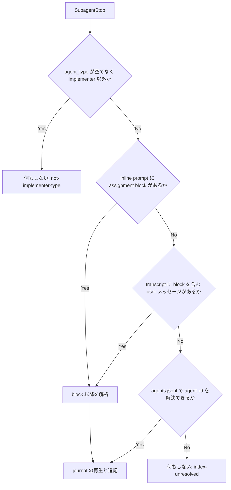

# subagentstop-failed-event - 要件定義書

## 1. 概要

### 1.1 背景

em-workflow の implement フェーズで、implementer サブエージェントが merge に到達せずに終了したのに、`journal.jsonl` に terminal event（`merged` / `failed`）が書かれず、`launched` が最後のイベントのまま残る事象が観測された。この状態で同じ task id の implementer を再起動しようとすると、`queue_launch_guard.py` が二重起動として拒否する。オーケストレーターは journal を書かないため、この状態から抜ける手段が無い。

SubagentStop フックが発火しなかったのか、発火したがタスクを特定できなかったのかは未診断である。

### 1.2 目的

- merge に到達せずに終了した implementer に対して、SubagentStop の failure net（`queue_failure_net.py`）が `failed` を 1 行だけ追記し、`implement.failed-task` の retry（kept worktree への fresh implementer の dispatch）を launch guard が受け付ける状態にする。
- failure net が実際の implementer の終了を黙って見逃すリポジトリ内の原因を取り除く。
- 「SubagentStop が発火しなかった」と「フックは発火したがタスクを特定できなかった」を事後に区別できるようにする。

### 1.3 スコープ

**対象**:

- `em-workflow/hooks/queue_failure_net.py` の implementer 判定、タスク特定、journal への追記、診断ログ
- `queue_launch_guard.py` と同一の task id 解析（パリティテストで固定）
- failure net の追記後に launch guard が再起動を受け付けることのテスト
- `implement-phase.md` と `queue_failure_net.py` のモジュール docstring の更新
- em-workflow のバージョン更新（0.2.3 → 0.2.4）

**対象外**:

- harness がバックグラウンドの implementer や再開可能な implementer に SubagentStop を配信するかどうか（A-4）

## 2. ビジネス要件

### 2.1 ビジネス目標

- merge に到達せずに終了した implementer に対して、SubagentStop の failure net（`queue_failure_net.py`）が `failed` を 1 行だけ追記し、launch guard が `implement.failed-task` の retry（kept worktree への fresh implementer の dispatch）を受け付ける。
- failure net が実際の implementer の終了を黙って見逃すリポジトリ内の原因を取り除く。原因は次のとおり。
    - 接頭辞なしの agent_type
    - prompt または transcript パスの欠落
    - 最初の user メッセージにない task assignment
    - launch guard と異なる task id 解析
    - 非アトミックな読み取りと追記
- 「SubagentStop が発火しなかった」と「フックは発火したがタスクを特定できなかった」を事後に区別できる。

### 2.2 対象ユーザー

| ユーザータイプ | 説明 |
|----------------|------|
| em-workflow のオーケストレーター | `implement.failed-task` の retry で、同じ task id の fresh implementer を dispatch する |
| em-workflow の利用者 | 診断ログで、SubagentStop が発火しなかったのか、タスクを特定できなかったのかを区別する |

### 2.3 期待される効果

- merge せずに終了した implementer に対して `failed` が 1 行だけ追記され、同じ task id の再起動が launch guard に通る。
- `queue_taskstop_net.py` と合わせて、`failed` は最大 1 行に保たれる。
- SubagentStop が発火しなかった場合と、発火したがタスクを特定できなかった場合を事後に区別できる。

## 3. ユースケース

### 3.1 ユースケース一覧

| ID | ユースケース名 | アクター | 優先度 |
|----|----------------|----------|--------|
| UC01 | merge せずに終了した implementer の retry | implementer（SubagentStop 経由）、オーケストレーター | 高 |
| UC02 | implementer 終了後の診断 | em-workflow の利用者 | 高 |

### 3.2 ユースケース詳細

#### UC01: merge せずに終了した implementer の retry

**アクター**: implementer サブエージェント（harness の SubagentStop 経由）、オーケストレーター

**事前条件**:
- 対象タスクの journal の最終イベントが `launched` である。

**基本フロー**:
1. implementer が merge に到達せずに終了する。
2. harness が SubagentStop を配信し、`queue_failure_net.py` が起動する。
3. フックが agent_type、assignment block（inline prompt、または transcript 内で最初に block を含む user メッセージ）、agents.jsonl の順でタスクを特定する。
4. フックが 1 つの排他ロック区間の中で journal を再生し、タスクの最終イベントが `merged` / `failed` でなければ `failed` を 1 行追記する。
5. フックが診断ログに 1 行追記する。
6. オーケストレーターが同じ task id で implementer を再起動し、`queue_launch_guard.py` がそれを許可して `launched` を追記する。

**代替フロー**:
- タスクを特定できない場合、フックは journal に書かない。診断ログには該当する outcome code を記録する。
- タスクの最終イベントがすでに `merged` / `failed` の場合、フックは追記しない（`already-terminal`）。
- `queue_taskstop_net.py` と同じタスクに対して同時に動いた場合も、`failed` は最大 1 行になる。
- SubagentStop が配信されない場合、その終了に対応する診断ログの行は残らない。この場合は既存の stale-`launched` 回復（I.2.b step 1 の orphan-recovery の extended same-session branch）で扱う。

**事後条件**:
- journal の対象タスクに `failed` が 1 行だけ存在し、再起動後は新しい `launched` が追記されている。
- 診断ログに今回の起動の行が 1 行存在する。

#### UC02: implementer 終了後の診断

**アクター**: em-workflow の利用者

**事前条件**:
- implementer が終了している。

**基本フロー**:
1. `.claude/worktrees/em-workflow/subagent-stop-diagnostics.jsonl` を読む。
2. 対象の終了に対応する行の有無と outcome code を確認する。

**代替フロー**:
- 対応する行が無い場合、その終了に対してフックは実行されていない。

**事後条件**:
- 「SubagentStop が発火しなかった」と「フックは発火したがタスクを特定できなかった」を区別できている。

## 4. 機能要件

### 4.1 機能一覧

| ID | 機能名 | 説明 | 優先度 |
|----|--------|------|--------|
| FR1 | agent_type による implementer 判定 | `em-workflow:implementer` と接頭辞なしの `implementer` を implementer として扱う | 高 |
| FR2 | 最初の user メッセージ以外からの assignment block 検出 | transcript 内で `# Task assignment` 見出しを含む最初の user メッセージを使う | 高 |
| FR3 | prompt テキストが無いときの agent index フォールバック | agents.jsonl から SubagentStop payload の `agent_id` でタスクを解決する | 高 |
| FR4 | launch guard と同一の task id 解析 | `# Task assignment` 見出し以降だけを launch guard と同じロジックで解析する | 高 |
| FR5 | アトミックな再生と追記 | 1 つの排他 flock 区間の中で journal を再生し `failed` を追記する | 高 |
| FR6 | 起動ごとの診断ログ | 起動ごとに journal.jsonl とは別の診断ログへ 1 行追記する | 高 |
| FR7 | failure net 記録後の retry 到達性 | `failed` の追記後、同じ task id の再起動を launch guard が許可する | 高 |
| FR8 | ドキュメント更新 | `implement-phase.md` と `queue_failure_net.py` の docstring を更新する | 高 |
| FR9 | プラグインのバージョン更新 | em-workflow を 0.2.3 から 0.2.4 に上げる | 高 |

### 4.2 機能詳細

**処理フロー（FR1〜FR3 の特定順序）**:

#### FR1: agent_type による implementer 判定

**説明**: `queue_failure_net.py` は agent_type が `em-workflow:implementer` または接頭辞なしの `implementer` の終了を implementer の終了として扱う。

**ビジネスルール**:
- 上記以外の空でない agent_type は「implementer ではない」を意味し、フックは何もしない（既存の `test_queue_failure_net.py:355` の Explore ケースは引き続き通る）。
- agent_type が存在しない、または空の場合は、現状どおり assignment block と index による特定に進む。

#### FR2: 最初の user メッセージ以外からの assignment block 検出

**説明**: inline の prompt フィールド（`prompt` / `initial_prompt` / `agent_prompt`）のいずれにも `# Task assignment` block が無い場合、フックは `agent_transcript_path` の transcript を読み、テキストに `# Task assignment` 見出し行を含む最初の user ロールのメッセージを使う。

**ビジネスルール**:
- transcript の最初の user ロールのメッセージだけを使う動作はやめる。

#### FR3: prompt テキストが無いときの agent index フォールバック

**説明**: assignment block が見つからず（inline prompt が無い、transcript パスが無いまたは読めない、どの user メッセージにも block が無い）、agent_type が implementer または存在しない場合、フックは SubagentStop payload の `agent_id` を使って agents.jsonl からタスクを解決する。

**ビジネスルール**:
- 解決規則は `queue_taskstop_net.py` の `find_task_identity` と同じとする。
    - payload の `cwd` から上に辿って最も近い `.claude/worktrees/em-workflow` を探す
    - 候補リストの上限
    - feature ディレクトリ内への収まり
    - 識別子が複数のタスクにまたがって曖昧な場合は拒否する
    - 同じタスクの後続の launch が存在する場合は拒否する
- 解決できなかった場合は何もしない。

#### FR4: launch guard と同一の task id 解析

**説明**: `queue_failure_net.py` は最初の `# Task assignment` 見出し行より後のテキストからだけ `task_id` と `worktree_path` を抽出する。ロジックと正規表現は `queue_launch_guard.py` の `extract_task_assignment` と同じとする。

**ビジネスルール**:
- 見出しより前にある `task_id:` 行や `worktree_path:` 行（例: 前置きで引用された task id）は無視する。
- 両ファイルはそれぞれ自前のコピーを持つ（フックは単体動作で標準ライブラリのみ）。
- 同じ入力に対して両者が同じ結果を返すことを、パリティテストで固定する。

#### FR5: アトミックな再生と追記

**説明**: `queue_failure_net.py` は journal のファイルディスクリプタ上の 1 つの排他 flock 区間の中で、journal の再生と `failed` の追記を行う。`queue_taskstop_net.py` と `queue_launch_guard.py` と同じ方式とする。

**ビジネスルール**:
- journal は `O_RDWR|O_CREAT|O_APPEND|O_NOFOLLOW` で開き、書き込み後に fsync する。
- タスクの最終イベントが `merged` / `failed` でない場合にだけ追記する。
- 同じタスクに対して `queue_taskstop_net.py` と同時に動いても、`failed` は最大 1 行になる。

#### FR6: 起動ごとの診断ログ

**説明**: `queue_failure_net.py` は起動ごとに、`journal.jsonl` とは別の診断ログへ JSON を 1 行追記する。

**出力**（診断ログの 1 行）:
- タイムスタンプ: 文字列 - オフセット付きの RFC 3339
- `hook_event_name`: 文字列
- `agent_id`: 文字列
- `agent_type`: 文字列
- 特定元: `inline` / `transcript` / `agent-index` / `none` のいずれか
- `task_id`: 文字列 - 解決できた場合のみ
- outcome code: 次の固定集合のいずれか 1 つ
    - `not-implementer-type`
    - `no-prompt-text`
    - `no-assignment-block`
    - `invalid-identity`
    - `index-unresolved`
    - `journal-dir-missing`
    - `already-terminal`
    - `appended`
    - `error`
- 例外クラス名: outcome が `error` の場合のみ

**ビジネスルール**:
- ログの置き場所は、payload の `cwd` から上に辿って最も近い `.claude/worktrees/em-workflow` ディレクトリとする。`cwd` から見つからない場合は、解決済みの `worktree_path` から辿る。
- prompt テキストはログに書かない。
- worktrees ルートが見つからない場合、またはログを書けない場合（ログパスがシンボリックリンクの場合を含む）、フックは黙ってログを省略する。
- ログは終了コードにも journal にも影響しない。
- ある終了に対して診断ログの行が無いことは、その終了に対してフックが実行されなかったことを意味する。

#### FR7: failure net 記録後の retry 到達性

**説明**: 最終イベントが `launched` のタスクに対して `queue_failure_net.py` が `failed` を追記した後、同じ task id の `queue_launch_guard.py` 経由の再起動は許可され、新しい `launched` 行が追記される。

**ビジネスルール**:
- これは既存の launch guard の動作であり、failure net を先に実行するテストで固定する。

#### FR8: ドキュメント更新

**説明**: `implement-phase.md` の「SubagentStop failure net」の項目と「Stale-`launched` caveat」、および `queue_failure_net.py` のモジュール docstring を更新する。

**ビジネスルール**:
- 「SubagentStop failure net」の項目に次を記載する。
    - 特定順序（agent_type の設定 → inline prompt または block を含む最初の user メッセージからの assignment block → agent index フォールバック）
    - アトミックな比較と追記
    - 診断ログの場所と outcome code
    - 診断ログの行が無いことはフックが実行されなかったことを意味すること
- 「Stale-`launched` caveat」に、SubagentStop イベントが配信されない終了は、既存の I.2.b step 1 の orphan-recovery の extended same-session branch で扱われ、writer は追加しないことを記載する。
- `queue_failure_net.py` のモジュール docstring をこれに合わせて更新する。
- `tests/test_stale_launched_doc_contract.py` が固定している文言はそのまま残し、journal の writer の集合は変えない。

#### FR9: プラグインのバージョン更新

**説明**: em-workflow のバージョンを、同じ変更の中で 0.2.3 から 0.2.4 に上げる。

**ビジネスルール**:
- 更新箇所は `em-workflow/.claude-plugin/plugin.json` と、`.claude-plugin/marketplace.json` の em-workflow エントリの 2 箇所とする。

## 5. 非機能要件

| ID | 要件 |
|----|------|
| NFR1 | `queue_failure_net.py` は常に終了コード 0 で終了し、サブエージェントの終了を妨げない。トップレベルの catch-all を持ち、fail-open のままとする。 |
| NFR2 | フックとテストの両方で、Python 標準ライブラリだけを import する（TestStdlibOnly は引き続き通る）。`hooks/` から共有モジュールを import しない。 |
| NFR3 | journal の writer を追加しない。診断ログは `journal.jsonl` ではなく、タスク状態の意味を持たない。 |
| NFR4 | journal の `failed` 行の形式（`event`, `task`, `at`, `reason`）は変えない。`FAILED_REASON` の値は変えず、1 行のダブルクォートのモジュール定数のままとする（`tests/test_queue_taskstop_net.py:52-59` が正規表現で解析しているため）。 |
| NFR5 | `hooks.json` の SubagentStop 登録（matcher なし、コマンド `python3 "${CLAUDE_PLUGIN_ROOT}"/hooks/queue_failure_net.py`、timeout 15）は変えない。 |
| NFR6 | journal のパスと診断ログのパスの両方で、シンボリックリンクを拒否する（`O_NOFOLLOW`）。 |
| NFR7 | `python3 -m unittest discover -s tests` が通る。 |

### 5.1 パフォーマンス要件

- 該当なし

### 5.2 セキュリティ要件

- 認証: 該当なし
- 認可: 該当なし
- データ保護: 診断ログに prompt テキストを書かない（FR6）。
- 入力検証: journal と診断ログのパスでシンボリックリンクを拒否する（NFR6）。agent index による解決では feature ディレクトリ内への収まりを確認する（FR3）。

### 5.3 可用性要件

- フックは常に終了コード 0 で終了し、fail-open とする（NFR1）。

### 5.4 保守性要件

- ログ出力: 起動ごとに診断ログへ 1 行追記する（FR6）。
- 監視: 該当なし
- ドキュメント: `implement-phase.md` と `queue_failure_net.py` の docstring を更新する（FR8）。

### 5.5 互換性要件

- journal の `failed` 行の形式と `FAILED_REASON` を変えない（NFR4）。
- `hooks.json` の SubagentStop 登録を変えない（NFR5）。

## 6. UI/UX要件

### 6.1 画面設計要件

該当なし（UI や視覚的な出力を持たないフックとドキュメントの変更）。

### 6.2 画面遷移

該当なし

### 6.3 レスポンシブ対応

該当なし

## 7. データ要件

### 7.1 データモデル概要

データベースは使わない。扱うデータはファイル上の JSON Lines である。

### 7.2 データ項目

| エンティティ | 項目名 | 型 | 必須 | 説明 |
|--------------|--------|-----|------|------|
| journal の `failed` 行 | `event` | 文字列 | ○ | `failed`（形式は変更しない） |
| journal の `failed` 行 | `task` | 文字列 | ○ | task id |
| journal の `failed` 行 | `at` | 文字列 | ○ | 時刻 |
| journal の `failed` 行 | `reason` | 文字列 | ○ | `FAILED_REASON`（値は変更しない） |
| 診断ログの行 | タイムスタンプ | 文字列 | ○ | オフセット付きの RFC 3339 |
| 診断ログの行 | `hook_event_name` | 文字列 | ○ | payload の値 |
| 診断ログの行 | `agent_id` | 文字列 | ○ | payload の値 |
| 診断ログの行 | `agent_type` | 文字列 | ○ | payload の値 |
| 診断ログの行 | 特定元 | 文字列 | ○ | `inline` / `transcript` / `agent-index` / `none` |
| 診断ログの行 | `task_id` | 文字列 | × | 解決できた場合のみ |
| 診断ログの行 | outcome code | 文字列 | ○ | FR6 の固定集合のいずれか |
| 診断ログの行 | 例外クラス名 | 文字列 | × | outcome が `error` の場合のみ |

### 7.3 データ保持期間

| データ種別 | 保持期間 |
|------------|----------|
| 診断ログ（`.claude/worktrees/em-workflow/subagent-stop-diagnostics.jsonl`） | ローテーションなし。コミットしない（A-5） |

## 8. 外部連携

### 8.1 連携システム

| システム名 | 連携方法 | データ |
|------------|----------|--------|
| Claude Code harness | SubagentStop フック（`hooks.json`） | payload の `agent_type`、`agent_id`、`cwd`、`hook_event_name`、`prompt` / `initial_prompt` / `agent_prompt`、`agent_transcript_path` |

### 8.2 API仕様要件

該当なし

## 9. 制約条件

### 9.1 技術的制約

- フックは単体で動作し、Python 標準ライブラリだけを使う。共有モジュールは作らない（NFR2、A-3）。
- `hooks.json` の SubagentStop 登録を変えない（NFR5）。
- journal の writer の集合（`merge-task.sh`、`queue_launch_guard.py`、`queue_failure_net.py`、`queue_taskstop_net.py`、`journal-append-failed.py`）を変えない（NFR3、A-7）。
- `FAILED_REASON` の値と 1 行の定数の形を変えない（NFR4、A-8）。

### 9.2 ビジネス上の制約

- 該当なし

### 9.3 スケジュール制約

- 該当なし

### 9.4 宣言された変更集合

このフィーチャー固有のパスは手動で列挙せず、create-plan で `workflow.yaml` の各タスクの `files` から導出する（`references/phases/create-plan-phase.md`）。

**デフォルトメンバー**（SPEC作成者が明示的に除外しない限り、常に宣言に含まれる）:
- `feature-docs/subagentstop-failed-event/**`
- `test-docs/subagentstop-failed-event/**`

`feature-docs/subagentstop-failed-event/**` に含まれるもの: `REQUIREMENTS.md`、`SPEC.md`、`IMPLEMENTATION.md`、`workflow.yaml`、`phase-state/`、`tasks/`、`reviews/roundN.yaml`、`VERIFICATION.md`、`retrospect.yaml`、およびデザインステップが生成するデザイン成果物。生成主体は各フェーズドキュメントおよび `references/phase-state.md` を参照（引用のみ、ルールは再掲しない）。

`test-docs/subagentstop-failed-event/**` に含まれるもの: `{T}.tests.yaml`（パス形式: `test-docs/subagentstop-failed-event/{T}.tests.yaml`）。生成主体は `implement-phase.md` を参照（引用のみ、ルールは再掲しない）。

**意味論**:
- デフォルトのメンバーは、SPEC作成者が明示的に除外しない限り宣言に含まれる。除外は意図的な絞り込みであり、記載漏れによる省略ではない。
- この宣言はスーパーセット（superset）の主張であり、実際の変更集合は宣言に含まれる（CONTAINED IN）必要がある。実際には生成されないパスが宣言されていても違反にはならない。implementタスクを1つも生成しないフィーチャーは `test-docs/subagentstop-failed-event/` ディレクトリを生成しないが、宣言された `test-docs/subagentstop-failed-event/**` は依然として正しい。

## 10. 想定される課題とリスク

### 10.1 技術的課題

| 課題 | 影響度 | 対応策 |
|------|--------|--------|
| SubagentStop payload の `agent_id` が、`queue_agent_index.py` が agents.jsonl に記録する識別子候補のいずれかと一致するかは、リポジトリ内では証明できない（A-2） | 中 | 診断ログに `agent_id` を記録し、後から確認できるようにする。一致しない場合、フォールバックは何も解決しない（no-op） |
| harness がバックグラウンドの implementer や再開可能な implementer に SubagentStop を配信するかどうかは、リポジトリ内では直せない（A-4） | 中 | 配信されない終了は既存の stale-`launched` 回復（`recover-orphaned-task.py` の extended same-session branch）で扱う。本フィーチャーは未配信を観測可能にするだけとする |
| 別プラグインの同名エージェント `implementer` も implementer として扱われる（A-1） | 低 | 書き込みの前に、有効な assignment block と既存の journal ディレクトリを必要とする |

### 10.2 ビジネスリスク

該当なし

## 11. 成功基準

### 11.1 受け入れ基準

- [ ] AC-1: タスクの最終イベントが `launched` の implementer の終了に対して、次の各ケースで `failed` がちょうど 1 行追記される。agent_type が `em-workflow:implementer`、agent_type が `implementer`、agent_type が存在しない、assignment block が 2 番目の user メッセージにだけある、transcript パスが無いが `agent_id` を agents.jsonl で解決できる。
- [ ] AC-2: failure net が `failed` を追記した後、同じ task id の再起動を `queue_launch_guard.py` が許可する。
- [ ] AC-3: 同じタスクに対して `queue_failure_net.py` と `queue_taskstop_net.py` を同時に繰り返し起動しても、`failed` はちょうど 1 行で、journal のすべての行を解析できる。
- [ ] AC-4: `# Task assignment` 見出しの前に `task_id` 行がある場合、failure net と launch guard は同じ task_id（見出しより後のもの）を解決する。
- [ ] AC-5: 特定結果ごとに、対応する outcome code の診断ログが 1 行書かれる。worktrees ルートが見つからない場合は診断ログを書かない。診断ログの書き込み失敗は終了コードにも journal にも影響しない。
- [ ] AC-6: 既存の動作を保つ。最終イベントが `merged` / `failed` なら追記しない。明示的な implementer 以外の agent_type（例: Explore）なら追記しない。journal ディレクトリが無ければ追記せず、何も作らない。
- [ ] AC-7: `implement-phase.md` が FR8 のとおり更新され、両ファイルのバージョンが 0.2.4 である。
- [ ] AC-8: `python3 -m unittest discover -s tests` が通る。

### 11.2 KPI

該当なし

## 12. テストシナリオ

### 12.1 テスト観点

- [ ] TS1 正常系: `tests/test_queue_failure_net.py` で、接頭辞なしの agent_type `implementer` と `launched` → `failed` がちょうど 1 行
- [ ] TS2 正常系: assignment block が transcript の 2 番目の user メッセージにある（1 番目には無い）→ `failed` がちょうど 1 行
- [ ] TS3 正常系/異常系: transcript パスが無い、かつ `.claude/worktrees/em-workflow` 配下の `cwd` で payload の `agent_id` に一致する agents.jsonl のエントリがある → `failed` がちょうど 1 行。曖昧なエントリ、または古いエントリ → 追記しない
- [ ] TS4 境界値: 見出しより前に `task_id: task0099` の例示行、見出しより後に実際のタスク → task0099 ではなく見出し後のタスクに `failed` を記録する。同じ prompt を `queue_launch_guard.py` に渡すと同じタスクを解決する（パリティ）
- [ ] TS5 並行性: 同じタスクに対する `queue_failure_net.py` と `queue_taskstop_net.py` のサブプロセス N 個をスレッドで同時に起動 → `failed` がちょうど 1 行、すべての行を解析できる
- [ ] TS6 正常系: failure net が `failed` を追記した後、同じタスクを `queue_launch_guard.py` で再起動 → 許可され、新しい `launched` が追記される
- [ ] TS7 正常系/異常系/セキュリティ: 起動ごとに診断ログが 1 行で、outcome code は `appended` / `already-terminal` / `not-implementer-type` / `no-assignment-block` / `index-unresolved` / `journal-dir-missing`。`cwd` に worktrees ルートが無ければ行を書かない。ログパスがシンボリックリンクまたは書き込み不可 → 終了コード 0、journal は影響を受けない。ログに prompt テキストが含まれない
- [ ] TS8 回帰: 既存の merged / failed / Explore / journal ディレクトリなし / 不正入力のケースが引き続き通る

## 13. 用語定義

| 用語 | 定義 |
|------|------|
| journal（`journal.jsonl`） | implement フェーズのタスクイベント（`launched` / `merged` / `failed`）を記録する JSON Lines ファイル |
| terminal event | journal の `merged` または `failed` イベント |
| failure net | SubagentStop で `failed` を追記するフック `queue_failure_net.py` |
| launch guard | 最終イベントが `launched` のタスクの再起動を拒否するフック `queue_launch_guard.py` |
| assignment block | prompt 内の `# Task assignment` 見出し行以降のテキスト。`task_id` と `worktree_path` を含む |
| agent index（agents.jsonl） | `queue_agent_index.py` が記録するエージェント識別子とタスクの対応 |
| worktrees ルート | `.claude/worktrees/em-workflow` ディレクトリ |
| 診断ログ | `.claude/worktrees/em-workflow/subagent-stop-diagnostics.jsonl`。failure net の起動ごとの結果を記録する |

## 14. 確認事項

### 14.1 確認済み事項

batch モードで実行したため、ユーザーとの対話で確認した事項は無い。

### 14.2 未確認・保留事項

requirements-analyst が置いた前提（すべて可逆）。

- [ ] A-1: 接頭辞なしの agent_type `implementer` を em-workflow の implementer として扱う。別プラグインの同名エージェントでも、書き込みの前に有効な assignment block と既存の journal ディレクトリを必要とする。
- [ ] A-2: SubagentStop payload の `agent_id` は、`queue_agent_index.py` が agents.jsonl に記録する識別子候補のいずれかと一致する。リポジトリ内では証明できない。診断ログに `agent_id` を記録し、後から確認できるようにする。成り立たない場合、フォールバックは何も解決しない（no-op）。
- [ ] A-3: launch guard とのパリティは、共有モジュールではなく、各フックに `extract_task_assignment` のコピーを置き、パリティテストで固定して実現する（フックは標準ライブラリのみの単体スクリプトで、TestStdlibOnly が標準ライブラリ以外の import を拒否する）。
- [ ] A-4: harness がバックグラウンドの implementer や再開可能な implementer に SubagentStop を配信するかどうかは対象外で、リポジトリ内では直せない。配信されない終了は既存の stale-`launched` 回復（`recover-orphaned-task.py` の extended same-session branch）で扱う。本フィーチャーは未配信を観測可能にするだけとする。
- [ ] A-5: 診断ログのファイル名は `subagent-stop-diagnostics.jsonl` で、`.claude/worktrees/em-workflow/` の直下に置く。コミットせず、ローテーションしない。
- [ ] A-6: バージョン更新は patch（0.2.3 → 0.2.4）とする（`core-plugin-version-bump.md` の「挙動の修正は patch」）。
- [ ] A-7: `tests/test_stale_launched_doc_contract.py:255-263` が固定している journal の writer の集合（`merge-task.sh`、`queue_launch_guard.py`、`queue_failure_net.py`、`queue_taskstop_net.py`、`journal-append-failed.py`）は変えない。
- [ ] A-8: `FAILED_REASON` の値と 1 行の定数の形は変えない（`tests/test_queue_taskstop_net.py:52-59` が固定）。

## 15. 参考資料

- `em-workflow/references/implement-phase.md`: 「SubagentStop failure net」「Stale-`launched` caveat」
- `em-workflow/references/batch-mode.md`: `implement.failed-task`
- `em-workflow/hooks/queue_failure_net.py`
- `em-workflow/hooks/queue_taskstop_net.py`
- `em-workflow/hooks/queue_launch_guard.py`
