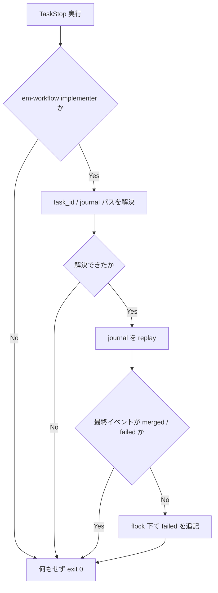

# TaskStop 停止時の journal failed 記録 - 要件定義書

## 1. 概要

### 1.1 背景

em-workflow の implement フェーズは、per-feature の追記専用イベントログ
`journal.jsonl`（`launched` / `merged` / `failed`）でタスクの実行状態を管理している。
journal の書き手は `merge-task.sh` と 3 つの hook に限定されており、
オーケストレーターが直接書くことは規約で禁止されている
（`em-workflow/references/workflow-schema.md`）。

implementer サブエージェントを `TaskStop` で停止すると、`SubagentStop` の
failure net（`em-workflow/hooks/queue_failure_net.py`）が journal に `failed` を
残さない。その結果、そのタスクの最終イベントは `launched` のまま残る。

次に `/em-workflow:develop` で再開すると、
`em-workflow/hooks/queue_launch_guard.py` が「最終イベントが `launched` =
すでに実行中」と判定して起動を拒否する:

```
em-workflow queue guard: タスク task0003 はすでに実行中だよ（journal の最終イベントが
launched）。二重起動になるから今は再起動しないで。
```

launch guard が起動を許可するのは「イベント無し」または「最終イベントが `failed`
（retry 経路）」のときだけである。journal の書き手が限定されているため、
**オーケストレーターは規約を守る限り自力で復旧できない**。

`TaskStop` はユーザールール（`~/.claude/rules/process-termination.md`）が `kill` の
代わりに推奨している正規の停止手段であり、この経路は今後も通る。

### 1.2 目的

`TaskStop` で implementer を停止したときにも journal に `failed` イベントが記録される
ようにし、次回の `/em-workflow:develop` 実行が launch guard にブロックされないようにする。

### 1.3 スコープ

**対象**:

- `TaskStop` 経由の implementer 停止を journal の `failed` イベントとして記録する仕組み
- その仕組みを成立させるために必要な hook の追加と `hooks.json` への登録
- 該当ドキュメント（`references/implement-phase.md` の Supporting cast、
  `references/workflow-schema.md` の journal 書き手の記述）の更新
- 追加した hook のユニットテスト（`tests/test_*.py`）

**スコープ外**:

- `launch guard` 側の判定ロジックの緩和。二重起動を防ぐという役割は維持したいので、
  直すべきは「停止が記録されないこと」であって「記録が無くても起動を許すこと」ではない
- `queue_failure_net.py` の既存の `SubagentStop` 経路の挙動変更
- オーケストレーター（develop skill）が journal を直接書けるようにする規約緩和

## 2. ビジネス要件

### 2.1 ビジネス目標

em-workflow のワークフローが、正規の停止手段を使ったあとに自己復旧できる状態にする。

### 2.2 対象ユーザー

| ユーザータイプ | 説明 |
|----------------|------|
| em-workflow のオーケストレーター | `/em-workflow:develop` を実行する Claude セッション |
| 開発者（人間） | 実行中のワークフローを `TaskStop` で中断し、後で再開する |

### 2.3 期待される効果

- `TaskStop` による中断後、`/em-workflow:develop` の再実行だけでワークフローが再開する
- journal 書き手限定規約に対する逸脱（オーケストレーターによる手動追記）が不要になる
- 中断が journal 上で可視化され、post-mortem 診断の材料が欠けなくなる

## 3. ユースケース

### 3.1 ユースケース一覧

| ID | ユースケース名 | アクター | 優先度 |
|----|----------------|----------|--------|
| UC01 | implementer を TaskStop で中断して後から再開する | 開発者 / オーケストレーター | 高 |
| UC02 | 複数タスク並走中に 1 タスクだけ中断する | 開発者 / オーケストレーター | 高 |
| UC03 | SubagentStop 経由の通常の失敗を記録する（既存挙動） | オーケストレーター | 高 |

### 3.2 ユースケース詳細

#### UC01: implementer を TaskStop で中断して後から再開する

**アクター**: 開発者（`TaskStop` を実行するオーケストレーター経由）

**事前条件**:

- implement フェーズで task0003 の implementer が in-flight
- journal の task0003 の最終イベントが `launched`

**基本フロー**:

1. 開発者が「一旦中断したい」と指示する
2. オーケストレーターが `TaskStop` で task0003 の implementer を停止する
3. 停止を検知した仕組みが journal に task0003 の `failed` イベントを追記する
4. 後日 `/em-workflow:develop` を再実行する
5. wake-phase reconcile が task0003 を `failed` と判定する
6. retry 経路として task0003 の implementer が再起動され、launch guard は許可する

**代替フロー**:

- 停止対象が em-workflow の implementer でない場合: 何も記録せず素通りする
- 停止時点で journal の最終イベントが既に `merged` / `failed` の場合: 追記しない

**事後条件**:

- journal に task0003 の `failed` イベントが 1 行だけ存在する
- オーケストレーターは journal を直接書いていない

#### UC02: 複数タスク並走中に 1 タスクだけ中断する

**アクター**: 開発者

**事前条件**: task0002 / task0003 / task0004 が同時に in-flight

**基本フロー**:

1. task0003 だけを `TaskStop` で停止する
2. journal に追記される `failed` は task0003 のものだけである
3. task0002 / task0004 の journal 状態は `launched` のまま変わらない

**事後条件**:

- 巻き込みで他タスクが `failed` にされていない

#### UC03: SubagentStop 経由の通常の失敗を記録する（既存挙動）

**アクター**: オーケストレーター

**基本フロー**:

1. implementer が merge に到達せず自然停止する
2. `SubagentStop` の failure net が journal に `failed` を追記する

**事後条件**:

- 既存の `queue_failure_net.py` の挙動が本変更の前後で同一である

## 4. 機能要件

### 4.1 機能一覧

| ID | 機能名 | 説明 | 優先度 |
|----|--------|------|--------|
| F01 | 停止経路の切り分け調査 | `TaskStop` が `SubagentStop` を発火するのか、発火するが条件不一致でスキップされているのかを実証的に確定する | 高 |
| F02 | TaskStop 停止の journal 記録 | `TaskStop` による implementer 停止を journal の `failed` として記録する | 高 |
| F03 | 停止対象とタスクの対応付け | `TaskStop` の対象（harness のエージェント識別子）を em-workflow の `taskNNNN` / journal パスへ解決する | 高 |
| F04 | 冪等性の担保 | 同一タスクに対する `failed` の重複追記を避ける | 高 |
| F05 | ドキュメント更新 | journal の書き手一覧と Supporting cast の記述を実装に合わせる | 中 |

### 4.2 機能詳細

#### F01: 停止経路の切り分け調査

**説明**: 実装方式を確定する前に、`TaskStop` 実行時に `SubagentStop` hook が
起動されるかどうかを実証的に確認する。発火するが `queue_failure_net.py` の
識別ロジック（`agent_type` / `# Task assignment` ブロックの探索）で弾かれている
だけなら、修正は既存 hook の識別ロジック側で足りる可能性がある。

**確認内容**:

- `TaskStop` 実行時に `SubagentStop` hook が起動されるか
- 起動される場合、hook 入力に `agent_type` / `agent_transcript_path` が含まれるか
- `TaskStop` ツール呼び出しに対して `PreToolUse` / `PostToolUse` hook が発火するか、
  およびその入力・出力ペイロードの実際の形

**出力**: 調査結果を記録し、F02 / F03 の実装方式をその結果に合わせて確定する。

#### F02: TaskStop 停止の journal 記録

**説明**: `TaskStop` によって停止された implementer のタスクについて、journal に
`failed` イベントを 1 行追記する。

**入力**: hook に渡される停止イベントの JSON

**出力**: `journal.jsonl` への 1 行追記
（`{"event": "failed", "task": "taskNNNN", "at": "<RFC 3339>", "reason": "<停止理由>"}`）

**処理フロー**:



**ビジネスルール**:

- hook は fail-open のネットであり、権威ではない。想定外の状態は黙って exit 0 する
- journal への追記は排他ロック（`flock`）下で行う
- `reason` は `TaskStop` による停止であることが post-mortem で判別できる文言にする

**エラーケース**:

| エラー | 条件 | 対応 |
|--------|------|------|
| タスクを特定できない | 対応付け情報が無い / 壊れている | 何も記録せず exit 0（現状と同じ挙動に退化） |
| journal ディレクトリが無い | feature の worktree ルートが消えている | 何も記録せず exit 0（状態を捏造しない） |
| journal が読めない | I/O エラー | 何も記録せず exit 0 |

#### F03: 停止対象とタスクの対応付け

**説明**: `TaskStop` の入力は harness のエージェント識別子であり、em-workflow の
`taskNNNN` や worktree パスを直接は含まない。両者を対応付ける手段が要る。

**ビジネスルール**:

- 対応付けの記録先は journal と同じ feature ディレクトリ配下に置き、journal 本体
  （追記専用・書き手限定）とは別ファイルにする
- 対応付けが解決できない場合は fail-open（記録せず素通り）

#### F04: 冪等性の担保

**説明**: 追記前に journal を replay し、対象タスクの最終イベントが `merged` または
`failed` のときは追記しない。`SubagentStop` 経路と `TaskStop` 経路の両方が発火した
場合でも `failed` が 2 行にならないこと。

#### F05: ドキュメント更新

**説明**: `references/implement-phase.md` の Supporting cast（hook の一覧）と
`references/workflow-schema.md` の journal 書き手の記述を、追加された書き手を含む
形に更新する。

## 5. 非機能要件

### 5.2 セキュリティ要件

- 入力検証: `task_id` は `^task[0-9]+$`、worktree パスは絶対パスかつ `..` を含まない
  ことを検証する（既存 hook と同一基準）
- ファイル操作: journal / 対応付けファイルの open は `O_NOFOLLOW` を用い、
  シンボリックリンク経由の書き込み先すり替えを防ぐ

### 5.4 保守性要件

- ログ出力: hook は標準出力に決定 JSON 以外を出さない（fail-open 時は無出力）
- ドキュメント: hook の役割を `references/implement-phase.md` に記載する
- テスト: hook はサブプロセスとして JSON を stdin に与えて検証する
  （`test/README.md` の規約に従う）

### 5.5 互換性要件

- Python 3.14 標準ライブラリのみ（外部依存の追加禁止）
- 既存の `SubagentStop` 経路（`queue_failure_net.py`）の挙動を変えない
- hook が未登録・未対応の Claude Code バージョンでも、ワークフローが壊れない
  （現状と同じ挙動に退化するだけ）

## 9. 制約条件

### 9.1 技術的制約

- hook は全て fail-open のネットであり、権威ではない
  （`references/implement-phase.md` の Supporting cast）。この性質は保つ
- journal の書き手は限定されており、オーケストレーターは書けない。書き手を増やす
  場合は `references/workflow-schema.md` の記述も合わせて更新する
- `TaskStop` が `SubagentStop` を発火するのかは未調査であり、まず切り分けが要る
- 既知の関連事象として、launch guard は allow 時点で `launched` を追記する設計のため
  「stale launched」は元々想定されている。ただし既存の緩和策（Stop hook の連続
  ブロック上限、wake-phase の git 実状態 reconcile）はいずれもこのケースでは効かなかった

## 10. 想定される課題とリスク

### 10.1 技術的課題

| 課題 | 影響度 | 対応策 |
|------|--------|--------|
| `TaskStop` に対する hook 入力の実際の形が未確認 | 高 | F01 の切り分け調査を実装前の最初のタスクにする |
| エージェント識別子とタスクの対応付け情報の入手経路が未確認 | 高 | F01 で確認し、入手できない場合は代替の識別手段を検討する |
| hook の追加が既存の並列実行に副作用を与える | 中 | 追記は flock 下、判定は対象タスク限定。他タスクを巻き込まない |

## 11. 成功基準

### 11.1 受け入れ基準

- [ ] `TaskStop` で implementer を停止した後、journal にそのタスクの `failed` イベントが
      記録されている
- [ ] 停止後に `/em-workflow:develop` を再実行すると、launch guard に弾かれずに
      retry 経路として再起動できる
- [ ] オーケストレーターが journal を直接書く必要がない
- [ ] 既存の `SubagentStop` 経由の failure net の挙動は変わらない

## 12. テストシナリオ

### 12.1 テスト観点

- [ ] 正常系: implementer 停止イベントで `failed` が 1 行追記される
- [ ] 正常系: 停止対象が em-workflow implementer でない場合は何も追記されない
- [ ] 異常系: 対応付けが解決できない場合に何も追記されず exit 0 する
- [ ] 異常系: journal ディレクトリが存在しない場合に何も追記されず exit 0 する
- [ ] 境界値: 最終イベントが `merged` / `failed` の場合に追記されない（冪等性）
- [ ] 境界値: 複数タスク in-flight 時、対象タスクのみに `failed` が付く
- [ ] セキュリティ: 不正な `task_id` / 相対パスの worktree パスを拒否する
- [ ] 回帰: 既存の `tests/test_queue_failure_net.py` が全て通る

## 13. 用語定義

| 用語 | 定義 |
|------|------|
| journal | `.claude/worktrees/em-workflow/{feature}/journal.jsonl`。追記専用のイベントログ |
| launch guard | `hooks/queue_launch_guard.py`。二重起動を防ぐ PreToolUse hook |
| failure net | `hooks/queue_failure_net.py`。SubagentStop で `failed` を記録する hook |
| stale launched | 実体が無いのに journal に残る `launched` イベント |
| fail-open | 想定外の状態では判定せず素通りする hook の設計方針 |

## 14. 確認事項

### 14.1 確認済み事項

本 feature は batch モード（無人実行）で起票された。ユーザーとの対話は行われておらず、
Codex CLI も未インストールのため相談ループも実施していない。以下は Notion タスク
本文に明示されていた内容である。

- [x] 直すべき対象: 「停止が記録されないこと」であって「記録が無くても起動を許すこと」ではない
- [x] hook の fail-open 性質は維持する
- [x] `TaskStop` の発火経路は未調査であり、まず切り分けが必要
- [x] 既存の `SubagentStop` 経路の挙動は変えない

### 14.2 未確認・保留事項

タスク本文に無く、実装者が決定した事項は SPEC.md の Assumptions セクションに記録した。

## 15. 参考資料

- Notion タスク: [https://www.notion.so/3ab3509ec8ee81759577e03ff305b12c](https://www.notion.so/3ab3509ec8ee81759577e03ff305b12c)
- `em-workflow/references/implement-phase.md`: Supporting cast / Stale-`launched` caveat
- `em-workflow/references/workflow-schema.md`: journal の書き手限定規約
- `~/.claude/rules/process-termination.md`: `TaskStop` を推奨する停止手順
