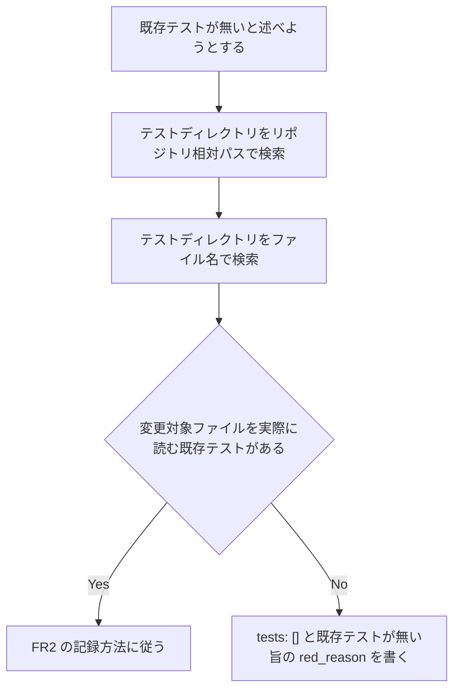

# tests-yaml-existing-test-search - 要件定義書

## 1. 概要

### 1.1 背景
implementer が書く `*.tests.yaml` で、変更対象ファイルに専用テストが無いように見えても、横断的なテスト（`*_invariants.py` / `*_version_bump.py` など）がカバーしている場合がある。このとき既存テストが無いと記録されると、verify / retrospect が参照する永続記録で、既存の耐久不変条件（レジストリ一致・patch 前進など）が存在しないように読める。

### 1.2 目的
- implementer が書く `*.tests.yaml` の `red_reason` / `tests` が、既存テストの有無を検索した事実に基づくようにする。
- verify / retrospect が参照する永続記録で、既存の耐久不変条件（レジストリ一致・patch 前進など）が存在しないと読み手に誤認させない。

### 1.3 スコープ
対象:
- `em-workflow/skills/tdd-testing/SKILL.md` への規律の追加（FR1 / FR2）
- `em-workflow/agents/implementer.md` の Step 4c への反映（FR3）
- `tests/` 配下の再発検出テストモジュールの新規追加（FR4）
- `em-workflow/.claude-plugin/plugin.json` と `.claude-plugin/marketplace.json` の em-workflow エントリの version bump（FR5）

対象外:
- 過去フィーチャーの記録 `test-docs/declared-change-set-implementation/task0002.tests.yaml` の書き換え
- `em-workflow/references/implement-phase.md` の変更
- version bump 用の専用テストモジュールの追加
- `.claude-plugin/marketplace.json` の em-review エントリの変更

## 2. ビジネス要件

### 2.1 ビジネス目標
- implementer が書く `*.tests.yaml` の `red_reason` / `tests` が、既存テストの有無を検索した事実に基づくようにする。
- verify / retrospect が参照する永続記録で、既存の耐久不変条件（レジストリ一致・patch 前進など）が存在しないと読み手に誤認させない。

### 2.2 対象ユーザー
| ユーザータイプ | 説明 |
|----------------|------|
| implementer エージェント | `*.tests.yaml` を書く |
| verify / retrospect | `*.tests.yaml` を永続記録として参照する |

### 2.3 期待される効果
- `*.tests.yaml` の `tests` / `red_reason` が、既存テストを検索した結果と一致する。
- 既存の耐久不変条件が存在しないと読める記録が書かれない。

## 3. ユースケース

### 3.1 ユースケース一覧
| ID | ユースケース名 | アクター | 優先度 |
|----|----------------|----------|--------|
| UC01 | 既存テストの不在を記録する前に検索する | implementer エージェント | 高 |

### 3.2 ユースケース詳細

#### UC01: 既存テストの不在を記録する前に検索する

**アクター**: implementer エージェント

**事前条件**:
- implementer が `*.tests.yaml` のエントリで、`tests: []` と書こうとしている、または `red_confirmed: false` の理由として既存テストの不在を挙げようとしている。

**基本フロー**:
1. 変更対象ファイルを参照する既存テストを、プロジェクトのテストディレクトリからリポジトリ相対パスで検索する。
2. 同じくファイル名（basename）で検索する。
3. 変更対象ファイルを実際に読む既存テストが見つかった場合、エントリの `tests:` にそのモジュール／クラスを列挙する。
4. `red_reason` を「専用の新規モジュール追加はスコープ外だが、既存の X が Y を検出する。今回の変更では red 状態は発生しなかった」という趣旨にする。
5. `red_confirmed` は観測した事実のまま（red を見ていなければ false）とする。

**代替フロー**:
- 検索しても該当テストが無い: 従来どおり `tests: []` と、既存テストが無い旨の `red_reason` を書く。
- 検索にヒットしたテストが実ファイルではなく合成フィクスチャを読んでいる: そのヒットは変更対象ファイルのカバレッジとして扱わない。

**事後条件**:
- エントリの `tests` / `red_reason` が検索の結果に基づいている。

## 4. 機能要件

### 4.1 機能一覧
| ID | 機能名 | 説明 | 優先度 |
|----|--------|------|--------|
| FR1 | 既存テスト検索の必須化（tdd-testing） | 既存テストが無いと述べる前に、変更対象ファイルを参照する既存テストをパスとファイル名で検索する規律を tdd-testing/SKILL.md に追加する | 高 |
| FR2 | 既存テストが見つかった場合の記録方法 | 見つかった既存テストを `tests:` に列挙し、`red_reason` を所定の趣旨にする | 高 |
| FR3 | implementer エージェント定義への反映 | implementer.md の Step 4c に FR1 / FR2 の規律を反映する | 高 |
| FR4 | 再発検出テスト | tdd-testing/SKILL.md と implementer.md が規律を含むことを assert する新規テストモジュールを追加する | 高 |
| FR5 | プラグイン version bump | em-workflow の version を 0.2.8 から 0.2.9 に上げる | 高 |

### 4.2 機能詳細

#### FR1: 既存テスト検索の必須化（tdd-testing）

**説明**: `em-workflow/skills/tdd-testing/SKILL.md` に次の規律を追加する: `*.tests.yaml` のエントリで既存テストが無いと述べる前（`tests: []` と書く場合、または `red_confirmed: false` の理由として既存テストの不在を挙げる場合）に、変更対象ファイルを参照する既存テストをプロジェクトのテストディレクトリから検索して確認する。検索はリポジトリ相対パスだけでなくファイル名（basename）でも行う。

**入力**:
- 変更対象ファイル: パス - エントリが対象とするファイル
- テストディレクトリ: パス - プロジェクトのテストディレクトリ

**出力**:
- 検索結果: 変更対象ファイルを参照する既存テストの有無

**処理フロー**:

**ビジネスルール**:
- 検索はリポジトリ相対パスとファイル名（basename）の両方で行う。
- AC の検証結果がビルドや lint の結果である場合も `tests: []` は引き続き許される。ただし既存テストが無いと述べる場合は、その前に検索する。

**バリデーション**:
該当なし

**エラーケース**:
該当なし

#### FR2: 既存テストが見つかった場合の記録方法

**説明**: 検索で変更対象ファイルを実際に読む既存テストが見つかった場合、そのエントリの `tests:` にそのモジュール／クラスを列挙する。`red_reason` は「専用の新規モジュール追加はスコープ外だが、既存の X が Y を検出する。今回の変更では red 状態は発生しなかった」という趣旨にする。`red_confirmed` は観測した事実のまま（red を見ていなければ false）とする。

**入力**:
- FR1 の検索結果

**出力**:
- `tests`: 見つかった既存テストのモジュール／クラスの列挙
- `red_reason`: 上記の趣旨の文
- `red_confirmed`: 観測した事実

**ビジネスルール**:
- 合成フィクスチャを読むテスト（例: 一時ディレクトリに合成した implementer.md を検査する `tests/test_check_plugin_invariants.py`）のヒットは、変更対象ファイルのカバレッジとして扱わない。

#### FR3: implementer エージェント定義への反映

**説明**: `em-workflow/agents/implementer.md` の Step 4c（test record の記述、`red_confirmed: false` の段落と `tests: []` の段落）に FR1 / FR2 の規律を反映する（tdd-testing スキルを参照する形でもよい）。

**ビジネスルール**:
- `em-workflow/agents/implementer.md` に `# Task assignment` 見出しを追加しない（NFR4）。

#### FR4: 再発検出テスト

**説明**: `tests/` 配下に新規テストモジュールを追加し、tdd-testing/SKILL.md と implementer.md が FR1 / FR2 の規律（既存テストの検索必須・見つかった場合の tests 列挙と red_reason の趣旨）を含むことを assert する。各マッチャーには、規律を欠いた偽サンプルを弾くことを示す否定テストを付ける。

**ビジネスルール**:
- テストは Python 標準ライブラリの unittest のみを使う（NFR1）。

#### FR5: プラグイン version bump

**説明**: `em-workflow/.claude-plugin/plugin.json` と `.claude-plugin/marketplace.json` の em-workflow エントリの version を 0.2.8 から 0.2.9（patch）に上げ、両者を同じ値にする。em-review エントリは変更しない。

**ビジネスルール**:
- plugin.json description の固定アンカー `/em-workflow:develop drives` は残す。

## 5. 非機能要件

### 5.1 パフォーマンス要件
該当なし

### 5.2 セキュリティ要件
該当なし

### 5.3 可用性要件
該当なし

### 5.4 保守性要件
- NFR1: テストコードは Python 標準ライブラリの unittest のみを使う（test/README.md）。ファイル名は `test_<target>.py`、クラスは `Test<Behavior>`、メソッドは `test_<condition>_<expected_result>`。
- NFR2: `python3 -m unittest discover -s tests` がリポジトリルートからすべて通る。
- NFR3: version bump 用の専用テストモジュールは新規に追加しない。既存の `tests/test_spec_file_set_completeness_version_bump.py` と `tests/test_plugin_version_parity.py` が、レジストリ間の一致・patch 前進・キー集合を既に検証している。
- NFR4: `em-workflow/agents/implementer.md` に `# Task assignment` 見出しを追加しない（check-plugin-invariants の forbidden heading 検査。`tests/test_check_plugin_invariants.py` の実リポジトリ検査で落ちる）。

### 5.5 互換性要件
該当なし

## 6. UI/UX要件

### 6.1 画面設計要件
該当なし（UI を持たない変更。エージェント定義・スキル文書・テスト・マニフェストのみ）

### 6.2 画面遷移
該当なし

### 6.3 レスポンシブ対応
該当なし

## 7. データ要件

### 7.1 データモデル概要
該当なし

### 7.2 データ項目
| エンティティ | 項目名 | 型 | 必須 | 説明 |
|--------------|--------|-----|------|------|
| `*.tests.yaml` のエントリ | `tests` | リスト | ○ | 既存テストが見つかった場合はそのモジュール／クラスを列挙する（FR2） |
| `*.tests.yaml` のエントリ | `red_reason` | 文字列 | ○ | 既存テストが見つかった場合は FR2 の趣旨にする |
| `*.tests.yaml` のエントリ | `red_confirmed` | 真偽値 | ○ | 観測した事実のまま |

### 7.3 データ保持期間
該当なし

## 8. 外部連携

### 8.1 連携システム
該当なし

### 8.2 API仕様要件
該当なし

## 9. 制約条件

### 9.1 技術的制約
- テストコードは Python 標準ライブラリの unittest のみを使う（NFR1）。
- `em-workflow/agents/implementer.md` に `# Task assignment` 見出しを追加しない（NFR4）。
- version bump 用の専用テストモジュールは新規に追加しない（NFR3）。

### 9.2 ビジネス上の制約
- 過去フィーチャーの記録 `test-docs/declared-change-set-implementation/task0002.tests.yaml` は書き換えない。

### 9.3 スケジュール制約
該当なし

### 9.4 宣言された変更集合

このフィーチャー固有のパスは手動で列挙せず、create-plan で `workflow.yaml` の各タスクの `files` から導出する（`references/phases/create-plan-phase.md`）。

**デフォルトメンバー**（SPEC作成者が明示的に除外しない限り、常に宣言に含まれる）:
- `feature-docs/tests-yaml-existing-test-search/**`
- `test-docs/tests-yaml-existing-test-search/**`

`feature-docs/tests-yaml-existing-test-search/**` に含まれるもの: `REQUIREMENTS.md`、`SPEC.md`、`IMPLEMENTATION.md`、`workflow.yaml`、`phase-state/`、`tasks/`、`reviews/roundN.yaml`、`VERIFICATION.md`、`retrospect.yaml`、およびデザインステップが生成するデザイン成果物。生成主体は各フェーズドキュメントおよび `references/phase-state.md` を参照（引用のみ、ルールは再掲しない）。

`test-docs/tests-yaml-existing-test-search/**` に含まれるもの: `{T}.tests.yaml`（パス形式: `test-docs/tests-yaml-existing-test-search/{T}.tests.yaml`）。生成主体は `implement-phase.md` を参照（引用のみ、ルールは再掲しない）。

**意味論**:
- デフォルトのメンバーは、SPEC作成者が明示的に除外しない限り宣言に含まれる。除外は意図的な絞り込みであり、記載漏れによる省略ではない。
- この宣言はスーパーセット（superset）の主張であり、実際の変更集合は宣言に含まれる（CONTAINED IN）必要がある。実際には生成されないパスが宣言されていても違反にはならない。implementタスクを1つも生成しないフィーチャーは `test-docs/{feature}/` ディレクトリを生成しないが、宣言された `test-docs/{feature}/**` は依然として正しい。

## 10. 想定される課題とリスク

### 10.1 技術的課題
該当なし

### 10.2 ビジネスリスク
該当なし

## 11. 成功基準

### 11.1 受け入れ基準
- [ ] AC-1（FR1）: tdd-testing/SKILL.md に、既存テストが無いと記録する前に変更対象ファイルを参照する既存テストを検索することが必須だと書かれている。検索対象がパスとファイル名の両方であることが書かれている。
- [ ] AC-2（FR2）: tdd-testing/SKILL.md に、既存テストが見つかった場合は `tests:` にそのモジュール／クラスを列挙し、red_reason を「専用の新規モジュールはスコープ外だが既存の X が Y を検出する、今回の変更では red は発生しなかった」趣旨にすることが書かれている。
- [ ] AC-3（FR3）: implementer.md の Step 4c に同じ規律が書かれている、または tdd-testing の該当規律を明示的に参照している。
- [ ] AC-4（FR4）: 新規テストモジュールが unittest discover で検出され、AC-1〜AC-3 の記述を assert する。規律の記述を取り除いた文書では失敗する（否定テストで証明）。
- [ ] AC-5（FR5）: plugin.json と marketplace.json の em-workflow エントリの version がともに 0.2.9。他のフィールドと em-review エントリは変更されていない。
- [ ] AC-6（NFR2）: `python3 -m unittest discover -s tests` がリポジトリルートで失敗 0 で終わる。

### 11.2 KPI
該当なし

## 12. テストシナリオ

### 12.1 テスト観点
- [ ] 正常系: 新規モジュールで tdd-testing/SKILL.md を読み、既存テスト検索の必須化の記述があることを assert する。
- [ ] 正常系: 新規モジュールで tdd-testing/SKILL.md を読み、見つかった場合の tests 列挙と red_reason の趣旨の記述があることを assert する。
- [ ] 正常系: 新規モジュールで implementer.md の Step 4c 範囲に、同じ規律または tdd-testing の該当規律への参照があることを assert する。
- [ ] 異常系: 規律の記述を欠いた偽の文書サンプルに対して各マッチャーが失敗することを assert する（否定テスト）。
- [ ] version bump（AC-5）: 新規テストは作らず、既存の `tests/test_spec_file_set_completeness_version_bump.py`（`TestPluginManifestVersion` / `TestMarketplaceEntryVersion`）と `tests/test_plugin_version_parity.py`（`TestMarketplaceEntryVersion`）を tests.yaml の tests に列挙する。このフィーチャー自体が FR2 の適用例になる。
- [ ] 境界値: 該当なし
- [ ] セキュリティ: 該当なし
- [ ] パフォーマンス: 該当なし

### 12.2 エッジケース
- 変更対象ファイルが専用テストを持たないように見えるが、横断的なテスト（`*_invariants.py` / `*_version_bump.py` など）がカバーしている（今回の不具合の発生条件）。
- テストがパスを分割して組み立てている（例: `PLUGIN_ROOT / ".claude-plugin" / "plugin.json"`）。そのためリポジトリ相対パスの完全一致検索では見つからず、ファイル名での検索が要る。
- 検索にヒットしたテストが実ファイルではなく合成フィクスチャを読んでいる（例: `tests/test_check_plugin_invariants.py` は一時ディレクトリに合成した implementer.md を検査する）。このヒットは変更対象ファイルのカバレッジにならない。
- 検索しても該当テストが無い: 従来どおり `tests: []` と、既存テストが無い旨の red_reason を書いてよい。
- AC の検証結果がビルドや lint の結果である場合: `tests: []` は引き続き許される。ただし既存テストが無いと述べる場合は、その前に検索する。

## 13. 用語定義

| 用語 | 定義 |
|------|------|
| `*.tests.yaml` | implementer がタスクごとに書くテスト記録（`test-docs/{feature}/{T}.tests.yaml`） |
| `red_reason` | `*.tests.yaml` のエントリで red 状態について述べる項目 |
| `red_confirmed` | `*.tests.yaml` のエントリで red 状態を観測したかを示す項目 |
| 耐久不変条件 | 既存テストが検証する、レジストリ一致・patch 前進などの条件 |

## 14. 確認事項

### 14.1 確認済み事項
なし

### 14.2 未確認・保留事項
requirements-analyst が採用した前提（いずれも覆すことができる）:
- [ ] PR #18 の `test-docs/declared-change-set-implementation/task0002.tests.yaml`（過去フィーチャーの記録）は書き換えない。対象は今後 implementer が書く記録の規律だけとする。
- [ ] LLM の実行時の振る舞いはユニットテストで直接観測できないため、再発検出テストは規律を定める文書（SKILL.md / implementer.md）の記述を静的に検査する形とする。これはこのリポジトリの既存の慣習（例: `tests/test_refitted_worker_agents.py`）に従う。
- [ ] `em-workflow/references/implement-phase.md` は変更しない。tests_yaml_path を渡すことだけを定めており、red_reason / red_confirmed の規律を持たないため。
- [ ] version は patch 単位で上げる（0.2.8 → 0.2.9）。`.claude/rules/core-plugin-version-bump.md` の「挙動の修正は patch」に従う。
- [ ] 既存テストの version 検査は耐久不変条件（major/minor 基準より後・patch 前進・レジストリ一致）で書かれており、0.2.9 はそれを満たす。plugin.json description の固定アンカー `/em-workflow:develop drives` は残す。

## 15. 参考資料

- `em-workflow/skills/tdd-testing/SKILL.md`
- `em-workflow/agents/implementer.md`
- `tests/test_spec_file_set_completeness_version_bump.py`
- `tests/test_plugin_version_parity.py`
- `tests/test_check_plugin_invariants.py`
- `.claude/rules/core-plugin-version-bump.md`
