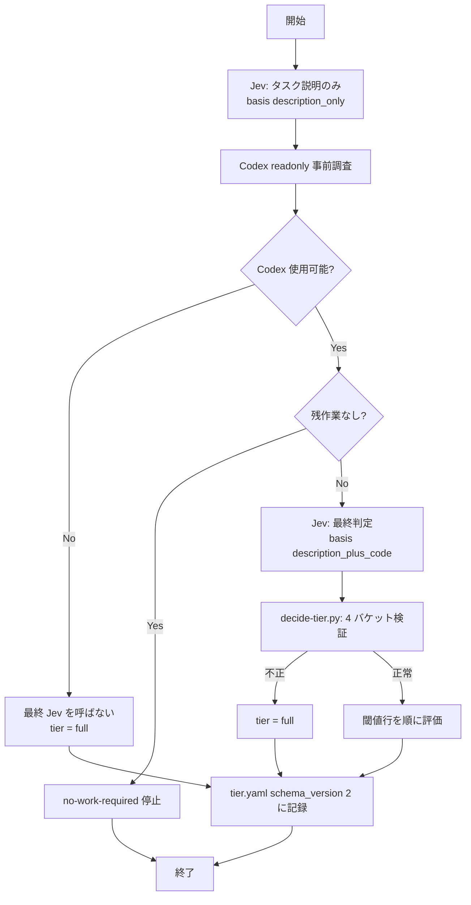
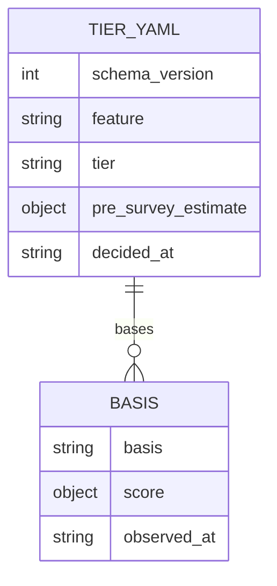

# tier-decision-staged-jev - 要件定義書

## 1. 概要

### 1.1 背景
現行の em-workflow の tier 判定は、2 つの読み取りが異なる tier を示した場合に full へ倒す規則（`decided_by fallback_matrix:readings_disagree`）と、reduced 条件の `P(0) >= 0.40` の下限を持つ。このため、ルール追加とテスト追加だけの小さいタスク（例: loop-develop の triage-completion-judgment。最終読み取りは P(0)=0.09, P(1)=0.90）が full に強制される。

### 1.2 目的
- em-workflow の tier 判定を 3 段階で行う。タスク説明だけで Jev を呼び、次に Codex でコードの事実を調査し、最後にタスク説明と両方の JSON を入力として Jev を呼ぶ。
- tier は最終 Jev のバケット 0〜3 の確率だけで決める。ルール追加＋テスト追加の小さいタスクが full に強制されず reduced に到達するようにする。

### 1.3 スコープ
- 対象:
  - `em-workflow/skills/develop/SKILL.md` の Step A の tier 判定手順
  - `scripts/decide-tier.py`
  - `references/tier-rules.yaml`
  - `references/phases/create-spec-phase.md`
  - `references/workflow-schema.md`
  - `references/phase-state.md` の tier 判定永続化の節（`feature-docs/{feature}/phase-state/tier.yaml`）
  - `tests/` 配下のテスト
  - `em-workflow/.claude-plugin/plugin.json` と `.claude-plugin/marketplace.json` の version
- 対象外:
  - `review-phase.md` とレビュールール（tier の語彙を追加しない）
  - デザインステップ（UI を持たないためスキップ）

## 2. ビジネス要件

### 2.1 ビジネス目標
- em-workflow の tier 判定を、Jev（タスク説明のみ）→ Codex によるコードの事実調査 → Jev（タスク説明＋両方の JSON）の 3 段階で行う。
- tier はバケット 0〜3 に対する最終 Jev の確率だけで決める。ルール追加＋テスト追加の小さいタスク（例: loop-develop の triage-completion-judgment。最終読み取り P(0)=0.09, P(1)=0.90）が full に強制されず reduced に到達する。

### 2.2 対象ユーザー
| ユーザータイプ | 説明 |
|----------------|------|
| develop オーケストレーター | `em-workflow/skills/develop/SKILL.md` の Step A で tier 判定手順を実行する主体 |

### 2.3 期待される効果
- ルール追加＋テスト追加の小さいタスクが reduced に到達する。
- tier が最終読み取りの確率だけで決まり、2 つの読み取りの不一致によって full に倒れなくなる。

## 3. ユースケース

### 3.1 ユースケース一覧
| ID | ユースケース名 | アクター | 優先度 |
|----|----------------|----------|--------|
| UC01 | 3 段階の tier 判定 | develop オーケストレーター | 高 |

### 3.2 ユースケース詳細

#### UC01: 3 段階の tier 判定

**アクター**: develop オーケストレーター（Step A）

**事前条件**:
- タスク説明がある。

**基本フロー**:
1. 判定スキル `~/.claude/skills/jev` を `--json-input` / `--json-output` で、タスク説明だけを入力として呼ぶ（第 1 読み取り、basis `description_only`）。
2. `run_codex_exec.sh readonly` で Codex の readonly 事前調査を行う。
3. 判定スキルを再度呼ぶ。入力はタスク説明、第 1 Jev の JSON 結果全体（confidence を含む）、Codex 事前調査の JSON（最終読み取り、basis `description_plus_code`）。
4. `scripts/decide-tier.py` が最終読み取りのバケット確率を検証し、閾値行で tier を決める。
5. 判定結果を `feature-docs/{feature}/phase-state/tier.yaml`（schema_version 2）に記録する。

**代替フロー**:
- Codex 事前調査が残作業なしと報告した場合、既存の no-work-required 停止により、最終 Jev 呼び出しの前、かつワークフローのどのステップよりも前に実行を終える。
- Codex 事前調査が使用不可（非ゼロ終了、出力が JSON として解析できない、または必須フィールドの欠落）の場合、最終 Jev 呼び出しは行わず、tier は full。
- いずれかの Jev 呼び出し（タスク説明のみ、または最終）が非ゼロで終了した場合、判定スキル使用不可として tier は full。
- 第 1 Jev 呼び出しが使用不可でも Codex 事前調査は実行する（no-work-required 停止に到達できるようにするため）。この場合も tier は full。

**事後条件**:
- tier（minimal / reduced / full）が決まり、tier.yaml に記録されている。
- ゲート（gate_id）もユーザーへの質問も発生していない。

## 4. 機能要件

### 4.1 機能一覧
| ID | 機能名 | 説明 | 優先度 |
|----|--------|------|--------|
| FR1 | 段階的な呼び出し順序 | Jev（タスク説明のみ）→ Codex readonly 事前調査 → Jev（最終判定）の順に呼ぶ | 高 |
| FR2 | 最終 Jev の入力 | タスク説明、第 1 Jev の JSON 結果全体、Codex 事前調査の JSON を渡す | 高 |
| FR3 | 最終 Jev の 4 バケットと検証 | バケット 0〜3 の確率を検証し、不正なら full | 高 |
| FR4 | 最終確率のみによる tier 判定 | 最終読み取りのバケット確率だけで閾値行を評価する | 高 |
| FR5 | 不一致規則の削除 | 2 つの読み取りの不一致で full に倒す規則を削除する | 高 |
| FR6 | tier-rules.yaml のバケット説明 | question_set にバケット 0〜3 の説明を定義する | 中 |
| FR7 | Codex の事実フィールド | codex_output_schema に 7 つの事実フィールドを追加する | 中 |
| FR8 | Codex 使用不可 → full | Codex 事前調査が使用不可なら最終 Jev を呼ばず full | 高 |
| FR9 | Jev 使用不可 → full | いずれかの Jev 呼び出しの非ゼロ終了で full | 高 |
| FR10 | 判定記録 | tier.yaml を schema_version 2 にする | 高 |
| FR11 | 射影の更新 | 判定記録を参照する表・説明・retrospect ブロックを新しい記録に合わせる | 中 |
| FR12 | no-work 停止の維持 | 残作業なしの報告で最終 Jev 前に停止する | 高 |

### 4.2 機能詳細

#### FR1: 段階的な呼び出し順序

**説明**: `em-workflow/skills/develop/SKILL.md` の Step A の tier 判定手順は、次の順に呼び出す。
1. 判定スキル `~/.claude/skills/jev`（`--json-input` / `--json-output`）をタスク説明だけで呼ぶ。
2. `run_codex_exec.sh readonly` による Codex の readonly 事前調査。
3. 最終判定として、判定スキルを再度呼ぶ。

**処理フロー**:

いずれかの Jev 呼び出しが非ゼロ終了した場合の扱いは FR9 のとおり（tier は full）。

#### FR2: 最終 Jev の入力

**説明**: 最終 Jev 呼び出しの入力は、次の 3 つを含む。

**入力**:
- タスク説明
- 第 1 Jev 呼び出しの JSON 結果全体（confidence を含む）
- Codex 事前調査の JSON

#### FR3: 最終 Jev の 4 バケットと検証

**説明**: 最終 Jev の結果は、バケット `"0"`、`"1"`、`"2"`、`"3"` の確率を持つ。どの閾値行を評価するよりも前に、`scripts/decide-tier.py` が確率を検証する。許容誤差は `references/tier-rules.yaml` に宣言されたメンバーとする（初期値 0.02）。

**バリデーション**:
| 項目 | ルール | 不合格時 |
|------|--------|----------|
| バケットのキー | `"0"`〜`"3"` の 4 つがすべて存在する | tier は full。理由に該当バケットを示す |
| 各バケットの値 | 有限の実数で、[0, 1] の範囲 | tier は full。理由に該当バケットを示す |
| 合計 | 4 つの合計と 1 の差が許容誤差以内 | tier は full。理由に合計を示す |

#### FR4: 最終確率のみによる tier 判定

**説明**: tier は最終読み取りのバケット確率だけで決める。第 1 読み取り（タスク説明のみ）は閾値行で評価しない。

**ビジネスルール**:
- `tier-rules.yaml` の閾値行をバケット 0〜3 で次のとおり定義し直す。上から順に評価し、最初に一致した行を採用する。

| 順 | tier | 条件 |
|----|------|------|
| 1 | minimal | P(0) >= 0.80 |
| 2 | reduced | P(0)+P(1) >= 0.85（P(0) の下限なし） |
| 3 | full | 上記以外 |

- `expectation_clear` と `confidence` はどの行の閾値メンバーにもしない。記録のみ行う。

#### FR5: 不一致規則の削除

**説明**: 2 つの読み取りが異なる tier を示した場合に full へ倒す規則（`decided_by fallback_matrix:readings_disagree`）を、次のファイルから削除する。
- `scripts/decide-tier.py`
- `references/tier-rules.yaml`
- `skills/develop/SKILL.md`
- `references/phases/create-spec-phase.md`

評価器は 2 読み取りの `readings` 入力を受け付けなくなり、最終スコアオブジェクト 1 つを受け取る。

#### FR6: tier-rules.yaml のバケット説明

**説明**: `references/tier-rules.yaml` の `question_set` に、バケット 0〜3 それぞれの説明を定義する。説明は両方の Jev 呼び出しに渡す。

| バケット | 説明 |
|----------|------|
| 0 | 文言またはルール本文の変更のみ。新しいロジックもテストの変更もない |
| 1 | ルール追加とテスト追加の組み合わせ、または少数ファイルの小さな変更と小さなテスト変更 |
| 2 | 新しいロジック、複数モジュールにまたがる変更、または外部契約の変更 |
| 3 | 広範な横断的変更、新しいファイル・モジュール・依存の追加、またはアーキテクチャの変更 |

**ビジネスルール**:
- 質問文言を外部スキルに割り当てている `question_set` のコメントを、上記に合わせて更新する。
- jev と typesafe-ai のスキル文書から文を複写しない。

#### FR7: Codex の事実フィールド

**説明**: `tier-rules.yaml` の `codex_output_schema` は既存フィールドを維持し、次の事実を報告するフィールドを追加する。各フィールドは値の語彙を定義する。Codex は事実だけを報告し、規模の判断はしない。

| 報告する事実 | フィールド名（仮） | 値の語彙（仮） |
|--------------|--------------------|----------------|
| テスト変更の種類（既存チェックに 1:1 でケースを足すだけか、新しい振る舞いのテストを書くか） | `test_change_kind` | `none` \| `extend_existing_one_to_one` \| `new_behavior_tests` |
| 追加テストケースの見込み数 | `added_test_cases_approx` | 整数 |
| 本体変更の種類（文言・ルール追加か、新しいロジックか） | `body_change_kind` | `wording_or_rule_addition` \| `new_logic` |
| 変更の閉じ具合（1 関数内 / 1 モジュール内 / 複数モジュール） | `change_containment` | `single_function` \| `single_module` \| `multiple_modules` |
| 変更箇所の呼び出し元と依存の数 | `caller_and_dependency_count` | 整数 |
| 外部契約（引数、戻り値、ファイル形式、設定キーなど）の変更有無 | `changes_external_contract` | 真偽値 |
| 振る舞いの変更有無 | `changes_behavior` | 真偽値 |

#### FR8: Codex 使用不可 → full

**説明**: Codex 事前調査が使用不可（非ゼロ終了、出力が JSON として解析できない、または必須フィールドの欠落）の場合、最終 Jev 呼び出しを行わず、tier は full。次の 3 箇所が同じ扱いを記述する。
- `tier-rules.yaml` の `fallback_matrix`（`jev_only_usable` 行。action は full になる）
- `scripts/decide-tier.py`（`codex_available=false` なら、スコアにかかわらず full）
- `SKILL.md` の step 6

#### FR9: Jev 使用不可 → full

**説明**: いずれかの Jev 呼び出し（タスク説明のみ、または最終）の非ゼロ終了を「判定スキル使用不可」とみなし、tier は full。既存の `jev_unusable` 行と `jev_exit_codes` 表による。

#### FR10: 判定記録

**説明**: `feature-docs/{feature}/phase-state/tier.yaml` を schema_version 2 にする。

**出力**:
| 項目 | 内容 |
|------|------|
| `schema_version` | 2 |
| `feature` | フィーチャー名 |
| `tier` | 決定した tier |
| `bases` | 第 1 読み取り（basis `description_only`）と最終読み取り（basis `description_plus_code`）。各エントリは当該 Jev 呼び出しのスコアオブジェクト全体（0〜3 の確率、`expectation_clear`、`confidence`）と `observed_at` を持つ |
| `pre_survey_estimate` | Codex の JSON をそのまま保持する |
| `decided_at` | 判定時刻 |

- 呼び出しを行わなかった、または使用不可だった場合は、そのエントリまたは値を持たず、フォールバック理由を記録する。

#### FR11: 射影の更新

**説明**: 次の 3 箇所を新しい判定記録に合わせて更新する。
- `references/phases/create-spec-phase.md` の Tier-decision record 対応表
- `references/workflow-schema.md` の `tier_decision.confidence` の説明
- `skills/develop/SKILL.md` の retrospect `signals.tier_decision` ブロック

**ビジネスルール**:
- `rationale` メンバーは、2 つの読み取りが一致したかどうかを記述しない。tier を決めた最終読み取り、またはフォールバックを要約する。
- `tier_decision` のサブフィールドはちょうど 4 つのまま。

#### FR12: no-work 停止の維持

**説明**: Codex 事前調査が残作業なしと報告した場合、既存の no-work-required 停止により、最終 Jev 呼び出しの前、かつワークフローのどのステップよりも前に実行を終える。

**エラーケース**:
| エラー | 条件 | 対応 |
|--------|------|------|
| Codex 使用不可 | 非ゼロ終了、JSON として解析不能、必須フィールド欠落 | 最終 Jev を呼ばず tier は full（FR8） |
| Jev 使用不可 | いずれかの Jev 呼び出しの非ゼロ終了 | tier は full（`fallback_matrix:jev_unusable`）（FR9） |
| 最終確率が不正 | バケット欠落、非有限値、範囲外、合計が許容誤差外 | tier は full。理由に該当バケットまたは合計を示す（FR3） |
| 旧形式の入力 | 2 読み取りの `readings` ペイロード | 不正入力として tier は full（FR5） |

## 5. 非機能要件

### 5.1 パフォーマンス要件
- 該当なし

### 5.2 セキュリティ要件
- 該当なし

### 5.3 可用性要件
- NFR1: 決定的でフェイルセーフな評価器。`scripts/decide-tier.py` はモデル推論も独自の呼び出しも行わず、常に終了コード 0 で終わる。欠落・不正形式・範囲外の入力には、理由を示して full を返す。非有限の JSON トークンを出力しない。すべての下限と合計の許容誤差はルール表から読み、評価器に数値の既定値を持たない。

### 5.4 保守性要件
- NFR2: 閾値は `tier-rules.yaml` が持つ。`skills/develop/SKILL.md` の tier 判定の節と `references/workflow-schema.md` の tier の節は、閾値のリテラル、`P(0)`、`expectation_clear` を再掲しない。どこにも confidence 単独に対する閾値を置かない。
- NFR3: テストの規約。テストは `tests/` 配下で標準ライブラリの `unittest` だけを使う（`python3 -m unittest discover -s tests` で実行）。生テキストのマッチャーには、必ず否定の証明と空振り防止のガードを組にする。
- NFR4: ゲートと質問を追加しない。tier 判定の経路は、対話モードでもバッチモードでも gate_id もユーザーへの質問も導入しない。
- NFR6: レビュー文書は変更しない。`review-phase.md` とレビュールールに tier の語彙を追加しない（`tests/test_tier_spec_perspective.py` AC-6）。

### 5.5 互換性要件
- NFR5: プラグインの version を上げる。`em-workflow/.claude-plugin/plugin.json` と `.claude-plugin/marketplace.json`（いずれも現在 0.2.9）の em-workflow の version を、同じ変更の中で同じ値に上げる。
- schema_version 1 の既存 tier.yaml は、再開時にそのまま再利用し、再判定しない。

## 6. UI/UX要件

### 6.1 画面設計要件
該当なし（UI を持たない）

### 6.2 画面遷移
該当なし

### 6.3 レスポンシブ対応
該当なし

## 7. データ要件

### 7.1 データモデル概要

### 7.2 データ項目
| エンティティ | 項目名 | 型 | 必須 | 説明 |
|--------------|--------|-----|------|------|
| tier.yaml | schema_version | 整数 | ○ | 2 |
| tier.yaml | feature | 文字列 | ○ | フィーチャー名 |
| tier.yaml | tier | 文字列 | ○ | minimal / reduced / full |
| tier.yaml | bases | 配列 | ○ | 第 1 読み取りと最終読み取り。呼び出しなし・使用不可のエントリは持たない |
| tier.yaml | pre_survey_estimate | オブジェクト | × | Codex の JSON をそのまま保持。呼び出しなし・使用不可なら持たない |
| tier.yaml | decided_at | 文字列 | ○ | 判定時刻 |
| bases の各エントリ | basis | 文字列 | ○ | `description_only` または `description_plus_code` |
| bases の各エントリ | スコアオブジェクト | オブジェクト | ○ | 当該 Jev 呼び出しのスコア全体（0〜3 の確率、`expectation_clear`、`confidence`） |
| bases の各エントリ | observed_at | 文字列 | ○ | 観測時刻 |

呼び出しを行わなかった、または使用不可だった場合は、フォールバック理由を記録する。

### 7.3 データ保持期間
該当なし

## 8. 外部連携

### 8.1 連携システム
| システム名 | 連携方法 | データ |
|------------|----------|--------|
| 判定スキル `~/.claude/skills/jev` | `--json-input` / `--json-output` | 入力: タスク説明（第 1）、タスク説明＋第 1 Jev の JSON＋Codex の JSON（最終）。出力: バケット 0〜3 の確率、`expectation_clear`、`confidence` |
| Codex | `run_codex_exec.sh readonly` | 出力: `codex_output_schema` に沿った事実の JSON |

### 8.2 API仕様要件
- 判定スキルの終了コードは既存の `jev_exit_codes` 表に従い、非ゼロ終了は使用不可として扱う。
- Codex は事実だけを報告し、規模の判断をしない。

## 9. 制約条件

### 9.1 技術的制約
- `scripts/decide-tier.py` はモデル推論も独自の呼び出しも行わない。
- 閾値と合計の許容誤差は `references/tier-rules.yaml` だけが持つ。
- テストは標準ライブラリの `unittest` だけを使う。
- バケット説明に jev と typesafe-ai のスキル文書の文を複写しない。

### 9.2 ビジネス上の制約
- tier 判定の経路にゲートもユーザーへの質問も追加しない。
- `review-phase.md` とレビュールールは変更しない。

### 9.3 スケジュール制約
- 該当なし

### 9.4 宣言された変更集合

このフィーチャー固有のパスは手動で列挙せず、create-plan で `workflow.yaml` の各タスクの `files` から導出する（`references/phases/create-plan-phase.md`）。

**デフォルトメンバー**（SPEC作成者が明示的に除外しない限り、常に宣言に含まれる）:
- `feature-docs/{feature}/**`
- `test-docs/{feature}/**`

`feature-docs/{feature}/**` に含まれるもの: `REQUIREMENTS.md`、`SPEC.md`、`IMPLEMENTATION.md`、`workflow.yaml`、`phase-state/`、`tasks/`、`reviews/roundN.yaml`、`VERIFICATION.md`、`retrospect.yaml`、およびデザインステップが生成するデザイン成果物。生成主体は各フェーズドキュメントおよび `references/phase-state.md` を参照（引用のみ、ルールは再掲しない）。

`test-docs/{feature}/**` に含まれるもの: `{T}.tests.yaml`（パス形式: `test-docs/{feature}/{T}.tests.yaml`）。生成主体は `implement-phase.md` を参照（引用のみ、ルールは再掲しない）。

**意味論**:
- デフォルトのメンバーは、SPEC作成者が明示的に除外しない限り宣言に含まれる。除外は意図的な絞り込みであり、記載漏れによる省略ではない。
- この宣言はスーパーセット（superset）の主張であり、実際の変更集合は宣言に含まれる（CONTAINED IN）必要がある。実際には生成されないパスが宣言されていても違反にはならない。implementタスクを1つも生成しないフィーチャーは `test-docs/{feature}/` ディレクトリを生成しないが、宣言された `test-docs/{feature}/**` は依然として正しい。

## 10. 想定される課題とリスク

### 10.1 技術的課題
| 課題 | 影響度 | 対応策 |
|------|--------|--------|
| Codex のフィールド名と語彙は仮置き（A10） | 低 | 実装時に確定する。変更は可逆 |
| バケット 2・3 の説明文は仮置き（A9） | 低 | 変更は可逆 |
| 合計の許容誤差の初期値 0.02 は仮置き（A8） | 低 | `tier-rules.yaml` の値として変更可能 |

### 10.2 ビジネスリスク
| リスク | 発生確率 | 影響度 | 対応策 |
|--------|----------|--------|--------|
| 該当なし | - | - | - |

## 11. 成功基準

### 11.1 受け入れ基準
- [ ] AC1（FR1, FR2）: SKILL.md の tier 判定手順が、Jev（タスク説明のみ）→ Codex 調査 → Jev（タスク説明＋両方の JSON）の順序を記述し、最終呼び出しが第 1 Jev の結果（confidence を含む）を受け取ることを記述している。
- [ ] AC2（FR3, FR4）: decide-tier.py は、4 バケットが正しい最終スコアを受け取ると、その確率だけで tier を決める。P(0)=0.09, P(1)=0.90, P(2)=0.01, P(3)=0.00 は reduced。P(0)=0.85 は `expectation_clear` の値にかかわらず minimal。P(0)=0.50, P(1)=0.30 は full。
- [ ] AC3（FR3）: バケットの欠落、非有限または範囲外のバケット、許容誤差外の合計は full になり、理由に該当バケットまたは合計を示す。
- [ ] AC4（FR5）: 文字列 `readings_disagree` が `em-workflow/` のどこにも現れず、2 つの読み取りの不一致で full に倒す規則がない。
- [ ] AC5（FR7）: `tier-rules.yaml` の `codex_output_schema` が、既存フィールドに加えて 7 つの新しい事実フィールドを、それぞれ値の語彙付きで持つ。
- [ ] AC6（FR10）: `phase-state.md` の tier 判定永続化の節が tier.yaml schema_version 2 を定義し、`bases` が第 1 と最終の Jev スコアオブジェクトを、`pre_survey_estimate` が Codex の JSON を保持する。
- [ ] AC7（FR8）: `codex_available=false` のとき、decide-tier.py は本来 minimal になるスコアでも full を返す。SKILL.md の step 6 と `tier-rules.yaml` の `fallback_matrix` が同じ扱いを記述している。
- [ ] AC8（FR6）: `tier-rules.yaml` の `question_set` がバケット 0〜3 の説明を定義し、ルール追加＋テスト追加がバケット 1 にある。
- [ ] AC9（NFR1, NFR2, NFR3, NFR5）: `python3 -m unittest discover -s tests` が通り、plugin.json と marketplace.json が同じ引き上げ後の em-workflow の version を持つ。

### 11.2 KPI
| 指標 | 目標値 | 測定方法 |
|------|--------|----------|
| 該当なし | - | - |

## 12. テストシナリオ

### 12.1 テスト観点
- [ ] 正常系: triage の事例（最終 P(0)=0.09, P(1)=0.90, P(2)=0.01, P(3)=0.00、両ツール使用可能）で tier は reduced、`decided_by threshold_rows:reduced`（TS1）
- [ ] 正常系: 最終 P(0)=0.37, P(1)=0.59, P(2)=0.03, P(3)=0.01（以前は full に固定されていた）で tier は reduced（TS2）
- [ ] 正常系: 最終 P(0)=0.85 で `expectation_clear` 0.1 の場合と `expectation_clear` なしの場合、いずれも minimal（TS3）
- [ ] 正常系: 最終 P(0)=0.50, P(1)=0.30, P(2)=0.15, P(3)=0.05 で full（TS4）
- [ ] 境界値: P(0)=0.80 ちょうどで minimal、P(0)+P(1)=0.85 ちょうどで reduced（TS4）
- [ ] 異常系: 最終スコアにバケット `"3"` がない、P(2)=NaN、P(1)=1.2、合計 1.10 のそれぞれで full。理由に該当バケットまたは合計を示し、出力は厳密に解析可能な JSON、終了コード 0（TS5）
- [ ] 異常系: `em-workflow/` に `readings_disagree` が現れず、旧形式の 2 読み取り `readings` ペイロードは不正として full（TS6）
- [ ] 異常系: `codex_available=false` で本来 minimal のスコアでも full。閾値行ではなく `fallback_matrix` の行で決まる（TS7）
- [ ] 異常系: `jev_available=false`（非ゼロ終了 1、2、75）で、Codex 使用可能・不可のいずれでも full、`decided_by fallback_matrix:jev_unusable`（TS8）
- [ ] 文書適合: SKILL.md の tier の節の生テキスト適合（段階の順序、最終入力の内容、Codex 使用不可の扱い、no-work 停止、閾値リテラルなし、gate_id / AskUserQuestion なし）。各マッチャーは偽造サンプルによる否定の証明と組にし、実テキストで合格、偽造サンプルで不合格（TS9）
- [ ] 文書適合: `tier-rules.yaml` の生テキスト / YAML 適合（4 つのバケット説明、ルール＋テストがバケット 1、7 つの Codex 事実フィールドと語彙、合計の許容誤差の宣言、jev と typesafe-ai の SKILL.md から複写した長い行がない）（TS10）
- [ ] 文書適合: `phase-state.md`、`create-spec-phase.md` の対応表、`workflow-schema.md` の tier の節、SKILL.md の retrospect ブロック。schema_version 2 のフィールドが定義され、対応表がすべてのフィールドを網羅し、`tier_decision` のサブフィールドがちょうど 4 つのままで、`rationale` が読み取りの一致に言及しない（TS11）
- [ ] 版数: plugin.json と marketplace.json の em-workflow の version が等しく、0.2.9 より大きい（TS12）
- [ ] セキュリティ: 該当なし
- [ ] パフォーマンス: 該当なし

## 13. 用語定義

| 用語 | 定義 |
|------|------|
| Jev（判定スキル） | `~/.claude/skills/jev`。`--json-input` / `--json-output` で呼び出す |
| Codex 事前調査 | `run_codex_exec.sh readonly` による readonly のコード事実調査 |
| バケット 0〜3 | 変更規模の区分。説明は `tier-rules.yaml` の `question_set` に定義する |
| 第 1 読み取り | タスク説明だけで呼んだ Jev の結果。basis `description_only` |
| 最終読み取り | タスク説明＋第 1 Jev の JSON＋Codex の JSON で呼んだ Jev の結果。basis `description_plus_code` |
| tier | minimal / reduced / full |
| スコアオブジェクト | Jev 呼び出しの結果全体（0〜3 の確率、`expectation_clear`、`confidence`） |

## 14. 確認事項

### 14.1 確認済み事項
バッチモードで判断した内容を記録する。

- [x] create-spec.tier.reduced-threshold（A1）: reduced 条件は P(0)+P(1) >= 0.85 だけ。P(0) >= 0.40 の下限は削除する（drop_p0_floor、batch-codex-consultation）
- [x] create-spec.tier.rule-plus-test-bucket（A2）: ルール追加＋テスト追加はバケット 1。バケット 0 はテスト変更なしの文言・ルール本文の変更（bucket_1、batch-codex-consultation）
- [x] create-spec.tier.codex-unavailable（A3）: Codex が使用不可なら最終 Jev 呼び出しを省略し、tier は full。`tier-rules.yaml`、`decide-tier.py`、テストを SKILL.md に揃える（full、batch-codex-consultation）
- [x] create-spec.tier.minimal-expectation-clear（A4）: 閾値行は最終の 0〜3 の確率だけを見る。`expectation_clear` と `confidence` は記録のみ（probabilities_only、batch-codex-consultation）
- [x] create-spec.tier.bucket-description-home（A5）: バケット 0〜3 の説明は `tier-rules.yaml` の `question_set` に置く（tier_rules_yaml、batch-codex-consultation）
- [x] create-spec.tier.probability-validation（A6）: 最終確率は 4 バケットすべてを必須とし、それぞれ [0,1] の有限値、合計は `tier-rules.yaml` に宣言した許容誤差以内。満たさなければ full（four_buckets_and_sum、batch-codex-consultation）
- [x] create-spec.design-step（A7）: デザインステップはスキップする（decide_autonomously、batch-decision-table）

### 14.2 未確認・保留事項
- なし（status: tbd の要件はない）

### 14.3 前提
- A8: 合計の許容誤差の `tier-rules.yaml` での初期値は 0.02。
- A9: バケット 2 は新しいロジック、複数モジュールにまたがる変更、または外部契約の変更。バケット 3 は広範な横断的変更、新しいファイル・モジュール・依存の追加、またはアーキテクチャの変更。
- A10: Codex のフィールド名と語彙は仮置きで、`test_change_kind`（`none` | `extend_existing_one_to_one` | `new_behavior_tests`）、`added_test_cases_approx`（整数）、`body_change_kind`（`wording_or_rule_addition` | `new_logic`）、`change_containment`（`single_function` | `single_module` | `multiple_modules`）、`caller_and_dependency_count`（整数）、`changes_external_contract`（真偽値）、`changes_behavior`（真偽値）。既存フィールドは維持する。
- A11: decision_basis の値は維持する。`description_only` は第 1 読み取り、`description_plus_code` は最終読み取りを表す。
- A12: 再開時、既存の schema_version 1 の tier.yaml はそのまま再利用し、再判定しない。
- A13: 第 1 Jev 呼び出しが使用不可でも Codex 事前調査は実行する（no-work-required 停止に到達できるようにするため）。この場合も tier は full。

## 15. 参考資料

- `em-workflow/skills/develop/SKILL.md`
- `scripts/decide-tier.py`
- `references/tier-rules.yaml`
- `references/phases/create-spec-phase.md`
- `references/workflow-schema.md`
- `references/phase-state.md`
- `tests/test_tier_decision_record.py`
- `tests/test_tier_spec_perspective.py`
